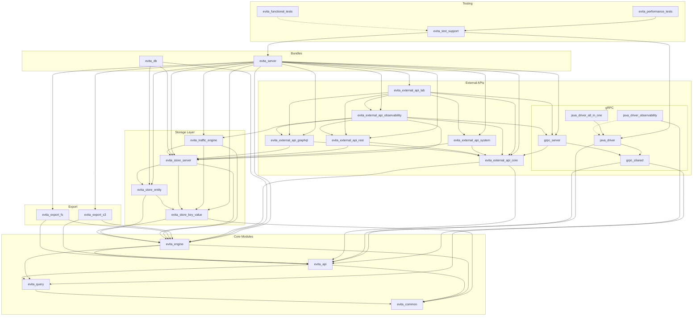

<h1 align="center" style="border-bottom: none">
    <a href="https://evitadb.io" target="_blank"></a><br>evitaDB
</h1>

<p align="center">Visit <a href="https://evitadb.io" target="_blank">evitadb.io</a> for the full documentation,
examples and guides.</p>

<p align="center">
  <a href="https://github.com/FgForrest/evitaDB/releases" title="Build"></a>
  &nbsp;
  <a href="https://codecov.io/gh/FgForrest/evitaDB"></a>
  &nbsp;
  <a href="https://github.com/FgForrest/evitaDB" title="Platform"></a>
  &nbsp;
  <a href="https://discord.gg/VsNBWxgmSw" title="Discord"></a>
  &nbsp;
  <a href="https://github.com/FgForrest/evitaDB/actions/workflows/ci-dev.yml" title="GitHub Workflow Status"></a>
  &nbsp;
  <a href="https://github.com/FgForrest/evitaDB/blob/master/LICENSE" title="License"></a>
</p>

<p align="center">
  <a href="https://evitadb.io/en/blog" title="Blog">
    <picture>
      <source media="(prefers-color-scheme: dark)" srcset="https://img.icons8.com/carbon-copy/100/FFFFFF/blog.png" width="50px">
      <source media="(prefers-color-scheme: light)" srcset="https://img.icons8.com/carbon-copy/100/000000/blog.png" width="50px">
      
    </picture>
  </a>
  &nbsp;
  <a href="https://evitadb.io/documentation/index" title="Documentation">
    <picture>
      <source media="(prefers-color-scheme: dark)" srcset="https://img.icons8.com/carbon-copy/100/FFFFFF/saving-book.png" width="50px">
      <source media="(prefers-color-scheme: light)" srcset="https://img.icons8.com/carbon-copy/100/000000/saving-book.png" width="50px">
      
    </picture>
  </a>
  &nbsp;
  <a href="https://evitadb.io/research/introduction" title="Research">
    <picture>
      <source media="(prefers-color-scheme: dark)" srcset="https://img.icons8.com/carbon-copy/100/FFFFFF/microscope.png" width="50px">
      <source media="(prefers-color-scheme: light)" srcset="https://img.icons8.com/carbon-copy/100/000000/microscope.png" width="50px">
      
    </picture>
  </a>
  &nbsp;
  <a href="https://twitter.com/evitadb_io" title="Twitter">
    <picture>
      <source media="(prefers-color-scheme: dark)" srcset="https://img.icons8.com/carbon-copy/100/FFFFFF/twitter.png" width="50px">
      <source media="(prefers-color-scheme: light)" srcset="https://img.icons8.com/carbon-copy/100/000000/twitter.png" width="50px">
      
    </picture>
  </a>
  &nbsp;
  <a href="https://discord.gg/VsNBWxgmSw" title="Discord">
    <picture>
      <source media="(prefers-color-scheme: dark)" srcset="https://img.icons8.com/carbon-copy/100/FFFFFF/discord-square.png" width="50px">
      <source media="(prefers-color-scheme: light)" srcset="https://img.icons8.com/carbon-copy/100/000000/discord-square.png" width="50px">
      
    </picture>
  </a>
  &nbsp;
  <a href="https://github.com/FgForrest/evitaDB/" title="GitHub">
    <picture>
      <source media="(prefers-color-scheme: dark)" srcset="https://img.icons8.com/carbon-copy/100/FFFFFF/github.png" width="50px">
      <source media="(prefers-color-scheme: light)" srcset="https://img.icons8.com/carbon-copy/100/000000/github.png" width="50px">
      
    </picture>
  </a>
  &nbsp;
  <a href="https://evitadb.io/rss.xml" title="RSS news feed">
    <picture>
      <source media="(prefers-color-scheme: dark)" srcset="https://img.icons8.com/sf-ultralight/100/FFFFFF/rss.png" width="50px">
      <source media="(prefers-color-scheme: light)" srcset="https://img.icons8.com/sf-ultralight/100/000000/rss.png" width="50px">
      
    </picture>
  </a>
  &nbsp;
  <a href="https://keyserver.ubuntu.com/pks/lookup?op=get&search=0x9d1149b0c74e939dd766c7a93de3cdccf660797f" title="PGP public key">
    <picture>
      <source media="(prefers-color-scheme: dark)" srcset="https://img.icons8.com/carbon-copy/100/FFFFFF/fingerprint-scan.png" width="50px">
      <source media="(prefers-color-scheme: light)" srcset="https://img.icons8.com/carbon-copy/100/000000/fingerprint-scan.png" width="50px">
      
    </picture>
  </a>
  &nbsp;
  <a href="https://jmh.morethan.io/?gist=abc12461f21d1cc66a541417edcb6ba7&topBar=Evita%20DB%20Latest%20performance%20results" title="Latest performance results">
    <picture>
      <source media="(prefers-color-scheme: dark)" srcset="https://img.icons8.com/carbon-copy/100/FFFFFF/statistics.png" width="50px">
      <source media="(prefers-color-scheme: light)" srcset="https://img.icons8.com/carbon-copy/100/000000/statistics.png" width="50px">
      
    </picture>
  </a>
</p>

evitaDB is a specialized database with easy-to-use API for e-commerce systems. It is a low-latency NoSQL in-memory engine 
that handles all the complex tasks that e-commerce systems have to deal with on a daily basis. evitaDB is expected to act 
as a fast secondary lookup/search index used by front stores.

We aim for an order of magnitude better latency (10x faster or better) for common e-commerce tasks than other SQL or 
NoSQL database solutions on the same hardware specification. evitaDB should not be used for storing and processing primary data.

## Why should you consider using evitaDB instead of Elasticsearch, MongoDB or relational database?

- evitaDB is a database specialized for e-commerce tasks and has everything you need to implement an e-commerce catalog
- evitaDB is [more performant](documentation/performance/performance_comparison.md) than Elasticsearch or PostgreSQL on the same
  HW sizing in typical e-commerce scenarios
- evitaDB has a ready to use API from the day one:

    - [GraphQL](documentation/user/en/use/connectors/graphql.md) - targets rich JavaScript front-ends
    - [REST](documentation/user/en/use/connectors/rest.md) - targets server side applications
    - [gRPC](documentation/user/en/use/connectors/grpc.md) - targets fast inter-server communication used in microservices 
      architecture and is used for the evitaDB client drivers

## What's current status of evitaDB?

evitaDB is currently under active development. evitaDB is supported by the company [FG Forrest](https://www.fg.cz),
which specializes in the development of e-commerce stores for large clients in the Czech Republic and abroad. evitaDB
concepts have been proven to work well in production systems with annual sales exceeding 50 million €.

Engineers from FG Forrest cooperate with academic team from [University of Hradec Králové](https://www.uhk.cz), so our
statements about evitaDB performance are backed by thorough (and unbiased) testing and research. All proofs can be found
in [this repository](https://github.com/FgForrest/evitaDB-research), and you can run tests on your HW to verify our conclusions.

## What's the license of the evitaDB

evitaDB is licensed under the [Business Source License 1.1](LICENSE). Technically, it is not
an open source license, but is an [open source friendly](https://itsfoss.com/making-the-business-source-license-open-source-compliant/)
license, because it automatically converts to one after a period of time specified in the license.

We're fans of open source, and we've benefited a lot from open source software (even the database engine uses some of it).
The database implementation has taken thousands of man-days and, if successful, will take several thousand more. We were
lucky to get an [EU grant](https://evitadb.io/project-info) that partially funded the initial implementation, but we
need to build a self-sustaining project in the long run. [Our company](https://www.fg.cz) uses evitaDB for its own
commercial projects, so the development of the database is guaranteed, but without additional income the development
would be limited. That's why we have chosen this type of license, but in the end we allow you - our users - almost any
use.

**In a nutshell:**

- the BSL license covers a period of 4 years from the date of the software release
- 4 year old version of evitaDB becomes [permissive Apache License, v.2](https://fossa.com/blog/open-source-licenses-101-apache-license-2-0/)
- both BSL and Apache licenses allow you to use evitaDB for OSS and/or commercial projects free of charge
- there is one exception - you may not offer and sell evitaDB as a service to third parties

That's it.

[Read license FAQ](https://evitadb.io/documentation/use/license)

## Prerequisites

To checkout Git repository on Windows you need to have long paths enabled:

```shell
git config --system core.longpaths true
```

evitaDB requires and is tested on OpenJDK 17.

Java applications support multiple platforms depending on the
[JRE/JDK vendor](https://wiki.openjdk.org/display/Build/Supported+Build+Platforms). All major hardware
architectures (x86_64, ARM64) and operating systems (Linux, MacOS, Windows) are supported. Due to the size of our
team, we regularly test evitaDB only on the Linux AMD64 platform (which you can also use on Windows thanks to the
[Windows Linux Subsystem](https://learn.microsoft.com/en-us/windows/wsl/install)). The performance can be worse,
and you may experience minor problems when running evitaDB on other (non-Linux) environments. Please report any bugs
you might encounter, and we'll try to fix them as soon as possible.

## How to build evitaDB

evitaDB is built using [Maven](https://maven.apache.org/). You can build the entire project by running the following
command in the root directory of the project:

```shell
mvn clean install
```

**Maven setup**

The build uses Maven toolchains to select the correct JDK version. You must have JDK 17 installed and configured in your Maven toolchains. You can find more information about Maven toolchains in the [Maven Documentation](https://maven.apache.org/guides/mini/guide-using-toolchains.html).

In short, you need `~/.m2/toolchains.xml` in your home directory next to `~/.m2/settings.xml`:

```xml
<?xml version="1.0" encoding="UTF-8"?>
<toolchains xmlns="http://maven.apache.org/TOOLCHAINS/1.1.0"
            xmlns:xsi="http://www.w3.org/2001/XMLSchema-instance"
            xsi:schemaLocation="http://maven.apache.org/TOOLCHAINS/1.1.0 https://maven.apache.org/xsd/toolchains-1.1.0.xsd">
  <toolchain>
    <type>jdk</type>
    <provides>
      <version>17</version>
      <vendor>openjdk</vendor>
      <id>jdk17</id>
    </provides>
    <configuration>
      <jdkHome>/path/to/your/jdk17/installation/directory</jdkHome>
    </configuration>
  </toolchain>
</toolchains>
```

## How this repository is organized

- **docker**: Dockerfile, build scripts, and entrypoint for container builds
- **documentation**: research documents, documentation, specifications
- **tools**: utility and maintenance scripts (commit listing, PGP verification, etc.)
- **evita_common**: shared functions, exceptions, data types, and common utilities
- **evita_query**: query language (EvitaQL), query parser, and utilities for query handling
- **evita_api**: public API of evitaDB including data type conversions and basic structures
- **evita_engine**: implementation of the database engine core
- **evita_store**: storage layer implementation
  - **evita_store_key_value**: key-value store implementation with binary serialization using Kryo library
  - **evita_store_entity**: entity storage format and Kryo serialization (shared between server and Java client)
  - **evita_store_server**: server data structures persistence implementation
  - **evita_traffic_engine**: traffic engine recorder for storing traffic data
- **evita_export**: export services
  - **evita_export_fs**: export service implementation for local file system
  - **evita_export_s3**: export service implementation for S3-compatible storage
- **evita_external_api**: web API implementations
  - **evita_external_api_core**: shared logic for all web APIs, Armeria HTTP server integration, and common utilities
  - **evita_external_api_graphql**: GraphQL API implementation
  - **evita_external_api_grpc**: gRPC API implementation
    - **shared**: shared classes between gRPC server and Java client (generated gRPC stubs)
    - **server**: gRPC server implementation
    - **client**: Java driver for client/server usage scenario
    - **client_observability**: Java driver observability capabilities (OpenTelemetry integration)
    - **client_all_in_one**: Java driver with all dependencies shaded to avoid conflicts (larger JAR due to gRPC and Armeria dependencies)
  - **evita_external_api_rest**: REST API implementation with OpenAPI/Swagger support
  - **evita_external_api_system**: System API for server management and monitoring
  - **evita_external_api_lab**: evitaLab GUI client server support
  - **evita_external_api_observability**: Observability API with Prometheus metrics and OpenTelemetry tracing
- **evita_db**: Maven POM bundle for embedded evitaDB usage scenario
- **evita_server**: standalone server with all APIs bundled
- **evita_test**: test modules
  - **evita_test_support**: utility classes that make writing integration tests with evitaDB easier
  - **evita_functional_tests**: test suite verifying functional correctness of standard and edge cases of the API
  - **evita_performance_tests**: JMH-based performance tests generating statistics for common operations
- **jacoco**: Maven POM that allows to aggregate test coverage for entire project

### Module dependency graph



# Quality requirements for the code

In order code to be accepted it will fulfill following criteria:

- line coverage with unit tests will be >= 70%
- all classes and methods will have comprehensible JavaDoc
- there will be no TODO statements in the code
- there will be no commented out code

# Standing on giants' shoulders

<table>
  <tr>
    <td>
<p>evitaDB uses the following open source projects:</p>

- [RoaringBitmap](https://github.com/RoaringBitmap/RoaringBitmap) by Daniel Lemire, Richard Statin and others
- [Kryo](https://github.com/EsotericSoftware/kryo) by Nathan Sweet, Thomas Heigl, Martin Grotzke and others
- [Netty](https://github.com/netty/netty) and [Armeria](https://github.com/line/armeria) by Trustin Lee, Norman Mauer, Ikhun Um and others
- [Logback](https://github.com/qos-ch/logback) by Ceki Gülcü and others
- [Jackson](https://github.com/FasterXML/jackson) by Tatu Saloranta and others
- [gRPC Java](https://github.com/grpc/grpc-java) by Eric Anderson, Carl Mastrangelo, ZHANG Dapeng, Kun Zhang and others
- [GraphQL Java](https://github.com/graphql-java/graphql-java) by Andreas Marek, Brad Baker and others
- [Byte Buddy](https://github.com/raphw/byte-buddy) by Rafael Winterhalter and others
- [MinIO Java](https://github.com/minio/minio-java) by Anand Babu Periasamy and others

<p>And many others. We are grateful for their work.</p>
    </td>
    <td>

    </td>
  </tr>
</table>

-------------------------------------------------------------------------

[Icons sourced at Icons8.com](https://icons8.com/)

[//]: # (https://icons8.com/icon/set/github/carbon-copy--static--white)
