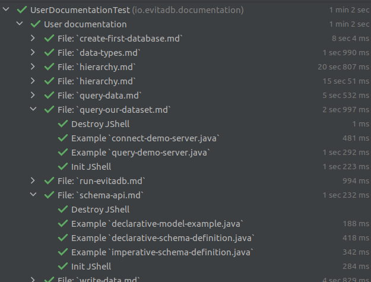

Because evitaDB is a built on top of a Java platform it gets all its benefits and all its disadvantages. The Java 
language is a statically typed and compiled language. Before you can run any piece of code, you need to compile it,
load it into a classloader and then execute. Our code examples are scattered over different MarkDown files - sometimes
embedded directly, sometimes referenced to separate file in the repository. At first, we thought there is no easy way
for verifying the validity and consistence of the documentation code samples. Initial thoughts went towards writing 
a custom Maven plugin that would generate test source codes, that would envelope the examples, compile them with Javac,
and then execute as a part of our test suite.

Fortunately, there is easier and more dynamic approach. Java provides a [JShell REPL](https://www.geeksforgeeks.org/jshell-java-9-new-feature/)
(since version 9) allowing you to interactively enter, compile, and run Java source code. The JShell can also be 
[executed programmatically,](https://arbitrary-but-fixed.net/teaching/java/jshell/2018/10/18/jshell-exceptions.html),
although it's not its primary use-case (that's why the information about this approach are scarce and hard to find).
We suspected the JShell might be a way for overcoming the difficulties with the compilation step and were determined to
at least try it.

The next piece of puzzle is a [JUnit 5](https://junit.org/junit5/docs/current/user-guide/) and its great support for
[dynamic tests](https://junit.org/junit5/docs/current/user-guide/#writing-tests-dynamic-tests) that we learnt along
the way.

So let's dive in.

<Note type="info">
The complete working code is available in our repository in class 
<SourceClass>evita_functional_tests/src/test/java/io/evitadb/documentation/UserDocumentationTest.java</SourceClass>.
</Note>

<Note type="question">

<NoteTitle toggles="true">

##### How do we organize code samples in the documentation? Read this section if you want to understand next chapters easier.
</NoteTitle>

The example files are usually placed in a separate file that is referenced by a special Next.JS component named 
`SourceCodeTabs`. The exact format is

```mdxjs
<SourceCodeTabs>
[File description](relativePathToFileInRepository.extension)
</SourceCodeTabs>
```

The notation is optimized to work for simple MarkDown rendering on GitHub when Next.JS components are not interpreted. 
The referenced file usually has a `.java` or `.evitaql` extension, but there are multiple files with the same name that 
differ only by an extension. These files are rendered on the documentation portal in an interactive widget that allows 
you to switch between different language versions of the example:


The extensions of these files are the key component for recognizing which language the example was written for. 

</Note>

## Extraction of the code samples from the MarkDown

Extracting the code to verify is the easiest part of the test. It consists of a deep traversal of the folder containing 
the documentation files using Java File Walker:

```java
try (final Stream<Path> walker = Files.walk(getRootDirectory().resolve(DOCS_ROOT))) {
	walker
		.filter(path -> path.toString().endsWith(".md"))
		.map(it -> /* createTests(it) */ )
		.toList();
}
```

... reading the file contents to a string, and extracting the code blocks either directly from the MarkDown file itself
or from the externally referenced file (see the `createTests` method body). Extraction involves only a little bit of 
RegEx pattern magic.

## Generating JUnit 5 dynamic tests

The next piece of the puzzle is the dynamic creation of JUnit tests - ideally with a single separate test per block of 
code example. Fortunately, the authors of the JUnit 5 framework have already thought of this and prepared support for
[dynamic tests](https://junit.org/junit5/docs/current/user-guide/#writing-tests-dynamic-tests).

Basically we need to wrap a lambda that does the test itself in a 
[DynamicTest](https://junit.org/junit5/docs/5.8.2/api/org.junit.jupiter.api/org/junit/jupiter/api/DynamicTest.html) 
wrapper. The `DynamicTest.dynamicTest(String, URI, Executable)` method accepts three arguments:

1. name of the test to display (equivalent to `@DisplayName`)
2. file locator (`URI`) that allows you to navigate to the source when you click on the test name in the IDE
3. lambda in the form of `Executable`, which represents the test itself

Creating a single stream of all code snippets is not practical in our case - there are too many of them, and listing 
the tests in the IDE quickly becomes cluttered. That's why we're using another JUnit 5 invention - 
[`DynamicContainer`](https://junit.org/junit5/docs/5.8.2/api/org.junit.jupiter.api/org/junit/jupiter/api/DynamicContainer.html),
which is designed to aggregate multiple related tests into a single "node". The node, in our case, represents 
a particular source markdown file where the code blocks are placed (either directly or by reference).

The executed tests looks like this:



## Compilation and execution code snippets via. JShell

The Java source code snippets need to be compiled and parsed and for this we use the [JShell REPL](https://www.geeksforgeeks.org/jshell-java-9-new-feature/).

<Note type="info">
The full source code is available [on GitHub](https://github.com/FgForrest/evitaDB/-/blob/382d230c1963c3a0d64317117de95e3db8619483/evita_functional_tests/src/test/java/io/evitadb/documentation/java/JavaExecutable.java).
</Note>

### Initialization

First, we need to prepare the JShell instance using *JShell.builder()*:

```java
this.jShell = JShell.builder()
	// this is faster because JVM is not forked for each test
	.executionEngine(new LocalExecutionControlProvider(), Collections.emptyMap())
	.build();
// we copy the entire classpath of this test to the JShell instance
Arrays.stream(System.getProperty("java.class.path").split(":"))
	.forEach(jShell::addToClasspath);
// and now pre initialize all necessary imports
executeJShellCommands(jShell, toJavaSnippets(jShell, STATIC_IMPORT));
```

Note that we explicitly inject *LocalExecutionControlProvider*. By default, the JVM creates a separate process (fork) 
to evaluate the Java snippets. While this is good for isolation and security, it is inconvenient for us because we can't 
set debug breakpoints on the code executed by the script block. The debugging capability allows us to fix bugs in our
source code examples much faster and easier.

Next, we initialize the classpath for the JShell instance by copying the full classpath of the JVM that the JUnit test 
suite runs in, and finally we initialize all the imports that our Java examples need using this file:
<SourceClass>evita_functional_tests/src/test/resources/META-INF/documentation/imports.java</SourceClass>. 
For initializing imports, we use the same logic as for executing the source code itself.

Initializing and preparing the JShell instance is costly, so we reuse a single instance for all examples in the same 
documentation file. We don't want to share the same JShell instance for multiple documentation files because our 
ultimate goal is to be able to run our documentation test in parallel once the [JUnit 5 issue #2497](https://github.com/junit-team/junit5/issues/2497) 
is resolved. Reusing the same JShell instance for multiple tests in a single documentation file raises the question of 
proper state cleanup so that the relics of one example don't affect the other examples that run after it. Read on - 
this question will be addressed in the [tear down chapter](#tear-down).

### Source code preparation and execution

The source code needs to be split into separate statements that can be executed in JShell instance. The JShell doesn't 
accept the full source code and is similar to the IDE's *evaluate expression* dialog. For this operation we ask 
the JShell instance itself to split the code appropriately:

```java
@Nonnull
static List<String> toJavaSnippets(@Nonnull JShell jShell, @Nonnull String sourceCode) {
	final SourceCodeAnalysis sca = jShell.sourceCodeAnalysis();
	final List<String> snippets = new LinkedList<>();
	String str = sourceCode;
	do {
		CompletionInfo info = sca.analyzeCompletion(str);
		snippets.add(info.source());
		str = info.remaining();
	} while (str.length() > 0);
	return snippets;
}
```

Method returns a list of separate Java expressions that together make up the original Java sample code. The next step
is to evaluate/execute them in JShell instance:

```java
@Nonnull
static InvocationResult executeJShellCommands(@Nonnull JShell jShell, @Nonnull List<String> snippets) {
	final List<RuntimeException> exceptions = new LinkedList<>();
	final ArrayList<Snippet> executedSnippets = new ArrayList<>(snippets.size() << 1);

	// iterate over snippets and execute them
	for (String snippet : snippets) {
		final List<SnippetEvent> events = jShell.eval(snippet);
		// verify the output events triggered by the execution
		for (SnippetEvent event : events) {
			// if the snippet is not active
			if (!event.status().isActive()) {
				// collect the compilation error and the problematic position and register exception
				exceptions.add(
					new JavaCompilationException(
						jShell.diagnostics(event.snippet())
							.map(it ->
								"\n- [" + it.getStartPosition() + "-" + it.getEndPosition() + "] " +
									it.getMessage(Locale.ENGLISH)
							)
							.collect(Collectors.joining()),
						event.snippet().source()
					)
				);
			// it the event contains exception
			} else if (event.exception() != null) {
				// it means, that code was successfully compiled, but threw exception upon evaluation
				exceptions.add(
					new JavaExecutionException(event.exception())
				);
				// add the snippet to the list of executed ones
				if (event.status() == Status.VALID) {
	                executedSnippets.add(event.snippet());
				}
			} else {
				// it means, that code was successfully compiled and executed without exception
				executedSnippets.add(event.snippet());
			}
		}
		// if the exception is not null, fail fast and report the exception
		if (!exceptions.isEmpty()) {
			break;
		}
	}

	// return all snippets that has been executed and report exception if occurred
	return new InvocationResult(
		executedSnippets,
		exceptions.isEmpty() ? null : exceptions.get(0)
	);
}
```

JShell generates a list of events for each evaluated Java snippet (expression), describing what happened. The most 
important information for us is whether the snippet was applied successfully and is part of the JShell state - this can
be verified by calling `event.status().isActive()`. If the event is not active, a serious error has occurred and we will
use the JShell diagnostic to distill the root cause of the problem.

Next, we check if an exception was thrown during the expression evaluation by checking the `event.exception()` method.
If the exception is found and the event state is `VALID`, we add it to the list of snippets that have been applied by 
JShell and are part of its state.

The same logic applies to the case where neither a compilation error nor an evaluation exception occurred and 
the snippet was successfully evaluated. The snippet is added to the list of snippets that have affected the state of 
JShell and are returned as a result of this method.

### Tear down

When the test is finished, we need to clean up the JShell instance that will be reused for another example in the same 
documentation file. Fortunately, the JShell provides a way to *drop evaluated statement* that effectively eliminates its 
impact on the state of the JShell instance.

Actually there are two phases of tearing down the context:

```java
// clean up - we travel from the most recent (last) snippet to the first
final List<Snippet> snippets = result.snippets();
for (int i = snippets.size() - 1; i >= 0; i--) {
	final Snippet snippet = snippets.get(i);
	// if the snippet declared an AutoCloseable variable, we need to close it
	if (snippet instanceof VarSnippet varSnippet) {
		// there is no way how to get the reference of the variable - so the clean up
		// must be performed by another snippet
		executeJShellCommands(
			jShell,
			Arrays.asList(
				// instanceof / cast throws a compiler exception, so that we need to
				// work around it by runtime evaluation
				"if (AutoCloseable.class.isInstance(" + varSnippet.name() + ")) {\n\t" +
					"AutoCloseable.class.cast(" + varSnippet.name() + ").close();\n" +
					"}\n"
			)
		)
			.snippets()
			.forEach(jShell::drop);
	}
	// each snippet is "dropped" by the JShell instance (undone)
	jShell.drop(snippet);
}
```

**The first phase** iterates over all snippets and finds all `VarSnippets` - i.e. expressions that declare variables in 
the JShell context and tries to detect whether these variables implement the `java.lang.AutoCloseable` interface and 
need to be closed properly. There is a catch though, the JShell doesn't provide facility to access the variables by 
reference and work on them directly in the code that invoked the snippets. The JShell can only return `toString` outputs
of these variables. The reason, by our guess, is that the JShell interpreter can (and usually does) run as a forked 
process and the Java objects live in a context (classpath, process memory boundaries, etc.) of different JVM instance. 
Therefore, we need to run the *close logic* as another JShell expression.

<Note type="info">

<NoteTitle toggles="true">

##### Why do we use `AutoCloseable.class` isInstance / cast methods instead of Java `instanceof` or direct cast?
</NoteTitle>

Interestingly, if you try to replace `AutoCloseable.class.isInstance(" + varSnippet.name() + ")` with 
`varSnippet.name() + " instanceof AutoCloseable"`, you will end up with a compilation exception for variables that are 
not instances of `AutoCloseable`. Although this is correct source code for normal Java code, the JShell 
interpreter/compiler behaves differently, and we have to work around this problem by using methods on a `Class` 
interface. 

</Note>

Finally, we need to drop both the `AutoCloseable` unclosing snippets and all the sample source code snippets that were 
evaluated and affected the state of the JShell instance. The `drop` operation behaves similarly to a database rollback 
operation and rolls back all operations that affected the JShell instance (but not the side effects associated with 
network or file system calls).

### Test prerequisites, chaining

Some examples build on the context of other examples in the same document - naturally as the use case description 
unfolds. We certainly don't want to clutter up the example code by repeating the statements that set up the environment
for the example itself - the examples should be as short as possible.

That's why we introduced the `requires` attribute for our `SourceCodeTabs` component, which allows you to specify one 
or more other files that must be executed before the code in the example itself is executed.

### Example translation

Another special feature of our documentation is the ability to switch between different flavors and even content of 
the documentation by selecting different *preferred language* to view the documentation in:


Preparing examples for 4-5 different languages is a tedious and time-consuming task that we want to avoid. Therefore, 
we have implemented a special mode that allows us to generate examples for different languages (Java, REST, GraphQL) 
from the base EvitaQL query statement.

Similarly, we can automatically generate the MarkDown snippets documenting the expected output for the queries applied
to our [demo dataset](/documentation/get-started/query-our-dataset). These MarkDown snippets play another important role 
as you will read in the next chapter.

The sample translation is a manual operation that is not invoked by our CI workflows. The generated files need to be 
reviewed by a human and committed to Git along with the documentation. However, once the examples/files are generated, 
they are compiled and executed by our test suite, so their correctness is automatically verified.

### Verification, assertions

The examples that query our [demo dataset](/documentation/getting-started/query-our-dataset) usually contain the preview 
of the result that the reader can expect if they run the query themselves. Since our dataset is not static, but evolves 
over time (new data is added, the structure changes, etc.), the results may differ over time. We are also working on 
the evitaDB query engine and the results may differ as we change the internal logic of the engine. In any case, we want 
to be aware when this happens and examine the difference between previous results and the results produced by 
the current version of the dataset and the evitaDB engine. We need to either correct the documentation (although 
semi-automatically by re-running the [example translation](#example-translation)) or realize that we either need to 
correct our evitaDB engine or document the backward incompatible behavior.

That's why we automatically compare the expected result MarkDown snippets with the actual results of the evitaDB query
given in the example, and if these results differ, we mark the tests as failed and force human intervention.

## Summary

So far we've written hundreds of pages of documentation and executable examples. The documentation still grows over time
and having a process that covers our backs and monitors for malfunctioning examples or deviations in the declared 
answers is pretty important. There is nothing worse than outdated or incorrect documentation.

The pleasant side effects of the described process is that it saves a considerable amount of tedious work in defining
the examples for all languages we support and also adds another layer of integration testing, that has uncovered some 
bugs in the evitaDB core. The queries run against our [demo dataset](/documentation/get-started/query-our-dataset) and 
verify that our demo server API is working correctly and that we haven't broken it with some update, and that's also 
pretty important - we want our demo server to be available to anyone who wants to play with it.

The work has already paid off, and we're sure it's going to pay off even more in the long run.