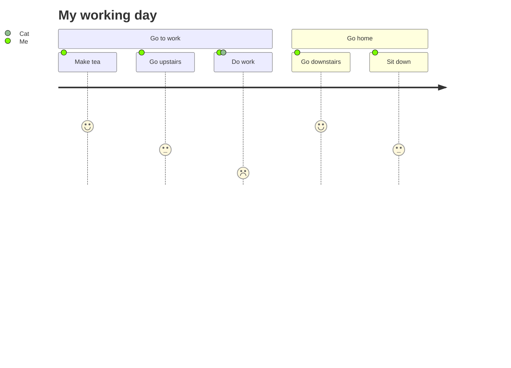

## Creating new MDX document

In order to provide best support for articles or documents we use remote MDX files, that allow us to use React components in its content.
You can read in detail about it [here](https://nextjs.org/docs/advanced-features/using-mdx).

There are some limitations that will cause the document not to render and here I will highlight the most common
Here I will specify what are best practices and what we shouldn't forget when creating such a documents.

Common mistakes:

- Please don't use these symbols directly in MDX `<, <=, >, >=` Also, please don't use HTML tags directly.


## Head of the Document

It is important to provide the header of the document. Its key pair value data are used to construct some of the most important elements on the page.
To create `head` we can use the following template:

```md
---
title: My document title
perex: Here is what is all about
date: DD.MM.YYYY
author: John Smith
---
```
where:
- title: user for document H1 heading element
- perex: user for document perex (optional)
- date: date in format 'DD.MM.YYYY' (optional)
- author: user for document perex (optional)

## Titles & Headings

It is also important that we keep an eye on document flow when it comes to headings.
All `## h2` and `### h3` elements are being used to create **Table of content**. This is visible on the right-hand side
of the web page and its visibility can be toggled through the floating anchor icon on smaller screens.

## Text formatting

All other features of Markdown are fully supported.


Headings up to level 6

## Heading Level 2

### Heading Level 3

#### Heading Level 4

##### Heading Level 5

###### Heading Level 6


[Link somewhere](https://www.edee.one)

**Bold text**

*Italic text*

### Blockquote

> Blockquote - Aenean pulvinar nibh ex. Aliquam non nunc finibus, tempus urna non, pulvinar enim. Cras condimentum eros est, at pharetra metus aliquet ut. Mauris id consectetur ante. Nunc vulputate placerat arcu sed tincidunt. Suspendisse sagittis libero sit amet blandit viverra.

### Ordered and Unordered lists

1. First item
2. Second item
3. Third item

- First item
- Second item
- Third item

### Code highlighting

Aenean pulvinar nibh ex. Aliquam `code highlight` finibus, tempus urna non, pulvinar enim. Cras `code highlight` eros est.

### Horizontal rules as line below

---

### Footnote

Footnotes are created at the bottom of each blog/document page

A note[^1]

[^1]: Big note.

### Strikethrough

~one~ or ~~two~~ tildes.


## Custom React Blocks

---

The main advantage of the following components is their appearance and behaviour on the web.
They are constructed to be also readable in plain MD/MDX documents!

When constricting new components, please make sure substantial fallback is provided.

> Please make sure you follow the exact markup as some other components may dependent on attributes for web presentation purposes.

### Used Terms `<UsedTerms>`

This block highlights document guide for used terms/prerequisites. Make sure you'll use **regular HTML markup**.

##### Component preview

<UsedTerms>
    <h4>Used Terms</h4>
    <dl>
        <dt>item title</dt>
        <dd>Item description [Test link to Research](guide.md)</dd>
        <dt>another item title</dt>
        <dd>Another description Lorem ipsum dolor sit amet, consectetur adipisicing elit. Ad cumque dolores eaque, earum eius esse est exercitationem harum obcaecati porro qui similique vero voluptas! A alias explicabo maxime soluta velit! A ab adipisci atque blanditiis consectetur culpa cumque dolores doloribus esse est et eum fuga fugiat iusto laudantium minima molestias, necessitatibus nisi optio provident quaerat quibusdam quos saepe sint ullam. Assumenda inventore odit rem. A adipisci alias aperiam assumenda at.</dd>
        <dt>product</dt>
        <dd>Entity with type “product”, which contains information about a [specific product](https://www.google.com) in the e-shop.</dd>
        <dt>document</dt>
        <dd>Equivalent to a table in SQL, represents stored entity data in Elasticsearch</dd>
        <dt>catalog</dt>
        <dd>Representation of catalog of products in the e-shop</dd>
    </dl>		
</UsedTerms>

##### Please use following markup:

```md
<UsedTerms>
    <h4>Used Terms</h4>
    <dl>
        <dt>item title</dt>
        <dd>Item description [Test link to Research](/research)</dd>
        <dt>another item title</dt>
        <dd>Another description Lorem ipsum dolor sit amet, consectetur adipisicing elit. Ad cumque dolores eaque, earum eius esse est exercitationem harum obcaecati porro qui similique vero voluptas! A alias explicabo maxime soluta velit! A ab adipisci atque blanditiis consectetur culpa cumque dolores doloribus esse est et eum fuga fugiat iusto laudantium minima molestias, necessitatibus nisi optio provident quaerat quibusdam quos saepe sint ullam. Assumenda inventore odit rem. A adipisci alias aperiam assumenda at.</dd>
        <dt>product</dt>
        <dd>Entity with type “product”, which contains information about a [specific product](www.google.com) in the e-shop.</dd>
        <dt>document</dt>
        <dd>Equivalent to a table in SQL, represents stored entity data in Elasticsearch</dd>
        <dt>catalog</dt>
        <dd>Representation of catalog of products in the e-shop</dd>
    </dl>		
</UsedTerms>
```

###### !!! Deprecated

```md

<UsedTermsBlock title="Explanation of terms used">
	<UsedTermsBlockItem itemTitle="index" description="Elasticsearch database"/>
	<UsedTermsBlockItem itemTitle="entity" description="Representation of document before ingestion to Elasticsearch"/>
	<UsedTermsBlockItem itemTitle="document" description="Equivalent to a table in SQL, represents stored entity data in Elasticsearch"/>
	<UsedTermsBlockItem itemTitle="product" description="Entity with type “product”, which contains information about a [specific product](www.google.com) in the e-shop"/>
	<UsedTermsBlockItem itemTitle="catalog" description="Representation of catalog of products in the e-shop"/>
</UsedTermsBlock>

```

In addition to `UsedTerms` the following `Term` component can be used to link to its description.
See bellow for more details.

### Term `<Term>`

If you wish to display popup with description of the term used in your text, you can use `<Term>` component.
Simply add `name` attribute to link the term with its description in the document.

Teh `Term` component can also take `document` attribute, if you wish to link to the term specified in different document.

> Make sure you include the `*` in your code, so that they can be highlighted in plain Markdown files.

Lorem ipsum dolor <Term>**product**</Term>, eos quaestio <Term name="product">**products or whatever**</Term> consequuntur ex. At nam sumo aeterno tritani, <Term name="catalog">**catalog**</Term> eos aperiam omnesque facilisi in.
In tota virtute utroque est, in per minim ornatus. Ex mea <Term name="document">**document**</Term> velit dolorum vivendo, sea quem eros denique te. Tamquam verterem conclusionemque ut vix.
Te tation possit sit, <Term name="category">**specific category**</Term> vis et vide commodo.

In this paragraph. we highlight <Term document="docs/research/en/assignment/index.md" name="product set">**description for product set**</Term> and for <Term document="docs/research/en/assignment/index.md" name="variant product">**variant product**</Term> which are specified in different Document.

##### Please use following markup:

```md

<Term>**product**</Term>

<Term name="product">**products or whatever**</Term>

<Term document="docs/research/en/assignment/index.md" name="product set">**Product set**</Term>
```


### CodeTabs `<CodeTabs>`

CodeTabs

<CodeTabs>
<CodeTabsBlock>

```js
// here is some comment
const some = { plainSetup: true }
import cookiesPolicy from 'fg-frontend/components/CookiesPolicy/index';
cookiesPolicy({
    disableRwdImg: true,
    enableModal: true,
    imgSrc: '/img/cookie-policy/cookie.png',
});
```

</CodeTabsBlock>
<CodeTabsBlock>

```
// here is some comment
const some = { plainSetup: true }
import cookiesPolicy from 'fg-frontend/components/CookiesPolicy/index';
cookiesPolicy({
    disableRwdImg: true,
    enableModal: true,
    imgSrc: '/img/cookie-policy/cookie.png',
});
```

</CodeTabsBlock>
<CodeTabsBlock>

```csharp
using System;
using System.Collections.Generic;
using System.Linq;
using System.Text;
using System.Threading.Tasks;

namespace CSharpTutorials
{
    class Program
        {
            static void Main(string[] args)
        {
            string message = "Hello World!!";

            Console.WriteLine(message);
        }
    }
}
```

</CodeTabsBlock>
<CodeTabsBlock>

```graphql
query Echo {
    echo(message: "hello") {
        message
    }
}
```

</CodeTabsBlock>
<CodeTabsBlock>

```java
//sample code to write 100 random ints to a file, 1 per line

import java.io.PrintStream;
import java.io.IOException;
import java.io.File;

import java.util.Random;

public class WriteToFile
{	public static void main(String[] args)
{	try
{	PrintStream writer = new PrintStream( new File("randInts.txt"));
    Random r = new Random();
    final int LIMIT = 100;

    for(int i = 0; i < LIMIT; i++)
{	writer.println( r.nextInt() );
}
    writer.close();
}
    catch(IOException e)
{	System.out.println("An error occured while trying to write to the file");
}
}
}
```

</CodeTabsBlock>
<CodeTabsBlock>

```php
<?php
    echo "Hello World!";
?>
```

</CodeTabsBlock>
<CodeTabsBlock>

```json
{
    firstname: 'John',
    lastname: 'Doe'
};
```

</CodeTabsBlock>
</CodeTabs>

##### Please use following markup:

> To ensure all code blocks are visible in plain Markdown, please make sure you:
> - **don't include any offset or spacing**.
> - **leave an empty line above and below your code block**.

```md

<CodeTabs>
<CodeTabsBlock>

// Place your code block here.

</CodeTabsBlock>
</CodeTabs>

```

### CodeTabs with external source `<SourceCodeTabs>`

You can also *feed* the `CodeTabs` with external sources in directory.
This specific component will use the content of the Markdown Link source and on this relative path will search not only
for a file specified, but also for other files based on its name.

So from the example what you see in markup snippet the following tabs will get generated as in folder `string_contains`
are other files with the name `string_contains`. If only one file exists, one tab gets rendered instead.


<SourceCodeTabs produces="string_contains_result.md">
[Example of string contains function in Java](docs/blog/en/examples/string_contains/string_contains.evitaql)
</SourceCodeTabs>

##### Please use following markup:

```md

<SourceCodeTabs produces="string_contains_result.md">
[Example of string contains function in Java](docs/blog/en/examples/string_contains/string_contains.evitaql)
</SourceCodeTabs>

```

Single code block gets rendered, if only one file exists in the folder.

<SourceCodeTabs produces="string_contains_result.md">
[Example of string contains function in Java](docs/blog/en/examples/string_contains/api-enabling.java)
</SourceCodeTabs>


### Include `<Include>`

You might include any MD or MDX file using the `Include` component.
For fallback purposes, please include HTML anchor tag leading to file in repository.

<Include><a href="docs/blog/en/examples/string_contains/string_contains_result.md">String contains result example</a></Include>

##### Please use following markup:

```md

<Include>path/in/repository/file_name.md</Include>

```

###### !!! Deprecated

```
<Include source="path/in/repository/file_name.md"/>
```

### LanguageSpecific

If certain part of the documents are texts specific only for single or (but not all) more languages.
This is where you use `LanguageSpecific` component.


<LanguageSpecific to="evitaql">

#### This text is specific to `evitaql`.

---

Some Markdown text specific in this case to `evitaql`. Testing for inclusion of term called <Term>product</Term> and other components.

```evitaql

// here comes your code block

```

</LanguageSpecific>

<LanguageSpecific to="java">

#### This text is specific to `java`.

---
Some `java` specific content.

</LanguageSpecific>

<LanguageSpecific to="graphql,rest">

#### This text is specific to `graphql,rest`.

---
Some `graphql,rest` specific content.

</LanguageSpecific>

The generator will include this text only in pages generated specifically for this language and the part of the text
will not be visible in other languages.

##### Please use following markup:

```md
<LanguageSpecific to="java">
Some markdown text including examples and other components.
</LanguageSpecific>

<LanguageSpecific to="graphql,rest">
Some markdown text including examples and other components.
</LanguageSpecific>
```

### Link to `class` in source repository

This will create link to class in source repository <SourceClass>evita_api/src/main/java/io/evitadb/api/requestResponse/data/HierarchicalPlacementContract.java</SourceClass>.

It is also possible to link to folders as such <SourceClass>evita_query/src/main/java/io/evitadb/api/query/visitor/</SourceClass>.

Links to Dockerfiles are also supported <SourceClass>docker/Dockerfile</SourceClass>.

If you wish to link class/folder reference in different branch, you can do that with 'branch' as in the following markup
example. <SourceClass branch="POC">evita_query/src/main/java/io/evitadb/api/query/filter/PrimaryKey.java</SourceClass>

Another way is to use MD link inside, where you can specify exact path to source. 
<SourceClass>[Price between](https://github.com/FgForrest/evitaDB/blob/dev/evita_query/src/main/java/io/evitadb/api/query/filter/PriceBetween.java)</SourceClass>

##### Please use following markup:

```md
<SourceClass>evita_api/src/main/java/io/evitadb/api/requestResponse/data/HierarchicalPlacementContract.java</SourceClass>

<SourceClass branch="POC">evita_query/src/main/java/io/evitadb/api/query/filter/PrimaryKey.java</SourceClass>

or

<SourceClass>[Price between](https://github.com/FgForrest/evitaDB/blob/dev/evita_query/src/main/java/io/evitadb/api/query/filter/PriceBetween.java)</SourceClass>
```

### Note

Basic note component to highlight texts.

Types of notes:
- info,
- warning,
- question,
- example.

> It is very important ot keep the custom component tags on new line.

<Note type="info">

<NoteTitle toggles="true">

##### Titles can also be toggles to hide content 🚀

</NoteTitle>
This is info note with some content, i.e: externally loaded `<SourceCodeTabs>`.

<SourceCodeTabs produces="string_contains_result.md">
[Example of string contains function in Java](docs/blog/en/examples/string_contains/string_contains.evitaql)
</SourceCodeTabs>

</Note>

<Note type="warning">

<NoteTitle>

##### Plain title without toggle feature
</NoteTitle>

This is warning note

</Note>

<Note type="example">

<NoteTitle toggles="true">

##### How did we do it? 🤔

</NoteTitle>

Connecting many components together.


</Note>


##### Please use following markup:

```md

<Note type="info">

<NoteTitle toggles="true">

##### Title is as toggle

</NoteTitle>
This is info note with some content, i.e: externally loaded `<SourceCodeTabs>` 🎉.

<SourceCodeTabs produces="string_contains_result.md">
[Example of string contains function in Java](docs/blog/en/examples/string_contains/string_contains.evitaql)
</SourceCodeTabs>

</Note>

```

### Tables

There are two ways for creating tables in the process of MDX.

Tables can be quite tricky to handle, therefore we will make sure we have all its
features under control and use regular HTML table markup with only difference
and that is the __capital casing__ of elements.

See below how table markup should look like.

#### Using the React method

```jsx
<Table caption="If filled, your table element will get a caption beneath the table">
	<Thead>
		<Tr>
			<Th>Server, library or framework</Th>
			<Th>JMH Score (ops/s)</Th>
			<Th>Min JMH Score (ops/s)</Th>
			<Th>Max JMH Score (ops/s)</Th>
		</Tr>
	</Thead>
	<Tbody>
		<Tr>
			<Td>microhttp</Td>
			<Td>18,187</Td>
			<Td>18,003</Td>
			<Td highlight>18,384</Td>
		</Tr>
		<Tr>
			<Td>Javalin</Td>
			<Td>18,187</Td>
			<Td>18,003</Td>
			<Td highlight>18,384</Td>
		</Tr>
	</Tbody>
	<Tfoot>
		<Tr>
			<Th scope="row">Totals</Th>
			<Td>21,000</Td>
			<Td>22,000</Td>
			<Td highlight>23,000</Td>
		</Tr>
	</Tfoot>
</Table>
```
Markup above generates the following table. Notice some features what can be added like:

- `highlight` - highlights cell

<Table caption="If filled, your table element will get a caption beneath the table">
	<Thead>
		<Tr>
			<Th>Server, library or framework</Th>
			<Th>JMH Score (ops/s)</Th>
			<Th>Min JMH Score (ops/s)</Th>
			<Th>Max JMH Score (ops/s)</Th>
		</Tr>
	</Thead>
	<Tbody>
		<Tr>
			<Td>microhttp</Td>
			<Td>18,187</Td>
			<Td>18,003</Td>
			<Td highlight>18,384</Td>
		</Tr>
		<Tr>
			<Td>Javalin</Td>
			<Td>18,187</Td>
			<Td>18,003</Td>
			<Td highlight>18,384</Td>
		</Tr>
	</Tbody>
	<Tfoot>
		<Tr>
			<Th scope="row">Totals</Th>
			<Td>21,000</Td>
			<Td>22,000</Td>
			<Td highlight>23,000</Td>
		</Tr>
	</Tfoot>
</Table>

#### Using the MD syntax

This is being handled by `remarkGfm` plugin. It is also possible to use regular MD syntax.

| Server, library or framework | JMH Score (ops/s) | Min JMH Score (ops/s) | Max JMH Score (ops/s) |
| ---------------------------- |-------------------|-----------------------|-----------------------|
| microhttp                    | 18,187            | 18,003                | 18,384                |
| Javalin                      | 17,958            | 17,697                | 18,357                |
| Undertow                     | 17,874            | 17,573                | 18,289                |
| Micronaut                    | 14,742            | 14,464                | 15,052                |
| Spring Boot WebFlux          | 12,986            | 12,889                | 13,224                |
| Vert.x                       | 12,223            | 12,120                | 12,406                |
| Spring Boot MVC              | 11,691            | 11,360                | 11,819                |
| Netty                        | 11,272            | 11,043                | 11,407                |
| Quarkus (in native mode)     | 10,100            | 10,012                | 10,159                |
| NanoHTTPD                    | 8,874             | 8,709                 | 9,023                 |

*Throughput results (ops/s - higher is better).*

| Server, library or framework | JMH Score (us/op) | Min JMH Score (us/op) | Max JMH Score (us/op) |
| ---------------------------- |-------------------|-----------------------|-----------------------|
| Undertow                     | 435               | 417                   | 460                   |
| microhttp                    | 449               | 448                   | 451                   |
| Javalin                      | 452               | 437                   | 457                   |
| Micronaut                    | 543               | 534                   | 555                   |
| Spring Boot WebFlux          | 612               | 601                   | 620                   |
| Vert.x                       | 659               | 653                   | 676                   |
| Spring Boot MVC              | 689               | 678                   | 698                   |
| Netty                        | 714               | 706                   | 725                   |
| Quarkus (in native mode)     | 790               | 787                   | 793                   |
| NanoHTTPD                    | 913               | 899                   | 926                   |

*Average time results (us/op - smaller is better).*

### Mermaid diagrams

As you might notice, support for mermaid diagrams is also initialised.




### HighlightBlock

Highligting block. Content parsed by `markdown-to-jsx` plugin.

@params:
-title: string
-text: string

<BlockHighlight title="Title of the block" text="Databáze byla navržena s ohledem na nízkou latenci odpovědi na složité dotazy, které jsou při realizaci [e-commerce katalogů](https://edee.one/) běžné. Všechny indexy jsou striktně drženy v RAM v <code>imutabilních datových strukturách</code> umožňujících bezzámkové paralelní čtení. Cílíme (a databázi testujeme) na milisekundové latence při filtraci a třídění záznamů s kardinalitou v jednotkách milionů položek.1" />


