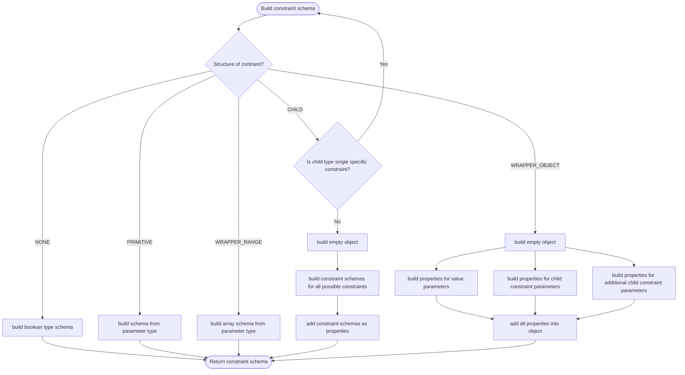
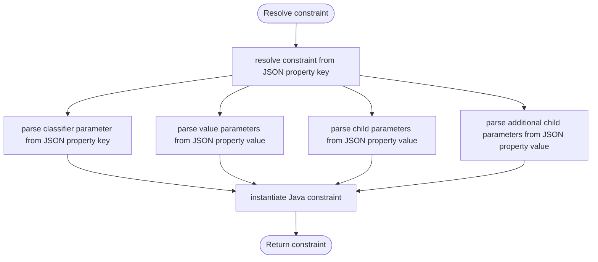

# Query language in JSON external APIs

For the external JSON APIs ([GraphQL](graphql-api.md) and [REST](rest-api.md)), there is a separate query language that is heavily
based on internal evitaQL. The main differences are:
- it is domain-specific, i.e. there are no generic constraints, but rather constraints with specific data names and types based on the client's evitaDB schema
- it uses JSON for representation, which enables the domain-specific schema but also comes with its own limitations

Because query language and its constraints are quite complex (because of its tree structure) and we want to simplify
querying for end-users by showing only those constraints in specific contexts which make sense as much as possible without losing functionality,
the [annotation framework has been developed](../query/query_constraint_description_framework.md).
But because building API-specific schema for entire query language by hand
would be unrealistic, an automated builder has been built. 

For parsing query inputs conforming to the constraint schema, a resolver
has been developed. This resolver uses same constraint schema rules as the above-mentioned builder, and thus if there
are any changes to those rules, both the builder and the resolver must be correctly updated.

## Syntax of query and constraints

<MDInclude>[Syntax of query and constraints](/docs/user/en/use/connectors/assets/dynamic-api-query-language-syntax.md)</MDInclude>

## Data locators

Both the schema builder and the input resolver use data locator objects when traversing constraints. Their main purpose 
is to combine and hold a constraint domain and data pointer. The data locator basically represents an implementation of
an abstract domain definitions.

There is a fixed number of constraint domains (entity, reference, hierarchy, ...) and each abstractly defines which child
constraints can be used for the domain of the parent constraint. The data pointer points to some a concrete evitaDB
schema (e.g. entity schema, reference schema) to clearly define where child data (e.g. attributes, references, ...) can be found.

Each domain has its own implementation of the
<SourceClass>evita_external_api/evita_external_api_core/src/main/java/io/evitadb/externalApi/api/catalog/dataApi/constraint/DataLocator.java</SourceClass>.
Each implementation defines data pointer that is valid for that particular domain. 

The most important and tricky thing is to switch the data locator correctly when moving from a parent constraint to a child constraint.
There is somewhat clever logic behind the switching, which doesn't simply overwrite the parent data locator, but rather tries
to traverse the data itself if possible. This way it is for example possible to relatively easily traverse from entity 
domain to reference domain to referenced entity domain and so on just by specifying desired child domain and data pointer. 
*Note:* not all combinations of parent and child domains and data pointers are possible, and if done incorrectly it may
result in a completely different and invalid tree of constraints. 

The actual data locator switching is slightly different for the builder and the resolver
because there are few different steps involved and some data is accessible at slightly different steps,
but abstractly, the points at which the data locator needs to be switched are the 
same and MUST be in sync, otherwise the built constraint schema can't be resolved back.

## Constraint schema builder

The <SourceClass>evita_external_api/evita_external_api_core/src/main/java/io/evitadb/externalApi/api/catalog/dataApi/builder/constraint/ConstraintSchemaBuilder.java</SourceClass> is responsible for 
building API schema of query language for specific client domain by traversing 
<SourceClass>evita_query/src/main/java/io/evitadb/api/query/descriptor/ConstraintDescriptor.java</SourceClass>
starting with single root constraint descriptor and
root data locator. Different data locators can dramatically affect how the schema will look like
even for the same constraint descriptor. This is due to the fact that the constraint descriptor has more generic descriptors
of children and other parameters which may not make sense in the client domain.

The actual flow of the builder is quite complex and there is a lot of recursion. This is a simplified flow of
building API schema from a single root constraint descriptor, which highlights key points in the building process:

### Shared building context

Each builder is associated with a single catalog and is shared (or different configurations of it) across all entity collections
in that catalog. Because entity collections can reference each other and thus share parts of the query language,
a <SourceClass>evita_external_api/evita_external_api_core/src/main/java/io/evitadb/externalApi/api/catalog/dataApi/builder/constraint/ConstraintSchemaBuildingContext.java</SourceClass> 
is shared by all builders in a single catalog to be able to cache and reuse previously built parts of a schema.
The cacheable elements are represented by specific keys each implementing the 
<SourceClass>evita_external_api/evita_external_api_core/src/main/java/io/evitadb/externalApi/api/catalog/dataApi/builder/constraint/CachableElementKey.java</SourceClass>

### Determining allowed child constraints

When building containers of child constraints, not all possible constraints should be added into that container for 
specific data locator because they may be forbidden by parent or globally for the whole schema (usually to build different
variations of the base query language for different endpoints).

### Data locator switching in constraint schema builder

At the root of the schema construction the data locator is passed by the caller. This way the caller can customise the constraint
schema for their use. This allows for building client domain-specific constraint schemas for different entity collections
or even building only inner parts of the whole schema by simulating inner data locator at specific place in that schema.

Generally, the data locator switching occurs when going from parent to child constraints. In the builder,
this happens when creator parameters representing children are being built. In this case, we need to correctly
determine the new child data locator for children based on current data locator and desired child domain. The desired 
child domain is specified by an annotation on the creator parameter. The data locator is then either inherited from the parent
or converted to the different child data locator (if possible). We want (if not overridden) to pass the 
parent data locator here with the same domain and data to the children so that the builder can determine which child constraints
are valid for the parent constraint container and its data locator.

After this first switch, there are two different possibilities that may happen next, determined by the
type of the parameter representing the children in creator.

If the child parameter type is an interface or an array, this means that it represents variety of different constraints, 
and we need to create an [implicit container](#syntax-of-query-and-constraints) for it.
In this case, the new child data locator is passed down to the container builder. The builder will find valid constraints and
based on their property type it switches the data locator again with the domain corresponding to the property type.
This way, the child constraint has its own data locator to 
determine its own child constraints which may be completely different from those valid in the parent container. Finally,
the builder recursively returns to the beginning to build another inner constraint schema.

If the child parameter type is a concrete constraint and not an array, we can completely omit the intermediate 
[implicit container](#syntax-of-query-and-constraints) and build the specific constraint as a parameter directly.
This is mainly for better developer experience (DX), as otherwise there may be nested properties with the same names 
(these parameters are usually named the same way as the constraint itself) and unnecessary containers. Unfortunately, 
the shortcut comes with a caveat.

Because we skipped the [implicit container](#syntax-of-query-and-constraints) construction, there was no subsequent data locator
switch based on the property type of the child constraint. This normally happens automatically inside the container builder
before building the child constraint, but in this case, we want to build the child constraint immediately, so we 
need to explicitly determine desired child domain based on a property type of the child constraint and switch the data locator
based on it.

After that, the process is repeated until there are no child parameters left.

### Constraint resolver 

The <SourceClass>evita_external_api/evita_external_api_core/src/main/java/io/evitadb/externalApi/api/catalog/dataApi/resolver/constraint/ConstraintResolver.java</SourceClass>
is responsible for converting input JSON queries into internal Java constraints. It shares the same
principles and rules for query language as the [constraint schema builder](#constraint-schema-builder).

A resolution starts with a single root constraint serialized as JSON and
root data locator. Different data locators may dramatically influence which evitaDB
schemas are used to reconstruct the input constraints into Java constraints. This is due to the fact that the API constraint schema
is specific to the client's domain, and therefore has the evitaDB schemas baked in, so we need these evitaDB schemas
with original data for the resolution, so that evitaDB knows how to process the query.

The actual flow of the resolver is quite complex and there is a lot of recursion. This is simplified flow of
parsing input JSON constraint tree from a single root constraint that represents key points in the resolution:

### Determining constraint descriptor

The first and most important step is to correctly determine the original constraint descriptor for the JSON constraint.
Since input constraints are represented by JSON properties, the name and possible classifier are stored in the
JSON property key. The JSON property key must contain all of the data used to determine the original constraint descriptor as 
mentioned [above](#syntax-of-query-and-constraints).

First the property type is stripped and parsed from the beginning of the key. It also determines a fallback property type from the current data locator
is determined for special cases where the explicit property type is missing for better DX (this is true only in few
very special cases). Ultimately, the fallback property type is basically determined by parent constraint. 

After stripping the property type from the JSON key, the rest of the key is split into individual words.
We start by moving all words into the possible constraint name string and leaving the possible classifier string
empty. We try to find a constraint descriptor for this combination of the property type, the classifier and the name. If nothing
is found and there is no explicit property type, we try again with the fallback property type.
If again nothing is found, one word is moved from the beginning of the possible constraint name string to the possible classifier string and
search for the constraint descriptor is repeated. This is repeated until the possible constraint name string is empty.
If no constraint descriptor is found, an exception is thrown.

### Data locator switching in constraint schema builder

If the constraint descriptor is found for the input JSON property key, an inner data locator is resolved and switched based 
on the property type of the found constraint the same way as when building child constraints 
(the child data locator is also determined based on its property type).
The only difference is that in the builder, this happens inside the parent construction where we have data for it. In resolver, this
happens later in child constraint because, unlike in the builder, we don't know the child constraint beforehand in parent, and
we need to determine it in resolution of child constraint from the JSON property key. Otherwise, the idea of switching data locator
based on the child constraint's property type is the same.

Then, if the constraint has child parameters, we switch the data locator again before resolving actual children based on
desired child domain and current data locator. This is same for both builder and resolver.

