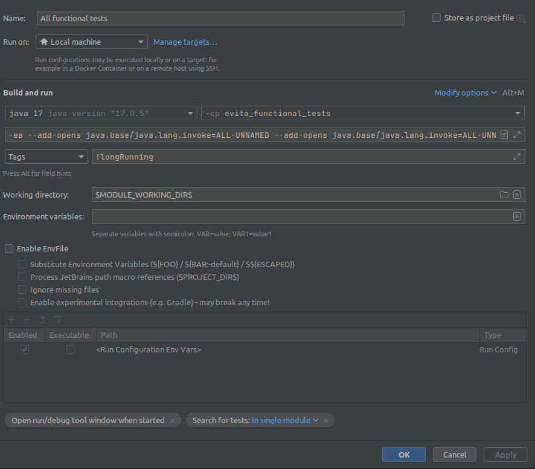
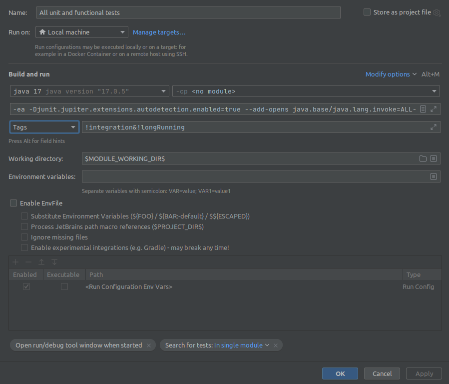

# Automatic testing

_Note: if you plan to use IntelliJ IDEA to run tests, checkout the [compiler configuration](intellij_idea_compiler.md) documentation._

## Unit testing

Unit tests are placed directly in the same JAR as production code that is being tested. Test classes should keep the
name of the tested class adding `Test` suffix. This pattern is automatically recognized by IDEs. Unit tests has no
tags or annotations. Unit tests are expected to be fast.

### Recommended usage

You can run tests in Maven by using:

```
mvn clean install -P unit
```

or you can run tests in IntelliJ Idea, but you need to add several Java arguments
to the JUnit configuration template:

```
--add-opens java.base/java.lang.invoke=ALL-UNNAMED
--add-opens java.base/java.lang.invoke=ALL-UNNAMED
--add-opens java.base/java.lang=ALL-UNNAMED
--add-opens java.base/java.math=ALL-UNNAMED
--add-opens java.base/java.util=ALL-UNNAMED
```

and exclude `functional`, `integration` and `longRunning` tags from the actual runner configuration like so


## Functional and integration testing

Bodies of the **functional tests** are placed in `evita_functional_tests` module.
Functional tests use artificial data that are constructed and created specially for each test to verify certain behaviour. 
The test data are relatively small.

### Recommended usage

You can run tests in Maven by using:

```
mvn clean install -P functional
```

Or you can run tests in IntelliJ Idea in the `evita_functional_tests` module, but you need to add several Java arguments 
to the JUnit configuration template:

```
--add-opens java.base/java.lang.invoke=ALL-UNNAMED
--add-opens java.base/java.lang.invoke=ALL-UNNAMED
--add-opens java.base/java.lang=ALL-UNNAMED
--add-opens java.base/java.math=ALL-UNNAMED
--add-opens java.base/java.util=ALL-UNNAMED
```

and exclude tests with `integration` and `longRunning` tags from the actual runner configuration:



#### Executing single GraphQL functional test in IntelliJ Idea

Due to the implemented Java modules by default GraphQL functional tests cannot be executed. In order to execute them
one must add addition Java arguments to JUnit configuration (it can be added to JUnit configuration template to be
automatically added to future test configurations):

```
--add-opens evita.external.api.graphql/io.evitadb.externalApi.graphql.testSuite=ALL-UNNAMED
```

#### Executing single REST functional test in IntelliJ Idea

Due to the implemented Java modules by default REST functional tests cannot be executed. In order to execute them
one must add additional Java arguments to JUnit configuration (it can be added to JUnit configuration template to be
automatically added to future test configurations):

```
--add-opens evita.external.api.rest/io.evitadb.externalApi.rest.testSuite=ALL-UNNAMED
```

## Unit and functional testing

You can also run both unit and functional tests (which is generally recommended) using Maven:

```
mvn clean install -P unitAndFunctional
```

or in IntelliJ IDEA, but you need to add several Java arguments to JUnit configuration template first:

```
--add-opens java.base/java.lang.invoke=ALL-UNNAMED
--add-opens java.base/java.lang.invoke=ALL-UNNAMED
--add-opens java.base/java.lang=ALL-UNNAMED
--add-opens java.base/java.math=ALL-UNNAMED
--add-opens java.base/java.util=ALL-UNNAMED
```

as well as following expression for tags field:

```
!integration&!longRunning
```

like so



### Working with datasets shared for multiple tests

You can specify a non-test method that will prepare a shared dataset that will be used by multiple methods in the same class.
In test methods you may autowire evitaDB instance and specify a dataset that is required for this test. If previous
test used the same data set, it will be reused even for this test method. If there was different or no dataset, Evita
instance is cleared and initialized from scratch.

Example:

``` java
@CatalogName("testCatalog")
public class SomeTest {

	@DataSet("exampleDatSet")
	void setUp(EVITA evita, String catalogName) {
		evita.updateCatalog(catalogName, session -> {
			// initialize contents of the Evita with test data set
		});
	}

	@Test
	void shouldPerformTest(@UseDataSet("exampleDataSet") EVITA evita, String catalogName) {
		evita.queryCatalog(
			catalogName,
			session -> {
				// query the evitaDB data and expect contents of the example data set
			}
		);
	}
}
```

## Performance testing

Performance tests use [Java Microbenchmark Harness](https://openjdk.java.net/projects/code-tools/jmh/) as a vehicle for
execution of the test, collecting statistically correct results and producing report from the tests. For result visualization
we use [JMH Visualiser](http://jmh.morethan.io/) that uses report published publicly in GitHub Gist. Intro to write
JMH Microbenchmarks is located [at Baeldung](https://www.baeldung.com/java-microbenchmark-harness).

When you compile `evita_performance_tests` module, you get a `benchmarks.jar` in your `target` folder. To run all benchmarks
execute:

```
java -jar target/benchmarks.jar
```

You can use [a lot of options for JMH](https://github.com/guozheng/jmh-tutorial/blob/master/README.md). Particularly useful
are:

```
-e .*regularExpression.* -i 1 -wi 1 -f 0 -rf json -rff result.json
```

that speed up benchmark for running on locale in the way that it limits number of warmup iterations and recording iterations
to one and also disables forking which allows debugging the performance tests via JPDA protocol. You can also exclude
some benchmarks via regular expression to limit testing only to particular slice of the benchmarks.