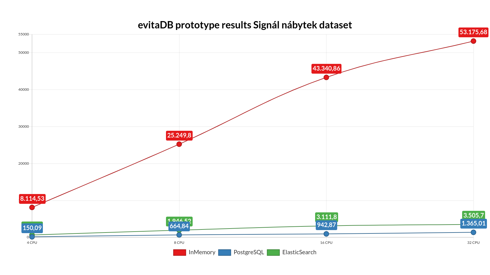

# Performance results





## 32-CPU

**IN-MEMORY IMPLEMENTATION**

```
Benchmark                                                                       Mode  Cnt      Score       Error  Units
keramikaSoukup.KeramikaSoukupThroughputBenchmark.syntheticTest_InMemory        thrpt    5  73626.897 ±  4120.789  ops/s
senesi.SenesiThroughputBenchmark.syntheticTest_InMemory                        thrpt    5  18689.946 ±  2924.623  ops/s
signal.SignalThroughputBenchmark.syntheticTest_InMemory                        thrpt    5  53175.678 ± 38325.003  ops/s
```

**ELASTICSEARCH IMPLEMENTATION**

```
Benchmark                                                                       Mode  Cnt        Score     Error  Units
keramikaSoukup.KeramikaSoukupThroughputBenchmark.syntheticTest_Elasticsearch   thrpt    5     3677.263 ± 189.478  ops/s
senesi.SenesiThroughputBenchmark.syntheticTest_Elasticsearch                   thrpt    5     2150.302 ± 164.998  ops/s
signal.SignalThroughputBenchmark.syntheticTest_Elasticsearch                   thrpt    5     3505.700 ± 127.735  ops/s
```

**POSTGRESQL IMPLEMENTATION**

```
Benchmark                                                                       Mode  Cnt        Score     Error  Units
keramikaSoukup.KeramikaSoukupThroughputBenchmark.syntheticTest_Sql             thrpt    5      675.757 ±   3.510  ops/s
senesi.SenesiThroughputBenchmark.syntheticTest_Sql                             thrpt    5      179.086 ±  10.056  ops/s
signal.SignalThroughputBenchmark.syntheticTest_Sql                             thrpt    5     1365.014 ± 301.681  ops/s
```

## 16-CPU

**IN-MEMORY IMPLEMENTATION**

```
Benchmark                                                                       Mode  Cnt      Score       Error  Units
keramikaSoukup.KeramikaSoukupThroughputBenchmark.syntheticTest_InMemory        thrpt    5  56475.127 ±  4091.617  ops/s
senesi.SenesiThroughputBenchmark.syntheticTest_InMemory                        thrpt    5  18910.211 ±  1534.116  ops/s
signal.SignalThroughputBenchmark.syntheticTest_InMemory                        thrpt    5  43340.862 ± 14726.983  ops/s
```

**ELASTICSEARCH IMPLEMENTATION**

```
Benchmark                                                                       Mode  Cnt        Score     Error  Units
keramikaSoukup.KeramikaSoukupThroughputBenchmark.syntheticTest_Elasticsearch   thrpt    5     2567.616 ±  84.015  ops/s
senesi.SenesiThroughputBenchmark.syntheticTest_Elasticsearch                   thrpt    5     1570.485 ± 108.733  ops/s
signal.SignalThroughputBenchmark.syntheticTest_Elasticsearch                   thrpt    5     3111.800 ± 100.077  ops/s
```

**POSTGRESQL IMPLEMENTATION**

```
Benchmark                                                                       Mode  Cnt        Score     Error  Units
keramikaSoukup.KeramikaSoukupThroughputBenchmark.syntheticTest_Sql             thrpt    5      630.808 ±  10.110  ops/s
senesi.SenesiThroughputBenchmark.syntheticTest_Sql                             thrpt    5      146.145 ±  11.435  ops/s
signal.SignalThroughputBenchmark.syntheticTest_Sql                             thrpt    5      942.865 ± 181.285  ops/s
```

## 8-CPU

**IN-MEMORY IMPLEMENTATION**

```
Benchmark                                                                       Mode  Cnt      Score       Error  Units
keramikaSoukup.KeramikaSoukupThroughputBenchmark.syntheticTest_InMemory        thrpt    5  40093.617 ±  4624.237  ops/s
senesi.SenesiThroughputBenchmark.syntheticTest_InMemory                        thrpt    5  10831.797 ±  1086.149  ops/s
signal.SignalThroughputBenchmark.syntheticTest_InMemory                        thrpt    5  25249.798 ± 11404.630  ops/s
```

**ELASTICSEARCH IMPLEMENTATION**

```
Benchmark                                                                        Mode  Cnt        Score    Error  Units
keramikaSoukup.KeramikaSoukupThroughputBenchmark.syntheticTest_Elasticsearch    thrpt    5     1661.090 ± 40.867  ops/s
senesi.SenesiThroughputBenchmark.syntheticTest_Elasticsearch                    thrpt    5     1010.667 ± 44.543  ops/s
signal.SignalThroughputBenchmark.syntheticTest_Elasticsearch                    thrpt    5     1946.522 ± 35.172  ops/s
```

**POSTGRESQL IMPLEMENTATION**

```
Benchmark                                                                        Mode  Cnt       Score     Error  Units
keramikaSoukup.KeramikaSoukupThroughputBenchmark.syntheticTest_Sql              thrpt    5     498.226 ±   2.476  ops/s
senesi.SenesiThroughputBenchmark.syntheticTest_Sql                              thrpt    5      84.153 ±   8.010  ops/s
signal.SignalThroughputBenchmark.syntheticTest_Sql                              thrpt    5     664.837 ± 197.844  ops/s
```

## 4-CPU

**IN-MEMORY IMPLEMENTATION**

```                     
Benchmark                                                                        Mode  Cnt       Score     Error  Units                                                        
keramikaSoukup.KeramikaSoukupThroughputBenchmark.syntheticTest_InMemory         thrpt    5  12345.328 ± 4197.191  ops/s
senesi.SenesiThroughputBenchmark.syntheticTest_InMemory                         thrpt    5   2851.154 ± 1907.084  ops/s
signal.SignalThroughputBenchmark.syntheticTest_InMemory                         thrpt    5   8114.527 ± 5968.398  ops/s
```

**ELASTICSEARCH IMPLEMENTATION**

```
Benchmark                                                                        Mode  Cnt       Score     Error  Units
keramikaSoukup.KeramikaSoukupThroughputBenchmark.syntheticTest_Elasticsearch    thrpt    5     519.685 ± 102.030  ops/s
senesi.SenesiThroughputBenchmark.syntheticTest_Elasticsearch                    thrpt    5     324.894 ±  33.859  ops/s
signal.SignalThroughputBenchmark.syntheticTest_Elasticsearch                    thrpt    5     644.380 ±  48.680  ops/s
```

**POSTGRESQL IMPLEMENTATION**

```
Benchmark                                                                        Mode  Cnt        Score    Error  Units
keramikaSoukup.KeramikaSoukupThroughputBenchmark.syntheticTest_Sql              thrpt    5       63.764 ±  1.146  ops/s
senesi.SenesiThroughputBenchmark.syntheticTest_Sql                              thrpt    5       25.440 ±  1.561  ops/s
signal.SignalThroughputBenchmark.syntheticTest_Sql                              thrpt    5      150.085 ± 29.180  ops/s
```
