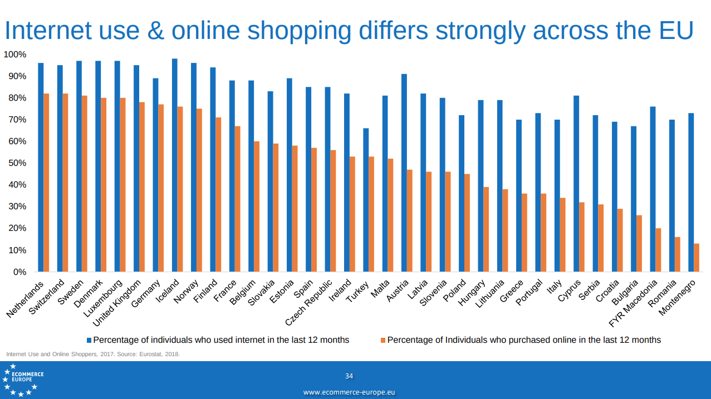

## Hypothesis

A single-purpose NoSQL database for fast reading, tailored to the requirements of e-shop solutions not only in the
Czech Republic, but also abroad, will have an order of magnitude better response than generic SQL or NoSQL database
solutions on the same hardware configuration (i.e. 10 times lower latency between request and response).

## Search engine implementation

Whether the hypothesis is confirmed or refuted - the actual goal of the project is to build a search engine on top
of the chosen technology, which will facilitate the future implementations of e-commerce platforms.

* implementation of a dedicated stand-alone NoSQL database to the level of usable for typical e-commerce catalogs with
  its own HTTP API
* documentation of code and preparation of technical documentation to enable adoption by third parties
* choice of open license and [monetization options](https://en.wikipedia.org/wiki/Multi-licensing) to enable further
  engine development and maintenance

## Prerequisites

The objective is to meet the requirements for the e-commerce frontend described in
[separate chapter](#required-search-functionalities-of-the-e-commerce-catalog) of this document.

The use of currently commercially available hardware is assumed:

* 4x CPU at 2.7GHz
* 16GB RAM
* SSD drive - 80GB
* Ubuntu 20.04 - server

Based on our experience and market research, we claim that the basic e-commerce catalog requirements are very similar,
and it is therefore possible to define a common API that will provide the general functionality for the majority of
current e-commerce websites.

In addition to the functional requirements, the basic non-functional requirement is the performance of the search
engine, which can be measured in two ways:

1. the latency of a single request
2. the throughput of requests processed per second

The second non-functional requirement can be substituted to some extent by connecting more computers to the
[cluster](https://en.wikipedia.org/wiki/Computer_cluster).
The first non-functional request cannot be solved easily by horizontal scaling (other than sharding the data into
multiple parts that are processed separately).

Therefore, the main objective is to minimize the latency of each specific query over customer data.
The database does not have to satisfy the [ACID contract](https://en.wikipedia.org/wiki/ACID) (but might optionally,
since the transactional characteristics are very useful from the developer prospective). The basic assumption is that
the search engine serves only as a secondary index for fast reads, and thus compromises can be made in terms of eventual
consistency, or the need to recreate a complete index from scratch in case of certain operations.

Search engine must be optimised for read latency / throughput. The write performance is not crucial parameter. However,
the database must support incremental updates with concurrent multithreaded reads. It is possible to assume writing only
in a single thread (data indexing will typically be performed by only one thread processing the change log / journal
from the primary data store or using [different change data capture](https://en.wikipedia.org/wiki/Change_data_capture)
technique).

## Anticipated benefit

The Czech Republic is one of [the most dynamic e-commerce markets](https://www.ceska-ecommerce.cz/)
(see [here](https://www.euro.cz/byznys/cesko-je-rajem-e-shopu-loni-se-v-nich-protocilo-80-miliard-1307335) or
[here](https://www.idnes.cz/ekonomika/domaci/eshopy-nakupy-online-elektro-cesko.A190111_162629_ekonomika_fih)) -
e-commerce turnover has been growing at double-digit rates for several years and
[a similar trend](https://www.shopify.com/enterprise/global-ecommerce-statistics) can be observed in neighbouring
countries. It is therefore a valid assumption that the number of companies involved in the implementation and
maintenance will continue to grow.

Small e-commerce sites can be served by a relatively trivial implementation or an existing platform. Today, however,
the consolidation of the e-commerce market is already underway and a number of medium-sized e-shops are emerging
with significant dataset size and system throughput requirements that start to fight with the limitations of these
solutions.

Another specific area is B2B solutions, which are characterized by (in addition to multiple times higher turnover) very
diverse and complex pricing policies, which need to be respected. B2B solutions are
[growing at an even higher rate](https://www.statista.com/study/44442/statista-report-b2b-e-commerce/) than B2C.
Search by price is very challenging with the increasing number of products and price variants.

Today, all e-commerce producers are creating their own application data structures on top of general purpose
databases and are spending huge amounts of resources to create their own APIs and engines that fulfill the client
requirements. They are very often forced to compromise on the e-commerce catalog functionality when the rich features
lead to performance degradation.

Implementation a specialized e-commerce engine under a
[free license](https://en.wikipedia.org/wiki/Comparison_of_free_and_open-source_software_licenses) that covers the basic
functional requirements:

* might save a significant amount of work for implementers and opens up the market for other startups
* might allow implementers to devote their energy to add-on functionalities and thus enrich the market
* might lead to savings on electricity and operational costs - e-commerce websites are operated in
24x7 mode and using a more optimal search engine will save annually considerable amount of hardware resources and money
(see [studies on CPU consumption under different loads](https://blog.zhaw.ch/icclab/understanding-how-server-energy-consumption-varies-with-cpu-bound-workload/))

Although we see ourselves with a very rosy view (see the referenced articles in the introduction
document) in international comparison the Czech Republic is not considered as a leader. See
[studies of the European e-commerce](https://www.retailinsiders.nl/docs/77f3cdc4-38b2-4dd2-8938-cb4293cc8c19.pdf):

Creating a free database engine that meets the basic requirements for implementing an e-commerce solution may change
this role in the future.
The [adoption of open source](https://techcrunch.com/2019/01/12/how-open-source-software-took-over-the-world/) software
that provides a basic license for free is much higher than that of commercially licensed products, and the chances
of penetrating the existing market are thus higher.