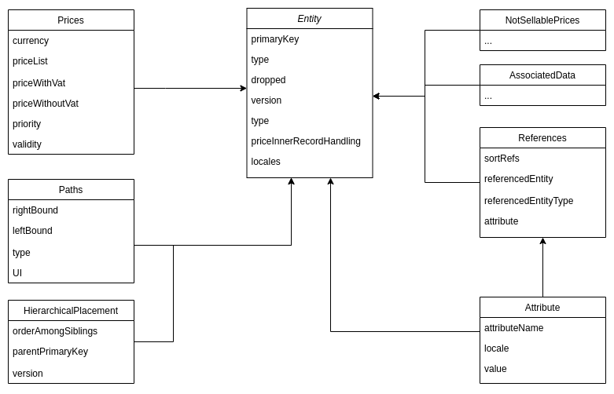

<UsedTerms>
    <h4>Terms used in this document</h4>
    <dl>
		<dt>index</dt>
		<dd>Elasticsearch database</dd>
		<dt>entity</dt>
		<dd>Representation of document before ingestion to Elasticsearch</dd>
		<dt>document</dt>
		<dd>Equivalent to a table in SQL, represents stored entity data in Elasticsearch</dd>
		<dt>product</dt>
		<dd>Entity with type &quot;product&quot;, which contains information about a specific product in the e-shop</dd>
		<dt>catalog</dt>
		<dd>Representation of catalog of products in the e-shop</dd>
    </dl>
</UsedTerms>

This document describes the basic implementation of EvitaDB API using one of the so-called NoSQL databases -
Elasticsearch. The use of the Elasticsearch database was mainly designed for its querying capabilities and speed. The
decision process itself was described in a separate document.

The document describes Elasticsearch itself and the way this tool is designed. It then describes the techniques and
well-known principles used in the following implementation. The conclusion is based on the presentation of several
problems that had to be solved during the implementation, which, in some cases, strongly influenced the final output.

The implementation using the NoSQL database generally achieved the predicted results and was more efficient than the
implementation using a PostgreSQL database system. A major benefit of this particular solution is very fast searching by
document key, but also by specific static document features, such as attributes, references, or facets in the data model
described below. On the contrary, Elasticsearch, and to a greater extent other NoSQL databases, only allow very limited
relational hierarchies, which was the biggest problem of the implementation. Due to the need for denormalization, i.e.,
the duplication of generic values into individual documents, it was necessary to greatly expand the data model, which
increased the database load, but also made it virtually impossible to quickly change a specific value that was stored in
multiple places. The second, equally important critical point was the limited use of
the [Elasticsearch query language (DSL)](https://www.elastic.co/guide/en/elasticsearch/reference/current/query-dsl.html),
which does not allow the calculation of values on the database side, such as in SQL. This feature has been partially
removed by the possibility to define the
so-called [runtime fields](https://www.elastic.co/guide/en/elasticsearch/reference/current/runtime.html), which are
calculated at query time for each document separately. However, this option is very computationally intensive and
therefore significantly slow for a larger dataset. This has caused the solution using Elasticsearch to be up to 15 times
slower than PostgreSQL when calculating pricing using this mechanism. Despite the efforts made, there was no adequate
optimization reached. It would be necessary to find a combined solution for commercial use, for example, using a custom
Elasticsearch superstructure or moving the price calculation to a front-end application. This kind of operation would be
outrageously time consuming.

Another criterion for implementation was complete coverage of the defined EvitaDB API. This criterion could not be met,
unlike the In-memory and SQL implementations. This was due to the aforementioned price calculation, which our
Elasticsearch implementation only allows to calculate after prior full filtering by attributes and other constraints. In
practice, this means that this implementation correctly filters the documents according to the passed query, calculates
the correct prices for specific documents (products), and finally, applies the price constraints (other constraints have
been already applied). However, if it were necessary to define a disjunctive relationship between the price filtering
and attribute filtering in the input query, the Elasticsearch implementation would not be able to do so. This constraint
was not applied in any way in the test data and there was no real use-case found. Therefore, the implementation is still
declared successful with this comment.

## Data model

The data model in Elasticsearch is defined by mapping. It formulates how documents and the fields it contains are stored
and indexed. There are two basic options for
mapping - [dynamic and explicit](https://www.elastic.co/guide/en/elasticsearch/reference/current/explicit-mapping.html).
There was an explicit approach, which is used to set the rules of the structure in which data is indexed.

In our data model, we use keyword data types for structured content, such as the id of the entity (e.g., product), text
when we store strings, and when there is a need for full-text searching. Fields
with [keyword data types](https://www.elastic.co/guide/en/elasticsearch/reference/8.0/keyword.html) can be sorted,
aggregated, and searched
by [the terms query](https://www.elastic.co/guide/en/elasticsearch/reference/8.0/query-dsl-terms-query.html).

Our mapping uses the Nested data type to store arrays of objects so that they can be queried independently. To query
such objects, it is necessary to use
the [nested query type](https://www.elastic.co/guide/en/elasticsearch/reference/current/nested.html) and define a path
to a specific object. Indexing a Nested field data type is costly and can lead to a performance decrease. Therefore, we
try to use the nested field type as little as possible. One such way of avoiding it is to use
the [Flattened field data type](https://www.elastic.co/guide/en/elasticsearch/reference/current/flattened.html), which
stores the entire object as a single field. It is then possible to use simple queries and aggregation to find the
desired value.

To index numeric values correctly, we had to use the scaled_float field data type, which saves some disk space as
Elasticsearch stores the floating-point data into the integer type using a scaling factor. Elasticsearch works with the
number of cents (number*100), which is an integer that
is [easier to compress](https://www.elastic.co/guide/en/elasticsearch/reference/master/number.html) than a floating
point number.

Even though Elasticsearch prefers the least branching documents, our model had to contain inner entity datasets - nested
documents. The pseudo schema is provided in the following figure:



As mentioned in the introduction, the proposed model combines the basic premise of NoSQL databases - data
de-normalization with the need to minimize the size of the document itself. Therefore, for efficiency reasons, the model
contains several atypical patterns. The first is the duality of price and attribute relations. This duplicity is
intended to reduce the amount of data that Elasticsearch scans as much as possible. This is because queries might often
contain filters on prices and a lot of prices would never be returned due to the type of price ("*non-selling*" prices -
the prices that do not participate in the selling price computational process), we store `Prices`
and `NotSellablePrices` in different inner document sets. This allows ES to limit the amount of scanned data in case of
filtering for constraints like "*priceBetween*”, etc. The second pattern is the usage of attributes in references, where
filtering by reference first constrains the referencedEntity (or type), and to avoid having to query even more nested
fields in the form of attributes - the derived data is stored as a compound string in the sortRefs array. This is also
due to the sorting limitation in Elasticsearch - it only supports up to the first level of the document. Therefore,
sorting would no longer be possible at the second level (entity->references->attribute).

Some of the "*Inner entity dataset*", such as AssociatedData or NotSellablePrice did not need to be indexed. They are
never scanned by Elasticsearch during querying, and therefore, it is desired that Elasticsearch just store them and not
work with them in any other way. For this reason, they are stored
as [type: Object](https://www.elastic.co/guide/en/elasticsearch/reference/current/object.html), [enabled: false](https://www.elastic.co/guide/en/elasticsearch/reference/current/enabled.html).
In different versions of Elasticsearch, this naming has changed, but according to performance measurements, this is the
most efficient solution. The second way is the Flattened type option, which stores the entire content as a string, but
this makes the field still indexed or processed in another way.

### Example of mapping

``` json
{
  "properties": {
    "primaryKey": {},
    "type": {},
    "associatedData": {.. },
    "notSellablePrices": {... },
    "attribute": {
      "type": "nested",
      "properties": {
        "attributeName": {
          "type": "text",
          "fields": {
            "keyword": {
              "type": "keyword"}
          }
        },
        "locale": {},
        "numberValue": {},
        "value": {}
      }
    },
    "hierarchicalPlacement": {...},
    "paths": {...},
    "locales": {..},
    "prices": {
      "type": "nested",
      "properties": {
        "currency": {},
        "priceList": {},
        "priceWithTax": { },
        "priceWithoutTax": {},
        "priority": {},
        "validity": {}
      }
    },
    "references": {
      "type": "nested",
      "properties": {
        "referencedEntity": {},
        "simpleType": {},
        "referencedEntityType": { },
        "attribute": {}
      }
    }
  }}
```

The code above defines the mapping of indexes in which the data is stored. The mapping is defined by properties that
contain the names of the document attributes. We can see the definition of data types, such as keywords used for sorting
or aggregation queries or nested attributes, where the attribute contains the sub-attributes that could be queried
later.

## Minor indexes

In addition to the main index, in which the implementation stores all database entities, it was necessary to create
several supporting indexes dealing with operational tasks or special system functions. These are mainly the indexes of
schemes, keys, references, and hierarchies.

The first of these schemes contains a current and valid configuration for each type of entity, according to which it is
possible to create and update entities. These schemas have their complex model and can be size-intensive. For this
reason, they are stored in a separate index that does not burden the main index. In addition, the schema index does not
support attribute searches because they are not required, which also speeds up schema manipulation.

The second of these indexes is the index containing the key generator, which is a special operation that must be as fast
as possible for the possibility of multiple (bulk) insertions and is described in the chapter below.

The index references contain a document expressing the inverse relationship between the entity and the references. In
the real index, there are a large number of references for each entity. While filtering in these references is very
simple, their aggregation and calculation of advanced statistics between them is not possible in this case due to the
limitations of aggregations in ES DSL. To solve this situation and allow the ability to calculate statistics of
occurrences of attributes or their relationships, it was necessary to introduce an inverse index, which contains all the
entities that reference the main entity. In JSON, the object looks like this:

``` json
  {
      "type": {
        "valueClass": null,
        "value": "ParameterType"
      },
      "primaryKey": 495095,
      "usedInEntities": [
        "ParameterItem_498330",
        "ParameterItem_498329"
      ]
    }
```

The last of the minor indexes is the hierarchy index. While the previous indexes were created primarily to achieve
performance gains, the hierarchy index is different. The documents in it are modified only once when the modifications
of the entity hierarchies change and it is possible to store it at the end of the transaction. The hierarchy index is
shared between entity types, but is also separated per each catalog. This index contains only one full hierarchy object
for each entity type, which means this index will contain only a few large indexed documents .

## Data Ingestion

In data ingestion, we had to use a custom serialization and deserialization. We
chose [Jackson](https://github.com/FasterXML/jackson), which is known as the fast Java JSON library. Jackson is a suite
of data-processing tools for Java (and the JVM platform).

For a single Evita entity object, a serializer is implemented that transforms the data into the required model defined
in the ES mapping. Outside the main model, standard serializers provided by the library are used to serialize and
deserialize properties. However, this also required its own specific adjustments and some problems were encountered
during this process.

One of the key issues was the serialization of the map type. There is one speciality for the key - value map. For each
value, we also need to store its type (class). Therefore, we are able to deserialize it back into defined types. The
thing is that every value from the map is represented as an object with possibly a different class. Therefore, it is
necessary to deserialize it back to the correct one. Each class is stored separately with its value. Currently, values
and class names are stored redundantly, in the production version, this should be further optimized by creating a shared
dictionary, and replacing the full class names with a shorter version linking (integer id) to a predefined dictionary
type. The value map in regular serialization looks like:

``` json
{
  "key": "value",
  "key2": "value2"
}
```

But in our case we need to store it as:

``` json
{
  "types": {
      "value": java.lang.String,
      "value2": java.lang.String
   },
  "mapItself": {
    "key": "value",
    "key2": "value2"
  }
}
```

#### Values represented in the ES type

Values of attributes, facets, etc., are in several types - these types are limited by the EvitaDB supported classes and
any Java enum. For this reason, there is a finite number of types that EvitaDB could process and we could map each type
into an ES compatible field type. This mapping is desired for many reasons. The main reason is that ES cannot process
all types in the same way. Therefore, if the type is a string, we cannot store it into an object, because we would not
be able to search by this field. The second reason is that ES is fast if the data is indexed correctly, and lastly, ES
provides types like Range, which would otherwise have to be created as a nested object. To be able to use this ES
functionality, each typed value is stored in a "*proxy*” object. This object resolves the type of value and categorizes
it into one of the ES fields. This object contains common ES types - keyword, boolean, byte, date, and number (scaled
float to store floating numbers). Along with these fields, this object also stores some operational fields -
zoneOffset - to allow recreating OffsetDateTime and type for deserialization. For storing ranges, there are several
fields for each supported primitive type - this is because the scheme does not contain a specific Number type.
Therefore, this is used for deserialization and also for minimizing memory consumption because the scaled float is
memory consuming. There is also field other, which contains objects like Currency and other non-described objects that
are stored as an ES "*object*”. Finally, there is a field named "*multiple*” that stores four serializable values which
are specifically typed, and the field named "*values*” which contains an array of this described object again - in other
words - this object, which can store any typed value, could store other such objects as an array in the field "
*values*”. But this inner value cannot contain another inner value in the "*values*” field . The entire object stored in
ES has the following format:

``` json
{
  "keyword":null ,
  "booleanValue":null ,
  "byteValue": null ,
  "number":null ,
  "date":null ,

  "zoneId": null ,
  "type": null ,

  "integerRange":null ,
  "floatRange": null ,
  "longRange":null ,
  "doubleRange": null ,
  "numberRange":null ,
  "dateRange": null

  "values": [],
  "multiple": {},
  "other": null
}
```

#### Serialization

[The Mixin elements](https://www.tutorialspoint.com/jackson_annotations/jackson_annotations_mixin.htm) were used in
order to ease the burden of custom serializers. The Mixin elements allow us to alter the logic of serialization and
deserialization of attributes without altering the original modeling class. That is the reason why there are special
serialization tools used for specific classes. However, the Mixin abstractions take care of the rest.

## Catalog Isolation

The isolation of catalogs was solved by using individual indexes for each of them. The indexes are independent from each
other. Therefore, there is no way for a catalog to be affected by changes done in another catalog. Still, it is
important to think about the causality noise neighbors.

## Primary keys generation

EvitaDB API works with the primary key as an identifier of any entity in the system. This key must be a unique integer
according to the specification. The SQL databases often use database primary keys or sequences to generate this
identifier, but Elasticsearch does not offer such a feature. However, this feature can be replaced by versioning, where
we use separated index keys into which we insert an object that represents the entity type and call it a generator.
After reinserting the same object, the return information will show the document version - 2. In this way, we insert a
small but the same document multiple times in a row to get a continuous numeric sequence
of [unique numbers](https://stackoverflow.com/a/30776858).

## Warming up state - bulk insertion

For Elasticsearch, it is more comfortable to process the input data as bulk. For that reason, a queue during the warm-up
phase is created. If a data set is inserted without the bulk, it takes much longer (minutes), while with the bulk
ingestion, the same amount of data is ingested in seconds. In case the size of JSON documents in the buffer exceeds the
50 MB threshold, we send the data into Elasticsearch as a bulk. The sweet spot of 50 MB per bulk was found by testing
different sizes and the 50 MB came out as the optimal bulk size for our purposes.

During the warming up state, the implementation allows searching index only for entities by primary key and few other
constraints (attributes) because we have to search ES and at the same time,to search the ingestion queue. In case any
non-supported query is put to be searched, we have to ingest all the entities and only after that, we can run the
search. However, this queue is already used by the ingesting mechanism to check whether the ingested document does not
have any duplicate unique attribute.

During development and testing, it was found that a significant portion of the time required to create entities was
taken up by the synchronous access to the index of the primary key generator. The reason for this delay is mainly due to
the operations of the library itself used to communicate with Elasticsearch, but also due to network delays. For this
reason, the bulk insert always generates a bulk of primary keys (in our case 100) in advance. After the transition to
the transactional state, the remaining ids in memory are used as in bulk insertion. Nevertheless, after they have been
exhausted, they are no longer generated in advance and the creation of specific ids occurs only during the actual
creation of the document in the "*transaction*". The primary key prefetching mechanism may cause inconsistency in the
line of primary keys in entities in the extreme case if the application with the queue stored in memory fails. According
to the specification, such an inconsistency, the queue will continue with the next number in the sequence. In case that
it is necessary to maintain a consistent key sequence, there is an option to disable this pre-generation mechanism. The
number of 100 ids is defined as a compromise between saving speed and reducing the number of ids that could be lost by
the fail case described earlier. A smaller number would significantly impact performance, while increasing the number of
stored ids could result in a noticeable gap in the event of an application crash, which is not directly desirable.

After the warm-up stage has been finished, the queue is emptied and the query for index status is sent. The result of
the query provides us with information about
the [health status of indexes](https://www.elastic.co/guide/en/elasticsearch/reference/current/cluster-health.html)
within a cluster. The cluster health status can be green, yellow, or red. On the shard level, the red status indicates
that the specific shard is not allocated in the cluster, the yellow means that the primary shard is allocated but
replicas are not, and the green means that all shards are allocated. The index level status is controlled by the worst
shard status.

## Implementation of query algorithms

Elasticsearch uses Query DSL (Domain Specific Language) language that is based on JSON. The querying language has two
types of clauses:

* Leaf query clauses

  This type of queries are used to look for a particular value in a specific field. The key representative keywords are
  **match**, **term**, or **range**.

* Compound query clauses

  The compound query clauses are used when there is a need for combining multiple leaf query clauses and creating a more
  complex query. It allows to structure single queries into logical fashion. The compound queries are **bool** or *
  *dis_max**. The compound queries are used when altering behavior of query, for example, a  **constant_score** query.

It is possible to reach different behavior of queries by using them in a distinct context query or filter the context.
The distinct context query answers the question "*How well does this document match this query clause?*” Besides
deciding whether or not the document matches, the query clause also calculates a relevance score in the *_score*
metadata field. On the other hand, the filter context query clause answers the question "*Does this document match this
query clause?*” The answer is a simple Yes or No — no scores are calculated. Filter context is mostly used to filter
structured data. In our case, we usually use query clauses in the filter context as used in the examples of queries in
this paper.

### Basic Constraints

Boolean type of query is used for purposes of constraint searching. It allows combining of multiple queries together by
using occurrence types.

**Occurrence types**

| Occurrence type | Description                |
|-----------------|----------------------------|
| must            | Equivalent of AND operator |
| should          | Equivalent of OR operator  |
| must_not        | Equivalent of NOT operator |

#### AND, OR and NOT constraint

The query used to test AND, OR and NOT constraints in elasticsearch is as follows:

When there is a need for searching a certain value that does not exist in the entity attributes, i.e., when we are
looking for the entities that do not contain a specific attribute. We have to create a special field with an array where
all names of attributes the entity has were defined. After that, the terms query with must_not constraint is used to
query whether an attribute exists in the special created array. This approach is used because when we search for a query
like "*give me every entity that does not have a certain nested field*” - ES returns all entities that have at least one
different nested field, and this would be an incorrect result.

For example: If we are searching for all entities that do not have the sex attribute, i.e., we are looking up for unisex
products, we define query: "*attributes.type*” is not "*sex*”. This query would return all products, since hopefully
almost all products have at least one other attribute. Therefore, we have to query entities where the field containing
all types does not contain the "*sex*” string, which is constructed in ES DSL as:

``` json
{
  "bool" : {
    "must_not" : [
      {
        "term" : {
          "attributes.types" : {
            "value" : "sex"
          }
        }
      }
    ]
  }
}
```

#### EQ constraint

The EQ constraint was handled by multiple match queries where we define the value of the field we want to find. We know
the type of value we are searching for from the entity schema. Therefore, the query translator combines the name of the
field with the correct value type - due to storing in the nested field, that is described in the Data Ingestion chapter.
In this case, the translator combines the searched field "*message*” with the desired type string, which is in elastic
represented as "*keyword*”.

``` json
{
  "query": {
    "match": {
      "message.keyword": {
        "query": "this is a test"
      }
    }
  }
}
```

#### Range (more, less than, between) constraint

The range queries in the DSL Query language are handled by
the [range clause](https://www.elastic.co/guide/en/elasticsearch/reference/current/query-dsl-range-query.html#range-query-field-params),
which contains the following parameters:

* *gt* - Greater than
* *gte* - Greater than or equal to
* *lt* - Less than
* *lte* - Less than or equal to

The InRange constraint can be handled using
the [relation parameter](https://www.elastic.co/guide/en/elasticsearch/reference/current/query-dsl-range-query.html#range-query-field-params)
of the range type query. The valid values for the relation parameter are as follows:

* *intersects(Default)* - Matches documents with the range field value that intersects the query’s range.
* *contains* - Matches documents with the range field value that entirely contains the query’s range.
* *within* - Matches documents with the range field value entirely within the query’s range and is used as analogy to
  the InRange constraint.

Dates are stored as numbers that express seconds of epoch. This is done to simplify the query translation, since we can
use the same constraint creation as for number values with this representation. By representing the date as a number, we
have to store the zone information to properly deserialize the OffsetDateTime.

* *in set constraint*

The in set constraint is in our implementation handled using the terms query, which consist of several match queries for
the specified attributes.

``` json
{
  "bool" : {
    "must" : [
      {
        "terms" : {
          "code" : [
            "A",
            "B",
            "C"
          ]
        }
      }
    ]
  }
}
```

#### Contains , starts with , ends with constraint

Elasticsearch indexes every character that is ingested to the database. Full-text searching is therefore very effective.
A wildcard query is responsible for full-text searching within the fields of documents that are indexed in the
Elasticsearch index. The wildcard operator allows us to create a wildcard pattern which matches the beginning, end, or
part of a word.

``` json
{
  "bool" : {
    "filter" : [
      {
        "nested" : {
          "query" : {
            "bool" : {
              "must" : [
                {
                  "match" : {
                    "attribute.attributeName" : {
                      "query" : "name"
                    }
                  }
                }
              ],
              "filter" : [
                {
                  "nested" : {
                    "query" : {
                      "bool" : {
                        "must" : [
                          {
                            "wildcard" : {
                              "attribute.value.singleValue.keyword" : {
                                "wildcard" : "bb*"
                              }
                            }
                          }
                        ]
                      }
                    },
                    "path" : "attribute.value"
                  }
                }
              ]
            }
          },
          "path" : "attribute"
        }
      }
    ]
  }
}
```

#### IsTrue, IsFalse constraints

The *IsTrue* and *IsFalse* constraints are solved by the boolean field type in mapping. When querying, the true/false
value is looked for in the boolean field. The example of code is provided below.

``` json
{
  "bool" : {
    "filter" : [
      {
        "nested" : {
          "query" : {
            "bool" : {
              "must" : [
                {
                  "match" : {
                    "attribute.attributeName" : {
                      "query" : "alias"
                    }
                  }
                }
              ],
              "filter" : [
                {
                  "nested" : {
                    "query" : {
                      "bool" : {
                        "must" : [
                          {
                            "term" : {
                              "attribute.value.booleanValue" : {
                                "value" : true
                              }
                            }
                          }
                        ]
                      }
                    },
                    "path" : "attribute.value"
                  }
                }
              ]
            }
          },
          "path" : "attribute"
        }
      }
    ]
  }
}
```

### Prices

During indexing, the prices are divided into two following fields within the JSON entity:

1. *Prices* - active and selling prices
2. *NonSellablePrices* - inactive or the prices that are not used for looking up for the selling price. There is no need
   to index these prices, they will not be involved in any calculation.

The price calculation is done in several steps. In the first step, filters are applied to selling prices: *between*,
*currency*, *valid*, and *priceList* constraint. This first filtering is only one within the static fields, therefore,
it is quite fast. After these base filters, the result of the set of products should be considerably limited, but will
contain products that have any price matching specific filters, while the real applicable price is still out of
question.

For example: there are two products in the database: product A, which consists of a price of 180 USD, and a price of 260
USD, and product B, which consists of prices of 150, 190, and 500 USD. The query will contain prices between 170 and 200
USD so that after applying base filters both products will be returned. Due to the price politics, product B has an
applicable (selling) price of 150. This means that the base filters are only used to limit the number of input products
in the calculation of price and their result cannot be used as the final one.

After applying the basic filter, Elasticsearch must calculate the true usable price of each product. This is achieved by
means of the so-called runtime field. The runtime field has many uses in Elasticsearch and can be defined both in the
mapping itself and in the input query. Because the calculation contains several variables that change while querying, we
need to define the price calculation directly in the query itself. This calculation is quite complicated. Therefore, it
is expensive to calculate (it is written in
the [Painless scripting language](https://www.elastic.co/guide/en/elasticsearch/reference/current/modules-scripting-painless.html) -
a special language used for runtime scripting in Elasticsearch). In practice, this means that for each price query, a
special compiled script containing the same constraints as the base filters, but applied only during the calculation
itself, is created according to the filter price constraints. This computation is too long to describe individually, but
it corresponds to the algorithm for computing prices in the specification. The output of this calculation is therefore a
final price of a specific product to which the so-called limited post filter or even sorting can be applied.

After this computation step, we filter the products with the added final price in one of the fields. Subsequently, it is
possible to apply once again the filter "*between*” and thus limit the selection to the result set for the last time -
this condition must be applied by using
the [post-filter](https://www.elastic.co/guide/en/elasticsearch/reference/current/filter-search-results.html#post-filter).

It is also possible to apply the "*order*" clause to this calculated field to receive the result entities in the desired
order. This approach works for any other non-computed fields.

This method of querying is essential. We cannot calculate the price during indexing, because the key information is
known only when the query is executed (exact time for evaluating the price validity, or composition and order of the
price lists, for example). At the same time, however, it creates one major disadvantage over other implementations, and
that is the impossibility or relationship of price with other conditions. Since the post filter and the price
calculation itself are very demanding, their further extension would be technically unbearable (and we did not find any
way to improve it). Therefore, unlike different Evita implementations, we cannot make query as:

``` json
or(
	and(
		facet(Entities.CATEGORY, 5),
		startsWith(ATTRIBUTE_CODE, "Gorgeous-Rubber-Wallet-2-15"),
		priceBetween(1,2)
	),
	facet(Entities.CATEGORY, 1)
)
```

### Hierarchy structures

Elasticsearch does not support relational querying (or not completely). This is the reason why hierarchies have been a
huge issue. In the end, and after some experiments with the parent-child ES mechanism
and [tagging](#hierarchy-structure---tagging) (which is described in the problems chapter), we have decided to use
the [PMPTT library](https://github.com/FgForrest/PMPTT) in our implementation.

Utilization of this principle was not difficult in this implementation. It consisted of two steps - the application
maintains an instance of the *PMPTT* library in a static context that contains the hierarchies of all catalogs. When an
entity is stored in the ES, depending on the entity type, the given hierarchy is updated and then the entire hierarchy
is stored in a special index. The reconstruction only takes place when the EvitaDB application itself is started, which
greatly speeds up the response of queries to hierarchies. This feature cannot be used in a cluster, however, the dates
of the last modification are already stored in this index, a simple implementation would allow checking the actuality of
the existing instance before querying the hierarchy and possibly reconstructing it from the database. The entity itself
then stores the bounds generated by *PMPTT* as a location reference in the hierarchy. The same principle is applied to
entity references, which are replaced during serialization with references containing just the bounds, type, and key of
the referenced entity. Both the hierarchy location itself and the refs are subsequently stored in the paths attribute,
which is a direct descendant of the main document. Therefore, searching should be fast. The value of this attribute is
an array of objects that looks like this:

``` json
{
  "rightBound": 86327246383222,
  "leftBound": 85472521171508,
  "type": "Category",
  "ui": "Category_440835"
}
```

This object contains the previously mentioned bounds that contain the numbers in which all related entities (
sub-entities) lie. These bounds are unique for the entity type. Of course, the type itself is printed in the object,
which could be a category or, for example, a brand if the brand entities had a hierarchy. The last parameter of this
special object is a field called UI, which contains the concatenated entity type and entity id, which means that it
duplicates the ability to query a specific entity. In other words, we can query for a specific entity described by the
left and right bounds and the type of the requested entity. Alternatively, we can use this UI field to query using only
the entity type and id. There is one specific reason for this duplication, and that is aggregation - we want to
aggregate by one field that is unique for each entity. Therefore, this field comes as a solution.

An object serialized in this way can then be searched in the hierarchy much more quickly than if the hierarchical
structures are directly in the DB. One disadvantage, however, is the large de-normalization of values. The generated
bundles are stored in many places and their modification is subsequently formed by bulk update operations to the DB.
However, this modification is very computationally intensive and would be very time-consuming if a large part of the
hierarchy tree is modified. This mechanism is also very risky as far as the transactions are concerned because it breaks
the desired atomicity of operations. This problem is further described in the chapter
on [possible transaction support](#transactions-and-acid-handling).

In the actual lookup, for each of the constraint hierarchies, the PMPTT library is first queried to return the bounds of
the queried entities and only these bounds are written into the ES request. For example, if a constraint
*withinHierarchy* category A exists in a query to EvitaDB, then the first stage of the query transformation is to find
out the bounds of this hierarchy, and only afterwards, the query is sent to ES that searches for all entities that occur
in the specified bounds and with the specified type. The query is always formed within the range between the given
bounds (left, right), thus achieving a slice operation within the hierarchical tree.

Thus, if we have category 1 with bounds 1 to 20, and category 3 with bounds 5 to 10 for the product, then the query for
products in category 1 will be - "*give me all products that have a category bounds between 1 to 20*" in the reference
type. As mentioned before, just like bounds, they must have the same type of entity.

The mechanism described above provides, in particular, the constraint *withinHierarchy*, which queries a certain subtree
of the hierarchical tree, but a similar mechanism is applied to the second of the hierarchy constraints
*withinRootHierarchy*. However, if the category is the root, it has nulls instead of the bounds themselves, which can
also be used for querying (by querying the entity that contains only nulls in the bounds). There is also a difference
for other defining constructs, such as *directRelation*, where, in contrast to *withinRootHierarchy*, one must search
for the entities that do not have a *directRelation*. On the contrary, with *withinHierarchy*, one searches for the
entities that have the exact bounds that the queried category has. The exact opposite principle works for
*excludingRoot*, where, on the other hand, the search must be restricted to the entities that have non-zero bounds.

A special case is the restriction of excluded entities. In this case, a subquery must be created that contains the
limitation of the results that comprise the same bounds as the excluded entities in the query. In this way, all
descendants of the entities in question are dropped from the result, and to delimit the entities themselves, the second
constraint must be added directly to the key and type of the entity.

#### Parent Computation

When computing hierarchical ancestry, Elasticsearch has a major drawback in that it does not support full relation
joins. Also for this reason, the external use of the *PMPTT* library was chosen when implementing the filtering of
hierarchies. This helped to simplify the tree path query mechanism as well.

For each queried entity, an array of their ancestors is created from the *PMPTT* library, which itself is the entire
result of the desired process. In the implementation, it is necessary to retrieve the base information (the base entity
itself) for each referenced entity from this list. The situation is complicated only by the superstructure constraint
*ParentsOfType*, which requires ancestors of a certain type. In this case, the mechanism starts differently, the
database is first queried for the entities for which the result is to be generated. Part of the request processing
requires fetching references for these entities. From these references only those of a specific type are selected, and
for all entities referenced in this way, a path to the root of the tree is then created as already described in the
first case.

#### Statistics Computation

Thanks to the usage of the *PMPTT* application library, it is relatively easy to calculate hierarchy statistics for this
implementation. We create a tree by using a *PMPTT* instance in memory. Afterwards, we ask ES for basic information for
each entity in the tree, including the language. We prune the tree by using the rules of interconnection on the
category, language, etc. After this filtering, a query is then sent to the ES database to aggregate the special field ui
in attribute paths, which contain a unique identification of the referring entity. The result of this aggregation is the
number of occurrences for a specific entity ID. In the previously created tree, the individual cardinalities of the
nodes of the tree must then be added from the leaves up to the root, which then produces the entire hierarchy
statistics.

### Facets

The facets probably represent the most complicated mechanism. The data, such as facets or references, are represented
within the object stored in Elasticsearch under the "*references*" field with the following structure:

``` json
{
  "sortRefs": [...],
  "referencedEntityType": "Tag",
  "referencedEntityPrimaryKey": 577,
  "types": [
    "systemId", ...
  ],
  "attribute": [
    {
      "attributeName": "systemId",
      "value": {
        "singleValue": "freeShipping6000",
        "key": "systemId",
        "valueWithType": "Tag_systemId"
      }
    },{...}
  ]
},
```

Since information about the specific references is needed for filtering and calculation of statistics, these references
are not only stored in the entities themselves, but also in a separate reference index. This is done primarily for
performance reasons because otherwise, it would be necessary to perform an aggregation query when Elasticsearch searches
through all stored entities and returns a unique list of references. This method was performance-unusable even after
several various optimizations of the tree structure object or preferential indexing of fields. Therefore, a new inverted
index was introduced, where entities themselves express the references and contain a list of object ids that use the
reference. This method of storage is more demanding to change because both indexes (the index with an entity and the
inverted index with their facets) must be updated [simultaneously](#transactions-and-acid-handling). However, even this
was not a performance-wise sufficient solution, since the implementation needs the entire list of existing references
when calculating statistics. This meant pulling the entire inverted index from Elasticsearch, which could contain a
large amount of objects. Therefore, the final solution was to move the reference index into the memory of the EvitaDB
implementation (we call it the reference cache). This solution stores the reference to the entity itself during the in(
up)serting. It then uses the reference cache to compute the affected (modified) references, reflects these modifications
in the stored reverse index in Elasticsearch, and deletes the local cached index image because it may have changed as a
part of the computation. The next time the query would like to use the local cache, the current state of the inverted
index must be fetched and reconstructed in the cache. However, these changes are less frequent than the reading
operations themselves.

After introducing the caching approach, the actual filtering by reference can be described. This whole mechanism is
based on the fact that there is reference information kept in memory. First, the references are sorted according to
their types. Then, all the influencing hints, such as *FacetGroupsConjunction*, *FacetGroupsNegation*, etc., are found
in the input query. With these hints, all the queried facets are also found in the query according to which they are to
be sorted out in a later phase. The next computation then finds the facet groups that are queried (if any) for each
facet group from the hint and creates the corresponding query for each of them. For instance, if the
hint `facetGroupsConjunction('parameterType', 1)` and the filtering constraint `facet('parameterType', 8, 16)` exist in
the query, then the mechanism for group '*parameterType*' 1 finds all matching references in the reference cache. In
this case, for example, it would find both facet 8 and facet 16. It then creates a query for both of these facets -
conjunction one in this case. Pseudocode would look as
follows: `should(eq('facet',8),eq('facet',16)).minimumShouldMatch(1)`. The negation and disjunction of constraints
follow a very similar pattern, but using the "*must*” and "*mustNot*” conditions.

#### Summary Computation

As with the facet filtering query, the calculation of reference statistics is based on the stored memory of references -
previously mentioned as the reference cache. When compiling the statistics, the main query itself is already executed,
therefore, the numbers of objects found for the input query are refined. In the first step, the second query, very
similar to the original compound query, is sent to ES, but returning only the number of hits and no *UserFilter*. This
second query returns the result as if the user had not entered any input. Therefore, for statistical purposes, it is a
null point. However, with the result of the entities found, the aggregation of the references of the entities found is
also queried. This aggregation represents the number of individual references in the filtered set.

Once all the input data has been created as described above, the results from the aggregations are then combined for
each existing facet to express how the original result was affected by that facet. The references that would produce
empty results are then filtered out. The remaining ones are then moved to a special object and, if necessary, their
potential impact on the query result is calculated for them, please see below.

#### Impact Computation

The calculation of the impact of selecting each facet on the query result is quite complex due to the need of using the
references stored in memory. The calculation is divided into two phases - "*computing*” and "*inferring*”. The computing
part uses disjunct and negated facets, which are included in the userfilter. The entity counts for these facets cannot
be inferred in any way from existing information because the objects that were not part of the baseline query could also
affect their results. Even though it is performance-intensive, it is necessary to create a custom query for each of
these facets (disjunctive and negative ones). The number of these per facet queries could be large. Therefore, we stack
them into a multi-search request. The problem is that this could also heat down ES in the case of a large dataset. We
empirically tested that it was optimal to send 30 queries in a single multi-search request for the datasets used. The
output then contains only the number of filtered results. These individual results are then subtracted from the original
input query and this ends the "*computing*” phase.

The "*inferring*” phase is a bit more complex.

It is necessary to add an
Elasticsearch [terms aggregation](https://www.elastic.co/guide/en/elasticsearch/reference/current/search-aggregations-bucket-terms-aggregation.html)
into the main query. The added aggregation computes counts of the individual references in the found entities. For
example, the aggregation would return:

`Brand_154272 : 125, ParameterItem_495799 : 365 entities , ...`

For clarity, let us call this the map of counts, facet count memory, which is created in the first request. After the
evaluation of the first (main) request, additional data are computed, including facet summaries and impacts. In this
impact computation phase, we find an entity count from the facet count memory (aggregated earlier) for each existing
facet. This count is the result for most of the facets with conjunctive relation because the impact is just a number of
results that would be returned if this specific facet were included in the query, and aggregation does basically the
same.

This simple mechanism, which uses aggregation, works correctly only for the facets that are in a conjunctive relation.
But there are other relation types as well, if any of the other requested facets were disjunctive, then the result would
be different by a number of results added because of the disjunctive facets. Therefore, we need to subtract the impact
of all requested disjunctive facets.

The result for the conjunctive facet is after all:

*aggregation of specific facet - disjunctive result - totalResult*

In case no disjunctive facets exist, this additional part of computing is skipped.

In conclusion, the impact of conjunctive facets is the product of a number of entities that actually contain a facet and
the number of entities that contain any facet in a disjunctive relation.

### Histograms

#### Price Histogram

The price histogram computation is divided into two parts, just like the facet impact computation. In the first part, we
add the aggregation request stats to the original query, but unlike the facet computation, we query this aggregation
separately after the main query. The reason is that in the statistics computation we cannot apply the price filter "
*between*”. This aggregation returns global statistics about a specific field - in this situation about the "*price*”
field which is also a runtime computed field, but it does not affect this mechanism. This part results in three
numbers - the maximum price found in the return set, the minimum price, and the number of returned prices, which is the
same as the number of found entities.

Then, there is the second part, which actually constructs a histogram. After receiving min and max of the returned
prices, the interval is computed as `(max - min) / numberOfWantedBuckets`. This interval is used in the third query for
defining
the [histogram aggregation](https://www.elastic.co/guide/en/elasticsearch/reference/current/search-aggregations-bucket-histogram-aggregation.html).
As a second argument, we use the minimum price value returned as offset from the previous aggregation.

The result of this third request contains the final result which is returned by the EvitaDB request. Therefore, we only
need to transform the Elasticsearch model into the EvitaDB classes model.

#### Attribute Histogram

The same approach as was taken for the price computation is taken for attributes. The difference is that the computation
is done for each attribute. In the first phase, we have to restrict all filters that would use the current attribute -
in other words, the filters are restricted in queries that compute min/max of a specific attribute. For example, there
cannot be any filtering constraint applied in a query within the field "*size*”. The second part is the same as in the
price histogram construction, but it is done for each attribute.

### Problems encountered with the platform

#### Transactions and ACID handling

Almost every relational database system complies with the ACID rules. The NoSQL databases usually stick to the BASE
model, which is less strict. The main reason is that relational database indexing is centralized while the NoSQL
solutions are usually distributed. Nevertheless, it is now possible to find
the [NoSQL solutions](https://www.ijser.org/researchpaper/A-Comparative-Study-of-ACID-and-BASE-in-Database-Transaction-Processing.pdf)
that provide the ACID constraints as well.

Elasticsearch does not support the ACID transactions, but it is possible to cope with that in its own way. The first
solution would be to use Elasticsearch only as a search engine on top of a relational database which handles the ACID
transactions by default. If it is not the case and Elasticsearch is used as a database and search engine at the same
time, there are four approaches that provide the solution:

* Global Locking
* Index Locking
* Document Locking
* Tree Locking

In Elasticsearch, changes to individual documents are ACIDic, but not the changes involving multiple documents. In our
case, the "*Evita*” database is designed primarily for data reading. Our implementation creates five indexes - main,
which contains the EvitaDB entities, hierarchy, references, and schemes indexes, and lastly, the key index, which is
used to generate primary keys. It would be quite difficult to use the document locking technique to accomplish the
transactional state because it would be necessary to lock each document in every index which could lead to a problem of
deadlocks that are common in many relational databases. It would be also very expensive regarding facets (references -
there could be hundreds of them). Rather than locking every involved document, it is possible to lock just part of the
directory tree. That can be done by using tree locking. This solution would be even more expensive. More usable
approaches are index and global locking. In our case, index locking would not solve anything, because we use more than
one index per catalog. Therefore, if we locked the main index, the reference index would still be changed and that would
lead to deadlock again. Because of that, we would recommend using partially global locking, which would mean locking all
five indexes of a particular catalog at once. At the beginning of the transaction, the writer would need to create a
lock - this would be done as a lightweight document identifying the current writer that would be ingested to another
independent locking index. Uploading this small document is atomic in Elasticsearch. Therefore, this can be safe with
regard to other possible writes. This would allow one writer to hold the transaction and each of the other EvitaDB
instances has to wait to renew the locking document.

##### Transaction procedure

Right after solving the locking of catalog indexes, there has to be a solution for rollbacks and failures. Because
operations that ingest data into ES could be heavy - in a number of affected documents, we would recommend
creating [WAL - write-ahead log](https://en.wikipedia.org/wiki/Write-ahead_logging) to the locking index. This - let us
call it the WAL recipe - would be inserted before any change to other indexes and would contain a list of entity ids
which will be affected by the transaction. With each of these ids, there would also be their current version - before
the change and flag if this operation were successful. After ingesting the WAL recipe, operations could begin. Before
each operation, there has to be assurance that the previous operation ended up completely - checking the flag. Right
after this implementation, upload the new version of a particular entity and again download this entity from ES to check
whether ingestion was done successfully. Only if these two versions - before and after the upload - are the same, the
flag could be inserted into the locking document.

In case the EvitaDB implementation writer crashed during the transaction, the locking document would stay in ES so that
the implementation could proceed where it ended up or at the boot. The implementation could rather renew versions that
were operational before the transaction - rollback. This factual rollback can be used in every moment of the transaction
process, which renews the state before the transaction.

#### Thread pool - queue a connection reset

EvitaDB has implemented a different pattern in using the Elasticsearch engine. The most common usage pattern of this
engine uses relatively shallow queries on shallow structures of large data sets. Our case is opposite, we use deep
queries on deep structures with relatively small data sets (even if we count associated data). Due to our pattern,
Elasticsearch is very memory intensive, as written before, but even if there is enough memory, Elasticsearch still has
to set up a thread pool. When this pool is used up, then other requests
are [put in the queue](https://www.elastic.co/guide/en/elasticsearch/reference/current/modules-threadpool.html). Thus,
this behavior is excellent in the case of fast queries, but in case that few users want to count prices and other facet
summaries, the pool will be freed after seconds! Therefore, we need to set some high number to:

``` yaml
thread_pool:
  search:
    size: 50
      queue_size: 2000
```

In case there are not enough threads in os, the queue will be created at os level, not at Elasticsearch.

#### Memory consumption

During development and testing, one of the major limitations was the memory consumption of ES. In the early stages of
development, we primarily tried to denormalize the model as much as possible, and this was because the use of nested
documents is not primarily recommended with respect to performance. Over time, however, we had to severely restrict this
principle because even on smaller test datasets, the duplication of entity values increased memory enormously, and thus
the memory of ES itself increased very quickly. One of the most important parts to reduce this consumption was to
improve the mapping, where, after disabling several large fields, we were able to reduce the consumption by up to half
on each entity.

Another huge negative of ES during development was the very little control over ES itself, where if the allocated memory
were exhausted, ES would shut down without any message. The result was only an incomplete response to the client
implementation, and tracking down such a problem was all the more difficult.

However, unexpected ES shut-down did not only occur when memory was exhausted but also when we used aggregation logic
inefficiently. In several phases, we have already tried to delegate the very complex statistics logic to ES, but if the
aggregation were complex and the input data were not sufficiently prepared for it, ES would also stop working under
certain circumstances, either due to the thread pool overrun, metaspace (despite a large limit), or to the allocated
operational memory required to create the aggregation.

For these reasons, the implementation using the Elasticsearch database is the most memory intensive of the three
implementations.

#### Nested vs. flattened vs. object

As mentioned in the previous chapter, the correct definition of mapping was one of the key features of the ES
implementation. In particular, the limitation of indexing some fields that were not needed. According to the
documentation, several different functionalities can be used for this in ES, starting with the enabled tag, indexed, or
even the field type (object) itself. Unfortunately, the use of these features in the mapping varied in different
versions of ES, and therefore, the references in different parts of the documentation were not consistent about which
attribute did what. We had to combine and test these fields during implementation to figure out their different impact
on performance.

In addition to the properties in the mapping, the use of the types themselves was often confusing. At least from our
point of view, the differences between the nested, flattened, and object were often very blurred and it was hard to
decide which type to use for each field with respect to possible use in development or possible performance loss. This
was resolved over time by using the "*fastest first*" technique, since the object type is the fastest in terms of
performance but does not allow the use of more advanced filtering logic. This type was used for most attributes. Once an
attribute was used in any of the application logic, it was changed to flattened or nested, depending on whether it was
necessary to create a nested query over the attribute.

#### Deleting entities

One of the possible bugs or confusion of the ES database was also deleting multiple data at once. In testing, it was
found that deleting data from an index was usually faster than deleting and recreating the entire index. For this
reason, deleting all data was also used when an existing EvitaDB database needed to be deleted. A
classic [DeleteByQuery](https://www.elastic.co/guide/en/elasticsearch/reference/current/docs-delete-by-query.html)
request was used to delete, waiting for all existing shards. However, since the deletion was performed on multiple
indexes at once (sequentially) ES most likely used all threads that were designed for data deletion. This caused an
anomaly where despite successfully executing a series of commands: RefreshIndex - Deleteby match all query -
RefreshIndex. After these commands not all entities were deleted. The resolution occurred only when we sent a second
delete request after this series. We have not been able to track down this inconsistency on any of the forums, and even
upgrading Elasticsearch DB to the latest version has not resolved the issue.

#### State-full scroll vs pagination

In the case of most relational databases, there is very well-known pagination such as size and offset conditions. In
this case, it is necessary to add two parameters to each query - how many records should not be returned from the
result (skipped) and how many entities there should be before the first return, and how many entities the result list
should contain. The same mechanism is implemented in the case of the Elasticsearch database, but in newer versions, it
is limited by a predefined number of entities retrieved in this way. This is for performance reasons, where it is far
more optimal for ES to use the so-called
scrolling. [Scrolling](https://www.elastic.co/guide/en/elasticsearch/reference/current/scroll-api.html) is a mechanism
whereby after querying the first "*page*" of an entity, the specified "*id*" of the query is stored with the result as
soon as the next "*page*"  needs to be queried. It is not subsequently necessary to re-execute the entire query - only
the retrieved query id and the number of additional entities to be served can be specified. This mechanism is very
convenient for ES because it can store the result of the query internally and thus perform the filtering only once and
subsequently, return different subsets of the result.

However, scrolling cannot be used in classic querying implementations because the EvitaDB query is by definition
state-less. In order to use it, it would be necessary to cache the queries executed by a single reader and then
distinguish which queries match and build on any of the previous queries. However, this mechanism was not implemented
due to time constraints and also might not be used due to the number of subsequent queries.

#### Entity split

After implementing all the necessary functionality, we had the opportunity to optimize the implementation. One of the
first steps of this optimization was to focus on the optimal use of the ES repository, both by proper mapping and by
reducing the size of the searched indexes. This led us to one of the bigger ideas - splitting the entities into a
filtering part and a content part. This mechanism used index duplication, i.e., a second index - the data index - which
was created in addition to the main entity index. While the main one contained only an attribute, reference, and price
data for the entity (only the data needed for search), the data index contained only the data needed for the entity
reconstruction. The consequence of this split was simple - entity searches were sent to the original index, which no
longer contained non-sale prices, associated data, and many other fields that were not needed for searches. However,
after the result of the search, the second request had to be created, which queried (by document ID) the second index
and returned the data itself. After this split had been implemented, only a very small part of the data was duplicated
in the indexes because both the querying and the data object were used to reconstruct the entity. Unfortunately, even
after full implementation of this mechanism, we did not observe any significant speedup and it only complicated the flow
of querying, serialization, and deserialization. Therefore, this logic was not included in the final version of the
implementation.

#### Limited access to model classes

One of the big problems of practically the whole implementation part was the serialization of the model. The input to
the EvitaDB implementation is an externally created model that contains several transient properties and is mostly
immutable. The first idea was to separate the properties needed for filtering and other operations in JSON outside the
main data structure. This would have the effect of splitting the fields in an ES document into two types - data and
duplicate filtering fields. This approach has more or less worked over time, as it has allowed us to narrow down the
filtered objects and thus speeding up the filtering process compared to when the required data was more nested. At this
phase, there was a master serializer that extracted the filtering attributes from the entity and let the entity itself
serialize generically. However, the problem arose further in the serialization of both attributes and associated data,
which contained transient properties that had to be extracted from the serialization, and the class model itself did not
contain the necessary deserialization constructors and setters. This had to be addressed by the
so-called [jackson mixins](https://medium.com/@shankar.ganesh.1234/jackson-mixin-a-simple-guide-to-a-powerful-feature-d984341dc9e2),
which allowed to add deserialization annotations and constructors to the classes. However, the final problem was
subsequently the size of such an entity. The model itself contained duplicated entity fields for the sake of speed,
which is fine in Java because the references do not fill memory, but serialization printed these objects several times.
This, combined with the memory issue mentioned earlier, caused huge implementation problems, and after all our efforts,
we were forced to rewrite the serialization except for the associated data part to our own serializers and
deserializers. This current method has a huge advantage since the stored data has no duplicates except for the ones we
want to search for, and the model in ES is completely controllable. However, the opposite negative is the big difference
between the two models - the EvitaDB model and the ES document model. Another very common problem was the complete
dependence on the structure of Java model classes - as soon as any field in the underlying EvitaDB model changes, the
serializers need to change as well.

#### Non-human readable nested queries

It is also worth mentioning that compared to, for example, the SQL language or even EvitaDB query language, DSL is very
content-intensive, and in phases, when the input query is very complex, it is practically impossible to read the query
logic from DSL. We often encountered queries during implementation that had up to thousands of lines (after formatting)
and thus, it was not possible to parse the query without time-consuming exploration.

#### Hierarchy structure - tagging

One of the other blind alleys we tried in the implementation was the early implementation of hierarchies. The initial
idea was to use linked tags instead of the current category bounds. The object already described in
the [hierarchies chapter](#hierarchy-structures) would be exactly the same, but instead of two bounds, it would contain
a single string that would look like, for example, "*/category1/category2/category3*". Using this concatenated string,
it is possible to create the same filtering as now using wildcard conditions, but there are major problems associated
with this. The very first and biggest one was again speed. Since most of the conditions do not have the full category
path specified, it was necessary to use conditions like "*category2*" i.e., left, right, or both sides of the
unrestricted [wildcard bounds](https://www.elastic.co/guide/en/elasticsearch/reference/current/query-dsl-wildcard-query.html),
which is very performance intensive for ES. In the filtering, this burden was still bearable, but the problem arose in
the case of calculating the statistics hierarchy when it was necessary to search a large number of entities in a single
request, just according to this concatenated string. This no longer made any sense performance-wise and it was finally
chosen to re-implement the logic to use the PMPTT library, which allows the search to be created in memory, and much
more efficiently. Subsequently, only queries by ID or classic strings without wildcard conditions are sent to ES. The
use of PMPTT at this point could still be replaced by one of the de-normalization techniques, such as the combination of
concatenated path (described earlier) and category id fields, which would potentially speed up the search for entities
within a specific category. However, there is also
the [parentsOfEntity](https://gitlab.fg.cz/hv/evita/-/blob/master/docs/fct_specs/querying/query_language.md#parents)
and [parentsOfType](https://gitlab.fg.cz/hv/evita/-/blob/master/docs/fct_specs/querying/query_language.md#parents-of-type)
functions, which is also computationally intensive in terms of searching for entities in the hierarchy. Due to the
blending of hierarchies into a large number of API functions, we decided to implement PMPTT, which is much faster than
the ES denormalized principle, but there is definitely a way to do it the ES way.

#### API deprecation

As a final issue, there is an incident that happened with one of the last versions of
the [Java High-Level REST Client](https://www.elastic.co/guide/en/elasticsearch/client/java-rest/current/java-rest-high.html#java-rest-high),
where most of the library was marked as deprecated in the Elasticsearch 7.15 minor release. The replacement for this
library is now
the [Elasticsearch Java API Client](https://www.elastic.co/guide/en/elasticsearch/client/java-api-client/7.17/index.html),
but it offers completely redesigned functionality, and rewriting the ES implementation to this new API could take
several tens of hours. In addition, the API is mostly undocumented for now. Therefore, it was not even possible to
rewrite the implementation to the new API at the end of the project.

## Appendix A: Elasticsearch selection rationale

This document contains a rationale that was created and written before the prototype implementation started. It's the
output of the initial research phase where the team selected the particular relational database for prototype
implementation. Some statements in this appendix might be inaccurate because they reflect the knowledge available at
the very beginning of the project that evolved in time as the team learned the subtleties of the domain and the
datasets.

### Introduction

This document is an analytical part of our research of evitaDB. The main purpose of the research is to find out if
Evita
DB is able to overcome current NoSQL databases that are on the market. To figure this out it is good to compare features
of evitaDB to other NoSQL database. This document is meant to help us choose the most relevant NoSQL database and
compare
it to evitaDB. The document contains requirements to NoSQL database we compare to evitaDB, comparison of two NoSQL
databases, explanation of the choice we made towards the choosing a relevant NoSQL database to compare its features
to evitaDB, models of structures of storing data and how it could affect the performance of the database and testing
of certain queries on stored data.

### Database platform selection

Regarding the following requirements:

- free to use
- well documented
- well known among developers
- fast
- HW/OS support, usability of Docker container

we reduced the number of NoSQL databases to two of the most popular and used
today - [Elasticsearch](https://www.elastic.co/)
and [MongoDB](https://www.mongodb.com/).

*Table 1: Comparison of Elasticsearch and MongoDB*

| **Parameter[sources]**                                                                                                                                                                                                                                                                                                                                               | **MongoDB**                                                                                                                                                                                                                                                                                                                                                                                                                                     | **Elasticsearch**                                                                                                                                                                                                                                                                                                                                                                                                                                                                                                                                                                                                                                                                                                                                             |
|----------------------------------------------------------------------------------------------------------------------------------------------------------------------------------------------------------------------------------------------------------------------------------------------------------------------------------------------------------------------|-------------------------------------------------------------------------------------------------------------------------------------------------------------------------------------------------------------------------------------------------------------------------------------------------------------------------------------------------------------------------------------------------------------------------------------------------|---------------------------------------------------------------------------------------------------------------------------------------------------------------------------------------------------------------------------------------------------------------------------------------------------------------------------------------------------------------------------------------------------------------------------------------------------------------------------------------------------------------------------------------------------------------------------------------------------------------------------------------------------------------------------------------------------------------------------------------------------------------|
| **DB is known for [[1](https://www.educba.com/mongodb-vs-elasticsearch/) ,[2](https://db-engines.com/en/system/Elasticsearch%3BMongoDB)]**                                                                                                                                                                                                                           | Its reputation of the popular document storing available as a fully managed cloud service and on self-managed infrastructure. It allows better performance for write queries than for the read ones.                                                                                                                                                                                                                                            | Its distributed, RESTful modern search and analytics engine based on Apache Lucene that provides high speed when querying for big data and full-text search.                                                                                                                                                                                                                                                                                                                                                                                                                                                                                                                                                                                                  |
| **Database models [[7](https://db-engines.com/en/article/Search+Engines), [8](https://db-engines.com/en/article/Document+Stores), [9](https://db-engines.com/en/system/Elasticsearch%3BMongoDB)]**                                                                                                                                                                   | By default database model of MongoDB could be defined as Document store (schema-free organization of data, no need to have a uniform structure, possibility of using arrays, records can have a nested structure and mostly stores data in JSON documents). Another model structure could be Search engine which in case of MongoDB is implmented only in MongoDB Atlas Cloud paid service.                                                     | Elasticsearch uses Search engine database model which integrated inverted index based on Lucene. It offers support for complex search expressions, full-text search, geospatial search etc. Elasticsearch provides Document store database model as well.                                                                                                                                                                                                                                                                                                                                                                                                                                                                                                     |
| **Indexing strategy [[10](https://docs.mongodb.com/manual/applications/indexes/), [11](https://db-engines.com/en/system/Elasticsearch%3BMongoDB), [12](https://www.elastic.co/guide/en/elasticsearch/reference/current/scalability.html), [13](https://www.elastic.co/blog/what-is-an-elasticsearch-index), [14](https://logz.io/blog/10-elasticsearch-concepts/)]** | Generally, MongoDB only uses one index to fulfill most queries. However, each clause of an OR operator that performs a logical OR operation on an query may use a different index, and in addition, MongoDB can use an intersection of multiple indexes. MongoDB provides an option to create several different types of indexing such as Single Field, Compound Index, Multikey Index and some more.                                           | Elasticsearch stores data in an index (database in the world of the relational databases), index is really just a logical grouping of one or more physical shards where each shard is actually a self-contained Lucene index. It is possible to define number of shards per index during index creation. This type of index is called an inverted index, because it inverts a page-centric data structure (page->words) to a keyword-centric data structure (word->pages). Elasticsearch uses Apache Lucene to create and manage this inverted index.                                                                                                                                                                                                         |
| **Full-text search support [[3](https://www.mongodb.com/atlas/search), [4](https://rethinkdb.com/docs/elasticsearch/)]**                                                                                                                                                                                                                                             | MongoDB does not support the full-text search feature by default. It is possible to deploy it in MongoDB Cloud with Atlas Search which is on top of the data stored in MongoDB.                                                                                                                                                                                                                                                                 | Elasticsearch is a search engine based on the Lucene library. It provides a distributed, multitenant-capable full-text search engine with an HTTP web interface and schema-free JSON document.                                                                                                                                                                                                                                                                                                                                                                                                                                                                                                                                                                |
| **Horizontal scaling [[5](https://severalnines.com/database-blog/overview-mongodb-and-load-balancing), [6](https://medium.com/hipages-engineering/scaling-elasticsearch-b63fa400ee9e)]**                                                                                                                                                                             | MongoDB provides horizontal scaling through sharding. It allows distributing the write load across multiple servers that are represented as shards. One shard could be one independent database and their collection can be seen as one big logical database.                                                                                                                                                                                   | Elasticsearch provides horizontal scalability by sharding its index of which we can think as of databases in SQL database type world and assigning each shard to a node (server) in the cluster.                                                                                                                                                                                                                                                                                                                                                                                                                                                                                                                                                              |
| **Representation of data in database [[15](https://logz.io/blog/elasticsearch-vs-mongodb/)]**                                                                                                                                                                                                                                                                        | Each record in MongoDB enters storage as a JSON object that is called a "document"                                                                                                                                                                                                                                                                                                                                                              | Each record in Elasticsearch is stored as a JSON object and as in MongoDB is called a "document."                                                                                                                                                                                                                                                                                                                                                                                                                                                                                                                                                                                                                                                             |
| **Support for handling relational data [[15](https://logz.io/blog/elasticsearch-vs-mongodb/)]**                                                                                                                                                                                                                                                                      | MongoDB has two ways to handle relational data. One is the embedded document model, in which related objects enter storage as subdocuments. The other is the reference model, which includes links or references from one document to another.                                                                                                                                                                                                  | Elasticsearch has two built-in functionalities for handling relational data: the 1) nested and 2) parent-child document models.                                                                                                                                                                                                                                                                                                                                                                                                                                                                                                                                                                                                                               |
| **Data storage architecture [[15](https://logz.io/blog/elasticsearch-vs-mongodb/)]**                                                                                                                                                                                                                                                                                 | MongoDB uses a doubly linked list data structure to organize the data. MongoDB uses journal logs to help with database recovery in case of a hard shutdown. Eventually, the MongoDB process will kill itself off if there is low system memory or very high utilization of other system resources. These differences demonstrate that MongoDB is built for 1) high write and 2) update throughput without causing high CPU and disk I/O issues. | Elasticsearch uses Lucene segments to write data inside inverted indexes. The metadata information—such as index mapping, settings, and other cluster states—is written in Elasticsearch files on top of Lucene. Lucene segments are immutable in nature and each commit creates a new segment. The segments merge based on merge settings. To update the data could be costly because when each document updates in place, a new document is generated and overrides the previous. Transaction logs that Elasticsearch maintains for each index could help to avoid generating high number of I/Os because it does not contain the low-level Lucene commit on each indexing operation. Transaction logs are useful when recovering data in case of the lost. |
| **Triggers [[16](https://docs.mongodb.com/realm/triggers/database-triggers), [17](https://medium.com/@ajones1_999/understanding-the-elasticsearch-percolator-4e5c15b2dc33), [18](https://www.elastic.co/blog/percolator)]**                                                                                                                                          | MongoDB provides trigger function in paid MongoDB Atlas Cloud only                                                                                                                                                                                                                                                                                                                                                                              | Elasticsearch offers triggers by using a "percolation" queries. The percolator allows you to register queries against an index, and then send percolate requests which include a doc, and getting back the queries that match on that doc out of the set of registered queries. There are different usecases for the percolator, the first one being any platform that stores users interests in order to send the right content to the right users as soon as it comes in.                                                                                                                                                                                                                                                                                   |
| **Scripting [[19](https://hub.packtpub.com/scripting-capabilities-elasticsearch/), [20](https://docs.mongodb.com/manual/tutorial/write-scripts-for-the-mongo-shell/), [21](https://www.elastic.co/guide/en/elasticsearch/reference/current/modules-scripting.html)]**                                                                                                | MongoDB supports various programming languages like C, C# and .NET, C++, Erlang, Haskell, Java, Javascript, Perl, PHP, Python, Ruby, Scala (via Casbah). It supports Server-side JavaScript execution. Which allows a developer to use a single programming language for both client and server side code.                                                                                                                                      | The default scripting language is Painless. Additional lang plugins enable you to run scripts written in other languages. Everywhere a script can be used, you can include a lang parameter to specify the language of the script. Elasticsearch supports Server-side script execution by many programming languages such as Java, Python, Groovy, Lucene expressions, Mustache etc.                                                                                                                                                                                                                                                                                                                                                                          |
| **Partitioning methods [[2](https://db-engines.com/en/system/Elasticsearch%3BMongoDB)]**                                                                                                                                                                                                                                                                             | Sharding                                                                                                                                                                                                                                                                                                                                                                                                                                        | Sharding                                                                                                                                                                                                                                                                                                                                                                                                                                                                                                                                                                                                                                                                                                                                                      |
| **Implementation language [[2](https://db-engines.com/en/system/Elasticsearch%3BMongoDB)]**                                                                                                                                                                                                                                                                          | C++                                                                                                                                                                                                                                                                                                                                                                                                                                             | Java                                                                                                                                                                                                                                                                                                                                                                                                                                                                                                                                                                                                                                                                                                                                                          |
| **Data scheme  [[2](https://db-engines.com/en/system/Elasticsearch%3BMongoDB)]**                                                                                                                                                                                                                                                                                     | Schemaless                                                                                                                                                                                                                                                                                                                                                                                                                                      | Schemaless                                                                                                                                                                                                                                                                                                                                                                                                                                                                                                                                                                                                                                                                                                                                                    |
| **Replication[[22](https://www.mongodb.com/basics/replication), [23](https://logz.io/blog/10-elasticsearch-concepts/), [24](https://codingexplained.com/coding/elasticsearch/understanding-replication-in-elasticsearch)]**                                                                                                                                          | Replication in MongoDB is covered by keeping multiple copies or replicas of data on physically isolated servers. It would be necessary to have MongoDB installed on three or more nodes to configure the replication of the data. Each of the nodes in the cluster will need to be able to communicate with the others.                                                                                                                         | To ensure high availability, replicas are not placed on the same node as the original shards (called the "primary” shard) from which they were replicated. For example, Shard 1 might share Node A with Replica Shard 2, while Node B hosts Shard 2 and Replica Shard 1. In a true use case, there will be several more shards. Replicas also serve read requests, so adding replicas can help to increase search performance.                                                                                                                                                                                                                                                                                                                                |
| **Transaction concepts [[2](https://db-engines.com/en/system/Elasticsearch%3BMongoDB)]**                                                                                                                                                                                                                                                                             | Multi-document ACID Transactons with snapshot isolation                                                                                                                                                                                                                                                                                                                                                                                         | No transaction concepts                                                                                                                                                                                                                                                                                                                                                                                                                                                                                                                                                                                                                                                                                                                                       |
| **Server operating systems support [[2](https://db-engines.com/en/system/Elasticsearch%3BMongoDB)]**                                                                                                                                                                                                                                                                 | Linux, OS X, Solaris, Windows                                                                                                                                                                                                                                                                                                                                                                                                                   | All OS with a Java VM                                                                                                                                                                                                                                                                                                                                                                                                                                                                                                                                                                                                                                                                                                                                         |

As we can see from the table above the two of the NoSQL approaches are very similar and it is hard to choose one before
the other.

After evaluating all factors in the table and even those that can not be easily quantified, it was decided to proceed
with
Elasticsearch. Both NoSQL engines are free-to-use(as of this writing), well documented and supported and known among
developers.

From the comparison table we can say that MongoDB is a better choice in cases where there are many write queries to the
data.
When a record, or a sub-record is updated, all the indexes related to the records need to be re-indexed. This is much
easier with MongoDB. For applications that require fast fetching of queries, elasticsearch is much faster. It has an
inbuilt TTL feature and extensive indexes.

One of the main reason of the decision towards Elasticsearch is more flexible indexing of data which in case of
Elasticsearch
is achieved by Lucene indexing, and an index (in terms of Elasticsearch "database") is really just a logical grouping of
one or more physical shards where each shard is actually a self-contained Lucene index. It is possible to define number
of shards per an index during index creation which could help to increase querying.

We are already familiar with methods Elasticsearch represents relational structures of stored data especially nested
objects that we can use in our architecture. This approach from our humble opinion is better better than the one MongoDB
offers.

As it was hard to choose from the both very good and popular NoSQL engines we considered all features that are present
in the comparison table and explained above we decided to choose Elasticsearch.

### What unique features of Elasticsearch will be taken advantage of

- Inverted index and fulltext search\
  It inverts a page-centric data structure (page->words) to a keyword-centric data structure (word->pages).
  Elasticsearch
  uses Apache Lucene to create and manage this inverted index. This is the main reason why Elasticsearch is defined
  as search engine instead of database. Apache Lucene which Elasticsearch is built up on equips Elasticsearch with high
  search speed and allows it full-text search features.
  [ [25](https://www.elastic.co/guide/en/elasticsearch/reference/current/search-analyze.html) ]
- Tokenizer, analyzer\
  Tokenization is a process of breaking the strings into sections of strings or terms called tokens based on a certain
  rule.
  [ [26](https://medium.com/@mallikarjuna91/what-is-tokenizer-analyzer-and-filter-in-elasticsearch-317d4ec69ecc) ]
  Analyzer enables the match on a field e.g. product name even if a substring of the entire product name is matched (
  e.g.
  "berry” matches both "blueberry” and "raspberry”). It is extremely useful for matching products with slight variations
  in the search keyword with respect to their name: singular vs. plural, masculine vs. feminine, spelling errors.
  [ [27](https://medium.com/quantyca/reviving-an-e-commerce-search-engine-using-elasticsearch-e540751c6d99) ]
- Elasticsearch can be configured to provide key e-commerce site search features, such as auto-suggestions (or
  type-ahead,
  autocomplete, query suggestions), spell correction, synonyms, faceted search, results pagination, price ranges, and
  more.
  Similar to many open source solutions, it requires tuning and appropriate setup in order to fulfill your business
  goals and user expectations.
  [ [28](https://www.searchtechnologies.com/elasticsearch-ecommerce) ]
- Schemaless flexibility\
  However Elasticsearch is schemaless it is still required to have some structure in mind. Elasticsearch provides a vast
  amount of data types that help build hierarchy in data and nested objects that are part of another documents. It is
  even possible to index these fields into separated shards so it would take no performance out of the search engine.
  [ [29](https://buildingvts.com/elasticsearch-architectural-overview-a35d3910e515), [30](https://www.elastic.co/guide/en/elasticsearch/guide/2.x/parent-child.html), [31](https://www.elastic.co/guide/en/elasticsearch/guide/2.x/nested-objects.html) ]

### What is its potential for the future

- Machine learning features implemented in Elasticsearch.\
  It could help us to analyze behavior of a user which would show us where are any "deficits" when querying data. Also,
  we can predict future behavior of a user and adjust our data structure and querying to increase the performance of
  searching.
  [ [32](https://www.elastic.co/what-is/elasticsearch-machine-learning) ]
- Support of SQL query language\
  Elasticsearch already supports SQL kind of queries, and it is even possible to query data in Elasticsearch by using
  SQL
  language. So far it is free in Canvas feature which is used for analyzing data and status of Elasticsearch. This
  feature
  could help users that are not familiar with Query DSL and prefer relational approach.
  [ [33](https://www.elastic.co/what-is/elasticsearch-sql) ]
- Support of multiple versions running\
  At the moment it is not possible to run applications of Elastic Stack (Kibana, Logstash, Filebeat) on different
  versions.
  It could cause some performace costs or so, when there are new updates that could change logical or technological
  parts
  of the system.
  [ [34](https://www.elastic.co/guide/en/elasticsearch/reference/current/index.html) ]

## Model representation

![Model][Model]

We examined the model and functions of evitaDB and tried to build our model that would be as much similar as Evita's so
both of the solutions would be equal in the performance comparisons.

The model is represented by tables, where one table stands for one JSON document (Entity, Attributes, Price,
FacetAttributes,
DescribableValue) and the related tables (Facet, FacetGroup, PriceList) are nested objects of the defined JSON document
(Entity:Facet).

Elasticsearch does not support transactions but there is a way to overcome this issue. Elasticsearch provides feature
that is called mapping which basically allows us to define how a document, and the fields it contains, would be stored
and indexed.[ [35](https://www.elastic.co/guide/en/elasticsearch/reference/current/mapping.html) ]

One idea could be to extend a document mapping by a boolean field, say "completed”, initially set to false for newly
indexed documents. We extend all search queries by a filter for documents where "completed” is true. Only when all
documents of a group have been indexed, we update "completed” to true for all of them.
[ [36](https://blog.codecentric.de/en/2014/10/transactions-elasticsearch/) ]

## Model evolution

A schemaless version of data storing is default structure that Elasticsearch works with meaning Elasticsearch does not
support transactions but there is a way to overcome this issue. Elasticsearch provides feature that is called mapping
which basically allows us to define how a document, and the fields it contains, would be stored and indexed.
[ [35](https://www.elastic.co/guide/en/elasticsearch/reference/current/mapping.html) ]

In order to compete with other relational databases, elastic support versioning updates to enhance consistency of
written
and updated data. This feature allows us to avoid conflicts while two or more users are altering the data. Instead of
locking approach that we know from relational databases, Elasticsearch uses another pattern which is called optimistic
locking. This function does not lock the document every time it is altering instead versioning system locks the document
only if there is newer version of the document. So we tell Elasticsearch which version of document (Elasticsearch
indexes
each document with the unique version number) we expect and if the document is not changed while we receive the answer,
there is no need to lock the document. If there is any change during the process Elasticsearch sends the signal about
it.
[ [37](https://www.elastic.co/blog/elasticsearch-versioning-support) ]

There will be a special query for facet computing required. Every facet will be stored with keyword data type mapping
which Elasticsearch indexes separately. This would increase the query performance when search for a facet. The query
will
have nested blocks for each facet which could count the facets immediately.
[ [38](https://www.elastic.co/guide/en/elasticsearch/reference/current/nested.html) ]

#### Testing

The testing data was generated by tests located in java module [spike_tests](../spike_tests).
In src package you can find whole java model representing structure in Elasticsearch index.
Mapping for the index is generated by this model and his annotations, so it is now pretty simple to test each index
configuration, mapping type configuration or whatever feature elasticsearch supports.

The times were measured using Kibana search profiler on the same machine as Elasticsearch index runs
and each query was repeated 10 times. Final time was computed as average time for all executed queries.

Tests were run on single node elastic machine running in docker on the machine with:

- 16 cores from Intel i7-8550U CPU @ 1.80GHz
- 32 GB RAM of DDR-4
- 35 GB of 512 GB SSD with SAS interface, read speed 1700 MB/s write speed 1540 MB/s

The testing queries were run against generated dataset of these entity counts:

|    **Table**    | **Count** |
|:---------------:|:---------:|
|     Entity      |  100000   |
|    Attribute    |  300000   |
|      Facet      |  300000   |
|      Price      |  300000   |
| Associated data |  300000   |

In the table below are results of initial testing of our designed model on example queries. Concrete
queries can be found [here](example_queries_in_es.md).

*Table 2: Execution times of testing queries without optimization*

|                                                                                                                                                    **Required output**                                                                                                                                                    | **Time [ms]** |
|:-------------------------------------------------------------------------------------------------------------------------------------------------------------------------------------------------------------------------------------------------------------------------------------------------------------------------:|:-------------:|
|                                                                                                                 Select all products that are in a certain hierarchy (ie. category A or its subcategories)                                                                                                                 |      102      |
|                                                                                                                              Select all products that have 3 attributes equal to some value                                                                                                                               |      55       |
|                                                                                                                             Select all products that have validity within range of two dates                                                                                                                              |      65       |
|                                                                                                      Select all products with most prioritized price (of certain price lists - for example a, b, c) `>= X and <= Y`                                                                                                       |      65       |
|                                                                                                                     Select all products that have CZ localization (at least single CZ localized text)                                                                                                                     |      56       |
| Select all products that are in a certain hierarchy (ie. category A or its subcategories) and have 3 attributes equal to some value and their validity is within range of two dates with most prioritized price (of certain price lists - for example a, b, c) `>= X and <= Y` and have at least one CZ localization text |      130      |
|                                                                                                                           Select all products by localized name or selected attribute ascending                                                                                                                           |      62       |
|                                                                                                                                   Select categories and render complete tree of them**                                                                                                                                    |      20       |
|                                                                                                                 Select all facets of product in a certain hierarchy (ie. category A or its subcategories)                                                                                                                 |      120      |
|                                                                                      Select all facets of product in a certain hierarchy (ie. category A or its subcategories) and compute counts of products that posses such facet                                                                                      |      100      |

** Category tree is not filtered by counts of child products - this has to be done in application logic

## Conclusion

We tried to cover most of the main qualities of both - Elasticsearch and MongoDB NoSQL engines in this document.
Elasticsearch gives us flexibility to build fast and powerful search engine with many additional features that help
us shape the data in the way we need to. Elasticsearch is well-designed for e-commerce which is the field we are going
to operate in.

### SOURCES

1. [https://www.educba.com/mongodb-vs-elasticsearch/](https://www.educba.com/mongodb-vs-elasticsearch/)
2. [https://db-engines.com/en/system/Elasticsearch%3BMongoDB ](https://db-engines.com/en/system/Elasticsearch%3BMongoDB )
3. [https://www.mongodb.com/atlas/search](https://www.mongodb.com/atlas/search)
4. [https://rethinkdb.com/docs/elasticsearch/](https://rethinkdb.com/docs/elasticsearch/)
5. [https://severalnines.com/database-blog/overview-mongodb-and-load-balancing](https://severalnines.com/database-blog/overview-mongodb-and-load-balancing)
6. [https://medium.com/hipages-engineering/scaling-elasticsearch-b63fa400ee9e](https://medium.com/hipages-engineering/scaling-elasticsearch-b63fa400ee9e)
7. [https://db-engines.com/en/article/Search+Engines ](https://db-engines.com/en/article/Search+Engines )
8. [https://db-engines.com/en/article/Document+Stores](https://db-engines.com/en/article/Document+Stores)
9. [https://db-engines.com/en/system/Elasticsearch%3BMongoDB](https://db-engines.com/en/system/Elasticsearch%3BMongoDB)
10. [https://docs.mongodb.com/manual/applications/indexes/](https://docs.mongodb.com/manual/applications/indexes/ )
11. [https://docs.mongodb.com/manual/indexes/](https://docs.mongodb.com/manual/indexes/)
12. [https://www.elastic.co/guide/en/elasticsearch/reference/current/scalability.html](https://www.elastic.co/guide/en/elasticsearch/reference/current/scalability.html)
13. [https://www.elastic.co/blog/what-is-an-elasticsearch-index ](https://www.elastic.co/blog/what-is-an-elasticsearch-index )
14. [https://logz.io/blog/10-elasticsearch-concepts/](https://logz.io/blog/10-elasticsearch-concepts/)
15. [https://logz.io/blog/elasticsearch-vs-mongodb/](https://logz.io/blog/elasticsearch-vs-mongodb/)
16. [https://docs.mongodb.com/realm/triggers/database-triggers](https://docs.mongodb.com/realm/triggers/database-triggers)
17. [https://medium.com/@ajones1_999/understanding-the-elasticsearch-percolator-4e5c15b2dc33](https://medium.com/@ajones1_999/understanding-the-elasticsearch-percolator-4e5c15b2dc33)
18. [https://www.elastic.co/blog/percolator](https://www.elastic.co/blog/percolator)
19. [https://hub.packtpub.com/scripting-capabilities-elasticsearch/](https://hub.packtpub.com/scripting-capabilities-elasticsearch/)
20. [https://docs.mongodb.com/manual/tutorial/write-scripts-for-the-mongo-shell/](https://docs.mongodb.com/manual/tutorial/write-scripts-for-the-mongo-shell/)
21. [https://www.elastic.co/guide/en/elasticsearch/reference/current/modules-scripting.html](https://www.elastic.co/guide/en/elasticsearch/reference/current/modules-scripting.html)
22. [https://www.mongodb.com/basics/replication](https://www.mongodb.com/basics/replication)
23. [https://logz.io/blog/10-elasticsearch-concepts/](https://logz.io/blog/10-elasticsearch-concepts/)
24. [https://codingexplained.com/coding/elasticsearch/understanding-replication-in-elasticsearch](https://codingexplained.com/coding/elasticsearch/understanding-replication-in-elasticsearch)
25. [https://www.elastic.co/guide/en/elasticsearch/reference/current/search-analyze.html](https://www.elastic.co/guide/en/elasticsearch/reference/current/search-analyze.html)
26. [https://medium.com/@mallikarjuna91/what-is-tokenizer-analyzer-and-filter-in-elasticsearch-317d4ec69ecc](https://medium.com/@mallikarjuna91/what-is-tokenizer-analyzer-and-filter-in-elasticsearch-317d4ec69ecc)
27. [https://medium.com/quantyca/reviving-an-e-commerce-search-engine-using-elasticsearch-e540751c6d99](https://medium.com/quantyca/reviving-an-e-commerce-search-engine-using-elasticsearch-e540751c6d99)
28. [https://www.searchtechnologies.com/elasticsearch-ecommerce](https://www.searchtechnologies.com/elasticsearch-ecommerce)
29. [https://buildingvts.com/elasticsearch-architectural-overview-a35d3910e515](https://buildingvts.com/elasticsearch-architectural-overview-a35d3910e515)
30. [https://www.elastic.co/guide/en/elasticsearch/guide/2.x/parent-child.html](https://www.elastic.co/guide/en/elasticsearch/guide/2.x/parent-child.html)
31. [https://www.elastic.co/guide/en/elasticsearch/guide/2.x/nested-objects.html](https://www.elastic.co/guide/en/elasticsearch/guide/2.x/nested-objects.html)
32. [https://www.elastic.co/what-is/elasticsearch-machine-learning](https://www.elastic.co/what-is/elasticsearch-machine-learning)
33. [https://www.elastic.co/what-is/elasticsearch-sql](https://www.elastic.co/what-is/elasticsearch-sql)
34. [https://www.elastic.co/guide/en/elasticsearch/reference/current/index.html](https://www.elastic.co/guide/en/elasticsearch/reference/current/index.html)
35. [https://www.elastic.co/guide/en/elasticsearch/reference/current/mapping.html](https://www.elastic.co/guide/en/elasticsearch/reference/current/mapping.html)
36. [https://blog.codecentric.de/en/2014/10/transactions-elasticsearch/](https://blog.codecentric.de/en/2014/10/transactions-elasticsearch/)
37. [https://www.elastic.co/blog/elasticsearch-versioning-support](https://www.elastic.co/blog/elasticsearch-versioning-support)
38. [https://www.elastic.co/guide/en/elasticsearch/reference/current/nested.html](https://www.elastic.co/guide/en/elasticsearch/reference/current/nested.html)

[Model]: assets/model.jpg

## Appendix B: Example queries for spike tests

1. select all products that
   a, are in a certain hierarchy (ie. category A or its subcategories)

``` elasticsearch
GET /evita-default/_search
{
   "size": 20,
   "query": {
       "bool": {
          "must": [
             { "match": { "facets.attributes.path": "WhkHXRrpHj"}}
          ]
       }
    },
   "sort" : [
      { "name": {"order" : "asc"}}
   ]
}
```

b, have 3 attributes equal to some value

``` elasticsearch
GET /evita-default/_search
{
   "size": 20,
   "query": {
      "bool": {
         "filter": [
            {
               "nested": {
                  "path": "attributes",
                  "query": {
                     "nested": {
                        "path": "attributes.values",
                        "query": {
                           "bool": {
                              "must": [
                                 { "match": { "attributes.values.languages": "cs"}},
                                 { "match": { "attributes.values.text": "kbfivATVcE"}}
                              ]
                           }
                        }
                     }
                  }
               }
            },
            {
               "nested": {
                  "path": "attributes",
                  "query": {
                     "nested": {
                        "path": "attributes.values",
                        "query": {
                           "bool": {
                              "must": [
                                 { "match": { "attributes.values.languages": "en"}},
                                 { "match": { "attributes.values.text": "uuabZoKWML"}}
                              ]
                           }
                        }
                     }
                  }
               }
            },
            {
               "nested": {
                  "path": "attributes",
                  "query": {
                     "bool": {
                        "must": [
                           { "match": { "attributes.name": "jdLbfbjyAk"}}
                        ]
                     }
                  }
               }
            }
         ]
      }
   },
   "sort" : [
      { "name": {"order" : "asc"}}
   ]
}
```

c, validity within range of two dates

``` elasticsearch
GET /evita-default/_search
{
   "size": 20,
   "query": {
      "bool": {
         "filter": [
            {"range": {"prices.validFrom": {"gte": 1609656562690,"lte": 1609656562700}}}
         ]
      }
   },
   "sort" : [
      { "name": {"order" : "asc"}}
   ]
}
```

d, with most prioritized price (of certain price lists - for example a, b, c) `>= X and <= Y`

``` elasticsearch
GET /evita-default/_search
{
  "size": 20,
   "_source": {
      "excludes": ["prices"]
   },
  "query": {
    "bool": {
      "filter": [
        {
          "nested": {
            "path": "prices",
            "query": {
              "bool": {
                "must": [
                  { "match": { "prices.priceListId": "basic"}},
                   {"range": {"prices.validTo": {"gte": 1613976562690,"lte": 1613976562700}}},
                   {"range": {"prices.priceWithTax": {"gte": 910,"lte": 1200}}}
                ]
              }
            },
            "inner_hits":{}
          }
        }
      ]
    }
  },
  "sort" : [
     { "prices.priceWithTax": {"mode" :  "min","order" : "asc"}}
  ]
}
```

e, with CZ localization (at least single CZ localized text)

``` elasticsearch
GET /evita-default/_search
{
   "size": 20,
   "query": {
      "nested": {
         "path": "attributes.values",
         "query": {
            "bool": {
               "must": [
                  {"match": {"attributes.values.languages": "cs"}}
               ]
            }

         }
      }
   },
   "sort" : [
      { "name": {"order" : "asc"}}
   ]
}
```

f, use all above conditions at once

``` elasticsearch
GET evita-default/_search
{
   "size": 20,
   "query": {

      "bool": {
         "filter": [

            {

               "bool": {
                  "must": [
                     { "match": { "facets.attributes.path": "WhkHXRrpHj"}}
                  ]
               }
            },
            {
               "nested": {
                  "path": "attributes",
                  "query": {
                     "nested": {
                        "path": "attributes.values",
                        "query": {
                           "bool": {
                              "must": [
                                 { "match": { "attributes.values.languages": "en"}},
                                 { "match": { "attributes.values.text": "CBxXLNouvc"}}
                              ]
                           }
                        }
                     }
                  }
               }
            },
            {
               "nested": {
                  "path": "attributes",
                  "query": {
                     "nested": {
                        "path": "attributes.values",
                        "query": {
                           "bool": {
                              "must": [
                                 { "match": { "attributes.values.languages": "cs"}},
                                 { "match": { "attributes.values.text": "kbfivATVcE"}}
                              ]
                           }
                        }
                     }
                  }
               }
            },
            {
               "nested": {
                  "path": "prices",
                  "query": {
                     "bool": {
                        "must": [
                          { "match": { "prices.priceListId": "basic"}},
                           {"range": {"prices.validTo": {"gte": 1613976562690,"lte": 1613976562700}}},
                           {"range": {"prices.priceWithTax": {"gte": 910,"lte": 2000}}}
                        ]
                     }
                  },
                  "inner_hits":{}
               }
            },
            {
               "nested": {
                  "path": "attributes.values",
                  "query": {
                     "bool": {
                        "must": [
                           {"match": {"attributes.values.languages": "cs"}}
                        ]
                     }

                  }
               }
            }
         ]
      }
   },
   "sort" : [
      {
         "attributes.values.text" : {
            "order" : "asc",
            "nested_path" : "attributes.values",
            "nested_filter" : {
               "bool": {
                  "must": [{
                     "match": {
                        "attributes.values.languages": "cs"
                     }
                  }
                  ]
               }
            }
         }
      }
   ]
}
```

- order products by price ascending

``` elasticsearch
GET /evita-default/_search
{
  "size": 20,
  "sort" : [{
      "prices.priceWithTax": {
       "mode" :  "min",
       "order" : "asc"
      }
    }
  ]
}
```

- order products by localized name ascending

``` elasticsearch
GET /evita-default/_search
{
   "size": 20,
   "sort" : [
      {
         "attributes.values.text" : {
            "order" : "asc",
            "nested_path" : "attributes.values",
            "nested_filter" : {
               "bool": {
                  "must": [{
                     "match": {
                        "attributes.values.languages": "cs"
                     }
                  }
                  ]
               }
            }
         }
      }
   ]
}
```

- order products by selected attribute ascending

``` elasticsearch
GET /evita-default/_search
{
   "size": 20,
   "sort" : [{
         "attributes.values.text": {
            "order" : "asc",
            "nested_filter" : {
               "bool": {
                  "must": [{
                        "match": {
                           "attributes.name": "lNZXcDHVHy"
                        }
                     }
                  ]
               }
            }
         }
      }
   ]
}
```

2. select categories and render complete tree of them

``` elasticsearch
GET /evita-default/_search
{
   "size": 1,
   "query": {
      "bool": {
         "must": [
            {
              "match": {
                "entityType": "category"
              }
            }
         ]
      }
   }
}
```

3. select all facets of product in a certain hierarchy (ie. category A or its subcategories)

``` elasticsearch
GET /evita-default/_search
{
  "_source": {
    "includes": [ "*" ],
    "excludes": [ "*" ]
  },
  "query": {
    "nested": {
      "path": "facets",
      "inner_hits": {
        "_source": [
          "facets"
        ]
      },
      "query": {
        "bool": {
          "must": [{
              "match": {
                "facets.attributes.path": "WhkHXRrpHj"
              }
            }
          ]
        }
      }
    }
  }
}
```

- compute counts of products that posses such facet

``` elasticsearch

GET /evita-default/_search
{
    "size": 0,
    "query": {
      "bool": {
        "must": [{
            "match": {
              "facets.attributes.path": "WhkHXRrpHj"
            }
          }
        ]
      }
    },
    "aggs": {
        "group_by_country": {
            "terms": { "field": "facets.facetId" },
            "aggs": {
                "average_balance": {
                    "value_count": {
                        "field": "facets.facetId"
                    }
                }
            }
        }
    }
}
```
