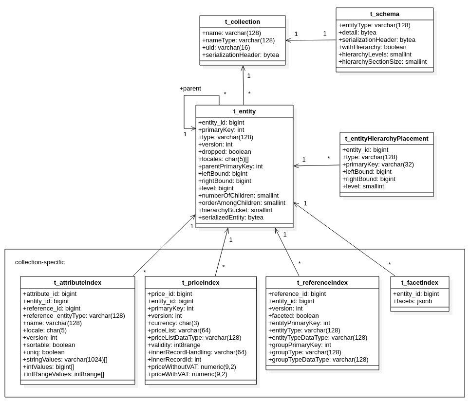

<UsedTerms>
    <h4>Terms used in this document</h4>

    <dl>
		<dt>DB</dt>
		<dd>[Database](https://en.wikipedia.org/wiki/Database)</dd>
		<dt>Index table</dt>
		<dd>Table used and optimized only for searching data (not retrieval)</dd>
		<dt>Inner entity dataset</dt>
		<dd>Collections of items that reside only inside an entity (attributes, prices, references, etc)</dd>
		<dt>CTE</dt>
		<dd>[Common table expression](https://www.postgresql.org/docs/14/queries-with.htm)</dd>
		<dt>MV</dt>
		<dd>[Materialized View](https://www.postgresql.org/docs/14/rules-materializedviews.html)</dd>
		<dt>MPTT</dt>
		<dd>[Modified preorder tree traversal](https://gist.github.com/tmilos/f2f999b5839e2d42d751)</dd>
		<dt>PMTPP</dt>
		<dd>[Pre-allocated modified preorder tree traversal](https://github.com/FgForrest/PMPTT/)</dd>
		<dt>ACID</dt>
		<dd>[Set of properties of database transactions](https://en.wikipedia.org/wiki/ACID)</dd>
		<dt>ID</dt>
		<dd>Generic unique integer identifier</dd>
		<dt>UID</dt>
		<dd>Internal unique string identifier used to represent entity collections</dd>
		<dt>API</dt>
		<dd>[Application programming interface](https://en.wikipedia.org/wiki/API)</dd>
    </dl>
</UsedTerms>

This document describes the implementation of the Evita API on top of the PostgreSQL relational database. PostgreSQL was
selected as one of the competing implementations thanks to its prevalence in the developer ecosystem and other reasons
described in more detail in
the [initial analysis](#appendix-a-postgresql-selection-rationale).

SQL implementation is fully functional as per the standards set out
by _[Evita](../assignment/index)_. We managed to meet the criteria for judging all solutions
solely on their performance without having a dilemma of sacrificing speed for necessary functionality. This document
describes how we achieved our goals along with our thought processes on why we implemented Evita in a specific manner.
We will also try to describe uncommon, interesting, or significant hurdles we encountered during the whole process.

## Evita SQL DB structure

### Data model

In the [preparation analysis](#appendix-a-postgresql-selection-rationale),
you can see our initial thoughts and research for this project. While this gave us a base to work from, our initial
plans changed drastically as the implementation went on. For reference, we can compare original and new models.




As the figure above shows, there are several essential changes, mainly thanks to a better understanding of the API.
For the sake of optimization, other changes were also made. Our original model presented considerable difficulties with
the conversion of entities between the Java memory model and the relational model. Furthermore, it did not properly
reflect the universality of data types.

On a broad scale, these models are similar in structure but at a closer look, there are a lot of small changes to
deliver the most performance out of the relational approach. The most visible change is the shift in the purpose of
tables representing the inner entity datasets (attributes, prices, and references). In the original model, all tables
were used to search entities as well as to reconstruct entities into memory which turned out to be quite expensive.
Therefore, in the new model, entities are reconstructed from binary form, and tables of these collections are now used
only as indexes to search entities. This enabled us to store only the search-related data in these index tables with
optimized data format, type, and structure, specifically for searching without any need to manage metadata for
reconstruction. Other optimizations have been achieved through some duplications of data (e.g., even though hierarchical
placements can be retrieved through entity references to hierarchical entities, this approach would be too expensive for
real-time searching). Furthermore, we have introduced the use
of [DB schemas](https://www.postgresql.org/docs/14/ddl-schemas.html) (which are named collections of SQL objects inside
a single DB)  for the index tables in a way that each collection of entities has its own DB schema. This is where
collection-specific index tables are stored and connected to the main shared entity table. An example of this might be
the fact that each collection has its own `t_attributeIndex` table. This means that for every entity collection there
are separate index tables containing data only for a single specific entity collection. Thanks to the DB schemas, the
index tables of the same type do not have to be distinguished by unique names across several collections, but rather by
prepending those table names with the correct DB schema names when queried. This combination of table name and DB schema
name then creates a unique identifier. One exception is the table storing actual entities, which is shared across all of
those collections because in some complex queries (e.g., parents’ computation), there is a need to collect entities from
multiple collections. Therefore, the decision was made to only separate index tables since those are the main data that
can exponentially grow. There is also a new collection-specific aggregated view of all facets for each entity
constructed from physically stored entity references (because not all references are facets), which speeds up the
computation of facet summary 19 times when compared with the results of the previous implementation.

The fact that may not be apparent from the schema is that there exists, and we have to work with, two types of entity
identifiers. There are internal IDs that are directly related to our implementation of Evita and are not exposed through
API and then there are Evita primary keys that are either generated by Evita API or are passed from outside. The reason
for using our own internal IDs is that those IDs are globally unique across all collections, unlike the Evita primary
keys which are unique only inside a single collection. Therefore, there is no need to specify both the primary key and
entity type inside the referenced table to correctly construct foreign keys which simplifies querying and updating. We
use PostgreSQL’s sequences for generating and managing those internal IDs.

Overall, the new model enabled us to implement all API requirements for searching and data management and, in our
opinion, it has satisfactory performance.

### Transactions and the ACID implementation

As a well-established DB, PostgreSQL supports transactions along with the ACID principles. At present, we do not use
transactions since their implementation was beyond the scope of our research project. Only the final winning solution
will proceed with a further advanced implementation.

However, the actual implementation of transactions would probably mean introducing locks on the whole entities because
every time there is an update to an entity, the binary serialized snapshot of that entity has to be also updated. That
could lead to performance problems when there would be a lot of small updates to a single entity. Those updates would
not even have to be the same data. Each update might modify a completely different part of the entity, yet at the same
time, each update would block the entire entity due to the need for a new version of the serialized snapshot of that
entity. Fortunately, the PostgreSQL and JDBC drivers have excellent support for programmatic transaction
management,which could be used to implement Evita’s transaction API without much difficulty, although this would not
solve the problem with the extensive locks.

Some excessive locking could be prevented if we split the entity snapshot into multiple parts, but that would
involve more experimenting and testing as it would influence the whole entity storing and fetching processes. It may
even affect reading or writing performance because there would be additional overhead with splitting and joining those
parts back together as we did with the original model. This may have either a bad impact or a positive impact on
performance. However, again, it would involve more experimentation to find the definite impact.

### Data insertion and retrieval

As it has been mentioned above, we need to convert our data between the Java memory model and the relational DB model,
which was a considerable bottleneck at the beginning of our implementation. Fortunately, we managed to significantly
optimize the conversion. Therefore, it does not present the bottleneck anymore.

The main bottleneck was due to the complexity of entity breakdown to several tables. This approach was initially used as
it is widely used when storing objects in relational DBs. However, in our case, each entity holds large quantities of
data in one-to-many collections (such as attributes, prices, etc.). Therefore, this approach was not ideal.

To better demonstrate the problem, some statistics concerning the Senesi dataset are presented below. Please note that
all data were from the 31.5.2022 version of the Senesi dataset.

| Collection                  | Count     |
| --------------------------- | --------- |
| Entity                      | 117,475   |
| Prices of entities          | 3,361,040 |
| Attributes of entities      | 3,848,705 |
| Associated data of entities | 698,095   |
| References of entities      | 967,553   |

In addition, table below shows the average entity from the Senesi dataset.

| Entity inner dataset | Count |
| -------------------- | ----- |
| Price                | 28.61 |
| Attribute            | 32.76 |
| Associated data      | 5.94  |
| Reference            | 8.24  |

The average counts of inner datasets may not seem tremendous, but when we need to store or fetch several entities at
once, those counts become quite large for SQL DB.

Moreover, there is also a description of the size of this average entity at the end of
the [Kryo library chapter](#utilization-of-the-kryo-library-and-optimizations).

On top of the data size bottleneck, the API uses generics for entity type values, attribute values, or reference values.
Therefore, there was a need to convert all of those values to some general-purpose data type (usually a string form) and
remember which data type it was originally in order to reconstruct the original value with the correct data type.

We also encountered problems with multithreaded entity writing because we did not implement any transactions, as this
was outside of the exploration phase goals. Our solution was to introduce simple thread locks for the entity writing
functionality. To support writing from multiple threads in parallel, we would have had to properly implement the SQL
transactions first so that PostgreSQL could deal with the data update concurrency. Unfortunately, this would have been
difficult and time-demanding to implement and we simply did not have enough resources for their implementation.

#### Utilization of the Kryo library and optimizations

The initial implementation that inserts data as they arrive, line by line, was quite slow. It took around 4 hours to
store the largest of our datasets (Senesi). Therefore, we firstly focused on the implementation of our own functionality
called insert buffers. The insert buffer is an in-memory list of the data in
SQL [INSERT](https://www.postgresql.org/docs/14/sql-insert.html) format, which will be inserted into the DB. We created
several such buffers for inner dataset tables. Each item represents data for a single DB table row. The data of each
buffer are then inserted into the DB using the JDBC batch inserts.

This reduced overhead for the insertion and thus improved the insertion performance from around 240 minutes (4 hours) to
approximately 85 minutes (1.25 hours), tested on the Senesi dataset on the same local machine.

As it has been stated above, our initial intention was to use our own conversion between Java and DB. However, this
proved to be rather slow to the point of unusability. In search of how to solve this problem, we acquired inspiration
from other teams who were already using the [Kryo library](https://github.com/EsotericSoftware/kryo) for similar
purposes with great success. Based on the library documentation, we found that Kryo claims to be a fast and efficient
binary object graph serialization framework for Java, which seemed to suit our needs perfectly. After some
experimentation and no obvious deal breakers, we have reimplemented our storing and retrieval of entities which led to
rather satisfying times for relational DB as it did not represent a significant bottleneck anymore.

The new approach consisted of breaking the Java objects representing an entity to metadata and individual items of inner
datasets. Those items were then serialized using the Kryo library to byte arrays and encoded using Base64. JSON trees
were constructed from those encoded strings, storing some basic categorization metadata about those items. For example,
attributes were categorized by locales which served as a way to fetch only partial entities by the end-user’s request
without the need for storing those items in traditional tables. This also simplified the whole process of fetching data
as those JSON trees were stored in the entities table and no joins to the referenced tables were needed anymore. Even
though there was significant overhead with connecting all of those pieces together when reconstructing entities, it was
still a far better solution than the initial one and provided reasonable results.

Furthermore, we realized that it took about the same amount of time (in some cases even less time) to fetch a full
entity using a single byte array as to fetch an entity with only client-desired parts using the complex partial entity
fetch. This is mainly caused due to the difference between these two approaches. To get a partial entity, first the JSON
structures had to be filtered by the end-user requirements to find targeted items (attributes, prices, etc). These
Base64-encoded items had to be decoded and deserialized using the Kryo library and finally, the actual entity had to be
reconstructed. For comparison, to get a full entity, a single byte array of a serialized entity with all the data has to
be fetched and then simply deserialized with the Kryo library to the original object. Therefore, there is no overhead
with the JSON parsing, Base64 decoding, and one-by-one reconstruction. This new approach gave us about a 20-30 %
performance gain and a much simpler codebase. It is obvious that if entity contents grow big enough, we get to the point
where most of the fetched data would be thrown away because the query does not need them. Thus, the performance would
start to decline compared to the more precise fetch of just requested entity parts. However, this tipping point was not
discovered when testing with our datasets.

The anticipated problem may be solved by storing individual parts of each entity in a separate 1:N table, which would
store binary data directly in a `bytea` column. This data would be joined at the end of the main query to each entity.
Unfortunately, we did not have enough time to test this approach. In theory, this approach may be more performant
because only needed parts of entities would be fetched without a need for the aforementioned complex deserialization
process. On the other hand, the SQL joining would be involved on top of the complex query which could possibly slow the
overall query times.

We are aware that there is some additional overhead when using Kryo as Kryo needs to store the metadata about serialized
objects somewhere. In the end, even with this overhead, Kryo proved to be a much better solution than the traditional
ORM approach. Unfortunately, the conversion of generic values is still present as it cannot be fully replaced. However,
thanks to the shift to the index tables and the Kryo serialization, we managed to reduce the places where original data
types are required.

These facts led us to our next optimization, which again concerns Kryo. While testing out queries with profilers, we
realized that initializing Kryo took about 40 % of the final query time because we needed to create a new instance for
every single serialization to avoid the data overriding inside the Kryo instance as it is not thread-safe. Additionally,
each entity has its own metadata for deserialization and as such, we sought solutions that would improve this. Our
solution is the utilization of the [Kryo pooling](https://github.com/EsotericSoftware/kryo#pooling), where instead of
initializing a new Kryo for every query, we created a pool of the Kryo instances where a query can “borrow” one for its
functionality and then return it for reuse after it is no longer needed. Even considering the fact that we now need to
store metadata for deserialization globally for the whole entity collection, and thus control the versions of Kryo
instances due to the updates to entities and their schemas and retiring the old versions while initializing the new
instances, this approach led to up to an approximately 50% of performance boost.

In the case of the entity updates, there exist other problems. At first, we tried to update modified items of each
entity individually as there is no batch update functionality in PostgreSQL. This approach turned out to be working
quite well until we tried it out on the Senesi dataset where we once again encountered problems with large entities,
same as the ones mentioned before. Therefore, we tried out another commonly used way of updating objects to relational
DB, which consisted of deleting all data of the existing entity from DB and afterwards inserting new data. This enabled
us to use the insert buffers even for updating, which led to decent results on the Senesi dataset. The final tested
approach consisted of first fetching information about what items and in what versions had been already stored in DB and
subsequently comparing this information with the items of the updating entity. Each item was then inserted (using the
insert buffers), updated or deleted only when there was a new version or the item was missing. This final approach
proved itself to be the most performant solution as it combines the insert buffers and ignoring of unchanged items.

Furthermore, Kryo is also used to store the entity schemas. They are only stored and retrieved, which again allows the
use of this simple solution, allowing fast operation with minimal to no drawbacks and no need to model complex table
structure.

Finally, to better illustrate the size of the entities Kryo handles in our implementation, we provide data on the size
of the Senesi entities. Please note that all data were from the 31.5.2022 version of the Senesi dataset.

| Single serialized Senesi entity | Size (bytes) |
| ------------------------------- | ------------ |
| average                         | 1,791        |
| min                             | 341          |
| max                             | 34,774       |

### Catalog isolation

With the Evita requirement for catalog isolation, our solution is rather simple. For each catalog, there is
a [separate DB](https://www.postgresql.org/docs/14/tutorial-concepts.html) containing its own fully isolated tables, DB
schemas, and connections. While this approach brings additional setup overhead for the end-users of Evita, it also
allows a possibility to have each DB in a different place. Additionally, this overhead could be automated to some extent
in the future by scripts or our implementation of Evita itself.

### Warming up state - bulk insertion

Even with the previously mentioned optimizations, inserting large amounts of data was painfully slow, as it has been
mentioned above with the Senesi dataset. Therefore we focused on properly implementing the Warming up state. This
initial insertion-only state allowed us to fully focus on the insertion regardless of the data retrieval.

We improved upon our insert buffers strategy, originally made only for the insertion of the data of a single entity, to
be shared between multiple entities. The improved buffers strategy in conjunction with the insert batching led to a
rather significant speed improvement for saving entities, all without affecting normal Evita functioning thanks to the
“warming up” state. To provide a specific example, while testing the Senesi dataset included in the integration testing
suite in a local environment, this change led to a time improvement for full insertion from 85 minutes to 15 minutes.

Another important optimization in the “warming up” state is related to the data indexing. At the beginning, there were
only a few indexes, therefore we updated the indexes with every inserted entity. At that time, it was a sufficient
solution. Unfortunately, later with a more complex structure and more indexes, we had to rethink our approach as the
time of the initial bulk insertion of the Senesi dataset nearly tripled. Initially, we created indexes at the creation
of the catalog and its collections, which led to continuous index updating during the “warming up” state. However, we
did not need the indexes since the reads do not occur in the warming-up phase. After realizing this, we decided to
create just the table structure at the start and create the DB indexes for those tables when the “warming up” state is
terminated and the DB switches to a transactional state (this can only happen once for a catalog, there is no going back
to “warming up” state after such a switch). This means that data are only indexed once, vastly increasing the “warming
up” state indexing performance (tested in a local environment, this optimalization led to a decrease in time of
indexation from several hours to approximately 40 minutes on the Senesi dataset).

In addition to this delayed indexing, we let the DB analyze its tables and indexes with
the [ANALYZE](https://www.postgresql.org/docs/14/sql-analyze.html) command after all data are indexed and all indexes
are created. This ensures that the DB gathers all the information needed to plan the optimal execution of SELECT
queries.

### Interesting side-note

We encountered an interesting problem with integration testing. For a long time, we tried to diagnose why the
performance test was not terminating, even if the actual testing finished. We did find out that the tests did finish,
even successfully, it just took unreasonably long. The main culprit was the DB, specifically how we reset it for the
independent testing without the need to create a new PostgreSQL instance. We found out that the deletion of about 100
thousand entities using the DELETE clause as shown below

```sql
delete from t_collection
```

is not very effective which we corrected our oversight by using
the [TRUNCATE](https://www.postgresql.org/docs/14/sql-truncate.html) clause, which makes the erasure of DB go from
several minutes to milliseconds because it does not scan the entire table like the DELETE clause.

## Implementation of the query algorithms

Now that we discussed the platform for our implementation, it is necessary to explain the querying implementation
itself. This section includes not only the final Evita implementation but also the gradual steps that led to it. The
main reason for this approach is to show the creation process, with the hope of providing a context for the final
implementation.

### Query processing

As it has been stated in the general Evita documentation, Evita has to be able to accept a vast variety of complex
queries, which are specified by the user of Evita (developer of the e-commerce system). That led to the creation of the
Evita query language which we have to support for users to be able to query the stored data. This is not a simple task
and a major obstacle to our implementation. We were unable to use our prepared SQL queries from the initial analysis
because they were greatly simplified in comparison to the complexity of the Evita queries and did not provide the needed
modularity of the Evita query language. There was a need to dynamically construct the SQL queries from the Evita query
language on every new request. It was necessary to create a universal translation layer that supports all requirements
of the Evita query language, yet it stays performant and behaves correctly even in corner-case situations. We embraced
the way of modularity imposed on us by Evita and created a structure, which rather closely copies the Evita query
language, allowing us to keep its expansive modulation.


The translating process consists of several steps between the Evita request containing an Evita query and a
SQL [SELECT](https://www.postgresql.org/docs/14/sql-select.html) query returning the target entities.

The most important part is the [visitor-pattern](https://en.wikipedia.org/wiki/Visitor_pattern) translator which
traverses the source Evita query constraint by constraint down the query tree. For each constraint of the Evita query
language, there is always a matching translator responsible for translating the constraint to the corresponding SQL
condition. The visitor is primarily responsible for delegating the translation of each constraint to the correct
translator. All of those translated SQL conditions are subsequently joined together using the container constraints
representing logical joins, such as `and`, `or`, etc., while traversing the tree. This process results in a single complex
SQL condition, which is placed into the WHERE clause or ORDER BY clause depending on the translated Evita query part.

To finish this process, the translated SQL clauses are merged into the final SELECT command templates. Such a query is
then executed against PostgreSQL via standard JDBC API which returns the entities in the binary form that gets
deserialized using the Kryo library and sent to the client.

While this structure is unusual at first glance, it has its distinct advantages. The main advantage is that it allows
for dynamic building of the SQL queries no matter what the input Evita request is. It is also relatively easily
extensible with new translators when new constraints are added to the Evita query language. Another advantage helpful
for testing and implementation is the ability to test each block individually regardless of other constraints to make
sure that the solution works correctly on these atomic building blocks, eliminating the errors at the lowest level.

With numerous advantages also come several drawbacks. We create large SQL queries, frequently with several nested
selects. Our SQL structure is complex, including a non-trivial amount of joins. Some constraints require even more
complex SQL conditions, which generally include adding [CTEs to the WITH clause](#querying-entities-in-detail). Specific
information on these issues can be found in the following chapters. Another big drawback is the inability to fetch
additional results, such as facet statistics or parents, as this solution only returns entities. Initially, we tried to
find a solution so that only a single query is executed against DB. Unfortunately, the complexity of queries for
additional results made it impossible. Therefore, we settled on separating these two types of queries. Consequently,
there are custom logic and SQL queries tailored specifically for each additional result with a focus on the best
performance. All results are then bundled together with entities and sent to the user.

We fully acknowledge that this approach is slower than formerly prepared queries, and as such, we would not recommend
its usage if it were possible to plan the SQL queries beforehand, an unfortunate impossibility for our use-case.

### Paging

Evita provides the option of paging using two different constraints: `page` and `strip`. Due to the universality, both
constraints are converted into two variables (`firstRecordOffset` and `limit`) at the Evita request level.

One of the necessary conditions of Evita requests states that when a different page than the first one is requested and
nothing is found on it, it should automatically try to execute the same query, but this time with the first page. This
scenario should not occur in an actual production environment. It is only Intended for exception handling or unexpected
errors so that Evita could always return any existing data. Accomplishing this is quite problematic from the SQL point
of view because in the case mentioned above, even a very complex query, consisting of many partial SQL queries, would
have to be executed twice, while the second attempt may not be successful in returning the data. In this approach we
chose a classic combination of the [LIMIT and OFFSET](https://www.postgresql.org/docs/current/queries-limit.html)
clauses. However, their usage makes it impossible to put any conditions on their respective parameters, which were
calculated inside the query. An example of the SQL query is provided below..

```sql
select entity.serializedEntity, count(*) over () as totalRecordCount
from t_entity entity
where entity.dropped = false and entity.type = 'PRODUCT'
order by entity.primaryKey asc limit 1000
offset 0;
```

As part of the optimizations, we tried to reduce the possibility of repeating the entire query in case it fails to
return data on a page other than the first. In this approach, we aimed at replacing the clauses used above by directly
utilizing the number of returned records in the filtering conditions of the query and selecting the first page with zero
offset in case the query returned nothing with the requested constraints. We achieved this result by writing an SQL
function to calculate the appropriate offset based on the number of the found records that match the filtering
conditions without any restrictions on pagination.

```sql
begin
  select
    case
      when skip >= total_record_count then 0
      else skip
    end as of
  into computedOffset;
  return computedOffset;
end;
```

The next step was to incorporate the calculated offset into the filtering conditions. We found a useful built-in window
function in PostgreSQL called [row_number](https://www.postgresql.org/docs/current/functions-window.html) that added
information to each record about what row it was on after appropriate sorting. With this information, it was already
possible to filter out entities within a single query by wrapping the query with an outer query, which could search for
fitting records even if page or offset were chosen inappropriately. An example of the SQL query is provided below.

```sql
select sortedFilteredEntity.*
from (
  select filteredEntity.*, row_number() over (order by filteredEntity.primaryKey asc ) as rowNumber
  from (
    select
      entity.serializedEntity,
      entity.primaryKey,
      count(*) over () as totalRecordCount
    from t_entity entity
    where entity.dropped = false
      and entity.type = 'PRODUCT'
      and true
  ) filteredEntity
) sortedFilteredEntity
where
    rowNumber > compute_offset(sortedFilteredEntity.totalRecordCount, 0)
    and rowNumber <= compute_offset(sortedFilteredEntity.totalRecordCount, 0) + 1000;
```

After running these queries over the test dataset of 100,000 entities, we measured their execution time: 500ms for the
first approach and 650ms for the second new one. As these numbers suggest, some difficulties occurred, which made the
optimized variant significantly slower and inappropriate for our use-case, than if we used the unoptimized one. For
instance, in the tests focusing on paging with random page numbers or offsets, i.e., where this logic would be used, the
performance gain was very noticeable (100% faster on average). However, in most other cases, where a page contained some
data on the first try, it was rather damaging. In these cases, there was a noticeable decrease in the execution speed in
the range of 30 to 50 percent. Based on this information, we concluded that in most cases, using the window function to
solve paging is significantly more expensive for the DB. After evaluating these results, we decided to return to the
original version of paging.

### Querying entities in detail

It is no surprise that we encountered some difficulties while implementing different querying strategies. Each query
strategy (query by attributes, hierarchy, facets, and prices) has unique requirements for the SQL conditions and
context. Hence the detailed explanation of each strategy is provided below.

First, some general concepts used are discussed. These concepts not only concern every query strategy but also relations
between them. One of the main limitations for our implementation was the fact that entities can be queried by multiple
inner entity datasets at once and in the case of attributes in reference conditions, they can be even nested. This would
not be such a problem if those queries were separate. Unfortunately, the Evita query can contain queries for all of
those inner entity datasets entangled together with `and` and `or` operators. It would be possible to join all needed
attributes, references and their attributes to the queried entities (excluding prices, they have to be computed
completely separately as described later). In the case of only attributes, `and` and `or` operators would be perfectly
executable. But if we incorporated references, those queried entities would be duplicated because each entity can have
multiple references of the same type. In addition, specific reference is decided when querying automatically by
PostgreSQL depending on the inner attribute constraints because we know only the type of the desired reference. That is
why we need to incorporate the reference attributes into this equation, leading to joining those attributes on top of
the already joined references. The problem arises when the end-user wants to define `and` and `or` operators between those
references because `reference having attribute` with references does not check if a particular reference has certain
attributes, it checks if an entity has a certain reference with particular attributes. Therefore, we would have to
create a way to apply `and` and `or` operators across multiple rows. In the case of `or`, it would not be too difficult, but
in the case of `and`, we would have to incorporate
the [GROUP BY and HAVING](https://www.postgresql.org/docs/14/sql-select.html) clauses, but then again this approach is
only possible to some extent in simpler situations, and thus not suitable for the client-defined query, which can be
very dynamic. Furthermore, due to the duplicated entities, the attribute values would be compared multiple times with no
benefits. Therefore, we discarded this use of classic joins early in the development and utilized the use of subqueries
as they enable an easy implementation of `and` and `or` operators across the multiple inner entity datasets. The reason is
that we can check the value of a particular item of each entity.

Another commonly used concept for speeding up querying by items of the inner entity datasets is an inversion of lookup.
Instead of looking up the inner item and checking its value over and over again using multiple subqueries for each
queried entity, we first find all items with a satisfactory value (depending on the used constraint) and consequently,
collect the IDs of entities owning those items. This list of IDs is afterwards used when going through the entities to
quickly check if a particular entity is in that list which tells us if that particular entity satisfies the original
query constraint. This is possible thanks to
the [CTEs and WITH clause](https://www.postgresql.org/docs/14/queries-with.html) built into PostgreSQL. Using this
clause, we can prepare and cache the data in advance and then use it optimally inside the main SELECT query.

#### Querying by attributes

To query the entities by attributes, an attribute with the requested name and locale has to be found for each entity and
its value has to be compared to the user-defined value. The attribute value can be either a single item or an array of
items in case of certain filter constraints. If such comparison passes, the entity can be returned to the user as
satisfactory. If the entities are queried by attributes of references, first references with those attributes have to be
found and after that, the entities owning such references are returned.

Initially, we used subqueries inside the WHERE clause of the SELECT query for each compared attribute to find and
compare its value:

```sql
(
  select attribute.intValues[1]
  from t_attribute attribute
  where
    attribute.entity_id = entity.entity_id
    and attribute.name = 'priority'
    and attribute.locale is null
  limit 1
) = 100
```

Thanks to this, we were able to dynamically connect multiple constraints to construct complex queries.

Querying the whole table of attributes for each entity over and over again was not ideal. Therefore, we needed some way
to query more optimally but with the great ability to construct any combination of constraints inside the WHERE part of
the query to be able to combine attribute constraints with hierarchical constraints and more. As is has been mentioned
above, we introduced the inversion of lookup for the first time. It consists of finding all attributes with satisfactory
values in advance using CTE and WITH clause,

```sql
with cte as (
  select entity_id
  from t_attributeIndex attribute
  where
    attribute.reference_id is null
    and attribute.name = 'priority'
    and attribute.locale is null
    and attribute.intValues[1] = 100
)
```

and then comparing if a particular entity resides in such a list in the WHERE part.

```sql
entity.entity_id = any (
  select entity_id from cte
)
```

Using this method of visiting the attributes table only once for each attribute constraint in the Evita query proved to
be much more performant. This brought approximately a 100% performance boost. In addition, we were able to embrace
PostgreSQL index-only scans, which do not use secondary table lookups, to get the target values and achieve even better
results.

Besides the whole logic of finding the actual attributes, there were also difficulties with different data types of
attribute values. Evita supports a large variety of data types that can be used for attribute values. We could list, for
example, integers, strings, ranges, booleans, or date times. In PostgreSQL, each column can only have one specific
assigned data type which leads to an obvious mismatch. We could use the string data type and serialize every original
data type to some string value which would enable us to have a single column for all attribute values. Unfortunately,
this approach would lead to the loss of possible optimizations for individual data types on the PostgreSQL side, the
most important of which are DB indexes. This choice would negatively affect the whole performance.

We decided to solve this issue by utilizing several columns for values, each with a different data type. Each attribute
value is correctly assigned in a specific column during the serialization with the correct data type and other columns
are left empty. When querying that particular attribute, the appropriate schema of the attribute is found, and depending
on the data type in that schema, the correct column is selected for the search.

Initially, we had columns for nearly every Evita-supported data type (even for different types of datetimes) because at
that time, we also needed to deserialize those values as we were still reconstructing entities from all tables. This
turned out to be rather difficult to maintain and DB indexes used on those columns were getting significantly big.
However, after we had introduced the binary entity snapshots, which allowed us to avoid the deserialization of attribute
values, we could implement better optimizations for the attribute values. After some experimentation and testing, we
settled on three basic columns: _string column_, _integer column_, and _integer range column_ into which all supported
values were serialized. This drastically simplified the whole process of attribute value serialization, as well as the
DB indexes since we now need to index only three columns. In addition, each column was defined as an array of the
aforementioned data types to support both single values and arrays of values.

##### Indexes on attributes

We experimented with different types and configurations of DB indexes for attribute values. Our overarching goal was to
speed up the queries as much as possible. First, we tried to dynamically create separate DB indexes for each attribute
schema. This means that for the attributes with the same name, there was a single DB index. Our idea was to decrease the
size of the attribute DB indexes to the necessary minimum because each entity collection usually has hundreds of
thousands of attributes and when querying by attributes, each attribute constraint always specifies a name so we only
search through attributes with that name. The unfortunate side effect of this approach is a disproportionate number of
indexes, for the Senesi dataset, it led to around 12k DB indexes just for the attributes alone. This had a significant
effect on slowing down the insertion of data as there were a lot of indexes to update. In comparison to a single DB
index for all attributes (which included the attribute names), we detected no gain in querying entities by attributes.
These dynamic indexes sometimes performed even worse (approximately by a few percent) than the single index. Therefore,
we reverted to the single DB index for all attributes and focused on optimizing this approach.

We think that in the case of a single DB index with the included attribute names, PostgreSQL could more easily filter
out the unwanted attribute values using the indexed names as opposed to having to search for the correct DB index by
attribute name in PostgreSQL’s own tables. Due to time constraints, we did not have resources to prove or disprove this
hypothesis.

Afterwards, we tried to experiment further with the shared DB index. We created separate indexes for each column
containing a value joined with attribute names,

```sql
create index on t_attributeIndex (name, locale, stringValues)
  include (entity_id);
create index on t_attributeIndex (name, locale, intValues)
  include (entity_id);
create index on t_attributeIndex (name, locale, intRangeValues)
  include (entity_id);
```

as well as a single DB index combining the name and all value columns:

```sql
create index on t_attributeIndex (name, locale, stringValues, intValues, intRangeValues)
  include (entity_id);
```

We also experimented with the BTREE and GIN indexes for these DB indexes after
reading [this](https://www.postgresql.org/message-id/D599302A-50E6-4758-856E-61D619F4434F%40gmail.com) mailing list. The
default index type in PostgreSQL is the BTREE, which was initially used. After reading the mailing list, we experimented
with GIN because it was supposed to work better with arrays, which we used for the value columns. On the other hand, it
did not support inclusion of non-indexable columns like BTREE.

Testing showed that neither separating indexes nor GIN indexes had brought any performance gains. In the case of
separation of
indexes, [PostgreSQL is smart enough to use only a subset of the indexed column](https://www.postgresql.org/docs/14/indexes-multicolumn.html).
In the case of the GIN indexes, we think that the GIN indexes are indeed faster but due to the lack of index-only
scans in our case, there is an additional table lookup involved, which possibly increases the overall querying times.
Therefore, we end up using a single combined BTREE index capable of index-only searches.

#### Querying by hierarchy

In this part, we will look at how we implemented the queries related to the hierarchy of Entities. Our main concern here
is the implementation of constraints `within hierarchy` and `within root hierarchy`. As it has
been [explained in the documentation](../assignment/querying/query_language#within-hierarchy-and-within-root-hierarchy),
these constraints along with their additional arguments allow us to adjust queries as needed for querying within the
hierarchy of entities.

This was one of the most problematic parts for us since we had to make a number of changes during the implementation not
only to get everything working properly, but later on, we had to completely change our approach to processing the
hierarchy.

At first, we focused on _WithinHierarchy, as WithinRootHierarchy_ seemed similar enough to use insights from one to
complete the other. We used CTE as a starting point
and [recursion](https://www.postgresql.org/docs/14/queries-with.html#QUERIES-WITH-RECURSIVE) to look up all needed
entities. This solution was based on our preparation phase. We just had to filter out as many unnecessary parts as
possible. At this point, we decided to heavily use subqueries as opposed to joins, as it is much easier to connect
subqueries to our custom structure. We were cautious of joins as at that time because we considered them to be more
demanding operations, a true statement if we only consider basic subqueries. With the more diverse and expensive ones,
it evens out or even reverses. We also used recursion because it was the first idea how to meet all of Evita’s
requirements that seemed like it would work. We were aware of the limitations of recursion, but thought it would be
easier to build on a previously explored and working option than to look for something new that we do not know will
work, even if it promises to be faster.

After we created this basic implementation and fully tested its functionality, we went to expand it with their
additional arguments, namely `excluding`, `excluding root` and `direct relation`. This is how we implemented them:

```sql
--within hierarchy (and modifications for  excluding and excluding root)
select entity_id, primarykey, parentprimarykey
from t_entity entity
where
  type = 'CATEGORY'
  and entity.primarykey in (
    with recursive cte (primaryKey) as (
      (
        select primaryKey
        from t_entity rootEntityInHierarchy
        where
          rootEntityInHierarchy.primaryKey = ? --  change if this is excluding root from "primaryKey" to "parentPrimaryKey"
          and rootEntityInHierarchy.type = ?
          and rootEntityInHierarchy.dropped = false
      )
      union all
      (
        select entityInHierarchy.primaryKey
        from t_entity entityInHierarchy, cte currentRootEntityInHierarchy
        where
          entityInHierarchy.dropped = false
          and entityInHierarchy.type = ?
          and currentRootEntityInHierarchy.primaryKey = entityInHierarchy.parentPrimaryKey
          -- and entityInHierarchy.primaryKey != all (?) -- add this if there is excluding
      )
    ) select primaryKey from cte
  )
```

As can be seen in the first code snippet, we included changes for `excluding root` and `excluding_` In the hopes that it
is easily apparent what it changes.

As far as the `direct relation` is concerned, we realized that we did not need recursion which led to an even more
simplified version, which is shown below.

```sql
--within hierarchy with modification for direct relation ( and excluding)
select primaryKey
from t_entity entityInHierarchy
where
  entityInHierarchy.primaryKey = ? -- depending on reference, we change "primaryKey" to "parentPrimaryKey"
  and entityInHierarchy.dropped = false
  and entityInHierarchy.type = ?
  -- and entityInHierarchy.primaryKey != all (?) -- this part is for filtering found result due to excluding
```

Our next task was to identify the changes needed to allow for search of products only linked to the hierarchy, and not a
part of the hierarchy itself. We solved this by simple wrapping previously mentioned subqueries with reference to
hierarchical entity lookup.

```sql
entity.entity_id in (
  select reference.entity_id
  from t_reference reference
  where
    reference.entityType = ?
    and reference.entityPrimaryKey in (
      /* subquery */
    )
)
```

At this point, we had a fully functional `within hierarchy` and after additional testing, to make sure everything was
working properly, we tried to attach `within root hierarchy` to this implementation as a wrapper. `within root hierarchy`
was only different from the `within hierarchy` by the fact that it directly utilized `-1` (hierarchy root) as a parameter
instead of having the user-defined one. This soon changed, as using `integer`, even negative one, did not seem sensible
and the new root of the hierarchy was set to null. We quickly discovered further problems which led to the creation of a
table that was essential for the explanation of all the ways to query the hierarchical entities along with all their
constraints. This table can be
found [in the documentation](/research/thesis-assignment/querying/query_language#within-hierarchy-and-within-root-hierarchy).
This, however, showed us that we had underestimated the complexities and could not use the wrapper strategy.

Our main problem was `null`, which served as a `virtual` root for the queries. This presented a serious problem in
CTEs. In the `within hierarchy` implementation, we started from a query’s defined relative root, and from this starting
point we used recursion to find every other entity in the hierarchical levels, using
a [Breadth-first tree search strategy](https://en.wikipedia.org/wiki/Breadth-first_search). The problem is that we
cannot directly query `null`, as no such entity exists in the DB. This means that we have to skip this first initial
point and start to recursively search from potentially multiple places that have `null` as a parent.

Another realization was that even additional constraints work slightly differently for the  `within root hierarchy` than
for the `within hierarchy`. Therefore, we judged it would be more productive if we just implemented the
`within root hierarchy` as a standalone constraint. This was also rather simple with all the experience we already had
after implementing the `within hierarchy`.

##### Introduction of PMPTT into the hierarchy

This version of the hierarchy query was working as intended. Therefore, we went to implement other parts of Evita. We,
however, had to return to this part after performance testing and comparing our times with other implementations. We
were so much slower than other implementations, that we were not even within the same time scales (milliseconds compared
to tens or even hundreds of ms). This led to the decision to implement the same hierarchy handling,
namely [PMPTT](https://github.com/FgForrest/PMPTT/) which is an extension of the
well-known [MPTT model](https://gist.github.com/tmilos/f2f999b5839e2d42d751). Another advantage was that this new model
allowed a simpler and mainly quicker lookup implementation of hierarchical additional results, which is further
discussed in [Computing additional results](#computing-additional-results).

The PMPTT library was a great help as it had already implemented all needed data structures. Since we also needed to
support the indirect hierarchical querying through referenced hierarchy items, we introduced some changes. In the
default state, each entity can have multiple references to other hierarchical entities, bringing even non-hierarchical
entities into a particular hierarchy. Instead of storing all metadata, such as bounds and levels, directly with each
item as columns, we opted for storing all metadata in a JSON column. This seemed a simpler and quicker approach at the
time than using a separate table. Each entity had its own JSON object with records of the hierarchical placement of
itself (in the case of a hierarchical entity) and referenced entities categorized by entity type and primary key.

```json
{
  "__self__": {
    "__self__": {
      "leftBound": 1,
      "rightBound": 2,
      "level": 1
    }
    },
    "category": {
    "100": {
      "leftBound": 1,
      "rightBound": 2,
      "level": 1
    }
  }
}
```

This structure enabled us relatively easy access to all placements of queried entities without any joins and subqueries.

We started by implementing base handling logic for managing the metadata using the PMPTT library. We used the main logic
behind computing item metadata and created our own storage connector based on the existing examples which could work
with the JSON structure. After finishing, we reimplemented the `within hierarchy` and `within root hierarchy` constraints
so that they do not use recursion, but instead use boundary comparison inherent to PMPTT. First, bounds and level of the
relative root entity defined in the Evita query are found from the DB and consequently, bounds and level of the queried
entities are compared with these bounds depending on the used constraints. A similar logic was used for filtering out
entities in excluded subtrees. Again, bounds of all entities representing the relative roots of excluded subtrees were
found and then compared to the queried entities if the particular entity resided in any excluded subtree.

This approach proved to be much more performant than recursion, making this version at least comparable to other Evita
Implementations. Therefore, we entirely dropped the recursion.

Later in the optimization phase, when we revisited hierarchy queries after further performance testing we found that no
DB index could be effectively used to further speed up querying in the JSON objects mentioned above. Further testing and
re-read of the PostgreSQL documentation led to an unfortunate discovery for us. PostgreSQL does not store statistics
about the JSON columns.Therefore, it cannot properly and effectively query the complex JSON objects when read
performance is the most important aspect. Due to this fact, we tried a more traditional approach with an additional
table containing all hierarchical placements (with the same content as in previously used JSON objects) in conjunction
with the columns containing hierarchical placement of itself directly (in case of a hierarchical entity) to minimize the
need for joins and subqueries to the new table. In this new structure, we were able to create proper DB indexes on both
bounds in the entities table as well as in the new table. Hierarchical entities could be queried directly using the new
columns without any need for subquery or join. Entities with referenced hierarchical entities needed a simple subquery
to the new table to lookup metadata of the required placement, which was also further optimized using CTE. This
approach, which we initially rejected as it seemed to be a more difficult and less performant variant, turned out to be
a surprising opposite as PostgreSQL could properly utilize indexes with high performance. Even the implementation was
simpler because we did not have to use the long PostgreSQL operators for retrieving specific placement metadata from the
JSON objects.

#### Querying by facets

Interestingly, although facet translators may seem to work just like other translators, it is not that simple. In fact,
the facet translation is not done in these translators but in their ‘parent’ constraint, called `user filter`.

This is necessary because relations between the facets are not defined by the end-user in facet constraints. They are
defined by Evita in conjunction with specific `require` constraints. However, this necessitates collecting them all in
one place followed by creating a single query with all of them depending on their relations.

In order to correctly query by the user-selected facets, we use a multi-step process. First, it is necessary to find the
facet groups in the stored data for these facets in order to correctly build the individual facet SQL conditions while
respecting the relations defined by Evita. Afterwards, these SQL conditions are joined together with `and`, `or`, and `not`
operands depending on the defined relations. Finally, each SQL condition representing a single group of facets tries to
find the IDs of entities, which have either all references, at least one reference, or no references at all.

To significantly speed up facet querying, a CTE is created for each such SQL condition to search entities once,

```sql
with cte_1 as (
  select distinct reference.entity_id
  from c_7.t_referenceIndex reference
  where
    reference.entityType = 'PARAMETER'
    and reference.entityPrimaryKey = any (119)
),
cte_2 as (
  select distinct reference.entity_id
  from c_7.t_referenceIndex reference
  where
    reference.entityType = 'PARAMETER'
    and reference.entityPrimaryKey = any (82)
)
```

and then compare found IDs against the queried entities similarly to how attributes are queried.

```sql
(entity.entity_id = any (select entity_id from cte_1))
and
(entity.entity_id = any (select entity_id from cte_2))
```

#### Querying by price

Prices require a different approach as we have to handle them separately from the rest of the query. The main difference
is that multiple constraints are used to query by prices together, instead of each constraint being responsible for its
own querying. For prices, you need to specify the currency, price list, validity, and optionally a range of prices. From
these, the currency, price list, and validity constraints have to be found in the query and processed together outside
of the visitor-pattern translator. Only the `price between` constraint can use a generic translator. After processing all
these constraints, the final result can be joined to the rest of the translated SQL in merge functions. In addition,
because users need to filter and order the found entities by having price in a particular range, we need to find the
correct selling price for each entity first and only after that can the entities be filtered.

When finding correct selling prices, the price handling of inner entities has to be taken into account, making it quite
difficult to compute the correct final price. To find such prices, we first find the prices satisfying the currency,
price lists, and validity constraints entered by the user. This list is consequently ordered by the order of the entered
price lists in the Evita query indicating priority of said price lists. That means that only the first price from the
most prioritized price list is considered for each inner entity. After that, we have to merge these prices into an array
depending on the defined inner record handling. For the `NONE` handling, the smallest price is returned, for the `SUM`
handling, the sum of all prices for each entity is computed and for the `FIRST OCCURRENCE`, an array of prices for each
inner entity is returned.

Initially, we stored these prices in a range but that turned out to be suboptimal as we always needed two values. As a
result, min and sum functions had to be computed twice for the NONE and SUM prices. Later, we replaced the ranges with
arrays, because it allowed us to store only single price as well as multiple prices in a single structure.

```sql
select
  price.entity_id,
  price.innerRecordHandling,
  case
    when price.innerRecordHandling = 'NONE'
      then array[min(price.price)]
    when price.innerRecordHandling = 'FIRST_OCCURRENCE'
      then array_agg(price.price order by price.price)
    when price.innerRecordHandling = 'SUM'
      then array[sum(price.price)]
  end as prices
from (
  select distinct on (price.entity_id, price.innerRecordId)
    price.entity_id as entity_id,
    price.innerRecordHandling as innerRecordHandling,
    price.priceWithTax as price
  from t_priceIndex as price
  where
    price.currency = 'CZK'
    and price.priceList = any (array ['vip', 'basic'])
  order by
    price.entity_id,
    price.innerRecordId,
    array_position(array ['vip', 'basic'], price.priceList),
    price.priceWithTax
) price
group by
  price.entity_id,
  price.innerRecordHandling
```

Finally, such prices are joined to the queried entities exposing an array of selling prices by which the entities can be
further filtered or ordered.

The array of selling prices of a single entity can then be used, for example, in the main entity query as follows:

```sql
numrange(100.0, 500.0, '[]') @> any (prices)
```

or can be used to order in this way:

```sql
filteredEntity.prices[1] asc nulls last
```

### Ordering entities in detail

As far as the Evita’s requirements are concerned, we need to order the entities either by attributes or selling price.
As it has been mentioned [above](#query-processing), the constraint translator is responsible for providing the SQL sort
expressions from the Evita order constraints to the SQL [ORDER BY](https://www.postgresql.org/docs/14/sql-select.html)
clause. Unfortunately, combining the aforementioned SQL expressions with the filtering SQL conditions might involve
additional difficulties.

Ordering by prices is a trivial task after the selling prices are computed. We just take the computed array of selling
prices and order the entities by the first price in the array.

In the case of both entity attributes and reference attributes, the ordering is more difficult. In contrast to the
prices, we do not have direct access to the attribute values while querying entities because
we [do not join the attribute values to the query entities by attributes](#querying-by-attributes). Instead, we need to
specifically join the attribute values that we need to order by. The problem is that we cannot join these attribute
values directly to the main SQL query because this would unnecessarily join the attribute values to all entities, even
to those which are later filtered out by the SQL [WHERE](https://www.postgresql.org/docs/14/sql-select.html) clause.
This would significantly decrease query performance because the finding of the correct attribute values for thousands of
entities is quite expensive. Therefore, we first query the entities using all filters and afterwards, wrap the resulting
entities with another SQL [SELECT](https://www.postgresql.org/docs/14/sql-select.html) query where we join the necessary
attribute values only to these final entities. Finally, we order the wrapped results by the joined attribute values,
which is rather easy.

```sql
select filteredEntity.*
from (
  /* subquery that finds relevant entities conforming to filter constraints */
) filteredEntity
left outer join t_attributeIndex attribute_0_0
  on (
    attribute_0_0.entity_id = filteredEntity.entity_id
    and attribute_0_0.reference_id is null
    and attribute_0_0.name = 'code'
    and attribute_0_0.locale is null
  )
order by
  attribute_0_0.stringValues desc nulls last,
  filteredEntity.primaryKey asc nulls last
```

### Computing additional results

As it has been mentioned in the theory above, additional results are very complex and very individual. This complexity
prevents the use of abstraction. Instead, we describe difficulties with each individual additional result as these
were the most difficult not only to implement, but also to optimize. This also means that each additional result is
computed separately.

However, one concept is similar enough for all additional results that it could be isolated and consequently abstracted.
The concept of temporary tables to store the intermediate results of entities satisfying the baseline part of the Evita
query. The idea is that all additional results use the entities satisfying the baseline part to compute the additional
results with the help of the user filter part. Since the baseline part cannot be changed during query execution, we can
cache such results as they will not change. The user filter, however, can change and is changed frequently during most
of the computation of the additional results. This enables us to cache the pre-queried results without any need for
querying the baseline part of the query multiple times, which would be quite expensive. We also reuse these intermediate
results for fetching the entities, thus saving computational time further.

We use the PostgreSQL’s implementation of [temporary tables](https://www.postgresql.org/docs/14/sql-createtable.html),
which are the tables that live in memory, are visible only to the SQL session in which the table was created, and are
automatically deleted after the SQL session has been terminated. A big advantage is that we do not have to manage the
deletion ourselves but it is done automatically by PostgreSQL. These tables are created dynamically at the start of each
Evita query execution and they only aggregate the data that will be used at some point in the execution. At the end of
the query execution this table is left alone to be deleted after the SQL session has been terminated, which is decided
and handled by the [Hikari connection pool](https://github.com/brettwooldridge/HikariCP) in the background. Thus, each
Evita query has its own temporary table. Due to the session (connection) pooling, we introduced the generation of random
temporary table names, which is to avoid problems with duplicate table names. Even if the table can only be seen by its
session, we believe this is the correct way to implement this feature.

#### Facet statistics

Facet statistics displays the stored facets to the end user with information about how many entities are referenced by
the facet. When some facets are selected for querying, the statistics also show by how many entities would the result
change after selecting any additional facets. In order to compute the facet statistics correctly, it is necessary to
split the Evita query into two parts: a `baseline` and an `user filter`. By using the entities found by the baseline
part of the query, we can find all their stored facets that are relevant for querying. These facets are shown to the
user and are relevant because each found facet has at least a single entity conforming to the baseline query. This is
done to prevent the queries on entities that do not conform to the baseline part of the query. This allows us to
calculate the initial count of the found entities, which is later used to compute differences for each other facet.

First of all, it is necessary to find all relevant facets with a count of entities with such a facet for all entities
satisfying the baseline.

```sql
select
  reference.*,
  count(reference.entityPrimaryKey) as referenceFacetCount
from t_entityTempTable_1 as entity
inner join t_referenceIndex reference
  on entity.entity_id = reference.entity_id
    and reference.faceted = true
group by
  reference.entityType,
  reference.entityTypeDataType,
  reference.groupType,
  reference.groupTypeDataType,
  reference.groupPrimaryKey,
  reference.entityPrimaryKey
order by
  reference.entityType,
  reference.entityTypeDataType,
  reference.groupType,
  reference.groupTypeDataType,
  reference.groupPrimaryKey,
  reference.entityPrimaryKey
```

These facets with their counts are then mapped to their groups. In case there are no relevant facets, we abort the
computation altogether. For the negated groups of facets, the count of entities connected to these facets needs to be
subtracted from the fetched counts. If we wanted only the facet counts, we could stop right here and simply map results
from the above query to the additional results object because we already have all the necessary counts.

However, for the full facet statistics, a few additional steps must be involved. First, the user-selected facets need to
be translated into the SQL conditions that can query through joined JSON structured facets.

```sql
facets @@ 'exists($.PRODUCT[*] ? (@ == 123))'
and
facets @@ 'exists($.PRODUCT[*] ? (@ == 637))'
```

This allows us to find the entities containing the selected facets between those which are returned by baseline.
Afterwards, the whole SQL condition is used to compute the number of the entities that satisfy the whole canonical
query.

After this preparation, we need to go through every relevant facet and calculate the entity count difference against the
base count. It may seem like a simple task but unfortunately, it involves creating the new SQL conditions for every
facet based on the SQL condition of the selected facets. Each facet needs to be assigned to the correct facet group
which may reside in a group of already created SQL conditions. Therefore, the whole SQL condition has to be
reconstructed. In addition, the relevant condition has to be executed against the baseline entities several times with a
minor change each iteration. Finally, this count is subtracted from the base count and we receive the difference of
possibly selected facets.

As it is obvious from the previous paragraph, this computational process is rather demanding. Especially when there are
a lot of facets. The amount of individual calls to PostgreSQL is enormous and very expensive. We were thinking about
moving this computation logic to the PostgreSQL functions and procedures, but there would be other complications, e.g.,
with passing the query data to these functions and creating efficient logic in PL/SQL. Therefore, it was necessary to
implement caching and other optimizations. We use caching of entities satisfying the baseline, as once computed, we can
reuse it numerous times for computing the counts of possible selected additional facets. If we did not use caching, we
would have to query the whole DB for every such facet and that would be exceedingly slow.

The aforementioned caching is achieved by creating two additional tables, a temporary session-specific aggregation table
and a global MV holding JSON aggregate of all entity facets from the reference table. A temporary table is created at
the start of the Evita query processing with joined MV and is terminated at the end of the SQL session. This aggregate
table contains one record for each entity that satisfies the baseline requirements. The JSON aggregate contains all
facets for said entity categorized by referenced entity type. This JSON is used to filter the baseline entities by the
selected facet SQL conditions.

Although the temporary table caching works as expected, it does not solve the number of the necessary SQL queries for
calculating the facet differences. To optimize this use case, we utilized the SQL construct UNION to join all facet SQL
queries into a single one and its results are then correctly extracted by individual facets. Although such a query is
quite extensive (it can exceed 2k lines for big datasets like Senesi), with a
proper [GIN index](https://www.postgresql.org/docs/14/gin.html) created on every temporary table, it performs quite
well, especially if compared to individual calls.

It may occur to someone why we do not use the MVs for caching. The reason is that there are a few drawbacks to such
usage. A table can be set as temporary, which means that DB deletes it by itself when it is no longer needed, the same
cannot be done for MV. A table can be created with JDBC parameters, MV cannot. In addition, because each temporary table
is tightly coupled with Evita requests, we do not need to refresh such tables. Therefore, the main advantage of MVs
would not be used.

#### Hierarchy statistics

Hierarchy statistics displays a tree of hierarchy entities with counts of entities referencing them. Furthermore, the
hierarchical entities without any associated entities (usually products) should not be displayed and this is true even
for the associated entities filtered out by the current query. Again, we use the created temporary table as a starting
point for relevant entities.

To build the hierarchy statistics tree, first, we need to find all hierarchical entities that are relevant to the final
tree. This is done by selecting all entities from the entity collection of the desired tree with the help of
`within hierarchy` or `within root hierarchy` constraint in the Evita query which filters out the unwanted ones. While
fetching these entities, a count of inner non-hierarchy entities from the temporary table is computed. For example, if
we want the tree of _category_ entities and we query the _product_ entities, we first find all _category_ entities and
for each relevant category we search through the temporary table for products in that category. This gives us the
cardinality of products in each category.

An example of the simplest such query without any `within hierarchy` constraints is provided below:

```sql
select
  entity.primaryKey,
  entity.type,
  entity.leftBound,
  entity.rightBound,
  entity.level,
  entity.orderAmongSiblings,
  (
    select count(*)
    from t_entityTempTable_1 entityInHierarchy
    join t_entityHierarchyPlacement hp on hp.entity_id = entityInHierarchy.entity_id
    where hp.type = entity.type and hp.primaryKey = entity.primaryKey::varchar(32)
  ) as entityCount
from t_entity entity
where entity.dropped = false and entity.type = 'CATEGORY'
group by entity.entity_id
order by entity.entity_id
```

We store this list of hierarchical entities to a CTE called `tree` so that we can later compute recursive cardinalities
of inner entities.

This is done by selecting this CTE and joining a sum of individual cardinalities of individual hierarchical entities
computed in the previous step to each hierarchical entity. The sums of cardinalities are computed using PMPTT bounds by
finding all cardinalities of the child hierarchical entities to the currently searched one.

```sql
select sum(cardinality.entityCount) as cardinality
from tree cardinality
where
  cardinality.leftBound >= tree.leftBound
  and cardinality.rightBound <= tree.rightBound
```

Finally, these hierarchical entities with zero cardinalities are removed and all remaining entities are ordered
according to the left bound of the PMPTT to form the final tree.

#### Parents

Parents computation stands for recursively finding parents of hierarchical entities. Computation of parents involves
finding the entities satisfying the baseline part of the query and joining each entity with its hierarchy placements.
This gives us information about hierarchical entities to which the original entity belongs, allowing us to classify it
as a parent. The initial approach for finding parents was the use of JSON documents representing hierarchy placements
involving several SQL [LATERAL JOIN](https://www.postgresql.org/docs/14/queries-table-expressions.html)s, gradually
unfolding the JSON objects and gathering the necessary information about the referenced hierarchy entities.

We then adjusted our methodology to make better use of the information contained in PMPTT bounds representing
hierarchical placement in target collection, which enabled us to recursively find all parents of each entity without any
need for real SQL recursion. Thanks to the PMPTT structure, we were able to find parent entities in linear time by
comparing left and right bounds against the original hierarchy entities.

#### Histograms

During the implementation of histograms, it was necessary to use a similar system as for statistics, namely using the
temporary aggregation table.

##### Attribute histogram

Right at the time of the first implementation, we realized that to create a histogram for all selected entities, we have
to first obtain all entities that match the query, completely disregarding the paging. For this purpose, we implemented
a _window_ function connected to the main query, whose purpose was to return all internal IDs of the sought entities. We
used the output of this function, an array of IDs, to find all pertaining attributes and compute a histogram on their
values using the SQL function `[width_bucket](https://www.postgresql.org/docs/14/functions-math.html)`.

This overall approach was faulty as we discovered during the functionality testing. The first problem was that we
computed counts for all entities in DB not only for the baseline ones. Another problem was with the query constraints on
the same attributes, where if we wish to compute a histogram, we have to ignore these specific constraints in the
SQL [WHERE](https://www.postgresql.org/docs/14/sql-select.html) clause. We did not originally realize this during our
initial analysis, which led to an incorrect understanding of histogram computation. Our solution was at this stage a
mere simplification of the real problem, making it practically unusable in real-world situations.

Fortunately, the aforementioned problematic constraints can only exist inside the `user filter` constraint, which allowed
us to optimize queries in such a way that we no longer need to perform every query on the whole entity dataset but only
on a subset that conforms to the baseline part of the Evita query. Therefore, we again used the temporary table approach
to cache entities conforming to the baseline part of the Evita query. This allowed us to compute the attribute counts
only for the queried entities and easily remove the attribute constraints from `user filter` for which we compute the
histogram. The modified `user filter` is then translated to SQL to filter the entities and join the relevant attribute
values to entities on which we can compute minimal and maximal values and finish this process by calling the
`width_bucket` PostgreSQL function to compute histogram buckets. The separation of `user filter` also allows us to compute
multiple histograms for multiple attributes while using the same cached baseline entities, simply by modifying the
original `user filter` again.

Initially, we needed clarification concerning what happens when some bucket is empty. In the default implementation of
the `width_bucket` function in PostgreSQL, empty buckets are not returned, which is quite logical implementation.
However, this posed a problem because it created “holes” in the histogram. Therefore, we initially had to implement
additional computation of empty buckets, but after further discussion with other teams, we found that this was not
necessary or even desirable. Holes are to be expected. Therefore, we returned to the default simpler implementation.

##### Price histograms

When computing price histograms, we use the logic of computing histograms on attributes that we have already discussed.
We have added new information to the temporary tables, namely the information about the lowest selling price of each
entity, computed in the same way as when querying for prices. The corresponding histogram is again computed based on
this temporary aggregation table.

## Appendix A: PostgreSQL selection rationale

This document contains a rationale that was created and written before the prototype implementation started. It's the
output of the initial research phase where the team selected the particular relational database for prototype
implementation. Some statements in this appendix might be inaccurate because they reflect the knowledge available at
the very beginning of the project that evolved in time as the team learned the subtleties of the domain and the datasets.

### Introduction

This work is intended as complementary research for evitaDB, mainly to answer one simple question. Is evitaDB better
than traditional relational databases in its function? And if so, can we ascertain by how much? To answer, we prepared
this document. You will find here contemplation on which relational Db should be chosen for our testing, reasons why we
choose as we did, a model of our data representation that shows the inner structure of our DB and finally testing
queries that show times measured, all hopefully helping to show a clear comparison to evitaDB.

### Database platform selection

To present a better comparison to evitaDB, there were certain requirements that we had to meet in our Database
selection.

Those requirements are:
- free to use
- well documented
- well known among developers
- fast
- HW/OS support, usability of Docker container

As such, we identified 2 main candidates to compare and choose from, MySQL and PostgreSQL.

Our main criteria are shown in a table below.

| **Parameter[sources]**                  | **MySQL**                                                    | **PostgreSQL**                                               |
| --------------------------------------- | ------------------------------------------------------------ | ------------------------------------------------------------ |
| **DB is known for[[1](https://www.upguard.com/blog/postgresql-vs-mysql),[3](https://www.enterprisedb.com/blog/postgresql-vs-mysql-360-degree-comparison-syntax-performance-scalability-and-features#performance)]**               | most popular (even with some concern with slower development speed since Oracle acquisition) | most advanced open-source relational database                |
| **Type of DB[[1](https://www.upguard.com/blog/postgresql-vs-mysql),[2](https://www.codeconquest.com/versus/mysql-vs-postgres/),[3](https://www.enterprisedb.com/blog/postgresql-vs-mysql-360-degree-comparison-syntax-performance-scalability-and-features#performance),[4](https://www.xplenty.com/blog/postgresql-vs-mysql-which-one-is-better-for-your-use-case/#howiscodingdifferent)]**                | purely relational database                                   | object-relational database                                   |
| **Preferred data volume[[3](https://www.enterprisedb.com/blog/postgresql-vs-mysql-360-degree-comparison-syntax-performance-scalability-and-features#performance)]**           | small                                                        | large                                                        |
| **Compliance to SQL standards[[1](https://www.upguard.com/blog/postgresql-vs-mysql),[3](https://www.enterprisedb.com/blog/postgresql-vs-mysql-360-degree-comparison-syntax-performance-scalability-and-features#performance),[4](https://www.xplenty.com/blog/postgresql-vs-mysql-which-one-is-better-for-your-use-case/#howiscodingdifferent)]** | not a fully SQL-compliant                                    | [supporting at least 160 out of 179](https://www.postgresql.org/docs/12/features.html) features required for full SQL:2016 Core conformance |
| **Performance[[3](https://www.enterprisedb.com/blog/postgresql-vs-mysql-360-degree-comparison-syntax-performance-scalability-and-features#performance),[4](https://www.xplenty.com/blog/postgresql-vs-mysql-which-one-is-better-for-your-use-case/#howiscodingdifferent)]**                    | performance-optimization options are very limited. Without full SQL compliance, writing efficient and well-performing SQL queries can be a challenge. Tablespaces are only supported in InnoDB and cannot accommodate table partitions. Simple queries to hit tables can be made to complete faster by creating B-TREE Indexes | Highly suitable database for any kind of workload. Possible to write efficient queries and pl/pgsql programs. Several configuration options for allocating memory to a database and queries, and partitioned tables can be placed across multiple tablespaces to balance disk I/O |
| **Indexes[[1](https://www.upguard.com/blog/postgresql-vs-mysql),[2](https://www.codeconquest.com/versus/mysql-vs-postgres/),[4](https://www.xplenty.com/blog/postgresql-vs-mysql-which-one-is-better-for-your-use-case/#howiscodingdifferent)]**                     | B-Trees                                                      | Bitmap, B-Trees, full-text, partial and expression indexes   |
| **Open-source stack[[1](https://www.upguard.com/blog/postgresql-vs-mysql),[4](https://www.xplenty.com/blog/postgresql-vs-mysql-which-one-is-better-for-your-use-case/#howiscodingdifferent)]**             | LAMP[[14]](https://en.wikipedia.org/wiki/LAMP_%28software_bundle%29)                                                      | LAPP                                                         |
| **Partitioning[[1](https://www.upguard.com/blog/postgresql-vs-mysql),[3](https://www.enterprisedb.com/blog/postgresql-vs-mysql-360-degree-comparison-syntax-performance-scalability-and-features#performance)]**                   | supports declarative table partitioning. Partition types are RANGE, LIST, HASH, KEY, and COLUMNS (RANGE and LIST). From MySQL version 8.0, table partitioning is only possible with InnoDB and NDB storage engines | supports declarative partitioning and partitioning by inheritance. Partitioning types supported are RANGE, LIST, and HASH |
| **Replication[[1](https://www.upguard.com/blog/postgresql-vs-mysql),[2](https://www.codeconquest.com/versus/mysql-vs-postgres/),[3](https://www.enterprisedb.com/blog/postgresql-vs-mysql-360-degree-comparison-syntax-performance-scalability-and-features#performance)]**                  | Primary-replica and Primary-to-multiple-replicas replication - asynchronous only(replicas can perform database writes). Supports NDB cluster | primary-replica and primary-to-multiple-replicas, including cascading replication. Utilization of streaming WAL(Write Ahead Log). Asynchronous by default, synchronous on demand. Support for logical replication. Tends to be faster than MySQL|
| **Views[[1](https://www.upguard.com/blog/postgresql-vs-mysql),[3](https://www.enterprisedb.com/blog/postgresql-vs-mysql-360-degree-comparison-syntax-performance-scalability-and-features#performance)]**                         | Materialized views not supported. Views created with simple SQLs can be updated, while views created with complex SQLs cannot | supports Materialized Views, which can be REFRESHED, and indexes as well as views created with simple SQLs can be updated, the views created with complex SQLs cannot be updated. But there is a work-around to update complex views using RULES |
| **Triggers[[3](https://www.enterprisedb.com/blog/postgresql-vs-mysql-360-degree-comparison-syntax-performance-scalability-and-features#performance)]**                         | AFTER and BEFORE events for INSERT, UPDATE, and DELETE statements. Cannot execute dynamic SQL statements or stored procedures | AFTER, BEFORE, and INSTEAD OF triggers for INSERT, UPDATE, and DELETE events. Can execute complex SQL as function. Can execute functions dynamically. If you need to execute a complex SQL when the trigger gets invoked, you can do this using functions. Yes, the triggers in PostgreSQL can also execute functions dynamically. |
| **Stored procedures[[3](https://www.enterprisedb.com/blog/postgresql-vs-mysql-360-degree-comparison-syntax-performance-scalability-and-features#performance)]**                | only supports standard SQL syntaxes                          | supports very advanced procedures. Functions with a RETURN VOID clause support. It has for various languages that are not supported by MySQL, such as Ruby, Perl (PlPerl), Python (PlPython), TCL, Pl/PgSQL, SQL, and JavaScript |
| **JSON support[[3](https://www.enterprisedb.com/blog/postgresql-vs-mysql-360-degree-comparison-syntax-performance-scalability-and-features#performance),[4](https://www.xplenty.com/blog/postgresql-vs-mysql-which-one-is-better-for-your-use-case/#howiscodingdifferent)]**                  | from Version 5.7. JSON-specific functions limited. No full-text indexing | from version 9.2. Advanced. Full-Text Indexing (known as GIN Indexing) |
| **Security[[3](https://www.enterprisedb.com/blog/postgresql-vs-mysql-360-degree-comparison-syntax-performance-scalability-and-features#performance)]**                        | via ROLES and PRIVILEGE. Supports SL-based connections over the network and provides security based on SE-Linux modules. | via ROLES and PRIVILEGES using GRANT commands. Connection authentication is done via a **pg_hba.conf** authentication file. Supports SSL-based connections and can also be integrated with external authentication systems, including LDAP, Kerberos, and PAM |
| **Features that other lacks[[1](https://www.upguard.com/blog/postgresql-vs-mysql),[2](https://www.codeconquest.com/versus/mysql-vs-postgres/),[3](https://www.enterprisedb.com/blog/postgresql-vs-mysql-360-degree-comparison-syntax-performance-scalability-and-features#performance),[4](https://www.xplenty.com/blog/postgresql-vs-mysql-which-one-is-better-for-your-use-case/#howiscodingdifferent)]** | pluggable storage engines                                    | Materialized view. Full outer joins, intersect, except. Partial Indexes, Bitmap Indexes, and Expression Indexes. CHECK constraint. ARRAYs, NETWORK types, and Geometric data types (including advanced spatial data functions)[[3](https://www.enterprisedb.com/blog/postgresql-vs-mysql-360-degree-comparison-syntax-performance-scalability-and-features#performance)]. LIMIT & IN/ALL/ANY/SOME subquery[[3](https://www.enterprisedb.com/blog/postgresql-vs-mysql-360-degree-comparison-syntax-performance-scalability-and-features#performance)]. NESTED window functions are supported[[3](https://www.enterprisedb.com/blog/postgresql-vs-mysql-360-degree-comparison-syntax-performance-scalability-and-features#performance)] |
| **Supported HW/OS**                     | Windows, MacOS, Linux (Ubuntu, Debian, Generic, SUSE Linux Enterprise Server, Red Hat Enterprises, Oracle), Oracle Solaris, Fedora, FreeBSD, Open Source Build[[12](https://dev.mysql.com/downloads/mysql/)] | MacOS, Solaris, Windows, BSD (FreeBSD, OpenBSD), Linux (Red Hat family Linux including CentOS/Fedora/Scientific/Oracle variants, Debian GNU/Linux and derivatives, Ubuntu Linux and derivatives, SuSE and OpenSuSE, other Linux operating systems)[[13](https://www.postgresql.org/download/)] |
| **Docker containerization[[17](https://rancher.com/containers-and-postgresql-vs-mysql-vs-mariadb)]**            | Yes[[15](https://hub.docker.com/_/mysql)] | Yes[[16](https://hub.docker.com/_/postgre)]

*Comparison of MySQL and PostgreSQL*

After evaluating all factors in the table and even those that can not be easily quantified, we decided to proceed with
PostgreSQL, our reasoning is as follows. Both Database engines are free-to-use(as of this writing), well documented and
known among developers.

OS support is also fairly broad for both, and while PostgreSQL support is broader, MySQL is supported on all main
platforms that we can expect to run it on. As for the containerization, both are fully supported without issues.

Our main deciding factor is then speed, sadly that is not as easily concluded. There are numerous benchmarks for one or
another, with no clear winner. It can be broadly said, that MySQL is faster on small Databases with relatively simple
queries, while PostgreSQL excels on BigData and complex queries.

As can be seen from the table above, PostgreSQL also provides more options, not only for usage but also for
optimization, where MySQL is quite lacking. As evitaDB is also expected to perform complex queries, PostgreSQL has a
clear advantage.

Finally we need to consider the future, and here PostgreSQL once again takes the lead. MySQL development has been
slowed since acquisition by Oracle, PostgreSQL on the other is well known as the most advanced relational DB.

Which unique features of PostgreSQL will be taken advantage of then? For start, we plan to utilize:

- better performance for complex queries[[2](https://www.codeconquest.com/versus/mysql-vs-postgres/),[4](https://www.xplenty.com/blog/postgresql-vs-mysql-which-one-is-better-for-your-use-case/#howiscodingdifferent)]
- better queries optimization possibilities because of adherence to SQL standard[[1](https://www.upguard.com/blog/postgresql-vs-mysql),[2](https://www.codeconquest.com/versus/mysql-vs-postgres/),[3](https://www.enterprisedb.com/blog/postgresql-vs-mysql-360-degree-comparison-syntax-performance-scalability-and-features#performance)]
- supports inheritance among tables
- Range type[[11](https://www.postgresql.org/docs/current/rangetypes.html)]

What is its potential for the future (ie. solved cluster scaling, fulltext integration ...)

- PostgreSQL doesn’t support scaling by itself, but there is a lot of solutions to achieve that goal[[8](https://wiki.postgresql.org/wiki/Pgpool-II)]
    - Pgpool-II provides: connection pooling, replication, load balance, parallel queries, limiting exceeding
      connections[[9](https://www.highgo.ca/2019/08/08/horizontal-scalability-with-sharding-in-postgresql-where-it-is-going-part-1-of-3/)]
- built-in fulltext search with several built-in language dictionaries and support for custom dictionaries[[10](https://www.postgresql.org/docs/9.5/textsearch-intro.html#TEXTSEARCH-INTRO-CONFIGURATIONS)]

### Model representation


Our model is represented by tables in the underlying RDBMS, where one table stands for one logical part of it, such as
an entity or an attribute. Big data are stored in one column as json data type if searching isn’t required.

For the sake of better performance, we keep all necessary information about stored data in as few tables as possible. In
some cases this factor causes data duplication, therefore much more space on the disk will be consumed. Currently, we do
not use any indexation, apart from indexation of primary and foreign keys. Its specific type and application are to be
decided later in optimization stage. As for the method of indexation, we plan to utilize benefits of partial indexation,
which will shard data in tables. Hierarchical structure of categories is currently handled with recursive approach, but
we anticipate inevitability of speeding this process up. Thus, we may implement one of algorithms designed for these
purposes, such as [PMPTT](https://github.com/FgForrest/PMPTT/) algorithm. Having any special model for facet computing is very unlikely.

Consistency tasks will be handled by database server, in a schema-full approach we will validate against schema specified
by the user of our implementation. If necessary, additional checks may be implemented.

### Model evolution

Model is designed as schemaless by default. Users of our implementation can index whatever entity they want with
whatever attributes, facets, prices, etc. In this case only most needed validation checks for consistency in the
underlying system are being run and structure consistency must be ensured by the user of our implementation.

If a user chooses to use the schemaful approach, then schema in DDL must be passed to DB before entity indexing. While
indexing new entities the schema is used to validate entity structure on top of most needed validation checks in the
underlying system. Stored indexed data will be then considered as valid and will not be validated when querying.

The structure schema for validating will be stored in separate RDBMS tables and will be used by the indexing engine of
our implementation.

### Query modeling

During analytic phase following queries were built to test that the designed model can deliver all data we need from evitaDB
in reasonable times.

#### Testing

The testing data was generated using our simple single purpose [generator](https://github.com/FgForrest/EvitaSqlAnalysisToolset/blob/main/query_testing/data-generator.py).
Main data values such as entity types,
attribute names, currencies or locales are randomly selected from predefines lists. Other data such as prices, attribute
values and so on are randomly generated from predefined ranges of values (e.g. number range).

The times were measures using our simple [Java application](https://github.com/FgForrest/EvitaSqlAnalysisToolset/blob/main/query_testing/queries_measurement/src/main/java/io/evitadb/referential/sql/spike_test/queries_measurement/QueriesMeasurementApplication.java)
which took example queries and ran them against database in same virtual machine *(no internet connection delay)*
and wrote the results in database. This process was repeated 5 times and averages of all runs were taken.

Tests were run on database in docker using a [Postgres 13.1](https://hub.docker.com/_/postgres) image in a virtual machine with these specs:
- 4 cores from Intel Xeon Gold 6146
- 6 GB RAM of DDR-4, 2666 Mhz
- 40 GB of 2 TB SSD with SAS interface, read speed 2100 MB/s write speed 1800 MB/s

The testing queries were run against generated dataset of these row counts:

| **Table** | **Count** |
|-----------|-----------|
| Entity    | 100000 (35% were products) |
| Attribute | 3000000 |
| Facet | 1200000 |
| Price | 300000 |
| Assoc. data | 3000000 |

In the table below are results of initial testing of our designed model on example queries. Concrete SQL
queries can be found here: <SourceClass>docs/research/en/sql/assets/query_testing/queries</SourceClass>.

| **Required output**                                          | **Time [ms]** |
| ------------------------------------------------------------ | --------------- |
| Select all products that are in a certain hierarchy (ie. category A or its subcategories) | 246             |
| Select all products that have 3 attributes equal to some value | 176             |
| Select all products that have validity within range of two dates | 177             |
| Select all products with most prioritized price (of certain price lists - for example a, b, c) `>= X and <= Y` | 115             |
| Select all products that have CZ localization (at least single CZ localized text) | 204             |
| Select all products that are in a certain hierarchy (ie. category A or its subcategories) and select its most prioritized price (of certain price lists - for example a, b, c) `>= X and <= Y` | 279             |
| Select all products that are in a certain hierarchy (ie. category A or its subcategories) and their validity is within range of two dates | 389              |
| Select all products that are in a certain hierarchy (ie. category A or its subcategories) with most prioritized price (of certain price lists - for example a, b, c) `>= X and <= Y` and their validity is within range of two dates | 485             |
| Select all products that are in a certain hierarchy (ie. category A or its subcategories) and have 3 attributes equal to some value and their validity is within range of two dates with most prioritized price (of certain price lists - for example a, b, c) `>= X and <= Y` and have at least one CZ localization text | 1004             |
| Select all products with most prioritized price ordered by price ascending (of certain price lists - for example a, b, c) `>= X and <= Y` | 110             |
| Select all products by localized name or selected attribute ascending | 135             |
| Select categories and render complete tree of them           | 443             |
| Select subtree from specific category                        | 38             |
| Select all facets of product in a certain hierarchy (ie. category A or its subcategories) | 394             |
| Select all facets of product in a certain hierarchy (ie. category A or its subcategories) and compute counts of products that posses such facet            | 405              |

*Execution times of testing queries without optimization*

### Conclusion

In conclusion, we had good reasons to work with PostgreSQL, which we explained in the section Database platform
selection. In the next section, we introduced a model that meets requirements and also enhances desired functionality.

In current stages, we explore how we may enhance our performance by means of optimization on DB and on our queries.

### Resources

1. [https://www.upguard.com/blog/postgresql-vs-mysql](https://www.upguard.com/blog/postgresql-vs-mysql)
2. [https://www.codeconquest.com/versus/mysql-vs-postgres/](https://www.codeconquest.com/versus/mysql-vs-postgres/)
3. [https://www.enterprisedb.com/blog/postgresql-vs-mysql-360-degree-comparison-syntax-performance-scalability-and-features#performance](https://www.enterprisedb.com/blog/postgresql-vs-mysql-360-degree-comparison-syntax-performance-scalability-and-features#performance)
4. [https://www.xplenty.com/blog/postgresql-vs-mysql-which-one-is-better-for-your-use-case/#howiscodingdifferent](https://www.xplenty.com/blog/postgresql-vs-mysql-which-one-is-better-for-your-use-case/#howiscodingdifferent)
5. [https://www.digitalocean.com/community/tutorials/sqlite-vs-mysql-vs-postgresql-a-comparison-of-relational-database-management-systems](https://www.digitalocean.com/community/tutorials/sqlite-vs-mysql-vs-postgresql-a-comparison-of-relational-database-management-systems)
6. [https://www.slant.co/versus/616/4216/~postgresql_vs_mysql](https://www.slant.co/versus/616/4216/~postgresql_vs_mysql)
7. [https://eng.uber.com/postgres-to-mysql-migration/](https://eng.uber.com/postgres-to-mysql-migration/)
8. [https://wiki.postgresql.org/wiki/Pgpool-II](https://wiki.postgresql.org/wiki/Pgpool-II)
9. [https://www.highgo.ca/2019/08/08/horizontal-scalability-with-sharding-in-postgresql-where-it-is-going-part-1-of-3/](https://www.highgo.ca/2019/08/08/horizontal-scalability-with-sharding-in-postgresql-where-it-is-going-part-1-of-3/)
10. [https://www.postgresql.org/docs/9.5/textsearch-intro.html#TEXTSEARCH-INTRO-CONFIGURATIONS](https://www.postgresql.org/docs/9.5/textsearch-intro.html#TEXTSEARCH-INTRO-CONFIGURATIONS)
11. [https://www.postgresql.org/docs/current/rangetypes.html](https://www.postgresql.org/docs/current/rangetypes.html)
12. [https://dev.mysql.com/downloads/mysql/](https://dev.mysql.com/downloads/mysql/)
13. [https://www.postgresql.org/download/](https://www.postgresql.org/download/)
14. [https://en.wikipedia.org/wiki/LAMP_%28software_bundle%29](https://en.wikipedia.org/wiki/LAMP_%28software_bundle%29)
15. [https://hub.docker.com/_/mysql](https://hub.docker.com/_/mysql)
16. [https://hub.docker.com/_/postgre](https://hub.docker.com/_/postgre)
17. [https://rancher.com/containers-and-postgresql-vs-mysql-vs-mariadb](https://rancher.com/containers-and-postgresql-vs-mysql-vs-mariadb)
