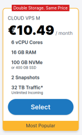

While it is much better to play with the schema and data that suits your own e-commerce use case, we believe that
many of you will want to test the Query API without too much work. Therefore, we have created a sample schema of 
the virtual e-commerce store with data for more than a thousand products for you to play with right away.

There are two ways in which you can play with this data set:

1. simple but limited: [use our evitaDB.io server instance](#use-our-evitadbio-server-instance)
2. more difficult, but without limits: [run your own evitaDB server with our dataset](#run-your-own-evitadb-server-with-our-dataset)

## Use our evitaDB.io server instance

We host the demo dataset directly on the [evitadb.io](https://evitadb.io) site, but to make sure it works reliably for 
all of you, we had to make it read-only. So you cannot make any changes to it. But you can still use it to test all our 
web APIs and all supported drivers.

The next limitation is that the server is hosted on cheap shared infrastructure of  
[Contabo hosting](https://contabo.com/en/vps/) (which has been known to buy old servers to provide low-cost hosting 
services) with following specs:



If you experience slow responses, let us know and 
[try evitaDB on your hardware instead](#run-your-own-evitadb-server-with-our-dataset).

You can access all our APIs on these addresses:

- `graphQL` API: [https://evitadb.io:5555/gql/](https://evitadb.io:5555/gql/)
- `REST` API: [https://evitadb.io:5555/rest/](https://evitadb.io:5555/rest/)
- `gRPC` API: [https://evitadb.io:5556/](https://evitadb.io:5556/)

## Run your own evitaDB server with our dataset

This option requires more work, but you will have control over the performance, and you will be able to modify any data 
in the set. To access the dataset on your hardware, you need to:

1. [download the archive with the dataset](https://evitadb.io/download/evita-demo-dataset.zip)
   ```bash
   wget https://evitadb.io/download/evita-demo-data.zip
   ```

2. unzip the contents to the `data` folder
   ```bash
   unzip -d data evita-demo-dataset.zip
   ```

3. pull the evitaDB docker image
   ```bash
   docker pull index.docker.io/evitadb/evitadb:latest
   ```
4. start the evitaDB server (replace `__data_dir__` with the path to your data folder)
   ```bash
   docker run --name evitadb -i --net=host \
          -v "./data:/evita/data" \
          index.docker.io/evitadb/evitadb:latest
   ```

When this procedure is completed you should see the similar output in the console:

```

            _ _        ____  ____  
  _____   _(_) |_ __ _|  _ \| __ ) 
 / _ \ \ / / | __/ _` | | | |  _ \ 
|  __/\ V /| | || (_| | |_| | |_) |
 \___| \_/ |_|\__\__,_|____/|____/ 

alpha build 0.5-SNAPSHOT
Visit us at: https://evitadb.io

19:45:37.088 INFO  i.e.s.c.DefaultCatalogPersistenceService - Catalog `evita` is being loaded and  it contains:
	- Group (10)
	- ShippingMethod (0)
	- ObsoleteProduct (0)
	- Category (36)
	- ParameterValue (3319)
	- ProductBundle (0)
	- Product (4223)
	- PickupPoint (9747)
	- Brand (57)
	- AdjustedPricePolicy (2)
	- ParameterGroup (5)
	- Parameter (113)
	- PaymentMethod (0)
	- Tag (18)
	- PriceList (20)
	- Stock (1)
19:45:37.091 INFO  i.e.s.c.DefaultCatalogPersistenceService - Catalog loaded in 0.054817170s
19:45:41.363 INFO  i.e.c.Evita - Catalog evita fully loaded.
Root CA Certificate fingerprint:        43:51:C6:A0:9C:21:9A:8A:BE:18:2B:53:93:CF:4E:1A:CE:7F:FF:B0:16:99:A5:4C:22:52:25:09:72:6F:5C:E3
API `graphQL` listening on              https://localhost:5555/gql/
API `rest` listening on                 https://localhost:5555/rest/
API `gRPC` listening on                 https://localhost:5556/
API `system` listening on               http://localhost:5557/system/
   - server certificate served at:      http://localhost:5557/system/evitaDB-CA-selfSigned.crt
   - client certificate served at:      http://localhost:5557/system/client.crt
   - client private key served at:      http://localhost:5557/system/client.key

************************* WARNING!!! *************************
You use mTLS with automatically generated client certificate.
This is not safe for production environments!
Supply the certificate for production manually and set `useGeneratedCertificate` to false.
************************* WARNING!!! *************************
```

It means that your evitaDB server is up and running, and also that it has loaded the `evita` catalog dataset with some
thousands of products.

<LanguageSpecific to="evitaQL,java">

## Connect the Java client

Open your Java IDE and create an <SourceClass>evita_external_api/evita_external_api_grpc/client/src/main/java/io/evitadb/driver/EvitaClient.java</SourceClass>
instance:

<CodeTabs>
<CodeTabsBlock>
```java
new EvitaClient(
	EvitaClientConfiguration.builder()
		.host("demo.evitadb.io")
		.port(5556)
        // demo server provides Let's encrypt trusted certificate
        .useGeneratedCertificate(false)
        // the client will not be mutually verified by the server side
        .mtlsEnabled(false)
		.build()
);
```
</CodeTabsBlock>
</CodeTabs>

After that you can create a new session and try any of the evitaQL queries described in 
[the reference documentation](../query/basics.md):

<CodeTabs>
<CodeTabsBlock>
```java
var entities = evita.queryCatalog(
	"evita",
	session -> {
		return session.queryListOfSealedEntities(
			query(
				collection("brand"),
				filterBy(
					and(
						attributeStartsWith("name", "A"),
						entityLocaleEquals(Locale.ENGLISH)
					)
				),
				orderBy(
					attributeNatural("name", OrderDirection.ASC)
				),
				require(entityFetchAll())
			)
		);
	}
)
```
</CodeTabsBlock>
</CodeTabs>

<Note type="info">

<NoteTitle toggles="true">

##### Do you need more instructions?

</NoteTitle>

For complete instructions on setting up a Java client, see [the Java drivers chapter](../use/connectors/java.md).
If you need more hints for querying the data, try [the query API chapter](../use/query-api.md).
</Note>

</LanguageSpecific>

<LanguageSpecific to="c-sharp">

## Connect the C# client

**Work in progress**

This article will be extended when the C# driver implementation is done.

<Note type="info">

<NoteTitle toggles="true">

##### Do you need more instructions?

</NoteTitle>

For complete instructions on setting up a C# client, see [the C# drivers chapter](../use/connectors/c-sharp.md).
If you need more hints for querying the data, try [the query API chapter](../use/query-api.md).
</Note>

</LanguageSpecific>

<LanguageSpecific to="graphql">

## Try querying the graphQL endpoint in your favourite IDE

<Note type="info">

<NoteTitle toggles="true">

##### Do you need more instructions?

</NoteTitle>

For complete instructions on setting up a GraphQL client, see [the GraphQL drivers chapter](../use/connectors/graphql.md).
If you need more hints for querying the data, try [the query API chapter](../use/query-api.md).
</Note>

</LanguageSpecific>

<LanguageSpecific to="rest">

## Try querying the REST endpoint in your favourite IDE

<Note type="info">

<NoteTitle toggles="true">

##### Do you need more instructions?

</NoteTitle>

For complete instructions on setting up a REST client, see [the REST drivers chapter](../use/connectors/rest.md).
If you need more hints for querying the data, try [the query API chapter](../use/query-api.md).
</Note>

</LanguageSpecific>