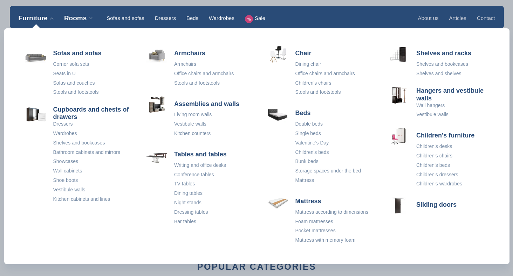

There are many types of menus that can be found on e-commerce sites. Starting with mega menus of various types ...



... direct subcategory menus ...


... over a highly dynamic menu that could be rolled out gradually using plus/minus signs without affecting the real item
listing on the right side of the screen (it's updated by category after selection) ...


... to a hybrid menu that partially opens to a currently selected category and displays only a direct sibling category 
on the parent axis:


There are a huge number of possible variations, and it is difficult to support all of them with a single constraint.
That's why there is an extensible mechanism by which you can request the computation of multiple different parts of the 
hierarchy tree, as you actually need it for your particular user interface use case.

There are two type of top hierarchy requirements:

<dl>
    <dt>[`hierarchyOfSelf`](#hierarchy-of-self)</dt>
    <dd>
        realized by <SourceClass>evita_query/src/main/java/io/evitadb/api/query/require/HierarchyOfSelf.java</SourceClass>
        and is used to compute data structures from the data of the directly queried hierarchical entity
    </dd>
    <dt>[`hierarchyOfReference`](#hierarchy-of-reference)</dt>
    <dd>
        realized by <SourceClass>evita_query/src/main/java/io/evitadb/api/query/require/HierarchyOfReference.java</SourceClass>
        and is used to compute data structures from the data of the entities referencing hierarchical entity
    </dd>
</dl>

These top hierarchy requirements must have at least one of the following hierarchy sub-constraints:

- [`fromRoot`](#from-root)
- [`fromNode`](#from-node)
- [`siblings`](#siblings)
- [`children`](#children)
- [`parents`](#parents)

#### Constraint to result association

There can be multiple sub-constraints, and each constraint can be duplicated (usually with different settings).
Each hierarchy sub-constraint defines a [String](https://docs.oracle.com/en/java/javase/17/docs/api/java.base/java/lang/String.html) 
argument with a named value that allows to associate the request constraint with the computed result data structure
in <SourceClass>evita_api/src/main/java/io/evitadb/api/requestResponse/extraResult/Hierarchy.java</SourceClass>
extra result. Calculated data is not affected by the `hierarchyWithin` filter constraint - the query can filter entities 
using `hierarchyWithin` from category *Accessories*, while still allowing you to calculate menu at root level (using 
[`fromRoot`](#from-root)) or menu specific to different parent of the hierarchical tree (using [`fromNode`](#from-node)).

<Note type="info">

<NoteTitle toggles="true">

##### Example of request/response association
</NoteTitle>

The following code snippet contains a query that lists all (transitive) categories in the *Audio* category and also 
returns menu items that contain direct children of the *Audio* category and its direct parent category (which is 
*Accessories*):

<SourceCodeTabs>
[Hierarchy request association](docs/user/en/query/requirements/examples/hierarchy-data-structure-association.java)
</SourceCodeTabs>

Both menu components are stored in the <SourceClass>evita_api/src/main/java/io/evitadb/api/requestResponse/extraResult/Hierarchy.java</SourceClass>
extra result data structure and are available under the labels that correspond to those used in request constraints.
</Note>

## Hierarchy of self

**Syntax:**

```evitaql
hierarchyOfSelf(
    orderConstraint:any,
    requireConstraint:(fromRoot|fromNode|siblings|children|parents)+
)
```

<dl>
    <dt>orderConstraint:any</dt>
    <dd>
        optional ordering constraint that allows you to specify an order of 
        <SourceClass>evita_api/src/main/java/io/evitadb/api/requestResponse/extraResult/Hierarchy.java</SourceClass> 
        `LevelInfo` elements in the result hierarchy data structure; the order can be overridden per sub-constraint 
        if necessary
    </dd>
    <dt>requireConstraint:(fromRoot|fromNode|siblings|children|parents)+</dt>
    <dd>
        mandatory one or more constraints allowing you to instruct evitaDB to calculate menu components; 
        one or all of the constraints may be present:
        <ul>
            <li>[fromRoot](#from-root)</li>
            <li>[fromNode](#from-node)</li>
            <li>[siblings](#siblings)</li>
            <li>[children](#children)</li>
            <li>[parents](#parents)</li>
        </ul>
    </dd>
</dl>

The requirement triggers the calculation of the 
<SourceClass>evita_api/src/main/java/io/evitadb/api/requestResponse/extraResult/Hierarchy.java</SourceClass> data 
structure for the hierarchy of which it is a part.

The hierarchy of self can still be combined with [`hierarchyOfReference`](#hierarchy-of-reference) if the queried entity 
is a hierarchical entity that is also connected to another hierarchical entity. Such situations are rather sporadic in 
reality.

## Hierarchy of reference

**Syntax:**

```evitaql
hierarchyOfReference(
    argument:string+,
    argument:enum,
    orderConstraint:any,
    requireConstraint:(fromRoot|fromNode|siblings|children|parents)+
)
```

<dl>
    <dt>argument:string+</dt>
    <dd>
        specification of one or more [reference names](../../use/schema.md#reference) that identify the reference
        to the target hierarchical entity for which the menu calculation should be performed;
        usually only one reference name makes sense, but to adapt the constraint to the behavior of other similar 
        constraints, evitaQL accepts multiple reference names for the case that the same requirements apply to different 
        references of the queried entity.
    </dd>
    <dt>argument:enum</dt>
    <dd>
        optional argument of type <SourceClass>evita_query/src/main/java/io/evitadb/api/query/require/EmptyHierarchicalEntityBehaviour.java</SourceClass>
        enum allowing you to specify whether or not to return empty hierarchical entities (e.g., those that do not have
        any queried entities that satisfy the current query filter constraint assigned to them - either directly or 
        transitively):

        - **LEAVE_EMPTY**: empty hierarchical nodes will remain in computed data structures 
        - **REMOVE_EMPTY**: empty hierarchical nodes are omitted from computed data structures
    </dd>
    <dt>orderConstraint:any</dt>
    <dd>
        optional ordering constraint that allows you to specify an order of 
        <SourceClass>evita_api/src/main/java/io/evitadb/api/requestResponse/extraResult/Hierarchy.java</SourceClass> 
        `LevelInfo` elements in the result hierarchy data structure; the order can be overridden per sub-constraint if
        necessary
    </dd>
    <dt>requireConstraint:(fromRoot|fromNode|siblings|children|parents)+</dt>
    <dd>
        mandatory one or more constraints allowing you to instruct evitaDB to calculate menu components; 
        one or all of the constraints may be present:
        <ul>
            <li>[fromRoot](#from-root)</li>
            <li>[fromNode](#from-node)</li>
            <li>[siblings](#siblings)</li>
            <li>[children](#children)</li>
            <li>[parents](#parents)</li>
        </ul>
    </dd>
</dl>

The requirement triggers the calculation of the
<SourceClass>evita_api/src/main/java/io/evitadb/api/requestResponse/extraResult/Hierarchy.java</SourceClass> data
structure for the hierarchies of the [referenced entity type](../../use/schema.md#reference).

The hierarchy of reference can still be combined with [`hierarchyOfSelf`](#hierarchy-of-self) if the queried entity
is a hierarchical entity that is also connected to another hierarchical entity. Such situations are rather sporadic in
reality. 

The `hierarchyOfReference` can be repeated multiple times in a single query if you need different calculation
settings for different reference types.

## From root

**Syntax:**

```evitaql
fromRoot(
    argument:string!,
    requireConstraint:(entityFetch|stopAt|statistics)*
)
```

<dl>
    <dt>argument:string!</dt>
    <dd>
        mandatory [String](https://docs.oracle.com/en/java/javase/17/docs/api/java.base/java/lang/String.html) argument
        specifying the output name for the calculated data structure 
        (see [constraint to result association](#constraint-to-result-association))
    </dd>
    <dt>requireConstraint:(entityFetch|stopAt|statistics)*</dt>
    <dd>
        Optional one or more constraints that allow you to define the completeness of the hierarchy entities, the scope 
        of the traversed hierarchy tree, and the statistics computed along the way; 
        any or all of the constraints may be present:
        <ul>
            <li>[entityFetch](fetching.md#entity-fetch)</li>
            <li>[stopAt](#stop-at)</li>
            <li>[statistics](#statistics)</li>
        </ul>
    </dd>
</dl>

The `fromRoot` requirement computes the hierarchy tree starting from the "virtual" invisible top root of the hierarchy, 
regardless of the potential use of the `hierarchyWithin` constraint in the filtering part of the query. The scope of 
the calculated information can be controlled by the [`stopAt`](#stop-at) constraint. By default, the traversal goes all 
the way to the bottom of the hierarchy tree unless you tell it to stop somewhere. If you need to access statistical data, 
use [`statistics`](#statistics) constraint. Please keep in mind that the full statistic calculation can be
particularly expensive in the case of the `fromRoot` requirement - it usually requires aggregation for the entire
queried dataset (see [more information about the calculation](#computational-complexity-of-statistical-data-calculation)).

<Note type="info">

<NoteTitle toggles="true">

##### How the result would look like when using `hierarchyWithin` and `fromRoot` in a single query?
</NoteTitle>

The following query lists products in category *Audio* and its subcategories. Along with the returned products, it also
requires a computed *megaMenu* data structure that lists the top 2 levels of the *Category* hierarchy tree with 
a computed count of child categories for each menu item and an aggregated count of all filtered products that would 
fall into the given category.

<SourceCodeTabs>
[Example of using `hierarchyWithin` and `fromRoot` in a single query](docs/user/en/query/requirements/examples/hierarchy-from-root.java)
</SourceCodeTabs>

The computed result of the *megaMenu* looks like this (visualized in JSON format):

<MDInclude>[Example of using `hierarchyWithin` and `fromRoot` in a single query](docs/user/en/query/requirements/examples/hierarchy-from-root.md)</MDInclude>
</Note>

The calculated result for `fromRoot` is not affected by the [`hierarchyWithin`](../filtering/hierarchy.md#hierarchy-within)
pivot hierarchy node. If the [`hierarchyWithin`](../filtering/hierarchy.md#hierarchy-within) contains inner constraints
[`having`](../filtering/hierarchy.md#having) or [`excluding`](../filtering/hierarchy.md#excluding), the `fromRoot` respects
them. The reason is simple: when you render a menu for the query result, you want the calculated [statistics](#statistics)
to respect the rules that apply to the [`hierarchyWithin`](../filtering/hierarchy.md#hierarchy-within) so that
the calculated number remains consistent for the end user.

## From node

**Syntax:**

```evitaql
fromNode(
    argument:string!,
    requireConstraint:node!,
    requireConstraint:(entityFetch|stopAt|statistics)*
)
```

<dl>
    <dt>argument:string!</dt>
    <dd>
        mandatory [String](https://docs.oracle.com/en/java/javase/17/docs/api/java.base/java/lang/String.html) argument
        specifying the output name for the calculated data structure 
        (see [constraint to result association](#constraint-to-result-association))
    </dd>
    <dt>requireConstraint:node!</dt>
    <dd>
        mandatory require constraint [`node`](#node) that must match exactly one pivot hierarchical entity that 
        represents the root node of the traversed hierarchy subtree.
    </dd>
    <dt>requireConstraint:(entityFetch|stopAt|statistics)*</dt>
    <dd>
        Optional one or more constraints that allow you to define the completeness of the hierarchy entities, the scope 
        of the traversed hierarchy tree, and the statistics computed along the way; 
        any or all of the constraints may be present:
        <ul>
            <li>[entityFetch](fetching.md#entity-fetch)</li>
            <li>[stopAt](#stop-at)</li>
            <li>[statistics](#statistics)</li>
        </ul>
    </dd>
</dl>

The `fromNode` requirement computes the hierarchy tree starting from the pivot node of the hierarchy, that is identified
by the [`node`](#node) inner constraint. The `fromNode` calculates the result regardless of the potential use of 
the `hierarchyWithin` constraint in the filtering part of the query. The scope of the calculated
information can be controlled by the [`stopAt`](#stop-at) constraint. By default, the traversal goes all the way to
the bottom of the hierarchy tree unless you tell it to stop somewhere. If you need to access statistical data, use
[`statistics`](#statistics) constraint.

<Note type="info">

<NoteTitle toggles="true">

##### How to compute different sub-menus using `hierarchyWithin` and `fromNode` in a single query?
</NoteTitle>

The following query lists products in category *Audio* and its subcategories. Along with the products returned, it also 
return a computed *sideMenu1* and *sideMenu2* data structure that lists the flat category list for the categories 
*Portables* and *Laptops* with a computed count of child categories for each menu item and an aggregated count of all 
products that would fall into the given category.

<SourceCodeTabs>
[Example of using `hierarchyWithin` and `fromNode` in a single query](docs/user/en/query/requirements/examples/hierarchy-from-node.java)
</SourceCodeTabs>

The computed result both of the *sideMenu1* and *sideMenu2* looks like this (visualized in JSON format):

<MDInclude>[Example of using `hierarchyWithin` and `fromNode` in a single query](docs/user/en/query/requirements/examples/hierarchy-from-node.md)</MDInclude>
</Note>

The calculated result for `fromNode` is not affected by the [`hierarchyWithin`](../filtering/hierarchy.md#hierarchy-within)
pivot hierarchy node. If the [`hierarchyWithin`](../filtering/hierarchy.md#hierarchy-within) contains inner constraints
[`having`](../filtering/hierarchy.md#having) or [`excluding`](../filtering/hierarchy.md#excluding), the `fromNode` respects
them. The reason is simple: when you render a menu for the query result, you want the calculated [statistics](#statistics)
to respect the rules that apply to the [`hierarchyWithin`](../filtering/hierarchy.md#hierarchy-within) so that
the calculated number remains consistent for the end user.

## Children

**Syntax:**

```evitaql
children
    argument:string!,   
    requireConstraint:(entityFetch|stopAt|statistics)*
)
```

<dl>
    <dt>argument:string!</dt>
    <dd>
        mandatory [String](https://docs.oracle.com/en/java/javase/17/docs/api/java.base/java/lang/String.html) argument
        specifying the output name for the calculated data structure 
        (see [constraint to result association](#constraint-to-result-association))
    </dd>
    <dt>requireConstraint:(entityFetch|stopAt|statistics)*</dt>
    <dd>
        Optional one or more constraints that allow you to define the completeness of the hierarchy entities, the scope 
        of the traversed hierarchy tree, and the statistics computed along the way; 
        any or all of the constraints may be present:
        <ul>
            <li>[entityFetch](fetching.md#entity-fetch)</li>
            <li>[stopAt](#stop-at)</li>
            <li>[statistics](#statistics)</li>
        </ul>
    </dd>
</dl>

The `children` requirement computes the hierarchy tree starting at the same hierarchy node that is targeted by the
filtering part of the same query using the [`hierarchyWithin`](../filtering/hierarchy.md#hierarchy-within) or 
[`hierarchyWithinRoot`](../filtering/hierarchy.md#hierarchy-within-root) constraints. The scope of the calculated
information can be controlled by the [`stopAt`](#stop-at) constraint. By default, the traversal goes all the way to 
the bottom of the hierarchy tree unless you tell it to stop somewhere. If you need to access statistical data, use
the [`statistics`](#statistics) constraint.

<Note type="info">

<NoteTitle toggles="true">

##### How to get direct sub-categories of current category using a `children` requirement?
</NoteTitle>

The following query lists products in category *Audio* and its subcategories. Along with the products returned, it also
returns a computed *subcategories* data structure that lists the flat category list the currently focused category
*Audio* with a computed count of child categories for each menu item and an aggregated count of all products that
would fall into the given category.

<SourceCodeTabs>
[Example of using `children` requirement](docs/user/en/query/requirements/examples/hierarchy-children.java)
</SourceCodeTabs>

The computed result *subcategories* looks like this (visualized in JSON format):

<MDInclude>[Example of using `children` requirement](docs/user/en/query/requirements/examples/hierarchy-children.md)</MDInclude>
</Note>

The calculated result for `children` is connected with the [`hierarchyWithin`](../filtering/hierarchy.md#hierarchy-within)
pivot hierarchy node (or the "virtual" invisible top root referred to by the 
[`hierarchyWithinRoot`](../filtering/hierarchy.md#hierarchy-within-root) constraint). 
If the [`hierarchyWithin`](../filtering/hierarchy.md#hierarchy-within) contains inner constraints
[`having`](../filtering/hierarchy.md#having) or [`excluding`](../filtering/hierarchy.md#excluding), the `children` 
will respect them as well. The reason is simple: when you render a menu for the query result, you want the calculated 
[statistics](#statistics) to respect the rules that apply to the [`hierarchyWithin`](../filtering/hierarchy.md#hierarchy-within) 
so that the calculated number remains consistent for the end user.

## Siblings
## Parents
## Stop at
## Distance
## Level
## Node
## Statistics

<Note type="warning">

<NoteTitle toggles="false">

##### Computational complexity of statistical data calculation
</NoteTitle>

</Note>