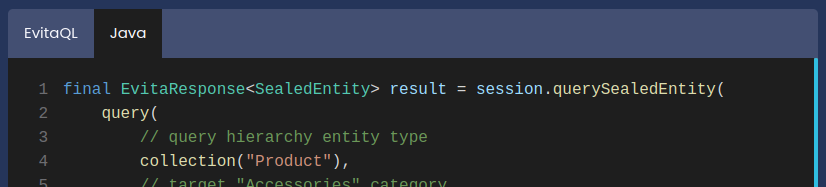
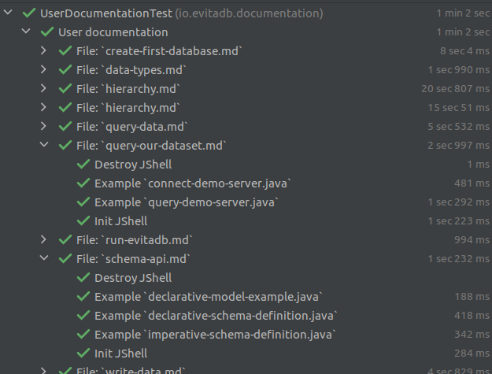
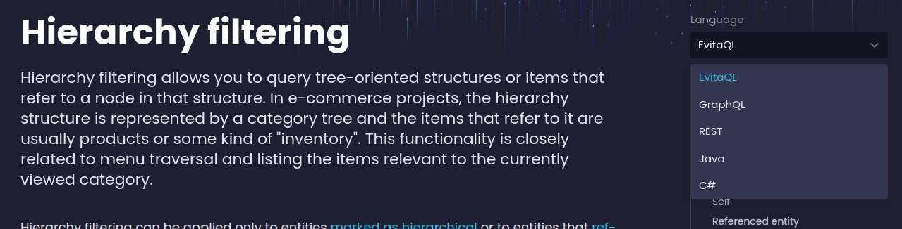

Protože evitaDB je postavena na platformě Java, má všechny výhody i nevýhody Javy. Java je staticky typovaný a kompilovaný jazyk. Než můžete spustit kus kódu, musíte jej zkompilovat a načíst do class loaderu. Naše ukázky kódu jsou roztroušeny v různých MarkDown souborech – někdy jsou vložené přímo, jindy odkazují na samostatný soubor v repozitáři. Zpočátku jsme si mysleli, že neexistuje jednoduchý způsob, jak ověřit platnost a konzistenci ukázek kódu v dokumentaci. Prvotní úvahy byly napsat vlastní Maven plugin, který by generoval testovací kód, zabalil ukázky do Java šablony, zkompiloval je pomocí Javac a poté je spustil jako součást naší testovací sady.

Naštěstí existuje jednodušší a dynamičtější přístup. Java poskytuje [JShell REPL](https://www.geeksforgeeks.org/jshell-java-9-new-feature/) (od verze 9), který vám umožňuje interaktivně zadávat, kompilovat a spouštět zdrojový kód v Javě. JShell lze také [spouštět programově](https://arbitrary-but-fixed.net/teaching/java/jshell/2018/10/18/jshell-exceptions.html), i když to není jeho hlavní použití (proto jsou informace o tomto přístupu vzácné a těžko dohledatelné). Předpokládali jsme, že JShell by mohl být cestou, jak překonat obtíže s kompilací, a rozhodli jsme se jej alespoň vyzkoušet.

Dalším dílkem do skládačky je [JUnit 5](https://junit.org/junit5/docs/current/user-guide/) a jeho skvělá podpora [dynamických testů](https://junit.org/junit5/docs/current/user-guide/#writing-tests-dynamic-tests), o které jsme se dozvěděli v průběhu práce.

Pojďme se tedy ponořit do detailů.

<Note type="info">
Kompletní funkční kód je dostupný v našem repozitáři ve třídě 
<SourceClass>evita_functional_tests/src/test/java/io/evitadb/documentation/UserDocumentationTest.java</SourceClass>.
</Note>

<Note type="question">

<NoteTitle toggles="true">

##### Jak organizujeme ukázky kódu v dokumentaci? Přečtěte si tuto sekci, pokud chcete lépe porozumět následujícím kapitolám.
</NoteTitle>

Ukázkové soubory jsou obvykle umístěny v samostatném souboru, na který odkazuje speciální komponenta Next.JS pojmenovaná 
`SourceCodeTabs`. Přesný formát je

```mdxjs
<SourceCodeTabs>
[Popis souboru](../en/relativePathToFileInRepository.extension)
</SourceCodeTabs>
```

Tato notace je optimalizována pro jednoduché zobrazení v MarkDownu na GitHubu, když komponenty Next.JS nejsou interpretovány. Odkazovaný soubor má obvykle příponu `.java` nebo `.evitaql`, ale existuje více souborů se stejným názvem, které se liší pouze příponou. Tyto soubory jsou na portálu dokumentace zobrazeny v interaktivním widgetu, který umožňuje přepínat mezi různými jazykovými verzemi ukázky:



Přípony těchto souborů jsou klíčovým prvkem pro rozpoznání, pro který jazyk je ukázka určena. 

</Note>

## Extrakce ukázek kódu z MarkDownu

Extrakce kódu pro ověření je nejjednodušší část procesu. Spočívá v hlubokém průchodu složky obsahující dokumentační soubory pomocí Java File Walkeru:

```java
try (final Stream<Path> walker = Files.walk(getRootDirectory().resolve(DOCS_ROOT))) {
	walker
		.filter(path -> path.toString().endsWith(".md"))
		.map(this::createTests)
		.toList();
}
```

... načtení obsahu souboru do řetězce a extrakci bloků kódu buď přímo ze samotného MarkDown souboru, nebo z externě odkazovaného souboru (viz tělo metody `createTests`). Extrakce zahrnuje jen trochu kouzlení s RegEx vzory.

## Generování dynamických testů JUnit 5

Dalším dílkem skládačky je dynamické vytváření JUnit testů – ideálně s jedním samostatným testem pro každý blok ukázkového kódu. Naštěstí autoři frameworku JUnit 5 na toto již mysleli a připravili podporu pro [dynamické testy](https://junit.org/junit5/docs/current/user-guide/#writing-tests-dynamic-tests).

V podstatě potřebujeme zabalit lambda výraz, který provádí samotný test, do wrapperu [DynamicTest](https://junit.org/junit5/docs/5.8.2/api/org.junit.jupiter.api/org/junit/jupiter/api/DynamicTest.html). Metoda `DynamicTest.dynamicTest(String, URI, Executable)` přijímá tři argumenty:

1. název testu, který se zobrazí (ekvivalent k `@DisplayName`)
2. lokátor souboru (`URI`), který umožňuje přejít ke zdroji po kliknutí na název testu v IDE
3. lambda ve formě `Executable`, která představuje samotný test

Vytvoření jediného proudu všech útržků kódu není v našem případě praktické – je jich příliš mnoho a výpis testů v IDE se rychle stává nepřehledným. Proto používáme další vynález JUnit 5 – [DynamicContainer](https://junit.org/junit5/docs/5.8.2/api/org.junit.jupiter.api/org/junit/jupiter/api/DynamicContainer.html), který je určen k agregaci více souvisejících testů do jednoho „uzlu“. Uzlem je v našem případě konkrétní zdrojový markdown soubor, ve kterém jsou bloky kódu umístěny (přímo nebo odkazem). Tímto způsobem můžeme rychle identifikovat správný dokument, ke kterému nefunkční ukázka patří.

Spuštěné testy vypadají takto:



## Kompilace a spouštění útržků kódu pomocí JShell

Útržky zdrojového kódu v Javě je třeba zkompilovat a zpracovat, k čemuž používáme [JShell REPL](https://www.geeksforgeeks.org/jshell-java-9-new-feature/).

<Note type="info">
Kompletní zdrojový kód je dostupný [na GitHubu](https://github.com/FgForrest/evitaDB/-/blob/382d230c1963c3a0d64317117de95e3db8619483/evita_functional_tests/src/test/java/io/evitadb/documentation/java/JavaExecutable.java).
</Note>

### Inicializace

Nejprve musíme připravit instanci JShell pomocí *JShell.builder()*:

```java
this.jShell = JShell.builder()
	// toto je rychlejší, protože JVM se pro každý test neforkuje
	.executionEngine(new LocalExecutionControlProvider(), Collections.emptyMap())
	.build();
// zkopírujeme celou classpath tohoto testu do instance JShell
Arrays.stream(System.getProperty("java.class.path").split(":"))
	.forEach(jShell::addToClasspath);
// a nyní předinicializujeme všechny potřebné importy
executeJShellCommands(jShell, toJavaSnippets(jShell, STATIC_IMPORT));
```

Všimněte si, že explicitně injektujeme *LocalExecutionControlProvider*. Ve výchozím nastavení JVM vytváří samostatný proces (fork) pro vyhodnocení útržků v Javě. I když je to dobré pro izolaci a bezpečnost, pro nás je to nepraktické, protože nemůžeme nastavit debug breakpointy na kód spuštěný skriptovým blokem. Možnost ladění nám umožňuje opravovat chyby v našich ukázkách kódu mnohem rychleji a snadněji.

Dále inicializujeme classpath pro instanci JShell zkopírováním celé classpath JVM, ve které běží JUnit testovací sada, a nakonec inicializujeme všechny importy, které naše ukázky v Javě potřebují, pomocí tohoto souboru:
<SourceClass>evita_test/evita_functional_tests/src/test/resources/META-INF/documentation/imports.java</SourceClass>. 
Pro inicializaci importů používáme stejnou logiku jako pro samotné spouštění zdrojového kódu.

### Příprava a spuštění zdrojového kódu

Zdrojový kód je třeba rozdělit na samostatné příkazy, které lze spustit v instanci JShell. JShell nepřijímá celý zdrojový kód a je podobný dialogu *evaluate expression* v IDE. Pro tuto operaci požádáme samotnou instanci JShell, aby kód vhodně rozdělila:

```java
@Nonnull
static List<String> toJavaSnippets(@Nonnull JShell jShell, @Nonnull String sourceCode) {
	final SourceCodeAnalysis sca = jShell.sourceCodeAnalysis();
	final List<String> snippets = new LinkedList<>();
	String str = sourceCode;
	do {
		CompletionInfo info = sca.analyzeCompletion(str);
		snippets.add(info.source());
		str = info.remaining();
	} while (str.length() > 0);
	return snippets;
}
```

Metoda vrací seznam samostatných Java výrazů, které dohromady tvoří původní ukázkový kód. Dalším krokem je jejich vyhodnocení/spuštění v instanci JShell:

```java
@Nonnull
static InvocationResult executeJShellCommands(@Nonnull JShell jShell, @Nonnull List<String> snippets) {
	final List<RuntimeException> exceptions = new LinkedList<>();
	final ArrayList<Snippet> executedSnippets = new ArrayList<>(snippets.size() << 1);

	// procházíme útržky a spouštíme je
	for (String snippet : snippets) {
		final List<SnippetEvent> events = jShell.eval(snippet);
		// ověříme výstupní události vyvolané provedením
		for (SnippetEvent event : events) {
			// pokud útržek není aktivní
			if (!event.status().isActive()) {
				// shromáždíme chybu kompilace a problematickou pozici a zaregistrujeme výjimku
				exceptions.add(
					new JavaCompilationException(
						jShell.diagnostics(event.snippet())
							.map(it ->
								"\n- [" + it.getStartPosition() + "-" + it.getEndPosition() + "] " +
									it.getMessage(Locale.ENGLISH)
							)
							.collect(Collectors.joining()),
						event.snippet().source()
					)
				);
			// pokud událost obsahuje výjimku
			} else if (event.exception() != null) {
				// znamená to, že kód byl úspěšně zkompilován, ale při vyhodnocení vyhodil výjimku
				exceptions.add(
					new JavaExecutionException(event.exception())
				);
				// přidáme útržek do seznamu provedených
				if (event.status() == Status.VALID) {
					executedSnippets.add(event.snippet());
				}
			} else {
				// znamená to, že kód byl úspěšně zkompilován a spuštěn bez výjimky
				executedSnippets.add(event.snippet());
			}
		}
		// pokud existuje výjimka, okamžitě selžeme a nahlásíme ji
		if (!exceptions.isEmpty()) {
			break;
		}
	}

	// vrátíme všechny útržky, které byly provedeny, a případnou výjimku
	return new InvocationResult(
		executedSnippets,
		exceptions.isEmpty() ? null : exceptions.get(0)
	);
}
```

JShell generuje seznam událostí pro každý vyhodnocený útržek Javy (výraz), které popisují, co se stalo. Nejpodstatnější informace pro nás je, zda byl útržek úspěšně aplikován a je součástí stavu JShell – to lze ověřit voláním `event.status().isActive()`. Pokud událost není aktivní, došlo k vážné chybě a použijeme diagnostiku JShell k určení příčiny problému.

Dále kontrolujeme, zda byla během vyhodnocení výrazu vyhozena výjimka pomocí metody `event.exception()`. Pokud je výjimka nalezena a stav události je `VALID`, přidáme ji do seznamu útržků, které byly JShell aplikovány a jsou součástí jeho stavu.

Stejná logika platí pro případ, kdy nenastala ani chyba kompilace, ani výjimka při vyhodnocení a útržek byl úspěšně vyhodnocen. Útržek je přidán do seznamu útržků, které ovlivnily stav JShell a jsou vráceny jako výsledek této metody.

### Ukončení

Inicializace a příprava instance JShell je nákladná, proto znovu používáme jednu instanci pro všechny ukázky ve stejném dokumentačním souboru. Nechceme sdílet stejnou instanci JShell pro více dokumentačních souborů, protože naším cílem je být schopni spouštět naše dokumentační testy paralelně, jakmile bude vyřešen [JUnit 5 issue #2497](https://github.com/junit-team/junit5/issues/2497). Opětovné použití stejné instance JShell pro více testů v jednom dokumentačním souboru vyvolává otázku správného vyčištění stavu, aby pozůstatky jednoho příkladu neovlivnily ostatní příklady, které běží po něm.

Po dokončení testu musíme vyčistit instanci JShell, která bude znovu použita pro další příklad ve stejném dokumentačním souboru. Naštěstí JShell poskytuje možnost *odstranit vyhodnocený příkaz*, což efektivně eliminuje jeho dopad na stav instance JShell.

Ve skutečnosti existují dvě fáze ukončení kontextu:

```java
// vyčištění – procházíme od nejnovějšího (posledního) útržku k prvnímu
final List<Snippet> snippets = result.snippets();
for (int i = snippets.size() - 1; i >= 0; i--) {
	final Snippet snippet = snippets.get(i);
	// pokud útržek deklaroval proměnnou typu AutoCloseable, musíme ji uzavřít
	if (snippet instanceof VarSnippet varSnippet) {
		// není způsob, jak získat referenci na proměnnou – vyčištění
		// musí být provedeno dalším útržkem
		executeJShellCommands(
			jShell,
			Arrays.asList(
				// instanceof / cast vyhazuje kompilátorovou výjimku, proto musíme
				// obejít tento problém runtime vyhodnocením
				"if (AutoCloseable.class.isInstance(" + varSnippet.name() + ")) {\n\t" +
					"AutoCloseable.class.cast(" + varSnippet.name() + ").close();\n" +
					"}\n"
			)
		)
			.snippets()
			.forEach(jShell::drop);
	}
	// každý útržek je „odstraněn“ instancí JShell (vrácen zpět)
	jShell.drop(snippet);
}
```

**První fáze** prochází všechny útržky a hledá všechny `VarSnippets` – tj. výrazy, které deklarují proměnné v kontextu JShell, a snaží se zjistit, zda tyto proměnné implementují rozhraní `java.lang.AutoCloseable` a je třeba je správně uzavřít. Je zde však háček, JShell neposkytuje možnost přistupovat k proměnným referencí a pracovat s nimi přímo v kódu, který útržky vyvolal. JShell může vrátit pouze výstupy `toString` těchto proměnných. Důvodem je podle našeho odhadu to, že interpret JShell může (a obvykle běží) jako forked proces a Java objekty žijí v kontextu (classpath, paměťové hranice procesu atd.) jiné instance JVM. Proto musíme spustit *logiku uzavření* jako další výraz JShell.

<Note type="info">

<NoteTitle toggles="true">

##### Proč používáme metody `AutoCloseable.class` isInstance / cast místo Java `instanceof` nebo přímého přetypování?
</NoteTitle>

Zajímavé je, že pokud se pokusíte nahradit `AutoCloseable.class.isInstance(" + varSnippet.name() + ")` výrazem 
`varSnippet.name() + " instanceof AutoCloseable"`, skončíte s kompilátorovou výjimkou pro proměnné, které nejsou instancemi `AutoCloseable`. I když je to pro běžný Java kód správný zdrojový kód, interpret/kompilátor JShell se chová odlišně a musíme tento problém obejít použitím metod rozhraní `Class`. Viz [JDK issue #8211697](https://bugs.openjdk.org/browse/JDK-8211697).

</Note>

**Nakonec** musíme odstranit jak útržky, které neuzavírají `AutoCloseable`, tak všechny ukázkové útržky zdrojového kódu, které byly vyhodnoceny a ovlivnily stav instance JShell. Operace `drop` se chová podobně jako operace rollback v databázi a vrací zpět všechny operace, které ovlivnily instanci JShell (ale ne vedlejší efekty spojené s voláním sítě nebo souborového systému).

## Předpoklady testů, řetězení

Některé příklady navazují na kontext jiných příkladů ve stejném dokumentu – přirozeně, jak se popisovaný use-case rozvíjí. Rozhodně nechceme zahlcovat ukázkový kód opakováním příkazů, které nastavují prostředí pro samotný příklad – ukázky by měly být co nejkratší.

Proto jsme zavedli atribut `requires` pro naši komponentu `SourceCodeTabs`, který umožňuje specifikovat jeden nebo více dalších souborů, které musí být vykonány před samotným kódem v příkladu.

## Překlad ukázek

Další speciální vlastností naší dokumentace je možnost přepínat mezi různými variantami a dokonce i obsahem dokumentace výběrem různého *preferovaného jazyka* pro zobrazení dokumentace:



Příprava ukázek pro 4–5 různých jazyků je únavná a časově náročná práce, které se chceme vyhnout. Proto jsme implementovali speciální režim, který nám umožňuje generovat ukázky pro různé jazyky (Java, REST, GraphQL) z výchozího EvitaQL dotazu.

Podobně můžeme automaticky generovat MarkDown útržky dokumentující očekávaný výstup pro dotazy aplikované na náš [demo dataset](https://evitadb.io/documentation/get-started/query-our-dataset). Tyto MarkDown útržky hrají další důležitou roli, jak se dozvíte v další kapitole.

Překlad ukázek je manuální operace, která není spouštěna našimi CI workflow. Vygenerované soubory je třeba zkontrolovat člověkem a zapsat do Gitu spolu s dokumentací. Jakmile jsou však ukázky/soubory vygenerovány, jsou kompilovány a spouštěny naší testovací sadou, takže jejich správnost je automaticky ověřena. Podívejte se sami, jak vygenerované útržky vypadají: <SourceClass>/documentation/user/en/query/filtering/examples/hierarchy/</SourceClass>

## Ověření, aserce

Ukázky, které dotazují náš [demo dataset](https://evitadb.io/documentation/get-started/query-our-dataset), obvykle obsahují náhled výsledku, který může čtenář očekávat, pokud dotaz spustí sám. Protože náš dataset není statický, ale v čase se vyvíjí (přidávají se nová data, mění se struktura atd.), výsledky se mohou v čase lišit. Také pracujeme na jádru dotazovacího enginu evitaDB a výsledky se mohou lišit, jak měníme interní logiku enginu. V každém případě chceme být informováni, když k tomu dojde, a prozkoumat rozdíl mezi předchozími výsledky a výsledky produkovanými aktuální verzí datasetu a enginu evitaDB. Musíme buď opravit dokumentaci (byť poloautomaticky opětovným spuštěním [překladu ukázek](#peklad-ukzek)), nebo si uvědomit, že je třeba opravit náš engine evitaDB, případně zdokumentovat zpětně nekompatibilní chování.

Proto automaticky porovnáváme očekávané výsledné MarkDown útržky s aktuálními výsledky dotazu evitaDB uvedeného v příkladu a pokud se tyto výsledky liší, označíme testy jako neúspěšné a vynutíme lidský zásah.

Existuje speciální GitHub workflow <SourceClass>.github/workflows/ci-dev-documentation.yml</SourceClass> spojený s ověřováním dokumentace. Testy, které ověřují spustitelnost našich ukázek zdrojového kódu a porovnávají jejich výstup s posledním ověřeným výstupem, se spouštějí automaticky pokaždé, když dojde ke změně ve složce 
<SourceClass>documentation/user/</SourceClass>. Spouštějí se také každou neděli v noci, abychom mohli detekovat možné změny v [demo datasetu](https://evitadb.io/documentation/get-started/query-our-dataset), i když se samotná dokumentace nezměnila.

## Shrnutí

Doposud jsme napsali stovky stran dokumentace a spustitelných ukázek. Dokumentace stále roste a mít proces, který nás chrání a hlídá nefunkční ukázky nebo odchylky v deklarovaných odpovědích, je velmi důležité. Není nic horšího než zastaralá nebo chybná dokumentace.

Příjemným vedlejším efektem popsaného procesu je, že nám šetří značné množství únavné práce při definování ukázek pro všechny jazyky, které podporujeme, a zároveň přidává další vrstvu integračního testování, která odhalila některé chyby v jádru evitaDB / parseru dotazů.

Dotazy běží proti našemu [demo datasetu](https://evitadb.io/documentation/get-started/query-our-dataset) a ověřují, že naše demo serverové API funguje správně a že jsme jej nějakou aktualizací nerozbili, což je také velmi důležité – chceme, aby náš demo server byl dostupný každému, kdo si s ním chce pohrát.

Tato práce se již vyplatila a jsme si jisti, že se v dlouhodobém horizontu vyplatí ještě více.