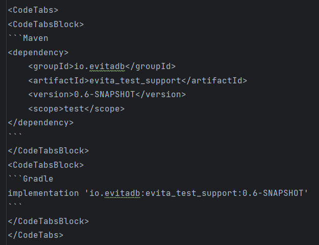
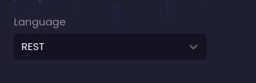

## Podpora inovací – Brainstorming

Jako vývojář se pravidelně věnuji rozsáhlému čtení, ať už jde o dokumentaci, články nebo jiné relevantní zdroje. Kdykoli narazím na stránku, která nabízí další funkce, opravdu oceňuji úsilí, které někdo vynaložil na prezentaci základního konceptu. Právě proto jsme se zaměřili na tvorbu snadno čitelných stránek, nabitých **četnými příklady** a **zajímavými ukázkami** s přidanou interaktivitou.

Od samého začátku jsem věděl, že budeme prezentovat **mnoho příkladů syntaxe v různých programovacích jazycích**. Navíc jsem si byl vědom, že budu potřebovat rozšiřitelný zvýrazňovač syntaxe, který usnadní implementaci vlastního parseru pro novou syntaxi `evitaQL`. Abych tuto potřebu vyřešil, rozhodl jsem se strategicky použít [Prism](https://prismjs.com/), lehký a vysoce přizpůsobitelný zvýrazňovač syntaxe s ohledem na moderní webové standardy. V současné době vzniká a aktualizuje se řada dokumentů a parser `evitaQL` je součástí našeho repozitáře. Jakmile se přiblížíme k finálním fázím a rostoucí popularitě jazyka `evitaQL`, plánujeme odeslat merge request do repozitáře Prism.

Níže je uveden příklad základní syntaxe a jejího zvýraznění.

```evitaql
query(
    collection('Product'),
    filterBy(
        entityPrimaryKeyInSet(110066, 106742),
        attributeEquals('code', 'lenovo-thinkpad-t495-2')
    )
)
```

Často je potřeba prezentovat více bloků kódu, které obsahují podobné dotazy nebo jiné příklady. Místo toho, abychom tyto bloky zobrazovali jeden za druhým, využíváme *klikatelné záložky* pro jejich seskupení. Namísto uzavírání každého bloku do zpětných apostrofů jsem vytvořil vlastní komponentu `<CodeTabs />`. Každý blok kódu je pak vykreslen jako samostatná záložka v rámci `<CodeTabsBlock />`.

##### Značení



##### Výsledek

<CodeTabs>
<CodeTabsBlock>
```Maven
<dependency>
    <groupId>io.evitadb</groupId>
    <artifactId>evita_test_support</artifactId>
    <version>2025.6.0</version>
    <scope>test</scope>
</dependency>
```
</CodeTabsBlock>
<CodeTabsBlock>
```Gradle
implementation 'io.evitadb:evita_test_support:0.6-SNAPSHOT'
```
</CodeTabsBlock>
</CodeTabs>

Podobně mají autoři dokumentace možnost zobrazit záložky s ukázkami kódu z externí složky. K tomu jsem vytvořil další vlastní komponentu `<SourceCodeTabs />`. Uživatelské rozhraní této komponenty je téměř stejné jako u `<CodeTabs />`, ale dokáže pracovat s relativními URL souborů nebo složek v repozitáři.

Když se podíváte na značení níže, všimnete si, že obsahuje Markdown odkaz uvnitř komponenty `<SourceCodeTabs />`. Tento záměrný prvek slouží jako záložní možnost pro čtenáře na GitHubu. Poskytnutím odkazu na příslušný zdrojový soubor nebo složku zajišťujeme přístupnost ukázky.

<Note type="info">
Pokud pracujete s podobným nastavením a vaše Markdown soubory jsou hostovány na **Githubu**, je důležité zajistit, abyste za otevírací vlastní značkou vložili nový řádek. Alternativně můžete vlastní značku s odkazem umístit na jeden řádek.
</Note>

##### Značení

```md
<SourceCodeTabs requires="/documentation/user/en/get-started/example/connect-demo-server.java">[EvitaQL example](/documentation/user/en/use/api/example/evita-query-example.java)</SourceCodeTabs>

<SourceCodeTabs requires="/documentation/user/en/get-started/example/connect-demo-server.java"> // všimněte si prázdného řádku za otevírací vlastní značkou

[EvitaQL example](/documentation/user/en/use/api/example/evita-query-example.java)
</SourceCodeTabs>
```

##### Výsledek

<SourceCodeTabs requires="/documentation/user/en/get-started/example/connect-demo-server.java">[EvitaQL example](/documentation/user/en/use/api/example/evita-query-example.java)</SourceCodeTabs>

Tato konkrétní komponenta má ještě více funkcí, ale k těm se dostanu později.

## Přepínání programovacích jazyků podle uživatelských preferencí

Když jsme poprvé viděli stránky živé dokumentace, rozpoznali jsme příležitost zlepšit uživatelský zážitek implementací funkce, která by umožnila selektivní zobrazení obsahu na základě používaného programovacího jazyka. S evitaDB je možné komunikovat v různých jazycích a to vyžaduje přípravu příkladů v různých formátech. Zároveň nedává smysl zobrazovat všechny formáty najednou – vývojáře pravděpodobně zajímá pouze varianta, kterou hodlá při integraci použít. To však představovalo výzvu kvůli různým překážkám, jako je indexace stránek a podpora tisku.

Vše začalo komponentou `<LS />`. Věřím, že už z jejího názvu a značení pochopíte účel této komponenty.

##### Značení

```md
<LS to="e,j">
// obsah specifický pro Java a EvitaQL
</LS>
```

Nyní přejděme k dalšímu kroku, který zahrnuje vytvoření uživatelsky přívětivého přepínače, jenž uživatelům umožní snadno přepínat mezi programovacími jazyky podle jejich preferencí.

K řešení tohoto úkolu jsem zvolil strategii, kdy každá vlastní komponenta, která interaguje s přepínačem jazyků, využije local storage pro efektivní uložení a načtení preferovaného programovacího jazyka uživatele.

```ts
import {useRouter, NextRouter} from 'next/router';
import {useEffect} from 'react';

export default function setLocalStorageCodelang(): void {
    const router: NextRouter = useRouter();

    useEffect(() => {
        const params: URLSearchParams = new URLSearchParams(window.location.search);
        const queryValue: string | null = params.get('codelang');

        const preferredLanguage: string | null =
            localStorage.getItem('PREFERRED_LANGUAGE');

        // Check if query parameter 'codelang' is not present in the URL
        if (queryValue === null) {
            // Check if preferred language is stored in local storage
            if (preferredLanguage) {
                // Push the preferred language to the router query
                router.push(
                    {
                        pathname: router.pathname,
                        query: {
                            ...router.query,
                            codelang: preferredLanguage,
                        },
                    },
                    undefined,
                    {scroll: false}
                );
            } else {
                // Set 'evitaql' as the default language preference in local storage
                localStorage.setItem('PREFERRED_LANGUAGE', 'evitaql');
            }
        } else {
            // Handle the case when 'codelang' query parameter is present in the URL
            if (!preferredLanguage) {
                // If preferred language is not set in local storage, set it to the query parameter value
                localStorage.setItem('PREFERRED_LANGUAGE', queryValue);
            } else if (preferredLanguage !== queryValue) {
                // If preferred language is already set but differs from the query parameter value, update it
                localStorage.setItem('PREFERRED_LANGUAGE', queryValue);
            }
        }
    }, []);
}
```

Jak vidíte, hodnota je přidána do `router query`, což vede k aktualizaci URL parametru `?codelang={preferredLanguage}`. Tím se zachová správné přednastavení jazyka v případě, že uživatel zkopíruje odkaz do schránky a odešle jej někomu dalšímu. Tento člověk pak uvidí stejnou variantu stránky jako ten, kdo odkaz poslal.

Komponenta je nyní informována o preferovaném jazyce. V případě komponenty `<LS />` zobrazí aktuální obsah podle vašeho preferovaného programovacího jazyka.

<Note type="info">
Na menších obrazovkách se přepínač preferovaného jazyka zobrazí po kliknutí na tlačítko s ikonou kotvy. Na větších obrazovkách najdete přepínač preferovaného jazyka v pravém horním rohu obrazovky.


</Note>

##### Značení

```md
<LS to="e,j">

---
> Tento blok textu je specifický pro programovací jazyk `evitaql`.
>
> Zkuste přepnout.

---
</LS>
```

##### Výsledek

<LS to="e,j">

---
> Tento blok textu je specifický pro programovací jazyk `evitaql` a `java`.
>
> Zkuste přepnout.

---
</LS>

<LS to="r">

---
> Tento blok textu je specifický pro programovací jazyk `Rest`.
>
> Zkuste přepnout.

---
</LS>

<LS to="g">

---
> Tento blok textu je specifický pro programovací jazyk `GraphQL`.
>
> Zkuste přepnout.

---
</LS>

Další vlastní komponenta, která je si vědoma uživatelského preferovaného jazyka, je [výše uvedená `<SourceCodeTabs/>`](#vsledek).

## Indexace stránek a podpora tisku

Aby byla zajištěna komplexní indexace veškerého obsahu, rozhodl jsem se výhradně skrývat jakékoli nerelevantní informace a zároveň upřednostnit vizuální přístupnost, i když to vede k posunu rozložení. Navíc, když se uživatel rozhodne dokument vytisknout, naše vykreslovací funkce komponenty zahrnuje doplňkové prvky pro zvýšení viditelnosti této funkce.

Když tedy zkusíte tuto stránku vytisknout, uvidíte, že výše uvedené příklady `<LS />` jsou dostupné a připravené k tisku. Náhled tisku je podobný tomu, co vidíte přímo na Githubu, kde je veškerý obsah viditelný bez ohledu na nastavení.


## Co bude dál

V příštím příspěvku odhalím naši strategii pro další vývoj a nastíním plán na implementaci funkcí, jako je verzování dokumentace, které uživatelům umožní přístup ke konkrétním historickým verzím přepnutím na různé větve.

Zůstaňte naladěni na další podrobnosti. 😉