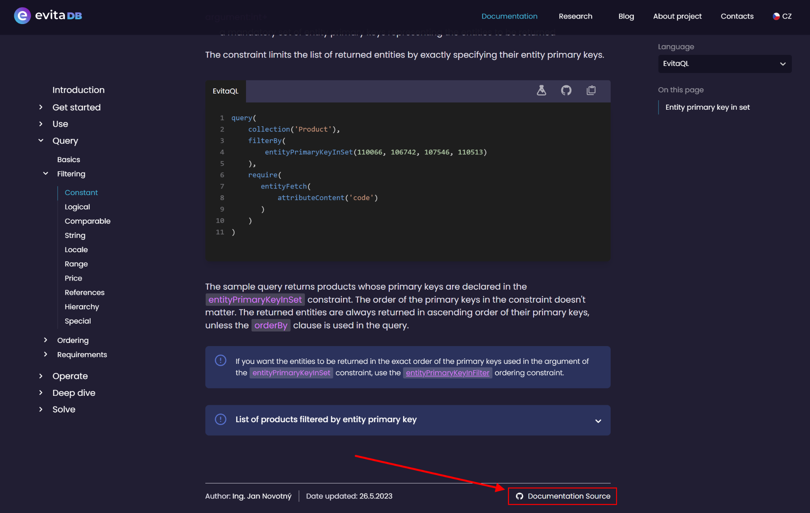
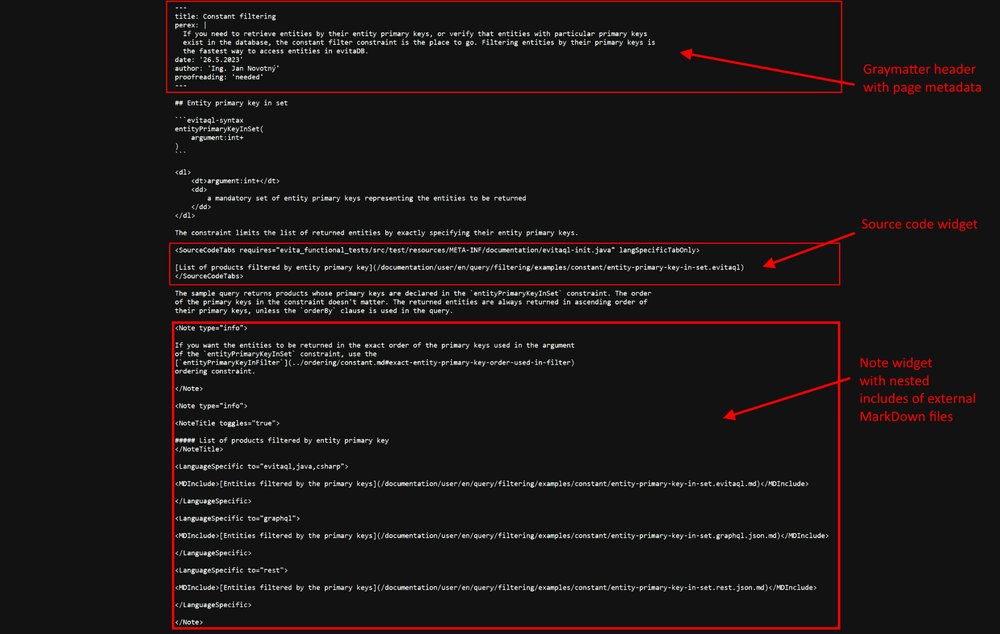
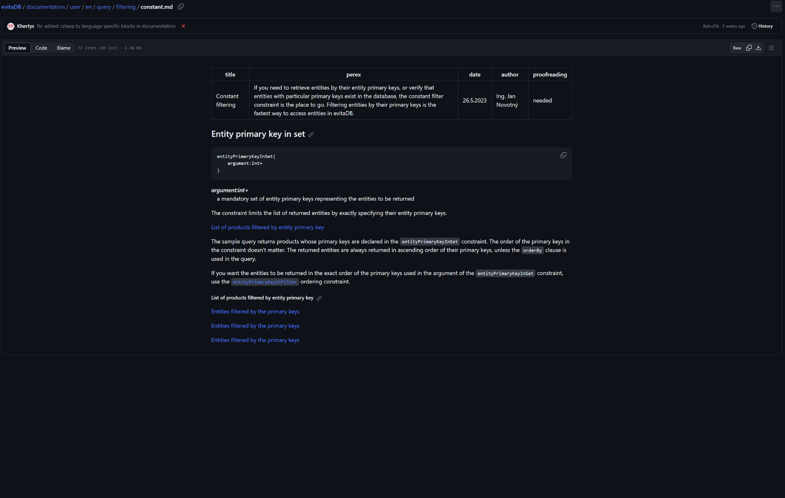
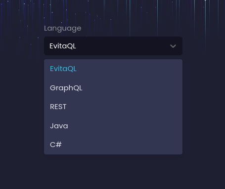
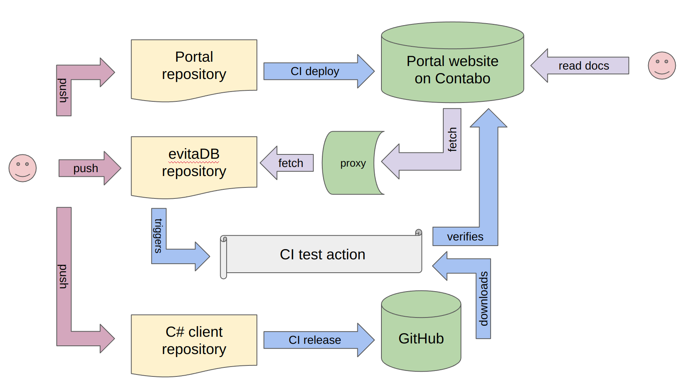

Technická dokumentace psaná vývojáři evitaDB vyžaduje odlišný přístup než dokumentace psaná marketingovým nebo obchodním týmem. Vývojáři jsou úzce spojeni se svým integrovaným vývojovým prostředím (IDE) a chtějí, aby dokumentace byla blízko zdrojovému kódu, na kterém pracují, a byla s ním propojena. Nechtějí žádné okázalé editory ani trávit příliš času úpravou stylu – obyčejný MarkDown je pro ně obvykle nejlepší volbou. Chtějí mít dokumentaci ve stejném repozitáři jako zdrojový kód, aby mohli snadno vytvořit pull request a nechat si dokumentaci zkontrolovat kolegy. A také chtějí, aby dokumentace byla recenzována, aby měli jistotu, že je přesná a aktuální.

Náš dokumentační portál byl silně inspirován [prezentací HashiCorp](https://www.youtube.com/watch?v=4dqPA4FF15A) a je postaven na frameworku [Next.js](https://nextjs.org/). Je hostován v jiném privátním repozitáři a poskytuje přístup k dokumentaci v repozitáři evitaDB umístěné ve složce <SourceClass>documentation/user</SourceClass>. Je napsán ve formátu [MDX](05-building-documentation-portal.md#pro-jsem-zvolil-nextjs--mdx), což je kombinace MarkDown a Reactu, i když přípona je `.md`.

Tato kombinace nám umožňuje dělat dokumentaci interaktivní na našem portálu, aniž by to bránilo jejímu správnému zobrazení na GitHubu nebo v jiných MarkDown prohlížečích.

Dokumentace obsahuje mnoho ukázek kódu, které musíme udržovat aktuální, zkompilovatelné, spustitelné a otestované. Rozhodli jsme se organizovat dokumentaci podle prostředí / programovacího jazyka, se kterým bude uživatel s naší databází pracovat. To znamená, že musíme všechny ukázky převádět do několika cílových jazyků – evitaQL, GraphQL, REST, Java nebo C#.

V současnosti je počet ukázek více než 600 a stále roste. Bylo by velmi náročné udržovat všechny varianty ručně. Ve většině případů udržujeme pouze jednu verzi ukázky (obvykle evitaQL) a ostatní jsou generovány automaticky třídou 
<SourceClass>evita_functional_tests/src/test/java/io/evitadb/documentation/UserDocumentationTest.java</SourceClass>. Kromě převodu ukázek tato třída provádí dotaz na [demo dataset](https://demo.evitadb.io) a zapisuje výsledek do dalšího MarkDown souboru – jako tabulku výsledků nebo JSON úryvek. Vygenerované soubory jsou pak zkomitovány do repozitáře spolu se zdrojovou ukázkou, mohou být zkontrolovány dalšími vývojáři a zobrazeny portálem dokumentace, pokud je vybrán konkrétní dialekt.

## Testování a ověření

Dokumentaci jsme napsali, ukázky vygenerovali, ale jak si můžeme být jisti, že jsou ukázky správné? Musíme je pravidelně testovat a ověřovat, že stále dávají stejné výsledky jako při jejich vytvoření. Tímto způsobem také testujeme dostupnost a správnost demo datasetu, který není zcela statický, ale v čase se mění.

Testování je však docela výzva. Každá platforma/jazyk vyžaduje jiný způsob spuštění ukázek. Podívejme se na jednotlivé případy:

1. Ukázky v Javě byly poměrně náročné a jejich testování bylo popsáno v [předchozím blogpostu](06-document-examples-testing.md)
2. evitaQL používá [Java Client](https://evitadb.io/documentation/use/connectors/java)
3. REST API používá jednoduchého HTTP klienta pro odesílání požadavků
4. GraphQL API používá jednoduchého HTTP klienta pro odesílání požadavků
5. Ukázky v C# používají [C# Client](https://evitadb.io/documentation/use/connectors/c-sharp)

## Překonané překážky

Oběd nebyl zadarmo. Museli jsme překonat několik překážek, abychom vše zprovoznili. Podívejme se na ně:

### MarkDown rozšířená notace widgetů

Snažili jsme se držet co nejvíce standardní MarkDown notace, ale museli jsme ji trochu rozšířit, abychom umožnili psát ukázky ve více jazycích. Využíváme vlastní značky, které jsou následně zpracovány našimi React komponentami, ale ostatní MarkDown renderery, jako je GitHub, je ignorují. Návrh všech značek vyžaduje pečlivé zvážení a formátování.

### Omezení GitHub API

Používáme GitHub API pro získávání zdrojového kódu ukázek z repozitáře. Problém je, že GitHub má [politiku omezení počtu požadavků](https://docs.github.com/en/rest/overview/resources-in-the-rest-api?apiVersion=2022-11-28#rate-limits), což znamená, že nemůžeme získávat zdrojový kód ukázek příliš často. Kvůli počtu ukázek na každé stránce často narazíme na limit. Museli jsme implementovat proxy mechanismus, který ukládá zdrojový kód ukázek lokálně do cache a stahuje jej z GitHubu pouze tehdy, pokud není v cache nebo pokud se změnil jeho [eTag](https://www.endorlabs.com/blog/how-to-get-the-most-out-of-github-api-rate-limits#conditional-requests-aka-etag), pomocí funkce [conditional requests](https://docs.github.com/en/rest/overview/resources-in-the-rest-api?apiVersion=2022-11-28#conditional-requests) GitHubu.

### Odkazy

Protože struktura repozitáře je odlišná od struktury dokumentačního portálu, museli jsme implementovat speciální logiku, která převádí odkazy v dokumentaci na správné umístění vzhledem k portálu. Také identifikujeme odkazy vedoucí na externí zdroje a označujeme je speciální ikonou.

Všechny odkazy jsou navrženy tak, aby fungovaly v GitHub repozitáři evitaDB, a portál dokumentace je musí převádět na správné umístění.

### C-Sharp klient

C# klient žije v samostatném [repozitáři](https://github.com/FgForrest/evitaDB-C-Sharp-client) a má svůj vlastní CI/CD pipeline. Když tento pipeline projde, klient je publikován do NuGet repozitáře a je k dispozici ke stažení. CI/CD pipeline evitaDB stáhne nejnovější verzi klienta a použije ji ke spuštění C# ukázek na platformě Linux prostřednictvím naší JUnit rozšíření <SourceClass>evita_functional_tests/src/test/java/io/evitadb/documentation/csharp/CShell.java</SourceClass>. Klient je spuštěn v samostatném procesu a využíváme multiplatformní podporu .NET a jeho schopnost běžet na Linuxu. C# spustitelný soubor provádí ukázky nad [demo datasetem](https://demo.evitadb.io) a generuje MarkDown na standardní výstup, který je zachycen JUnit rozšířením a porovnán s očekávaným obsahem.

## Komponentový & aktivity pseudo-diagram

Celé řešení lze shrnout následujícím diagramem:

Jak vidíte, je to poměrně složitý proces, ale stálo to za to. Objevili jsme řadu chyb v návrhu API a konzistenci napříč platformami. Máme bezpečnostní síť end-to-end testování napříč celým naším stackem, což je obrovská výhoda při refaktoringu nebo změnách.

## Interaktivita ukázek

Další skvělou funkcí našich ukázek je možnost je spouštět přímo z portálu dokumentace. Podívejte se na video níže:

    <video width="850" height="478" controls="controls">
      <source src="https://evitadb.io/download/evitaLab_example.mp4" type="video/mp4"/>
        Váš prohlížeč nepodporuje video tag.
    </video>

Každá ukázka je uložena v samostatném souboru na GitHubu a její umístění lze předat instanci evitaLab spuštěné na demo stránce, spolu s instancí evitaDB běžící na demo datasetu. Instance evitaLab pak stáhne ukázku z GitHub repozitáře, vloží ji do editoru kódu a automaticky ji spustí nad demo datasetem, přičemž výsledek zobrazí v postranním panelu.

Uživatel si tak může s ukázkou hrát a upravovat ji, aby viděl, jak se změní výsledek. Doufáme, že to uživatelům pomůže lépe porozumět ukázkám a usnadní jim začátky s evitaDB.

## Závěr

Doufáme, že portál nám pomůže udržovat dokumentaci aktuální a přesnou a zároveň ji zpřístupní vám. Již nyní splnil svůj účel a pomohl nám najít řadu chyb v návrhu a implementaci API a naučit se mnoho nového. Věříme, že poskytuje solidní základ pro další rozvoj dokumentačního portálu i samotné evitaDB.

Těšíme se na vaše zpětné vazby a návrhy.

<Note type="info">

Článek vychází z přednášky na české unconference jOpenSpace, která se konala v říjnu 2023. Záznam přednášky si můžete pustit níže (pozor, je v češtině):

    <iframe width="560" height="315" src="https://www.youtube.com/embed/kJuaVHHexNk?si=8Tseq9zqr3clGaJU" title="YouTube video player" frameborder="0" allow="accelerometer; autoplay; clipboard-write; encrypted-media; gyroscope; picture-in-picture; web-share" allowfullscreen></iframe>

</Note>