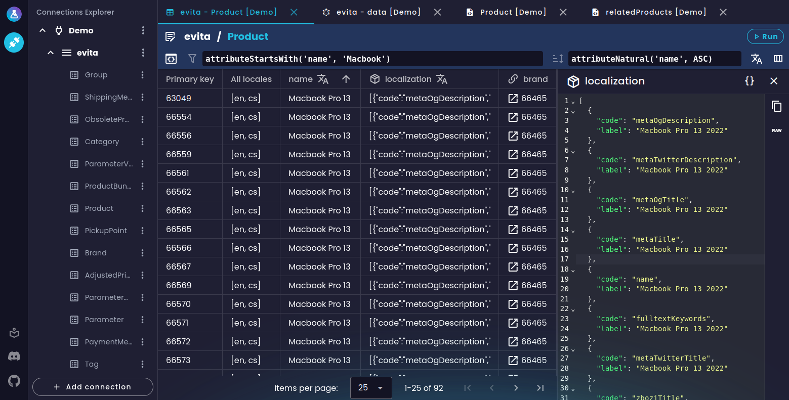
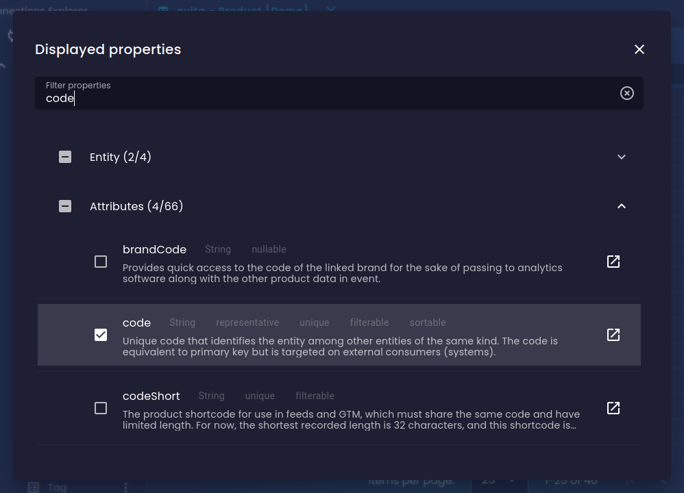
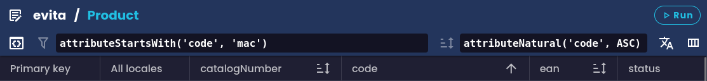
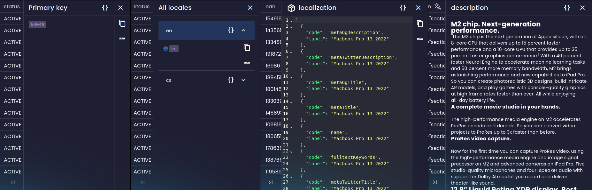
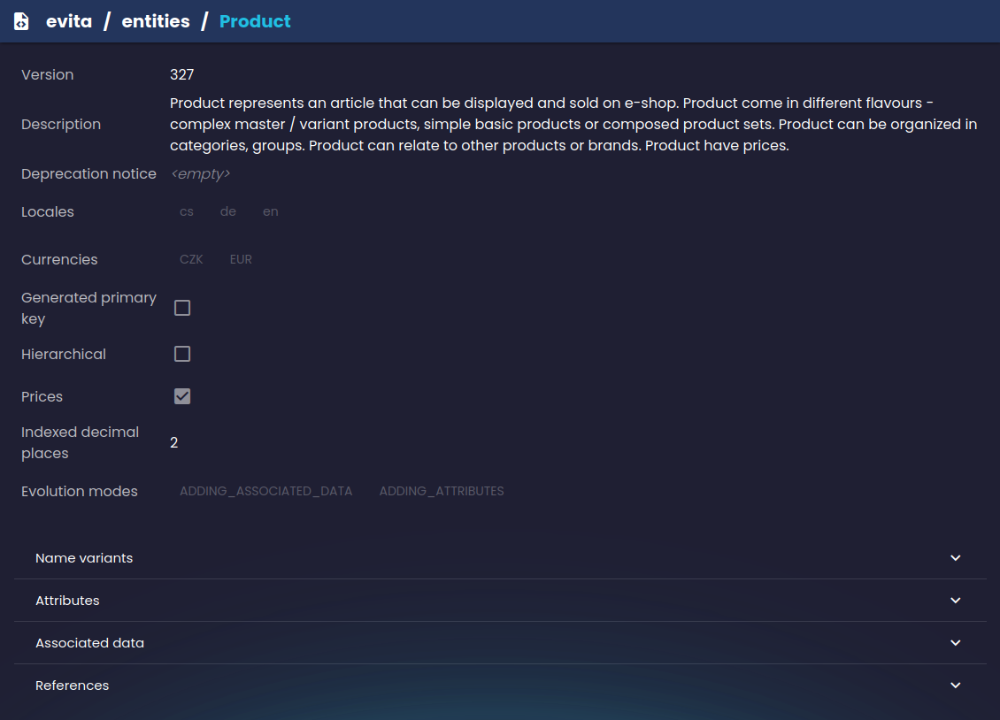
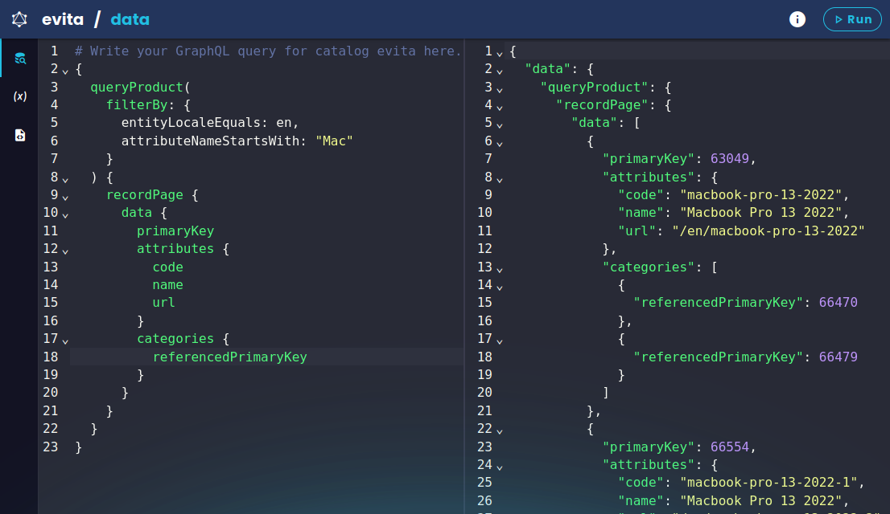
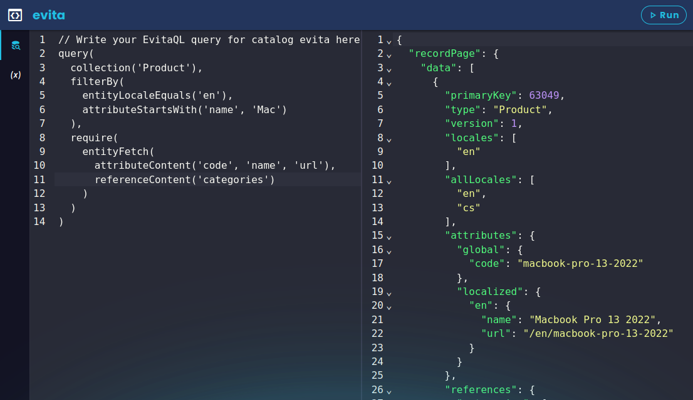
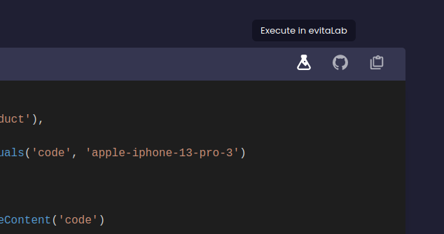

Myšlenka evitaLab je jednoduchá: poskytnout společné prostředí pro všechny vaše instance evitaDB, ke kterým potřebujete přistupovat a spravovat je. V současné době jsou hlavní dostupné nástroje:

- správce připojení k instancím evitaDB
- vizualizace dat bez nutnosti psát jakékoli dotazy
- „dotazovací konzole“ pro rychlé psaní dotazů (v evitaQL, GraphQL atd.)

Všechny nástroje jsou dostupné na pár kliknutí v rámci připojení k instanci evitaDB.

## Vizualizace dat

Vizualizace dat je jednou z hlavních funkcí evitaLab. Je navržena tak, aby usnadnila procházení uložených dat a vnitřních datových struktur, protože nikdo nechce psát zdlouhavé dotazy jen kvůli rychlému ověření nějakých dat nebo konfigurace.

V současnosti podporujeme dva hlavní nástroje pro vizualizaci dat: datovou mřížku a prohlížeč schémat.

### Datová mřížka

Datová mřížka vám umožňuje procházet uložené entity bez psaní jakýchkoli dotazů. Zobrazuje zploštělé entity jako řádky v interaktivní tabulce podobně jako v SQL IDE. Samozřejmě existují limity, co lze zobrazit v ploché struktuře, ale je to skvělý nástroj pro ladění nebo jen procházení entit, protože můžete snadno vidět všechny potřebné údaje pěkně vytištěné ve sloupcích vedle sebe, nebo dokonce porovnat více entit vedle sebe.

Ve výchozím nastavení načítá první stránku všech entit ve vybrané kolekci se základními údaji o entitě a reprezentativními atributy. Můžete si ji dále přizpůsobit výběrem, která data entity chcete vidět v detailním výběru vlastností a v jaké lokalizaci. Protože evitaDB má nativní podporu pro lokalizovaná data, evitaLab vám umožňuje snadno přepínat mezi různými lokalizacemi a zobrazit data pouze ve zvoleném jazyce. Všimněte si, že pokud je vybrána lokalizace, zobrazují se pouze entity, které mají v dané lokalizaci nějaká data.

Pouhé prohlížení všech uložených entit obvykle nestačí, proto můžete použít dotazovací jazyky evitaQL nebo GraphQL k filtrování entit. Entity můžete také řadit buď jednoduše kliknutím na řaditelné záhlaví sloupců, nebo ručním napsáním dotazu na řazení.

Když najdete entity, které vás zajímají, můžete si jejich data detailně prohlédnout. Kliknutím na buňku s hodnotou se otevře náhled hodnoty. Ve výchozím nastavení se tento náhled snaží hodnotu automaticky pěkně zobrazit. V současnosti podporujeme prostý text, Markdown, JSON, XML a HTML. To znamená, že pokud hodnota vypadá jako JSON objekt, uvidíte editor kódu s pěkně vytištěným JSON objektem. Pokud hodnota vypadá jako obecný XML dokument, uvidíte editor kódu s pěkně vytištěným XML dokumentem. HTML, které je obsaženo v hodnotě, můžeme zobrazit přímo v detailním okně. Ostatní hodnoty jsou pěkně vytištěny do Markdown dokumentu podle typu dat.

### Prohlížeč schémat

Prohlížeč schémat je další nástroj pro snadné procházení bez psaní dotazů. Umožňuje vám procházet schémata evitaDB, která reprezentují strukturu vašich doménových dat. Snadno si můžete ověřit popisy, příznaky, atributy, reference a mnoho dalšího. Opět stačí jen pár kliknutí.

## Dotazovací konzole

Další velkou částí funkcí evitaLab jsou různé typy konzolí. Konzole vám umožňují psát a spouštět dotazy v jazyce podporovaném evitaDB.

### GraphQL konzole

GraphQL konzole vám umožňuje psát a spouštět GraphQL dotazy proti vybrané instanci evitaDB bez nutnosti pamatovat si jakékoli URL adresy. Automaticky načítá GraphQL schéma z instance evitaDB a doplňuje vaše dotazy na jeho základě.

Podobně jako jiné editory GraphQL podporuje předávání proměnných a zobrazení GraphQL schématu (i když zobrazení schématu je momentálně bohužel poměrně pomalé).

### evitaQL konzole

evitaQL konzole je podobná GraphQL konzoli. Umožňuje vám psát a spouštět dotazy v našem vlastním dotazovacím jazyce. Bohužel na rozdíl od GraphQL konzole zatím nemáme podporu pro automatické doplňování v jazyce evitaQL.

Ačkoli v současnosti podporujeme parsování dotazovacího jazyka evitaQL pouze ze stringu interně v gRPC API, můžete konzoli evitaQL použít k testování dotazů v Javě a C# s několika ručními úpravami.

Do budoucna plánujeme podporu proměnných a automatického doplňování stejně jako v GraphQL konzoli.

### REST konzole

Bohužel, počáteční verze evitaLab neobsahuje žádné nástroje pro REST API evitaDB. Doufáme, že alespoň nějaká podpora bude brzy dostupná.

## Správce připojení evitaDB

Protože evitaLab má být jakýmsi IDE pro všechny vaše instance evitaDB, umožňuje vám přidávat a ukládat připojení ke vzdáleným instancím evitaDB, abyste k nim mohli snadno přistupovat na pár kliknutí a získat přístup ke všem datům bez nutnosti pamatovat si různé URL adresy pro různé API. Jednoduchou konfigurací připojení získáte přednastavený přístup ke všem výše zmíněným funkcím.

Kromě uživatelsky definovaných připojení může instance evitaLab, kterou používáte, pokud je hostována instancí evitaDB, volitelně předat předdefinovaná připojení pro ještě rychlejší start. Více o tom v sekci [Spuštění](#sputn).

Protože evitaLab je v současné podobě [typicky hostována instancí evitaDB](#sputn), ke které chcete přistupovat, nemusí dávat velký smysl mít možnost definovat vlastní připojení, protože instance evitaDB může automaticky předat sama sebe jako připojení do evitaLab. Toto je však spíše příprava na [budoucí plány](#budouc-plny), kdy bude evitaLab dostupná i jako samostatný klient.

## Interaktivita dokumentace evitaDB

Využili jsme toho, že evitaLab je webová aplikace hostovaná na demo evitaDB, a proto jsme implementovali podporu pro spouštění ukázkových dotazů z dokumentace evitaDB přímo v evitaLab. Díky tomu snadno uvidíte, jaká data ukázkový dotaz vrací, a můžete si s nimi pohrát. Více o tom si můžete přečíst v našem [starším příspěvku](https://evitadb.io/blog/08-testable-documenation#examples-interactivity).

Konkrétní ukázkový dotaz je předán v URL do evitaLab, takže jej můžete použít ke sdílení těchto příkladů s ostatními, pokud o nich chcete diskutovat nebo je odkázat v nějakém issue. Ale pozor, z bezpečnostních důvodů jsou podporovány pouze příklady v repozitáři evitaDB.

## Spuštění

evitaLab jsme navrhli tak, aby bylo snadné ji spustit v několika různých scénářích pro co nejlepší vývojářský zážitek. evitaLab můžete spustit:

- [spuštěním evitaDB](https://evitadb.io/documentation/operate/configure#evitalab-configuration) – každá instance evitaDB obsahuje kopii lokální evitaLab, která je ve výchozím nastavení dostupná na adrese
  [https://your-server:5555/lab](https://your-server:5555/lab)
- návštěvou [demo webu evitaDB](https://demo.evitadb.io), kde je k dispozici pouze pro čtení kopie evitaLab s demo datovou sadou k prozkoumání
- jako samostatnou evitaLab z [Docker image](https://github.com/FgForrest/evitalab#docker) (dočasné řešení pro desktopového klienta)

První možnost je nejjednodušší způsob, jak získat přístup k evitaLab s vašimi lokálními daty, pokud máte spuštěnou lokální instanci evitaDB. Tento přístup můžete využít i ve svém testovacím prostředí, abyste mohli rychle analyzovat data evitaDB ve vzdáleném testovacím prostředí. Jak bylo zmíněno výše, evitaDB automaticky předává připojení sama na sebe do spuštěné evitaLab, takže není třeba nic konfigurovat.

<Note type="info">

Nyní je zde další způsob, jak získat přístup k evitaLab: aplikace [evitaLab Desktop](https://evitadb.io/blog/18-introducing-evitalab-desktop).
Umožňuje vám snadno se připojit k různým serverům evitaDB bez jakékoli námahy. [A mnohem více](https://evitadb.io/blog/18-introducing-evitalab-desktop)...

</Note>

## Budoucí plány

Máme mnoho nápadů pro budoucnost evitaLab. Největší z nich jsou v tuto chvíli: GUI pro rozšířené výsledky v konzolích (mělo by simulovat některé části e-shopu) a samostatná desktopová aplikace. Bohužel evitaLab není hlavním produktem v naší rodině evitaDB, takže některé funkce mohou trvat déle, než budou implementovány. Pokud se ale cítíte jistí, podívejte se na [další sekci](#technick-informace) a neváhejte vytvořit issue nebo PR na našem [GitHubu](https://github.com/FgForrest/evitalab) s jakýmikoli vylepšeními. Každý podnět je velmi vítán, i ten malý, například oprava překlepů.

## Technické informace

Pro ty, kteří chtějí vědět více o tom, jak to funguje pod kapotou, navštivte náš [GitHub repozitář](https://github.com/FgForrest/evitalab). Celá evitaLab je [SPA](https://en.wikipedia.org/wiki/Single-page_application) napsaná kompletně v [TypeScriptu](https://www.typescriptlang.org/) s využitím [Vue frameworku](https://vuejs.org/). Navíc používáme [Vuetify komponentový framework](https://vuetifyjs.com), takže můžeme rychle vytvářet nové funkce bez zbytečného času stráveného tvorbou vlastních komponent.

### Vyzkoušejte si sami

Pokud vás po přečtení tohoto příspěvku zaujala evitaLab, můžete navštívit naši [demo instanci](https://demo.evitadb.io), [vytvořit si vlastní instanci evitaDB](https://evitadb.io/documentation/get-started/run-evitadb) s [vestavěnou lokální evitaLab](https://evitadb.io/documentation/operate/configure#evitalab-configuration) nebo nainstalovat [Docker image](https://github.com/FgForrest/evitalab#docker) se samostatnou evitaLab.

Pokud už někde běží vaše instance evitaDB, je pravděpodobné, že už máte k dispozici i vestavěnou instanci evitaLab. Zkontrolujte své startovací logy a hledejte zmínky o evitaLab. Ale pozor, můžete mít starší verzi evitaDB, proto doporučujeme upgradovat na nejnovější verzi, abyste získali i nejnovější verzi evitaLab.