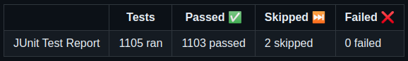
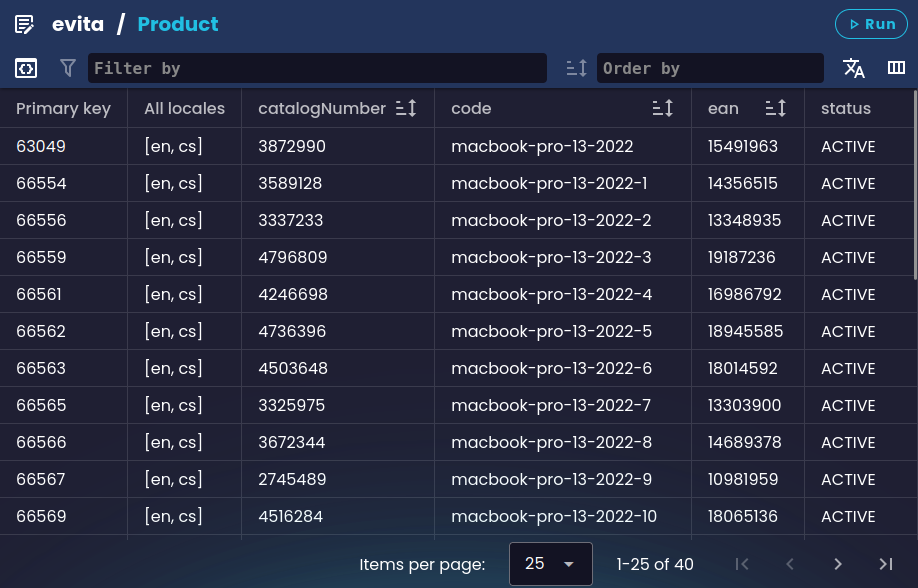

V roce 2023 se evitaDB posunula z výzkumného projektu na databázi připravenou pro produkční nasazení. Stále nás čeká spousta práce, ale jsme velmi hrdí na to, čeho jsme zatím dosáhli. Podporujeme 5 různých jazyků (Java, C#, GraphQL, REST, gRPC a evitaQL), všechny jazyky a klienti dosáhli plné funkční parity s Java klientem a jsou řádně zdokumentovány a pokryty sadou integračních testů.

## Otevření zdrojového kódu prostřednictvím bezplatné licence

Na začátku tohoto roku byl projekt vydán pod [licencí BSL 1.1](https://evitadb.io/documentation/use/license).
Ačkoliv se technicky nejedná o open source licenci, podmínky licence jsou velmi otevřené a umožňují jak komerční, tak nekomerční využití databáze, přístup ke zdrojovému kódu a jeho úpravy. Jediným omezením je, že nemůžete databázi vzít a prodávat ji třetím stranám jako svůj vlastní produkt. Licence se také automaticky po 4 letech převádí na plně open source licenci Apache 2.0.

## Dokumentační portál

Tento rok jsme také dokončili většinu našeho dokumentačního portálu a napsali většinu dokumentace – celý dotazovací jazyk je nyní zdokumentován se zvláštním zaměřením na odlišné chování dotazů v různých jazycích. Odhadujeme, že dokumentace má více než 250 stran obsahu a mohla by být samostatnou knihou. Na našem blogu je také série článků, které popisují překážky a rozhodnutí stojící za naším dokumentačním portálem:

1. [Building a Developer-friendly Documentation Portal with Next.js and MDX](https://evitadb.io/blog/05-building-documentation-portal)
2. [Discover the Advanced Features on our Developers Portal](https://evitadb.io/blog/07-advanced-features-on-developers-portal)

<Note type="info">

<NoteTitle toggles="true">

##### Uhádnete, kolik příkladů máme v naší dokumentaci?
</NoteTitle>

Je jich **přes 1100**! A stále přidáváme další. Každý příklad je automaticky přeložen do ostatních jazyků, takže jako vývojář stačí napsat příklad v jednom jazyce a ostatní jazyky se vygenerují za vás. Každý z těchto příkladů je také automaticky testován naší CI/CD pipeline proti našemu demo serveru alespoň jednou týdně a po každé změně v dokumentaci. Díky tomu máme jistotu, že příklady jsou vždy aktuální a funkční.

Pokud nám nevěříte, podívejte se na výsledky naší [dokumentační pipeline](https://github.com/FgForrest/evitaDB/actions/workflows/ci-dev-documentation.yml).

A dokonce jsme o tom napsali i na blog:

1. [Validating examples in documentation using JUnit 5 and JShell](https://evitadb.io/blog/06-document-examples-testing)
2. [Testable documentation](https://evitadb.io/blog/08-testable-documenation)

</Note>

## evitaLab

Na podzim jsme vydali naši webovou konzoli [evitaLab](https://evitadb.io/blog/09-our-new-web-client-evitalab), která vám umožňuje snadno prozkoumávat databázi a psát dotazy. Editory GraphQL a evitaQL podporují lintování, automatické doplňování a přístup k dokumentaci použitých omezení, a GraphQL klient je také kontextově citlivý, takže vám zabrání psát neplatné dotazy. Všechna data jsou dostupná také v gridovém zobrazení a lze je snadno rozkliknout přes reference na jiné entity. Veškeré informace o schématu a dokumentaci jsou dostupné přímo z webové konzole.

Na příští rok máme s evitaLab velké plány. Chceme přidat podporu pro editaci dat, abyste mohli evitaLab používat jako plnohodnotného databázového klienta. Pracujeme na dashboardu pro sledování provozu, který vám umožní sledovat metriky databáze, přistupovat k logům a analyzovat výkon vašich dotazů. Pokud se spolupráce s [Fakultou informačních technologií ČVUT v Praze](https://www.ciirc.cvut.cz/cs/) vydaří, možná přidáme i REST editor s podobnými funkcemi, jaké má nyní editor GraphQL. Bohužel zatím neexistuje [LSP podpora pro OpenAPI](https://github.com/OAI/OpenAPI-Specification/issues/1252), takže se snažíme tuto mezeru zaplnit.

Protože víme, jak obtížné je udržovat zpětně kompatibilní GraphQL / REST API, plánujeme přidat nové funkce, které vám umožní vizualizovat breaking changes v API, které jsou automaticky generovány ze schématu databáze, a integrovat tyto kontroly do vaší CI/CD pipeline.

## Dogfooding

Tento rok jsme integrovali evitaDB do naší vlastní platformy Edee.ONE a vytvořili zcela nový [Next.JS](https://nextjs.org/) storefront pro všechny naše budoucí projekty. Několik projektů bude spuštěno příští rok a velmi se na ně těšíme. Sbíráme cennou zpětnou vazbu od našich vlastních vývojářů a využíváme ji ke zlepšení databáze a vývojářského zážitku. Stále také spolupracujeme se studenty na [Univerzitě Hradec Králové](https://www.uhk.cz/en/faculty-of-informatics-and-management/about-faculty) a připravujeme alternativní demo implementace pomocí [Vue.js](https://vuejs.org/) a [.NET Blazor](https://dotnet.microsoft.com/en-us/apps/aspnet/web-apps/blazor).

Těšíme se na první provozní statistiky z našich produkčních nasazení a podělíme se o metriky a poznatky se všemi z vás. To vše nám umožní najít a opravit chyby a vylepšit databázi tak, abyste ji mohli s důvěrou používat ve svých vlastních projektech.

## evitaDB core

Na jádře databáze se tento rok udělalo jen velmi málo práce. Většina úsilí byla věnována vylepšování stávajících funkcí, opravám chyb a přidávání dalších a dalších testů. Stále nejsme spokojeni s pokrytím testy a pracujeme na jeho zlepšení, i když mnoho testů není v našem coverage reportu započítáno (například dlouhotrvající fuzzy testy a testy příkladů v dokumentaci).

<Note type="info">

<NoteTitle toggles="true">

##### Uhádnete, kolik automatizovaných testů spouštíme?
</NoteTitle>

Aktuálně běží více než [4,6 tisíce automatizovaných testů](https://github.com/FgForrest/evitaDB/actions/runs/7248057725/job/19743529706), které na našich vývojářských strojích se 6 CPU trvají asi minutu, ale brzy dosáhneme hranice 5 tisíc testů. Dalších 1,1 tisíce testů je v naší dokumentační sadě a další testy jsou součástí C# klienta.

</Note>

Dokončujeme náš transakční systém, jehož základy byly položeny minulý rok, zavádíme write-ahead log, který nám umožní zotavení po pádu, a implementujeme CDC (change data capture) schopnosti, pro které už máme funkční prototyp jak pro gRPC streaming, tak pro GraphQL / REST WebSocket implementaci. V Javě používáme [Java Flow API](https://docs.oracle.com/javase/9/docs/api/java/util/concurrent/Flow.html) a v C# používáme [rozhraní IObservable](https://learn.microsoft.com/en-us/dotnet/api/system.iobservable-1?view=net-8.0).

Transakce v evitaDB budou mít [úroveň izolace SNAPSHOT](https://en.wikipedia.org/wiki/Snapshot_isolation) a budou implementovány pomocí MVCC (Multi-Version Concurrency Control). Vy jako zákazník budete moci ovlivnit řešení konfliktů, což přímo ovlivňuje výkon zápisu do databáze. Plánujeme také umožnit vám ladit úroveň konzistence databáze, abyste si mohli zvolit správnou úroveň mezi eventual consistency a strong consistency pro váš scénář.

<Note type="info">

<NoteTitle toggles="true">

##### Jak velký je zdrojový kód databáze?
</NoteTitle>

Ručně psané jádro databáze má asi 18 tisíc řádků kódu, ale s vygenerovaným kódem pro gRPC, parser a testy je to 480 tisíc řádků kódu (podle [pluginu Statistics](https://plugins.jetbrains.com/plugin/4509-statistic) v IntelliJ IDEA).

</Note>

Plánujeme také příští rok vydat první stabilní verzi databáze a začít pracovat na první verzi distribuovaného nasazení databáze, které vám umožní škálovat databázi horizontálně a zlepšit její dostupnost. Plánované nasazení bude mít jeden master node a více read-only replik s automatickým failoverem. Replikace mezi nody bude stavět na CDC schopnostech, které může vaše aplikace také využít například pro invalidaci cache nebo aktualizaci živých pohledů na lokálně udržovaná data.

Kromě těchto plánů chceme implementovat řadu požadavků na nové funkce – například [integraci histogramů do facet summary](https://github.com/FgForrest/evitaDB/issues/8), [integraci hierarchického pohledu do facet summary](https://github.com/FgForrest/evitaDB/issues/352), [zavedení obousměrných referencí](https://github.com/FgForrest/evitaDB/issues/260), [integraci fulltextového vyhledávání](https://github.com/FgForrest/evitaDB/issues/258) nebo [schopnosti seskupování](https://github.com/FgForrest/evitaDB/issues/17).

Stručně řečeno, příští rok nás čeká spousta práce a těšíme se na ni. Těšíme se také na vaši zpětnou vazbu a návrhy. Pokud nějaké máte, dejte nám vědět přes [GitHub issues](https://github.com/FgForrest/evitaDB/issues/) nebo náš [Discord server](https://discord.gg/VsNBWxgmSw). **Pojďme společně vytvořit ty nejlepší e-shopy a aplikace!**

Veselé Vánoce a šťastný nový rok přeje tým evitaDB!

<Table>
    <Thead>
        <Tr>
            <Th>Honza Novotný</Th>
            <Th>Lukáš Hornych</Th>
            <Th>Tomáš Pozler</Th>
            <Th>Miroslav Alt</Th>
        </Tr>
    </Thead>
    <Tbody>
        <Tr>
            <Td></Td>
            <Td></Td>
            <Td></Td>
            <Td></Td>
        </Tr>
    </Tbody>
</Table>