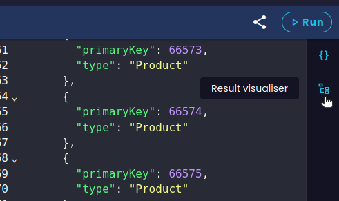
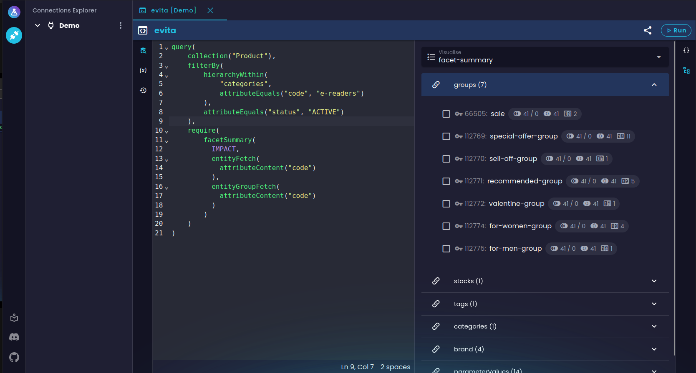
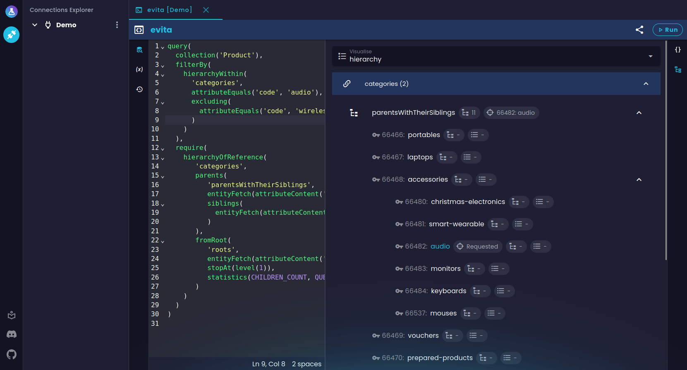
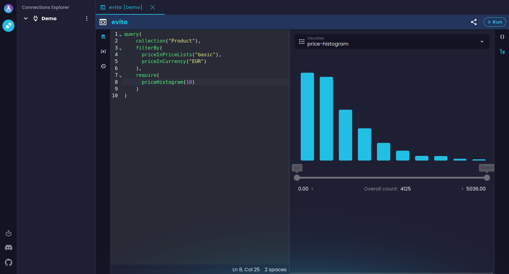
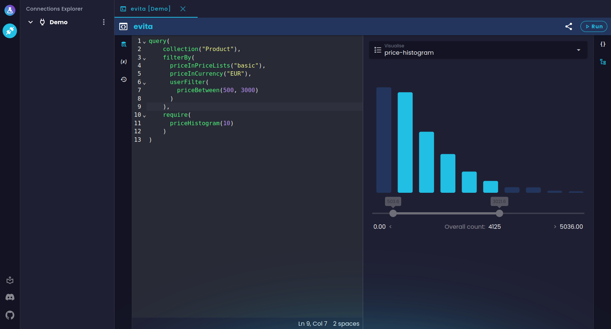
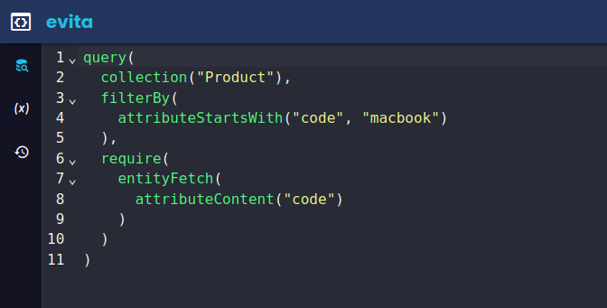
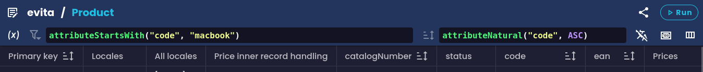
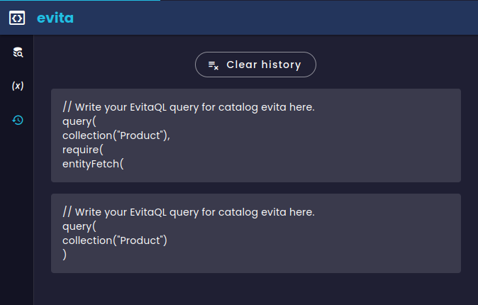
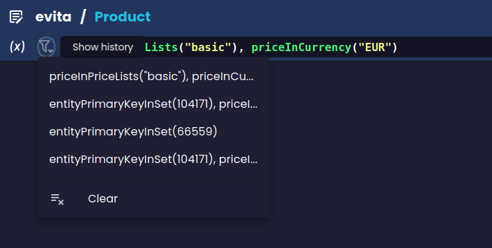

V [jednom z našich předchozích blogových příspěvků](https://evitadb.io/blog/09-our-new-web-client-evitalab) jsme se věnovali prvnímu vydání evitaLab. Od té doby běží evitaLab interně na všech našich nových e-commerce aplikacích využívajících novou databázi evitaDB a naši vývojáři si jej zatím velmi oblíbili. Původní skromná myšlenka, která stála za vznikem evitaLab – pomoci vývojářům občas ladit jejich data v evitaDB – se stala natolik klíčovou součástí workflow našich nově vyvíjených e-commerce aplikací, že si naši vývojáři už nedokážou představit práci bez něj.

## Náš workflow používání

Abychom z evitaLab vytěžili maximum, automaticky jej nasazujeme do všech našich testovacích a vývojových prostředí pro všechny aplikace běžící na evitaDB. Je to poměrně snadné, protože využíváme toho, že evitaLab je již zabudován v serveru evitaDB běžícím v požadovaných prostředích. Díky tomu můžeme evitaLab snadno předkonfigurovat tak, aby obsahoval připojení ke konkrétnímu prostředí, a nasadit jej tam.

Naši vývojáři tak mohou snadno přistupovat do evitaLab ze stejné URL jako samotná aplikace (jen na jiném portu) a jedním kliknutím se dostat ke svým datům. evitaLab využívají jak naši backend, tak frontend vývojáři. Backend Java vývojáři jej primárně používají k ladění publikovaných dat z naší hlavní databáze pomocí entity gridu. Také využívají evitaQL konzoli k ladění svých Java dotazů. Frontend vývojáři naopak primárně ladí své GraphQL dotazy pomocí GraphQL konzole.

Samozřejmě, toto je jen stručný nástin toho, jak aktuálně evitaLab využíváme, ale může vám to dát představu, jak jej můžete začlenit do svého workflow.

## Nové funkce a opravy chyb

Od [prvního vydání](https://evitadb.io/blog/09-our-new-web-client-evitalab) jsme usilovně pracovali na opravě existujících chyb a přidání plánovaných funkcí, které naši vývojáři potřebovali (a možná jste je potřebovali i vy), ale do prvního vydání se nevešly.

### Entity grid

Entity grid (dříve označovaná jako data grid) zůstává jako celek téměř stejná, pouze ji rozšiřujeme o nové funkce a vylepšujeme. Jak se ukazuje, je to opravdu užitečný nástroj pro ladění dat, protože je velmi rychlé najít požadovaná data. Největšími novinkami v entity gridu jsou:

#### Reference attributes

Výběr vlastností nyní umožňuje načítat nejen entity reference, ale také [atributy na těchto referencích](https://evitadb.io/documentation/use/schema?lang=evitaql#reference) (tj. na relaci mezi zdrojovou a cílovou entitou, nikoliv na samotné cílové entitě).

Atributy se pak zobrazují v dalších sloupcích vedle samotných referencí. Každá buňka pak obsahuje atributy pro každou referenci v jednom poli. Není to ideální řešení, ale v takto zploštělé struktuře, jako je tabulka, není moc prostoru.

Můžete však použít stávající detailní náhled kliknutím na buňku a snadno si zobrazit každý atribut pro každou referenci v plném detailu.

<Note type="info">

Podívejte se na příklad v našem [demo evitaLab](https://demo.evitadb.io/lab?sharedTab=N4IgLghgRgKgngBwKYgFwgCYUgWgOYBOAlhiADTjQAKEBEAtgM5qgDGA9gHadKthFcAkqXQYk9duRCtsEADbs8AOQYp0SAG5FIUpJ35g48ZGhBUC7DAFc+IAL4VIUACKyWIAI5WkBOABkITjwrCDw1EE1tCA85KQAzIjkwHwAhOFMpdgIxAjSMigwiRgQ5CDgkDHN2ZAJ+JGZUAG0QBGJ6WjgAaSR0imwwYigrZMZUDjEpAiQ4nz1WerHsJDwsonrJ6dnOeYBBMAGiIZHF5JXiBaycwU4AYSWz9IBdCgRQpABlIgAvNQAmAFYXm8lFZ6FAfGgAIx2OxAA).

</Note>

#### Ceny

Ceny jsou složité na vizualizaci, protože jich může být mnoho a existuje také cena pro prodej. Naštěstí si nyní můžete všechny ceny v entity gridu jednoduše zobrazit jejich výběrem ve výběru vlastností.

Ve výchozím nastavení buňky s cenami zobrazují počet všech cen v každé entitě.
Pokud [spustíte filtrující dotaz](https://evitadb.io/documentation/query/filtering/price?lang=evitaql#quick-guide-to-filtering-by-price) pro výpočet ceny pro prodej, každá buňka automaticky zobrazí cenu pro prodej pro rychlý náhled.

Nejdůležitější funkce se však skrývá v detailu buňky. Pokud kliknete na libovolnou buňku s cenami, uvidíte v detailním okně 3 sekce: základní vlastnosti ceny entity, vypočtenou cenu pro prodej a nejdůležitější – seznam všech cen entity.

Sekce ceny pro prodej jednoduše vizualizuje objekt ceny z evitaDB.

Seznam cen vám naopak umožňuje nejen vidět všechny ceny, ale také je filtrovat podobně, jako byste to dělali pomocí evitaQL nebo GraphQL dotazů. Můžete filtrovat ceny podle cenových seznamů, stejně jako pomocí [priceInPriceLists](https://evitadb.io/documentation/query/filtering/price#price-in-price-lists) podmínky (dokonce i pořadí výběru je důležité, protože určuje prioritu cenových seznamů). Můžete také filtrovat podle měny, stejně jako pomocí [priceInCurrency](https://evitadb.io/documentation/query/filtering/price#price-in-currency), a navíc můžete filtrovat i podle ID ceny a vnitřního ID záznamu (což aktuálně samotné evitaQL ani GraphQL neumí). Pokud ve filtru určíte cenové seznamy a měnu, evitaLab automaticky vypočítá cenu pro prodej pro váš filtr a zobrazí náhled vypočtené ceny pro prodej jako první v seznamu.

<Note type="info">

Podívejte se na příklad v našem [demo evitaLab](https://demo.evitadb.io/lab?sharedTab=N4IgLghgRgKgngBwKYgFwgCYUgWgOYBOAlhiADTjQAKEBEAtgM5qgDGA9gHadKthFcAkqXQYk9duRCtsEADbs8AOQYp0SAG5FIUpJ35g48ZGhBUC7DAFc+IAL4VIUACKyWIAI5WkBOABkITjwrCDw1EE1tCA85KQAzIjkwHwAhOFMEYlYkQU5zImy-IkYwRgAKAB0QKAhGAqqASjIAAkyCnM4AYSsCAj1WOEqQAFEAVQAlRql2AjECNNMpDGKEOQg4JAxzdmQCfiRmVABtEDb6WjgAaSR0imwwYigrZMZUDjEpNuzmAF0KBFCSAAykQAF5qABMAFZ-oClFZ6FAfGgAIx2OxAA).

</Note>

To vám umožní snadno ladit vaše ceny a priority cenových seznamů bez nutnosti přepisovat dotazy.

### Vizualizace dat

Velkou novinkou je vizualizace dat v evitaQL a GraphQL konzolích. To je obzvlášť užitečné pro nováčky, kteří se snaží zorientovat v rozsáhlých JSON dokumentech s extra výsledky.

Stále nám chybí vizualizace pro entity a telemetrii dotazů, ale v tuto chvíli to nepovažujeme za nejdůležitější. Důvodem je, že entity nemají tak složité a rozsáhlé JSON objekty jako extra výsledky a jsou poměrně přímočaré. Také kvůli grafovému načítání referencovaných entit může být jejich správná vizualizace složitá, takže stále hledáme vhodné řešení. Co se týče telemetrie dotazů, ta je sice bez vizualizace těžko čitelná, ale aktuálně to není nejpoužívanější funkce evitaDB.

Vizualizace jsou dostupné po provedení dotazu v alternativním panelu k surovému JSON výstupu. Mezi těmito panely můžete přepínat v navigační liště na pravé straně konzole.

Zde uvidíte komponentu pro výběr dotazu k vizualizaci (v případě GraphQL) a komponentu pro výběr části dotazu k vizualizaci.

#### Facet summary

Jedním z podporovaných extra výsledků ve vizualizéru je [facet summary](https://evitadb.io/documentation/query/requirements/facet).
Pokud provedete evitaQL nebo GraphQL dotaz s [facetSummary](https://evitadb.io/documentation/query/requirements/facet#facet-summary) nebo [facetSummaryOfReference](https://evitadb.io/documentation/query/requirements/facet#facet-summary-of-reference) podmínkou, bude vizualizace facet summary dostupná v panelu vizualizace.

<Note type="warning">

<NoteTitle toggles="false">

##### GraphQL aliasy polí a vizualizér
</NoteTitle>

Všimněte si, že GraphQL dotazy podporují aliasy polí, které efektivně mění výstupní JSON. S tímto aktuálně vizualizér neumí pracovat. Prozatím tedy nemůžete používat aliasy v podstromu facet summary, jinak jej vizualizér nenajde. Plánujeme podporu aliasů, ale vyžaduje to analýzu vstupního dotazu, což je složitější a časově náročnější, než jsme ochotni nyní investovat.

</Note>

Po provedení dotazu nejprve uvidíte seznam všech faceted referencí podle použité podmínky require. Každá položka obsahuje několik užitečných čísel, o kterých se více dozvíte v naší [dokumentaci](https://evitadb.io/documentation/query/requirements/facet#evitalab-visualization). Pokud jsou vaše faceted reference seskupené, uvidíte skutečné skupiny na druhé úrovni seznamu a jednotlivé facety na další úrovni. Pokud pro konkrétní referenci nejsou skupiny, facety jsou uvedeny přímo pod referencí.

<Note type="info">

Podívejte se na příklad v našem [demo evitaLab](https://demo.evitadb.io/lab?sharedTab=N4IgLghgRgKgngBwKYgFwiQNwJaQI4A2AtAMYD2AdgM5kEoA040AChAE4QC2Vao5FFJCTDZKASQAmaEBKScyIRiQiQCZAOYA5LinRZcEEAF9GkKABEVh1KDwBXJGzjT7juAAoAOhQAEfn+QEdMKiFF4gzGxkEnbCniAAlPTe-j4AZtgEYI4AQh4pqf4AFtiO7CRFcADquCVhBYWF8crZ6mRspVTxyb6NhSpgHVB22QCi9hAEVOHkst0+8UhEbEgQsmxdiQ2FSdupA0MjSON2k9PxVJBgdpv0CyAAggDCMGIAaqPxCdu7vX4r9mwKy8f0KaQgJCQYAAynZOJx2PlQY0xABZZjPGA9Pr+JAUERgOAAMShFRBOP2YEG2GG2SelGy+Jm0SQXz2O2xFLxBLgAHEonYECSwGT2Y0DjSjvT8dzmXMtsidmKfN9QaqEooQJh2NhoHQeOhgAVvEZjEYgA).

</Note>

#### Hierarchie

Druhou důležitou funkcí evitaDB je výpočet [hierarchických stromů](https://evitadb.io/documentation/query/requirements/hierarchy) pro menu a navigaci. I pro to existuje vizualizace.
Pokud použijete [hierarchyOfSelf](https://evitadb.io/documentation/query/requirements/hierarchy#hierarchy-of-self) nebo [hierarchyOfReference](https://evitadb.io/documentation/query/requirements/hierarchy#hierarchy-of-reference) podmínku require, bude vizualizace hierarchického stromu dostupná v panelu vizualizace.

<Note type="info">

<NoteTitle toggles="false">

##### Hierarchické aliasy polí a vizualizér
</NoteTitle>

V případě vizualizace hierarchie existuje malá výjimka z omezení aliasů polí pro GraphQL. Můžete použít aliasy polí pro pojmenování svých hierarchií a vizualizér je správně zobrazí s vaším názvem.

</Note>

Jak vidíte, získáte pohled podobný vizualizaci facet summary. Můžete procházet jednotlivé hierarchie a přímo vidět, jak váš dotaz ovlivňuje bohatost každého hierarchického stromu.

<Note type="info">

Podívejte se na příklad v našem [demo evitaLab](https://demo.evitadb.io/lab?sharedTab=N4IgLghgRgKgngBwKYgFwiQNwJaQI4A2AtAMYD2AdgM5kEoA040AChAE4QC2Vao5FFJCTDZKASQAmaEBKScyIRiQiQCZAOYA5LinRZcEEAF9GkKABEVh1KDwBXJGzjT7juAAoAOhQAEP8gR0wqIU7gDkzGxkEnbCYQCU9N5+AGbYBGCOAEIeyX4+ABbYjuwkBXAA6rhFoXn5PmHKmepkbMVUYUm+9T4qYG1QdpkAovYQBFTh5LKdDRB2EqIJXT0+SAAeJAQL2BTqXt2rfQNDSKN245ON0UizYQDu2GxIdFRURAVIEBIIBZRIHXidXyQMOPlBfkSeWe9ieSAO9SKJTYZTgAHkUgAlJApRxICgkeHA-KNFRIFptAGdYl+BDsfFgSY0+phOnPCiMqpgAowT5PADK2CgBF26g6K1W+QZuDgADEkGAyu5jkLTgBhSiZDlTG4JKFg1ZUIUivZMg2S6VgOUKpUqwaZDUchk6mbxCGSyHM-WSlJRTiYshkMAIj0NKJB8WhnzMqUcmXyxUFZVgfqqh2a53XV3e0NUMBkBAAQWDdEwL3cAEY3RKPXmVNg89gSJM1QAJMQAGXMmOGmgA+mq0QBVTQweg+ACKQ+GmLEw3Mfd7MDEMAAmgPh6P3T1t+C8qDQYoQJh2NhoK9pMA8t4jMYjEA).

</Note>

#### Histogramy

Poslední aktuálně podporovanou vizualizací extra výsledků jsou histogramy, a to jak cenové, tak atributové.
[Histogramy](https://evitadb.io/documentation/query/requirements/histogram) umožňují pěkně vizualizovat velkou kardinální hodnotu v omezeném prostoru. Samotný JSON vrácený pro vizualizaci histogramů ve vaší aplikaci není tak složitý jako ostatní extra výsledky. Je však mnohem těžší si jej představit v hlavě.
Pokud použijete [attributeHistogram](https://evitadb.io/documentation/query/requirements/histogram#attribute-histogram) nebo [priceHistogram](https://evitadb.io/documentation/query/requirements/histogram#price-histogram) podmínku require v dotazu, bude vizualizace histogramu dostupná v panelu vizualizace.

<Note type="info">

Podívejte se na příklad v našem [demo evitaLab](https://demo.evitadb.io/lab?sharedTab=N4IgLghgRgKgngBwKYgFwiQNwJaQI4A2AtAMYD2AdgM5kEoA040AChAE4QC2Vao5FFJCTDZKASQAmaEBKScyIRiQiQCZAOYA5LinRZcEEAF9GkKABEVh1KDwBXJGzjT7juAAoAOhQAEfn+QEdMKiFF4gzGxkEnbCniAAlPTe-j4AZtgEYI4AQh4pqT4IbNgkSGIUkaVIADLYVGBU4VAQVKXxSQWpxdUVAMJ2bGxIFCT5IACiAKoASh1dPp2+-sP22MNey90lZQAS9WAaHJzuAIwADAkLVxQJiiCY7NjQdDzowAXeRsZGQA).

</Note>

Uvidíte skutečný histogram i další informace pro každý bucket. Pokud pak rozšíříte svůj dotaz o [userFilter](https://evitadb.io/documentation/query/filtering/behavioral#user-filter), který obsahuje buď [attributeBetween](https://evitadb.io/documentation/query/filtering/comparable#attribute-between) nebo [priceBetween](https://evitadb.io/documentation/query/filtering/price#price-between) pro simulaci výběru uživatele, vizualizace to zohlední a zobrazí i zúžený pohled.

<Note type="info">

Podívejte se na příklad v našem [demo evitaLab](https://demo.evitadb.io/lab?sharedTab=N4IgLghgRgKgngBwKYgFwiQNwJaQI4A2AtAMYD2AdgM5kEoA040AChAE4QC2Vao5FFJCTDZKASQAmaEBKScyIRiQiQCZAOYA5LinRZcEEAF9GkKABEVh1KDwBXJGzjT7juAAoAOhQAEfn+QEdMKiFF4gzGxkEnbCniAAlPTe-j4AZtgEYI4AQh4pqT4IbNgkSGIUkaVIADLYVGBU4VAQVKXxSQWpxdUVAMJ2bGxIFCT5IACiAKoASh3JvoV2VI4AYpnZbF6LhUUlZTlIYADuSCPuAKwADFf0PgDMN1cJXf4vOz6dH8P22MPbux6ZQAEvUwBoOJx3ABGZ6vd4JRQgTDsbDQOg8dDAAreIzGIxAA).

</Note>

Uvidíte skutečný histogram i další informace pro každý bucket. Pokud pak rozšíříte svůj dotaz o [userFilter](https://evitadb.io/documentation/query/filtering/behavioral#user-filter), který obsahuje buď [attributeBetween](https://evitadb.io/documentation/query/filtering/comparable#attribute-between) nebo [priceBetween](https://evitadb.io/documentation/query/filtering/price#price-between) pro simulaci výběru uživatele, vizualizace to zohlední a zobrazí i zúžený pohled.

### Podpora jazyka evitaQL

Pro GraphQL konzoli jsme použili [existující knihovnu](https://github.com/graphql/graphiql/tree/main/packages/cm6-graphql#readme) pro automatické doplňování a lintování. Protože je však evitaQL naším vlastním jazykem, neexistuje pro něj podpora v editoru [CodeMirror](https://codemirror.net/), který používáme. Proto jsme investovali čas do vývoje alespoň minimální [podpory jazyka](https://www.npmjs.com/package/@lukashornych/codemirror-lang-evitaql) pro editor CodeMirror, aby nebylo psaní evitaQL dotazů v evitaLab tak bolestivé. Aktuálně máme alespoň základní automatické doplňování všech dostupných podmínek se základní dokumentací (zatím bez podporovaných parametrů).

<Note type="info">

Podívejte se na příklad entity gridu [zde](https://demo.evitadb.io/lab?sharedTab=N4IgLghgRgKgngBwKYgFwgCYUgWgOYBOAlhiADTjQAKEBEAtgM5qgDGA9gHadKthFcAkqXQYk9duRCtsEADbs8AOQYp0SAG5FIUpJ35g48ZGhBUC7DAFc+IAL4VIUACKyWIAI5WkBOABkITjwrCDw1EE1tCA85KQAzIjkwHwAhOFNsMGIoK2SAZUgCMEYAdW0ACwAKAB1pSyRasgACWvoIVih2dgBrWoBKKXYCMQI0jLAsohzklTArOjkaurFGpoBBPIBhAYoMIkYEOQg4JAxzdmQioiRmVABtEARiNt8AaSR0igUZORupeTkfnYPz+FCeRFYSEE3B8ACVeEMMAAJQIYOREIL-CbZXI3VAySAKZRWehQHxYybTPGMSBzZgUTI45KMfH1ClMvFIQJScGQ5gAXTBoSQeSIAC81AAmACsQrCShJZIIaAAjHY7EA) a evitaQL konzole [zde](https://demo.evitadb.io/lab?sharedTab=N4IgLghgRgKgngBwKYgFwiQNwJaQI4A2AtAMYD2AdgM5kEoA040AChAE4QC2Vao5FFJCTDZKASQAmaEBKScyIRiQiQCZAOYA5LinRZcEEAF9GkKABEVh1KDwBXJGzjT7juAAoAOhQAEP8gR0wqIUXiDMbGQSdsKeIACU9N5+AGbYBGCOAEIeyX4+KmBs2FB2mQDKkGxgVADquAAWYeSycfQ+cZwQJFBkZADWcfF5iXlsSPbY416++UgUImBwAGJIYCRNefkFYEUlZUgAwpSZC81RSENbPsOzt-GKIJjs2NB0POjAed5GxkZAA).

</Note>

K dispozici je také velmi jednoduchý linter pro kontrolu věcí jako chybějící čárky nebo struktura kořene dotazu a další drobnosti jako zvýraznění syntaxe, skládání nebo automatické odsazení. I tato základní podpora je při psaní dotazů neocenitelná. Samozřejmě plánujeme podporu dále rozšiřovat, ale bohužel je to časově náročné.

### Sdílení záložek mezi prohlížeči

Sdílení záložek mezi vývojáři je něco, na co jsme velmi nadšení. Často naši frontend a backend vývojáři sdílejí své dotazy prostřednictvím chatovacích aplikací tím, že kopírují a vkládají celé dotazy do chatu, jen aby ladili některé části dotazů. To vede k zahlceným konverzacím a komunikačním chybám, když stejní vývojáři pracují na více projektech s různými instancemi evitaDB serveru. Proto doufáme, že tato funkce výrazně zlepší komunikaci mezi vývojáři a ušetří jim čas i nervy.

Jakoukoliv záložku s aktuálními daty můžete snadno sdílet tak, že pošlete odkaz druhému vývojáři. Odkaz cílí na stejnou instanci evitaLab jako vaše a vaše data s nastaveným připojením k evitaDB, výběrem katalogu atd. Příjemce se už nemusí starat o výběr správného serveru, připojení apod. Vše je zabudováno v odkazu.

<Note type="info">

Jak vidíte, tuto funkci jsme použili i v tomto článku, abychom vám ukázali vlastní příklady, které nejsou v naší dokumentaci. Můžete tuto funkci využít podobně např. ve své vlastní dokumentaci, například odkazem na svou demo instanci pro ukázku svých doménově specifických dotazů.

</Note>

Podívejte se na celý workflow v našem krátkém ukázkovém videu:

### Ukládání poslední relace

Pokud jde o obnovení vašeho pracovního prostoru po nějaké době, absence nedávno otevřených záložek a provedených dotazů může být dost nepříjemná. Zvláště pokud máte rozsáhlé dotazy, které si nepamatujete. S novým evitaLab už se tím nemusíte trápit. Stačí zavřít nebo obnovit záložku či prohlížeč a evitaLab vám obnoví všechny záložky z poslední relace.

    <video width="850" height="478" controls="controls">
      <source src="https://evitadb.io/download/blog-12-storing-session.mp4" type="video/mp4"/>
        Váš prohlížeč nepodporuje video tag.
    </video>

Existují však dvě výjimky, kdy se toto neprovádí, a to z dobrého důvodu.

První výjimka je, když otevřete sdílený odkaz, který míří na stejný evitaLab. Důvodem je, že odkaz se vždy otevře v nové záložce prohlížeče, i když už máte stejnou instanci evitaLab otevřenou, a když takový odkaz otevřete (například pro rychlý náhled), nechcete, aby se vám obnovila celá relace (v poslední relaci může být třeba 10 záložek). Dalším důvodem je, že byste mohli omylem zavřít svou hlavní relaci před touto novou a přepsat ji daty ze sdílené záložky. Nebo byste mohli otevřít více odkazů se sdílenými záložkami a opět byste pravděpodobně nechtěli obnovovat relaci pro každý odkaz.

Druhou výjimkou je otevření příkladu dotazu z naší dokumentace. Důvod je stejný jako u odkazu na sdílené záložky.

### Historie dotazů

Podobně užitečná jako přenos relace je historie dotazů s možností procházet dříve provedené dotazy. Historii dotazů jsme implementovali ve všech záložkách, které podporují dotazy, tedy v evitaQL konzoli, GraphQL konzoli a entity gridu.

Obě konzole mají samostatný panel pro přepínání dotazů i s proměnnými najednou.

Každá kombinace připojení + katalog má svůj vlastní seznam záznamů historie, aby nedocházelo k míchání různých dat.

Entity grid má oddělené historie pro filtr i řazení dotazu. Historii pro každý vstup lze otevřít pomocí předcházející ikony nebo pomocí Alt+↓ (nebo Option+↓ na Macu).

Podobně jako konzole má každá kombinace připojení + katalog + kolekce + filtr/řazení svůj vlastní seznam záznamů historie, aby nedocházelo k míchání různých dat.

### Další drobné funkce a opravy chyb

* přešli jsme z verzování podle semver na kalendářní verzování
* editor kódu má stavový řádek s informací o řádku, sloupci a pozici kurzoru
* opravili jsme příliš dlouhé hodnoty buněk v entity gridu, které zabíraly celou obrazovku
* entity grid nyní zobrazuje vybranou datovou lokalizaci v hlavičce
* nová klávesová zkratka Ctrl+F pro zaměření vyhledávacího pole ve výběru vlastností entity gridu
* nové typy unikátnosti atributů v evitaDB jsou zobrazeny detailně ve znacích atributů
* příznak filterable u atributu má nyní poznámku, pokud je filtrování implicitní pro unikátní atributy
* nově jsou tooltipy pro připojení, katalogy a kolekce v průzkumníku
* a další vylepšení a opravy UI

Cestou jsme opravili ještě mnoho dalších drobných chyb, ale toto jsou ty nejdůležitější.

## Plánované funkce v blízké budoucnosti

Stále máme v hlavě spoustu nápadů, ale nemůžeme dělat vše najednou. Aktuálně plánujeme otevřít tyto issue:

- [informační obrazovka o stavu evitaDB serverů](https://github.com/FgForrest/evitalab/issues/103)
- [obrazovka s klávesovými zkratkami](https://github.com/FgForrest/evitalab/issues/110)
- [rychlý přístup k akcím položek v průzkumníku](https://github.com/FgForrest/evitalab/issues/98)
- [time machine pro nové připravované funkce verzování katalogu v evitaDB](https://github.com/FgForrest/evitalab/issues/95)

A [mnoho dalších](https://github.com/FgForrest/evitalab/issues).

## Přispění

Stejně jako minule, pokud si věříte, neváhejte nahlásit chybu nebo poslat PR na náš [GitHub](https://github.com/FgForrest/evitalab) s jakýmikoli vylepšeními. Každý podnět velmi oceníme, i drobnosti jako oprava překlepů nebo psaní nových testů.