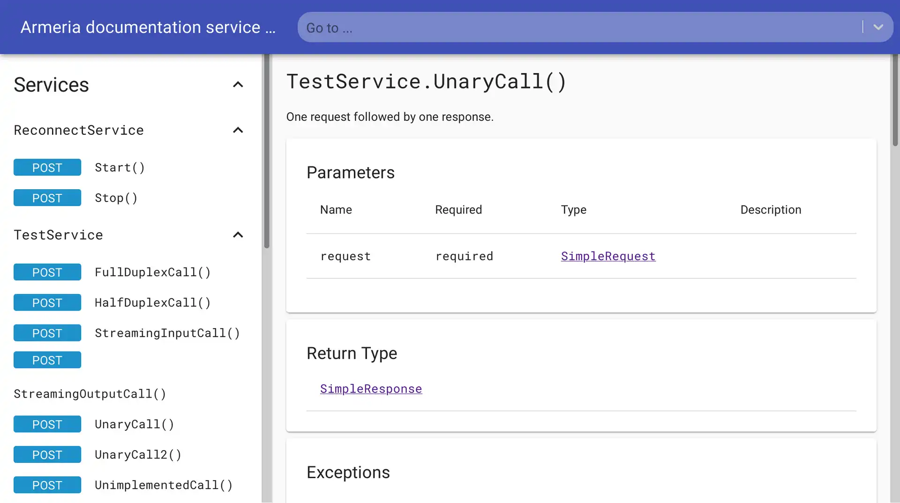
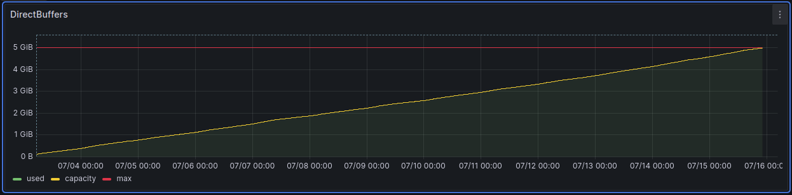

[Armeria server](https://armeria.dev/) je Java framework pro mikroslužby postavený na Netty, vyvíjený členy Netty týmu v Jižní Koreji a Japonsku. Komplexní Netty server API obaluje do mnohem jednoduššího rozhraní a zároveň řeší některé poměrně složité problémy, o kterých si povíme v tomto článku. Framework Armeria cílí na podobnou oblast jako frameworky [Quarkus](https://quarkus.io/) nebo [Micronaut](https://micronaut.io/), ale stále jej lze jednoduše použít jako nízkoúrovňový asynchronní server bez jakékoliv „anotační magie“, což jsme potřebovali.

## Proč Armeria?

Nejprve jsme hledali řešení, jak zpřístupnit gRPC webovým klientům. gRPC je binární protokol nad HTTP/2, který nelze přímo konzumovat z bohatých JavaScriptových aplikací (například z prohlížeče). Vyžaduje speciální gRPC web proxy, která převádí gRPC volání do JSON formátu mezi klientem a serverem. Díky takové proxy jsme se mohli vyhnout vytváření nové vrstvy pro naše nástroje [evitaLab](12-evitalab-after-6-months.md) a mohli jsme implementovat všechny potřebné služby v gRPC protokolu, což výrazně rozšiřuje možnosti Java klienta i dalších klientů do budoucna.

Za druhé jsme chtěli mít jeden server pro všechny naše API. Máme REST API, gRPC API a GraphQL API. Jeden server ušetří spoustu prostředků, protože všechny thread pooly, sockety, buffery atd. mohou být sdíleny mezi všemi API. Také nám to umožní používat jeden port pro všechny služby, pokud bychom chtěli, což v našem současném nastavení není možné.

V neposlední řadě jsme chtěli server, který se snadno používá, má dobrý výkon a je aktivně vyvíjen. Asynchronní reaktivní Netty server je dobrou volbou, která slibuje dostatečný výkon, a tým Armeria je velmi aktivní a nápomocný na jejich [Discord](https://armeria.dev/s/discord) kanálu. Taková podpora dnes není příliš běžná.

## Co máme s Armeria

Migrací na Armeria můžeme nyní poskytovat všechna naše API a služby na jednom portu, což je obrovské zjednodušení. Samozřejmě to můžeme změnit v konfiguraci a spustit každé API na samostatném portu, ale nyní máme úplnou svobodu v rozložení portů.

Tato skutečnost také vyžaduje možnost provozovat jak TLS, tak non-TLS provoz na stejném portu, což dříve nebylo možné. Armeria to zvládá přímo „z krabice“ a dokáže nám také automaticky generovat self-signed certifikáty. Naše výchozí rozložení API nyní vypadá takto:

- `https://server:5555/rest/**` - REST API, pouze TLS
- `https://server:5555/gql/**` - GraphQL API, pouze TLS
- `https://server:5555/**` - gRPC API, pouze TLS
- `http://server:5555/system/**` - systémové API, pouze non-TLS
- `http://server:5555/observability/**` - observability API, pouze non-TLS

Každé API můžeme také přepnout do *relaxed* režimu, který bude fungovat jak na TLS, tak non-TLS provozu na stejném portu a cestě, podle toho, co požaduje klient. To je neocenitelné pro testování a vývoj, i když použití *relaxed* režimu v produkci nedoporučujeme.

Dalším velkým vylepšením je naše gRPC API. Stávající gRPC API lze nyní konzumovat přímo z webových prohlížečů díky gRPC web proxy zabudované v Armeria. Armeria také poskytuje „automatizovanou“ dokumentaci a testovací nástroje pro gRPC API, což je velmi užitečné pro vývoj a testování. Zvažujeme integraci této služby přímo do našeho evitaLab, abychom měli všechny testovací nástroje pro všechna naše API na jednom místě.



Také jsme přepsali našeho Java klienta, aby používal klienta Armeria místo původního Java gRPC klienta. Jeho API je mnohem jednodušší a výkonnější než původní. Těšíme se, až objevíme všechny možnosti, které nabízí, protože jsme zatím jen na povrchu.

## Past asynchronního zpracování požadavků

Migrace na Armeria nebyla bez problémů. Když implementujete [HttpService](https://github.com/line/armeria/blob/main/core/src/main/java/com/linecorp/armeria/server/HttpService.java), metoda serve je spouštěna uvnitř event loop vlákna. I parsování těla požadavku probíhá asynchronně, takže v metodě serve nemůžete jednoduše blokovat a čekat na tělo požadavku. To byla zásadní změna oproti logice, kterou jsme původně implementovali pro Undertow, ale [tým Armeria nám pomohl](https://discord.com/channels/1087271586832318494/1087272728177942629/1253656914106253374).

Klíčem k řešení tohoto problému je použití `HttpResponse.of(CompletableFuture<> lambda)`, což vám umožní odložit zpracování požadavku na okamžik, kdy je tělo požadavku dostupné, a navázat zpracování neblokujícím způsobem.

Podobná past na nás čekala v implementaci gRPC protokolu. Na rozdíl od standardní gRPC implementace, na kterou jste zvyklí ze standardního Java gRPC serveru, musíte předat zpracování metod do samostatného thread poolu. Bohužel to není uvedeno v dostupné dokumentaci a musíte jít do [Armeria gRPC příkladů](https://github.com/line/armeria-examples/blob/414fe5aedd0cba7a3e24c57437a622e7a8d76fed/grpc/src/main/java/example/armeria/grpc/HelloServiceImpl.java#L53-L59), kde to lze vyčíst z jednoho z příkladů.

Dokumentace Armeria na webu je [velmi stručná](https://armeria.dev/docs) a doporučujeme projít si příklady v [Armeria GitHub repozitáři](https://github.com/line/armeria-examples/), kde se dozvíte více detailů.

## Dynamické routování

Dalším problémem, který jsme museli vyřešit, bylo dynamické routování. Máme mnoho endpointů, které nejsou známy v době kompilace, ale jsou dynamicky nastavovány za běhu podle schémat databáze. Předpokládáme, že by to šlo řešit metodou [Server#reconfigure](https://github.com/line/armeria/blob/main/core/src/main/java/com/linecorp/armeria/server/Server.java), ale v první verzi jsme portovali implementaci Undertow PathHandler a použili naši stávající logiku pro dynamické routování v Armeria. Nebylo to ideální, ale fungovalo to. Existuje [otevřený issue](https://github.com/line/armeria/issues/5758), který by nám mohl v budoucnu pomoci zbavit se zbytků staré implementace.

## Jigsaw je stále problém v roce 2024

evitaDB je kompletně modularizovaná pomocí Java 9 modulů. Tato skutečnost nám však od začátku komplikuje život. Armeria nebyla modularizována a na naši žádost implementovala [automatické moduly](https://medium.com/technowriter/heres-a-cool-java-9-feature-automatic-module-name-2746641ebb7). Ačkoliv to funguje dobře s kompilátorem Javac a Mavenem, IntelliJ IDEA, kterou používáme pro vývoj, má stále [některé chyby](https://youtrack.jetbrains.com/issue/IDEA-353903) v implementaci Java 9 modulů a odmítala projekt zkompilovat. Naštěstí jsme našli řešení a pomohli si ručním vyloučením souborů `module-info.java` z kompilace. Doufejme, že IDEA tyto chyby brzy opraví.

Je smutné, že Jigsaw je stále problémem v knihovnách a nástrojích v roce 2024 – více než 7 let po jeho vydání.

## Shrnutí

Ačkoliv migrace přináší některé nekompatibilní změny v konfiguraci serveru, věříme, že Armeria má skvělou budoucnost a je tou správnou volbou pro evitaDB a její vývoj. Nová verze je již sloučena do větve `dev` a bude vydána jako verze `2024.10` příští měsíc.

Také jsme provedli kolo [výkonnostních testů](https://jmh.morethan.io/?gists=12e66215ecb97d9517c9c1307155691d,fe5d763616a5ef11be471d771a8d6d0b&topBar=Armeria%20vs.%20Undertow%20evitaDB%20API%20performance%20results), kde byla implementace Armeria mírně pomalejší (kromě REST) než původní implementace Undertow. Musíme to dále prozkoumat, protože výsledky REST jsou poměrně překvapivé a je možné, že jsme v ostatních implementacích API něco přehlédli. Výkonnostní ztráta není natolik významná, aby nyní zastavila migraci, ale budeme ji v budoucnu sledovat.

Naše současná implementace založená na Undertow má také problémy s úniky přímé paměti přímo v Undertow. To lze snadno demonstrovat tímto grafem z monitorovacího nástroje [Grafana](https://grafana.com/):



Doprovázeno tímto odpovídajícím stack trace:

```
A channel event listener threw an exception
java.lang.OutOfMemoryError: Cannot reserve 16384 bytes of direct buffer memory (allocated: 5368695181, limit: 5368709120)
	at java.base/java.nio.Bits.reserveMemory(Bits.java:178)
	at java.base/java.nio.DirectByteBuffer.<init>(DirectByteBuffer.java:121)
	at java.base/java.nio.ByteBuffer.allocateDirect(ByteBuffer.java:332)
	at io.undertow.server.DefaultByteBufferPool.allocate(DefaultByteBufferPool.java:149)
	at io.undertow.server.protocol.http.HttpReadListener.handleEventWithNoRunningRequest(HttpReadListener.java:149)
	at io.undertow.server.protocol.http.HttpReadListener.handleEvent(HttpReadListener.java:136)
	at io.undertow.server.protocol.http.HttpOpenListener.handleEvent(HttpOpenListener.java:162)
	at io.undertow.server.protocol.http.HttpOpenListener.handleEvent(HttpOpenListener.java:100)
	at io.undertow.server.protocol.http.HttpOpenListener.handleEvent(HttpOpenListener.java:57)
	at org.xnio.ChannelListeners.invokeChannelListener(ChannelListeners.java:92)
	at org.xnio.ChannelListeners$10.handleEvent(ChannelListeners.java:291)
	at org.xnio.ChannelListeners$10.handleEvent(ChannelListeners.java:286)
	at org.xnio.ChannelListeners.invokeChannelListener(ChannelListeners.java:92)
	at org.xnio.nio.QueuedNioTcpServer2.acceptTask(QueuedNioTcpServer2.java:178)
	at org.xnio.nio.WorkerThread.safeRun(WorkerThread.java:624)
	at org.xnio.nio.WorkerThread.run(WorkerThread.java:491)
```

Doufáme, že Armeria nebude mít takové problémy a umožní nám soustředit se na vývoj našich služeb a ne na problémy web serveru.