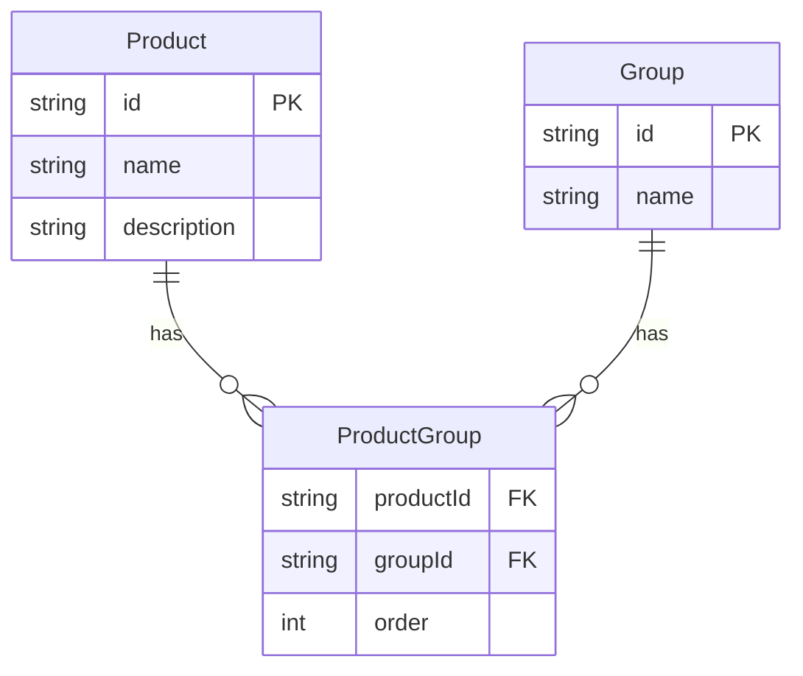
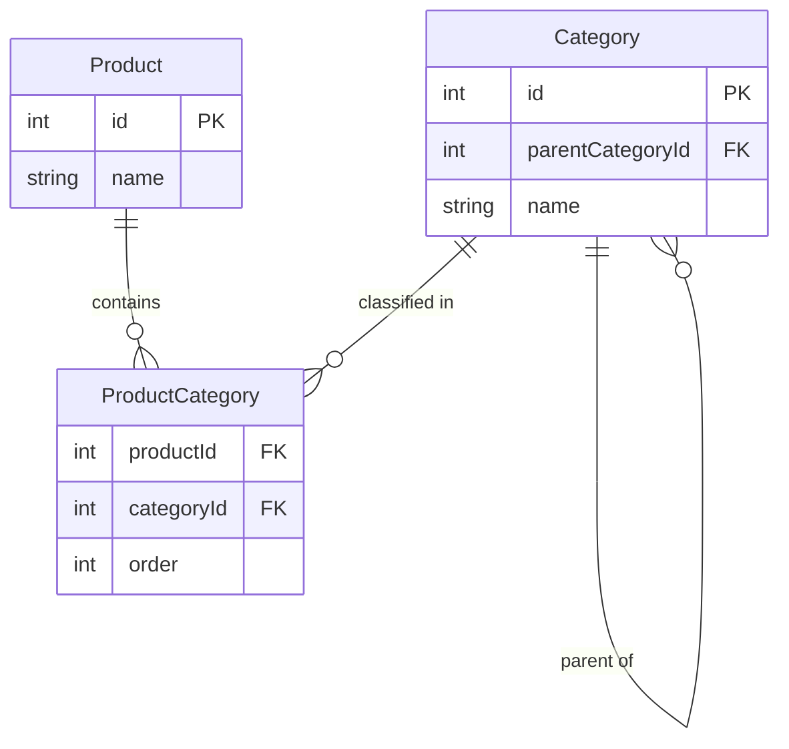

## Třídění podle 1:N referencí

Různé typy databázi mají s referencemi typu "jeden k mnoha" různé těžkosti. Pojďme si je demonstrovat na jednoduchém příkladu. Máme databázi produktů, kde produkt může patřit do jedné nebo více skupin, na úrovni relace mezi entitami `Produkt` a `Skupina` máme referenci s atributem `pořadí`, který určuje pořadí produktů v rámci skupiny. Naše aplikace má zobrazit seznam produktů setříděný podle první skupiny, do které patří, přičemž pro výběr skupiny se má použít první skupina podle abecedního pořadí. V rámci této skupiny se mají produkty setřídit podle jejich pořadí daného atributem `pořadí` (vzestupně).



Pokud bychom k vyřešení této úlohy použili relační databázi, např. PostgreSQL mohl by SQL dotaz vypadat takto:

```sql
SELECT
  p.id AS product_id,
  p.name AS product_name,
  pg_first.order AS sort_order,
  g_first.name AS first_group_name
FROM
  Product p
  -- Join all groups for aggregation
  JOIN ProductGroup pg ON p.id = pg.productId
  JOIN "Group" g ON pg.groupId = g.id
  -- LATERAL subquery to find first group (by name) for sorting
  JOIN LATERAL (
    SELECT pg2.order, g2.name, g2.id
    FROM ProductGroup pg2
    JOIN "Group" g2 ON g2.id = pg2.groupId
    WHERE pg2.productId = p.id
    ORDER BY g2.name
    LIMIT 1
  ) AS pg_first ON true
  JOIN "Group" g_first ON g_first.id = pg_first.id
GROUP BY
  p.id, p.name, pg_first.order, g_first.name
ORDER BY
  pg_first.order;
```

Kromě vlastní komplexity dotazu je už na první pohled jasné, jaké problémy bude muset vývojář aplikace řešit. Dotaz řeší pouze správné seřazení a neumožňuje získat další vlastnosti produktu. To by vyžadovalo dodatečný dotaz do databáze nebo obalení do vnějšího dotazu, který by načtení umožnil. Pro získání detailů skupin, jež je produkt součástí by bylo potřeba další SQL dotaz a následně vše v aplikační logice spojit dohromady.

V řadě NoSQL databází je tento problém ještě složitější. Některé neumožňují jednoduše provazovat data mezi různými kolekcemi (Elasticsearch například) a spoléhají na denormalizaci, která přináší svou samostatnou sadu problémů, v jiných je modelování takového problému možné, ale opět velmi komplikované. Takto by se k němu dalo [přistoupit například v MongoDB](examples/17-one-to-many/mongodb-one-to-many.md).

Ve webovém prostředí je podobný problém velmi častý, a proto se snažíme vyjít vývojářům vstříc. V evitaDB by takový dotaz vypadal jednoduše takto:

<SourceCodeTabs>

[Výpis produktů podle pořadí ve skupinách](examples/17-one-to-many/product-groups.evitaql)

</SourceCodeTabs>

Z dotazu je patrné, že řadíme podle atributu `order` definovaného na referenci `groups` a vybíráme takovou referenci, která odpovídá první přiřazené skupině podle abecedního pořadí v atributu `name` této skupiny. Jediným dotazem do databáze tak získáte správně seřazené produkty včetně všech dodatečných informací potřebných pro další zpracování v aplikaci a jednoduchou modifikací se v rámci výstupu dostanete i k detailům všech (nebo části) skupin, do kterých produkt patří.

### Reference na entity organizované ve stromové struktuře

Příklad, se kterým prozatím pracujeme se týká vazeb mezi entitami, které nejsou organizované do stromových struktur. Pokud v našem příkladě skupinu nahradíme za kategorii produktů, které jsou často organizované do hierarchické struktury, dávalo by větší smysl mít možnost produkty vypsat spíše setříděně logicky podle hierarchické struktury a sekundárně v rámci kategorie teprve seřadit podle atributu pro třídění. Model by mohl v takovém případě vypadat třeba takto:



Pro účely rekurzivních dotazů se používají v SQL světě tzv. [common table expressions (CTE)](https://www.postgresql.org/docs/current/queries-with.html) s klauzulí `WITH RECURSIVE`, která umožňuje rekurzivní procházení. Dotaz, který by realizoval požadovaný výpis produktů by mohl vypadat třeba takto:

```sql
WITH RECURSIVE category_tree AS (
    -- Base case: Get all top-level categories (where parentCategoryId is NULL)
    SELECT
        id,
        parentCategoryId,
        name,
        1 AS depth
    FROM
        Category
    WHERE
        parentCategoryId IS NULL
    UNION ALL
    -- Recursive case: Get child categories and increment depth
    SELECT
        c.id,
        c.parentCategoryId,
        c.name,
        ct.depth + 1 AS depth
    FROM
        Category c
    JOIN category_tree ct ON c.parentCategoryId = ct.id
)
SELECT DISTINCT
    p.id AS product_id,
    p.name AS product_name,
    c.id AS category_id,
    c.name AS category_name,
    ct.depth,
    pc.order
FROM
    category_tree ct
-- Join the categories with the products through ProductCategory table
JOIN ProductCategory pc ON pc.categoryId = ct.id
JOIN Product p ON p.id = pc.productId
-- Sort categories by name and products by order
ORDER BY
    ct.depth,      -- Order by depth (for depth-first traversal)
    ct.name ASC,   -- Order categories by name
    pc.order;      -- Order products by 'order' in ProductCategory
```

I tento dotaz je v podání relačních databází velmi komplikovaný na porozumění. U NoSQL databází však pochodíme ještě hůře - ve valné většině z nich není rekurzivní prohledávání možné, takže nám nezbude než vše vyřešit v aplikační logice.

Přístup evitaDB se drží deklarativního principu - vývojář pouze specifikuje, jaký chce výstup a neřeší do detailu, jak ho má být dosaženo. To je přeci úloha databáze. Náš dotaz by v případě hierarchických struktur v evitaDB vypadal takto:

<SourceCodeTabs>

[Výpis produktů podle pořadí v kategoriích](examples/17-one-to-many/product-categories.evitaql)

</SourceCodeTabs>

Prostou záměnou prvního argumentu `traverseByEntityProeprty` (`DEPTH_FIRST`) za `BREADTH_FIRST` můžeme snadno přepínat procházením [do hloubky](https://en.wikipedia.org/wiki/Depth-first_search) a [do šířky](https://en.wikipedia.org/wiki/Breadth-first_search). Na úrovni `traverseByEntityProperty` jednoduše určujeme v jakém pořadí se mají kategorie na jednotlivých úrovních procházet.

### Vzájemný vztah procházením a tříděním dle vybrané reference

Oba dva přístupy `pickFirstByEntityProperty` a `traverseByEntityProperty` lze používat jak u hierarchických, tak i plochých vazeb mezi entitami. Pokud použijeme `pickFirstByEntityProperty` na hierarchické struktury, pak dostaneme "zploštělý" výstup, kde se jednoduše setřídí produkty podle atributu na referenci vybrané kategorie. Pokud naopak použijeme `traverseByEntityProperty` na entitu neorganizovanou ve stromu (např. na skupinu), dostaneme výpis produktů, který je organizován primárně podle příslušnosti ke skupině (dle daného třídění uvnitř `traverseByEntityProperty`) a teprve sekundárně podle atributu na referenci `order`.

Existuje řada situací, kdy mohou být tyto alternativní přístupy užitečné.

### Hluboké třídění

Popsané třídění lze aplikovat nejen na úrovni hlavní výstupní entity (tj. v našem případě produktu), ale je možné je samozřejmě použít i uvnitř `pickFirstByEntityProperty` nebo `traverseByEntityProperty` a tím dosáhnout třídění do libovolné hloubky. Praktických scénářů pro toto použití asi mnoho nenajdeme, přesto je dobré mít na paměti, že je to možné.

Abychom nezůstali pouze u planého teoretizování, pojďme si náš příklad rozšířit o další entitu "štítek" (Tag), které se přiřazují na úrovni kategorií a opět mají kardinalitu "jeden k mnoha". Pokud bychom chtěli vypsat produkty podle hierarchické struktury, kde kategorie jsou v rámci jednotlivých úrovní seřazeny podle prvního přiřazeného štítku, který má nejvyšší prioritu, mohl by dotaz vypadat třeba takto:

<SourceCodeTabs>

[Výpis produktů podle pořadí v kategoriích seřazených dle nejprioritnějšího štítku](examples/17-one-to-many/product-categories-tags.evitaql)

</SourceCodeTabs>

<Note type="info">

Pro zajímavost - odpovídající SQL dotaz pro stejnou situaci by [mohl vypadat takto](./examples/17-one-to-many/postgresql-product-categories-tags.md).

</Note>

## Limitace rozsahu výpisu 1:N referencí

U referencí s vysokou kardinalitou je dalším problémem jejich výpis v rámci hlavní entity. Typickým příkladem je situace, kdy třeba na detailu produktu potřebujeme vypsat všechny skupiny, do kterých patří, zároveň i všechny štítky, parametry, příbuzné produkty, asociované obrázky, technickou dokumentaci a mnoho dalšího. To všechno jsou příklady referencí s vysokou kardinalitou. Řadu z nich není třeba modelovat strukturovaně a postačí nám je zachytit ve formě nestrukturovaného JSON zápisu, ale přesto nám mnoho adeptů na modelování pomocí referencí z řady důvodů zbude.

V případě relační databáze je nutné všechny podzáznamy s vysokou kardinalitou sloučit jako výstup do jednoho sloupce a následně je v aplikační logice zpracovat. Sloučení je možné buď do jednoduché struktury (např. oddělené čárkami):

```sql
SELECT p.product_id, p.product_name,
    STRING_AGG(DISTINCT g.group_name, ', ') AS groups,
    STRING_AGG(DISTINCT t.tag_name, ', ') AS tags,
    STRING_AGG(DISTINCT CONCAT(par.parameter_name, ': ', par.parameter_value), ', ') AS parameters
FROM Product p
         LEFT JOIN Product_Group pg ON p.product_id = pg.product_id
         LEFT JOIN "Group" g ON pg.group_id = g.group_id
         LEFT JOIN Product_Tag pt ON p.product_id = pt.product_id
         LEFT JOIN Tag t ON pt.tag_id = t.tag_id
         LEFT JOIN Product_Parameter pp ON p.product_id = pp.product_id
         LEFT JOIN Parameter par ON pp.parameter_id = par.parameter_id
WHERE p.product_id = 1
GROUP BY p.product_id;
```

Případně do složitější JSON struktury, která umožňuje si předat větší množství strukturovaných dat najednou:

```sql
SELECT p.product_id,
       p.product_name,
       -- Skupiny
       JSON_AGG(
           JSON_BUILD_OBJECT(
               'group_id', g.group_id,
               'group_name', g.group_name
           )
       ) AS groups,
       -- Štítky
       JSON_AGG(
           JSON_BUILD_OBJECT(
               'tag_id', t.tag_id,
               'tag_name', t.tag_name
           )
       ) AS tags,
       -- Parametry
       JSON_AGG(
           JSON_BUILD_OBJECT(
               'parameter_id', par.parameter_id,
               'parameter_name', par.parameter_name,
               'parameter_value', par.parameter_value
           )
       ) AS parameters
FROM Product p
LEFT JOIN Product_Group pg ON p.product_id = pg.product_id
LEFT JOIN "Group" g ON pg.group_id = g.group_id
LEFT JOIN Product_Tag pt ON p.product_id = pt.product_id
LEFT JOIN Tag t ON pt.tag_id = t.tag_id
LEFT JOIN Product_Parameter pp ON p.product_id = pp.product_id
LEFT JOIN Parameter par ON pp.parameter_id = par.parameter_id
GROUP BY p.product_id;
```

V aplikační logice opět musíme řešit zpětný převod informací do podoby, se kterou dokážeme v aplikaci pracovat. Zároveň je jasné, že tyto transformace nás stojí nějaký výkon jak na straně databáze, tak i na straně aplikační logiky. Bohužel, relační přístup orientovaný na řádky nám v tomto případě nedává mnoho lepších možností. NoSQL databáze mají v tomto případě určitou výhodu.

Dotazy v evitaDB tímto problémem netrpí, protože umí vracet entity načtené do libovolné hloubky strukturovaným způsobem. Problém však nastává ve chvíli, kdy je riziko velkého množství referencí, které by mohly být vráceny. Kromě toho, že bychom takové množství dat nebyli schopni ani prezentovat směrem k cílovému uživateli, riskujeme i zbytečné zatížení databázového stroje a přenos velkých dat po síti (tj. zvýšení latence dotazu). Proto je vhodné v takových případech počet načítaných referencí omezit. V evitaDB, bychom to dělali tímto způsobem:

<SourceCodeTabs>

[Výpis parametrů produktu s omezením na prvních 10 nejdůležitějších](examples/17-one-to-many/product-parameters-top10.evitaql)

</SourceCodeTabs>

Výstupem jsou datové struktury reprezentující stránku nebo výsek definovaný pomocí `offset`/`limit`, které umožňují další reflexi nad vrácenými daty. Tj. výpočet počtu stránek, informace o existenci další / předchozí stránky, celkový počet záznamů atp. Je tedy jednoduše možné sestavit následný dotaz, který by vrátil další potřebná data, která byla tímto dotazem vynechána.

V řadě situací ani nepotřebujeme vlastní reference načítat - stačí nám pouze informace o jejich počtu, či prostý fakt, že existuje alespoň jedna taková reference. Tato situace nastává často v kombinaci s potřebou reference dále profiltrovat - například v rámci entity produktu zjistit, zda existuje alespoň jediná reference na sklad označený jako prioritní se skladovým množstvím větším jak jedna. To bychom realizovali jednoduše takto:

<SourceCodeTabs>

[Výpis informace o existenci priortního skladu u produktu](examples/17-one-to-many/product-stock-existence.evitaql)

</SourceCodeTabs>

### Segmentace

Současný svět se podřizuje potřebám marketingu a tak je běžné, že výpisy článků / produktů a dalších entity prokládané odkazy na články, reklamními bannery a dalšími prvky, které nemají s danou entitou nic společného. Totéž může být vyžadováno i na úrovni referencí na další entity - například v detailu článku, v sekci podobných článků, které jsou vypisovány stránkovaně chceme na každé druhé straně vynechat jednu položku pro zobrazení reklamního banneru.

Pro tyto účely slouží segmentace, kterou je možné použít i při výpisu referencí. Námi popsaný příklad by se řešil následovně:

<SourceCodeTabs>

[Výpis podobných článků s proložením reklamami](examples/17-one-to-many/article-segmentation.evitaql)

</SourceCodeTabs>

Výstupní datové struktury stále korektně deklarují odpovídající počet stránek i počet nalezených podobných článků, přestože na každé druhé stránce nechají prostor pro právě jeden reklamní banner. Podobný výpočet na aplikační úrovni by sice byl možný, ale velmi komplikovaný.

## Shrnutí

Článek se snaží ve zkratce naznačit možnosti nových funkcí v evitaDB `2025.2`, která byla právě vydána a naznačit přístup vývojářů evitaDB k problémům, které se denodenně řeší při vývoji nejen webových aplikací, které vidíme okolo nás. Dotazovací jazyk evitaDB je orientován deklarativním způsobem, který se snaží si zachovávat čitelnost i v komplikovaných situacích. Zaměřuje se na praktické řešení běžných problémů, které jsou často v univerzálně použitelných databázích řešitelné jen velmi komplikovaně a vyžadují značnou spolupráci na aplikační úrovni a s tím souvisejících nákladů na jejich následnou údržbu.

Pokud vás článek zaujal nebo máte tipy na lepší řešení zmíněných problémů, dejte nám vědět na našem [Discord serveru](https://discord.gg/VsNBWxgmSw).

<Note type="info">

**Poznámka:**

Příklady pro PostgreSQL a MongoDB byly vygenerovány prostřednictvím LLM a mohou obsahovat chyby. V zásadě se ovšem jedná o legální přístupy k řešení dané problematiky, kterými by se velmi pravděpodobně vývojář v určité fázi vývoje aplikace zabýval. 

</Note>