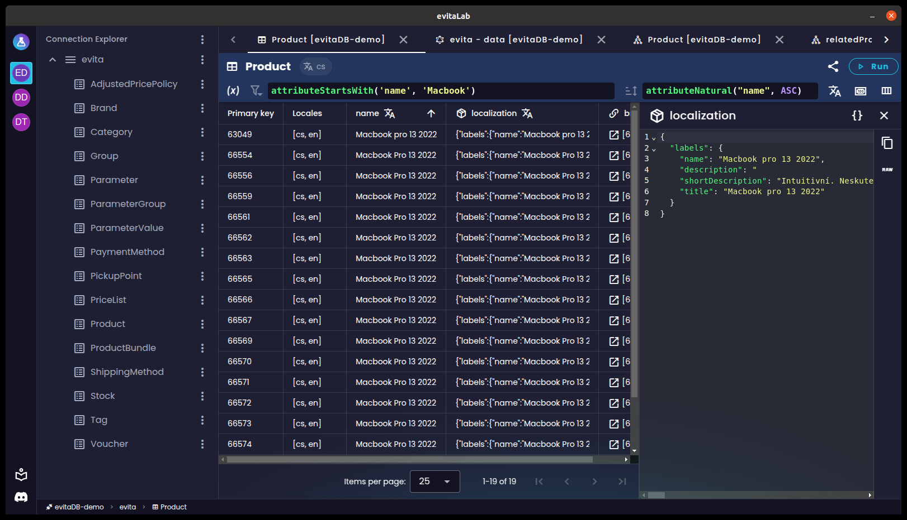
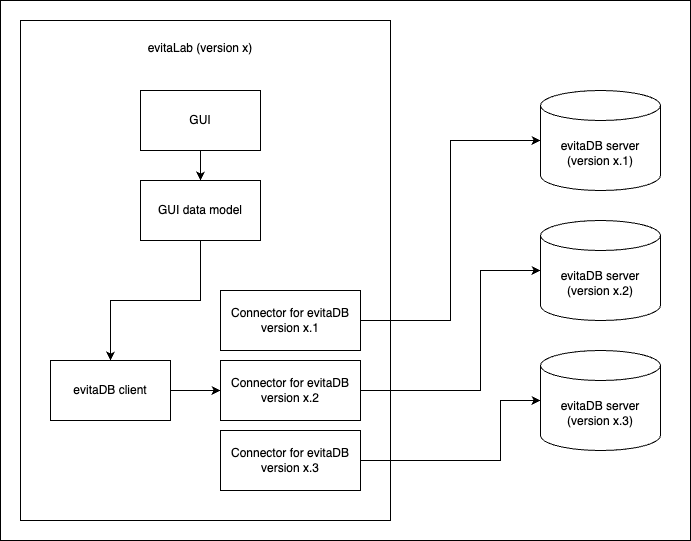
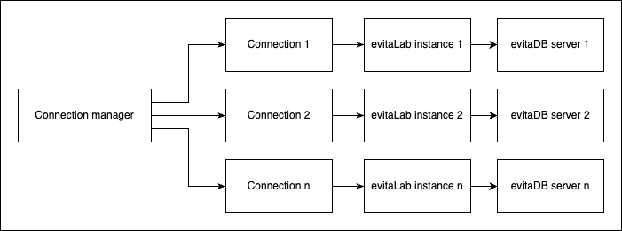
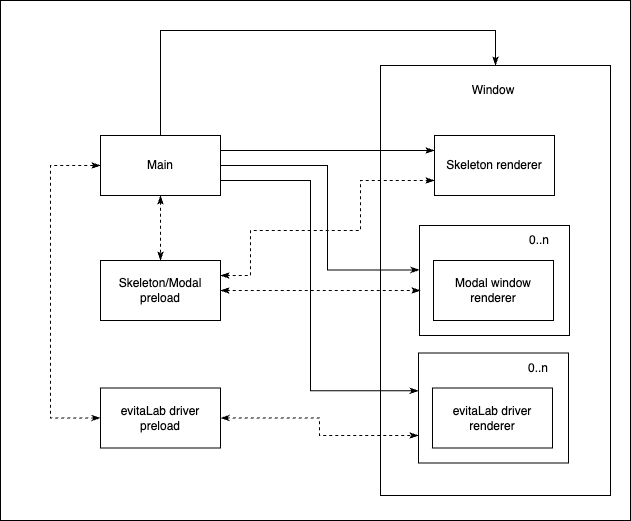

A nyní s potěšením oznamujeme [evitaLab Desktop](https://github.com/FgForrest/evitalab-desktop). Můžete si jej
[stáhnout](https://github.com/FgForrest/evitalab-desktop/?tab=readme-ov-file#download) pro všechny hlavní platformy
(Windows, macOS, Linux). Obsahuje všechny oblíbené funkce jádra [evitaLab](https://github.com/FgForrest/evitalab)
a také mnoho dalších funkcí, například:

- ✅ správa připojení k více instancím evitaDB
- ✅ připojení ke kterékoli verzi serveru v jedné aplikaci
    - *poznámka: verze serveru musí být alespoň 2025.1, starší verze evitaLab nejsou a nikdy nebudou zpětně portovány pro režim driveru*
- ✅ přijímání aktualizací jádra evitaLab ihned po jejich vydání bez čekání na aktualizaci serveru
- ✅ každé připojení ukládá své vlastní záložky a historii, i když každé připojení směřuje na stejnou URL serveru
    - *to je užitečné, pokud používáte přesměrování portů pro různá serverová prostředí (produkce, test, lokální), kde je lokální port stejný pro každé prostředí*
- ✅ stylování připojení pro lepší rozlišení mezi servery a prostředími
- ✅ globální notifikační systém – zobrazuje toast notifikace z desktopové aplikace a připojení na jednom místě
    - *takto můžete vidět notifikace ze všech připojení kdykoli*



## Motivace

Existovalo několik důvodů pro vývoj desktopové aplikace.

Zřejmým důvodem je, že je mnohem uživatelsky přívětivější mít dedikovanou *desktopovou* aplikaci, která zvládne více
serverových připojení s řádným rozlišením a přizpůsobením, než přepínat mezi náhodnými záložkami různých instancí
evitaLab v prohlížeči.

Dalším důvodem, *hlavním důvodem*, proč jsme ji postavili právě teď, je, že nám řeší velký problém, který jsme v jádru
evitaLab dlouho odkládali. Problém spočívá v tom, že webový klient evitaLab nepodporuje více verzí serveru evitaDB.
Vždy je vyvíjen proti nejnovější verzi evitaDB (přesněji řečeno, je vyvíjen proti nejnovější verzi gRPC/GraphQL/REST API).
Snažili jsme se proto vymyslet nějaký middleware mezi GUI evitaLab a API evitaDB, který by propojil různé verze evitaLab
s různými verzemi serveru evitaDB. Konkrétně tak, aby bylo možné podporovat starší i novější servery evitaDB současně.

Původně jsme chtěli vytvořit univerzální datový model podle požadavků GUI a napsat konvertory pro všechny verze API
evitaDB. Brzy se však ukázalo, že tato cesta je neudržitelná. Vyžadovala by vytváření samostatných stubů pro každou
verzi gRPC API a jejich napojení na datový model evitaLab. Navíc by to přineslo další výzvu: jak chytře distribuovat
jednotlivé stuby a konvertory klientovi, aniž by si musel stahovat celý zdrojový kód najednou.



Po zvážení jsme myšlenku podpory více verzí serveru evitaDB v jedné verzi evitaLab opustili. Místo toho jsme zkombinovali
několik samostatných nápadů, které jsme měli, a přišli jsme s následujícím řešením.

## Myšlenka evitaLab Desktop

Desktopová aplikace není jen jednoduchý evitaLab zabalený do WebView a distribuovaný jako desktopová aplikace. To by nám
nic nevyřešilo.

Místo toho desktopová aplikace funguje jako jakýsi správce samostatných instancí evitaLab. Desktopová aplikace má mimo
jiné vlastní GUI pro správu připojení k serverům evitaDB. Po připojení k serveru evitaDB desktopová aplikace zjistí
verzi připojeného serveru a najde nejnovější kompatibilní verzi evitaLab. Pokud je nalezena kompatibilní verze
evitaLab, desktopová aplikace ji stáhne (pokud už není stažená) z GitHub repozitáře evitaLab a uloží ji na disk.
Nakonec spustí nové WebView, které lokálně z disku spustí stažený evitaLab v režimu driveru.

Tímto způsobem se můžeme připojit ke kterékoliv verzi evitaDB (od 2025.1 výše) bez složitých mostů.

Když uživatel přepíná mezi jednotlivými připojeními pomocí GUI desktopové aplikace, aplikace jednoduše přepíná
viditelnost WebView, ve kterých běží jednotlivé instance evitaLab.



## Problémy, které řeší, a jeho výhody

Tato architektura řeší několik problémů najednou.

Hlavním problémem, který řeší, je „podpora více verzí“ serveru evitaDB. Díky této architektuře můžeme efektivně
podporovat všechny verze evitaDB z jedné desktopové aplikace s téměř nulovými náklady na údržbu. Má to však jednu
nevýhodu oproti podpoře různých verzí serveru přímo v evitaLab: každé WebView s evitaLab může vypadat trochu jinak
a nabízet různé funkce, pokud je mezi verzemi serverů velký rozdíl. Myslíme si však, že je to přijatelné, protože když
se uživatel připojuje k více serverům přes webový prohlížeč, každá vložená instance evitaLab může také vypadat jinak.
Teoreticky bychom také mohli některé změny GUI zpětně portovat do starších verzí evitaLab, abychom rozdíly eliminovali.

Architektura lokálního hostování evitaLab přináší i další výhody. Protože běží lokálně a nezávisí na serveru evitaDB,
přežije i vypnutý server evitaDB, což znamená, že uživatel si stále může prohlížet své dotazy, data atd. (i když to má
ještě nějaké mouchy, které musíme doladit). Další výhodou lokálního běhu evitaLab je, že nemusíme při každém spuštění
desktopové aplikace stahovat zdrojový kód ze serveru, což znamená rychlejší načítání. Server evitaDB ani nemusí
vystavovat vložený evitaLab (ale to vyžaduje, aby všichni uživatelé používali desktopovou aplikaci), stačí pouze jeho
API.

Další výhodou nezávislosti na vložené instanci evitaLab v serveru evitaDB je, že můžeme distribuovat nové verze
evitaLab přímo uživatelům bez čekání, až server evitaDB dožene změny.

Samotná desktopová aplikace nabízí i další potenciální výhody, které můžeme v budoucnu využít. Například můžeme
vytvořit funkce, které propojí jednotlivé instance evitaLab, například migraci katalogů mezi servery. Tento typ
funkcionality už využíváme pro toast notifikace. Notifikace ze všech instancí evitaLab jsou odesílány do desktopové
aplikace, která je zobrazuje v jednom seznamu. Uživatel tak může vidět všechny notifikace z jakéhokoliv připojení nebo
z desktopové aplikace samotné, bez ohledu na to, které připojení právě prohlíží.

## Použité technologie

Hlavní komponentou, bez které by to bylo sotva možné, je samozřejmě framework [Electron](https://www.electronjs.org/)
ve spojení s [Electron Forge](https://www.electronforge.io/). Zkoumali jsme i další možnosti jako
[Tauri](https://tauri.app/) nebo [Neutralino](https://neutralino.js.org/). Například architektura v Rustu v rámci Tauri
se nám velmi líbila, ale žádný jiný framework (v době výzkumu) neposkytoval všechny funkce, které jsme potřebovali pro
realizaci naší myšlenky. Hlavní funkcí, kterou jsme potřebovali, byla možnost umístit samostatné WebView vedle sebe
i nad sebe. „Vedle sebe“ není problém, ale „nad sebe“ se ukázalo být problémem u všech frameworků kromě Electronu.
Byli jsme tedy tak trochu donuceni použít Electron. Naštěstí se ukázalo, že je to velmi dobrá volba, protože má velkou
komunitu a nabízí širokou škálu užitečných nástrojů a možností.

Uvnitř Electron aplikace jsme zůstali u stejného technologického stacku, jaký používáme pro jádro evitaLab:
[Vue](https://vuejs.org/) + [Vuetify](https://vuetifyjs.com/) + [Typescript](https://www.typescriptlang.org/).
To nám umožňuje snadno přecházet mezi oběma projekty a sdílet společné frontendové komponenty, například stylování GUI.
Ideálně tak uživatel nepozná rozdíl mezi skutečnou desktopovou aplikací a driverem evitaLab.

Nakonec používáme GitHub CI k testování a vydávání celé aplikace pro každou platformu. Proces vydání bez CI by byl
příliš zdlouhavý, protože sestavení aplikace pro konkrétní platformu znamená, že musíte mít přístup ke stroji s touto
platformou a sestavit ji na něm. To by vyžadovalo ručně sestavit desktopovou aplikaci minimálně na 4 různých strojích
(i kdyby byly virtuální) a pak je sloučit do jednoho vydání. Místo toho jsme použili různé GitHub
CI [runnery](https://docs.github.com/en/actions/using-github-hosted-runners/using-github-hosted-runners/about-github-hosted-runners#standard-github-hosted-runners-for-public-repositories),
které sestaví desktopovou aplikaci pro každou platformu v paralelních úlohách a všechny sestavené soubory zabalí do
jednoho GitHub release. Můžete si prohlédnout
[celoú CI workflow](https://github.com/FgForrest/evitalab-desktop/blob/dev/.github/workflows/release.yml) v našem
repozitáři.

## Jak to funguje pod kapotou

Již jsme zmínili, že je postavena na frameworku Electron. Existuje však mnoho způsobů, jak Electron aplikaci postavit.

Především jsme se silně inspirovali architekturou použivanou v aplikaci
[Mattermost Desktop](https://github.com/mattermost/desktop), ale jsou zde určité rozdíly. Jak tedy funguje pod kapotou?

### Architektura

Každá Electron aplikace je rozdělena na hlavní, preload a renderer komponenty. Aplikace evitaLab Desktop dále dělí
renderer komponentu na několik tzv. mini webových aplikací (každá je samostatný renderer proces), které dohromady tvoří
celé GUI.

Hlavní komponenta je Node.js backend, který zajišťuje komunikaci s operačním systémem, okny aplikace atd. V našem
případě je hlavní komponenta napsána v Typescriptu a stará se mimo jiné (aktualizace aplikace, přístup k souborovému
systému, konfigurace aplikace atd.) o orchestraci samotného GUI, které se skládá z vlastního GUI desktopové aplikace a
GUI driverů evitaLab.

Preload komponenta je zodpovědná za poskytování vlastních `window.XYZ` browser API renderer komponentám. Poskytujeme
několik vlastních API, například: notifikační API, API správce připojení, API správce modalů a mnoho dalších. Tímto
způsobem může jakákoliv frontendová webová aplikace komunikovat se zbytkem desktopové aplikace (například modální okna
nebo drivery evitaLab) nebo přímo s operačním systémem.

Poslední jsou renderer komponenty, kde se vykreslují mini frontendové webové aplikace (stejně jako v prohlížeči).
V evitaLab Desktop spouštíme několik renderer instancí. Základní GUI, každé modální okno, každý driver evitaLab je
samostatný renderer proces (podobně jako samostatné záložky v prohlížeči).



Každý evitaLab desktop startuje s jednou novou instancí `BrowserWindow`, což je v podstatě nové aplikační okno, které
načítá vlastní frontendovou webovou aplikaci. Přesněji načítá tzv. skeleton webovou aplikaci. Skeleton aplikace je
základní GUI desktopové aplikace. Skládá se hlavně z uvítací obrazovky (první, co po spuštění vidíte) a hlavního
navigačního panelu (pro přepínání připojení). Tato webová aplikace je vždy na pozadí, ať už děláte cokoliv.

Jakmile začnete klikat a otevírat připojení a modální okna, věci se pod kapotou komplikují. Jak už bylo zmíněno, každé
modální okno nebo driver evitaLab je samostatná renderer/mini frontendová webová aplikace, kterou chytře umisťujeme
vedle sebe nebo nad sebe na skeleton aplikaci. K tomu používáme komponentu `WebContentsView`, která nám umožňuje
umístit několik samostatných renderer instancí do hlavní instance `BrowserWindow`.

V případě připojení k serveru se vytvoří nová instance `WebContentsView` a načte se do ní příslušná webová aplikace
driveru evitaLab. Ta je pak staticky umístěna nad část skeleton aplikace tak, aby byla viditelná pouze levá navigační
lišta. Pokud je otevřeno více připojení a tedy více instancí `WebContentsView` s driverem evitaLab, jsou umístěny nad
sebe na stejném místě, ale vždy je viditelná pouze jedna instance. Ostatní jsou stále přítomné, ale skryté.

V případě modálních oken může každý renderer otevřít jakékoliv existující modální okno pomocí poskytnutého API správce
modalů. Každé modální okno je také samostatný renderer. Když je přes API požadováno nové modální okno, backend vytvoří
novou instanci `WebContentView` a načte do ní příslušnou frontendovou webovou aplikaci pro toto modální okno. Taková
instance `WebContentView` je umístěna přes celé `BrowserWindow`, ale s průhledným pozadím. Díky tomu je zbytek
desktopové aplikace stále viditelný pod modalem, což vytváří iluzi jednotné aplikace. Po zavření modálního okna není
instance `WebContentView` zničena, místo toho se vymažou data modalu a instance se skryje. Když je modal požadován
znovu, nemusíme vše inicializovat znovu, pouze přepneme viditelnost. Tento přístup umožňuje také vrstvení více modálních
oken nad sebe, například pokud modal chce vyvolat potvrzovací modal. Nový modal je jednoduše umístěn nad původní modal.

### Nevýhody architektury

Samozřejmě, přístup samostatných frontendových webových aplikací běžících v samostatných renderer instancích má i své
nevýhody. Tou nejdůležitější je spotřeba paměti. Každá renderer instance spouští vlastní proces s vlastním mini
prohlížečem, stejně jako běžný prohlížeč se samostatnými záložkami. V naší aplikaci však nepotřebujeme samostatné
prohlížečové kontexty pro každé modální okno. Další nevýhodou je, že to vyžaduje určité množství boilerplate kódu,
konkrétně každá mini aplikace potřebuje vlastní `index.html`, který inicializuje malou Vue.js aplikaci, která potřebuje
nějakou konfiguraci a pluginy (což je stejné pro většinu mini aplikací). A tato inicializace zabere nějaký čas. Na
dnešních počítačích je tato doba zanedbatelná, ale přesto tam je a trochu plýtvá prostředky. Výhoda možnosti spouštět
více instancí evitaLab v jedné desktopové aplikaci s téměř bezproblémovým zážitkem bez velkého úsilí však podle nás
výrazně převyšuje nevýhody. Samozřejmě plánujeme architekturu optimalizovat, kde to půjde, ale už teď to funguje velmi
dobře.

Nyní, když víme, jak desktopová aplikace funguje, pojďme se podívat na některé konkrétní problémy, které jsme museli
vyřešit.

### Řešení verze driveru evitaLab

Jakmile jsme se rozhodli opustit myšlenku podpory více serverů v jádru evitaLab, stáli jsme před dalším problémem: jak
rozhodnout, kterou verzi driveru evitaLab použít pro konkrétní server?

Zkoumali jsme několik možností, ale nakonec jsme se rozhodli pro následující.

Jak bylo zmíněno na začátku, každý driver evitaLab je vyvíjen proti nejnovější verzi API evitaDB, *ne proti verzi
serveru evitaDB samotné*. To znamená, že můžeme definovat požadovanou verzi API evitaDB pro konkrétní verzi evitaLab.
Ve skutečnosti jsme do kořenového adresáře projektu evitaLab zavedli soubor `.evitadbrc`, který určuje minimální
požadovanou verzi serveru evitaDB pro konkrétní verzi evitaLab. Když je vydána nová verze evitaLab, GitHub CI odešle
minimální verzi evitaDB spolu s vydanou verzí evitaLab do naší veřejné
[metadata databáze](https://github.com/FgForrest/evitalab-metadata-database) jednoduše tím, že stáhne repozitář
databáze, přidá dvojici verzí do indexového souboru a commitne ji (viz
akci [release.yaml](https://github.com/FgForrest/evitalab/blob/5636b54ea022ad6d62183f576b894d9e3e3c8904/.github/workflows/release.yml#L188-L215)).

| evitalab-version | min-evitadb-version |
|------------------|---------------------|
| 2025.2.0         | 2025.1.0            |
| 2025.3.0         | 2025.1.0            |

*evitalab-database.csv*

Když se pak uživatel pokusí připojit ke konkrétnímu serveru evitaDB z desktopové aplikace, aplikace stáhne aktuální
indexový soubor z metadata databáze, vytvoří setříděný index seskupený podle minimální verze evitaDB a hledá nejnovější
verzi evitaLab, která je starší nebo rovna připojenému serveru. Jakmile ji najde, vybere nejnovější známou verzi driveru
evitaLab pro tuto verzi evitaDB.

Protože používáme [semantické kalendářní verzování](https://github.com/lukashornych/semantic-calendar-version) jak pro evitaDB,
tak pro evitaLab, což je v podstatě varianta [semantického verzování](https://semver.org/), můžeme snadno porovnávat
verze a vybrat tu nejnovější. To také znamená, že můžeme některé funkce zpětně portovat do starších verzí evitaLab, které
vyžadují starší verze evitaDB. A inkrementací pouze PATCH části verze by desktopová aplikace aktualizovala driver pouze
na novější patch verzi bez narušení kompatibility, ke které by došlo při upgradu na novější verzi driveru, která vyžaduje
novější verzi evitaDB.

### evitaLab driver

Abychom mohli podporovat běh jádra evitaLab jak vloženého v serveru evitaDB, tak v desktopové aplikaci, nyní stavíme
evitaLab ve dvou režimech: standalone a driver mode pomocí GitHub CI. Každý z nich má drobné odlišnosti podle cílového
prostředí.

Režim driveru typicky mění některé části GUI, aby byl přechod z desktopové aplikace do driveru evitaLab plynulý.
Integruje také evitaLab s vlastními API poskytovanými preload skriptem.

Po vyřešení konkrétní verze driveru nejprve zkontrolujeme, zda je zdrojový kód driveru již přítomen na disku. Pokud ne,
vytvoří se dočasný adresář a pomocí HTTP klienta se stáhne archiv build driver mode ze zdroje
```js
`https://github.com/FgForrest/evitalab/releases/download/v${this.version}/Dist.Driver.zip`
```
do tohoto dočasného adresáře. Stažený archiv se rozbalí.
Nakonec se dočasný adresář přejmenuje na adresář verze driveru.
Dočasný adresář používáme proto, abychom předešli poškození zdrojového kódu během tohoto procesu. Například v situaci,
kdy desktopová aplikace spadne uprostřed stahování nebo rozbalování.
Kdybychom použili adresář pojmenovaný podle verze driveru přímo a došlo by k poškození, desktopová aplikace by si stále
myslela, že driver byl správně stažen a je použitelný, což by vedlo k chybě za běhu.
Samozřejmě by bylo ještě lepší ověřovat kontrolní součet, ale prozatím to stačí.

Když se vytvoří nová instance `WebContentsView`, driver evitaLab se načte přímo z disku z adresáře driveru.

### Automatické aktualizace

Framework Electron obsahuje knihovnu [update-electron-app](https://github.com/electron/update-electron-app), která
umí automaticky aktualizovat desktopovou aplikaci z GitHub Releases. Protože používáme Electron Forge a GitHub Release
pro publikování vydání, byla volba této knihovny jasná. Stačilo jen jednoduché nastavení:

```js
updateElectronApp({
	updateSource: {
		type: UpdateSourceType.ElectronPublicUpdateService,
		repo: 'FgForrest/evitalab-desktop',
	},
	updateInterval: '1 hour',
	logger: log
})
```

Narazili jsme však na jeden malý problém. Přestože používáme Electron Forge, používáme pro strukturu projektu šablonu
[Vite + Typescript](https://www.electronforge.io/templates/vite-+-typescript). Problém je v tom, že knihovna
`update-electron-app` očekává soubor `package.json` v nadřazeném adresáři běžící aplikace. Vite jej však umisťuje do
nadřazeného adresáře nad tímto adresářem, což způsobuje pád celého procesu aktualizace. Nakonec jsme knihovnu dočasně
naklonovali přímo do desktopové aplikace, dokud nebude opravena *(na opravě pracujeme)*.

Bohužel, funkce automatické aktualizace je dostupná pouze pro platformy Windows a macOS. Linux není vůbec podporován.
Proto jsme pro linuxovou verzi implementovali v aplikaci notifikační systém, který uživatele upozorní na novou verzi
a přesměruje jej na GitHub Releases pro ruční instalaci.

## Závěr

Zatím se framework Electron ukázal jako skvělý nástroj a umožnil nám postavit aplikaci, kterou by bylo obtížné vytvořit
v jiných frameworcích pro všechny hlavní platformy.

Neváhejte si [stáhnout](https://github.com/FgForrest/evitalab-desktop/releases) aplikaci evitaLab Desktop a vyzkoušet
ji. Pokud narazíte na nějaké problémy, nahlaste je prosím do našeho
[repozitáře](https://github.com/FgForrest/evitalab-desktop/issues). Pokud chcete prozkoumat zdrojový kód a experimentovat,
klidně si jej
[klonujte](https://github.com/FgForrest/evitalab-desktop?tab=readme-ov-file#development) a spusťte vývojovou verzi.