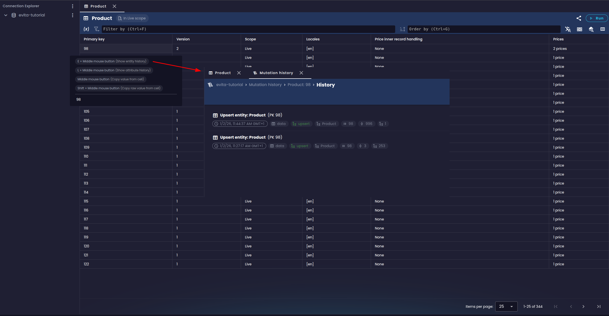

## Průchod historií změn v databázi

V levém menu na úrovni katalogu je nová položka **Mutations history**, která otevírá nový pohled na práci s daty.

V horní části obrazovky je vyhledávací pole, které umožňuje filtrovat záznamy podle různých kritérií:

- **Období od / do**: výběr časového období, ve kterém se transakce uskutečnily - rozhodný je čas potvrzení (*commit*) transakce
- **Typ mutace**: výběr typu operace - vložení (*upsert*), smazání (*remove*)
- **Typ entity**: výběr typu entity (tj. názvu kolekce entit), na kterou se operace vztahuje
- **Typ kontejneru**: výběr typu kontejneru, kterého se operace týkala - tj. zda šlo o entitu, její atribut, asociovaný údaj, relaci, cenu či relaci mezi entitami
- **Oblast změny**: výběr, zda se operace týkala datové oblasti (*data*), schématu (*schema*), či obojího (*both*)
- **ID entity**: vyhledávání podle konkrétního ID entity (zobrazí se pouze při výběru datové oblasti), umožňuje rychlé nalezení všech změn týkajících se konkrétní entity v čase

Pod filtrovacím panelem najdete seznam všech naposledy potvrzených transakcí seskupené podle transakcí od nejnovějších po nejstarší:

U každé transakce je zobrazen čas potvrzení, počet změn, velikost transakce v Bytech a tlačítko pro rozbalení detailů. Po kliknutí na tlačítko se zobrazí seznam jednotlivých mutací, které transakce obsahovala a zároveň odpovídají zadanému filtru. Tyto mutace lze často dále rozbalit pro zobrazení lokálních změn, které byly v rámci mutace provedeny. Například u mutace typu *upsert entity* se zobrazí lokální mutace tykající se jednotlivých atributů, cen a dalších "lokálních" částí entity.

Každá mutace umožňuje otevření dalšího pohledu, který zobrazuje historii odpovídající položky v čase. Například u mutace entity otevírá pohled na historii celé entity, kde lze vidět všechny změny, které se na entitě v čase udály, včetně změn jejích atributů, cen a dalších částí. U lokální mutace atributu se zase otevírá pohled na historii konkrétního atributu v dané entitě. Velmi snadno si tak lze udělat představu o tom, jak a kdy se daná položka měnila.

<Note type="info">

Vizualizace v případě asociovaných údajů je prozatím velmi zjednodušená a časem bychom chtěli doplnit možnost otevření obsahu asociovaného údaje v pravém panelu s možností vizualizace dat v různých formátech (text, JSON, MarkDown, HTML, atd.) jako tomu už je v přehledové tabulce entit.

</Note>

## Zobrazení historie změn z přehledové tabulky entit

Kromě hlavního pohledu na historii změn v levém menu je možné se k historii změn dostat i z přehledové tabulky entit. V současné době je tato funkce dostupná pouze díky klávesové zkratce, kterou je třeba stisknout při kliknutí na řádek v tabulce entit.

1. při současném držení klávesy **E** a kliknutím prostředního tlačítka myši (kolečka) na řádek v tabulce entit se otevře historie změn dané entity
2. při současném držení klávesy **L** a kliknutím prostředního tlačítka myši (kolečka) na buňky odpovídající lokálním kontejnerům (atribut, asociovaný údaj, cena, relace) se otevře historie změn daného kontejneru v dané entitě

<Note type="info">

I zde do budoucna plánujeme vylepšení uživatelského rozhraní, aby bylo možné historii změn otevírat přímo z kontextového menu řádku či buňky v tabulce entit.

</Note>

## Závěr

Nová funkce pro procházení a vyhledávání ve Write-Ahead logu v evitaLab přináší uživatelům možnost detailního sledování změn v databázi. Ačkoliv je nástroj v současné době v počáteční fázi vývoje, již nyní nabízí užitečné funkce pro auditování a analýzu dat.