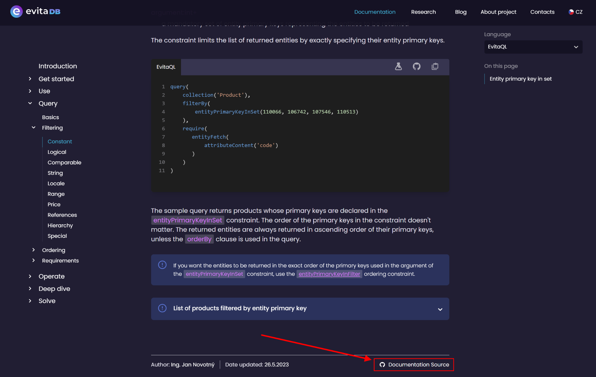
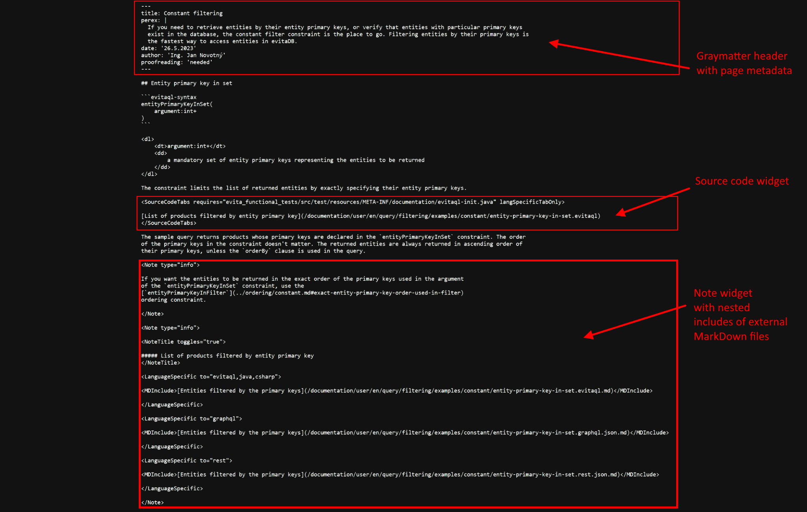
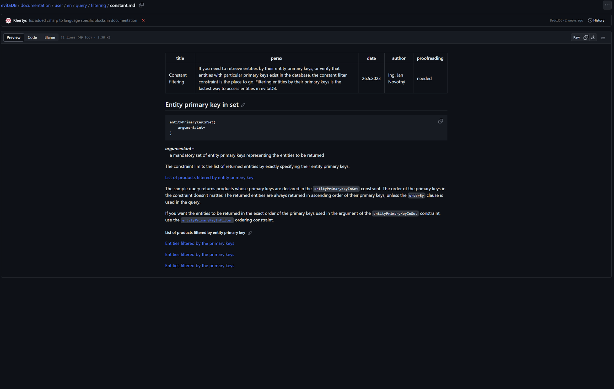
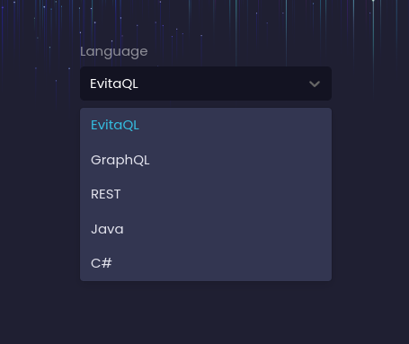
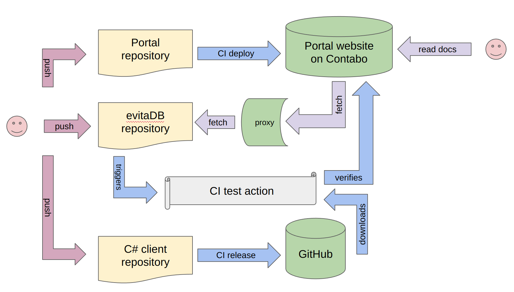

The technical documentation written by evitaDB developers requires a different approach than the documentation written 
by marketing or sales people. Developers are tied to their integrated development environment (IDE) and want it to be 
close and interlinked with the source code they are working on. They don't want fancy editors or to spend too much time 
on styling - plain MarkDown is usually the best choice for them. What they want is to have the documentation in the same 
repository as the source code, so that they can easily create a pull request and have the documentation reviewed by 
their colleagues. And they want to have the documentation reviewed, so that they can be sure that the documentation is
accurate and up to date.

Our documentation portal was heavily inspired by the [HashiCorp presentation](https://www.youtube.com/watch?v=4dqPA4FF15A)
and is built on top of the [Next.js](https://nextjs.org/) framework. It's hosted in different private repository and 
provides access to the documentation in the evitaDB repository located in the <SourceClass>documentation/user</SourceClass>
folder. It's written in a [MDX](05-building-documentation-portal.md#why-ive-chosen-nextjs--mdx) format, which is 
a combination of MarkDown and React, although the extension is named `.md`.

This combination allows us to make documentation interactive on our documentation portal, without preventing it from 
being displayed correctly in GitHub or other MarkDown viewers.

The documentation contains a lot of code examples that we need to keep up to date, compilable, executable and tested.
We decided to organise the documentation according to the environment / programming language the user will interact with
our database. This means that we have to port all the examples into several consumer languages - evitaQL, GraphQL, REST, 
Java or C#.

Currently, the number of examples is more than 6 hundred and it's growing. It would be cumbersome to maintain all 
variants manually. In most cases we only maintain one version of the example (usually the evitaQL) and the others are 
automatically generated by the 
<SourceClass>evita_functional_tests/src/test/java/io/evitadb/documentation/UserDocumentationTest.java</SourceClass> 
class. In addition to the porting examples, it executes the query against [demo dataset](https://demo.evitadb.io) and 
writes the result to another MarkDown file - as a result table or JSON snippet. The generated files are then committed 
to the repository along with the source example, and can be reviewed by other developers, and rendered by 
the documentation portal if a particular dialect is selected.

## Testing and verification

OK, we have written the documentation, we have generated the examples, but how can we be sure that the examples are 
correct? We need to test them regularly and check that they still produce the same results as when they were written. 
In this way we can also test the availability and correctness of the demo dataset, which is not entirely static, but 
also changes over time.

However, testing is quite a challenge. Each platform/language requires a different way of running the examples. Let's 
have a look at each of them:

1. The Java examples were quite challenging and their testing was documented in the [previous blog post](06-document-examples-testing.md)
2. evitaQL uses [Java Client](/documentation/use/connectors/java)
3. REST API uses simple HTTP client to make requests
4. GraphQL API uses simple HTTP client to make requests
5. C# examples use [C# Client](/documentation/use/connectors/c-sharp)

## Obstacles overcome

Lunch was not free. We had to overcome some obstacles to make it work. Let's have a look at them:

### MarkDown rich widget notation

We have tried to stick as closely as possible to the standard MarkDown notation, but have had to extend it a little to 
allow examples to be written in multiple languages. We take advantage of custom tags, which are then processed by our 
React components, but ignored by other MarkDown renderers such as GitHub. The design of all tags requires careful 
consideration and formatting.

### Github rate-limiting

We use the GitHub API to fetch the source code of the examples from the repository. The problem is that GitHub has a 
[rate-limiting policy](https://docs.github.com/en/rest/overview/resources-in-the-rest-api?apiVersion=2022-11-28#rate-limits),
which means that we can't fetch the source code of the examples too often. Due to the number of examples on each page, 
we often hit the limit. We had to implement a proxying mechanism that caches the source code of the examples locally and
only fetches it from GitHub if it's not available in the cache or if its [eTag](https://www.endorlabs.com/blog/how-to-get-the-most-out-of-github-api-rate-limits#conditional-requests-aka-etag) has changed, using the 
[conditional requests](https://docs.github.com/en/rest/overview/resources-in-the-rest-api?apiVersion=2022-11-28#conditional-requests) 
feature of GitHub.

### Links

Because the structure of the repository is different from the structure of the documentation portal, we had to implement 
special logic that translates the links in the documentation to the correct location relative to the documentation 
portal. We also identify the links that point to external resources and mark them with a special icon.

All links are designed to work in the evitaDB GitHub repository, and the documentation portal has to translate them to 
the correct location.

### C-Sharp client

The C# client lives in a separate [repository](https://github.com/FgForrest/evitaDB-C-Sharp-client) and has its own 
CI/CD pipeline. When this pipeline passes, the client is published to the NuGet repository and is available for 
download. The evitaDB CI/CD pipeline downloads the latest version of the client and uses it to execute the C# samples on 
the Linux platform via our JUnit extension <SourceClass>evita_functional_tests/src/test/java/io/evitadb/documentation/csharp/CShell.java</SourceClass>.
The client is run in a separate process and we take advantage of .NET multi-platform support and its ability to run on
Linux. The C# executable runs the examples against [the demo dataset](https://demo.evitadb.io) and generates the MarkDown to 
standard output, which is captured by the JUnit extension and compared against the expected content.

## Component & activity pseudo-diagram

The entire setup can be summarised in the following diagram:

As you can see, it's quite a complex process, but it was worth it. We have found a number of bugs in API design and 
consistency across platforms. We have a safety net of end-to-end testing across our entire stack, which is a huge
advantage when we want to refactor or change something.

## Examples interactivity

Another cool feature of our examples is the ability to run them directly from the documentation portal. Just take a look
at the video below:

    <video width="850" height="478" controls="controls">
      <source src="https://evitadb.io/download/evitaLab_example.mp4" type="video/mp4"/>
        Your browser does not support the video tag.
    </video>

Each example is stored in a separate file on GitHub and its location can be passed to an evitaLab instance running on 
the demo site, together with the evitaDB instance running on the demo dataset. The evitaLab instance then fetches the 
example from the GitHub repository, injects it into the code editor and automatically executes it against the demo 
dataset, displaying the result in a side panel.

In this way, the user can play with the example and modify it to see how it affects the result. We hope that this will 
help users understand the examples better and make it easier for them to get started with evitaDB.

## Conclusion

We hope the portal will help us keep the documentation up to date and accurate, and make it more accessible to you. 
It has already fulfilled its purpose and helped us find a number of bugs in the API design and implementation and learn 
a lot of new things. We believe it provides a solid foundation for the future development of the documentation portal 
and evitaDB itself.

We look forward to your feedback and suggestions.

<Note type="info">

The article is based on a lecture at the Czech jOpenSpace unconference, which took place in October 2023. You can watch
the recording of the lecture below (beware, it's in Czech):

    <iframe width="560" height="315" src="https://www.youtube.com/embed/kJuaVHHexNk?si=8Tseq9zqr3clGaJU" title="YouTube video player" frameborder="0" allow="accelerometer; autoplay; clipboard-write; encrypted-media; gyroscope; picture-in-picture; web-share" allowfullscreen></iframe>

</Note>
