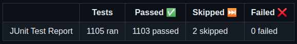

In 2023, evitaDB has moved from a research project to a production-ready database. We still have a lot of work to do, 
but we are very proud of what we have achieved so far. We support 5 different languages (Java, C#, GraphQL, REST, gRPC 
and evitaQL), all languages and clients have reached full feature parity with the Java client and are properly 
documented and covered by a suite of integration tests.

## Opening the source code via free license

At the beginning of this year the project was released under the [BSL 1.1 license](https://evitadb.io/documentation/use/license).
Although it's not technically an open source license, the terms of the license are very open and allow both commercial 
and non-commercial use of the database, access to the source code, and modification of the source code. The only 
restriction is that you cannot take the database and sell it to third parties as your own product. The license also 
automatically converts to the fully open source Apache 2.0 license after 4 years.

## Documentation portal

This year we also finished most of our documentation portal and wrote most of the documentation - the whole query 
language is now documented with special focus on the different behavior of the language in different languages. We 
estimate that the documentation has more than 250 pages of content and could be a book in itself. There is also a series 
on our blog that documents the obstacles and decisions behind our documentation portal:

1. [Building a Developer-friendly Documentation Portal with Next.js and MDX](https://evitadb.io/blog/05-building-documentation-portal)
2. [Discover the Advanced Features on our Developers Portal](https://evitadb.io/blog/07-advanced-features-on-developers-portal)

<Note type="info">

<NoteTitle toggles="true">

##### Can you guess how many examples do we have in our documentation?
</NoteTitle>

It is **over 1100**! And we keep adding more. Each example is automatically translated into other languages, so you as 
a developer only need to write the example in one language and have other languages generated for you. Each of these 
examples is also automatically tested by our CI/CD pipeline against our demo server at least once a week and after each
change to the documentation. This way we are sure that the examples are always up-to-date and work.

If you don't believe us, check out the results of our [documentation pipeline](https://github.com/FgForrest/evitaDB/actions/workflows/ci-dev-documentation.yml).

And we even blogged about it:

1. [Validating examples in documentation using JUnit 5 and JShell](https://evitadb.io/blog/06-document-examples-testing)
2. [Testable documentation](https://evitadb.io/blog/08-testable-documenation)

</Note>

## evitaLab

In fall we released our web console called [evitaLab](https://evitadb.io/blog/09-our-new-web-client-evitalab) which 
allows you to easily explore the database and write queries. The GraphQL and evitaQL editors support linting,
autocompletion and access to the documentation of the used constraints, and the GraphQL client is also context aware,
preventing you from writing invalid queries. All data is also accessible via grid view and can be easily drilled down 
via references to other entities. You can access all schema information and documentation directly from the web console.

We have big plans for evitaLab next year. We want to add support for editing data so you can use evitaLab as a full 
database client. We're working on an observability dashboard that will allow you to see database metrics, access 
the logs and dig into the performance of your queries. If the cooperation with [Faculty of Information Technology CTU in Prague](https://www.ciirc.cvut.cz/cs/) 
goes well, we might also add a REST editor with similar features as the GraphQL editor has now. Unfortunately there is 
no [LSP support for OpenAPI](https://github.com/OAI/OpenAPI-Specification/issues/1252) yet, so we're trying to fill 
the gap here.

Because we know how hard it is to maintain a backward-compatible GraphQL / REST API, we're planning to add new features
that will allow you to visualize the breaking changes in the API that are automatically generated from the database 
schema, and integrate those checks into your CI/CD pipeline.

## Dogfooding

This year we integrated evitaDB into our own Edee.ONE platform and created a brand new [Next.JS](https://nextjs.org/) 
storefront for all our future projects. There are several projects that will be released next year and we're very 
excited about them. We're gathering valuable feedback from our own developers and using it to improve the database and 
developer experience. We're also still working with students at the [University of Hradec Králové](https://www.uhk.cz/en/faculty-of-informatics-and-management/about-faculty) 
and preparing alternative demo implementations using [Vue.js](https://vuejs.org/) and 
[.NET Blazor](https://dotnet.microsoft.com/en-us/apps/aspnet/web-apps/blazor).

We are looking forward to the first operational statistics from our production deployments and will share the metrics 
and observations with all of you. All of this will allow us to find and fix bugs and improve the database so that you 
can use it with confidence in your own projects.

## evitaDB core

Very little work was done on the core of the database this year. Most of it was polishing existing features, fixing bugs,
and adding more and more tests. We're still not satisfied with the test coverage, and we're working on improving it, 
even though a lot of tests are not counted in our coverage report (for example, long-running fuzzy tests and 
documentation example tests).

<Note type="info">

<NoteTitle toggles="true">

##### Can you guess how many automated tests we run?
</NoteTitle>

Currently there are more than [4.6 thousand automated tests](https://github.com/FgForrest/evitaDB/actions/runs/7248057725/job/19743529706) 
that run about in a minute on our 6-CPU developer machines, but we'll reach 5 thousand tests soon. Another 1.1 thousand 
tests are in our documentation suite and another thousand tests are part of the C# client.

</Note>

We're finalizing our transactional system, the foundation of which was laid last year, introducing a write-ahead log 
that allows us to recover from a crash, and implementing CDC (change data capture) capabilities, for which we already 
have a working prototype for both gRPC streaming and GraphQL / REST WebSocket implementation. In Java we're using 
the [Java Flow API](https://docs.oracle.com/javase/9/docs/api/java/util/concurrent/Flow.html) and in C# we're using 
the [IObservable interface](https://learn.microsoft.com/en-us/dotnet/api/system.iobservable-1?view=net-8.0).

Transactions in evitaDB will have [SNAPSHOT isolation level](https://en.wikipedia.org/wiki/Snapshot_isolation) and will 
be implemented using MVCC (Multi-Version Concurrency Control). You as a customer will be able to control the conflict 
resolution, which directly affects the write performance of the database. We also plan to allow you to tune
the consistency level of the database so that you can choose the right level between eventual consistency and strong 
consistency for your scenario.

<Note type="info">

<NoteTitle toggles="true">

##### How large is the database source code?
</NoteTitle>

The manually written core of the database is about 18 thousand lines of code, but with the generated code for gRPC,
parser and tests it's 480 thousand lines of code (according to [Statistics plugin](https://plugins.jetbrains.com/plugin/4509-statistic)
in IntelliJ IDEA).

</Note>

We also plan to release the first stable version of the database next year and start working on the first version of 
a distributed database setup that will allow you to scale your database horizontally and improve the availability of 
your database. The planned setup will have a single master node and multiple read-only replicas with automatic failover. 
Replication between nodes will build on the CDC capabilities, which your application could also use to invalidate cache
entries or update live views of locally maintained datasets.

In addition to these plans, we are planning to implement a number of feature requests - such as 
[integrating histograms into a facet summary](https://github.com/FgForrest/evitaDB/issues/8), 
[integrating a hierarchy view into a facet summary](https://github.com/FgForrest/evitaDB/issues/352), 
[introducing bi-directional references](https://github.com/FgForrest/evitaDB/issues/260), and 
[integrating a full-text search](https://github.com/FgForrest/evitaDB/issues/258) or 
[grouping capabilities](https://github.com/FgForrest/evitaDB/issues/17).

In short, we've got a lot of work to do in the next year, and we're looking forward to it. We're also looking forward 
to your feedback and suggestions. If you have any, please let us know via [GitHub issues](https://github.com/FgForrest/evitaDB/issues/) 
or our [Discord server](https://discord.gg/VsNBWxgmSw). **Let's build the best storefronts and applications together!**

Merry Christmas and a Happy New Year from the evitaDB team!

<Table>
    <Thead>
        <Tr>
            <Th>Honza Novotný</Th>
            <Th>Lukáš Hornych</Th>
            <Th>Tomáš Pozler</Th>
            <Th>Miroslav Alt</Th>
        </Tr>
    </Thead>
    <Tbody>
        <Tr>
            <Td></Td>
            <Td></Td>
            <Td></Td>
            <Td></Td>
        </Tr>
    </Tbody>
</Table>