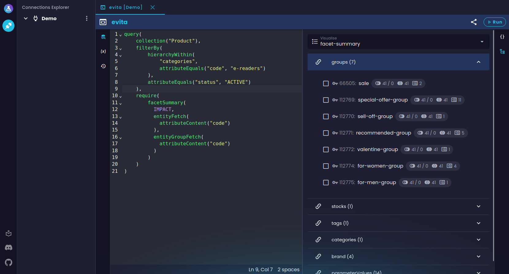
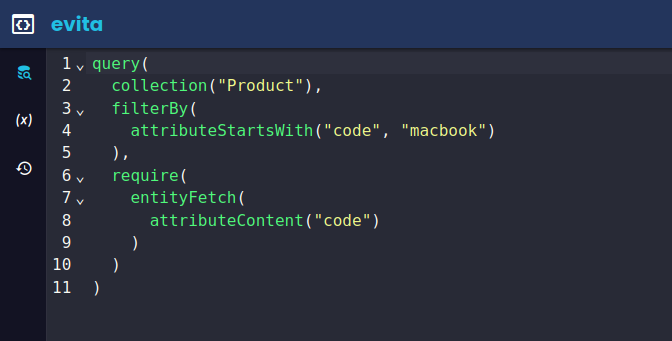
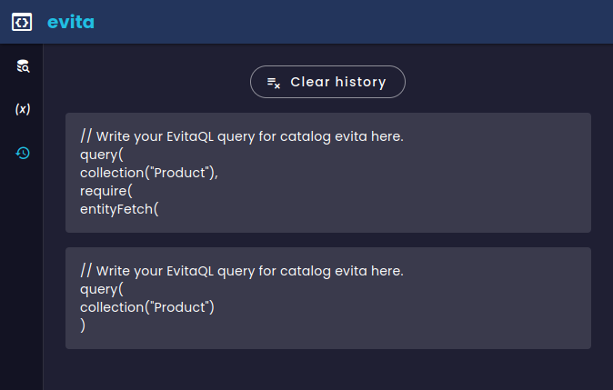

In [one of our previous blog posts](https://evitadb.io/blog/09-our-new-web-client-evitalab), we covered the initial
release of evitaLab. Since then, we've been running evitaLab internally on all of our new e-commerce applications using
the new evitaDB database, and so far, our developers are loving it. In fact, the original modest driving idea behind the
evitaLab, to help developers debug their evitaDB data from time to time, has become so critical to the workflow of our
newly developed e-commerce applications, that our developers cannot imagine working without it anymore.

## Our usage workflow

To get the most out of evitaLab, we automatically deploy it to all our test and development environments for all
applications running evitaDB. This is quite easy because we’ve taken advantage of the fact that evitaLab is already
embedded in the evitaDB server running on the required environments. This way, we can easily pre-configure evitaLab to
include the connection to the particular environment and deploy it to that environment.

This way, our developers can easily access evitaLab from the same URL as the application itself (just with a different port)
and access their dataset with one click. evitaLab is used both by our backend and frontend developers. Backend Java
developers primarily use it to debug their published data from our primary database using the entity grid. They also use
the evitaQL console to debug their backend Java queries. On the other hand, frontend developers primarily use it to debug
their GraphQL queries using the GraphQL console.

Of course, this is just a gist of how we currently use evitaLab, but it may give you an idea of how you can use it in
your own workflow.

## New features and bug fixes

Since the [initial release](https://evitadb.io/blog/09-our-new-web-client-evitalab), we've worked hard to fix existing
bugs and add planned features that our developers needed (and maybe you needed too) that didn't make it into the first
release.

### Entity grid

The entity grid (previously referred to as the data grid) as a whole remains almost the same, we just add new features
and polish it. As it turns out, it’s a really helpful tool for data debugging because it’s so quick to find the data
you’re looking for. The biggest additions to the entity grid are:

#### Reference attributes

The property selector now allows you to fetch not only entity references, but also [attributes on those references](https://evitadb.io/documentation/use/schema?lang=evitaql#reference)
(i.e. on the relation between the source and target entities, not on the target entities themselves).

It then fetches the attributes in additional columns next to the actual references. Each cell then contains attributes
for each reference in a single array. This isn’t an ideal solution, but there is not much room in such a flattened
structure like a table.

However, you can use the existing detail previewer by clicking on the cell, and easily preview each attribute for each
reference in full detail.

    <video width="850" height="478" controls="controls">
      <source src="https://evitadb.io/download/blog-12-entity-grid-reference-attributes.mp4" type="video/mp4"/>
        Your browser does not support the video tag.
    </video>

_Checkout the example [here](https://demo.evitadb.io/lab?sharedTab=N4IgLghgRgKgngBwKYgFwgCYUgWgOYBOAlhiADTjQAKEBEAtgM5qgDGA9gHadKthFcAkqXQYk9duRCtsEADbs8AOQYp0SAG5FIUpJ35g48ZGhBUC7DAFc+IAL4VIUACKyWIAI5WkBOABkITjwrCDw1EE1tCA85KQAzIjkwHwAhOFMpdgIxAjSMigwiRgQ5CDgkDHN2ZAJ+JGZUAG0QBGJ6WjgAaSR0imwwYigrZMZUDjEpAiQ4nz1WerHsJDwsonrJ6dnOeYBBMAGiIZHF5JXiBaycwU4AYSWz9IBdCgRQpABlIgAvNQAmAFYXm8lFZ6FAfGgAIx2OxAA)._

#### Prices

Prices are tricky to visualize because there are many of them and there is also the price for sale. Fortunately, you can
now preview all of the prices in the entity grid by simply selecting them in the property selector.

By default, price cells display the count of all prices in each entity.
When you [execute a filter query](https://evitadb.io/documentation/query/filtering/price?lang=evitaql#quick-guide-to-filtering-by-price)
to calculate prices for sale, each cell automatically displays the price for sale for quick preview.

However, the most important feature is hidden in the cell details. If you click on any cell with prices, you will see 3
sections in the detail window: basic entity price properties, calculated price for sale and the most important - a list
of all entity prices.

The price for sale section simply visualizes the evitaDB price object.

The list of prices, on the other hand, allows you not only to see all prices, but also to filter them in a way similar
to what you would do with actual evitaQL or GraphQL queries. You can filter the prices by price lists, just like using
the `[priceInPriceLists](https://evitadb.io/documentation/query/filtering/price#price-in-price-lists)`
constraint (even the order of selection is important as it defines the priority of the price lists). You can also filter
by currency as you would with the `[priceInCurrency](https://evitadb.io/documentation/query/filtering/price#price-in-currency)`,
and on top of that you can even filter by price ID and inner record ID (which is something you cannot do with evitaQL or 
GraphQL alone right now). And if you define price lists and currency in the filter, evitaLab will automatically calculate 
the price for sale for your filter and display the preview of the calculated price for sale as the first one in the list.

    <video width="850" height="478" controls="controls">
      <source src="https://evitadb.io/download/blog-12-entity-grid-prices.mp4" type="video/mp4"/>
        Your browser does not support the video tag.
    </video>

_Checkout the example [here](https://demo.evitadb.io/lab?sharedTab=N4IgLghgRgKgngBwKYgFwgCYUgWgOYBOAlhiADTjQAKEBEAtgM5qgDGA9gHadKthFcAkqXQYk9duRCtsEADbs8AOQYp0SAG5FIUpJ35g48ZGhBUC7DAFc+IAL4VIUACKyWIAI5WkBOABkITjwrCDw1EE1tCA85KQAzIjkwHwAhOFMEYlYkQU5zImy-IkYwRgAKAB0QKAhGAqqASjIAAkyCnM4AYSsCAj1WOEqQAFEAVQAlRql2AjECNNMpDGKEOQg4JAxzdmQCfiRmVABtEDb6WjgAaSR0imwwYigrZMZUDjEpNuzmAF0KBFCSAAykQAF5qABMAFZ-oClFZ6FAfGgAIx2OxAA)._

This allows you to easily debug your prices and price list priority without rewriting your queries.

### Data visualisers

Big new feature set is data visualization in evitaQL and GraphQL consoles. This is especially useful for newbies trying
to make sense of large extra result JSON documents.

We’re still missing visualization for entities and query telemetry, but we feel that these aren’t the most important
features right now. The reason is that entities don’t have such complex and large JSON objects like extra results, and
they’re pretty straightforward. Also, because of the graph-like fetching of referenced entities, it may be difficult to
visualize them properly, so we are still thinking about the right solution. As for query telemetry, it is indeed
difficult to read without visualization, but it’s not the most used feature of evitaDB right now.

The visualizations are available after you execute a query in an alternative panel to the raw JSON output. You can switch
between these panels in the navigation bar on the right side of the console.

There you will see a select component to select a query for visualization (in the case of GraphQL) and a select component
to select a query part to visualize.

#### Facet summary

One of the supported extra results that are supported in the visualizer is the [facet summary](https://evitadb.io/documentation/query/requirements/facet).
If you execute an evitaQL or GraphQL query with `[facetSummary](https://evitadb.io/documentation/query/requirements/facet#facet-summary)`
or `[facetSummaryOfReference](https://evitadb.io/documentation/query/requirements/facet#facet-summary-of-reference)`
require constraint, a facet summary visualization will be available in the visualization panel.

<Note type="warning">

<NoteTitle toggles="false">

##### GraphQL field aliases and visualizer
</NoteTitle>

Note that the GraphQL query supports field aliases, which effectively change the output JSON. This is something we’re
unable to work with in the visualizer at the time of writing this article. For now, you can’t use aliases in the facet
summary subtree, otherwise the visualizer won’t find it. We plan to support aliases as well, but it requires analyzing
the input query, which is a bit more complicated and time consuming than we are willing to invest right now.

</Note>

After executing the query, you will first see a list of all faceted references based on the used require constraint. 
Each item contains several useful numbers, which you can read more about in our [documentation](https://evitadb.io/documentation/query/requirements/facet#evitalab-visualization). If your faceted
references are grouped, you will see the actual groups on the second level of the list, and individual facets on the next 
level. If there are no groups for a particular reference, the facets are listed directly under the reference.

_Checkout the example [here](https://demo.evitadb.io/lab?sharedTab=N4IgLghgRgKgngBwKYgFwiQNwJaQI4A2AtAMYD2AdgM5kEoA040AChAE4QC2Vao5FFJCTDZKASQAmaEBKScyIRiQiQCZAOYA5LinRZcEEAF9GkKABEVh1KDwBXJGzjT7juAAoAOhQAEfn+QEdMKiFF4gzGxkEnbCniAAlPTe-j4AZtgEYI4AQh4pqf4AFtiO7CRFcADquCVhBYWF8crZ6mRspVTxyb6NhSpgHVB22QCi9hAEVOHkst0+8UhEbEgQsmxdiQ2FSdupA0MjSON2k9PxVJBgdpv0CyAAggDCMGIAaqPxCdu7vX4r9mwKy8f0KaQgJCQYAAynZOJx2PlQY0xABZZjPGA9Pr+JAUERgOAAMShFRBOP2YEG2GG2SelGy+Jm0SQXz2O2xFLxBLgAHEonYECSwGT2Y0DjSjvT8dzmXMtsidmKfN9QaqEooQJh2NhoHQeOhgAVvEZjEYgA)._

#### Hierarchy

The second important feature of evitaDB is the calculation of [hierarchy trees](https://evitadb.io/documentation/query/requirements/hierarchy)
for menus and navigation. There is a visualization for that too. 
If you use `[hierarchyOfSelf](https://evitadb.io/documentation/query/requirements/hierarchy#hierarchy-of-self)` or 
`[hierarchyOfReference](https://evitadb.io/documentation/query/requirements/hierarchy#hierarchy-of-reference)` require 
constraint, a hierarchy tree visualization will be available in the visualization panel.

<Note type="info">

<NoteTitle toggles="false">

##### Hierarchy field aliases and visualizer
</NoteTitle>

In the case of hierarchy visualization, there is a small exception to the field alias restriction for GraphQL. You can
use field aliases to name your hierarchies and the visualizer will render it correctly with your name.

</Note>

As you can see, you get a view similar to the facet summary visualization. You can browse through the individual 
hierarchies and directly see how your query affects the richness of each hierarchy tree.

_Checkout the example [here](https://demo.evitadb.io/lab?sharedTab=N4IgLghgRgKgngBwKYgFwiQNwJaQI4A2AtAMYD2AdgM5kEoA040AChAE4QC2Vao5FFJCTDZKASQAmaEBKScyIRiQiQCZAOYA5LinRZcEEAF9GkKABEVh1KDwBXJGzjT7juAAoAOhQAEP8gR0wqIU7gDkzGxkEnbCYQCU9N5+AGbYBGCOAEIeyX4+ABbYjuwkBXAA6rhFoXn5PmHKmepkbMVUYUm+9T4qYG1QdpkAovYQBFTh5LKdDRB2EqIJXT0+SAAeJAQL2BTqXt2rfQNDSKN245ON0UizYQDu2GxIdFRURAVIEBIIBZRIHXidXyQMOPlBfkSeWe9ieSAO9SKJTYZTgAHkUgAlJApRxICgkeHA-KNFRIFptAGdYl+BDsfFgSY0+phOnPCiMqpgAowT5PADK2CgBF26g6K1W+QZuDgADEkGAyu5jkLTgBhSiZDlTG4JKFg1ZUIUivZMg2S6VgOUKpUqwaZDUchk6mbxCGSyHM-WSlJRTiYshkMAIj0NKJB8WhnzMqUcmXyxUFZVgfqqh2a53XV3e0NUMBkBAAQWDdEwL3cAEY3RKPXmVNg89gSJM1QAJMQAGXMmOGmgA+mq0QBVTQweg+ACKQ+GmLEw3Mfd7MDEMAAmgPh6P3T1t+C8qDQYoQJh2NhoK9pMA8t4jMYjEA)._

#### Histograms

The last currently supported visualization extra results are histograms, both price and attribute histograms.
[Histograms](https://evitadb.io/documentation/query/requirements/histogram) allow you to nicely visualize large cardinality 
of values in a limited space. The actual JSON returned for visualization of histograms in your application isn’t as
complex as the other extra results. However, it is much harder to visualize in your head. 
If you use `[attributeHistogram](https://evitadb.io/documentation/query/requirements/histogram#attribute-histogram)` or 
`[priceHistogram](https://evitadb.io/documentation/query/requirements/histogram#price-histogram)` require constraint in
the query, a histogram visualization will be available in the visualization panel.

_Checkout the example [here](https://demo.evitadb.io/lab?sharedTab=N4IgLghgRgKgngBwKYgFwiQNwJaQI4A2AtAMYD2AdgM5kEoA040AChAE4QC2Vao5FFJCTDZKASQAmaEBKScyIRiQiQCZAOYA5LinRZcEEAF9GkKABEVh1KDwBXJGzjT7juAAoAOhQAEfn+QEdMKiFF4gzGxkEnbCniAAlPTe-j4AZtgEYI4AQh4pqT4IbNgkSGIUkaVIADLYVGBU4VAQVKXxSQWpxdUVAMJ2bGxIFCT5IACiAKoASh1dPp2+-sP22MNey90lZQAS9WAaHJzuAIwADAkLVxQJiiCY7NjQdDzowAXeRsZGQA)._

You will see the actual histogram as well as additional information for each bucket. If you then extend your query 
with a `[userFilter](https://evitadb.io/documentation/query/filtering/behavioral#user-filter)` that contains either 
`[attributeBetween](https://evitadb.io/documentation/query/filtering/comparable#attribute-between)` or
`[priceBetween](https://evitadb.io/documentation/query/filtering/price#price-between)` to simulate user selection, 
the visualization will take this into account and visualize the narrowed view as well.

_Checkout the example [here](https://demo.evitadb.io/lab?sharedTab=N4IgLghgRgKgngBwKYgFwiQNwJaQI4A2AtAMYD2AdgM5kEoA040AChAE4QC2Vao5FFJCTDZKASQAmaEBKScyIRiQiQCZAOYA5LinRZcEEAF9GkKABEVh1KDwBXJGzjT7juAAoAOhQAEfn+QEdMKiFF4gzGxkEnbCniAAlPTe-j4AZtgEYI4AQh4pqT4IbNgkSGIUkaVIADLYVGBU4VAQVKXxSQWpxdUVAMJ2bGxIFCT5IACiAKoASh3JvoV2VI4AYpnZbF6LhUUlZTlIYADuSCPuAKwADFf0PgDMN1cJXf4vOz6dH8P22MPbux6ZQAEvUwBoOJx3ABGZ6vd4JRQgTDsbDQOg8dDAAreIzGIxAA)._

### evitaQL language support

For the GraphQL console, we used an [existing library](https://github.com/graphql/graphiql/tree/main/packages/cm6-graphql#readme) for auto-completion and linting. However, since the evitaQL
language is our own, there is no support for it in the [CodeMirror](https://codemirror.net/) editor that we use. So we invested some time to
develop at least minimal [language support](https://www.npmjs.com/package/@lukashornych/codemirror-lang-evitaql) for the CodeMirror editor, so that it is not such a pain to write evitaQL
queries in evitaLab. Currently, we have at least basic auto-completion of all available constraints with basic 
documentation (without supported parameters yet).

_Checkout the entity grid example [here](https://demo.evitadb.io/lab?sharedTab=N4IgLghgRgKgngBwKYgFwgCYUgWgOYBOAlhiADTjQAKEBEAtgM5qgDGA9gHadKthFcAkqXQYk9duRCtsEADbs8AOQYp0SAG5FIUpJ35g48ZGhBUC7DAFc+IAL4VIUACKyWIAI5WkBOABkITjwrCDw1EE1tCA85KQAzIjkwHwAhOFNsMGIoK2SAZUgCMEYAdW0ACwAKAB1pSyRasgACWvoIVih2dgBrWoBKKXYCMQI0jLAsohzklTArOjkaurFGpoBBPIBhAYoMIkYEOQg4JAxzdmQioiRmVABtEARiNt8AaSR0igUZORupeTkfnYPz+FCeRFYSEE3B8ACVeEMMAAJQIYOREIL-CbZXI3VAySAKZRWehQHxYybTPGMSBzZgUTI45KMfH1ClMvFIQJScGQ5gAXTBoSQeSIAC81AAmACsQrCShJZIIaAAjHY7EA) and the evitaQL console [here](https://demo.evitadb.io/lab?sharedTab=N4IgLghgRgKgngBwKYgFwiQNwJaQI4A2AtAMYD2AdgM5kEoA040AChAE4QC2Vao5FFJCTDZKASQAmaEBKScyIRiQiQCZAOYA5LinRZcEEAF9GkKABEVh1KDwBXJGzjT7juAAoAOhQAEP8gR0wqIUXiDMbGQSdsKeIACU9N5+AGbYBGCOAEIeyX4+KmBs2FB2mQDKkGxgVADquAAWYeSycfQ+cZwQJFBkZADWcfF5iXlsSPbY416++UgUImBwAGJIYCRNefkFYEUlZUgAwpSZC81RSENbPsOzt-GKIJjs2NB0POjAed5GxkZAA)._

There is also a very simple linter to check things like missing commas or the structure of the query root, and other 
little things like syntax highlighting, folding, or automatic indentation. Even this basic support has been invaluable 
when writing queries. Of course, we plan to make the support more sophisticated, but unfortunately that’s quite 
time-consuming.

### Sharing tabs between browsers

Tab sharing between developers is something we’re very excited about. A lot of the time our frontend and backend 
developers share their queries via a messaging application by copying and pasting entire queries into the chat, 
just to debug some parts of the queries. This leads to cluttered chat conversations and communication errors when 
the same developers are working on multiple projects with different evitaDB server instances. That’s why we hope this 
feature will greatly improve communication between developers and save them some time and nerves.

You can easily share any tab with current data by sharing a link to with the other developer. An actual link targets the 
same evitaLab instance as yours and your data with properly set up evitaDB connection, catalog selection and so on. The
receiving developer doesn't have to worry about choosing the right server, the right connection and so on anymore. All 
of this is embedded in the link.

<Note type="info">

As you can see, we’ve used this feature even in this article to show you custom examples that aren’t in our documentation.
You can use this feature in a similar way e.g. in your own documentation, for example, by pointing to your demo instance
to demonstrate your domain-specific queries.

</Note>

Checkout the entire workflow in our short showcase video:

    <video width="850" height="478" controls="controls">
      <source src="https://evitadb.io/download/blog-12-sharing-tabs.mp4" type="video/mp4"/>
        Your browser does not support the video tag.
    </video>

### Storing last session

When it comes to restoring your workspace after some time, the absence of recently opened tabs and executed queries can
be quite annoying. Especially if you have large queries that you can’t remember. With the new evitaLab you don’t have 
to worry about that anymore. Just close or refresh your tab or browser and evitaLab will restore all of your tabs from 
the last session.

    <video width="850" height="478" controls="controls">
      <source src="https://evitadb.io/download/blog-12-storing-session.mp4" type="video/mp4"/>
        Your browser does not support the video tag.
    </video>

However, there are two exceptions where this doesn’t happen, and for good reason.

The first exception is when you open a shared link that points to the same evitaLab. This is because the link will be 
always be opened in a new browser tab, even if you already have the same evitaLab instance already open, and when you 
open a such link (e.g. for a quick look) you don’t want your entire session to be restored as well (there may be 10 tabs
in your last session). Another concern is that you might accidentally close your primary session before this new one and
overwrite it with data from a shared tab. Or you could open multiple links with shared tabs, and again, you probably 
don’t want to restore your session for every link you open.

The session exception is when you open a query example from our documentation. The reasoning is the same as for the 
shared tabs link.

### Query history

Similarly useful to the session transfer is the query history with the ability to browse through previously executed 
queries. We’ve implemented query history in all tabs that support queries, i.e. evitaQL console, GraphQL console and 
entity grid.

Both consoles have separate panel to switch queries with variables in one go.

Each combination of connection + catalog has its own list of history records to avoid mixing different data.

Entity grid has separate histories for both filter and order parts of a query. The history for each input can then be 
opened via the preceding icon or with Alt+↓ (or Option+↓ for Mac).

Similar to consoles, each combination of connection + catalog + collection + filter/order has its own list of history
records to avoid mixing different data.

### Other small features and bug fixes

* we switched to calendar versioning from semantic versioning
* code editor have status bar with line, column, and caret information
* we fixed too long entity grid cell values occupying entire screen
* entity grid now displays selected data locale its in header
* there is a new keyboard shortcut Ctrl+F to focus the search input in the entity grid property selector
* new evitaDB attribute uniqueness types are displayed in detail in attribute flags
* filterable attribute flag has now note if the filtering is implicit for unique attributes
* there are now tooltips for connections, catalogs and collections in explorer
* and other UI improvements and fixes

There were many more small bug fixes along the way but these are the most important ones.

## Planned features in near future

We still have a lot of ideas in mind, but we cannot do everything at once. Currently, we are planning to open these issues:

- [status info screen for evitaDB servers](https://github.com/lukashornych/evitalab/issues/103)
- [screen with keyboard shortcuts](https://github.com/lukashornych/evitalab/issues/110)
- [quick access to explorer item actions](https://github.com/lukashornych/evitalab/issues/98)
- [time machine for new upcoming evitaDB catalog versioning features](https://github.com/lukashornych/evitalab/issues/95)

And [many more](https://github.com/lukashornych/evitalab/issues).

## Contribution

Like the last time, if you feel confident, feel free to report a bug or submit a PR on our [GitHub](https://github.com/lukashornych/evitalab) with any 
improvements. Any input is greatly appreciated, even small things like fixing typos or writing new tests.
