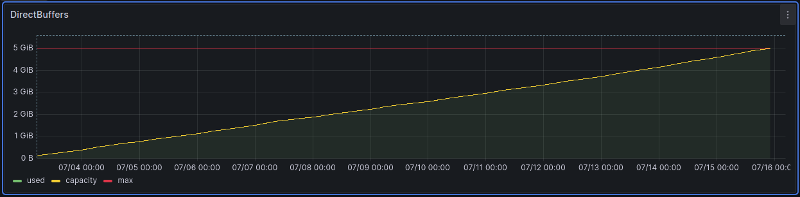

[Armeria server](https://armeria.dev/) is a Java microservices framework built on top of Netty by members of the Netty team, developed in
South Korea and Japan. It wraps quite complex Netty server API into much simpler one and also solves some quite hard 
problems we will talk about in this article. Armeria framework targets similar area as [Quarkus](https://quarkus.io/) or
[Micronaut](https://micronaut.io/) frameworks, but is still straightforward to use as a low-level asynchronous server 
without any "annotation magic" and that's what we needed.

## Why Armeria?

First, we looked for a solution to provide gRPC to web clients. gRPC is a binary protocol on top of HTTP/2 that cannot 
be consumed directly from rich JavaScript applications (e.g., from the browser). It requires a special gRPC web proxy 
that translates gRPC calls into JSON format between the client and the server. By having such a proxy, we could avoid 
creating a new layer for our [evitaLab](12-evitalab-after-6-months.md) tooling, and we could implement all necessary 
services in the gRPC protocol, which in turn greatly enhances the possibilities of the Java client and other clients in 
the future.

Second, we wanted to have a single server for all our APIs. We have a REST API, a gRPC API and a GraphQL API. A single 
server will save a lot of resources because all the thread pools, sockets, buffers, etc. can be shared between all 
the APIs. It would also allow us to use a single port for all services if we wanted to, which is not possible in our
current setup.

Last but not least, we wanted a server that was easy to use, had good performance, and was actively developed. 
The asynchronous reactive Netty server is a good choice that promises good enough performance and the Armeria team is 
very active and helpful on their [Discord](https://armeria.dev/s/discord) channel. Such good support is not very common
these days.

## What we have with Armeria

By migrating to Armeria, we can now provide all our APIs and services on a single port, which is a huge simplification. 
Of course, we can change this in the configuration and run each API on a separate port, but we now have complete freedom 
over the port layout.

This fact also requires us to be able to run both TLS and non-TLS traffic on the same port, which was not possible 
before. Armeria can do this out of the box, and it can also automatically generate self-signed certificates for us. 
Our default API layout now looks like this:

- `https://server:5555/rest/**` - REST API, TLS only
- `https://server:5555/gql/**` - GraphQL API, TLS only
- `https://server:5555/**` - gRPC API, TLS only
- `http://server:5555/system/**` - system API, non-TLS only
- `http://server:5555/observability/**` - observability API, non-TLS only

We can also switch any API to *relaxed* mode, which will work on both TLS and non-TLS traffic on the same port and path,
depending on what the client requests. This is invaluable for testing and development purposes, although we don't 
recommend using relaxed* mode in production.

Another major improvement was made to our gRPC API. The existing gRPC API can now be consumed directly from web browsers 
thanks to the gRPC web proxy embedded in Armeria. There is also "automated" gRPC documentation and test tools for gRPC 
API provided by Armeria, which is very useful for development and testing. We are considering to integrate this service 
directly into our evitaLab, so that we have all testing tools for all our APIs in one place.


We've also rewritten our Java client to use the Armeria client instead of the plain Java gRPC client. Its API is much 
simpler and more powerful than the original. We're looking forward to discovering all the possibilities it offers, 
as we've only scratched the surface.

## Asynchronous request processing trap

The migration to Armeria was not without its problems. When you implement 
[HttpService](https://github.com/line/armeria/blob/main/core/src/main/java/com/linecorp/armeria/server/HttpService.java), 
the serve method is executed inside the event loop thread. Even the parsing of the request body is done asynchronously, 
so you can't just block and wait for the request body in the serve method. This was a fundamental change from the logic 
we originally implemented for Undertow, but the [Armeria team helped us out](https://discord.com/channels/1087271586832318494/1087272728177942629/1253656914106253374).

The key to solving this problem is to use `HttpResponse.of(CompletableFuture<> lambda)`, which allows you to defer 
request processing to a point when the request body is available, and chain the processing logic in a non-blocking way.

A similar trap was waiting for us in the gRPC protocol implementation. Unlike the standard gRPC implementation you're 
used to from the standard Java gRPC server, you need to delegate method handling to a separate thread pool. 
Unfortunately, you cannot read this in the available documentation and you have to go to 
[Armeria gRPC examples](https://github.com/line/armeria-examples/blob/414fe5aedd0cba7a3e24c57437a622e7a8d76fed/grpc/src/main/java/example/armeria/grpc/HelloServiceImpl.java#L53-L59) where you can dig it out from one of the examples.

Armeria's documentation on the web is [very short](https://armeria.dev/docs) and we recommend that you go through 
the examples in the [Armeria GitHub repository](https://github.com/line/armeria-examples/) to learn more details.

## Dynamic routing

Another problem we had to solve was dynamic routing. We have a lot of endpoints that are not known at compile time, 
but are dynamically set up at runtime according to database schemas. We assume this could be handled by 
the [Server#reconfigure](https://github.com/line/armeria/blob/main/core/src/main/java/com/linecorp/armeria/server/Server.java) 
method, but in the first release we ported the Undertow PathHandler implementation and used our existing logic to handle 
dynamic routing in Armeria. It was not ideal, but it worked. There is an [open issue](https://github.com/line/armeria/issues/5758)
which might help us get rid of remnants of the old implementation in the future.

## Jigsaw is still a problem in 2024

evitaDB is completely modularized with Java 9 modules. But this fact complicates our life from the beginning. Armeria 
was not modularized and implemented [automatic modules](https://medium.com/technowriter/heres-a-cool-java-9-feature-automatic-module-name-2746641ebb7)
at our request. Although this works fine with the Javac compiler and Maven, IntelliJ IDEA, which we use for development, 
still has [some bugs](https://youtrack.jetbrains.com/issue/IDEA-353903) in its implementation of Java 9 modules and 
refused to compile the project. Fortunately, we've found a workaround and helped ourselves by manually excluding 
`module-info.java` files from compilation. Let's hope IDEA will fix these bugs soon.

It's unfortunate that Jigsaw is still a problem in libraries and tools in 2024 - more than 7 years after its release.

## Summary

Although the migration brings some incompatible changes in server configuration, we believe Armeria has a great future
and is the right choice for evitaDB and it's development. The new version is already merged into the `dev` branch and 
will be released as version `2024.10` next month.

We've also done a round of [performance testing](https://jmh.morethan.io/?gists=12e66215ecb97d9517c9c1307155691d,fe5d763616a5ef11be471d771a8d6d0b&topBar=Armeria%20vs.%20Undertow%20evitaDB%20API%20performance%20results) where 
the Armeria implementation was slightly slower (except for REST) than the original Undertow implementation. We need to
investigate this further, as the REST results are quite surprising and there's a chance we may have missed something in 
other API implementations. The performance penalty is not significant to stop the migration now, but we will keep an eye
on it in the future.

Our current implementation based on Undertow also has problems with direct memory leaks in Undertow itself. This can be
easily demonstrated with this graph from the [Grafana](https://grafana.com/) monitoring tool:



Accompanied by this corresponding stack trace:

```
A channel event listener threw an exception
java.lang.OutOfMemoryError: Cannot reserve 16384 bytes of direct buffer memory (allocated: 5368695181, limit: 5368709120)
	at java.base/java.nio.Bits.reserveMemory(Bits.java:178)
	at java.base/java.nio.DirectByteBuffer.<init>(DirectByteBuffer.java:121)
	at java.base/java.nio.ByteBuffer.allocateDirect(ByteBuffer.java:332)
	at io.undertow.server.DefaultByteBufferPool.allocate(DefaultByteBufferPool.java:149)
	at io.undertow.server.protocol.http.HttpReadListener.handleEventWithNoRunningRequest(HttpReadListener.java:149)
	at io.undertow.server.protocol.http.HttpReadListener.handleEvent(HttpReadListener.java:136)
	at io.undertow.server.protocol.http.HttpOpenListener.handleEvent(HttpOpenListener.java:162)
	at io.undertow.server.protocol.http.HttpOpenListener.handleEvent(HttpOpenListener.java:100)
	at io.undertow.server.protocol.http.HttpOpenListener.handleEvent(HttpOpenListener.java:57)
	at org.xnio.ChannelListeners.invokeChannelListener(ChannelListeners.java:92)
	at org.xnio.ChannelListeners$10.handleEvent(ChannelListeners.java:291)
	at org.xnio.ChannelListeners$10.handleEvent(ChannelListeners.java:286)
	at org.xnio.ChannelListeners.invokeChannelListener(ChannelListeners.java:92)
	at org.xnio.nio.QueuedNioTcpServer2.acceptTask(QueuedNioTcpServer2.java:178)
	at org.xnio.nio.WorkerThread.safeRun(WorkerThread.java:624)
	at org.xnio.nio.WorkerThread.run(WorkerThread.java:491)
```

We hope that Armeria will not have such problems and allow us to focus on developing our services and not on web server 
problems.
