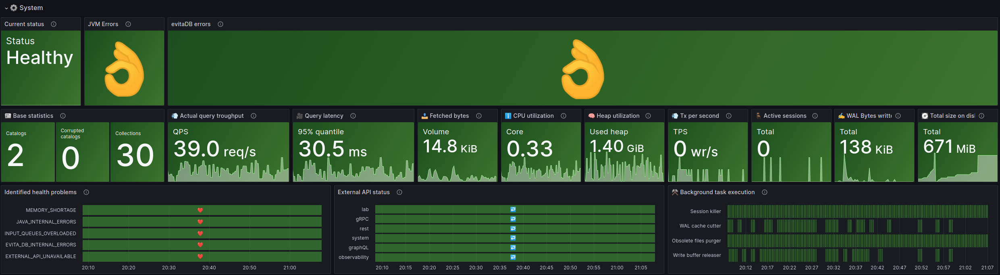
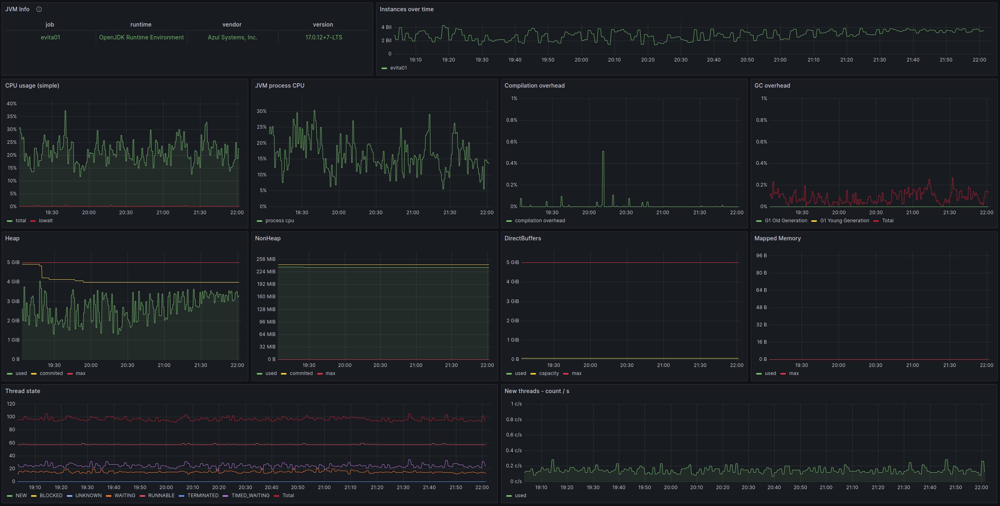
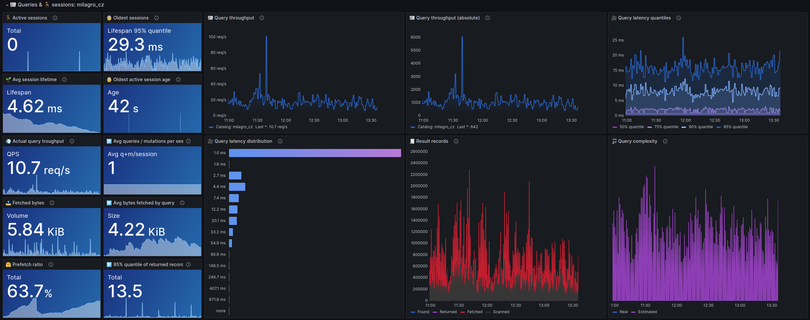

Metrics are the key part of the observability domain and represent one of the main sources of information for 
reliability engineers ([SRE](https://en.wikipedia.org/wiki/Site_reliability_engineering)). evitaDB produces 
[quite a lot of metrics](https://evitadb.io/documentation/operate/observe?lang=java#metrics) in the form of 
[Prometheus text format](https://prometheus.io/docs/instrumenting/exposition_formats/), which is being standardized as 
[Open Metrics format](https://github.com/OpenObservability/OpenMetrics). This format is easily ingested by most popular 
monitoring and observability tools such as [Grafana](https://grafana.com/), 
[Victoria Metrics](https://victoriametrics.com/), or [Datadog](https://www.datadoghq.com/).

We use Grafana and Victoria Metrics for metrics scraping and visualization internally, so we have a dashboard that 
captures all the critical information already at disposal. In this article, we want to show you what this dashboard 
looks like, what graphs it contains, and how they are constructed. You can also download the JSON configuration for 
the dashboard and import it into your Grafana instance to quickly bootstrap your own.

## The Big Picture: High-Level Metrics Visualization (⚙️ System)



First block of graph aggregates key metrics in a simplified way. First graph is a *Current status*, which tells you, 
whether the database is healthy or unhealthy base on the last response of the [liveness probe](https://evitadb.io/documentation/operate/observe#liveness-probe).
If there is any problem, the graph turns red and displays the type of the problem.

```promql
io_evitadb_probe_health_problem{host="$host", job="$job"}
```

Next graph *JVM Errors* displays a counter of internal JVM errors including their short name. Only `java.lang.Error` are
tracked here, so if any of such an error occur or repeats, the database is worth restarting.  

```promql
jvm_errors_total{host="$host", job="$job"}
```

The JVM graph is followed by *evitaDB errors* graph that displays a counter of evitaDB internal errors. It tracks all
the exceptions that are not caused by inappropriate handling from the client side, but rather by the unexpected situation
in the server implementation. Most of such errors are recoverable ones, but they should be tracked carefully and reported
to the evitaDB team for consultation:

```promql
io_evitadb_errors_total{host="$host", job="$job"}
```

*Base statistics* panel contains overall information about database contents - how many catalogs are loaded, how many
of those catalogs are corrupted (unusable) and how many collections were found inside loaded catalogs. This information
should inform you about the gross size of the database.

<Note type="info">

Most of the graphs in this big picture view are clickable, which brings you a more detailed view or specialized graph
related to a particular metric.

</Note>

```promql
sum(last_over_time(io_evitadb_storage_evita_dbcomposition_changed_catalogs{host="$host", job="$job"}) != 0 or vector(0))
sum(last_over_time(io_evitadb_storage_evita_dbcomposition_changed_corrupted_catalogs{host="$host", job="$job"}) != 0 or vector(0))
sum(last_over_time(io_evitadb_storage_catalog_statistics_entity_collections{host="$host", job="$job"}) != 0 or vector(0))
```

Panel *Actual query throughput* shows the last known throughput of queries per second.

```promql
sum(rate(io_evitadb_query_finished_total{host="$host", job="$job"}[$__interval]))
```

And the graph *Query latency* next to it displays the time interval within which 95% of all queries to the database are 
processed.

```promql
histogram_quantile(0.95, sum(rate(io_evitadb_query_finished_duration_milliseconds_bucket{host="$host", job="$job"}[$__interval])) by (le))
```

<Note type="info">

The number is not totally precise because it's calculated from histogram information that contains only a limited number
of discrete thresholds.

</Note>

The panel *Fetched Bytes* summarizes how many Bytes are currently being read from disk. Since evitaDB is keeps all 
the search indexes in memory, fetches represent only those bodies of selected entities that are not trapped in 
the database cache.

```promql
rate(sum(increase(io_evitadb_query_finished_fetched_size_bytes_sum{host="$host", job="$job"}[$__interval])))
```

Graph *CPU Utilization* tracks how many host machine cores are occupied by evitaDB processing. If your host has 8 CPUs
and evitaDB has 0.34 CPU Utilization, it means that it consumes total of *0.34 * 8 = 2,72%* of the system CPU resources.

```promql
rate(process_cpu_seconds_total{host="$host",job="$job"}[$__interval])
```

*Memory utilization* graph displays how much of the memory dedicated to evitaDB process was actually used at the moment
of the last scrape. JVM has allocated more memory than this, but this value displays how much memory is actively consumed
by data structures of evitaDB.

```promql
sum(last_over_time(jvm_memory_used_bytes{host="$host",job="$job"}[$__interval]))
```

Next panel *Tx per second* tells you how many transactions system handles per second (either committed or rolled back).

```promql
sum(rate(io_evitadb_transaction_transaction_finished_total{host="$host", job="$job"}[$__interval]))
```

It's followed by *Active sessions* panel that tells you how many sessions are active right now.

```promql
sum(last_over_time(io_evitadb_session_closed_active_sessions{host="$host", job="$job"}[$__interval]))
```

The panel *WAL Bytes written* displays how many data were written by committed transactions to the Write-Ahead-Log 
over the selected period of time.

```promql
sum(increase(io_evitadb_transaction_transaction_appended_to_wal_appended_wal_bytes_total{host="$host", job="$job"}))
```

Finally, the panel *Total size on disk* visualizes a how large portion of disk space is occupied by the evitaDB files.

```promql
sum(last_over_time(io_evitadb_storage_catalog_statistics_occupied_disk_space_bytes{host="$host", job="$job"}) or vector(0) != 0)
```

Last row tracks information from the [liveness](https://evitadb.io/documentation/operate/observe#liveness-probe) and 
[readiness]((https://evitadb.io/documentation/operate/observe#readyness-probe)) probes in more detail. The panel
*Identified health problems* contains time flow visualizing period of times when certain health problems occurred.
Look for the periods with ☠️ instead of ❤️ icon.

```promql
io_evitadb_probe_health_problem{host="$host", job="$job"}
```

And the *External API Status* visualizes the observed availability of each of the database's enabled web APIs. Again
look for periods marked by ❌ instead of ↩️ icon.

```promql
io_evitadb_probe_api_readiness{host="$host", job="$job"}
```

Last panel *Background task execution* collect occurrences of system background tasks executions allowing to detect
excessive number of operations.

```promql
sum(
  increase(io_evitadb_system_background_task_started_total{host="$host", job="$job", catalogName=~"$catalogName|N/A"}[$__interval])
  -
  increase(io_evitadb_system_background_task_finished_total{host="$host", job="$job", catalogName=~"$catalogName|N/A"}[$__interval])
) by (taskName)
+
sum(
  (increase(io_evitadb_system_background_task_started_total{host="$host", job="$job", catalogName=~"$catalogName|N/A"}[$__interval]))
    and
  (
    increase(io_evitadb_system_background_task_started_total{host="$host", job="$job", catalogName=~"$catalogName|N/A"}[$__interval])
    -
    increase(io_evitadb_system_background_task_finished_total{host="$host", job="$job", catalogName=~"$catalogName|N/A"}[$__interval])
  ) == 0
) by (taskName)
```

## 💻 JVM metrics



Two most important panels are *CPU usage* and *JVM process CPU*. 

The first shows overall CPU utilization on the host machine:

```promql
## CPU UILIZATION
sum(rate(node_cpu_seconds_total{host="$host",mode!="idle"}[$__interval])) / count(count by (cpu)(node_cpu_seconds_total{host="$host"}))
## IO WAIT
sum(rate(node_cpu_seconds_total{host="$host",mode="iowait"}[$__interval])) / count(count by (cpu)(node_cpu_seconds_total{host="$host"}))
```

... while the second one focuses on the utilization attributed solely to the process of evitaDB:

```promql
rate(process_cpu_seconds_total{host="$host",job="$job"}[$__interval])
```

Next panels visualize *Compilation overhead*:

```promql
rate(jvm_compilation_time_seconds_total{host="$host",job="$job"}[$__interval])
```

... and *GC overhead* (garbage collection) share on the process CPU utilization attributed to different GC types:

```promql
## line per type of GC
sum by (gc) (rate(jvm_gc_collection_seconds_sum{host="$host",job="$job"}[$__interval]))
## total consumption by GC
sum by () (rate(jvm_gc_collection_seconds_sum{host="$host",job="$job"}[$__interval]))
```

The next row is dedicated to the JVM memory consumption. First panel *Heap* tracks heap limits and current allocations / 
usage:

```promql
## USED MEMORY
sum(avg_over_time(jvm_memory_used_bytes{host="$host",job="$job"}[$__interval]))
## COMMITTED MEMORY
sum(avg_over_time(jvm_memory_committed_bytes{host="$host",job="$job"}[$__interval]))
## MEMORY LIMITS (XMX)
sum(avg_over_time(jvm_memory_max_bytes{host="$host",job="$job"}[$__interval]))
```

Next three panels track different parts of *Non-heap memory*:

```promql
## USED MEMORY
avg_over_time(jvm_memory_used_bytes{host="$host",job="$job",area="nonheap"}[$__interval])
## COMMITTED MEMORY
avg_over_time(jvm_memory_committed_bytes{host="$host",job="$job",area="nonheap"}[$__interval])
```

Memory consumed by *Direct Buffers*:

```promql
## USED MEMORY
avg_over_time(jvm_buffer_pool_used_bytes{host="$host",job="$job",pool="direct"}[$__interval])
## COMMITTED MEMORY
avg_over_time(jvm_buffer_pool_capacity_bytes{host="$host",job="$job",pool="direct"}[$__interval])
## MEMORY LIMITS (XMX)
avg_over_time(jvm_memory_max_bytes{host="$host",job="$job",area="heap"}[$__interval])
```

And finally *Mapped memory*:

```promql
## USED MEMORY
avg_over_time(jvm_buffer_pool_used_bytes{host="$host",job="$job",pool="mapped"}[$__interval])
## COMMITTED MEMORY
avg_over_time(jvm_buffer_pool_capacity_bytes{host="$host",job="$job",pool="mapped"}[$__interval])
```

Last row visualizes information about threads in the JVM process. First, monitors the count of threads by *Thread states*:

```promql
## INDIVIDUAL STATES TRACKING
sum by (state) (avg_over_time(jvm_threads_state{host="$host",job="$job"}[$__interval]))
## TOTAL
sum by () (avg_over_time(jvm_threads_state{host="$host",job="$job"}[$__interval]))
```

The second, tracks how many *New threads* are being created:

```promql
rate(jvm_threads_started_total{host="$host",job="$job"}[$__interval])
```

## 📰 Queries & 🪑 sessions



This dashboard reveals details about a query processing the database engine performs. It's divided into two parts:

1. the left side visualizes simplified metrics aggregated into a simple numbers
2. the right side contains detailed graphs for key metrics and their development over time

Panel *Active sessions* displays the number of active sessions at the moment of the last scrape aggregated across all
selected catalogs, hosts, and jobs:

```promql
sum(last_over_time(io_evitadb_session_closed_active_sessions{host="$host", job="$job", catalogName=~"$catalogName"}[$__interval]))
```

The high number of clients actively talking to the database signalizes high load on the system.

The panel *Old session lifetime* shows the 95% quantile duration a session is active before it's closed. I.e. it shows
how long the oldest sessions were active before they were closed (95% quantile still excludes the outliers):

```promql
histogram_quantile(0.95, sum(rate(io_evitadb_session_closed_duration_milliseconds_bucket{host="$host", job="$job", catalogName=~"$catalogName"}[$i])) by (le))
```

And the next panel *Avg session lifetime* shows the average session lifetime for all recorded sessions (and should be
considerably lesser than the 95% quantile):

```promql
sum(io_evitadb_session_closed_duration_milliseconds_sum{host="$host", job="$job", catalogName=~"$catalogName"}[$__interval]) / sum(io_evitadb_session_closed_duration_milliseconds_count{host="$host", job="$job", catalogName=~"$catalogName"}[$__interval])
```

In *Oldest active session age* you'll find the age of the oldest active session in the system. The panel shows the last
non-zero number observed, and if you look at the graph in the panel it may have been already closed. If you observe
the session is still active and its age is continuously growing, it may indicate a problem. The server  
automatically kills inactive sessions, so if this number is growing, it signalizes there is a client that continuously
holds the session open and actively uses it. evitaDB is designed to operate best with short-lived sessions, so you want
to keep this number low (minutes at most).

```promql
time() - io_evitadb_session_closed_oldest_session_timestamp_seconds{host="$host", job="$job", catalogName=~"$catalogName"}[$__interval]) unless io_evitadb_session_closed_oldest_session_timestamp_seconds{host="$host", job="$job", catalogName=~"$catalogName"} == 0
```

<Note type="warning">

The oldest active session age is updated at the session close. I.e. if no other there is only one active session, which
is also the oldest one, you will not see its age growing. The age will be updated only when the session is closed. Usually,
it's not a problem, because the system will handle a lot of short-lived sessions, that will accurately reflect the
oldest session age when they are closed.

</Note>

The panel *Actual query throughput* shows the last known throughput of queries per second and its simplified development
over time:

```promq 
sum(rate(io_evitadb_query_finished_total{host="$host", job="$job", catalogName=~"$catalogName"}[$i]))
```

The next panel *Avg queries / mutations per session* shows the average number of queries and mutations executed in a single
session. It's a good indicator of how much work is done in a single session. If you see this number very low, it means
that clients open a session for a low number of operations (for example one query per session), which is not optimal 
from the database performance perspective. Although the session is lightweight, it still consumes some resources, so
it's best to use a single session for unit of work - such as handling single HTTP request (which usually requires more
than one query):

```promql
(sum(io_evitadb_session_closed_queries_sum{host="$host", job="$job", catalogName=~"$catalogName"}[$__interval]) != 0 or vector(0) + sum(io_evitadb_session_closed_mutations_sum{host="$host", job="$job", catalogName=~"$catalogName"}[$__interval]) != 0 or vector(0))
/ 
(sum(io_evitadb_session_closed_queries_count{host="$host", job="$job", catalogName=~"$catalogName"}[$__interval]) != 0 or vector(0) + sum(io_evitadb_session_closed_queries_mutations{host="$host", job="$job", catalogName=~"$catalogName"}[$__interval]) != 0 or vector(0)) != 0 or vector(1)
```

The panel *Fetched bytes* tracks how many Bytes are currently being read from disk. Since evitaDB keeps all the search
indexes in memory, fetches represent only those bodies of selected entities that are not trapped in the database cache.
Fetching from the disk involves I/O operations that are much slower than fetching from memory, so if the number is high,
it may indicate a problem:

```promql
rate(sum(increase(io_evitadb_query_finished_fetched_size_bytes_sum{host="$host", job="$job", catalogName=~"$catalogName"}[$i])))
```

The next panel *Avg bytes fetched by query* shows the average number of bytes fetched from disk by a single query.
The higher the number, the more complex queries are executed and you may investigate, whether all the fetched data are
really needed to process the client requests and you don't over-fetch unnecessarily:

```promql
sum(io_evitadb_query_finished_fetched_size_bytes_sum{host="$host", job="$job", catalogName=~"$catalogName"}[$__interval]) / sum(io_evitadb_query_finished_fetched_size_bytes_count{host="$host", job="$job", catalogName=~"$catalogName"}[$__interval])
```

The panel *Prefetch ratio* shows how many queries were executed by optimistic prefetch approach. When the query filters
primarily by the constant constraints such as [entityPrimaryKeyInSet](https://evitadb.io/documentation/query/filtering/constant?lang=evitaql#entity-primary-key-in-set), [attributeInSet](https://evitadb.io/documentation/query/filtering/comparable?lang=evitaql#attribute-in-set) 
or similar constraints that produce low cardinality results, the database may decide to fetch the whole entity from
the disk up front and apply the filtering and sorting operations on the fetched data instead of consulting indexes.
This approach may be faster when the filter will not filter out a lot of data - i.e. that the data identified by selective
constraints will be actually needed in the result. This panel shows you the ration of the queries that select low number
of entities by their primary or business keys:

```promql
sum(io_evitadb_query_finished_total{host="$host", job="$job", catalogName=~"$catalogName", prefetched="yes"}[$__interval]) / sum(io_evitadb_query_finished_total{host="$host", job="$job", catalogName=~"$catalogName"}[$__interval])
```

The panel *Returned records* shows 95% quantile of all the records returned. Too high number means your queries select
too many records and you may want to investigate whether you can optimize the queries to select less data:

```promql
histogram_quantile(0.95, sum(rate(io_evitadb_query_finished_returned_records_bucket{host="$host", job="$job", catalogName=~"$catalogName"}[$i])) by (le))
```

The *Query throughput* graph reveals details of query throughput development over time:

```promql
sum(rate(io_evitadb_query_finished_total{host="$host", job="$job", catalogName=~"$catalogName"}[$i])) by (catalogName)
```

And is accompanied by another graph *Query throughput (absolute)* that shows the absolute number of queries executed
in particular time intervals:

```promql
sum(increase(io_evitadb_query_finished_total{host="$host", job="$job", catalogName=~"$catalogName", entityType=~"$entityType"}[$i])) by (catalogName)
```

The next graph *Query latency quantiles* shows the latencies observed at the different quantiles of the query processing.
The key thresholds are 50%, 75%, 90%, and 95% quantiles. From this graph you can get an idea of how many queries are 
handled in which time levels:

```promql
histogram_quantile(0.50, sum(rate(io_evitadb_query_finished_duration_milliseconds_bucket{host="$host", job="$job", catalogName=~"$catalogName"}[$i])) by (le))
histogram_quantile(0.75, sum(rate(io_evitadb_query_finished_duration_milliseconds_bucket{host="$host", job="$job", catalogName=~"$catalogName"}[$i])) by (le))
histogram_quantile(0.90, sum(rate(io_evitadb_query_finished_duration_milliseconds_bucket{host="$host", job="$job", catalogName=~"$catalogName"}[$i])) by (le))
histogram_quantile(0.95, sum(rate(io_evitadb_query_finished_duration_milliseconds_bucket{host="$host", job="$job", catalogName=~"$catalogName"}[$i])) by (le))
```

The similar view in absolute terms is provided by *Query latency distribution* bar graph that shows the distribution 
of queries by their latency:

```promql
sum(io_evitadb_query_finished_duration_milliseconds_bucket{host="$host", job="$job", catalogName=~"$catalogName", entityType=~"$entityType"}[$__interval]) by (le)
```

The graph *Result records* shows the sum of the records processed over time:

```promql
sum(increase(io_evitadb_query_finished_found_records_sum{host="$host", job="$job", catalogName=~"$catalogName.*", entityType=~"$entityType"}))
sum(increase(io_evitadb_query_finished_returned_records_sum{host="$host", job="$job", catalogName=~"$catalogName.*", entityType=~"$entityType"}))
sum(increase(io_evitadb_query_finished_fetched_records_sum{host="$host", job="$job", catalogName=~"$catalogName.*", entityType=~"$entityType"}))
sum(increase(io_evitadb_query_finished_scanned_records_sum{host="$host", job="$job", catalogName=~"$catalogName.*", entityType=~"$entityType"}))
```

<dl>
    <dt>found</dt>
    <dd>represents the number of records that matched the query filter</dd>
    <dt>scanned</dt>
    <dd>represents the number of records that were scanned by the query processor (i.e. the number of records were involved in the computation)</dd>
    <dt>returned</dt>
    <dd>represents the number of records really returned to the client (i.e. when paging / limits were applied)</dd>
    <dt>fetched</dt>
    <dd>represents the number of records for which their bodies were fetched from disk (entity bodies retrieved from cache are not included)</dd>
</dl>

The last graph *Query complexity* is the most "abstract" one. It describes the estimated complexity of the queries
the query planner estimates / calculates for the processed query plans. The complexity is a number of computational
units necessary to process the query at normal circumstances.

```promql
avg(increase(io_evitadb_query_finished_estimated_complexity_sum{host="$host", job="$job", catalogName=~"$catalogName.*", entityType=~"$entityType"}) / 10000000)
avg(increase(io_evitadb_query_finished_real_complexity_sum{host="$host", job="$job", catalogName=~"$catalogName.*", entityType=~"$entityType"}) / 10000000)
```
