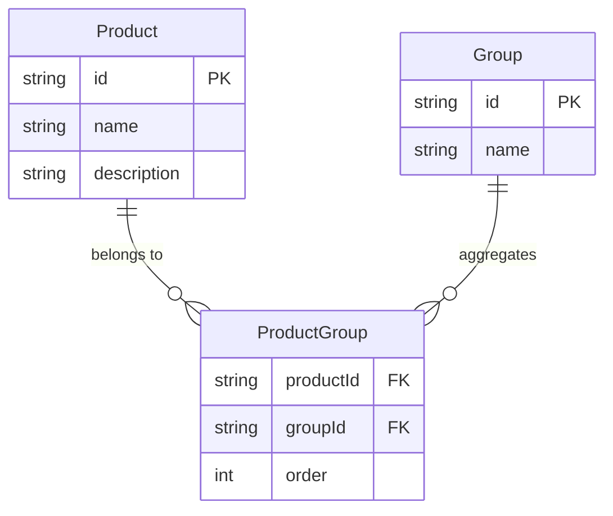
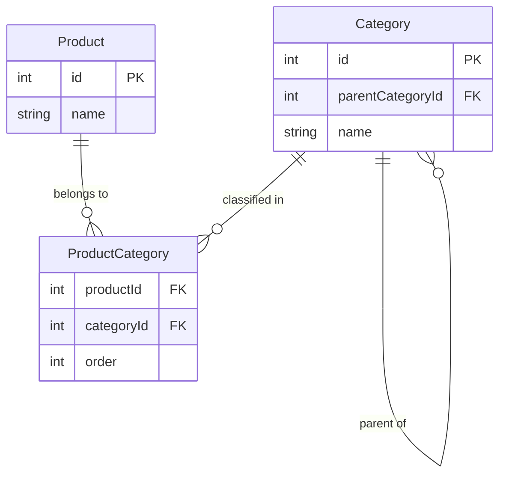

## Sorting by 1:N References

Different types of databases face different difficulties with "one-to-many" references. Let’s demonstrate these issues with a simple example. We have a product database where a product can belong to one or more groups, and on the relationship level between the `Product` and `Group` entities, we have a reference with an attribute `order`, which determines the order of products within the group. Our application needs to display a list of products sorted by the first group they belong to, with the first group being chosen alphabetically. Within this group, products should be sorted by their `order` attribute (ascending).



If we were to solve this using a relational database like PostgreSQL, the SQL query might look like this:

```sql
SELECT
    p.id AS product_id,
    p.name AS product_name,
    pg_first.order AS sort_order,
    g_first.name AS first_group_name
FROM
    Product p
        -- Join all groups for aggregation
        JOIN ProductGroup pg ON p.id = pg.productId
        JOIN "Group" g ON pg.groupId = g.id
        -- LATERAL subquery to find first group (by name) for sorting
        JOIN LATERAL (
        SELECT pg2.order, g2.name, g2.id
        FROM ProductGroup pg2
                 JOIN "Group" g2 ON g2.id = pg2.groupId
        WHERE pg2.productId = p.id
        ORDER BY g2.name
            LIMIT 1
  ) AS pg_first ON true
    JOIN "Group" g_first ON g_first.id = pg_first.id
GROUP BY
    p.id, p.name, pg_first.order, g_first.name
ORDER BY
    pg_first.order;
```

In addition to the query complexity, it is clear at first glance what problems the application developer will have to solve. The query only handles the correct sorting and does not allow for retrieving other product properties. This would require an additional database query or wrapping it in an outer query that would allow fetching. To get the details of the groups the product belongs to, another SQL query would be needed, and then everything would need to be combined in the application logic.

In several NoSQL databases, this problem is even more complicated. Some do not allow simple joining of data between different collections (e.g., Elasticsearch) and rely on denormalization, which brings its own set of problems. In others, such a model could be achieved, but it is still very complex. Here’s how this problem could be approached [for example in MongoDB](https://github.com/FgForrest/evitaDB/blob/2b97c42d72b44294e112fab3ce931848eede108c/documentation/blog/en/examples/17-one-to-many/mongodb-one-to-many.md).

In the web environment, such a problem is very common, so we strive to make things easier for developers. In evitaDB, this query would look much simpler:

<SourceCodeTabs local>

[Product Listing Sorted by Group Order](/documentation/blog/en/examples/17-one-to-many/product-groups.evitaql)

</SourceCodeTabs>

From the query, it is clear that we are sorting by the `order` attribute defined on the `groups` reference and selecting the reference that corresponds to the first assigned group, sorted alphabetically by the group’s `name` attribute. With a single query to the database, we get correctly sorted products, including all the additional information needed for further processing in the application, and by making a simple modification, we can also include details of all (or some) of the groups the product belongs to.

### References to Entities Organized in Tree Structures

The example we have been working with concerns relationships between entities that are not organized into tree structures. If we replaced the group with a product category, which is often organized hierarchically, it would make more sense to list products sorted logically according to the hierarchical structure and then secondarily by the sorting attribute within each category. The model might look like this:



For recursive queries, the SQL world uses [common table expressions (CTE)](https://www.postgresql.org/docs/current/queries-with.html) with the `WITH RECURSIVE` clause, which allows recursive traversal. The query to list products might look like this:

```sql
WITH RECURSIVE category_tree AS (
    -- Base case: Get all top-level categories (where parentCategoryId is NULL)
    SELECT
        id,
        parentCategoryId,
        name,
        1 AS depth
    FROM
        Category
    WHERE
        parentCategoryId IS NULL
    UNION ALL
    -- Recursive case: Get child categories and increment depth
    SELECT
        c.id,
        c.parentCategoryId,
        c.name,
        ct.depth + 1 AS depth
    FROM
        Category c
            JOIN category_tree ct ON c.parentCategoryId = ct.id
)
SELECT DISTINCT
    p.id AS product_id,
    p.name AS product_name,
    c.id AS category_id,
    c.name AS category_name,
    ct.depth,
    pc.order
FROM
    category_tree ct
-- Join the categories with the products through ProductCategory table
        JOIN ProductCategory pc ON pc.categoryId = ct.id
        JOIN Product p ON p.id = pc.productId
-- Sort categories by name and products by order
ORDER BY
    ct.depth,      -- Order by depth (for depth-first traversal)
    ct.name ASC,   -- Order categories by name
    pc.order;      -- Order products by 'order' in ProductCategory
```

Even this query is very complicated to understand in relational database formulation. In NoSQL databases, however, we fare even worse – in the vast majority, recursive searching is not possible, so we have no choice but to solve it in the application logic.

The approach in evitaDB adheres to the declarative principle – the developer simply specifies the desired output without worrying about how it is achieved. That’s the database’s job. Our query for hierarchical structures in evitaDB would look like this:

<SourceCodeTabs local>

[Product Listing Sorted by Category Order](/documentation/blog/en/examples/17-one-to-many/product-categories.evitaql)

</SourceCodeTabs>

By simply changing the first argument `traverseByEntityProperty` (`DEPTH_FIRST`) to `BREADTH_FIRST`, we can easily switch between depth-first [search](https://en.wikipedia.org/wiki/Depth-first_search) and [breadth-first search](https://en.wikipedia.org/wiki/Breadth-first_search). At the `traverseByEntityProperty` level, we simply determine the order in which categories should be traversed at each level.

### The Relationship Between Traversing and Sorting by the Selected Reference

Both approaches, `pickFirstByEntityProperty` and `traverseByEntityProperty`, can be used for both hierarchical and flat relationships between entities. If we use `pickFirstByEntityProperty` on hierarchical structures, we get a "flattened" output where products are simply sorted by the attribute on the selected category reference. If we use `traverseByEntityProperty` on an entity not organized in a tree (e.g., a group), we get a product listing primarily organized by group membership (according to the sorting defined within `traverseByEntityProperty`), and only secondarily by the `order` attribute on the `groups` reference.

There are many situations where these alternative approaches might be useful.

### Deep Sorting

The sorting described can be applied not only at the level of the main output entity (in our case, the product) but can also be used inside `pickFirstByEntityProperty` or `traverseByEntityProperty`, achieving sorting to any depth. While there may not be many practical scenarios for this use, it’s good to know that it’s possible.

To avoid pure theoretical discussions, let’s extend our example with an additional entity `tag` (Tag), which is assigned at the category level and also has a "one-to-many" cardinality. If we wanted to list products according to the hierarchical structure, where categories at each level are sorted by the first assigned tag with the highest priority, the query might look like this:

<SourceCodeTabs local>

[Product Listing Sorted by Category Order, Sorted by the Most Prioritized Tag](/documentation/blog/en/examples/17-one-to-many/product-categories-tags.evitaql)

</SourceCodeTabs>

<Note type="info">

For interest, the corresponding SQL query for the same situation could [look like this](./examples/17-one-to-many/postgresql-product-categories-tags.md).

</Note>

## Limiting the Scope of 1:N References Listings

For references with high cardinality, another problem arises when trying to list them within the main entity. A typical example is when, for instance, on the product detail page, we need to list all the groups the product belongs to, as well as all tags, parameters, related products, associated images, technical documentation, and more. All of these are examples of references with high cardinality. Many of them do not need to be modeled structurally and can be captured as unstructured JSON, but still, many candidates for modeling with references remain for various reasons.

In the case of a relational database, all sub-records with high cardinality must be merged into a single column output and then processed in the application logic. The merge can be into a simple structure (e.g., comma-separated):

```sql
SELECT p.product_id, p.product_name,
    STRING_AGG(DISTINCT g.group_name, ', ') AS groups,
    STRING_AGG(DISTINCT t.tag_name, ', ') AS tags,
    STRING_AGG(DISTINCT CONCAT(par.parameter_name, ': ', par.parameter_value), ', ') AS parameters
FROM Product p
         LEFT JOIN Product_Group pg ON p.product_id = pg.product_id
         LEFT JOIN "Group" g ON pg.group_id = g.group_id
         LEFT JOIN Product_Tag pt ON p.product_id = pt.product_id
         LEFT JOIN Tag t ON pt.tag_id = t.tag_id
         LEFT JOIN Product_Parameter pp ON p.product_id = pp.product_id
         LEFT JOIN Parameter par ON pp.parameter_id = par.parameter_id
WHERE p.product_id = 1
GROUP BY p.product_id;
```

Or into a more complex JSON structure, which allows passing larger amounts of structured data at once:

```sql
SELECT p.product_id,
    p.product_name,
    -- Skupiny
    JSON_AGG(
            JSON_BUILD_OBJECT(
                    'group_id', g.group_id,
                    'group_name', g.group_name
            )
    ) AS groups,
    -- Štítky
    JSON_AGG(
            JSON_BUILD_OBJECT(
                    'tag_id', t.tag_id,
                    'tag_name', t.tag_name
            )
    ) AS tags,
    -- Parametry
    JSON_AGG(
            JSON_BUILD_OBJECT(
                    'parameter_id', par.parameter_id,
                    'parameter_name', par.parameter_name,
                    'parameter_value', par.parameter_value
            )
    ) AS parameters
FROM Product p
         LEFT JOIN Product_Group pg ON p.product_id = pg.product_id
         LEFT JOIN "Group" g ON pg.group_id = g.group_id
         LEFT JOIN Product_Tag pt ON p.product_id = pt.product_id
         LEFT JOIN Tag t ON pt.tag_id = t.tag_id
         LEFT JOIN Product_Parameter pp ON p.product_id = pp.product_id
         LEFT JOIN Parameter par ON pp.parameter_id = par.parameter_id
GROUP BY p.product_id;
```

Again, in application logic, we need to handle the conversion of this information back into a format we can work with in the application. It is also clear that these transformations incur some performance cost both on the database and application logic sides. Unfortunately, the row-based relational approach doesn’t provide much better options in this case. NoSQL databases have an advantage here.

Queries in evitaDB do not suffer from this problem, as they can return entities loaded to any depth in a structured way. The issue arises when there is a risk of a large number of references being returned. Besides the fact that we might not be able to present such large amounts of data to the target user, we also risk unnecessary load on the database machine and the transmission of large amounts of data over the network (i.e., increased query latency). Therefore, it’s useful to limit the number of references loaded in such cases. In evitaDB, we would do this like this:

<SourceCodeTabs local>

[Product Parameters Listing Limited to the Top 10 Most Important](/documentation/blog/en/examples/17-one-to-many/product-parameters-top10.evitaql)

</SourceCodeTabs>

The output is a data structure representing a page or a slice defined by `offset`/`limit`, which allows further reflection on the returned data. That is, the calculation of the number of pages, information on the existence of the next/previous page, total record count, etc. It is therefore easy to create a subsequent query that would return the additional pages / slices of data that was skipped by this query.

In many situations, we don’t even need to load the actual references – we just need information about their count or simply the fact that at least one such reference exists. This situation often occurs when we need to filter the references further – for example, in the product entity, check if there is at least one reference to a warehouse marked as a priority with a stock quantity greater than one. We would simply handle this like this (the GraphQL query variant is more representative here):

<SourceCodeTabs local>

[Checking for Existence of a Priority Warehouse for a Product](/documentation/blog/en/examples/17-one-to-many/product-stock-existence.evitaql)

</SourceCodeTabs>

### Spacing

The current world is driven by marketing needs, so it is common to have listings of articles/products and other entities interspersed with links to articles, advertising banners, and other elements that are unrelated to the entity in question. The same may be required at the level of references to other entities – for example, in the article detail page, in the section of similar articles, which are listed with pagination, we might want to leave space for an advertising banner on every second page.

For these purposes, spacing is used, which can also be applied to references listing. Our described example would be handled like this:

<SourceCodeTabs local>

[Listing Similar Articles with Interspersed Ads](/documentation/blog/en/examples/17-one-to-many/article-spacing.evitaql)

</SourceCodeTabs>

The resulting data structures still correctly declare the corresponding number of pages and the number of found similar articles, even though on every second page, one item is skipped for an advertising banner. A similar calculation at the application level would be possible, but very complicated. The result list can be also [segmented](https://evitadb.io/documentation/query/ordering/segment) into several parts that are ordered by different fashion. But that's quite advanced example so that we will not cover it here.

## Summary

This article tries to show the possibilities of the new features in the just released evitaDB `2025.2` and to demonstrate the approach of the evitaDB developers to problems that are often encountered in the development of not only web applications that we see around us. The query language in evitaDB is declarative and aims to maintain readability even in complicated situations. It focuses on practical solutions to common problems that are often only solvable with a lot of developer effort in general-purpose databases and require significant cooperation at the application level and the associated costs for subsequent maintenance.

If you found this article interesting or have suggestions for better solutions to the mentioned problems, let us know on our [Discord server](https://discord.gg/VsNBWxgmSw).

<Note type="info">

**Note:**

The examples for PostgreSQL and MongoDB were generated using LLM and may contain errors. However, they represent valid approaches to solving the given problem that a developer would likely explore at some stage of application development.

</Note>
