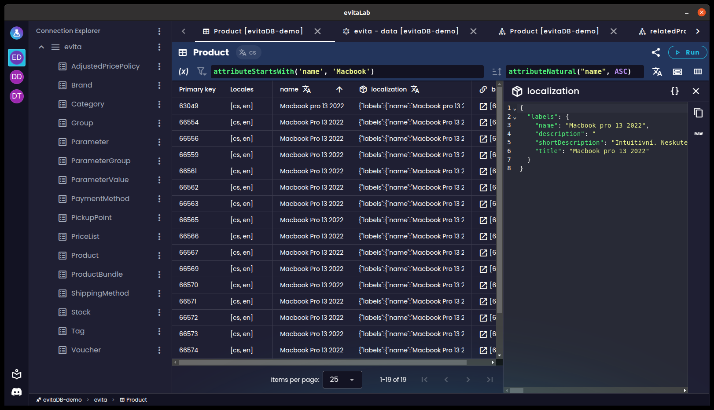
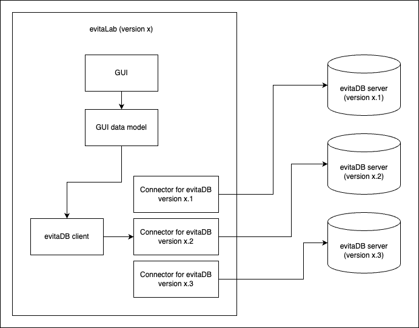
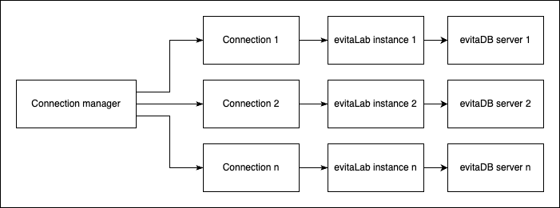
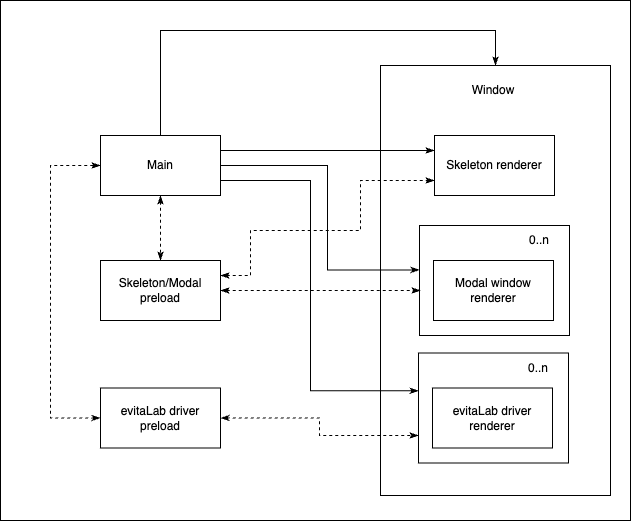

And now, we are happy to announce the [evitaLab Desktop](https://github.com/FgForrest/evitalab-desktop). You
can [download it](https://github.com/FgForrest/evitalab-desktop/?tab=readme-ov-file#download) for all the major
platforms (Windows, macOS, Linux). It has all the favorite features of the
core [evitaLab](https://github.com/FgForrest/evitalab) as well as a lot of additional features, such as:

- ✅ manage connections to multiple evitaDB instances
- ✅ connect to any server version in one app
    - *note: server version must be at least 2025.1, older versions of evitaLab are not and will never be backported to work in the driver mode*
- ✅ receive evitaLab core updates as soon as they are released without waiting for server update
- ✅ each connection stores its own tabs and history, even if each connection points to same server URL
    - *this is useful when you are using port forwarding for different server environments (prod, test, local) where
      local port is the same for each environment*
- ✅ connections styling for better distinction between servers and environments
- ✅ global notification system - displays toast notifications from desktop app and connections in one place
    - *this way you can see notifications from all connections all the time*



## Motivation

There were several reasons for developing the desktop application.

The obvious one is that it is much more user friendly to have a dedicated *desktop* application that can handle multiple
server connections with proper differentiation and customisation, rather than switching through random tabs of different
evitaLab instances in a web browser.

The other reason, the *main reason* for why we built it right now, is that it solves us a big problem we have been
postponing in the evitaLab core. The problem is that the evitaLab web client doesn't support multiple versions of the
evitaDB server. It is always developed against the latest version of evitaDB (more precisely, it is developed against
the latest version of gRPC/GraphQL/REST APIs). Therefore, we have been trying to invent some kind of middleware between
evitaLab GUI and the evitaDB APIs that would bridge different versions of evitaLab to different versions of evitaDB
server. More specifically, to allow evitaLab to support older and newer evitaDB servers at the same time.

Initially, we wanted to create a universal data model based on GUI requirements and create converters for all evitaDB
API versions. However, it soon became clear that this approach would be impossible to maintain. It would require
creating separate stubs for each gRPC API version and connecting them to the evitaLab data model. It would also
introduce another challenge: how to cleverly distribute the individual stubs and converters to a client without having
the client download the entire codebase at once.



After some thought, we have abandoned the idea of supporting multiple evitaDB server versions within a single evitaLab
version. Instead, we have combined several separate ideas we had in mind and came up with the following idea.

## The idea behind evitaLab Desktop

The desktop application is not just a simple evitaLab wrapped in WebView and bundled into a desktop application. That
would not solve anything for us.

Instead, the desktop application acts as a kind of orchestrator of evitaLab instances of different versions. The desktop
application has its own GUI for managing connections to evitaDB servers, among other things. When connected to an
evitaDB server, the desktop application resolves the version of the connected to evitaDB server and finds the latest
compatible evitaLab version. If a compatible evitaLab is found, the desktop application downloads it (if not already
done) from the evitaLab GitHub repository and saves it to the filesystem. Finally, it spawns a new WebView that runs the
downloaded evitaLab locally from the filesystem in the driver mode.

**TODO rozvest download process using Github API**
**TODO vyzkouset evitalab offline s lokalni evitou**

This way we can connect to any evitaDB version (from 2025.1 forward) without any complex bridges.

When a user switches between individual connections using the GUI of the desktop application, the desktop application
simply switches the visibility of the WebViews running the evitaLab instances.



## Problems it solves and its benefits

This architecture solves several problems at once.

The main problem it solves is the "support of multiple versions" of the evitaDB server. With this architecture we can
effectively support all evitaDB versions from a single desktop application with almost no maintenance cost. However, it
has one disadvantage compared to supporting different evitaDB versions in evitaLab itself: each evitaLab WebView may
look slightly different and offer different features if the connected servers have too large a version gap. However, we
think this is acceptable because when a user connects to multiple servers with a web browser, each embedded evitaLab
instance may also look different. Also, we could theoretically backport some GUI changes to older evitaLab versions to
eliminate the differences.

The architecture of local hosting of evitaLab also offers several advantages. For one, because it is hosted locally and
does not depend on an evitaDB server, it survives a non-running evitaDB server, which means that a user can still view
their queries, data, etc (although it still has some quirks that we need to fine-tune). Another advantage of running the
evitaLab locally is that, we don't have to download the source code from the server every time the desktop application
is opened, which means faster load times. The evitaDB server doesn't even have to expose the embedded evitaLab (however,
this requires that all users use the desktop application), only its API.

Another advantage of not having to rely on the evitaDB embedded evitaLab instance is that we can ship new versions of
evitaLab directly to users without waiting the for evitaDB server to catch up.

The desktop application itself offers even more potential benefits that we can use in the future. For example: we can
create features that interconnect individual evitaLab instances, for example: migrating catalogs from one server to
another. We are already using this type of capability for toast notifications. Notifications from all evitaLab instances
are sent to the desktop application, which displays them all in a single list. This allows the user to view all
notifications from any connection or from the desktop application itself, regardless of the connection being explored.

## Technologies we used

The main component without which it would hardly be possible is of course the [Electron](https://www.electronjs.org/)
framework in conjunction with the [Electron Forge](https://www.electronforge.io/). We also explored other options
like [Tauri](https://tauri.app/) or [Neutralino](https://neutralino.js.org/). For example, we really liked the idea of
the Rust architecture of the Tauri framework, but no other framework (at the time of the research) provided all the
features we needed to make idea work. The main feature we needed was the ability to place separate WebViews on top of
and next to each other. The "next to each other" is no problem, but the "on top of each other" proved to be quite a
problem for frameworks other than Electron. So we were kind of forced to use Electron. Fortunately, it turned out to be
quite a good choice, as it comes with a large community and offers a wide range of useful tools and possibilities.

Within the Electron application, we stuck to the same tech stack we use for the core
evitaLab: [Vue](https://vuetifyjs.com/) + [Vuetify](https://vuetifyjs.com/) + [Typescript](https://www.typescriptlang.org/).
This gives us a low barrier to switch between both projects and allows us to share common frontend components like GUI
styling. Ideally, this way a user won't know the difference between the actual desktop application and an evitaLab
driver.

Finally, we use the GitHub CI to test and release the entire application for each platform. The release process without
the CI would be too painful, because building the application for a specific platform means that you need to access a
machine with that platform and build it on that machine. This would require us to manually build the desktop application
on at least 4 different machines (even if they were virtual) and then merge them into a single release. Instead, we used
different GitHub
CI [runners](https://docs.github.com/en/actions/using-github-hosted-runners/using-github-hosted-runners/about-github-hosted-runners#standard-github-hosted-runners-for-public-repositories)
to build the desktop application for each platform in parallel jobs and package all of the built files into a single
GitHub release. You can check out
the [entire CI workflow](https://github.com/FgForrest/evitalab-desktop/blob/dev/.github/workflows/release.yml) in our
repository.

## How it works under the hood

We have already mentioned that it is built using the Electron framework. However, there are many ways to build an
Electron application.

First of all, we were heavily inspired by the architecture used by
the [Mattermost Desktop](https://github.com/mattermost/desktop) application, but there are some differences. So how does
it how work under the hood?

### Architecture

Each Electron application is divided into main, preload and renderer components. The evitaLab Desktop application
further divides the renderer component into several so-called mini web applications (each is separate renderer process),
which together create the entire GUI.

The main component is a Node.js backend that handles communication with the OS, application windows and so on. In our
case the main component is written in Typescript and handles, among other things (application updates, filesystem
access, app config, etc.), the orchestration of the actual GUI, which consists of the desktop application's own GUI as
well as the evitaLab driver GUIs.

The preload component is responsible for providing custom `window.XY` browser APIs to the renderer components. We
provide several custom APIs, for example: notifications API, connection manager API, modal manager API and many more.
This way any frontend web application can communicate with the rest of the desktop application (such as modal windows or
evitaLab drivers) or the OS itself.

The last are the renderer components, which is where the mini frontend web applications are rendered (just like in a web
browser). In evitaLab Desktop, we spawn several renderer instances. The base GUI, each modal window, each evitaLab
driver, is a separate renderer process (similar to separate tabs in a web browser).



Each evitaLab desktop boots with a single fresh `BrowserWindow` instance, which is basically a new application window
that loads its own frontend web application. More precisely it loads a so-called skeleton web application. The skeleton
web application is the basic GUI of the desktop application. It consists mainly of the welcome screen (the first thing
you see after a startup) and the main navigation bar (for switching connections). This web application is always there
in the background, no matter what you are doing.

As soon as you start clicking around and opening connections and modal windows, things get more complex under the hood.
As mentioned before, each modal or evitaLab driver is a separate renderer/mini frontend web application that we cleverly
place next to each other or on each other on top of the skeleton web application. For this we use the `WebContentsView`
component, which allows us to place serveral separate renderer instances within the main `BrowserWindow` instance.

In case of connecting to a server, a new `WebContentsView` instance is spawned and loaded with an appropriate evitaLab
driver web application instance. It is then statically placed over a part of the skeleton application, so that only the
left navigation bar is visible. If more connections are opened and thus more `WebContentsView` instances with evitaLab
driver are spawned, they are stacked on top of each other at the same place, but only one instance is set as visible at
that time. The others are still there, but hidden.

In the case of modal windows, each renderer can open any existing modal window using the provided modal manager API.
Each modal window is also a separate renderer. When a new modal window is requested through the API, the backend spawns
a new `WebContentView` instance and loads the appropriate frontend web application for that modal. Such a
`WebContentView` instance is placed over the entire `BrowserWindow`, but with a transparent background. This way the
rest of the desktop application is still visible underneath, giving the illusion of a unified application. When the
modal window is closed, the `WebContentView` instance is not destroyed, instead the modal data is cleared and the
`WebContentView` instance is hidden. This way, when the modal is requested again, we don't have to initialise everything
again, we just toggle the visibility. This approach also allows stacking multiple modal windows on top of each other,
for example if a modal window wants to spawn a confirmation modal window. The new modal is simply placed on top of the
original modal window.

### Architecture drawbacks

Of course, the approach of separate frontend web applications running in separate renderer instances has some drawbacks.
The most important one is memory consumption. Each renderer instance spawns its own process with its own miniature
browser view, just as a normal browser does with separate tabs. However, in our application we don't necessarily need
separate browser contexts for each modal window. Another drawback is that it requires some code boilerplate,
specifically each such mini application needs its own `index.html` that initialises a small Vue.js app, which needs some
configuration and plugins (which is the same for most mini apps). And this initialisation takes some time. On today's
computers, the initialisation time seems negligible, but it is still there, and it kind of wastes computer resources.
However, the benefit of running multiple instances of evitaLab in a single desktop application with an almost seamless
experience without much work, in our opinion, far outweighs the drawbacks. Of course we plan to optimise the
architecture where possible, but even now it seems work quite well.

Now that we know how the desktop application works, let's dive into some specific problems we needed to solve.

### evitaLab driver version resolution

Once we decided to drop the idea of supporting multiple servers within a core evitaLab, we were faced with another
problem: how to decide which evitaLab driver version to choose for a specific server?

We researched several ways, but finally settled on the following.

As mentioned in the beginning, each evitaLab driver is developed against the latest version of evitaDB APIs, *not
against the evitaDB server version itself*. This means that we can define the required evitaDB API version for a
specific evitaLab version. In reality, we have introduced an `.evitadbrc` file in the root of the evitaLab project,
which specifies the minimum required version of the evitaDB server for a specific evitaLab version. Then, when a new
evitaLab version is released, the GitHub CI pushes the minimum evitaDB version with the released evitaLab version to our
public [metadata database](https://github.com/FgForrest/evitalab-metadata-database) by simply pulling the database
repository, adding the version pair to the index file and committing it (check out
the [release.yaml](https://github.com/FgForrest/evitalab/blob/5636b54ea022ad6d62183f576b894d9e3e3c8904/.github/workflows/release.yml#L188-L215)
action).

| evitalab-version | min-evitadb-version |
|------------------|---------------------|
| 2025.2.0         | 2025.1.0            |
| 2025.3.0         | 2025.1.0            |

*evitalab-database.csv*

Then, when a user tries to connect to a specific evitaDB server from the desktop application, the application downloads
the current index file from the metadata database, creates a sorted index grouped by the minimum evitaDB version, and
searches for the newest evitaDB version that is older than or equal to the connected server. Once found, it selects the
latest known evitaLab driver version for that evitaDB version.

**TODO how version are compared and backport patch  support**

### evitaLab driver

In order to support running the evitaLab core embedded in the evitaDB server as well as in the desktop application, we
now build the evitaLab in two modes: standalone and driver mode using the GitHub CI. Each of them has some small
differences to fit its target area.

When a specific driver version is resolved, the driver mode build for that version is downloaded from the GitHub
Releases and unzipped to the user's filesystem. When a new `WebContentsView` instance is spawned, the evitaLab driver is
loaded directly from the filesystem.

The driver mode typically changes some GUI parts to make the transition from the desktop application to the evitaLab
driver seamless. It also integrates evitaLab with the custom APIs provided by the preload script.

### Autoupdates

The Electron framework comes with the [update-electron-app](https://github.com/electron/update-electron-app) library
which is able to auto update the desktop application from GitHub Releases. Since we use Electron Forge and GitHub
Release to publish released versions, it was no brainer to choose this library. The only thing needed was some simple
configuration:

```js
updateElectronApp({
	updateSource: {
		type: UpdateSourceType.ElectronPublicUpdateService,
		repo: 'FgForrest/evitalab-desktop',
	},
	updateInterval: '1 hour',
	logger: log
})
```

However, there was one small obstacle. Although we are using Electron Forge, we are using
the [Vite + Typescript](https://www.electronforge.io/templates/vite-+-typescript) template for the project structure.
The problem is that the `update-electron-app` library expects a `package.json` file in the parent directory of the
running application. However, Vite places it in the parent of parent directory, effectively crashing the entire update
process. We ended up temporarily cloning the library directly into the desktop application until the library is fixed *(
we are working on the fix)*.

Unfortunately, the auto-update feature is only available for Windows and macOS platforms. Linux is not supported at all.
Therefore, for the Linux version, we have implemented a notification system in the application that notifies the user
about a new version and redirects them to the GitHub Releases for manual installation.

## Conclusion

So far, the Electron framework has proven to be a great tool and has allowed us to build an application that would be
difficult to build with other frameworks for all major platforms.

Feel free to [download](https://github.com/FgForrest/evitalab-desktop/releases/tag/v2025.1.3) the evitaLab Desktop
application and try it out. If you find any problems, please report them to
our [repository](https://github.com/FgForrest/evitalab-desktop/issues). If you want to explore the codebase and tinker
with it, feel free
to [clone the repository](https://github.com/FgForrest/evitalab-desktop?tab=readme-ov-file#development) and run the
development version.