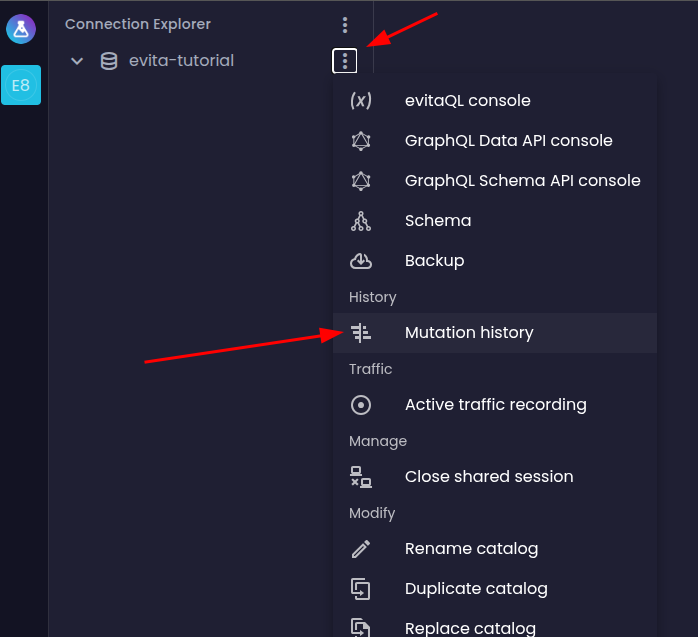
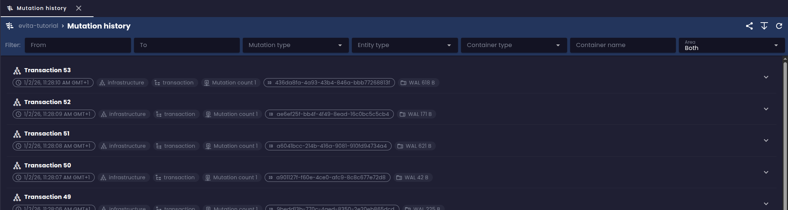
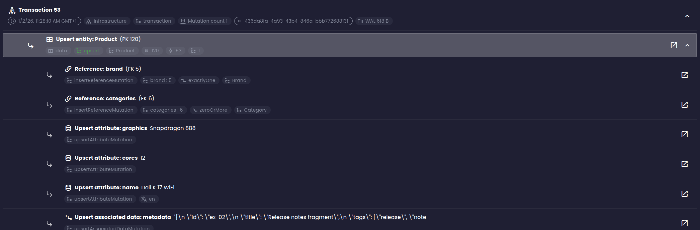

## Navigating the database change history

In the left menu at the catalog level, there's a new **Mutations history** item that opens a fresh perspective on working with data.

At the top of the screen, you'll find a search panel that lets you filter records by various criteria:

- **Period from / to**: select the time range during which transactions occurred - the decisive timestamp is when the transaction was *committed*
- **Mutation type**: select the operation type - insert (*upsert*) or delete (*remove*)
- **Entity type**: select the entity type (i.e., the name of the entity collection) the operation applies to
- **Container type**: select what kind of container the operation affected - whether it was an entity, its attribute, associated data, reference, price, or a relationship between entities
- **Change scope**: select whether the operation affected the data layer (*data*), schema (*schema*), or both (*both*)
- **Entity ID**: search by a specific entity ID (only shown when the data scope is selected), allowing you to quickly find all changes related to a particular entity over time

Below the filter panel, you'll see a list of all recently committed transactions, grouped by transaction from newest to oldest:

Each transaction displays the commit time, the number of changes, the transaction size in bytes, and a button to expand the details. Clicking this button reveals a list of individual mutations contained in the transaction that also match the specified filter. These mutations can often be further expanded to show local changes that were made within the mutation. For example, an *entity upsert* mutation will display local mutations for individual attributes, prices, and other "local" parts of the entity.

Each mutation allows you to open another view showing the history of the corresponding item over time. For instance, an entity mutation opens a view of the entire entity's history, where you can see all changes that occurred on the entity over time, including changes to its attributes, prices, and other parts. For a local attribute mutation, the view shows the history of that specific attribute within the given entity. This makes it really easy to understand how and when a particular item changed.

<Note type="info">

The visualization for associated data is currently quite basic. In the future, we'd like to add the ability to open associated data content in the right panel with options to visualize the data in various formats (text, JSON, Markdown, HTML, etc.), similar to what's already available in the entity grid view.

</Note>

## Viewing change history from the entity grid

Besides the main change history view in the left menu, you can also access the change history directly from the entity grid. Currently, this feature is only available via keyboard shortcuts that need to be pressed while clicking on a row in the entity table.

1. Hold the **E** key and middle-click (mouse wheel) on a row in the entity table to open the change history for that entity
2. Hold the **L** key and middle-click (mouse wheel) on cells corresponding to local containers (attribute, associated data, price, reference) to open the change history for that container within the entity

<Note type="info">

We're also planning UI improvements here so that the change history can be opened directly from the context menu of a row or cell in the entity table.

</Note>

## Conclusion

The new WAL browsing and searching feature in evitaLab gives users the ability to track database changes in detail. While the tool is still in its early development stages, it already offers useful functionality for auditing and data analysis.