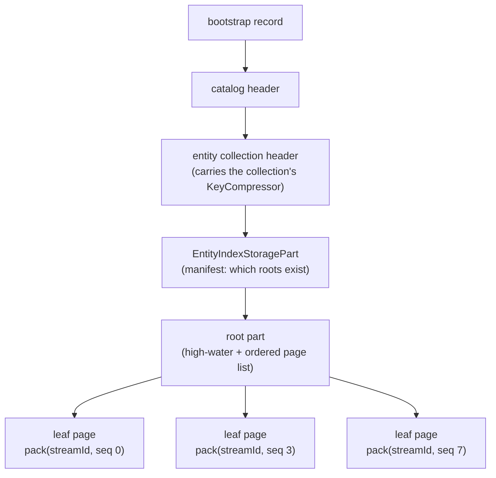
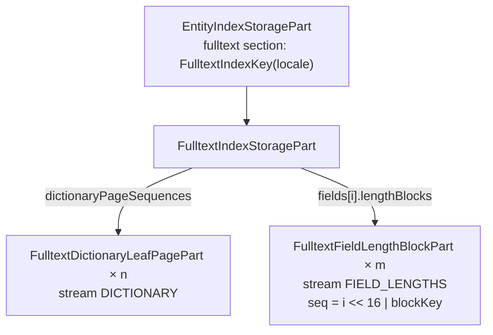

# B+ Tree Persistence — Leaf Pages, Page Streams and the Fulltext Trees

This page documents how a B+ tree-backed index is written to a data file and read back: what records a
persisted tree consists of, how a leaf page is identified, which pages a flush writes and which it removes,
and how a reload reassembles the tree so that page identity survives a restart. A dedicated part covers the
fulltext index, whose term dictionary and field length tables are persisted with the same machinery plus a
few shapes of their own.

It sits between two siblings. [bplus-tree-bucket-store.md](bplus-tree-bucket-store.md) describes the
in-memory trees and ends with their [persistence contract](bplus-tree-bucket-store.md#persistence-contract);
[offset-index.md](offset-index.md) describes the append-only store the records land in. This page is the
layer that connects them.

> **Scope.** The storage-part types and the engine-side flush/load code live in `evita_engine`
> (`io.evitadb.spi.store.catalog.persistence.storageParts.index`, `io.evitadb.index.page`,
> `io.evitadb.index.component`); the Kryo serializers and every byte of IO live in `evita_store`
> (`io.evitadb.store.index.serializer`). The SPI parts are data carriers only — see
> [The storage boundary](#the-storage-boundary).

## Table of contents

| Section | Content |
|---|---|
| [What a persisted tree is made of](#what-a-persisted-tree-is-made-of) | `SINGLE` vs `PAGED`, the root, the leaf pages, the families |
| [Page identity](#page-identity) | Stream ids, page sequences, the packed primary key, the wire frame |
| [The write path](#the-write-path) | Dirty tracking, the page registry, freed pages, removals, emission order |
| [What a flush means for durability](#what-a-flush-means-for-durability) | Pages and removals against the bootstrap record |
| [The load path](#the-load-path) | Reading the page list, bulk-loading, restoring the registry |
| [Format versioning](#format-versioning) | `serialVersionUID`s, backward-compatible readers, the manifest versions |
| [The fulltext index trees](#the-fulltext-index-trees) | Root, dictionary pages, length blocks, reload, provisional format |
| [Test Blueprint Hints](#test-blueprint-hints) | The tests that prove the round-trips |

---

## What a persisted tree is made of

A tree-backed sub-index is persisted in one of two shapes, chosen at every flush from the tree's current
shape:

- **`SINGLE`** — the whole sub-index rides inline in its **root part** (e.g. `FilterIndexStoragePart` with
  its buckets inline). A tree that fits one leaf is persisted this way; at load it is rebuilt by ordered
  inserts.
- **`PAGED`** — the root part keeps only bookkeeping: the stream's **high-water page sequence** and the
  **ordered list of live leaf-page sequences** (ascending key order). Each leaf is a separate record, a
  subclass of `AbstractLeafPagePart`. `InvertedIndex#isPaged` is simply "the tree has an internal root",
  i.e. at least two leaves.

The fulltext dictionary is the exception: it is always `PAGED`, even as a single leaf (see
[The fulltext index trees](#the-fulltext-index-trees)).

Above the root sits the `EntityIndexStoragePart` **manifest**, which lists every sub-index root a reload
must read. Each subsystem announces its keys into an `EntityIndexManifest` through its `IndexComponent`,
and `EntityIndex#getModifiedStorageParts` writes a new manifest only when the announced key sets changed.



The pointers below the collection header are not file offsets: the manifest names roots by key, a root
names pages by sequence, and both are resolved to a `FileLocation` through the collection's `OffsetIndex`.

### The paged families

Every family shares the identity skeleton of `AbstractLeafPagePart` and the leading wire frame of
`AbstractLeafPagePartSerializer`; they differ in the stream key that names their stream and in the payload.
The record-type byte is the one registered in `IndexStoragePartRegistry`.

| Leaf page part | Record type | Stream key (variant) | Serializer base | Freed-page removal | Root carrying the page list |
|---|---|---|---|---|---|
| `FilterIndexLeafPagePart` | 35 | `LeafStreamKey` (`BUCKET`), index type `FILTER` | `BucketLeafPagePartSerializer` + value-id tail | `FilterIndexLeafPageRemoval` | `FilterIndexStoragePart` (bucket axis) |
| `RangeIndexLeafPagePart` | 36 | `LeafStreamKey` (`RANGE`) | `RangeLeafPagePartSerializer` | `RangeIndexLeafPageRemoval` | `FilterIndexStoragePart` (range axis) |
| `PriceListAndCurrencySuperIndexLeafPagePart` | 38 | `PriceLeafStreamKey` | `AbstractLeafPagePartSerializer` (`PriceRecordCodec`) | `PriceListAndCurrencySuperIndexLeafPageRemoval` | `PriceListAndCurrencySuperIndexStoragePart` |
| `GlobalUniqueIndexLeafPagePart` | 39 | `GlobalUniqueLeafStreamKey` | `AbstractLeafPagePartSerializer` | `GlobalUniqueIndexLeafPageRemoval` | `GlobalUniqueIndexStoragePart` |
| `UniqueIndexLeafPagePart` | 40 | `LeafStreamKey`, index type `UNIQUE` | `AbstractLeafPagePartSerializer` | `UniqueIndexLeafPageRemoval` | `UniqueIndexStoragePart` |
| `ReferenceTypeCardinalityIndexLeafPagePart` | 41 | `ReferenceTypeCardinalityLeafStreamKey` | `AbstractLeafPagePartSerializer` | `ReferenceTypeCardinalityIndexLeafPageRemoval` | `ReferenceTypeCardinalityIndexStoragePart` |
| `SortIndexLeafPagePart` | 42 | `LeafStreamKey`, index type `SORT` | `AbstractLeafPagePartSerializer` | `SortIndexLeafPageRemoval` | `SortIndexStoragePart` |
| `ChainIndexLeafPagePart` | 43 | `LeafStreamKey`, index type `CHAIN` | `AbstractLeafPagePartSerializer` | `ChainIndexLeafPageRemoval` | `ChainIndexStoragePart` |
| `HistogramIndexLeafPagePart` | 44 | `HistogramLeafStreamKey` (`BUCKET`) | `BucketLeafPagePartSerializer` | `HistogramIndexLeafPageRemoval` (`BUCKET`) | `HistogramIndexStoragePart` (bucket axis) |
| `HistogramRangeIndexLeafPagePart` | 45 | `HistogramLeafStreamKey` (`RANGE`) | `RangeLeafPagePartSerializer` | `HistogramIndexLeafPageRemoval` (`RANGE`) | `HistogramIndexStoragePart` (range axis) |
| `FulltextDictionaryLeafPagePart` | 48 | `FulltextLeafStreamKey` (`DICTIONARY`) | `AbstractLeafPagePartSerializer` (reuses `BucketLeafPagePartSerializer#writeBuckets`) | `FulltextDictionaryLeafPageRemoval` | `FulltextIndexStoragePart` |
| `FulltextFieldLengthBlockPart` | 49 | `FulltextLeafStreamKey` (`FIELD_LENGTHS`) | `AbstractLeafPagePartSerializer` | `FulltextFieldLengthBlockRemoval` | `FulltextIndexStoragePart` (per field) |

The five attribute-keyed families (`Filter`, `Range`, `Sort`, `Unique`, `Chain`) additionally share
`AbstractAttributeLeafPagePart`, which carries their write-path identity `(entityIndexPrimaryKey,
AttributeKeyWithIndexType)`. The others extend `AbstractLeafPagePart` directly and carry their own identity.

### `StoragePartGroup` and `IndexComponent`

Neither takes part in keying or ordering:

- **`StoragePartGroup`** (`evita_api`) is the statistics classification each record type declares at
  registration, so a storage-composition report can group bytes by feature. A family's leaf pages are
  charged to the same group as its root (`PAGED` vs `SINGLE` is a format choice, not a different kind of
  data); all three fulltext records are `FULLTEXT_INDEX`.
- **`IndexComponent`** is the engine-side unit of the flush: each subsystem of an `EntityIndex` emits its
  own dirty parts into the shared `TrappedChanges`, announces its live root keys into the
  `EntityIndexManifest`, and, through `emitPersistedFootprintRemovals`, reclaims its leaf pages when the
  whole entity index is dropped. `FulltextIndexMapComponent` is the fulltext one.

---

## Page identity

### The packed primary key

A leaf page's storage-part primary key is `NumberUtils.pack(streamId, pageSequence)` — the stream id in the
high 32 bits, the page sequence in the low 32 (`AbstractLeafPagePart#computeUniquePartId`). The
`OffsetIndex` keys a record by `RecordKey(recordType, primaryKey)`, so page keys only have to be unique
within their own record type.

- **`streamId`** is the `KeyCompressor` id of the family's stream key (`LeafStreamKey`,
  `FulltextLeafStreamKey`, …). The key encodes the full sub-index identity — for the entity-index families
  including the owning entity index's primary key, since the same attribute or locale has a sub-index in
  many entity indexes — because that identity has to fit the one `int` half the page sequence leaves free.
  Where one sub-index writes two streams, a stream-kind variant (`BUCKET`/`RANGE`,
  `DICTIONARY`/`FIELD_LENGTHS`) is part of the key. The compressor is a
  bijective, restart-stable dictionary of the data store the part lives in, persisted with that store's
  header (`EntityCollectionHeader#compressedKeys` for an entity collection, `CatalogHeader#compressedKeys`
  for the catalog's own store).
- **`pageSequence`** numbers the page within its stream. For every tree family it comes from an
  advance-only allocator (below); the fulltext length blocks derive it instead.

The stream id is resolved in **two phases**. A write-path page is built in the engine without a stream id
(`UNRESOLVED_STREAM_ID`), because the writable compressor lives store-side; `OffsetIndex#put` calls
`computeUniquePartIdAndSet` under the compressor's write session, which registers the stream key on the
first page ever written to the stream and returns the stable id thereafter. A read-path page is rehydrated
with the stream id it was read with, and carries no identity.

### Page sequences and the high-water

`PageStreamRegistry` (`io.evitadb.index.page`) is the per-stream bookkeeping a tree keeps outside
transactional memory:

| State | Meaning |
|---|---|
| high-water | the largest sequence ever allocated; `NO_PAGE` (`-1`) before the first, so the first page is `0` |
| live set / ordered live list | the pages the last published flush left on disk, as a set and in key order |
| staged set / ordered staged list | what the in-flight flush will leave on disk, published by `publishStaged()` |

`allocate` never reuses a sequence, and the high-water is persisted verbatim in the `PAGED` root rather than
re-derived as `max(live)`: a freed maximum would otherwise be handed out again. The registry's javadoc gives
the reason for advance-only: a retained older catalog version that still references a page key keeps
resolving the bytes it expects.

The registry is owner-resident: it is carried by reference into each committed copy of the index at the
commit merge, and mutated only by the single writer during flush and commit.

### The wire frame

Every record goes through a `SerialVersionBasedSerializer`, which writes the current `serialVersionUID` as a
leading `long`. After it, `AbstractLeafPagePartSerializer#write` writes the identifying pair as two positive
var-ints and hands over to the family's payload:

```
long    serialVersionUID          (SerialVersionBasedSerializer)
varint  streamId                  (AbstractLeafPagePartSerializer)
varint  pageSequence
...     payload                   (writePayload / readPayload of the family)
```

The primary key is **not** on the wire: `readPayload` recomputes it from the pair. The bucket-shaped
payload of `BucketLeafPagePartSerializer` is a var-int bucket count, then per bucket a discriminator byte —
`0` for a single-record bucket (value via `writeClassAndObject` plus a bare record-id var-int), `1` for a
multi-record bucket (`ValueToRecordBitmap` through its own serializer).

---

## The write path

### Which pages a flush writes

The gate is the index's own dirty flag: a clean index emits nothing. A dirty one walks its leaves through
`PageStreamRegistry#collectChangedPages`, in ascending key order:

1. A leaf with no page yet (`PagedLeafHandle.UNASSIGNED_PAGE_SEQUENCE` — a fresh leaf, or either half of a
   split) is **allocated** a sequence, which is stamped onto the live node so the commit merge carries it
   forward.
2. A leaf is **(re)written** iff it is fresh or its transaction-aware dirty flag (`PagedLeafHandle#isDirty`)
   is set; the flag is cleared once the page is collected. The flag is exact — every mutation sets it — so
   unlike a content hash it cannot miss a change.
3. The next ordered page list is **staged**. Pages in the published live set but missing from it were
   dropped by a leaf **merge** (the survivor absorbs its sibling in place and keeps its own page) and are
   returned as **freed**.
4. `pageListChanged` reports whether the collected list differs from the published one. It is cross-checked
   against "a leaf was allocated or a page was freed"; a disagreement means the published baseline no
   longer describes the disk and fails the flush with `isPremiseValid` rather than letting a stale list
   reach storage.

The result is a `PageEmission`: changed pages, ordered list, high-water, freed sequences and the
`pageListChanged` flag.

Before collecting, the paging indexes (`InvertedIndex`, `FulltextIndex`, …) call `publishStaged()` on their
registry ("publish previous flush"). The commit merge publishes on the transactional path, but a
`WARM_UP` flush never reaches a merge, so without this the baseline would stay empty for a whole bulk load
and every freed-page diff would come out empty — leaving a merged-away page on disk and still listed. It is
safe because a failed flush is never followed by another flush of the same data (trunk incorporation
suspends the catalog, a warm-up failure makes it unpublishable). The full argument is the javadoc of
`InvertedIndex#publishPreviousFlush`.

### The root

The root part carries the high-water and the ordered list. A `PAGED` root that holds nothing else is
byte-identical to disk whenever the list did not change, so every generic family re-emits it only when
`PageEmission#pageListChanged()` is set (e.g. `OwnerUniqueIndex`, `ChainIndex`), making the steady-state root
cost O(1) instead of O(live pages). A root that carries more adds its own conditions:
`FilterIndex#appendStorageParts` also re-emits when either axis is inline or the value-id high-water moved.
The fulltext root, which carries the field registry, is re-emitted on every dirty flush.

### Removal parts

A freed page is not merely dropped from the list — it is **removed** from the store, because a record that
is neither superseded (page sequences are never re-keyed) nor removed stays in the live key set forever and
is copied forward by every compaction.

The removal parts (`*LeafPageRemoval`, `FulltextFieldLengthBlockRemoval`, and the `*RootRemoval`s) implement
`DeferredRemovalStoragePart`. They carry the same write-path identity as the page and are **never
serialized**: `DefaultEntityCollectionPersistenceService#flushTrappedUpdates` resolves each one's primary key
through the **read-only** compressor (the stream was registered when its first page was written) and calls
`removeStoragePart` with `removedContainerType()`.

Three situations emit them:

| Situation | Emitted by |
|---|---|
| a leaf merge freed a page | the index's own flush, from `PageEmission#freedPageSequences` |
| a tree collapsed `PAGED` → `SINGLE` | the index's own flush, from `currentLeafPageSequences()` (the *staged* set if one is pending), followed by `forgetPageStream()` |
| a whole sub-index left its map, or the entity index was dropped | the owning `IndexComponent` from its persisted-footprint snapshot; the root by the manifest diff in `EntityIndex#emitVanishedRootRemovals` |

### Emission order

`TrappedChanges` is drained in insertion order, so the order of `addChangeToStore` calls is the order of
`put`/`remove` calls on the `OffsetIndex`. Within one entity index:

1. each `IndexComponent` in registration order — its leaf pages and freed-page removals, then its root;
2. the `EntityIndexStoragePart` manifest, when the announced key sets changed;
3. the `EntityIdsStoragePart` membership bitmaps, when dirty;
4. the root removals of sub-indexes that vanished.

So a referenced record is appended before the record that references it, mirroring at record level the
discipline the bootstrap record keeps at file level. The next section explains why this is a convention and
not what makes a crash safe. One ordering property **is** load-bearing inside a drain: a `put` and a
`remove` of the same primary key are applied in drain order, so a removal must never target a key written
in the same flush. The code guarantees it by construction rather than by order — a freed page is by
definition absent from the next live list, and the fulltext reclaim of a replaced index skips every page and
block the replacement overwrites.

---

## What a flush means for durability

Read with [the durability model](../../../.claude/rules/durability-model.md) and
[the storage model](../../user/en/deep-dive/storage-model.md#bootstrap-file). The rule is: **nothing is
durable until the bootstrap record publishes it.**

- **Writing a leaf page** appends its bytes to the collection data file. Until the bootstrap record that
  covers the flush is written, nothing reaches the page — the manifest, the root and the collection header
  that would point at it are themselves unpublished — so the bytes are **inert**. A crash before the
  bootstrap write leaves **unreferenced dead space**, and reload lands on the previous published state with
  its own page lists, high-waters and compressor entries.
- **A removal part** is not a file deletion. It records the key's removal in the `OffsetIndex`; the data
  file stays append-only, and older catalog versions keep resolving the removed page through their own
  retained roots. The companion invariant about deletes (no file reachable from the published bootstrap
  record may be deleted before its successor publishes) concerns data files retired by compaction, which
  this code never touches.
- **A stream id allocated in an unpublished flush** lives only in the unpublished collection header. After a
  crash both it and every page keyed under it are unreachable together.
- **Emission order is therefore not a crash-safety mechanism.** Every record of one flush becomes reachable
  in the same act — the bootstrap write — or not at all. A flush that fails midway has lost its popped
  changes from memory but left the published state unchanged; the in-memory index, not the disk, is what
  may need a reload, and the reload is a full recovery of the last published state.
- **Burning a page sequence is harmless.** The high-water advances live at allocation; a flush that
  allocates and then never publishes simply skips that number, because sequences are advance-only.

In `WARM_UP` every flush publishes, so the page lists on disk advance with each flush of a bulk load; in
`ALIVE`, publication may be deferred to a checkpoint.

---

## The load path

A loader (`AttributeIndexLoader`, `HistogramIndexMapLoader`, `PriceSuperIndexLoader`,
`ReferenceTypeCardinalityLoader`, `FulltextIndexMapLoader`) reads the manifest-listed root, and for a `PAGED`
root:

1. resolves the stream id by calling `getId` on the **read-only** compressor with the same stream key the
   write path used;
2. fetches each listed page by `AbstractLeafPagePart.computeUniquePartId(streamId, pageSequence)`, in the
   root's order;
3. builds one single-leaf tree per page in one bulk pass (e.g. `TransactionalBucketBPlusTree#bulkLoadPage` —
   no per-key inserts, no splits) and hands them to `assembleFromSingleLeafTrees`, which stamps each leaf
   with its page sequence, rebuilds the spine bottom-up, and **refuses** pages whose keys do not ascend
   strictly across the boundary — the signature of a stale leaf-page twin. The bucket, long and element
   trees all have this method; `OwnerSortIndex` reloads through `InvertedIndex#fromPersistedPages`, and
   `ChainIndex` through `UnorderedLookupTree#assembleFromLeafPages`;
4. restores the registry with `PageStreamRegistry.restoredFrom`, which clears every leaf's dirty flag and
   seeds both the live set and the ordered baseline from the reassembled leaves (a repairing reload of
   `InvertedIndex` seeds it from the root's own list instead, so its first flush frees the legacy pages).

The result is a boundary-stable reload: in-memory leaf *i* is persisted page *i*, a no-op commit after the
load writes nothing, and the first real mutation rewrites only the leaves it touches. What happens when the
persisted order no longer matches the key comparison, and why only two shapes of that are repaired, is in
the [persistence contract](bplus-tree-bucket-store.md#persistence-contract) and the javadoc of
`InvertedIndex#fromPersistedPages`.

---

## Format versioning

- **Every record leads with its `serialVersionUID`.** `SerialVersionBasedSerializer` reads the uid first and
  routes to the current serializer or to a backward-compatible one registered for that uid with
  `addBackwardCompatibleSerializer`. A uid with no reader fails with `StoredVersionNotSupportedException`.
- **Registration order is a persisted contract.** `IndexStoragePartConfigurer` registers the index family
  from id 600; Kryo writes the registration id, so new types are appended, never inserted. Its class javadoc
  states both obligations. The stream keys are registered in `CatalogHeaderKryoConfigurer`, because they
  are serialized inside a header's compressed-key map.
- **Appended payloads are the cheap evolution.** `FilterIndexLeafPagePartSerializer` appends the value-id
  column after the shared bucket frame, so the 2026.2 payload is a byte-exact prefix, and
  `FilterIndexLeafPagePartSerializer_2026_2` (registered for uid `8923174650293847561L`) reads an old page by
  stopping short of the tail. It refuses to write.
- **The manifest has a reader per released shape.** `EntityIndexStoragePart` (current uid
  `2363223814817045376L`) appends the fulltext section after the histogram section;
  `EntityIndexStoragePartSerializer_2026_2` (`-3842757193845629481L`) and `_2026_1`
  (`-5960890423106351315L`) read the older layouts with an empty fulltext set, alongside the `_2025_6` (two
  uids) and `_2024_11` readers.
- **Unreleased types have no reader on purpose.** The fulltext records and keys were introduced in this
  development window; a uid that never reached a release is left unregistered so a snapshot-written catalog
  fails loudly. The `kryo-bwc-audit` skill (`.claude/skills/kryo-bwc-audit/SKILL.md`) is the check to run
  before a release.

### The storage boundary

The `*LeafPagePart`, `*Removal` and `*StreamKey` types in `io.evitadb.spi.store` are contracts: records the
engine fills in and the store reads. They perform no IO — the `computeUniquePartIdAndSet` they expose is
key arithmetic against a compressor handed to them. The serializers, the drain loop that resolves removals,
and every read of a page live in `evita_store`. See
[module-boundaries.md](../../../.claude/rules/module-boundaries.md).

---

## The fulltext index trees

One `FulltextIndex` exists per locale partition of a `GlobalEntityIndex` (the `FulltextIndexMapComponent`
wraps the per-locale map). It holds a **term dictionary** — a `TransactionalBucketBPlusTree<String>` whose
buckets are posting lists, each posting carrying a one-byte **impact** — and a **`FieldLengthTable` per
field**. It persists three record types:

| Record | Type | Key | What it holds |
|---|---|---|---|
| `FulltextIndexStoragePart` | 47 | `pack(entityIndexPK, id of FulltextIndexKey(locale))` | the field registry, the dictionary's high-water and page list, the analyzer name and the default pivot |
| `FulltextDictionaryLeafPagePart` | 48 | `pack(streamId(DICTIONARY), pageSequence)` | one dictionary leaf: up to 256 term buckets and the impact of every posting |
| `FulltextFieldLengthBlockPart` | 49 | `pack(streamId(FIELD_LENGTHS), fieldId << 16 \| blockKey)` | the lengths of one field for the entities whose primary keys share their high 16 bits |

with the removals `FulltextIndexRootRemoval`, `FulltextDictionaryLeafPageRemoval` and
`FulltextFieldLengthBlockRemoval`. Both page streams of one index are named by a `FulltextLeafStreamKey`
`(entityIndexPrimaryKey, locale, streamKind)`; the stream kind is written by name.



### The root part

`FulltextIndexStoragePartSerializer` writes, in this order:

| Field | Encoding |
|---|---|
| `entityIndexPrimaryKey` | `int` (fixed width) |
| `storagePartPK` | positive var-long — unlike a leaf page, the root stores its key |
| `locale` | `Locale` via Kryo |
| `analyzerName` | string — provisional, see [below](#provisional-parts-of-the-format) |
| `defaultLengthPivot` | `double` — provisional |
| field count | var-int |
| per field: kind, reference name, name | three strings; the `FieldKind` by name, the reference name `null` except for a reference attribute |
| per field: `lengthPivot` | `double` — provisional |
| per field: `retired` | boolean |
| per field: `lengthBlocks` | var-int count, then one var-int block key each, strictly ascending |
| dictionary metadata | `PagedStreamMetadataSerializer#writeBody`: var-int high-water, var-int count, one var-int per sequence |

The dictionary metadata is written without the `paged` flag the other roots carry, because the dictionary is
always paged. The constructor refuses an empty page list: an empty dictionary is persisted as the single
empty page of its root leaf.

### Dictionary pages

`FulltextDictionaryLeafPagePartSerializer` writes the shared frame, then the buckets through
`BucketLeafPagePartSerializer#writeBuckets` — the bucket value is the encoded term key, a `String` — then the
impacts: for each bucket, one raw byte per posting, **with no length of its own**. The reader takes the
count from the bucket it has just read, so impacts can never be out of step with postings on the wire; the
page constructor (`verifyAlignment`) refuses an impact column that does not match anyway.

A multi-record bucket is written as a `ValueToRecordBitmap` whichever record tier holds it in memory, so the
array tier changes nothing on disk.

### Term keys and why retired fields stay

`FulltextTermKeys#encode` renders a key as a four-digit lower-case hexadecimal **field-id prefix** followed
by the analyzed term. The fixed width makes key order exactly (field, term), so every field's terms are one
contiguous run. The prefix is the field's **position in the registry**:

- the `FieldEntry[]` of the root is in field-id order, and the id of a field *is* its index;
- a retired field — one whose source stopped being searchable — keeps its entry, its postings and its
  lengths. Dropping the entry would shift every later field one position down, onto another field's key
  prefix and its postings. The retired entry stays until a reindex (issue #409) rebuilds the index.

A key that is registered again after retirement gets a **fresh** id at the end of the registry and starts
empty; `FulltextIndex#fromPersistedPages` refuses two non-retired entries of one key.

### Field length blocks

A `FieldLengthTable` splits primary keys on the boundary the posting bitmaps use (`pk >>> 16`). The **block**
is also the unit a flush writes: one page per block.

**The page sequence is derived, not allocated.** `FulltextFieldLengthBlockPart#pageSequenceOf(fieldId,
blockKey)` is `fieldId << 16 | blockKey`; the identity is already stable, so a block that empties and fills
again is written under the key it had. It is the one stream whose sequences do not come from a
`PageStreamRegistry`, and the reload finds the blocks through `FieldEntry.lengthBlocks` rather than a page
list.

**The field-id limit.** The block key takes the low 16 bits (`MAX_BLOCK_KEY = 0xFFFF`) and the field id
the 15 bits above it (`FulltextFieldLengthBlockPart.MAX_FIELD_ID = 0x7FFF`), keeping the sequence
non-negative. `FulltextTermKeys.MAX_FIELD_ID` is `0xFFFF` (four hex digits). `FulltextIndex.MAX_FIELD_ID` is
the minimum of the two, so **32,767** binds: a field the index accepts must also be one it can flush.
Checking only the prefix would let a registration succeed and every flush after it fail in `pageSequenceOf`.

**The encoding switch.** `FulltextFieldLengthBlockPartSerializer` writes a var-int entity count, then one of
two encodings chosen by the count alone, so no marker is needed:

| Count | Encoding | Cost |
|---|---|---|
| `≤ 21,845` (`SLOTS_ENCODING_THRESHOLD = 65,536 / 3`) | **sparse** — ascending var-int deltas of the low 16 bits, then the lengths as raw bytes | budgeted at ~3 bytes per entity |
| `≥ 21,846` | **slots** — all 65,536 slots, one byte each, `0` = absent | 65,536 bytes |

Past a third of the slots, three bytes per entity outgrows one byte per slot. `0` can mean "absent" only
because a stored length is never `0` — `LengthBlock` refuses one — and a slot run with more occupied slots
than its count is refused on read (fewer leaves zero lengths, which `LengthBlock` refuses too). The same
threshold, as `FieldLengthTable.DENSE_PROMOTION_SIZE`, decides the in-memory shape on reload
(`fromPersistedBlocks`): a loaded block is dense exactly when the runtime table would have promoted it. The
in-memory demotion hysteresis is not persisted.

**What changed.** `FieldLengthTable#collectChangedBlocks` takes the candidate blocks from where writes went —
the transaction layer's overrides, or the blocks marked as written in place on the warm-up path — rebuilds
each as the caller sees it, and emits it if non-empty or as a removal if it emptied and was on disk. A block
that appeared and emptied between two flushes leaves nothing to remove. The table's `FlushState` (the blocks
on disk) is replaced at collect time rather than staged, for the same "a failed flush is never followed by
another" reason as the dictionary registry.

### Allocator state and the dirty flag

- `dictionaryHighWaterPageSequence` is the **allocator's state**, not the highest listed sequence; it
  exceeds that once the page holding the highest sequence is freed. `PageStreamRegistry#restore` asserts
  every listed sequence is within it.
- The dictionary's `PageStreamRegistry` is the index's only one (local stream `DICTIONARY_PAGE_STREAM = 0`;
  the storage stream id is the compressor's). It is carried by reference through every merge, and doubles
  as the identity of the *logical* index across committed copies — see [Reclaim](#reclaim).
- `FulltextIndex#isDirty` gates the whole flush. Every write sets it, including a field registration
  (the registry is persisted even before the field holds a value) and a retirement.
  `FulltextIndexMapComponent` resets it inside the collect, because the flush pipeline re-runs the collect
  into a discarded sink to capture the manifest baseline, and that second pass must find the index clean.

### Flush emission order

`FulltextIndexMapComponent#emitChanges` emits, for each dirty index:

1. the changed dictionary pages, then the dictionary removals of freed pages;
2. per field in field-id order, the changed length blocks, then that field's block removals;
3. the `FulltextIndexStoragePart` root, always.

Pages before the root that lists them is the convention of
[Emission order](#emission-order); per [What a flush means for durability](#what-a-flush-means-for-durability)
it is not what keeps a crash safe. A retirement alone writes only the root
(`GlobalEntityIndexFulltextPersistenceTest`: "a retirement alone rewrites only the root").

Every index that has a root on disk, or writes one now, is announced into the manifest as a
`FulltextIndexKey`. An index nothing was ever written to is neither flushed nor announced.

### Reload

`FulltextIndexMapLoader` reads, for every `FulltextIndexKey` in the manifest:

1. the root by `FulltextIndexStoragePart.computeUniquePartId(entityIndexPK, locale, compressor)`;
2. the dictionary pages (`loadDictionaryPages`), in the root's order, under the `DICTIONARY` stream id;
3. the fields (`loadFields`): for field `i`, every block of `lengthBlocks` at `pageSequenceOf(i, blockKey)`
   under the `FIELD_LENGTHS` stream id — resolved only when some field has a block, because the stream is
   registered by its first written block and the read-only compressor throws on an unknown key;
4. assembles the index with `FulltextIndex#fromPersistedPages` (each page bulk-loaded with its impacts via
   `bulkLoadPage(..., impacts, ...)`, then `assembleFromSingleLeafTrees`) and each table with
   `FieldLengthTable#fromPersistedBlocks`.

The analyzer is resolved **by the name the root carries**, through the catalog's
`FulltextAnalyzerRegistry#getIndexAnalyzerByName`, never from today's schema assignment: an index is read
back with the analyzer that produced its terms.

The loader trusts the page list and refuses rather than loading a partial index:

| Refusal | Where | Test |
|---|---|---|
| a listed root, dictionary page or length block is missing | `FulltextIndexMapLoader` | `GlobalEntityIndexFulltextPersistenceTest` — "a reload missing …" (three cases) |
| a page listed under another sequence; an empty page that is not the sole page | `FulltextIndex#loadPage` | `FulltextIndexPagedEmissionTest` — "A page listed under another sequence is refused" |
| pages out of key order (overlapping) | `assembleFromSingleLeafTrees` | `FulltextIndexPagedEmissionTest` — "Pages listed out of key order are refused as overlapping" |
| impacts not covering the postings | `FulltextDictionaryLeafPagePart#verifyAlignment` | `FulltextIndexPagedEmissionTest`, `FulltextIndexStoragePartSerializerTest` |
| a non-positive or non-finite pivot; two non-retired fields of one key | `FulltextIndex#fromPersistedPages` | — |
| an empty page list; block keys not strictly ascending or past `0xFFFF` | `FulltextIndexStoragePart` / `FieldEntry` constructors | `FulltextIndexStoragePartSerializerTest` — "refuses an empty dictionary page list …" |
| malformed or unordered length blocks | `LengthBlock`, `FieldLengthTable#fromPersistedBlocks` | `FieldLengthTablePagedEmissionTest` — "Refuses blocks out of order and malformed blocks" |
| an analyzer name the registry does not know | `FulltextAnalyzerRegistry#getIndexAnalyzerByName` | — |

### Reclaim

A dropped index's own flush never runs again, so `FulltextIndexMapComponent` keeps a `PersistedFootprint`
per locale — the dictionary pages and each field's blocks on disk — refreshed at the end of every collect.
`emitDroppedReclaims` removes the footprint of every index that left the map. An index **replaced** under
the same locale (told apart by a different `PageStreamRegistry` instance) loses only the pages and blocks the
replacement does not overwrite, because the replacement numbers its pages from zero under the same stream
keys; this is also what keeps a removal from hitting a key written in the same flush. The root of a vanished
locale is removed by the manifest diff (`FulltextIndexRootRemoval`), and a dropped entity index reclaims
everything through `emitPersistedFootprintRemovals`.

### Provisional parts of the format

The root persists two things that will move into the schema; every site carries
`//TODO JNO change it at the end of #258` (`FulltextIndexStoragePart` fields `analyzerName`,
`defaultLengthPivot` and `FieldEntry.lengthPivot`, and the matching writes in
`FulltextIndexStoragePartSerializer`):

- **the analyzer name** — the index must be read back with the analyzer that built it, and today nothing
  else records which one that was;
- **the length pivots** — the default and each field's; every stored impact was computed against its
  field's pivot, and a field's pivot cannot change without a reindex (`getOrAssignFieldId` refuses a
  different one).

The decided policy when the persisted values disagree with the schema is that the index **degrades, never
refuses**: the catalog loads and the index keeps serving with the analyzer and pivots it was built with,
until the rebuild owned by issue #409 reconciles them. Today the schema owns neither value, so there is no
schema comparison in the load path yet. The reasoning — including why the index must keep its own analyzer
for removals to find their postings — is in the "Open items — the fulltext core" section of
[the fulltext decision record](../../adr/2026-08-24-fulltext-search-lucene-vs-inhouse/README.md#open-items--the-fulltext-core).
The same section records that a runtime-registered analyzer does not survive a restart yet.

### Fulltext trees against the generic leaf-page trees

| | Generic paged families | Fulltext dictionary | Fulltext length blocks |
|---|---|---|---|
| Base class / frame | `AbstractLeafPagePart` / `AbstractLeafPagePartSerializer` | same | same |
| Primary key | `pack(streamId, pageSequence)` | same | same |
| Shape | `SINGLE` or `PAGED`, re-chosen every flush | always `PAGED`, even one leaf | one page per non-empty block |
| Page sequence | advance-only `PageStreamRegistry` | advance-only `PageStreamRegistry` | derived: `fieldId << 16 \| blockKey`, reused on refill |
| Where the page list lives | the root's ordered list | the root's ordered list | `FieldEntry.lengthBlocks` per field |
| Change detection | leaf dirty flag | leaf dirty flag | blocks written in place or overridden by the transaction |
| Payload beyond the tree | value ids (filter), range points, price records, … | one impact byte per posting | sparse or slot encoding |
| Root re-emission | only when the page list changed (plus family conditions) | every dirty flush | (same root) |
| Streams per sub-index | one, or two (bucket + range) | two (`DICTIONARY`, `FIELD_LENGTHS`) | |
| Root identity besides the tree | schema-derived (decimal places, type, …) | field registry (with retired fields), analyzer name, pivots | |
| Backward-compatible readers | per released shape | none — unreleased | none — unreleased |

---

## Test Blueprint Hints

1. **Frame and payload round-trip per family.** `FilterIndexLeafPagePartSerializerTest`,
   `RangeIndexLeafPagePartSerializerTest`, `SortIndexLeafPagePartSerializerTest`,
   `ChainIndexLeafPagePartSerializerTest`, `UniqueIndexLeafPagePartSerializerTest`,
   `HistogramIndexLeafPagePartSerializerTest`, `ReferenceTypeCardinalityIndexLeafPagePartSerializerTest`:
   a written page reads back with the same stream id, page sequence, recomputed primary key and payload.

2. **Allocator, staging and the cross-check.** `PageStreamRegistryTest`: sequences start at `0` and are
   never reused after a free; a staged set is invisible until published; a restore past the high-water is
   refused; a published baseline that disagrees with the collected list throws.

3. **Boundary-stable reload, no-op first flush.** The `*PagingRoundTripTest`s
   (`OwnerUniqueIndex…`, `GlobalUniqueIndex…`, `SortIndexOwner…`, `ChainIndexLoader…`,
   `HistogramIndexLoader…`, `ReferenceTypeCardinalityIndex…`) and `FilterIndexPagedPersistenceTest`, which
   also pins that a leaf merge in a warm-up flush does not leave the dropped page listed.

4. **Stale twins are refused, not repaired.** The `*StaleLeafPageTwinTest`s and
   `StaleLeafPageTwinWriterReproductionTest`.

5. **Released shapes still read.** `ValueIdBackwardCompatibilityTest` (2026.2 filter leaf pages and roots)
   and `EntityIndexStoragePartSerializerTest` (the 2026.2 and 2026.1 manifests read with no fulltext index).

6. **Fulltext bytes.** `FulltextIndexStoragePartSerializerTest`: impacts cost one byte per posting; the
   dictionary and length streams resolve distinct stream ids; a removal resolves to the key its page was
   written under; the length block switches encoding between 21,845 and 21,846 entities; an oversized field
   id is refused; and a flushed index loads back from the serialized bytes with every posting, impact and
   length.

7. **Fulltext emission and reload.** `FulltextIndexPagedEmissionTest` (dense first sequence, single-leaf
   rewrites, merges freed in warm-up, savepoint rollback, every record tier reloading with its impacts, the
   empty dictionary as one empty page) and `FieldLengthTablePagedEmissionTest` (only written blocks are
   rewritten, emptied blocks are removed, a block that never reached the disk leaves nothing to remove, a
   block loads dense exactly past the promotion size).

8. **Fulltext through the global index.** `GlobalEntityIndexFulltextPersistenceTest`: every locale reloads
   through the manifest; the next flush after a flush writes nothing; a retirement rewrites only the root and
   reloads retired; the persisted analyzer wins over today's assignment; missing parts are refused; dropped
   and replaced indexes reclaim exactly their footprint.

---

*See also:*
[B+ Trees & Bucket Store](bplus-tree-bucket-store.md) |
[OffsetIndex](offset-index.md) |
[Index Hierarchy](index-hierarchy.md) |
[Storage model (user deep-dive)](../../user/en/deep-dive/storage-model.md)
