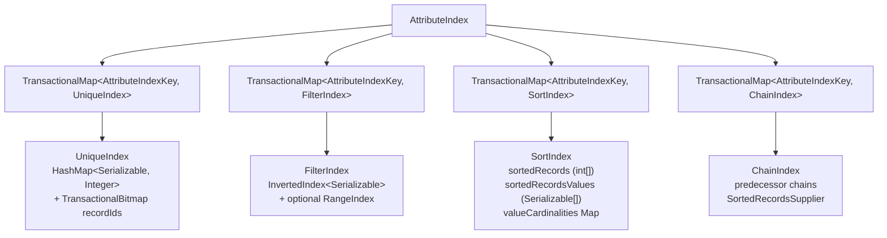
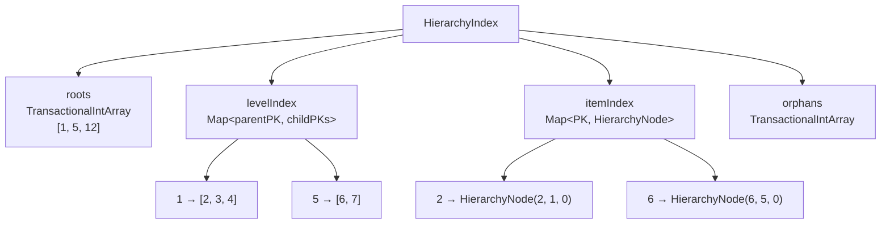
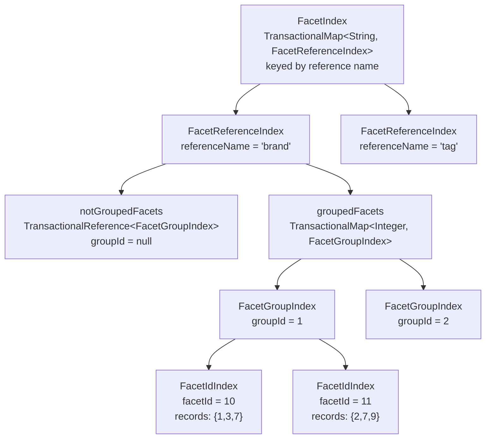
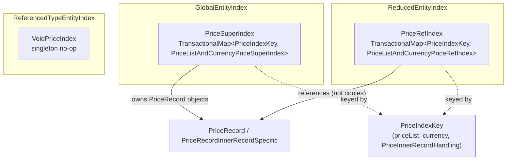
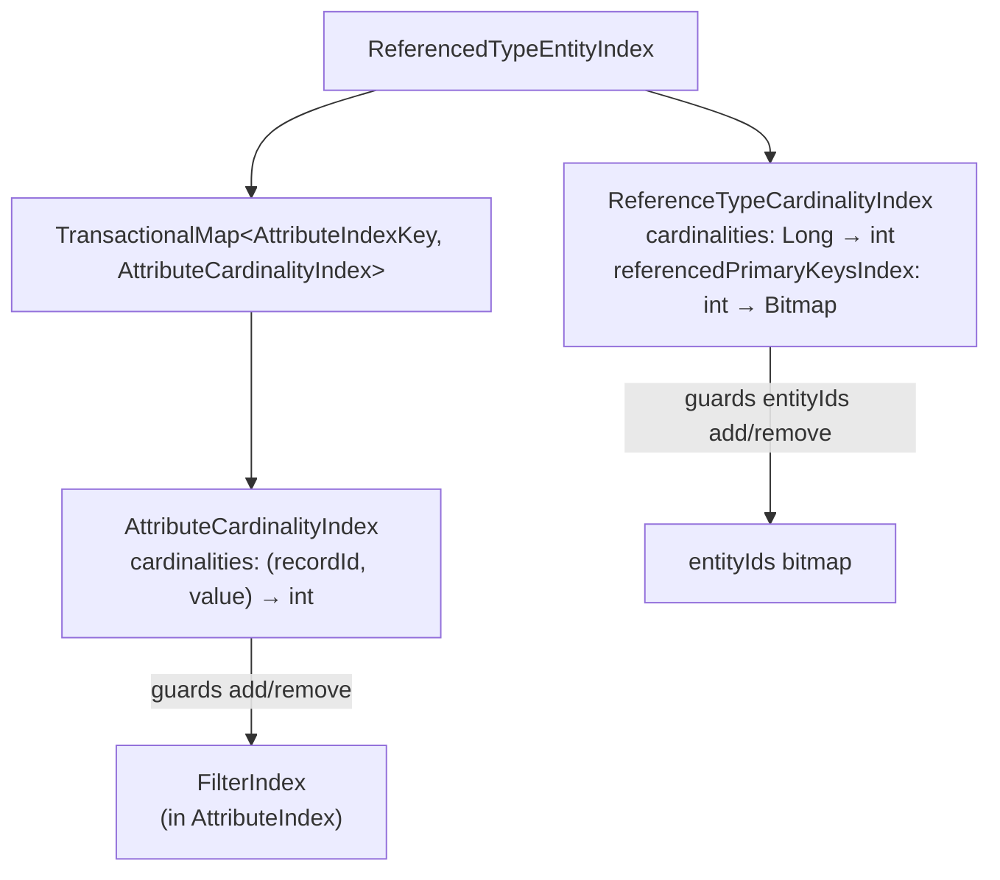

# Data Structures Inside EntityIndex

Every `EntityIndex` -- regardless of its concrete type -- composes the same set of inner data structures:
an `AttributeIndex`, a `HierarchyIndex`, a `FacetIndex`, and a price index. The concrete implementations
and the features they support differ across the three `EntityIndex` subclasses. This document covers each
data structure in depth: its internal fields, the queries it enables, and how it behaves in each index type.

All data structures participate in evitaDB's software-transactional-memory (STM) layer. Mutations within
a transaction produce isolated copies; readers outside the transaction continue to see the pre-transaction
snapshot. See [Transactions](../../user/en/deep-dive/transactions.md) for the STM internals.

> **Scope.** This page focuses on **what** each data structure stores and **why**. For information about
> **when** indexes are created (schema settings) see [schema-settings.md](schema-settings.md). For the
> mutation flow that populates them see [mutation-flow.md](mutation-flow.md).


---

## AttributeIndex

`AttributeIndex` is the container for all attribute-related search structures. It does not hold data
directly -- it delegates to four specialised sub-indexes, each stored in its own `TransactionalMap`
keyed by `AttributeIndexKey`.

An `AttributeIndex` may contain
<Term location="/documentation/developer/indexes/overview.md" name="entity attribute">**entity-level attributes**</Term>
(defined on the entity schema, e.g., product `name`) or
<Term location="/documentation/developer/indexes/overview.md" name="reference attribute">**reference-level attributes
**</Term>
(defined on a reference schema, e.g., `priority` on a product-to-category reference), or both.
The attribute type is encoded in the `AttributeIndexKey.referenceName` field: `null` for entity attributes,
non-null for reference attributes. Which types are present depends on the index:

- <Term location="/documentation/developer/indexes/overview.md" name="Global Entity Index">**GlobalEntityIndex**</Term>
  -- entity attributes only (reference attributes are not stored here)
- <Term location="/documentation/developer/indexes/overview.md" name="Reduced Entity Index">**ReducedEntityIndex
  **</Term>
  -- reference attributes always; entity attributes only when
  `ReferenceIndexType` is `FOR_FILTERING_AND_PARTITIONING`
  (see [schema-settings.md](schema-settings.md#reference-index-type))
- <Term location="/documentation/developer/indexes/overview.md" name="Referenced Type Entity Index">*
  *ReferencedTypeEntityIndex**</Term>
  -- reference attributes only (filter indexes with cardinality
  tracking, no sort indexes)

```
io.evitadb.index.attribute.AttributeIndex
  io.evitadb.spi.store.catalog.persistence.storageParts.index.AttributeIndexKey
```

### AttributeIndexKey

Every sub-index entry is identified by an `AttributeIndexKey` that encodes:

| Component       | Type     | Nullable | Purpose                                            |
|-----------------|----------|----------|----------------------------------------------------|
| `referenceName` | `String` | yes      | Non-null when the attribute belongs to a reference |
| `attributeName` | `String` | no       | The schema-level attribute name                    |
| `locale`        | `Locale` | yes      | Non-null only for localised attributes             |

A single logical attribute (e.g. `name` with three locales) produces three separate `AttributeIndexKey`
entries -- one per locale. Non-localised attributes produce a single key with `locale == null`.

### Container Fields

```java
// io.evitadb.index.attribute.AttributeIndex (simplified)
TransactionalMap<AttributeIndexKey, UniqueIndex> uniqueIndex;
TransactionalMap<AttributeIndexKey, FilterIndex> filterIndex;
TransactionalMap<AttributeIndexKey, SortIndex> sortIndex;
TransactionalMap<AttributeIndexKey, ChainIndex> chainIndex;
```

The `referenceKey` field (nullable
<Term location="/documentation/developer/indexes/overview.md" name="Representative Reference Key">
`RepresentativeReferenceKey`</Term>)
is present when the `AttributeIndex` belongs to a `ReducedEntityIndex`. It is `null` in the
`GlobalEntityIndex`.

### Nesting Diagram



### UniqueIndex

```
io.evitadb.index.attribute.UniqueIndex
```

Enforces attribute uniqueness and provides O(1) value-to-record-id lookups.

**Core fields:**

| Field                   | Type                                      | Purpose                                     |
|-------------------------|-------------------------------------------|---------------------------------------------|
| `uniqueValueToRecordId` | `TransactionalMap<Serializable, Integer>` | Value to owning entity PK; O(1) lookup      |
| `recordIds`             | `TransactionalBitmap`                     | All entity PKs present in this unique index |
| `type`                  | `Class<? extends Serializable>`           | Declared attribute type                     |
| `entityType`            | `String`                                  | Owning entity collection name               |

**Behaviour:** Inserting a value that already maps to a different record id throws
`UniqueValueViolationException`. Array-valued attributes are supported -- each element of the array is
inserted as a separate unique entry pointing to the same record id.

**Supported queries:** `attributeEquals` (exact match), `attributeIs NULL/NOT_NULL`.

### FilterIndex

```
io.evitadb.index.attribute.FilterIndex
```

Answers range, equality, and string-matching filter queries.

**Core fields:**

| Field           | Type                          | Purpose                                              |
|-----------------|-------------------------------|------------------------------------------------------|
| `invertedIndex` | `InvertedIndex<Serializable>` | Value to `Bitmap` of record ids (inverted posting)   |
| `rangeIndex`    | `RangeIndex` (nullable)       | Present only for `Range` subtypes; interval queries  |
| `normalizer`    | `UnaryOperator<Serializable>` | Unicode normalization for locale-aware string search |
| `comparator`    | `Comparator<?>`               | Locale-aware or natural ordering                     |

The `InvertedIndex` stores `ValueToRecordBitmap<Serializable>` entries sorted by value, enabling binary
search for range scans. When the attribute type is a `Range` subtype (e.g. `DateTimeRange`,
`BigDecimalNumberRange`) a `RangeIndex` is built in addition, supporting `validIn` / `overlapping`
queries.

**Supported queries:** `attributeEquals`, `attributeGreaterThan`, `attributeLessThan`,
`attributeBetween`, `attributeStartsWith`, `attributeEndsWith`, `attributeContains`,
`attributeIs NULL/NOT_NULL`, `priceValidIn` (via `RangeIndex`), `attributeInRange`.

### SortIndex

```
io.evitadb.index.attribute.SortIndex
```

Provides pre-sorted entity primary key arrays for ORDER BY clauses.

**Core fields:**

| Field                 | Type                                      | Purpose                                              |
|-----------------------|-------------------------------------------|------------------------------------------------------|
| `sortedRecords`       | `TransactionalUnorderedIntArray`          | Entity PKs in sort order                             |
| `sortedRecordsValues` | `TransactionalObjArray<Serializable>`     | Corresponding attribute values (parallel array)      |
| `valueCardinalities`  | `TransactionalMap<Serializable, Integer>` | Tracks values with cardinality > 1                   |
| `comparatorBase`      | `ComparatorSource[]`                      | Describes type, order direction, null behaviour      |
| `normalizer`          | `UnaryOperator<Serializable>`             | Unicode normalizer for String-typed attributes       |
| `comparator`          | `Comparator<?>`                           | Built from `comparatorBase`; locale-aware for String |

The parallel-array design avoids per-record object allocation. `sortedRecords[i]` is the entity PK and
`sortedRecordsValues[j]` is its attribute value, where `j` is determined by binary searching the values
array. Records sharing the same value are sorted naturally (ascending PK) within their block.

**Sortable attribute compounds.** There is no separate `SortableAttributeCompoundIndex` class.
Compound sorts are handled by `SortIndex` itself: each compound value is wrapped in a `ComparableArray`
record (`Serializable[]` with a `ComparableArrayComparator`). The `comparatorBase` array then contains
one `ComparatorSource` entry per component attribute. `SortIndex.createCombinedComparatorFor` builds
the composite `Comparator<ComparableArray>` from these descriptors, respecting per-component order
direction, null-handling behaviour, and locale.

**Supported queries:** `attributeNatural` (ascending/descending), sortable attribute compound ordering.

### ChainIndex

```
io.evitadb.index.attribute.ChainIndex
```

Supports predecessor-based ordering for attributes of type `Predecessor` or
`ReferencedEntityPredecessor`. Instead of a comparable value, each entity declares "which entity comes
before me in the chain". The `ChainIndex` reconstructs the total order from these pairwise predecessor
relationships.

**Key concepts:**

- Each entity either declares a predecessor PK or is the head of a chain (predecessor = `HEAD`).
- The index maintains a map of chains and per-element state, rebuilding the sorted order lazily.
- Provides a `SortedRecordsSupplier` that is consumed by the query engine identically to the one
  from `SortIndex`.

**Supported queries:** `attributeNatural` on `Predecessor`/`ReferencedEntityPredecessor` attributes.

### Behaviour Across EntityIndex Types

| Feature                        | GlobalEntityIndex | ReducedEntityIndex                       | ReducedGroupEntityIndex                  | ReferencedTypeEntityIndex |
|--------------------------------|-------------------|------------------------------------------|------------------------------------------|---------------------------|
| Unique indexes                 | yes               | yes (reference attrs)                    | **no** (no-op)                           | no                        |
| Filter indexes                 | yes               | yes (reference attrs)                    | yes (with cardinality)                   | yes (with cardinality)    |
| Sort indexes                   | yes               | yes (reference attrs)                    | **no** (no-op)                           | **no** (no-op)            |
| Chain indexes                  | yes               | yes (reference attrs)                    | no                                       | no                        |
| Entity-level attribute indexes | yes               | only if `FOR_FILTERING_AND_PARTITIONING` | only if `FOR_FILTERING_AND_PARTITIONING` | no                        |

In `ReferencedTypeEntityIndex`, `insertSortAttribute` and `removeSortAttribute` are explicit no-ops.
Only filter indexes are maintained, and each filter value is tracked by a paired
`AttributeCardinalityIndex` to handle correct removal when multiple
<Term location="/documentation/developer/indexes/overview.md" name="owning entity">owning entities</Term>
contribute the same attribute value (see [Cardinality Indexes](#cardinality-indexes)).

### Test Blueprint Hints -- Attribute Indexes

1. **Unique violation.** Inserting a duplicate value for the same `UniqueIndex` (same `AttributeIndexKey`)
   must throw `UniqueValueViolationException`. Inserting the same value for the same record id must
   succeed silently (idempotent upsert).

2. **Filter round-trip.** For every value inserted into a `FilterIndex`, the `InvertedIndex` must contain
   a `ValueToRecordBitmap` entry whose bitmap includes the inserted record id. After removal the bitmap
   must no longer contain that id; if the bitmap becomes empty the entire entry must be evicted.

3. **Sort parallel-array consistency.** `sortedRecords.length` must always equal the sum of all
   `valueCardinalities` entries (or the count of values when cardinality is 1). Inserting a record with
   a new value must increase `sortedRecordsValues.length` by exactly one.

4. **Compound sort ordering.** A `SortIndex` with `comparatorBase.length > 1` must sort records by
   the first component first, then by the second component for ties, and so on. This must hold after
   insertions, removals, and transactional merges.

5. **Locale isolation.** Two `FilterIndex` instances for the same attribute but different locales must
   be fully independent. Adding a record in locale `en` must not affect the index for locale `cs`.

6. **ReferencedTypeEntityIndex no-op.** Calling `insertSortAttribute` on a `ReferencedTypeEntityIndex`
   must not create a `SortIndex` entry.

---

## HierarchyIndex

```
io.evitadb.index.hierarchy.HierarchyIndex
```

The `HierarchyIndex` models parent-child relationships between entities of the same type. It supports
the hierarchy-related filter and require constraints (`hierarchyWithin`, `hierarchyWithinRoot`,
`parents`, `children`, `siblings`).

### Core Fields

| Field        | Type                                               | Purpose                                                                |
|--------------|----------------------------------------------------|------------------------------------------------------------------------|
| `roots`      | `TransactionalIntArray`                            | Entity PKs at the root level (no parent)                               |
| `levelIndex` | `TransactionalMap<Integer, TransactionalIntArray>` | Parent PK to sorted array of child PKs                                 |
| `itemIndex`  | `TransactionalMap<Integer, HierarchyNode>`         | PK to `HierarchyNode(entityPrimaryKey, parentKey, orderAmongSiblings)` |
| `orphans`    | `TransactionalIntArray`                            | PKs whose declared parent does not yet exist                           |

### Structure Diagram



### Out-of-Order Insertion

The index allows children to be added before their parent exists. Such entities are placed into the
`orphans` array. When the parent is later added via `addNode`, the orphan and all its transitive
descendants are moved from `orphans` into `levelIndex` in a single operation.

Removing a parent node moves all its children back to `orphans` unless they are simultaneously
reparented.

### Tree Traversal

The index supports both depth-first and breadth-first traversal. The `listHierarchyNodesFromRoot`
and `listHierarchyNodesFromParent` methods accept a `HierarchyFilteringPredicate` that can prune
subtrees during traversal, and a `TraversalMode` (depth-first or breadth-first).

All traversal results are returned as `Bitmap` instances (backed by `RoaringBitmap`), which can be
directly fed into the query algebra as `Formula` operands.

### Hierarchy and EntityIndex Types

| EntityIndex type            | Hierarchy support                                                    |
|-----------------------------|----------------------------------------------------------------------|
| `GlobalEntityIndex`         | Full -- nodes are added/removed via `addNode`/`removeNode`           |
| `ReducedEntityIndex`        | **None** -- `addNode`/`removeNode` throw `GenericEvitaInternalError` |
| `ReferencedTypeEntityIndex` | **None** -- hierarchy is always empty                                |

Only the
<Term location="/documentation/developer/indexes/overview.md" name="Global Entity Index">`GlobalEntityIndex`</Term>
maintains hierarchy relationships. Hierarchy is a property of the entity type itself, not of any
particular reference partition.

### Test Blueprint Hints -- HierarchyIndex

1. **Orphan resolution.** Add child C with parent P, where P does not yet exist. Assert C is in
   `orphans`. Then add P as a root. Assert C is no longer in `orphans` and appears in
   `levelIndex.get(P.pk)`.

2. **Root consistency.** Every PK in `roots` must have a `HierarchyNode` in `itemIndex` whose
   `parentKey` is `null`. Every PK **not** in `roots` and not in `orphans` must have a non-null
   `parentKey`.

3. **Cascading removal.** Removing a parent node must move all direct children to `orphans`. If those
   children themselves have children, those grandchildren must also become orphans.

4. **ReducedEntityIndex guard.** Calling `addNode` on a `ReducedEntityIndex` must throw
   `GenericEvitaInternalError`.

5. **Cycle detection.** Attempting to set an entity as its own parent (or create a cycle) must be
   rejected.

---

## FacetIndex

```
io.evitadb.index.facet.FacetIndex
```

The `FacetIndex` provides O(1) access to bitmaps of entity primary keys that possess a given facet.
It supports the `facetHaving` filtering constraint and drives `facetSummary` computation.

### Four-Level Nesting

The facet index uses a four-level nesting hierarchy:



### Level Descriptions

**Level 1 -- `FacetIndex`**

| Field              | Type                                            | Purpose                                      |
|--------------------|-------------------------------------------------|----------------------------------------------|
| `facetingEntities` | `TransactionalMap<String, FacetReferenceIndex>` | One entry per reference name that has facets |

**Level 2 -- `FacetReferenceIndex`**

| Field               | Type                                         | Purpose                                      |
|---------------------|----------------------------------------------|----------------------------------------------|
| `referenceName`     | `String`                                     | The reference schema name                    |
| `notGroupedFacets`  | `TransactionalReference<FacetGroupIndex>`    | Facets without a group assignment            |
| `groupedFacets`     | `TransactionalMap<Integer, FacetGroupIndex>` | Group PK to group index                      |
| `facetToGroupIndex` | `TransactionalMap<Integer, int[]>`           | Facet PK to array of group PKs it belongs to |

**Level 3 -- `FacetGroupIndex`**

| Field            | Type                                      | Purpose                         |
|------------------|-------------------------------------------|---------------------------------|
| `groupId`        | `Integer` (nullable)                      | Null for the not-grouped bucket |
| `facetIdIndexes` | `TransactionalMap<Integer, FacetIdIndex>` | Facet PK to leaf index          |

**Level 4 -- `FacetIdIndex`**

| Field     | Type                  | Purpose                                                      |
|-----------|-----------------------|--------------------------------------------------------------|
| `facetId` | `int`                 | Primary key of the faceted entity                            |
| `records` | `TransactionalBitmap` | Bitmap of owning entity PKs that reference this facet entity |

### Query Flow

For a `facetHaving('brand', entityPrimaryKeyInSet(10, 11))` constraint, the engine:

1. Looks up `facetingEntities.get("brand")` to obtain the `FacetReferenceIndex`.
2. For each requested facet PK (10, 11), locates the `FacetIdIndex` via `facetToGroupIndex` and the
   appropriate `FacetGroupIndex`.
3. Retrieves the `records` bitmap from each `FacetIdIndex`.
4. Combines the bitmaps with AND/OR depending on whether the facets are in the same group (disjunction
   within a group, conjunction across groups -- the default `FacetGroupFormula` behaviour).

### Test Blueprint Hints -- FacetIndex

1. **Bitmap accuracy.** After adding entity PK 42 with a reference to facet 10 in group 1, the bitmap
   at `facetIndex.get("brand").groupedFacets.get(1).facetIdIndexes.get(10).records` must contain 42.

2. **Group-less facets.** Facets added without a group must reside in `notGroupedFacets`. The
   `groupedFacets` map must not contain an entry with a null key.

3. **facetToGroupIndex consistency.** For every `FacetIdIndex` inside a `FacetGroupIndex` with
   `groupId = G`, the `facetToGroupIndex.get(facetId)` array must contain `G`.

4. **Empty cleanup.** After removing the last entity from a `FacetIdIndex`, the index must be removed
   from its parent `FacetGroupIndex`. If the group becomes empty, it must be removed from the
   `FacetReferenceIndex`. If the reference becomes empty, it must be removed from `FacetIndex`.

5. **Cross-group disjunction.** Two facets in the **same** group should be combined with OR. Two facets
   in **different** groups should be combined with AND. This is the default behaviour of
   `FacetGroupFormula`.

---

## Price Indexes

evitaDB maintains three implementations of `PriceIndexContract`, each used by a different `EntityIndex`
subclass. The design goal is to avoid duplicating `PriceRecord` objects across global and reduced
indexes -- a principle called
<Term location="/documentation/developer/indexes/overview.md" name="price record sharing">price record sharing</Term>.

### Relationship Diagram



### PriceIndexKey

```
io.evitadb.index.price.model.PriceIndexKey
```

| Field            | Type                       | Purpose                                   |
|------------------|----------------------------|-------------------------------------------|
| `priceList`      | `String`                   | Price list name (e.g. `"basic"`, `"vip"`) |
| `currency`       | `Currency`                 | ISO 4217 currency                         |
| `recordHandling` | `PriceInnerRecordHandling` | `NONE`, `LOWEST_PRICE`, or `SUM`          |

The `PriceIndexKey` extends `AbstractPriceKey` and implements `Comparable<PriceIndexKey>` with a
natural ordering of currency code, then price list, then record handling.

### PriceSuperIndex

```
io.evitadb.index.price.PriceSuperIndex
```

Used exclusively in
<Term location="/documentation/developer/indexes/overview.md" name="Global Entity Index">`GlobalEntityIndex`</Term>.
For each `PriceIndexKey` it maintains a `PriceListAndCurrencyPriceSuperIndex` that holds the
authoritative `PriceRecord` instances.

**Key operations:**

- `addPrice` creates a `PriceRecord` (or `PriceRecordInnerRecordSpecific` when `innerRecordId` is
  non-null) and inserts it into the appropriate sub-index along with its optional `DateTimeRange`
  validity.
- `removePrice` removes the record by `internalPriceId` and validity range.

The `PriceSuperIndex` is the **single source of truth** for price record objects.

### PriceRefIndex

```
io.evitadb.index.price.PriceRefIndex
```

Used exclusively in
<Term location="/documentation/developer/indexes/overview.md" name="Reduced Entity Index">`ReducedEntityIndex`</Term>.
It maintains the same `PriceIndexKey`-keyed map structure but its sub-indexes
(`PriceListAndCurrencyPriceRefIndex`) do **not** allocate new `PriceRecord` objects. Instead, each
`PriceListAndCurrencyPriceRefIndex` locates the shared `PriceRecord` from the corresponding
`PriceListAndCurrencyPriceSuperIndex` in the `GlobalEntityIndex` via an `initCallback` set during
`attachToCatalog`.

**Key characteristics:**

- Scope-aware: carries a `Scope` field matching the parent `EntityIndexKey.scope()`.
- The `addPrice` method receives only the `internalPriceId` and validity, then fetches the full
  `PriceRecord` from the super index. No new price record allocation occurs.
- Catches `PriceListAndCurrencyPriceIndexTerminated` during `removePrice` and removes the sub-index
  when the backing super index has been evicted.

### VoidPriceIndex

```
io.evitadb.index.price.VoidPriceIndex
```

A singleton (`VoidPriceIndex.INSTANCE`) used exclusively in `ReferencedTypeEntityIndex`. All query
methods return empty results. All mutation methods throw `UnsupportedOperationException`.

The `ReferencedTypeEntityIndex` never processes price-related queries -- it exists solely for
reference-attribute filtering. The void implementation avoids null checks throughout the codebase.

### Summary Table

| Aspect                      | PriceSuperIndex                       | PriceRefIndex                       | VoidPriceIndex              |
|-----------------------------|---------------------------------------|-------------------------------------|-----------------------------|
| Used in                     | `GlobalEntityIndex`                   | `ReducedEntityIndex`                | `ReferencedTypeEntityIndex` |
| Owns PriceRecord objects    | Yes                                   | No (references super index)         | N/A                         |
| Sub-index class             | `PriceListAndCurrencyPriceSuperIndex` | `PriceListAndCurrencyPriceRefIndex` | none                        |
| Scope-aware                 | No                                    | Yes                                 | N/A                         |
| CatalogRelatedDataStructure | No                                    | Yes (attachToCatalog)               | No                          |
| Singleton                   | No                                    | No                                  | Yes                         |

### Test Blueprint Hints -- Price Indexes

1. **Record sharing.** After adding a price to both `GlobalEntityIndex` and `ReducedEntityIndex`, the
   `PriceRecord` instance in the `PriceRefIndex`'s sub-index must be the **same object** (reference
   equality, `==`) as the one in the `PriceSuperIndex`'s sub-index.

2. **VoidPriceIndex immutability.** Calling `addPrice` on `VoidPriceIndex.INSTANCE` must throw
   `UnsupportedOperationException`. Calling `getPriceIndex` must return `null`.
   `isPriceIndexEmpty()` must return `true`.

3. **PriceIndexKey ordering.** Two keys with the same currency but different price lists must sort
   by price list name. Keys with different currencies must sort by ISO currency code first.

4. **Terminated cascade.** When a `PriceListAndCurrencyPriceSuperIndex` is removed (e.g. the last
   price for a `PriceIndexKey` is deleted), the corresponding `PriceListAndCurrencyPriceRefIndex`
   in every `ReducedEntityIndex` that references it must also be removed. The `PriceRefIndex`
   catches `PriceListAndCurrencyPriceIndexTerminated` and calls `removeExistingIndex`.

5. **Scope match.** A `PriceRefIndex` created with `Scope.LIVE` must never receive price records
   from a `PriceSuperIndex` in a different scope.

---

## Cardinality Indexes

Cardinality indexes exist in
<Term location="/documentation/developer/indexes/overview.md" name="Referenced Type Entity Index">
`ReferencedTypeEntityIndex`</Term>
and `ReducedGroupEntityIndex`.
They solve a problem where multiple
<Term location="/documentation/developer/indexes/overview.md" name="owning entity">owning entities</Term>
can contribute the same attribute value or reference the same target PK. A naive approach would
remove the value from the filter index on the first entity removal, breaking queries for the
remaining entities.

### ReferenceTypeCardinalityIndex

```
io.evitadb.index.cardinality.ReferenceTypeCardinalityIndex
```

Tracks how many
<Term location="/documentation/developer/indexes/overview.md" name="owning entity">owning entities</Term>
reference each
<Term location="/documentation/developer/indexes/overview.md" name="referenced entity">target entity</Term>
primary key, and which reduced-index primary keys contributed.

| Field                        | Type                                             | Purpose                                             |
|------------------------------|--------------------------------------------------|-----------------------------------------------------|
| `cardinalities`              | `TransactionalMap<Long, Integer>`                | Composed key (via `NumberUtils.join`) to count      |
| `referencedPrimaryKeysIndex` | `TransactionalMap<Integer, TransactionalBitmap>` | Referenced PK to set of index PKs that reference it |

**Composed key format.** The `Long` key in `cardinalities` is produced by `NumberUtils.join(int, int)`,
packing two 32-bit integers (the index primary key and the referenced entity primary key) into a single
64-bit long. This avoids object allocation for a composite key.

**Lifecycle:**

1. `addKey(indexPrimaryKey, referencedEntityPrimaryKey)` increments the cardinality. If this is the
   first occurrence, the entity PK is added to the parent index's `entityIds` bitmap.
2. `removeKey(indexPrimaryKey, referencedEntityPrimaryKey)` decrements the cardinality. Only when the
   count reaches zero is the entity PK removed from `entityIds`.

### AttributeCardinalityIndex

```
io.evitadb.index.cardinality.AttributeCardinalityIndex
```

Tracks per-attribute-value cardinality within a `ReferencedTypeEntityIndex`. One instance exists per
`AttributeIndexKey` that has been populated.

| Field           | Type                                                 | Purpose                    |
|-----------------|------------------------------------------------------|----------------------------|
| `valueType`     | `Class<? extends Serializable>`                      | Declared attribute type    |
| `cardinalities` | `TransactionalMap<AttributeCardinalityKey, Integer>` | (recordId, value) to count |

**`AttributeCardinalityKey`** is a record containing `(int recordId, Serializable value)`. It uniquely
identifies one entity's contribution of a particular attribute value.

**Lifecycle:**

1. `addRecord(recordId, value)` increments the cardinality for the (recordId, value) pair. If this is
   the first occurrence of this value across all record ids, the value is also inserted into the
   associated `FilterIndex`.
2. `removeRecord(recordId, value)` decrements the cardinality. Only when no record id contributes
   this value any more is it removed from the `FilterIndex`.

### Cardinality Diagram



### Cardinality in ReducedGroupEntityIndex

`ReducedGroupEntityIndex` uses the same `AttributeCardinalityIndex` mechanism as
`ReferencedTypeEntityIndex` for **filter attribute** deduplication. In addition, it maintains
**inline PK cardinality** tracking:

| Field                        | Type                                             | Purpose                                             |
|------------------------------|--------------------------------------------------|-----------------------------------------------------|
| `pkCardinalities`            | `TransactionalMap<Integer, Integer>`              | Owning entity PK to insertion count                 |
| `referencedPrimaryKeysIndex` | `TransactionalMap<Integer, TransactionalBitmap>`  | Referenced PK to set of owning entity PKs           |
| `cardinalityIndexes`         | `TransactionalMap<AttributeIndexKey, AttributeCardinalityIndex>` | Per-attribute cardinality tracking |

Unlike `ReferencedTypeEntityIndex` (which uses `ReferenceTypeCardinalityIndex` with packed
`Long` keys), `ReducedGroupEntityIndex` uses a simple `Map<Integer, Integer>` for PK
cardinality. This is because the group index does not need to track a mapping between two
different kinds of primary keys (index PK vs. referenced entity PK) -- it directly tracks
owning entity PK counts.

### Test Blueprint Hints -- Cardinality Indexes

1. **Deferred removal.** Add the same attribute value `"red"` for two different record ids (entity PKs)
   to a `ReferencedTypeEntityIndex`. Remove the value for one record id. The `FilterIndex` must still
   contain `"red"` in its inverted index. Only after removing the second record id should `"red"` be
   evicted from the `FilterIndex`.

2. **entityIds bitmap consistency.** In `ReferenceTypeCardinalityIndex`, an entity PK must appear in
   `entityIds` as long as its cardinality is > 0. When the cardinality reaches 0, the PK must be
   removed from `entityIds`.

3. **Composed key correctness.** `NumberUtils.join(a, b)` followed by `NumberUtils.extractHighInt()`
   and `NumberUtils.extractLowInt()` must return the original `a` and `b` respectively.

4. **No sort indexes.** `ReferencedTypeEntityIndex` must never create `SortIndex` entries even if the
   attribute schema declares `sortable = true`. Only `FilterIndex` (with cardinality tracking) is
   maintained.

---

## Summary: Sub-Indexes Per EntityIndex Type

| Sub-index / Feature               | GlobalEntityIndex       | ReducedEntityIndex                             | ReducedGroupEntityIndex                                  | ReferencedTypeEntityIndex                         |
|-----------------------------------|-------------------------|------------------------------------------------|----------------------------------------------------------|---------------------------------------------------|
| `entityIds` bitmap                | yes (owning entity PKs) | yes (owning entity PKs)                        | yes (owning entity PKs, PK card.-guarded)                | yes (referenced entity PKs, card.-guarded)        |
| `entityIdsByLanguage`             | yes                     | yes                                            | yes                                                      | yes                                               |
| **AttributeIndex**                | yes (entity attrs only) | yes (ref attrs always + entity attrs if PART.) | yes (ref attrs filter only + entity attrs if PART.)      | yes (ref attrs only, filter, no sort)             |
| -- UniqueIndex                    | yes (entity attrs)      | yes (ref attrs; + entity attrs if PART.)       | no (no-op)                                               | no                                                |
| -- FilterIndex                    | yes (entity attrs)      | yes (ref attrs; + entity attrs if PART.)       | yes (ref attrs, with `AttributeCardinalityIndex`)        | yes (ref attrs, with `AttributeCardinalityIndex`) |
| -- SortIndex                      | yes (entity attrs)      | yes (ref attrs; + entity attrs if PART.)       | no (no-op)                                               | no (no-op)                                        |
| -- ChainIndex                     | yes (entity attrs)      | yes (ref attrs; + entity attrs if PART.)       | no                                                       | no                                                |
| **HierarchyIndex**                | yes                     | no (throws)                                    | no                                                       | no                                                |
| **FacetIndex**                    | yes                     | yes                                            | yes                                                      | yes                                               |
| **Price index**                   | `PriceSuperIndex`       | `PriceRefIndex`                                | `PriceRefIndex`                                          | `VoidPriceIndex`                                  |
| **ReferenceTypeCardinalityIndex** | no                      | no                                             | no                                                       | yes                                               |
| **PK cardinality (inline map)**   | no                      | no                                             | yes (`Map<Integer, Integer>`)                            | no                                                |
| **AttributeCardinalityIndex**     | no                      | no                                             | yes (per filter attribute)                               | yes (per attribute)                               |

**Legend:** "entity attrs" = entity-level attributes; "ref attrs" = reference-level attributes;
"PART." = `ReferenceIndexType.FOR_FILTERING_AND_PARTITIONING`.

For
<Term location="/documentation/developer/indexes/overview.md" name="Reduced Entity Index">`ReducedEntityIndex`</Term>,
<Term location="/documentation/developer/indexes/overview.md" name="reference attribute">reference-level
attributes</Term>
are **always** indexed regardless of the `ReferenceIndexType` level. Entity-level attributes are only
replicated when the reference schema declares `FOR_FILTERING_AND_PARTITIONING`.
<Term location="/documentation/developer/indexes/overview.md" name="Global Entity Index">`GlobalEntityIndex`</Term>
never stores reference attributes;
<Term location="/documentation/developer/indexes/overview.md" name="Referenced Type Entity Index">
`ReferencedTypeEntityIndex`</Term>
never stores
<Term location="/documentation/developer/indexes/overview.md" name="entity attribute">entity attributes</Term>.
