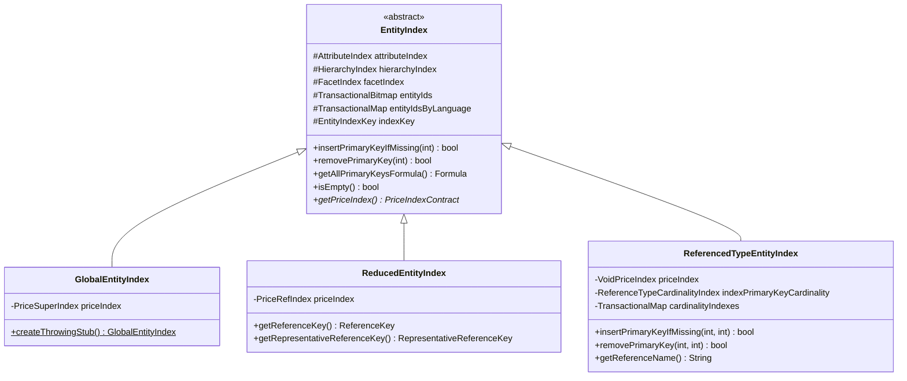

# The EntityIndex Hierarchy

This document describes the `EntityIndex` class hierarchy, the `EntityIndexType` enum, the
`EntityIndexKey` addressing scheme, and the three concrete index implementations:
`GlobalEntityIndex`, `ReducedEntityIndex`, and `ReferencedTypeEntityIndex`.

For the overall architecture context, see the [Overview](overview.md#overview).


## EntityIndexType Enum

`EntityIndexType` (in `io.evitadb.index`) defines all flavors of entity index. Each value maps
to a specific concrete class and discriminator type.

### GLOBAL

The primary index for an entity type. There is exactly **one**
<Term location="/documentation/developer/indexes/overview.md" name="Global Entity Index">`GlobalEntityIndex`</Term>
per entity type per
<Term location="/documentation/developer/indexes/overview.md" name="scope">`Scope`</Term>.
It contains the complete set of indexed data: all entity primary keys, all attribute
indexes (filter, sort, unique, chain), the full `PriceSuperIndex`, the `HierarchyIndex`, and the
`FacetIndex`.

When the query planner cannot narrow the search to a more specific index, it falls back to the
global index -- analogous to a full table scan in a relational database, though still operating on
pre-built bitmap structures.

**Discriminator:** `null`

### REFERENCED_ENTITY_TYPE

A type-level index that exists once per reference name (e.g., one for "brand", one for "category").
It is backed by
<Term location="/documentation/developer/indexes/overview.md" name="Referenced Type Entity Index">`ReferencedTypeEntityIndex`</Term>
and holds:

- **Reference attribute filter indexes** -- filter indexes for
  <Term location="/documentation/developer/indexes/overview.md" name="reference attribute">reference attributes</Term>
  defined on the relation, with cardinality tracking via `AttributeCardinalityIndex`
- **`ReferenceTypeCardinalityIndex`** -- tracks how many owning entities contribute to each
  `ReducedEntityIndex` storage PK entry in this type index. A storage PK is added to `entityIds`
  on first insertion and removed only when its cardinality drops to zero.
- **Entity ID bitmap** -- contains the storage primary keys of the `ReducedEntityIndex` instances
  (one per unique referenced target) for this reference name. Unlike `GlobalEntityIndex` and
  `ReducedEntityIndex` which store owning entity PKs, this index stores internal
  `ReducedEntityIndex` storage PKs assigned via `indexPkSequence`. The
  `ReferenceTypeCardinalityIndex` provides the mapping between these storage PKs and the actual
  referenced entity PKs.

It does **not** hold sort indexes (because a single entity may reference multiple targets, making
sort ordering ambiguous), price indexes (delegates to `VoidPriceIndex`), or hierarchy data.

This index is used when the query contains a `ReferenceHaving` constraint and needs to resolve
reference attribute filters without iterating individual reduced indexes.

**Discriminator:** `String` -- the `ReferenceSchemaContract.getName()` value

### REFERENCED_ENTITY

A per-target-entity index backed by
<Term location="/documentation/developer/indexes/overview.md" name="Reduced Entity Index">`ReducedEntityIndex`</Term>.
There is one instance for each combination of (reference name, referenced entity primary key,
representative attribute values). It contains:

- **Entity ID bitmap** -- primary keys of
  <Term location="/documentation/developer/indexes/overview.md" name="owning entity">**owning** entities</Term>
  that hold a reference to this specific target (same semantics as `GlobalEntityIndex` -- these are
  the indexed entity's PKs, not the target entity's PK)
- **Reference attribute indexes** -- filter and sort indexes for the
  <Term location="/documentation/developer/indexes/overview.md" name="reference attribute">reference's attributes</Term>
- **Entity attribute indexes** --
  <Term location="/documentation/developer/indexes/overview.md" name="entity attribute">entity attributes</Term>
  replicated from the global index, only when `ReferenceIndexType` is `FOR_FILTERING_AND_PARTITIONING`
  (see [schema-settings.md](schema-settings.md#reference-index-type))
- **`PriceRefIndex`** -- a lightweight
  <Term location="/documentation/developer/indexes/overview.md" name="price record sharing">price-sharing index</Term>
  that reuses price record instances from the global `PriceSuperIndex` without duplicating them;
  only when `ReferenceIndexType` is `FOR_FILTERING_AND_PARTITIONING`
- **Facet data** -- for cross-reference facet queries; only when `ReferenceIndexType` is
  `FOR_FILTERING_AND_PARTITIONING`
- **Hierarchy data** -- hierarchy placement data for referenced entities that have
  `isWithHierarchy()` enabled

This is the **workhorse index for reference-based queries**. When a query filters by a specific
referenced entity (e.g., "products in category 42"), the query planner selects the
<Term location="/documentation/developer/indexes/overview.md" name="partitioned view">reduced index</Term>
keyed to that entity, instantly narrowing the search space to a pre-filtered bitmap.

**Discriminator:**
<Term location="/documentation/developer/indexes/overview.md" name="Representative Reference Key">`RepresentativeReferenceKey`</Term>
-- combines the reference name, the referenced entity primary key, and an ordered array of
representative attribute values that distinguish multiple references of the same type to the same
target.

### REFERENCED_HIERARCHY_NODE (deprecated)

Previously a dedicated index for hierarchical references. Merged into `REFERENCED_ENTITY` as of
version 2024.11 because it contained the same data without additional value.

**Discriminator:** `RepresentativeReferenceKey` (same as `REFERENCED_ENTITY`)

### REFERENCED_GROUP_ENTITY_TYPE

Analogous to `REFERENCED_ENTITY_TYPE` but partitions by the **group entity** rather than the
referenced entity. Backed by
<Term location="/documentation/developer/indexes/overview.md" name="Referenced Type Entity Index">`ReferencedTypeEntityIndex`</Term>.
Created when the schema includes `ReferenceIndexedComponents.REFERENCED_GROUP_ENTITY` in the
reference's indexed components configuration
(see [schema-settings.md](schema-settings.md#reference-indexed-components)).

Used when the query contains a `GroupHaving` constraint and needs to resolve
<Term location="/documentation/developer/indexes/overview.md" name="reference attribute">reference attribute</Term>
filters partitioned by group.

**Discriminator:** `String` -- the `ReferenceSchemaContract.getName()` value

### REFERENCED_GROUP_ENTITY

Analogous to `REFERENCED_ENTITY` but partitions by the **group entity primary key**. Backed by
<Term location="/documentation/developer/indexes/overview.md" name="Reduced Entity Index">`ReducedEntityIndex`</Term>.
Contains the same data structures as `REFERENCED_ENTITY` (entity IDs, reference attributes,
<Term location="/documentation/developer/indexes/overview.md" name="entity attribute">entity attributes</Term>,
prices, facets) but the partition key is the group entity PK rather than the referenced entity PK.
The `entityIds` bitmap contains
<Term location="/documentation/developer/indexes/overview.md" name="owning entity">**owning** entity PKs</Term>
(same semantics as `REFERENCED_ENTITY`).

**Discriminator:**
<Term location="/documentation/developer/indexes/overview.md" name="Representative Reference Key">`RepresentativeReferenceKey`</Term>
-- combines the reference name, the **group** entity primary key, and representative attribute
values.


## EntityIndexKey

<Term location="/documentation/developer/indexes/overview.md" name="Entity Index Key">`EntityIndexKey`</Term>
is the record that uniquely addresses an `EntityIndex` within an entity collection. It is defined
as:

```java
public record EntityIndexKey(
    @Nonnull EntityIndexType type,
    @Nonnull Scope scope,
    @Nullable Serializable discriminator
) implements IndexKey, Comparable<EntityIndexKey>
```

### Addressing scheme

| `EntityIndexType` | `Scope` | `discriminator` type | Example |
|---|---|---|---|
| `GLOBAL` | LIVE or ARCHIVED | `null` | `(GLOBAL, LIVE, null)` |
| `REFERENCED_ENTITY_TYPE` | LIVE or ARCHIVED | `String` | `(REF_ENTITY_TYPE, LIVE, "brand")` |
| `REFERENCED_ENTITY` | LIVE or ARCHIVED | `RepresentativeReferenceKey` | `(REF_ENTITY, LIVE, {brand/42, []})` |
| `REFERENCED_GROUP_ENTITY_TYPE` | LIVE or ARCHIVED | `String` | `(REF_GROUP_TYPE, LIVE, "category")` |
| `REFERENCED_GROUP_ENTITY` | LIVE or ARCHIVED | `RepresentativeReferenceKey` | `(REF_GROUP, LIVE, {category/7, []})` |

### Constructor validation

The constructor enforces strict type-safety between the `EntityIndexType` and the discriminator:

- **`GLOBAL`** requires `discriminator == null`. Any non-null value throws
  `GenericEvitaInternalError`.
- **`REFERENCED_ENTITY_TYPE`** and **`REFERENCED_GROUP_ENTITY_TYPE`** require a `String`
  discriminator (the reference name).
- **`REFERENCED_ENTITY`** and **`REFERENCED_GROUP_ENTITY`** require a
  <Term location="/documentation/developer/indexes/overview.md" name="Representative Reference Key">`RepresentativeReferenceKey`</Term>
  discriminator.
- Any other discriminator type throws `GenericEvitaInternalError`.

### Natural ordering

`EntityIndexKey` implements `Comparable`. The ordering is:

1. By `EntityIndexType` ordinal (GLOBAL < REFERENCED_ENTITY_TYPE < REFERENCED_ENTITY < ...)
2. Within the same type:
   - GLOBAL: by
     <Term location="/documentation/developer/indexes/overview.md" name="scope">`Scope`</Term>
     ordinal
   - `*_TYPE` variants: lexicographic by the `String` discriminator
   - `*_ENTITY` variants: by `RepresentativeReferenceKey.compareTo()`


## RepresentativeReferenceKey

The discriminator for `REFERENCED_ENTITY` and `REFERENCED_GROUP_ENTITY` indexes is a
<Term location="/documentation/developer/indexes/overview.md" name="Representative Reference Key">`RepresentativeReferenceKey`</Term>
record from `io.evitadb.api.requestResponse.data.structure`:

```java
public record RepresentativeReferenceKey(
    @Nonnull ReferenceKey referenceKey,
    @Nonnull Serializable[] representativeAttributeValues
) implements Serializable, Comparable<RepresentativeReferenceKey>
```

It combines:

- **`referenceKey`** -- the `(referenceName, primaryKey)` pair identifying the target (or group)
  entity
- **`representativeAttributeValues`** -- an ordered array of attribute values that serve as a
  domain-specific tie-breaker when multiple references share the same name and target PK

The constructor normalizes the `ReferenceKey` by stripping any extra flags (unless it is an
"unknown" reference), ensuring stable equality and hashing semantics for use as a map key.


## Class Hierarchy Diagram




## Summary Table

| EntityIndexType | Concrete Class | Discriminator | Price Index | Cardinality | Purpose |
|---|---|---|---|---|---|
| `GLOBAL` | `GlobalEntityIndex` | `null` | `PriceSuperIndex` | No | Authoritative complete index for entity type |
| `REFERENCED_ENTITY_TYPE` | `ReferencedTypeEntityIndex` | `String` | `VoidPriceIndex` | Yes | Type-level reference attribute filters |
| `REFERENCED_ENTITY` | `ReducedEntityIndex` | `RepresentativeReferenceKey` | `PriceRefIndex` | No | Per-target partitioned view for fast lookups |
| `REFERENCED_GROUP_ENTITY_TYPE` | `ReferencedTypeEntityIndex` | `String` | `VoidPriceIndex` | Yes | Group-level reference attribute filters |
| `REFERENCED_GROUP_ENTITY` | `ReducedEntityIndex` | `RepresentativeReferenceKey` | `PriceRefIndex` | No | Per-group partitioned view for fast lookups |
| `REFERENCED_HIERARCHY_NODE` | *(deprecated)* | `RepresentativeReferenceKey` | -- | -- | Merged into `REFERENCED_ENTITY` |


## GlobalEntityIndex -- Deep Dive

<Term location="/documentation/developer/indexes/overview.md" name="Global Entity Index">`GlobalEntityIndex`</Term>
is the **single source of truth** for an entity type within a given
<Term location="/documentation/developer/indexes/overview.md" name="scope">scope</Term>.
It extends `EntityIndex` and adds:

- **`PriceSuperIndex`** -- the authoritative price index that **owns** all price record objects.
  Every `PriceRefIndex` in a `ReducedEntityIndex`
  <Term location="/documentation/developer/indexes/overview.md" name="price record sharing">shares price records</Term>
  stored here, avoiding duplicate memory allocations.
- **Throwing stub factory** -- `createThrowingStub()` produces a proxy that throws
  `EntityNotManagedException` for any method not explicitly handled. This is used when a
  referenced entity type is not managed by the current catalog but its primary keys are still
  needed for query resolution.

### Transactional behavior

On commit, `createCopyWithMergedTransactionalMemory()` produces a new `GlobalEntityIndex` with:
- Merged `entityIds` bitmap
- Merged `entityIdsByLanguage` map
- Merged `AttributeIndex`, `PriceSuperIndex`, `HierarchyIndex`, `FacetIndex`
- Version incremented by 1 if any change was detected (dirty flag was set)

### Test Blueprint Hints

- **Completeness:** After inserting an entity with attributes, prices, and references, the
  global index must contain the entity PK in `entityIds`, appropriate entries in the attribute
  filter/sort/unique indexes, price records in the `PriceSuperIndex`, and -- if the entity has
  locale-specific data -- the PK in the corresponding `entityIdsByLanguage` bitmap.
- **Emptiness after removal:** Removing all entities must result in `isEmpty() == true`, which
  checks `entityIds`, `entityIdsByLanguage`, `facetIndex`, `attributeIndex`,
  `hierarchyIndex`, AND `priceIndex`.
- **Stub behavior:** Calling any data-access method on a throwing stub (except `getIndexKey()`,
  `getAllPrimaryKeys()`, and `Object` methods) must throw `EntityNotManagedException`.


## ReducedEntityIndex -- Deep Dive

<Term location="/documentation/developer/indexes/overview.md" name="Reduced Entity Index">`ReducedEntityIndex`</Term>
is the
<Term location="/documentation/developer/indexes/overview.md" name="partitioned view">**partitioned view**</Term>
that enables O(bitmap-intersection) lookups for reference-based queries. It extends `EntityIndex`
and adds:

- **`PriceRefIndex`** -- a lightweight price index that delegates to the global
  `PriceSuperIndex` for actual price record storage. It maintains its own
  `PriceListAndCurrencyPriceRefIndex` sub-indexes keyed by `(priceList, currency)` but reuses
  the price record instances.

### What data it holds

| Data | When present |
|------|-------------|
| Entity IDs referencing a specific target | Always |
| Reference attribute filter/sort indexes | Always (if attributes exist on the reference) |
| Entity attribute filter/sort indexes | Only when `ReferenceIndexType == FOR_FILTERING_AND_PARTITIONING` |
| `PriceRefIndex` | Only when `ReferenceIndexType == FOR_FILTERING_AND_PARTITIONING` |
| Facet data | Only when `ReferenceIndexType == FOR_FILTERING_AND_PARTITIONING` |
| Hierarchy data | Not maintained (throws `GenericEvitaInternalError` on `addNode`/`removeNode`) |

### Partitioning guard

The `assertPartitioningIndex()` family of private methods ensures that
<Term location="/documentation/developer/indexes/overview.md" name="entity attribute">**entity-level** attributes</Term>
(as opposed to
<Term location="/documentation/developer/indexes/overview.md" name="reference attribute">reference attributes</Term>)
are only indexed into a `ReducedEntityIndex` when the reference schema's `ReferenceIndexType` is
`FOR_FILTERING_AND_PARTITIONING`. Attempting to index entity attributes at the `FOR_FILTERING`
level triggers an assertion failure.

### Locale handling

Unlike `GlobalEntityIndex`, `ReducedEntityIndex` overrides `isRequireLocaleRemoval()` to return
`false`. This is because reduced indexes at the `FOR_FILTERING` level may contain only reference
attributes, and reference attributes may not cover all locales of the
<Term location="/documentation/developer/indexes/overview.md" name="owning entity">owning entity</Term>.
Asserting that every locale removal must succeed would produce false negatives.

### Test Blueprint Hints

- **Subset invariant:** Every PK in a `ReducedEntityIndex` for
  <Term location="/documentation/developer/indexes/overview.md" name="scope">scope</Term>
  S must also exist in the `GlobalEntityIndex` for scope S.
- **Partitioning guard:** Inserting an entity-level attribute into a `ReducedEntityIndex` whose
  reference schema has `ReferenceIndexType.FOR_FILTERING` must throw
  `GenericEvitaInternalError`.
- **Price sharing:** After adding a price to both the global and a reduced index, the
  `PriceRefIndex` must reference the same price record object (verified via reference equality)
  as the `PriceSuperIndex`.
- **Hierarchy rejection:** Calling `addNode()` or `removeNode()` on a `ReducedEntityIndex`
  must throw `GenericEvitaInternalError`.
- **Reference key access:** `getReferenceKey()` must return the `ReferenceKey` extracted from
  the
  <Term location="/documentation/developer/indexes/overview.md" name="Representative Reference Key">`RepresentativeReferenceKey`</Term>
  discriminator. It must never return null.


## ReferencedTypeEntityIndex -- Deep Dive

<Term location="/documentation/developer/indexes/overview.md" name="Referenced Type Entity Index">`ReferencedTypeEntityIndex`</Term>
is a **lightweight aggregation index** that exists once per reference name. Its primary role is to
hold
<Term location="/documentation/developer/indexes/overview.md" name="reference attribute">reference attribute</Term>
filter indexes with cardinality-aware deduplication.

### Cardinality tracking

Because multiple entities can reference the same target (e.g., 100 products reference brand
"Nike"), the type-level index aggregates
<Term location="/documentation/developer/indexes/overview.md" name="reference attribute">reference attributes</Term>
across all those relationships. Two tracking structures handle the deduplication:

- **`ReferenceTypeCardinalityIndex`** -- tracks how many `ReducedEntityIndex` instances contribute
  each primary key. A PK is added to `entityIds` on first insertion and removed only when its
  cardinality drops to zero.
- **`AttributeCardinalityIndex`** (one per attribute key) -- tracks how many times each attribute
  value has been inserted. A value is added to the underlying `FilterIndex` only when its
  cardinality goes from 0 to 1, and removed only when it drops back to 0.

This means `insertPrimaryKeyIfMissing(int)` and `removePrimaryKey(int)` are **overridden to throw
`UnsupportedOperationException`**. Callers must use the two-argument versions:
- `insertPrimaryKeyIfMissing(int indexPrimaryKey, int referencedEntityPrimaryKey)`
- `removePrimaryKey(int indexPrimaryKey, int referencedEntityPrimaryKey)`

### No sort indexes

Sort indexes are intentionally **not maintained** in `ReferencedTypeEntityIndex`. Because a single
<Term location="/documentation/developer/indexes/overview.md" name="owning entity">entity</Term>
may reference multiple target entities, there is no unambiguous way to place it in a sort order
within this type-level index. The `insertSortAttribute`, `removeSortAttribute`,
`insertSortAttributeCompound`, and `removeSortAttributeCompound` methods are all no-ops.

### No prices

The price index is `VoidPriceIndex.INSTANCE` -- a singleton no-op implementation. Price filtering
is handled at the `GlobalEntityIndex` or `ReducedEntityIndex` level, never at the type level.

### Throwing stub factory

Like `GlobalEntityIndex`, this class provides `createThrowingStub()` which produces a proxy that
throws `ReferenceNotIndexedException` for any method not explicitly handled. This is used when
a reference exists in the schema but has `ReferenceIndexType.NONE` -- the query planner needs the
index key for routing but any actual data access must fail with a clear error.

### Test Blueprint Hints

- **Cardinality add/remove:** Adding the same `(indexPK, referencedEntityPK)` pair twice must
  NOT duplicate the indexPK in `entityIds`. Removing it once must NOT remove the indexPK from
  `entityIds` -- only the second removal (cardinality reaching 0) should.
- **Same-target cardinality:** When multiple owning entities reference the **same** target, they
  share a single `ReducedEntityIndex`. The type index `entityIds` contains just 1 entry for that
  target regardless of how many owning entities contribute. Removing one owning entity's reference
  only decreases cardinality; the entry is removed from `entityIds` only when the last owning
  entity's reference is removed.
- **Attribute cardinality:** Inserting the same attribute value for two different record IDs must
  result in a single entry in the underlying `FilterIndex`. Removing one must leave the entry;
  removing the second must remove it.
- **No sort indexes:** Calling `insertSortAttribute()` must be a silent no-op (no exception, no
  state change).
- **UnsupportedOperationException:** Calling the single-argument `insertPrimaryKeyIfMissing(int)`
  must throw `UnsupportedOperationException` -- this catches misuse at the call site.
- **Stub behavior:** Calling data-access methods on a throwing stub (except `getIndexKey()` and
  `Object` methods) must throw `ReferenceNotIndexedException` with the correct reference name
  and scope.
- **Emptiness:** `isEmpty()` must check both the base `EntityIndex` emptiness conditions AND
  `indexPrimaryKeyCardinality.isEmpty()`.


## Index Lifecycle

Indexes are created lazily during mutation processing and removed when they become empty. The
mutation flow is described in [mutation-flow.md](mutation-flow.md#orchestration).

The general lifecycle is:

1. **Creation:** When a mutation requires a
   <Term location="/documentation/developer/indexes/overview.md" name="Reduced Entity Index">`ReducedEntityIndex`</Term>
   or
   <Term location="/documentation/developer/indexes/overview.md" name="Referenced Type Entity Index">`ReferencedTypeEntityIndex`</Term>
   that does not yet exist, the `EntityIndexLocalMutationExecutor` creates it, assigns a storage
   primary key, and registers it in the collection's index map.
2. **Population:** The mutation executor inserts primary keys, attribute values, price records,
   and facet data into the appropriate indexes based on the reference schema configuration.
3. **Commit:** The STM layer produces new immutable snapshots of all modified indexes.
4. **Removal:** After mutations that remove the last entity from a reduced or type index, the
   index's `isEmpty()` returns `true` and the executor removes it from the collection's index
   map to prevent unbounded growth.

For how schema settings control which indexes are created, see
[schema-settings.md](schema-settings.md#index-lifecycle).
