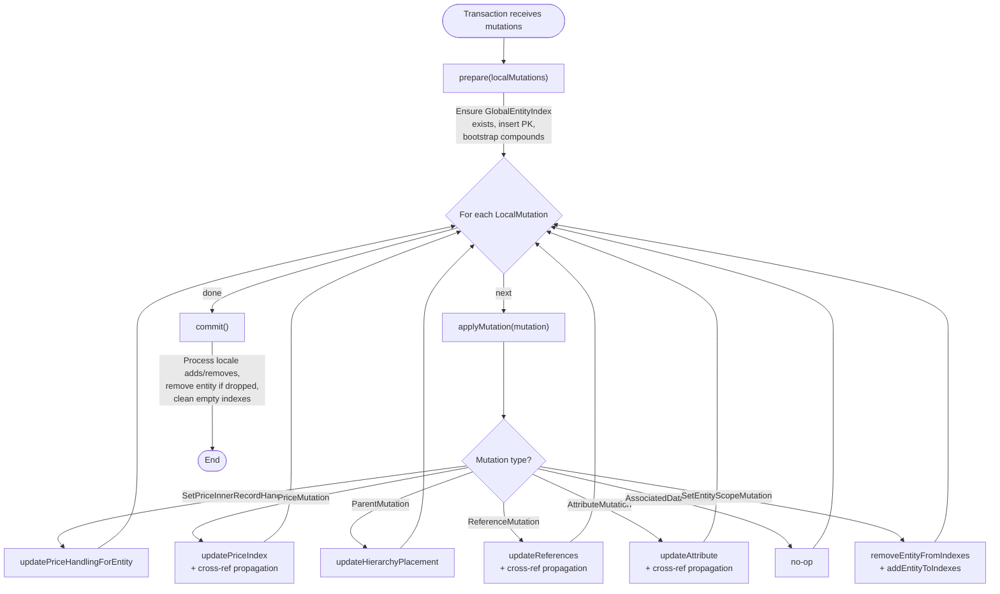
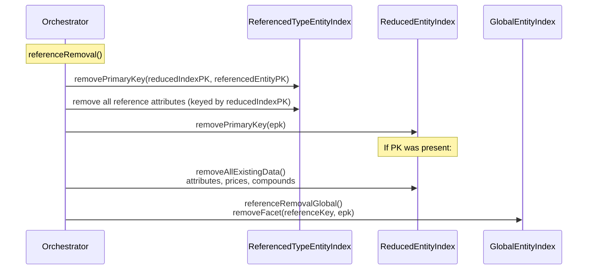
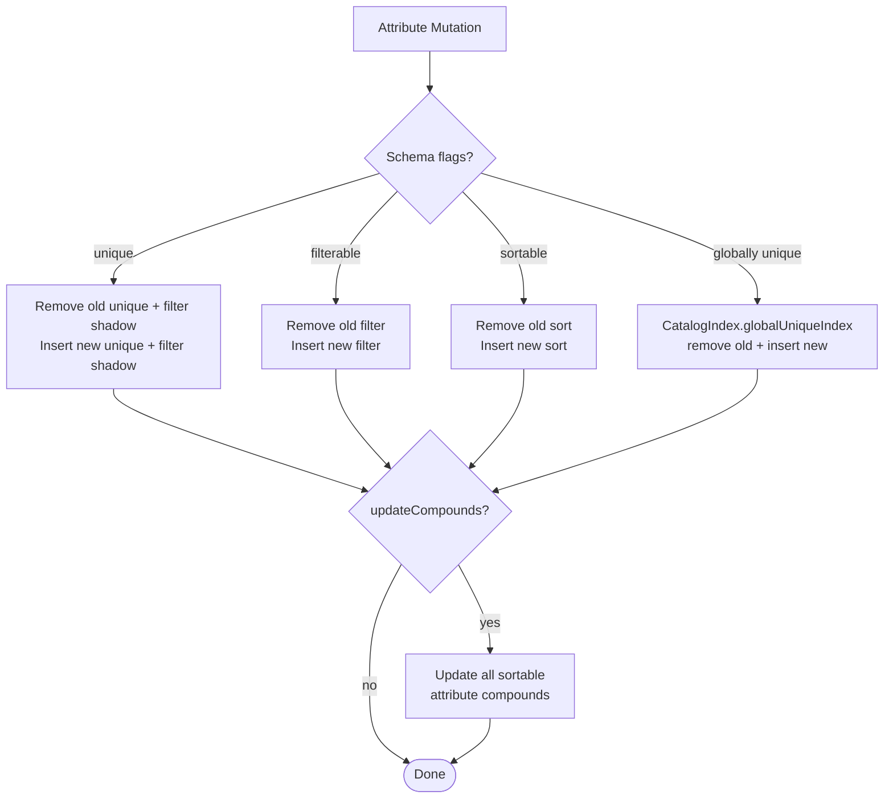
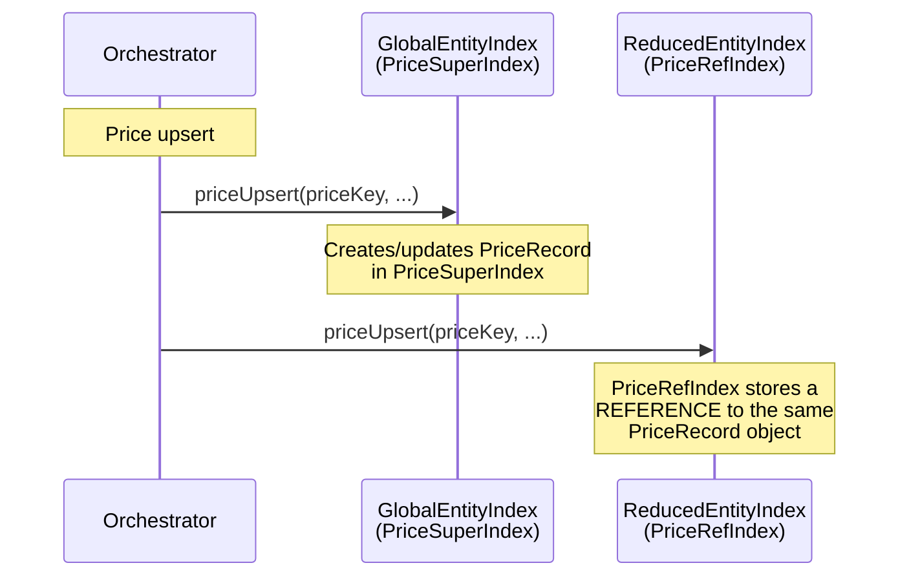
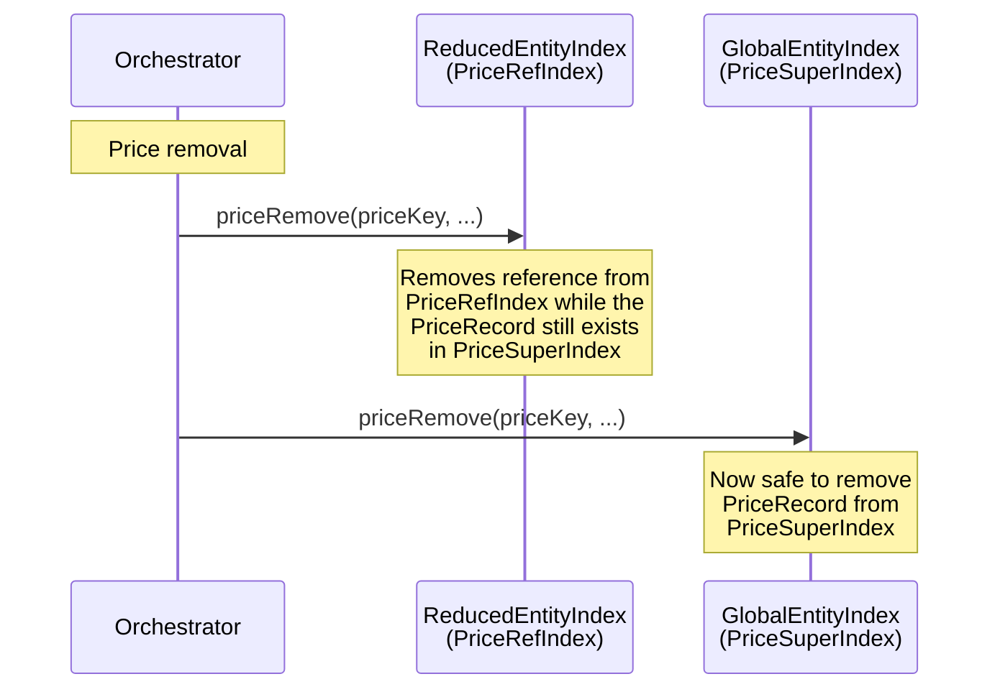
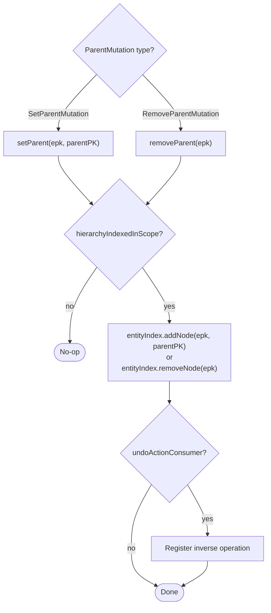

# Mutation Orchestration & Per-Domain Details

> **Scope.** This document describes how evitaDB translates incoming entity mutations into index
> modifications. It covers the orchestrator class, per-domain mutators (references, attributes,
> prices, hierarchy), ordering guarantees, undo/rollback mechanics, and cross-reference
> propagation. For the index types themselves see [index-hierarchy.md](index-hierarchy.md); for
> the data structures stored inside each index see [data-structures.md](data-structures.md); for
> schema flags that control which indexes exist see [schema-settings.md](schema-settings.md).
>
> **Source package.**
> `io.evitadb.index.mutation.index` (module `evita_engine`).

---

## Table of Contents

1. [Orchestration](#orchestration)
2. [Reference Mutations](#reference-mutations)
3. [Attribute Mutations](#attribute-mutations)
4. [Price Mutations](#price-mutations)
5. [Hierarchy Mutations](#hierarchy-mutations)

---

## Orchestration

**Primary class:**
`EntityIndexLocalMutationExecutor` implements `LocalMutationExecutor`.

The executor is the single entry point for translating a batch of `LocalMutation` objects (the
output of the data-mutation layer) into concrete index modifications across every relevant
`EntityIndex`.

### Lifecycle: prepare / applyMutation / commit



#### `prepare()`

Called once before the mutation batch. It:

1. Obtains (or creates) the
   <Term location="/documentation/developer/indexes/overview.md" name="Global Entity Index">`GlobalEntityIndex`</Term>
   for the entity's current <Term location="/documentation/developer/indexes/overview.md" name="scope">scope</Term>.
2. Inserts the entity's primary key into the global index (idempotent; skipped if already
   present).
3. Bootstraps the initial suite of **sortable attribute compounds** for non-localized attributes.
   Compounds are created even when the attribute values are all `null`; they are placeholders that
   will be filled in as attribute mutations arrive.
4. If the entity schema declares `isWithHierarchy()`, calls `setParent` with a `null` parent
   (placing the entity as an orphan root) so the hierarchy index is aware of the entity from the
   start.
5. Registers undo actions for every change if the executor was created with `undoOnError = true`.

#### `applyMutation()`

The central dispatcher. Each `LocalMutation` is pattern-matched to its handler:

| Mutation type                       | Handler method                    | Cross-ref propagation? |
|-------------------------------------|-----------------------------------|:----------------------:|
| `SetPriceInnerRecordHandlingMut.`   | `updatePriceHandlingForEntity`    |          Yes           |
| `UpsertPriceMutation` (indexed)     | `updatePriceIndex` on global      |      Yes (upsert)      |
| `RemovePriceMutation` / non-indexed | `updatePriceIndex` on reduced 1st |     Yes (removal)      |
| `SetParentMutation`                 | `setParent`                       |           No           |
| `RemoveParentMutation`              | `removeParent`                    |           No           |
| `InsertReferenceMutation`           | `referenceInsert` + facets        |          Yes           |
| `RemoveReferenceMutation`           | `referenceRemoval` + facets       |          Yes           |
| `SetReferenceGroupMutation`         | facet group swap + group indexes  |          Yes           |
| `RemoveReferenceGroupMutation`      | facet group clear + group indexes |          Yes           |
| `ReferenceAttributeMutation`        | `attributeUpdate` on ref indexes  |          Yes           |
| `UpsertAttributeMutation`           | `executeAttributeUpsert`          |          Yes           |
| `RemoveAttributeMutation`           | `executeAttributeRemoval`         |          Yes           |
| `ApplyDeltaAttributeMutation`       | `executeAttributeDelta`           |          Yes           |
| `AssociatedDataMutation`            | *(no-op)*                         |           No           |
| `SetEntityScopeMutation`            | full remove + full add            |          N/A           |

<Term location="/documentation/developer/indexes/overview.md" name="cross-reference propagation">**Cross-reference
propagation**</Term>
means the mutation is also applied to every other
<Term location="/documentation/developer/indexes/overview.md" name="Reduced Entity Index">`ReducedEntityIndex`</Term>
that the entity participates in. For example, when an
<Term location="/documentation/developer/indexes/overview.md" name="entity attribute">**entity-level**</Term>
attribute changes, the new value must appear in the reduced indexes of *every* reference the
entity holds, not just the global index. This is achieved by calling
`ReferenceIndexMutator.executeWithAllReferenceIndexes` with a `ReferenceIndexConsumer` callback
that applies the same mutation to each reduced index. Only **entity-level** attributes and prices
are propagated this way.
<Term location="/documentation/developer/indexes/overview.md" name="reference attribute">Reference-level
attributes</Term>
are specific to a single reference relation and do not propagate to other references' reduced
indexes.

#### `commit()`

Called once after the mutation batch. It:

1. Processes locale additions and removals that were accumulated during the batch (via
   `containerAccessor.getAddedLocales()` / `getRemovedLocales()`).
2. Removes the entity from the global index if `containerAccessor.isEntityRemovedEntirely()`
   returns `true`.
3. Iterates all `accessedIndexes` and removes any that have become empty (except the LIVE-scope
   global index, which is never removed).

### Undo / Rollback

When the executor is created with `undoOnError = true`, every index modification registers its
inverse as a `Runnable` in a `LinkedList<Runnable> undoActions`. The `rollback()` method executes
these actions **in reverse order** (LIFO):

```java
for(int i = this.undoActions.size() - 1;
i >=0;i--){
	this.undoActions.

get(i).

run();
}
```

This is a *best-effort* rollback within the scope of a single entity mutation batch. It does not
replace the catalog-level [STM transaction
mechanism](../../user/en/deep-dive/transactions.md) but provides a fast undo path when a later
mutation in the same batch fails validation.

### Key Fields

| Field                           | Purpose                                                    |
|---------------------------------|------------------------------------------------------------|
| `entityIndexCreatingAccessor`   | Creates / retrieves `EntityIndex` instances                |
| `catalogIndexCreatingAccessor`  | Creates / retrieves `CatalogIndex` instances               |
| `entityPrimaryKey` (LinkedList) | Stack of PK resolvers; top element is active               |
| `accessedIndexes`               | All `EntityIndexKey`s touched during mutation; used for    |
|                                 | empty-index cleanup in `commit()`                          |
| `undoActions`                   | LIFO list of inverse operations; `null` when undo disabled |
| `memoizedRepresentativeAttrs`   | Cache of `RepresentativeReferenceKeys` per reference       |
| `createdReferences`             | References newly inserted in this batch                    |
| `localMutations`                | Full batch; peeked during RepresentativeReferenceKey calc  |

### Primary Key Overloading

The `executeWithDifferentPrimaryKeyToIndex` method temporarily pushes a different PK resolver
onto the `entityPrimaryKey` stack. This is used when indexing reference attributes into a
`ReferencedTypeEntityIndex`, where the "primary key to index" is the reduced index's own PK
rather than the entity's PK. The stack is always popped in a `finally` block.

### Test Blueprint Hints -- Orchestration

- **Invariant:** After `commit()`, no accessed index should be empty unless it is the LIVE-scope
  global index.
- **Invariant:** After `rollback()`, every index that was modified should be restored to its
  pre-batch state. Verify by snapshotting bitmap contents before and after.
- **Invariant:** The `entityPrimaryKey` stack must be exactly size 1 after `applyMutation()`
  returns (the pushed overrides are always popped).
- **Invariant:** For a new entity (`prepare()` with no prior PK), the global index must contain
  the entity PK and the sortable compound placeholders must exist for all non-localized compounds
  defined in the schema.

---

## Reference Mutations

**Primary class:** `ReferenceIndexMutator` (static-method interface).

### Index Taxonomy Recap

References are maintained across six `EntityIndexType` variants (see
[index-hierarchy.md](index-hierarchy.md#entityindexkey) for details):

| Index Type                     | Discriminator                | Java Class                  |
|--------------------------------|------------------------------|-----------------------------|
| `REFERENCED_ENTITY_TYPE`       | `String` (reference name)    | `ReferencedTypeEntityIndex` |
| `REFERENCED_ENTITY`            | `RepresentativeReferenceKey` | `ReducedEntityIndex`        |
| `REFERENCED_GROUP_ENTITY_TYPE` | `String` (reference name)    | `ReferencedTypeEntityIndex` |
| `REFERENCED_GROUP_ENTITY`      | `RepresentativeReferenceKey` | `ReducedGroupEntityIndex`   |

Group indexes (`REFERENCED_GROUP_*`) are only maintained when the reference schema has
`ReferenceIndexedComponents.REFERENCED_GROUP_ENTITY` enabled for the active scope
(see [schema-settings.md](schema-settings.md#reference-indexed-components)).

### `ReferenceIndexConsumer` Callback Pattern

All <Term location="/documentation/developer/indexes/overview.md" name="cross-reference propagation">cross-reference
propagation</Term>
is driven by the `ReferenceIndexConsumer` functional interface:

```java
void accept(
	ReferenceSchemaContract referenceSchema,
	ReducedEntityIndex indexForRemoval,
	ReducedEntityIndex indexForUpsert
);
```

The `executeWithReferenceIndexes` family of helpers iterates all stored references on the entity,
filters by index type level and
<Term location="/documentation/developer/indexes/overview.md" name="scope">scope</Term>,
resolves the
<Term location="/documentation/developer/indexes/overview.md" name="Representative Reference Key">
`RepresentativeReferenceKey`</Term>,
obtains (or creates) the
<Term location="/documentation/developer/indexes/overview.md" name="Reduced Entity Index">`ReducedEntityIndex`</Term>,
and invokes the callback. Three variants exist:

- `executeWithReferenceIndexes` -- entity-level reduced indexes only
- `executeWithGroupReferenceIndexes` -- group-level reduced indexes only
- `executeWithAllReferenceIndexes` -- both entity and group indexes

### Two-Phase Insert

Reference insertion is split into a **global** phase and a **per-component** phase:

```mermaid
sequenceDiagram
    participant O as Orchestrator
    participant G as GlobalEntityIndex
    participant TI as ReferencedTypeEntityIndex
    participant RI as ReducedEntityIndex
    Note over O: referenceInsert()
    O ->> G: referenceInsertGlobal()<br/>addFacet(referenceKey, groupId, epk)
    O ->> TI: insertPrimaryKeyIfMissing(reducedIndexPK, referencedEntityPK)
    O ->> TI: upsert all reference attributes (keyed by reducedIndexPK)
    O ->> RI: insertPrimaryKeyIfMissing(epk)
    Note over RI: If PK was new:
    O ->> RI: indexAllExistingData()<br/>locales, ref attributes (always);<br/>entity attributes, prices, facets,<br/>compounds (only FOR_FILTERING_AND_PARTITIONING)
    O ->> RI: addFacet(referenceKey, groupId, epk)
```

1. **`referenceInsertGlobal`** adds the facet to the
   <Term location="/documentation/developer/indexes/overview.md" name="Global Entity Index">`GlobalEntityIndex`</Term>.
   This is called exactly once per reference insertion regardless of how many indexed components
   are configured.
2. **`referenceInsertPerComponent`** handles the type index and reduced index. Called once per
   indexed component (entity component, and optionally group component). It:
    - Registers the reduced-index PK to
      <Term location="/documentation/developer/indexes/overview.md" name="referenced entity">referenced-entity</Term>
      PK mapping in the type index.
    - Indexes all
      <Term location="/documentation/developer/indexes/overview.md" name="reference attribute">reference
      attributes</Term>
      into the type index (keyed by the reduced-index PK).
    - Inserts the entity PK into the reduced index. If this is the first time the entity
      appears in that reduced index, it triggers `indexAllExistingData` which copies
      *all* <Term location="/documentation/developer/indexes/overview.md" name="entity attribute">entity
      attributes</Term>,
      prices, facets, locales, and sortable compounds into the reduced index.
    - Adds the facet to the reduced index.

### Mirror Removal

Removal follows the **reverse order**: per-component first, then global.



The removal of per-component data happens before the global facet removal so that the reduced
index can still consult the global index during its cleanup phase (this matters specifically
for price indexes; see [Price Mutations](#price-mutations)).

### Cross-Reference Propagation

When reference A changes on an entity, all *other* references'
<Term location="/documentation/developer/indexes/overview.md" name="Reduced Entity Index">`ReducedEntityIndex`</Term>
entries also need updating. For example, when an `InsertReferenceMutation` for reference A
arrives:

1. The primary `updateReferences()` method handles A's own indexes (global + A's type/reduced).
2. The orchestrator then calls `executeWithAllReferenceIndexes` with a predicate that **excludes**
   reference A (to avoid double-indexing) and invokes `updateReferencesInReferenceIndex` for
   every other reference B, C, D... This adds A's facet data into B's, C's, D's reduced indexes.

The predicate is:

```java
referenceContract ->!referenceKey.

equalsInGeneral(referenceContract.getReferenceKey())
```

For `ReferenceAttributeMutation`,
<Term location="/documentation/developer/indexes/overview.md" name="cross-reference propagation">cross-reference
propagation</Term>
is a no-op because
<Term location="/documentation/developer/indexes/overview.md" name="reference attribute">reference
attributes</Term> are *not* indexed in other references' reduced indexes -- they live only in the
reference's own type and reduced indexes.

### `RepresentativeReferenceKey`

When a reference's cardinality allows duplicates (e.g. `ZERO_OR_MORE`, `ONE_OR_MORE`), the
<Term location="/documentation/developer/indexes/overview.md" name="Reduced Entity Index">`ReducedEntityIndex`</Term>
discriminator includes **representative attribute values** in addition to the reference name and
primary key. This allows evitaDB to maintain separate
<Term location="/documentation/developer/indexes/overview.md" name="partitioned view">reduced indexes</Term>
for each distinct reference to the same target entity.

The
<Term location="/documentation/developer/indexes/overview.md" name="Representative Reference Key">
`RepresentativeReferenceKey`</Term>
is computed by `getRepresentativeReferenceKeys()` in the
orchestrator. This method:

1. Reads the `RepresentativeAttributeDefinition` from the reference schema.
2. Extracts current attribute values from the stored reference.
3. Peeks into the pending `localMutations` list to incorporate any attribute changes that
   will be applied later in the batch (prevents redundant reindexing).
4. Returns a `RepresentativeReferenceKeys` record containing both the **stored** key and the
   **current** (post-mutation) key.

When the stored and current keys differ, the orchestrator migrates the entity from the old
reduced index to the new one by calling `referenceRemoval` followed by `referenceInsert`.

### Facet Management

Two guard methods control whether a facet is written to a given index:

- `shouldIndexFacetToTargetIndex` -- for
  <Term location="/documentation/developer/indexes/overview.md" name="Reduced Entity Index">`ReducedEntityIndex`</Term>,
  checks that the
  <Term location="/documentation/developer/indexes/overview.md" name="owning entity">owning</Term>
  reference schema is configured for `FOR_FILTERING_AND_PARTITIONING`. For
  <Term location="/documentation/developer/indexes/overview.md" name="Global Entity Index">`GlobalEntityIndex`</Term>,
  always returns `true`.
- `isFaceted` -- checks `referenceSchema.isFacetedInScope(scope)`.

The `addFacetToIndex` and `removeFacetInIndex` methods only act when both guards pass.

### Group Index Lifecycle

When `ReferenceIndexedComponents.REFERENCED_GROUP_ENTITY` is enabled:

- **Insert:** After entity-component indexing, `referenceInsertPerComponent` is called again with
  the group PK and the group type/reduced indexes.
- **Removal:** `removeFromGroupIndexes` reads the existing reference's group PK and calls
  `referenceRemovalPerComponent` with the group-specific indexes.
- **Group change** (`SetReferenceGroupMutation`): Removes from old group indexes, inserts into
  new group indexes. Both the facet group assignment and the full entity data migration happen.

### Test Blueprint Hints -- References

- **Invariant (`FOR_FILTERING`):** After inserting reference R(name="brand", pk=42) on entity E,
  the `ReducedEntityIndex` for brand#42 must contain E's PK, locales, and reference attributes.
  Entity-level attributes, prices, and facets must **not** be present.
- **Invariant (`FOR_FILTERING_AND_PARTITIONING`):** After inserting reference R(name="brand",
  pk=42) on entity E, the `ReducedEntityIndex` for brand#42 must contain E's PK **and** all of
  E's indexed entity-level attributes, prices, locales, reference attributes, and facets.
- **Invariant:** After removing the last reference to brand#42 from entity E, the
  `ReducedEntityIndex` for brand#42 must no longer contain E's PK. If no other entity
  references brand#42, the index should be empty and eligible for cleanup in `commit()`.
- **Invariant:** Cross-reference propagation -- when entity E has references to brand#42 and
  category#7, and a new reference to tag#3 is inserted, then the `ReducedEntityIndex` for
  brand#42 must contain a facet entry for tag#3 (and vice versa for category#7).
- **Invariant:** When cardinality allows duplicates and representative attributes change, the
  entity must be migrated from the old `ReducedEntityIndex` to a new one with the updated
  discriminator.

---

## Attribute Mutations

**Primary class:** `AttributeIndexMutator` (static-method interface).

### Core Methods

| Method                    | Trigger Mutation              | Description                       |
|---------------------------|-------------------------------|-----------------------------------|
| `executeAttributeUpsert`  | `UpsertAttributeMutation`     | Insert or replace attribute value |
| `executeAttributeRemoval` | `RemoveAttributeMutation`     | Remove attribute value            |
| `executeAttributeDelta`   | `ApplyDeltaAttributeMutation` | Atomically apply numeric delta    |

### Schema Flags to Sub-Index Routing

Each attribute schema declares its indexing characteristics per-scope. The mutator checks these
flags and routes the value to the appropriate sub-index:

| Schema Flag           | Sub-Index Written                    | PK Used                  |
|-----------------------|--------------------------------------|--------------------------|
| `isUniqueInScope`     | Unique index + Filter index (shadow) | `ATTRIBUTE_UNIQUE_INDEX` |
| `isFilterableInScope` | Filter index                         | `ATTRIBUTE_FILTER_INDEX` |
| `isSortableInScope`   | Sort index                           | `ATTRIBUTE_SORT_INDEX`   |

When an attribute is *both* unique and filterable, the unique-index path does **not** write the
filter-index shadow entry (the filterable path handles it instead). The distinction matters
because the filter index uses a different PK resolver than the unique index in some contexts
(e.g.
<Term location="/documentation/developer/indexes/overview.md" name="Referenced Type Entity Index">
`ReferencedTypeEntityIndex`</Term>).



### Global Unique Attributes

When `updateGlobalIndex` is `true` and the attribute is a `GlobalAttributeSchema` with
`isUniqueGloballyInScope(scope)`, the catalog-level global unique index is also maintained.
This index is accessed via `executor.getCatalogIndex(scope)` and enforces cross-entity-type
uniqueness (see [schema-settings.md](schema-settings.md#catalogindex)).

### Locale-Aware Indexing

Localized attributes carry a `Locale` in their `AttributeKey`. The `allowedLocales` set from the
entity schema is passed to every index operation so the index can validate that the locale is
permitted. The locale is propagated through to sub-indexes for locale-partitioned storage.

### Sortable Attribute Compounds

A sortable attribute compound is a composite sort key built from multiple attribute values. When
any constituent attribute changes, the compound must be rebuilt. The
`updateSortableAttributeCompounds` method:

1. Queries the `AttributeAndCompoundSchemaProvider` for all compound schemas that reference the
   changed attribute.
2. For each compound, builds the old composite key from existing values and removes it.
3. Builds the new composite key incorporating the changed value and inserts it.

Two `AttributeAndCompoundSchemaProvider` implementations exist:

- `EntitySchemaAttributeAndCompoundSchemaProvider` -- wraps the entity schema for
  <Term location="/documentation/developer/indexes/overview.md" name="entity attribute">entity-level
  attributes</Term>.
- `ReferenceSchemaAttributeAndCompoundSchemaProvider` -- wraps the reference schema + entity
  schema for
  <Term location="/documentation/developer/indexes/overview.md" name="reference attribute">reference-level
  attributes</Term>.

### Decimal Scaling for BigDecimal

`BigDecimal` attribute values are converted to the schema-declared target type using
`EvitaDataTypes.toTargetType()`, which applies `indexedDecimalPlaces` scaling. This ensures
consistent integer representation in range-tree based indexes.

### Behavior in ReferencedTypeEntityIndex

When attributes are indexed into a
<Term location="/documentation/developer/indexes/overview.md" name="Referenced Type Entity Index">
`ReferencedTypeEntityIndex`</Term>
(the per-reference-type aggregate index), the behavior differs from the global index:

- **No sort index** is maintained (sort indexes exist only in
  <Term location="/documentation/developer/indexes/overview.md" name="Reduced Entity Index">`ReducedEntityIndex`</Term>
  and
  <Term location="/documentation/developer/indexes/overview.md" name="Global Entity Index">`GlobalEntityIndex`</Term>).
- **Cardinality-tracked filter** -- the filter index entries are keyed by the reduced-index PK
  (not the entity PK), enabling reference-attribute queries like "find all products whose
  brand reference has attribute X = Y".
- The PK override mechanism (`executeWithDifferentPrimaryKeyToIndex`) ensures the correct PK is
  used when switching between type-index operations and reduced-index operations within a single
  attribute mutation.

### Test Blueprint Hints -- Attributes

- **Invariant:** After upserting attribute `code = "ABC"` on an entity, the unique index must
  map `"ABC"` to the entity PK and the filter index must contain the entity PK for value
  `"ABC"`.
- **Invariant:** After removing a sortable attribute, the sort index must no longer contain the
  entity PK.
- **Invariant:** After changing a constituent of a sortable compound, the compound sort index
  must contain exactly the new composite key for the entity PK and must not contain the old
  composite key.
- **Invariant:** Global unique attributes must be present in the `CatalogIndex`'s unique index
  after upsert and absent after removal.
- **Invariant:** If the same attribute is both unique and filterable, the filter index must
  contain the value regardless of which schema flag caused the write.

---

## Price Mutations

**Primary class:** `PriceIndexMutator` (static-method interface).

### Structure and Scope Guard

Every mutating method begins with:

```java
if(entitySchema.isPriceIndexedInScope(scope)){...}
```

If prices are not indexed in the target scope, the method is a complete no-op.

### Internal Price ID Assignment

Each price stored in an entity receives a unique, monotonically increasing `internalPriceId`
drawn from a catalog-level sequence (`SequenceType.PRICE`). This ID is used within price indexes
to cross-reference prices across entity primary keys and to support efficient price-for-sale
computation.

Two `PriceInternalIdProvider` implementations exist:

1. **Lambda in `updatePriceIndex`** -- looks up an existing internal ID from the container
   accessor. If none exists (or the stored ID is `-1`, a legacy marker for non-indexed prices),
   allocates a new ID from the catalog sequence and registers it.
2. **`createPriceProvider`** -- wraps a known `PriceWithInternalIds` record; used during bulk
   re-indexing when the ID is already available from persistent storage.

### BigDecimal to int Scaling

Price amounts (`priceWithoutTax`, `priceWithTax`) are converted to scaled integers using
`NumberUtils.convertExternalNumberToInt(bigDecimal, indexedPricePlaces)`. The number of decimal
places is read from `EntitySchema.getIndexedPricePlaces()`. This avoids floating-point
comparisons in range-tree filtering and sorting.

### PriceInnerRecordHandling Modes

The entity-wide `PriceInnerRecordHandling` strategy affects how prices are grouped in the index:

| Mode           | Behavior                                                       |
|----------------|----------------------------------------------------------------|
| `NONE`         | Each price is an independent entry; `innerRecordId` is ignored |
| `LOWEST_PRICE` | Prices with the same `innerRecordId` are grouped; the lowest   |
|                | price wins during price-for-sale resolution                    |
| `SUM`          | Prices with the same `innerRecordId` are summed during         |
|                | price-for-sale resolution                                      |

When the handling mode changes (`SetPriceInnerRecordHandlingMutation`), **all** prices on the
entity are removed and re-inserted under the new strategy. The ordering of this bulk operation is
critical:

1. Remove from reduced indexes (entity + group).
2. Remove from global (super) index.
3. Insert into global (super) index under new strategy.
4. Insert into reduced indexes (entity + group).

### Two-Phase Ordering: Why It Matters

**Upsert: super-index first, reduced indexes second.**



The `PriceRefIndex` (inside
<Term location="/documentation/developer/indexes/overview.md" name="Reduced Entity Index">reduced indexes</Term>)
stores <Term location="/documentation/developer/indexes/overview.md" name="price record sharing">**references
to the same `PriceRecord` objects**</Term> that live in the `PriceSuperIndex` (inside the
<Term location="/documentation/developer/indexes/overview.md" name="Global Entity Index">global index</Term>).
Therefore, the super-index must be populated first so that the `PriceRecord` exists when the
reduced index attempts to reference it.

**Removal: reduced indexes first, super-index second.**



The reduced index must be cleaned first because it needs to consult the super-index to locate the
`PriceRecord` being removed. If the super-index entry were removed first, the reduced index would
fail to find the record.

### Price Upsert as Remove-then-Insert

Price upserts are implemented as atomic remove + insert rather than in-place updates. Price
indexes are sorted data structures (range trees, bitmaps) that cannot be patched in-place:

1. If `formerPrice` exists and is indexed, remove the old entry using the former price's scaled
   integer values and internal price ID.
2. If `indexed` is `true`, insert the new entry with freshly scaled values and a
   resolved/allocated internal price ID.

When `indexed` is `false` and `formerPrice` was indexed, this effectively removes the price from
the index without inserting a replacement.

### Test Blueprint Hints -- Prices

- **Invariant:** After upserting an indexed price, the `PriceSuperIndex` in the global index must
  contain a `PriceRecord` with the correct internal ID, scaled price values, and validity range.
- **Invariant:** The `PriceRefIndex` in every reduced index of a `FOR_FILTERING_AND_PARTITIONING`
  reference must hold a reference to the **same** `PriceRecord` object as the super-index (object
  identity, not just equality).
- **Invariant:** After removing a price, neither the super-index nor any ref-index may contain an
  entry for that price's internal ID.
- **Invariant:** When `PriceInnerRecordHandling` changes from `NONE` to `LOWEST_PRICE`, every
  price must be re-indexed. The total number of `PriceRecord` entries must remain the same, but
  their inner-record grouping must reflect the new strategy.
- **Invariant:** A non-indexed price (`indexed = false`) must not appear in any price index, even
  if it exists in entity storage.

---

## Hierarchy Mutations

**Primary class:** `HierarchyPlacementMutator` (static-method interface).

### Methods

| Method         | Trigger Mutation       | Description                                     |
|----------------|------------------------|-------------------------------------------------|
| `setParent`    | `SetParentMutation`    | Places entity in hierarchy (or at root if null) |
| `removeParent` | `RemoveParentMutation` | Removes entity from hierarchy tree              |

### Scope Guard

Both methods check `entitySchema.isHierarchyIndexedInScope(scope)` before touching the
hierarchy index. If hierarchy is not indexed in the target
<Term location="/documentation/developer/indexes/overview.md" name="scope">scope</Term>,
the method is a no-op. This allows entities to carry parent information in storage without making
it queryable in that scope (e.g. archived entities).



### Global Index Only

Hierarchy placement is maintained **only** in the
<Term location="/documentation/developer/indexes/overview.md" name="Global Entity Index">`GlobalEntityIndex`</Term>.
There is no per-reference hierarchy index. This is a deliberate design choice: the hierarchy
represents the entity type's own tree structure, not a per-reference partitioned tree. Hierarchy
queries like `hierarchyWithin` operate on the global hierarchy index and then intersect with
reference constraints.

### Orphan Mechanism

The `HierarchyIndex` supports out-of-order insertion. When a child entity is indexed before its
parent exists, the child is held in an **orphan set**. When the parent entity is eventually
indexed (via its own `setParent` call), orphans that reference it are automatically adopted and
placed in the correct position in the tree. This eliminates ordering dependencies during bulk
data loads.

When `parentPrimaryKey` is `null`, the entity is placed at the **root** of the hierarchy tree.
The `prepare()` method calls `setParent(epk, null)` for hierarchical entities to ensure every
new entity starts as a root or orphan before any explicit `SetParentMutation` arrives.

### Undo for removeParent

When undo is enabled, `removeParent` captures the parent PK returned by
`entityIndex.removeNode(primaryKeyToIndex)` and registers an undo action that calls
`entityIndex.addNode(primaryKeyToIndex, capturedParentPK)`. This restores the exact parent
relationship that existed before removal.

### Test Blueprint Hints -- Hierarchy

- **Invariant:** After `setParent(child=5, parent=3)`, `hierarchyIndex.getParentNode(5)` must
  return 3.
- **Invariant:** After `removeParent(child=5)`, `hierarchyIndex.getParentNode(5)` must return
  `null` or indicate the node does not exist.
- **Invariant:** If `setParent(child=5, parent=99)` is called but entity 99 has not been indexed
  yet, entity 5 must appear in the orphan set. After entity 99 is indexed, entity 5 must be
  automatically adopted.
- **Invariant:** Hierarchy mutations must be no-ops when the entity's scope does not have
  hierarchy indexing enabled, even if the entity schema declares `isWithHierarchy() = true`.
- **Invariant:** After rollback, the hierarchy index must reflect the exact parent relationships
  that existed before the mutation batch.

---

*See also:*
[Overview](overview.md#overview) |
[Index Hierarchy](index-hierarchy.md#global) |
[Data Structures](data-structures.md#price-indexes) |
[Schema Settings](schema-settings.md#reference-index-type) |
[Query Mapping](query-mapping.md#constraint-index-table)
