# evitaDB Data Indexing Architecture

<UsedTerms>
    <h4>Used terms</h4>
    <dl>
        <dt>Global Entity Index</dt>
        <dd>
            The primary, authoritative index for an entity type within a given scope. Exactly one
            instance exists per entity type per scope. Contains all owning entity primary keys, all
            entity-level attribute indexes (filter, sort, unique, chain), the full PriceSuperIndex,
            the HierarchyIndex, and the FacetIndex. When the query engine cannot narrow the search
            to a more specific index, it falls back to the Global Entity Index -- analogous to a full
            table scan in a relational database, though still operating on pre-built bitmap structures.
        </dd>
        <dt>Reduced Entity Index</dt>
        <dd>
            A partitioned view of the Global Entity Index, scoped to a single referenced entity.
            Contains only the owning entity PKs that hold a reference to a specific target. Stores
            reference attributes always, and entity attributes plus prices only when the reference
            is configured for `FOR_FILTERING_AND_PARTITIONING`. Its PriceRefIndex reuses price
            record objects from the global PriceSuperIndex without duplicating them. This is the
            workhorse index for reference-based queries -- selecting a reduced index keyed to a
            particular target instantly narrows the search space to a pre-filtered bitmap. Two
            concrete implementations exist: `ReducedEntityIndex` (for `REFERENCED_ENTITY`) and
            `ReducedGroupEntityIndex` (for `REFERENCED_GROUP_ENTITY`), which adds cardinality
            tracking for primary keys and filter attributes. Both extend `AbstractReducedEntityIndex`.
        </dd>
        <dt>Referenced Type Entity Index</dt>
        <dd>
            A lightweight aggregation index that exists once per reference name. Its `entityIds`
            bitmap stores the storage primary keys of the `ReducedEntityIndex` instances (one per
            unique referenced target) rather than owning entity PKs. Maintains only reference
            attribute filter indexes (no sort) with cardinality tracking to handle correct
            deduplication when multiple owning entities contribute the same attribute value.
            Uses VoidPriceIndex (a no-op singleton).
        </dd>
        <dt>Entity Index Key</dt>
        <dd>
            The composite key `(EntityIndexType, Scope, discriminator)` that uniquely addresses an
            EntityIndex within an entity collection. The discriminator is `null` for GLOBAL, a
            `String` (reference name) for `*_TYPE` indexes, and a Representative Reference Key for
            per-entity and per-group indexes. Constructor validation enforces strict type-safety
            between the EntityIndexType and discriminator type.
        </dd>
        <dt>Representative Reference Key</dt>
        <dd>
            The discriminator used by per-entity and per-group Reduced Entity Indexes. It combines
            a `ReferenceKey` (reference name + target primary key) with an ordered array of
            representative attribute values. This mechanism exists because a single entity may hold
            multiple references of the same type to the same target entity (when the reference
            schema's `Cardinality` allows `ZERO_OR_MORE` or `ONE_OR_MORE`). In such cases, the
            representative attributes -- declared via the schema's `representative` flag on specific
            reference attributes -- serve as tie-breakers that distinguish otherwise-identical
            reference relationships. Each distinct combination of representative attribute values
            produces its own Reduced Entity Index instance with its own attribute and price data.
            Without this mechanism, duplicate references (same source entity, same target entity,
            same reference name) would collapse into a single index and lose their individual
            attribute data.
        </dd>
        <dt>entity attribute</dt>
        <dd>
            An attribute defined on the entity schema itself (e.g., `name` or `code` on a Product
            entity). Stored in the Global Entity Index always. Replicated to Reduced Entity Indexes
            only when the reference is configured for `FOR_FILTERING_AND_PARTITIONING`. Never stored
            in Referenced Type Entity Indexes.
        </dd>
        <dt>reference attribute</dt>
        <dd>
            An attribute defined on a reference schema (e.g., `priority` or `orderInCategory` on a
            product-to-category reference). Stored in both Reduced Entity Indexes and Referenced
            Type Entity Indexes regardless of the `ReferenceIndexType` level (as long as it is not
            `NONE`). Never stored in the Global Entity Index. Reference attributes are specific to a
            single reference relation and do not propagate across references.
        </dd>
        <dt>owning entity</dt>
        <dd>
            The entity that holds a reference to another entity. In a product→brand relationship,
            the product is the owning entity. The `entityIds` bitmaps in the Global Entity Index and
            Reduced Entity Index contain owning entity PKs. Every owning entity PK present in any
            Reduced Entity Index must also be present in the Global Entity Index for the same scope
            (the superset invariant).
        </dd>
        <dt>referenced entity</dt>
        <dd>
            The target entity being pointed to by a reference. In a product→brand relationship, the
            brand is the referenced entity. The `entityIds` bitmap in the Referenced Type Entity
            Index contains `ReducedEntityIndex` storage PKs (one per unique referenced target, not
            owning entity PKs), serving as internal identifiers for per-target partitioned indexes.
        </dd>
        <dt>cross-reference propagation</dt>
        <dd>
            The mechanism by which entity-level mutations (attribute changes, price changes, locale
            changes) are propagated to ALL Reduced Entity Indexes the entity participates in, not
            just the one for the reference being modified. For example, when a product's `name`
            attribute changes, the new value must appear in the reduced indexes for every reference
            the product holds (brand, category, etc.). Only entity-level data propagates --
            reference-level attributes are specific to each reference relation and do not propagate.
        </dd>
        <dt>price record sharing</dt>
        <dd>
            The design principle where PriceRefIndex (in a Reduced Entity Index) stores references
            to the same `PriceRecord` objects owned by PriceSuperIndex (in the Global Entity Index),
            avoiding duplicate memory allocations. Multiple Reduced Entity Indexes can reference the
            same PriceRecord instance. This means `assertSame(globalPrice, reducedPrice)` should
            pass -- the objects are identical, not just equal.
        </dd>
        <dt>partitioned view</dt>
        <dd>
            The conceptual role of the Reduced Entity Index -- a pre-filtered subset of the Global
            Entity Index, scoped to entities that reference a specific target. Enables
            O(bitmap-intersection) lookups instead of scanning the full global index. The query
            engine selects a partitioned view when a query contains reference-based filter
            constraints (e.g., "products in category 42").
        </dd>
        <dt>scope</dt>
        <dd>
            The `LIVE` or `ARCHIVED` partition of the index space. Every Entity Index Key carries a
            scope. LIVE and ARCHIVED indexes are completely independent -- mutating an entity in one
            scope never affects the other. The LIVE Global Entity Index is never removed, even when
            empty. An entity transitions between scopes via `SetEntityScopeMutation`, which removes
            it from all indexes in the old scope and adds it to all indexes in the new scope.
        </dd>
    </dl>
</UsedTerms>

## Overview

evitaDB is an in-memory database optimized for e-commerce workloads. Every query against an entity
collection -- filtering, sorting, facet counting, hierarchy traversal, price resolution -- is
answered from **pre-built, memory-resident index structures** rather than by scanning raw entity
data. The goal is sub-millisecond query latency even when the working set contains millions of
entities with complex reference graphs.

Indexes are maintained transactionally. Each mutation that changes an entity's attributes, prices,
references, or hierarchy placement is immediately reflected in the affected indexes within the
<Term>scope</Term> of the current transaction. On commit, the transactional memory layer produces a
new immutable snapshot of each modified index
(see [Transactions](../../user/en/deep-dive/transactions.md) for STM internals).

### Key source files

| File | Module | Purpose |
|------|--------|---------|
| `EntityIndexType` | evita_engine | Enum of all index type discriminators |
| `EntityIndexKey` | evita_engine | Composite key `(type, scope, discriminator)` |
| `EntityIndex` | evita_engine | Abstract base with shared attribute/facet/hierarchy support |
| `GlobalEntityIndex` | evita_engine | Complete per-entity-type index with `PriceSuperIndex` |
| `AbstractReducedEntityIndex` | evita_engine | Shared base for per-entity and per-group <Term>partitioned view</Term> indexes |
| `ReducedEntityIndex` | evita_engine | Per-referenced-entity <Term>partitioned view</Term> with `PriceRefIndex` |
| `ReducedGroupEntityIndex` | evita_engine | Per-group <Term>partitioned view</Term> with PK and attribute cardinality tracking |
| `ReferencedTypeEntityIndex` | evita_engine | Per-reference-name type-level index with cardinality tracking |

## Three-Axis Mental Model

Understanding the indexing system requires thinking along three orthogonal axes:

### Axis 1 -- Index Type (the EntityIndex class hierarchy)

Determines the **granularity** of the index. A
<Term name="Global Entity Index">`GlobalEntityIndex`</Term> contains every entity in the
collection; a <Term name="Reduced Entity Index">`ReducedEntityIndex`</Term> contains only those
entities that reference a specific target entity; a
<Term name="Referenced Type Entity Index">`ReferencedTypeEntityIndex`</Term> aggregates
<Term name="reference attribute">reference-attribute</Term> filter data across all targets of a
given reference name.

See [Index Hierarchy](index-hierarchy.md#global) for the full taxonomy.

### Axis 2 -- Data Structure (what lives inside an index)

Each `EntityIndex` composes several inner data structures:

- **AttributeIndex** -- filter, sort, unique, and chain indexes for
  <Term name="entity attribute">entity</Term> and
  <Term name="reference attribute">reference</Term> attributes
  (see [data-structures.md](data-structures.md#attributeindex))
- **HierarchyIndex** -- parent-child tree for hierarchical entities
  (see [data-structures.md](data-structures.md#hierarchyindex))
- **FacetIndex** -- bitmap-based facet groups for faceted search
  (see [data-structures.md](data-structures.md#facetindex))
- **PriceIndex** -- `PriceSuperIndex` in Global, `PriceRefIndex` in Reduced, `VoidPriceIndex`
  in ReferencedType (see [data-structures.md](data-structures.md#price-indexes))
- **CardinalityIndexes** -- `ReferenceTypeCardinalityIndex` and `AttributeCardinalityIndex`
  in ReferencedType (see [data-structures.md](data-structures.md#cardinality-indexes))

### Axis 3 -- Schema Settings & Scope (what controls index creation)

Not every reference produces indexes. The schema layer controls:

- **`ReferenceIndexType`** (`NONE`, `FOR_FILTERING`, `FOR_FILTERING_AND_PARTITIONING`) -- whether
  reduced/type indexes are created at all, and whether
  <Term name="entity attribute">entity-level attributes</Term> are replicated into reduced indexes
  (see [schema-settings.md](schema-settings.md#reference-index-type))
- **`ReferenceIndexedComponents`** (`REFERENCED_ENTITY`, `REFERENCED_GROUP_ENTITY`) -- whether
  group-level indexes are maintained
  (see [schema-settings.md](schema-settings.md#reference-indexed-components))
- **`Scope`** (`LIVE`, `ARCHIVED`) -- each <Term>scope</Term> has its own independent set of
  indexes (see [schema-settings.md](schema-settings.md#scope-management))

## Index Taxonomy Diagram

The following Mermaid diagram shows the full index class hierarchy and the data structures
each index type holds.

```mermaid
graph TD
    subgraph "EntityIndex Class Hierarchy"
        EI["EntityIndex<br/><i>abstract</i>"]
        GEI["GlobalEntityIndex"]
        AREI["AbstractReducedEntityIndex<br/><i>abstract</i>"]
        REI["ReducedEntityIndex"]
        RGEI["ReducedGroupEntityIndex"]
        RTEI["ReferencedTypeEntityIndex"]
    end

    EI --> GEI
    EI --> AREI
    EI --> RTEI
    AREI --> REI
    AREI --> RGEI

    subgraph "Shared Data Structures (in EntityIndex)"
        AI["AttributeIndex<br/>filter / sort / unique / chain"]
        HI["HierarchyIndex"]
        FI["FacetIndex"]
        EID["entityIds bitmap"]
        LANG["entityIdsByLanguage"]
    end

    EI --- AI
    EI --- HI
    EI --- FI
    EI --- EID
    EI --- LANG

    subgraph "Price Index Variants"
        PSI["PriceSuperIndex<br/><i>owns price records</i>"]
        PRI["PriceRefIndex<br/><i>references price records</i>"]
        VPI["VoidPriceIndex<br/><i>no-op singleton</i>"]
    end

    GEI --> PSI
    AREI --> PRI
    RTEI --> VPI

    subgraph "Cardinality Tracking"
        RTCI["ReferenceTypeCardinalityIndex<br/><i>(ReferencedTypeEntityIndex)</i>"]
        ACI["AttributeCardinalityIndex<br/><i>(ReferencedTypeEntityIndex +<br/>ReducedGroupEntityIndex)</i>"]
        PKCI["pkCardinalities Map<br/><i>(ReducedGroupEntityIndex)</i>"]
    end

    RTEI --> RTCI
    RTEI --> ACI
    RGEI --> ACI
    RGEI --> PKCI

    subgraph "EntityIndexType enum values"
        T1["GLOBAL"]
        T2["REFERENCED_ENTITY_TYPE"]
        T3["REFERENCED_ENTITY"]
        T4["REFERENCED_GROUP_ENTITY_TYPE"]
        T5["REFERENCED_GROUP_ENTITY"]
        T6["REFERENCED_HIERARCHY_NODE<br/><i>deprecated</i>"]
    end

    T1 -. "keys" .-> GEI
    T2 -. "keys" .-> RTEI
    T3 -. "keys" .-> REI
    T4 -. "keys" .-> RTEI
    T5 -. "keys" .-> RGEI
```

## Primary Key Semantics

The `entityIds` bitmap in each index type holds **different kinds of primary keys**:

| Index Type | `entityIds` Contains | Example |
|---|---|---|
| <Term name="Global Entity Index">`GlobalEntityIndex`</Term> | <Term name="owning entity">Owning entity</Term> PKs | All product PKs in the collection |
| <Term name="Reduced Entity Index">`ReducedEntityIndex`</Term> | <Term name="owning entity">Owning entity</Term> PKs | PKs of products that reference brand #42 |
| <Term name="Referenced Type Entity Index">`ReferencedTypeEntityIndex`</Term> | `ReducedEntityIndex` storage PKs (one per unique target, cardinality-guarded) | Storage PKs of all brand-specific reduced indexes |

<Term name="Global Entity Index">`GlobalEntityIndex`</Term> and
<Term name="Reduced Entity Index">`ReducedEntityIndex`</Term> both store the primary keys of the
<Term name="owning entity">owning entity</Term> (the entity being indexed). The difference is
scope: the global index contains all entities in the collection, while a reduced index contains
only the subset that holds a reference to a particular target.

<Term name="Referenced Type Entity Index">`ReferencedTypeEntityIndex`</Term> is the exception --
it stores the storage primary keys of the `ReducedEntityIndex` instances (one per unique
referenced target), not the owning entity PKs. Each `ReducedEntityIndex` is assigned an internal
storage PK (via `indexPkSequence`) that serves as its identifier within the type index. The
cardinality tracking (see [data-structures.md](data-structures.md#cardinality-indexes)) ensures a
storage PK is removed from `entityIds` only when no
<Term name="owning entity">owning entity</Term> references that target anymore.

## Entity Attributes vs Reference Attributes

evitaDB distinguishes two kinds of attributes in the index layer:

- **<Term name="entity attribute">Entity attributes</Term>** -- defined on the entity schema
  (e.g., `name` on the product entity). Always present in `GlobalEntityIndex`. Replicated to
  `ReducedEntityIndex` only when `ReferenceIndexType` is `FOR_FILTERING_AND_PARTITIONING`. Never
  in `ReferencedTypeEntityIndex`.
- **<Term name="reference attribute">Reference attributes</Term>** -- defined on a reference
  schema (e.g., `priority` on a product-to-category reference). Always present in both
  `ReducedEntityIndex` and `ReferencedTypeEntityIndex`. Never in `GlobalEntityIndex`.

See [schema-settings.md](schema-settings.md#reference-index-type) for the full impact matrix.

## Navigation

| Document | Description |
|----------|-------------|
| [Index Hierarchy](index-hierarchy.md) | `EntityIndexType`, <Term name="Entity Index Key">`EntityIndexKey`</Term>, and the three concrete index classes |
| [Data Structures](data-structures.md) | Attribute, price, hierarchy, facet, and cardinality indexes |
| [Schema Settings](schema-settings.md) | How schema configuration controls index creation and lifecycle |
| [Mutation Flow](mutation-flow.md) | How entity mutations propagate into index updates |
| [Query Mapping](query-mapping.md) | Which EvitaQL constraints read from which indexes |

## Test Blueprint Hints

The following invariants should be verified by integration tests covering the index layer:

1. **Superset invariant:** Every <Term name="owning entity">entity primary key</Term> present in
   any <Term name="Reduced Entity Index">`ReducedEntityIndex`</Term> for a given
   <Term>scope</Term> MUST also be present in the
   <Term name="Global Entity Index">`GlobalEntityIndex`</Term> for that same scope. The reverse
   does not hold -- the global index is the superset.

2. **Scope isolation:** An <Term name="Entity Index Key">`EntityIndexKey`</Term> with `Scope.LIVE`
   and one with `Scope.ARCHIVED` are entirely independent instances. Mutating an entity in the
   LIVE <Term>scope</Term> must never alter indexes in the ARCHIVED scope (and vice versa).

3. **Discriminator type safety:** Constructing an `EntityIndexKey` with a `String` discriminator
   for a `REFERENCED_ENTITY` type (or a
   <Term name="Representative Reference Key">`RepresentativeReferenceKey`</Term> for a `*_TYPE`
   index) must throw `GenericEvitaInternalError`. The constructor enforces this with
   `Assert.isPremiseValid`.

4. **Empty index removal:** After all entity primary keys have been removed from a
   `ReducedEntityIndex`, the index's `isEmpty()` method must return `true`. The engine should
   then remove the index from the collection-level map to avoid unbounded index accumulation.

5. **<Term>Price record sharing</Term>:** `PriceRefIndex` (in `ReducedEntityIndex`) must
   reference the same price record objects that are owned by the `PriceSuperIndex` (in
   `GlobalEntityIndex`). There must be no duplicate price record allocations between global and
   reduced indexes.

6. **Cardinality correctness:** In `ReferencedTypeEntityIndex`, removing an owning entity's
   reference must decrement the cardinality counter for the corresponding `ReducedEntityIndex`
   storage PK. The storage PK must only be removed from the `entityIds` bitmap when the
   cardinality reaches zero (i.e., no owning entity references that target anymore), not on the
   first removal.

7. **Transactional consistency:** After a transaction commit, the version number of every modified
   `EntityIndex` must be incremented by exactly one. Unmodified indexes must retain their
   previous version.
