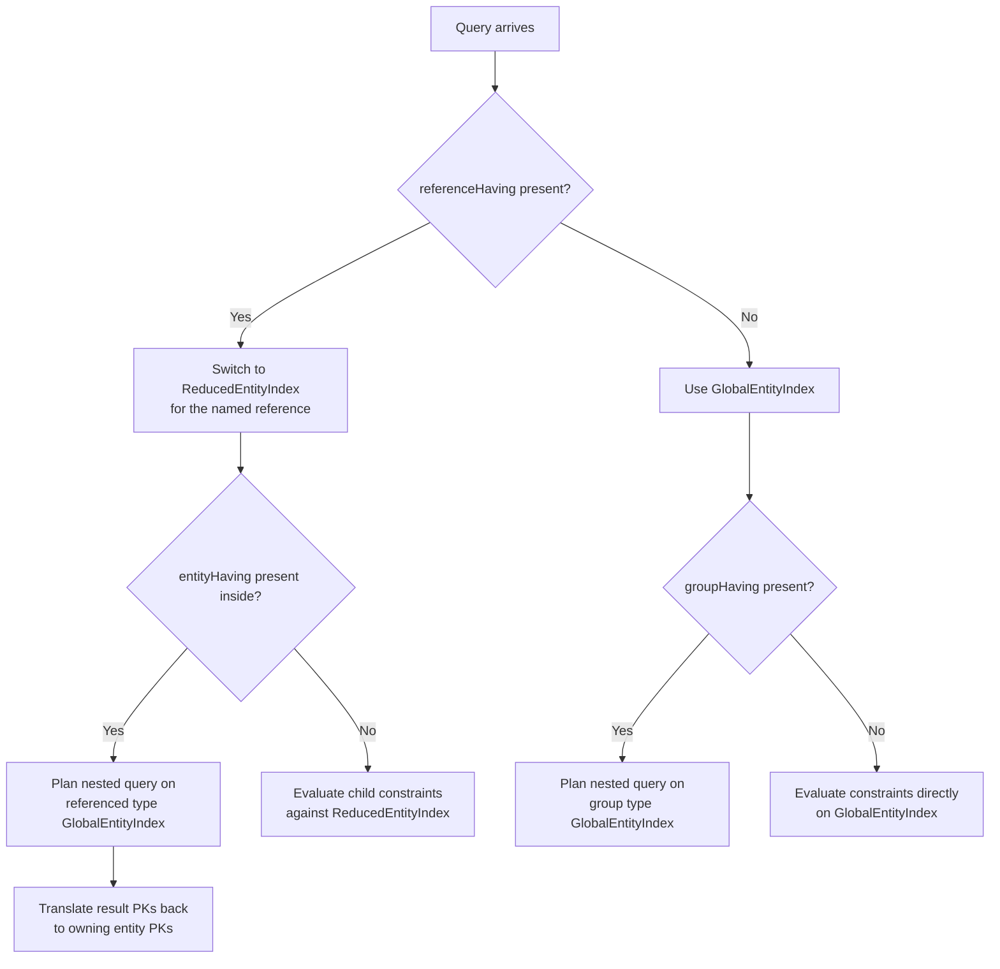

# Index-to-Query Constraint Mapping

This document maps every EvitaQL query constraint to the index types and data structures it accesses at
runtime. Use it as a reference when reasoning about query performance, writing tests that assert correct
index usage, or planning schema changes that affect which indexes are built.

For an overview of the index type hierarchy see [index-hierarchy.md](index-hierarchy.md#global).
For details on individual data structures see [data-structures.md](data-structures.md#attributeindex).

---

## Constraint-Index Table

### Filtering -- Attributes

| EvitaQL Constraint           | Index Type        | Data Structure                                                          | Notes                                                                                                                                                                      |
|------------------------------|-------------------|-------------------------------------------------------------------------|----------------------------------------------------------------------------------------------------------------------------------------------------------------------------|
| `attributeEquals`            | GlobalEntityIndex | UniqueIndex (O(1) hash lookup)                                          | Preferred when attribute is `unique`. Falls back to FilterIndex `getRecordsEqualToFormula` when non-unique. For globally-unique attributes, accesses CatalogIndex instead. |
| `attributeContains`          | GlobalEntityIndex | FilterIndex `getRecordsWhoseValuesContains`                             | String search via inverted index; requires `filterable` trait.                                                                                                             |
| `attributeStartsWith`        | GlobalEntityIndex | FilterIndex `getRecordsWhoseValuesStartWith`                            | Same pattern as `attributeContains`.                                                                                                                                       |
| `attributeEndsWith`          | GlobalEntityIndex | FilterIndex `getRecordsWhoseValuesEndWith`                              | Same pattern as `attributeContains`.                                                                                                                                       |
| `attributeInRange`           | GlobalEntityIndex | FilterIndex `getRecordsValidInFormula`                                  | Used for Range-typed attributes (DateTimeRange, NumberRange). Converts value to comparable long for range-tree lookup.                                                     |
| `attributeBetween`           | GlobalEntityIndex | FilterIndex `getRecordsBetweenFormula` / `getRecordsOverlappingFormula` | For Range attributes uses overlap semantics; for Comparable attributes uses between semantics on the histogram B-tree.                                                     |
| `attributeInSet`             | GlobalEntityIndex | FilterIndex `getRecordsEqualToFormula` (per value, OR-combined)         | Also uses UniqueIndex when attribute is `unique`.                                                                                                                          |
| `attributeIs(NULL)`          | GlobalEntityIndex | FilterIndex `getAllRecordsFormula` or UniqueIndex `getRecordIdsFormula` | Computes NOT(all indexed records) against the entity superset. Uses FutureNotFormula post-processing.                                                                      |
| `attributeIs(NOT_NULL)`      | GlobalEntityIndex | FilterIndex `getAllRecordsFormula` or UniqueIndex `getRecordIdsFormula` | Returns the bitmap of all records that have the attribute set.                                                                                                             |
| `attributeGreaterThan`       | GlobalEntityIndex | FilterIndex `getRecordsGreaterThanFormula`                              | Comparison via histogram B-tree in the FilterIndex.                                                                                                                        |
| `attributeGreaterThanEquals` | GlobalEntityIndex | FilterIndex `getRecordsGreaterThanEqFormula`                            | Same as above with inclusive bound.                                                                                                                                        |
| `attributeLessThan`          | GlobalEntityIndex | FilterIndex `getRecordsLesserThanFormula`                               | Comparison via histogram B-tree.                                                                                                                                           |
| `attributeLessThanEquals`    | GlobalEntityIndex | FilterIndex `getRecordsLesserThanEqFormula`                             | Same as above with inclusive bound.                                                                                                                                        |

All attribute filter translators respect the `ProcessingScope` -- when used inside a `referenceHaving`
container, they operate on
the <Term location="/documentation/developer/indexes/overview.md" name="Reduced Entity Index">[ReducedEntityIndex](index-hierarchy.md#referenced_entity)</Term>
instead
of the <Term location="/documentation/developer/indexes/overview.md" name="Global Entity Index">
GlobalEntityIndex</Term>. When the attribute schema declares the attribute as `unique`, the translator
prefers UniqueIndex hash-map lookup (O(1)) over FilterIndex histogram lookup (O(log n)).

### Filtering -- Hierarchy

| EvitaQL Constraint    | Index Type                                     | Data Structure                                      | Notes                                                                                                                                                                                                                                         |
|-----------------------|------------------------------------------------|-----------------------------------------------------|-----------------------------------------------------------------------------------------------------------------------------------------------------------------------------------------------------------------------------------------------|
| `hierarchyWithin`     | GlobalEntityIndex (of the hierarchical entity) | [HierarchyIndex](data-structures.md#hierarchyindex) | Locates the GlobalEntityIndex of the target hierarchical entity type via `EntityIndexKey(GLOBAL, scope)`, then traverses the HierarchyIndex to collect all child node PKs. Supports `having` / `excluding` sub-constraints to prune the tree. |
| `hierarchyWithinRoot` | GlobalEntityIndex (of the hierarchical entity) | [HierarchyIndex](data-structures.md#hierarchyindex) | Same access pattern as `hierarchyWithin` but starts from the virtual root.                                                                                                                                                                    |

When the queried entity is itself hierarchical (self-referencing hierarchy), the HierarchyIndex is
read from the same
collection's <Term location="/documentation/developer/indexes/overview.md" name="Global Entity Index">
GlobalEntityIndex</Term>. When filtering by a referenced hierarchy
(e.g., products within a category), the HierarchyIndex is read from the
<Term location="/documentation/developer/indexes/overview.md" name="referenced entity">referenced entity</Term> type's
GlobalEntityIndex.

### Filtering -- Facets

| EvitaQL Constraint | Index Type        | Data Structure                                                                    | Notes                                                                                                                                                                                                                   |
|--------------------|-------------------|-----------------------------------------------------------------------------------|-------------------------------------------------------------------------------------------------------------------------------------------------------------------------------------------------------------------------|
| `facetHaving`      | GlobalEntityIndex | [FacetIndex](data-structures.md#facetindex) `getFacetReferencingEntityIdsFormula` | Collects entity PKs per facet ID from the FacetIndex. Groups facets by group ID, then applies inter-group relation (AND/OR/NOT) based on `facetGroupRelation` configuration. Requires reference to be marked `faceted`. |

Facet formulas are wrapped in specialized formula types (`FacetGroupOrFormula`,
`FacetGroupAndFormula`, `CombinedFacetFormula`) that carry metadata needed by the
[facetSummary](data-structures.md#facetindex) extra-result producer to compute impact counts.

### Filtering -- References

| EvitaQL Constraint | Index Type                                                 | Data Structure                                                             | Notes                                                                                                                                                                                                                                                                                                                                                 |
|--------------------|------------------------------------------------------------|----------------------------------------------------------------------------|-------------------------------------------------------------------------------------------------------------------------------------------------------------------------------------------------------------------------------------------------------------------------------------------------------------------------------------------------------|
| `referenceHaving`  | [ReducedEntityIndex](index-hierarchy.md#referenced_entity) | All sub-indexes within ReducedEntityIndex (FilterIndex, UniqueIndex, etc.) | Switches the processing context from GlobalEntityIndex to ReducedEntityIndex. The list of ReducedEntityIndex instances is determined by the reference name and scope. Child constraints are evaluated against these reduced indexes.                                                                                                                  |
| `entityHaving`     | GlobalEntityIndex of the **referenced** entity type        | Nested query on the referenced collection                                  | Plans a nested query against the referenced entity type's GlobalEntityIndex. The resulting PK bitmap is then translated back to the owning entity's PKs via `ReferenceOwnerTranslatingFormula` or `ReferencedEntityIndexPrimaryKeyTranslatingFormula` (when inside a [ReferencedTypeEntityIndex](index-hierarchy.md#referenced_entity_type) context). |
| `groupHaving`      | GlobalEntityIndex of the **referenced group** entity type  | Nested query on the group entity collection                                | Same mechanism as `entityHaving` but targets `referenceSchema.getReferencedGroupType()` instead of `getReferencedEntityType()`. Requires the group entity type to be managed by evitaDB.                                                                                                                                                              |

### Filtering -- Prices

| EvitaQL Constraint  | Index Type        | Data Structure                                                                                             | Notes                                                                                                                                                                                                                                                |
|---------------------|-------------------|------------------------------------------------------------------------------------------------------------|------------------------------------------------------------------------------------------------------------------------------------------------------------------------------------------------------------------------------------------------------|
| `priceInPriceLists` | GlobalEntityIndex | [PriceListAndCurrencyPriceIndex](data-structures.md#price-indexes) `createPriceIndexFormulaWithAllRecords` | Iterates price list names, looks up the `PriceListAndCurrencyPriceIndex` by `PriceIndexKey(priceList, currency, recordHandling)`. Skips itself when more specific constraints (`priceValidIn`, `priceBetween`) are present in the conjunction scope. |
| `priceInCurrency`   | GlobalEntityIndex | PriceListAndCurrencyPriceIndex                                                                             | Filters price indexes by currency. Skips itself when `priceInPriceLists`, `priceValidIn`, or `priceBetween` is present (they subsume its logic).                                                                                                     |
| `priceValidIn`      | GlobalEntityIndex | PriceListAndCurrencyPriceIndex validity range index                                                        | Adds temporal validity filtering to the price index lookup. Subsumes `priceInPriceLists` logic.                                                                                                                                                      |
| `priceBetween`      | GlobalEntityIndex | PriceListAndCurrencyPriceIndex with `PriceRecordPredicate`                                                 | Combines price list, currency, and validity filtering, then applies a price range predicate. This is the most specific price constraint and subsumes all others.                                                                                     |

Price constraints use a subsumption hierarchy: `priceBetween` > `priceValidIn` > `priceInPriceLists`
\> `priceInCurrency`. When a more specific constraint is present in the conjunction scope, the less
specific ones emit `SkipFormula.INSTANCE` to avoid redundant computation.

### Filtering -- Entity

| EvitaQL Constraint      | Index Type        | Data Structure                          | Notes                                                                                                                                                                                                                                                                                                     |
|-------------------------|-------------------|-----------------------------------------|-----------------------------------------------------------------------------------------------------------------------------------------------------------------------------------------------------------------------------------------------------------------------------------------------------------|
| `entityPrimaryKeyInSet` | GlobalEntityIndex | Direct `ConstantFormula` from input PKs | Creates a constant bitmap from the provided PK array. A `SuperSetMatchingPostProcessor` intersects it with the index superset to prevent returning PKs that don't exist in the collection. When inside a ReferencedTypeEntityIndex context, wraps in `ReferencedEntityIndexPrimaryKeyTranslatingFormula`. |
| `entityLocaleEquals`    | GlobalEntityIndex | `getRecordsWithLanguageFormula(locale)` | Returns the bitmap of entities having the specified locale. A `LocaleOptimizingPostProcessor` removes this formula from the conjunction when a localized AttributeFormula already constrains the same locale (optimization). Not supported inside ReferencedTypeEntityIndex.                              |

---

### Sorting -- Attributes

| EvitaQL Constraint     | Index Type        | Data Structure                                                                                                          | Notes                                                                                                                                                                                                                            |
|------------------------|-------------------|-------------------------------------------------------------------------------------------------------------------------|----------------------------------------------------------------------------------------------------------------------------------------------------------------------------------------------------------------------------------|
| `attributeNatural`     | GlobalEntityIndex | [SortIndex](data-structures.md#attributeindex) `getAscendingOrderRecordsSupplier` / `getDescendingOrderRecordsSupplier` | For Predecessor-typed attributes, uses ChainIndex instead of SortIndex. Also supports SortableAttributeCompoundSchema for compound sort keys. When used inside `referenceProperty`, operates on ReducedEntityIndex sort indexes. |
| `attributeSetExact`    | GlobalEntityIndex | FilterIndex (for lookup) + custom `AttributeExactSorter`                                                                | Sorts entities into the exact order of values provided in the constraint. Reads attribute values at prefetch time.                                                                                                               |
| `attributeSetInFilter` | GlobalEntityIndex | FilterIndex (for lookup) + custom `AttributeExactSorter`                                                                | Like `attributeSetExact` but derives the value order from the `attributeInSet` filter constraint in the same query.                                                                                                              |

### Sorting -- Prices

| EvitaQL Constraint | Index Type        | Data Structure                                            | Notes                                                                                                                                                                                                                                                         |
|--------------------|-------------------|-----------------------------------------------------------|---------------------------------------------------------------------------------------------------------------------------------------------------------------------------------------------------------------------------------------------------------------|
| `priceNatural`     | GlobalEntityIndex | `FilteredPriceRecordAccessor` from filtering formula tree | Locates `FilteredPriceRecordAccessor` formulas produced by price filtering constraints. The `FilteredPricesSorter` sorts by the selling price determined during filtering. Falls back to `NoSorter` when no price filtering formulas are present in the tree. |

### Sorting -- References

| EvitaQL Constraint  | Index Type                                                                                                                          | Data Structure                                  | Notes                                                                                                                                                                                                                                                                                                                                                |
|---------------------|-------------------------------------------------------------------------------------------------------------------------------------|-------------------------------------------------|------------------------------------------------------------------------------------------------------------------------------------------------------------------------------------------------------------------------------------------------------------------------------------------------------------------------------------------------------|
| `referenceProperty` | [ReducedEntityIndex](index-hierarchy.md#referenced_entity) / [ReferencedTypeEntityIndex](index-hierarchy.md#referenced_entity_type) | SortIndex, ChainIndex within ReducedEntityIndex | Locates ReducedEntityIndex instances for the given reference name. Sorts them by referenced entity PK order (using `pickFirstByEntityProperty` or `traverseByEntityProperty`). Then delegates child ordering constraints (e.g., `attributeNatural`) to these reduced indexes. For hierarchical referenced entities, supports tree-traversal sorting. |

### Sorting -- Random

| EvitaQL Constraint | Index Type | Data Structure | Notes                                                                                                  |
|--------------------|------------|----------------|--------------------------------------------------------------------------------------------------------|
| `random`           | None       | `RandomSorter` | Does not access any index. Shuffles the result set using a pseudorandom generator (optionally seeded). |

---

### Extra Results

| EvitaQL Constraint     | Index Type                                                | Data Structure                                                                                         | Notes                                                                                                                                                                                                                                                                |
|------------------------|-----------------------------------------------------------|--------------------------------------------------------------------------------------------------------|----------------------------------------------------------------------------------------------------------------------------------------------------------------------------------------------------------------------------------------------------------------------|
| `attributeHistogram`   | GlobalEntityIndex                                         | [FilterIndex](data-structures.md#attributeindex) `ValueToRecordBitmap`                                 | The `AttributeHistogramProducer` clones the filtering formula tree, removes the target attribute's own `AttributeFormula` (to compute the histogram over the "what-if" superset), then intersects each histogram bucket with the remaining filter result.            |
| `priceHistogram`       | GlobalEntityIndex                                         | `FilteredPriceRecordAccessor` / `FilteredOutPriceRecordAccessor`                                       | The `PriceHistogramProducer` reads `PriceRecord` arrays from price filtering formulas. It removes the `priceBetween` constraint's predicate to compute the full price range, then builds histogram buckets from the price values.                                    |
| `facetSummary`         | GlobalEntityIndex                                         | [FacetIndex](data-structures.md#facetindex) (`FacetReferenceIndex`, `FacetGroupIndex`, `FacetIdIndex`) | The `FacetSummaryProducer` iterates all facet references, computes cardinality counts per facet and per group, and calculates impact (how many results would change if a facet were toggled). Uses the same `FacetGroupFormula` instances produced during filtering. |
| `hierarchyOfSelf`      | GlobalEntityIndex                                         | [HierarchyIndex](data-structures.md#hierarchyindex)                                                    | The `HierarchyStatisticsProducer` traverses the HierarchyIndex of the queried entity type, counting how many filtered results belong to each hierarchy node. Respects `entityLocaleEquals` and `hierarchyWithin` constraints.                                        |
| `hierarchyOfReference` | GlobalEntityIndex (of the referenced hierarchical entity) | [HierarchyIndex](data-structures.md#hierarchyindex)                                                    | Same as `hierarchyOfSelf` but targets the referenced entity type's HierarchyIndex. Uses `GlobalEntityIndex` of the referenced entity collection.                                                                                                                     |

---

## Index Selection Strategy

The query engine selects which index to operate on through a layered strategy:

**Default path.** When no reference-scoping constraint is present, the engine operates on the
<Term location="/documentation/developer/indexes/overview.md" name="Global Entity Index">`GlobalEntityIndex`</Term> for
the queried entity type. All attribute, price, hierarchy, and facet indexes
are read from this global index.

**With `referenceHaving`.** The engine switches the processing context to
<Term location="/documentation/developer/indexes/overview.md" name="Reduced Entity Index">`ReducedEntityIndex`</Term>
instances -- a <Term location="/documentation/developer/indexes/overview.md" name="partitioned view">partitioned
view</Term> containing only one per
<Term location="/documentation/developer/indexes/overview.md" name="referenced entity">referenced entity</Term> primary
key that has the named reference. Child constraints
(attribute filters, `entityPrimaryKeyInSet`, etc.) are evaluated against these smaller, pre-partitioned
indexes.

**With `entityHaving`.** A full nested query is planned against the referenced entity type's own
`GlobalEntityIndex`. The resulting primary key bitmap is then translated back to the
<Term location="/documentation/developer/indexes/overview.md" name="owning entity">owning entity</Term>'s
PK space using either `ReferenceOwnerTranslatingFormula` (when the outer context is a GlobalEntityIndex)
or `ReferencedEntityIndexPrimaryKeyTranslatingFormula` (when the outer context is a
<Term location="/documentation/developer/indexes/overview.md" name="Referenced Type Entity Index">
ReferencedTypeEntityIndex</Term>).

**With `groupHaving`.** Operates identically to `entityHaving` but targets the group entity type
(`referenceSchema.getReferencedGroupType()`) instead of the referenced entity type.

**Facets.** The `facetHaving` constraint always reads from the current entity's `GlobalEntityIndex`
FacetIndex. However, the facet IDs themselves may be resolved via a nested filter on a
`ReferencedTypeEntityIndex` when the facet reference targets a managed entity type.

**Scope awareness.** All index lookups are <Term location="/documentation/developer/indexes/overview.md" name="scope">
scope</Term>-aware. The engine iterates over the active scopes
(typically LIVE, but may include ARCHIVED) and unions results across scopes.

---

## Test Blueprint Hints

The following invariants should be verified in integration tests:

### Index type selection

- **Invariant:** A query with only top-level attribute constraints accesses
  <Term location="/documentation/developer/indexes/overview.md" name="Global Entity Index">`GlobalEntityIndex`</Term>.
  Verify by inspecting the formula tree for absence of `ReducedEntityIndex` references.
- **Invariant:** Wrapping attribute constraints inside `referenceHaving("refName", ...)` causes the
  engine to switch to <Term location="/documentation/developer/indexes/overview.md" name="Reduced Entity Index">
  `ReducedEntityIndex`</Term>. Verify that the formula tree contains
  `ReducedEntityIndex`-sourced formulas.
- **Invariant:** `entityHaving` inside `referenceHaving` triggers a nested query on the
  <Term location="/documentation/developer/indexes/overview.md" name="referenced entity">referenced entity</Term>
  type's `GlobalEntityIndex`. Verify the formula tree contains
  `ReferenceOwnerTranslatingFormula` or `ReferencedEntityIndexPrimaryKeyTranslatingFormula`.
- **Invariant:** `groupHaving` inside `referenceHaving` triggers a nested query on the group type's
  `GlobalEntityIndex`, not the referenced entity type's.

### Data structure selection

- **Invariant:** `attributeEquals` on a `unique` attribute produces a formula that accesses
  `UniqueIndex` (O(1) lookup), not `FilterIndex`.
- **Invariant:** `attributeEquals` on a non-unique `filterable` attribute produces a formula that
  accesses `FilterIndex.getRecordsEqualToFormula`.
- **Invariant:** `attributeNatural` sorting accesses `SortIndex` (or `ChainIndex` for
  Predecessor-typed attributes).
- **Invariant:** `priceNatural` sorting requires `FilteredPriceRecordAccessor` to be present in the
  filtering formula tree. Without price filtering constraints, sorting falls back to `NoSorter`.

### Price constraint subsumption

- **Invariant:** When `priceBetween` is present, `priceInPriceLists` and `priceValidIn` emit
  `SkipFormula.INSTANCE` (they don't produce their own filtering logic).
- **Invariant:** When `priceValidIn` is present, `priceInPriceLists` emits `SkipFormula.INSTANCE`.

### Facet multi-level access

- **Invariant:** `facetHaving` reads from the entity's `FacetIndex` on the
  <Term location="/documentation/developer/indexes/overview.md" name="Global Entity Index">`GlobalEntityIndex`</Term>.
- **Invariant:** `facetSummary` extra result reuses `FacetGroupFormula` instances from the filtering
  phase to compute impact counts without re-reading the index.

### Histogram computation

- **Invariant:** `attributeHistogram` clones the formula tree and removes the target attribute's own
  `AttributeFormula` before computing bucket counts. This ensures the histogram reflects the "all
  other filters applied" superset.
- **Invariant:** `priceHistogram` removes the `priceBetween` predicate before computing the full
  price distribution range.
