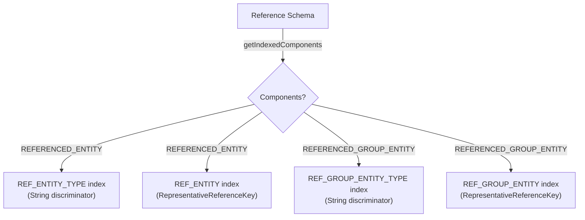
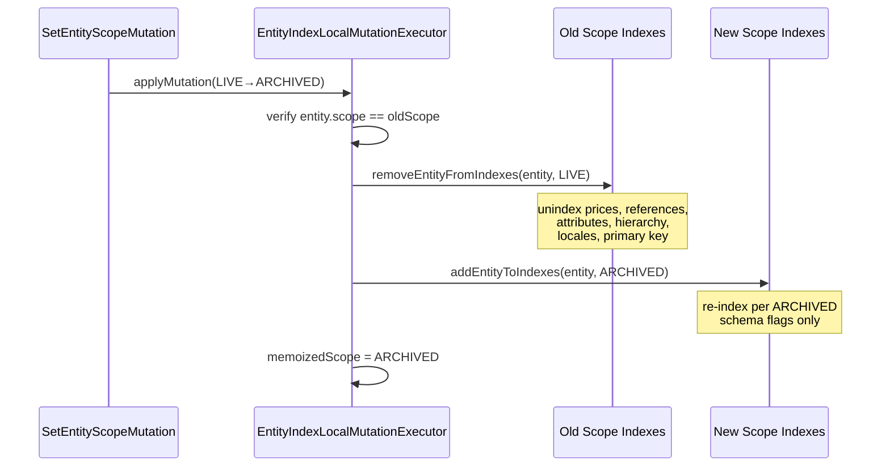
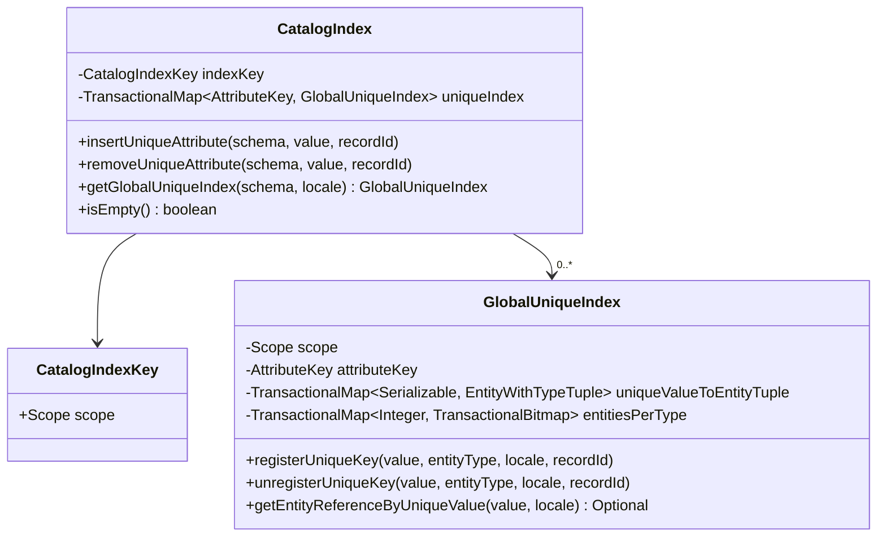
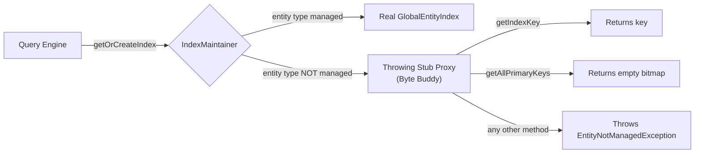
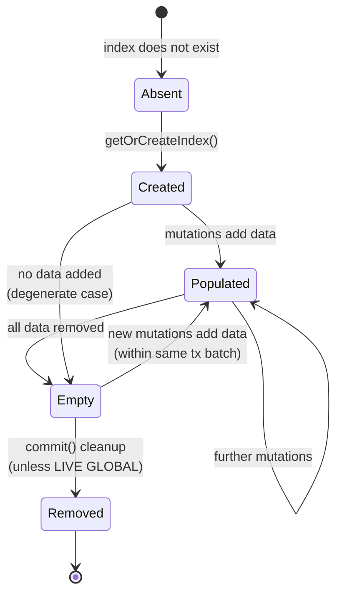

# Schema Settings Impact & Scope Management

This document explains how schema configuration options control which indexes are created, what data
they contain, and how entities transition between scopes. It serves as the definitive reference for
understanding the relationship between schema flags and the physical index structures described in
[Index Hierarchy](index-hierarchy.md#global-entity-index) and
[Data Structures](data-structures.md#attribute-index).

---

## Reference Index Type

<a id="reference-index-type"></a>

The `ReferenceIndexType` enum (declared in `io.evitadb.api.requestResponse.schema.ReferenceIndexType`)
controls the depth of indexing applied to a given reference schema within a particular `Scope`. It is
configured per-reference and per-scope via `ReferenceSchemaContract.getReferenceIndexType(Scope)`.

### Enum Values

| Level                               | Constant                         | Ordinal |
|-------------------------------------|----------------------------------|---------|
| No indexing                         | `NONE`                           | 0       |
| Basic filtering indexes             | `FOR_FILTERING`                  | 1       |
| Filtering + partitioned entity data | `FOR_FILTERING_AND_PARTITIONING` | 2       |

The levels are ordered: `NONE < FOR_FILTERING < FOR_FILTERING_AND_PARTITIONING`. The engine uses
ordinal comparison via `isIndexedReferenceFor()` in `ReferenceIndexMutator` to implement a
"minimum level" check:

```java
static boolean isIndexedReferenceFor(
	ReferenceSchemaContract referenceSchema, Scope scope, ReferenceIndexType referenceIndexType
) {
	return referenceSchema.getReferenceIndexType(scope).ordinal() >= referenceIndexType.ordinal();
}
```

### Index Structures Created per Level

| Index Structure                                      | `NONE` | `FOR_FILTERING`      | `FOR_FILTERING_AND_PARTITIONING` |
|------------------------------------------------------|--------|----------------------|----------------------------------|
| FacetIndex entries in GlobalEntityIndex              | --     | yes (if `isFaceted`) | yes (if `isFaceted`)             |
| ReferencedTypeEntityIndex (`REFERENCED_ENTITY_TYPE`) | --     | yes                  | yes                              |
| ReducedEntityIndex (`REFERENCED_ENTITY`)             | --     | yes                  | yes                              |
| ReducedGroupEntityIndex (`REFERENCED_GROUP_ENTITY`)  | --     | yes (if group component enabled) | yes (if group component enabled) |
| Reference attributes in ReferencedTypeEntityIndex    | --     | yes                  | yes                              |
| Reference attributes in ReducedEntityIndex           | --     | yes                  | yes                              |
| Reference attributes in ReducedGroupEntityIndex      | --     | yes (filter only, with cardinality) | yes (filter only, with cardinality) |
| **Entity** attributes in ReducedEntityIndex          | --     | --                   | **yes**                          |
| **Entity** attributes in ReducedGroupEntityIndex     | --     | --                   | **yes** (filter only, no sort/unique) |
| **Prices** in ReducedEntityIndex                     | --     | --                   | **yes**                          |
| **Prices** in ReducedGroupEntityIndex                | --     | --                   | **yes**                          |
| Locales in ReducedEntityIndex                        | --     | yes                  | yes                              |
| Sortable attribute compounds in ReducedEntityIndex   | --     | --                   | **yes**                          |

**Terminology note:** "<Term location="/documentation/developer/indexes/overview.md" name="reference attribute">
Reference attributes</Term>" are attributes defined on the reference schema itself
(e.g., `priority` on a product→category
reference). "<Term location="/documentation/developer/indexes/overview.md" name="entity attribute">Entity
attributes</Term>" are attributes defined on
the entity schema (e.g., `name` on the product entity). Reference attributes are always indexed in
both <Term location="/documentation/developer/indexes/overview.md" name="Reduced Entity Index">
`ReducedEntityIndex`</Term>
and <Term location="/documentation/developer/indexes/overview.md" name="Referenced Type Entity Index">
`ReferencedTypeEntityIndex`</Term> at any level above `NONE`. Entity
attributes are only replicated to `ReducedEntityIndex` at `FOR_FILTERING_AND_PARTITIONING`.
<Term location="/documentation/developer/indexes/overview.md" name="Global Entity Index">`GlobalEntityIndex`</Term>
holds entity attributes only -- never reference attributes.

The key difference between `FOR_FILTERING` and `FOR_FILTERING_AND_PARTITIONING` is that the latter
copies entity-level attributes and prices into
each <Term location="/documentation/developer/indexes/overview.md" name="Reduced Entity Index">
`ReducedEntityIndex`</Term>. This allows the query
engine to evaluate entity attribute filters and price predicates directly against the
<Term location="/documentation/developer/indexes/overview.md" name="partitioned view">reduced index</Term>
without falling back to the `GlobalEntityIndex`, significantly improving performance for queries that
combine `referenceHaving` with entity-level filter constraints.

### When Each Level is Used

- **`NONE`**: The reference is purely data-carrying. No index structures exist. The reference data
  is loaded alongside the entity body but cannot participate in any filtering or sorting.

- **`FOR_FILTERING`**: The recommended default. Creates the minimum index structures required for
  `ReferenceHaving` / `EntityHaving` / `GroupHaving` filtering and `ReferenceProperty` sorting.
  Reference attributes are indexed but entity-level data (attributes, prices) is not duplicated
  into ReducedEntityIndexes.

- **`FOR_FILTERING_AND_PARTITIONING`**: Used when reference filtering is combined with entity-level
  predicates in performance-critical queries. The entity's attributes and prices are duplicated into
  every ReducedEntityIndex, enabling the query engine to resolve complex conjunctions without
  consulting the GlobalEntityIndex. The trade-off is higher memory and disk consumption plus
  increased write amplification.

### Test Blueprint Hints

- **Invariant**: When `ReferenceIndexType` is `NONE`, calling `getIndexIfExists()` for any
  `EntityIndexKey` with type `REFERENCED_ENTITY_TYPE` or `REFERENCED_ENTITY` that references this
  reference name must return `null`.
- **Invariant**: When `FOR_FILTERING`, a `ReducedEntityIndex` must contain reference attribute
  values but must *not* contain entity-level attribute values or price entries.
- **Invariant**: When `FOR_FILTERING_AND_PARTITIONING`, the `ReducedEntityIndex` must mirror all
  entity-level filterable/sortable attributes and all indexed prices from the `GlobalEntityIndex`
  for the same entity primary key.

---

## Reference Indexed Components

<a id="reference-indexed-components"></a>

The `ReferenceIndexedComponents` enum (declared in
`io.evitadb.api.requestResponse.schema.ReferenceIndexedComponents`) controls **which axis** of the
reference relationship gets indexed. A reference can independently index its
<Term location="/documentation/developer/indexes/overview.md" name="referenced entity">referenced entity</Term>, its
referenced group entity, or both.

### Enum Values

| Constant                  | Description                                                             |
|---------------------------|-------------------------------------------------------------------------|
| `REFERENCED_ENTITY`       | Indexes by the referenced entity PK -- enables `EntityHaving` filtering |
| `REFERENCED_GROUP_ENTITY` | Indexes by the referenced group PK -- enables `GroupHaving` filtering   |

### Defaults and Configuration

```java
// Default: only the referenced entity is indexed (backward compatible)
public static final ReferenceIndexedComponents[] DEFAULT_INDEXED_COMPONENTS =
	new ReferenceIndexedComponents[]{ReferenceIndexedComponents.REFERENCED_ENTITY};
```

The indexed components are configured per-reference and per-scope via
`ReferenceSchemaContract.getIndexedComponents(Scope)`. A reference that is not indexed in a given
scope (`isIndexedInScope(scope) == false`) returns an empty set.

### Index Structures per Component

Each component creates a parallel set of index structures:

| Component                 | EntityIndexType (type index)   | EntityIndexType (reduced index) | Concrete reduced class       |
|---------------------------|--------------------------------|---------------------------------|------------------------------|
| `REFERENCED_ENTITY`       | `REFERENCED_ENTITY_TYPE`       | `REFERENCED_ENTITY`             | `ReducedEntityIndex`         |
| `REFERENCED_GROUP_ENTITY` | `REFERENCED_GROUP_ENTITY_TYPE` | `REFERENCED_GROUP_ENTITY`       | `ReducedGroupEntityIndex`    |

Both components share the same `ReferenceIndexType` level -- the type level applies uniformly to
all enabled components within a scope.

### Interaction with ReferenceIndexType

The two enums compose as follows:

```
ReferenceIndexType = NONE  -->  no indexes regardless of components
ReferenceIndexType = FOR_FILTERING + components = {REFERENCED_ENTITY}
    --> REFERENCED_ENTITY_TYPE index + REFERENCED_ENTITY indexes (ref attrs only)
ReferenceIndexType = FOR_FILTERING + components = {REFERENCED_ENTITY, REFERENCED_GROUP_ENTITY}
    --> all of the above PLUS REFERENCED_GROUP_ENTITY_TYPE + REFERENCED_GROUP_ENTITY indexes
ReferenceIndexType = FOR_FILTERING_AND_PARTITIONING + components = {REFERENCED_ENTITY}
    --> REFERENCED_ENTITY_TYPE + REFERENCED_ENTITY with entity attrs + prices
```

The guard check in `ReferenceIndexMutator.isIndexedForGroupComponent()` is straightforward:

```java
static boolean isIndexedForGroupComponent(ReferenceSchemaContract referenceSchema, Scope scope) {
	return referenceSchema.getIndexedComponents(scope)
		.contains(ReferenceIndexedComponents.REFERENCED_GROUP_ENTITY);
}
```

### Mermaid Diagram: Component Axis Selection



### Test Blueprint Hints

- **Invariant**: When `getIndexedComponents(scope)` does not contain `REFERENCED_GROUP_ENTITY`,
  no `EntityIndexKey` with type `REFERENCED_GROUP_ENTITY` or `REFERENCED_GROUP_ENTITY_TYPE` must
  exist for that reference name and scope.
- **Invariant**: Default components (`{REFERENCED_ENTITY}`) must not produce any group-level indexes.
- **Invariant**: When both components are enabled, inserting a reference with a group must create
  entries in both the entity-level and group-level reduced indexes for the same entity primary key.

---

## Attribute and Entity Schema Flags

<a id="attribute-entity-flags"></a>

Individual schema flags on attributes and entity schemas determine which sub-indexes are created and
maintained within each `EntityIndex`. Every flag is scope-aware -- a flag can be enabled in `LIVE`
but disabled in `ARCHIVED` (or vice versa).

### Attribute Schema Flags

All methods below are declared on `AttributeSchemaContract` and accept a `Scope` parameter:

**`isFilterableInScope(scope)`**
: Creates a FilterIndex entry within
[AttributeIndex](data-structures.md#attributeindex) -- histogram, range, or equality
filter structures.

**`isSortableInScope(scope)`**
: Creates a SortIndex entry within AttributeIndex -- pre-sorted arrays for ORDER BY.

**`isUniqueInScope(scope)`**
: Creates a UniqueIndex entry within AttributeIndex. Implies filterable; enforces
uniqueness within the entity collection.

**`isUniqueGloballyInScope(scope)`**
: Creates a GlobalUniqueIndex entry within [CatalogIndex](#catalogindex).
Cross-collection uniqueness; declared on `GlobalAttributeSchemaContract`.

When none of the flags above are `true` for a given attribute in a given scope, no sub-index is
created for that attribute in that scope. The attribute data is still stored in the entity body but
is invisible to the query engine.

### Entity Schema Flags

**`isWithHierarchy()`**
: Declares the entity type as hierarchical. Data-model flag only; does not
control indexing by itself.

**`isHierarchyIndexedInScope(scope)`**
: Creates a [HierarchyIndex](data-structures.md#hierarchyindex) in the
GlobalEntityIndex. Enables `HierarchyWithin` filtering and hierarchy extra results.

**`isPriceIndexedInScope(scope)`**
: Creates [PriceSuperIndex / PriceListAndCurrencyIndex](data-structures.md#price-indexes).
Enables price-based filtering and sorting.

**`getIndexedPricePlaces()`**
: Decimal precision for price indexing. All prices are scaled to `int` via
`10^indexedPricePlaces`.

### Cardinality and RepresentativeReferenceKey

The `Cardinality` enum (`io.evitadb.api.requestResponse.schema.Cardinality`) describes the expected
multiplicity of a reference:

| Value                          | Min | Max | Allows Duplicates |
|--------------------------------|-----|-----|-------------------|
| `ZERO_OR_ONE`                  | 0   | 1   | no                |
| `EXACTLY_ONE`                  | 1   | 1   | no                |
| `ZERO_OR_MORE`                 | 0   | MAX | no                |
| `ONE_OR_MORE`                  | 1   | MAX | no                |
| `ZERO_OR_MORE_WITH_DUPLICATES` | 0   | MAX | **yes**           |
| `ONE_OR_MORE_WITH_DUPLICATES`  | 1   | MAX | **yes**           |

When `Cardinality.allowsDuplicates()` returns `true`,
the <Term location="/documentation/developer/indexes/overview.md" name="Entity Index Key">`EntityIndexKey`</Term>
discriminator for
reduced indexes (`REFERENCED_ENTITY`, `REFERENCED_GROUP_ENTITY`)
uses <Term location="/documentation/developer/indexes/overview.md" name="Representative Reference Key">
`RepresentativeReferenceKey`</Term>
with non-empty representative attribute values. These values act as a tie-breaker to distinguish
multiple references from the same entity to the same target entity.

For non-duplicate cardinalities, the `RepresentativeReferenceKey` carries an empty attribute array,
making the discriminator effectively equivalent to `(referenceName, primaryKey)`.

### Impact Matrix

The following matrix summarizes which flags trigger the creation of which sub-index structures within
the `GlobalEntityIndex` and `ReducedEntityIndex`:

| Flag / Setting              | Global          | Reduced (FILTER)       | Reduced (PARTITION)     |
|-----------------------------|-----------------|------------------------|-------------------------|
| `isFilterableInScope`       | FilterIndex     | --                     | FilterIndex             |
| `isSortableInScope`         | SortIndex       | --                     | SortIndex               |
| `isUniqueInScope`           | UniqueIndex     | --                     | UniqueIndex             |
| `isHierarchyIndexedInScope` | HierarchyIndex  | --                     | --                      |
| `isPriceIndexedInScope`     | PriceSuperIndex | --                     | PriceListAndCurrencyIdx |
| `isFacetedInScope`          | FacetIndex      | --                     | FacetIndex              |
| Ref attr `isFilterable`     | --              | FilterIndex (type idx) | FilterIndex (type idx)  |
| Ref attr `isSortable`       | --              | SortIndex (type idx)   | SortIndex (type idx)    |

Legend: **Global** = GlobalEntityIndex, **Reduced (FILTER)** = ReducedEntityIndex
with `FOR_FILTERING`, **Reduced (PARTITION)** = ReducedEntityIndex with
`FOR_FILTERING_AND_PARTITIONING`.

### Test Blueprint Hints

- **Invariant**: Setting `isFilterableInScope(LIVE)` to `false` for an attribute must result in no
  `FilterIndex` entry for that attribute in any LIVE-scoped `EntityIndex`.
- **Invariant**: `isUniqueGloballyInScope(LIVE)` must cause entries in both the per-collection
  `UniqueIndex` and the cross-collection `GlobalUniqueIndex` in the `CatalogIndex`.
- **Invariant**: `isPriceIndexedInScope(ARCHIVED) == false` must prevent any price index structures
  in ARCHIVED-scoped indexes, even if the entity body contains prices.
- **Invariant**: `getIndexedPricePlaces()` must be consistently applied when scaling price values
  to `int` in both the GlobalEntityIndex and all ReducedEntityIndexes.

---

## Scope Management

<a id="scope-management"></a>

Every entity in evitaDB exists in exactly
one <Term location="/documentation/developer/indexes/overview.md" name="scope">`Scope`</Term> at any given time. The
`Scope` enum
(`io.evitadb.dataType.Scope`) defines two values:

| Value      | Description                                                                  |
|------------|------------------------------------------------------------------------------|
| `LIVE`     | Active entities in the live data set; fully indexed per schema               |
| `ARCHIVED` | Inactive entities; may have reduced indexing per scope-specific schema flags |

### Scope in Index Keys

Every <Term location="/documentation/developer/indexes/overview.md" name="Entity Index Key">`EntityIndexKey`</Term>
carries a `Scope` field. This means that LIVE and ARCHIVED entities
maintain **completely separate** index trees:

```java
public record EntityIndexKey(
	EntityIndexType type,
	Scope scope,            // <-- determines the index partition
	Serializable discriminator
) implements IndexKey { ...
}
```

Similarly, `CatalogIndexKey` carries a scope, yielding separate `CatalogIndex` instances per scope.

### Scope Transition via SetEntityScopeMutation

When an entity moves between scopes (e.g., LIVE to ARCHIVED or vice versa), the engine executes
`SetEntityScopeMutation`. The mutation executor in
`EntityIndexLocalMutationExecutor.applyMutation()` handles this by:

1. Verifying the entity's current scope matches the stored scope.
2. Calling `removeEntityFromIndexes(entity, oldScope)` -- removes the entity from **all** indexes
   in the old scope (prices, references, attributes, hierarchy, locales, primary key).
3. Calling `addEntityToIndexes(entity, newScope)` -- re-indexes the entity into the new scope's
   indexes, respecting the new scope's schema flags.



### Removal Order

The removal order in `removeEntityFromIndexes` is significant:

1. **Prices** -- removed first (from global and reduced indexes)
2. **References** (and their attributes) -- removed before global attributes
3. **Global entity attributes**
4. **Hierarchy placement**
5. **Locales**
6. **Primary key** from `GlobalEntityIndex`

### Insertion Order

The insertion order in `addEntityToIndexes` mirrors the dependency chain:

1. **Primary key** into `GlobalEntityIndex`
2. **Locales**
3. **Global entity attributes**
4. **Hierarchy placement**
5. **Prices**
6. **References** (and their attributes)

### LIVE GlobalEntityIndex is Never Removed

The commit-time cleanup logic in `EntityIndexLocalMutationExecutor.commit()` explicitly excludes
the LIVE <Term location="/documentation/developer/indexes/overview.md" name="Global Entity Index">
`GlobalEntityIndex`</Term> from removal, even if it becomes empty:

```java
// global live index is never removed and is always present (even if empty)
if(!(accessedIndexKey.type() ==EntityIndexType.GLOBAL
      &&accessedIndexKey.

scope() ==Scope.LIVE)){
EntityIndex entityIndex = entityIndexCreatingAccessor.getIndexIfExists(accessedIndexKey);
    if(entityIndex !=null&&entityIndex.

isEmpty()){
	entityIndexCreatingAccessor.

removeIndex(accessedIndexKey);
    }
	    }
```

This guarantees that the LIVE `GlobalEntityIndex` always exists for every entity collection, serving
as the anchor for full-scan queries and the fallback for any query that cannot use a reduced index.

### Test Blueprint Hints

- **Invariant**: After a LIVE to ARCHIVED transition, the entity's primary key must not appear in
  any LIVE-scoped `EntityIndex`.
- **Invariant**: After a LIVE to ARCHIVED transition, the entity must appear in the ARCHIVED
  `GlobalEntityIndex` if and only if the schema has any indexed properties in the ARCHIVED scope.
- **Invariant**: The LIVE `GlobalEntityIndex` must exist even when the entity collection is empty.
- **Invariant**: ARCHIVED `GlobalEntityIndex` is removed when empty (unlike LIVE).
- **Invariant**: Schema flags that are `false` in `ARCHIVED` must not produce index entries for
  archived entities, even though the same flag may be `true` in `LIVE`.

---

## CatalogIndex

<a id="catalog-index"></a>

The `CatalogIndex` (`io.evitadb.index.CatalogIndex`) is a cross-entity-type index that maintains
globally unique attribute constraints. There is one `CatalogIndex`
per <Term location="/documentation/developer/indexes/overview.md" name="scope">`Scope`</Term>.

### Structure



### Purpose

When a `GlobalAttributeSchemaContract` has `isUniqueGloballyInScope(scope) == true`, the
<Term location="/documentation/developer/indexes/overview.md" name="entity attribute">entity attribute</Term>
value must be unique **across all entity collections** in the catalog for the given scope. The
`CatalogIndex` enforces this constraint through its `GlobalUniqueIndex` instances.

Each `GlobalUniqueIndex` maps attribute values to `EntityWithTypeTuple` records that encode:

- The entity type (as an internal integer primary key)
- The entity primary key
- The locale (or `-1` for non-localized attributes)

This allows the engine to detect uniqueness violations across entity types and to resolve
globally unique attribute lookups to a specific entity reference.

### Lifecycle

`GlobalUniqueIndex` instances within the `CatalogIndex` are created lazily via `computeIfAbsent`
on the first `insertUniqueAttribute` call and removed when they become empty during
`removeUniqueAttribute`:

```java
if(theUniqueIndex.isEmpty()){
	this.uniqueIndex.

remove(lookupKey);
// register removal in transactional layer
}
```

### Test Blueprint Hints

- **Invariant**: A `GlobalUniqueIndex` must reject insertion of a duplicate value with a
  `UniqueValueViolationException`, even when the two entities belong to different entity types.
- **Invariant**: The `CatalogIndex` must be empty (and contain no `GlobalUniqueIndex` instances)
  when no globally unique attributes are defined in the catalog schema.
- **Invariant**: Separate `CatalogIndex` instances must exist for `LIVE` and `ARCHIVED` scopes,
  enforcing uniqueness independently within each scope.

---

## Index Lifecycle

<a id="index-lifecycle"></a>

Indexes in evitaDB are created lazily and cleaned up eagerly at commit time. This section describes
the lifecycle mechanisms.

### Lazy Creation via IndexMaintainer

The `IndexMaintainer<K, T>` interface (`io.evitadb.index.IndexMaintainer`) provides the primary
mechanism for lazy index creation:

```java
public interface IndexMaintainer<K extends IndexKey, T extends Index<K>> {
	T getOrCreateIndex(K entityIndexKey);       // create if absent

	T getIndexIfExists(K entityIndexKey);        // return null if absent

	T getIndexByPrimaryKey(int indexPrimaryKey); // lookup by internal PK

	void removeIndex(K entityIndexKey);          // remove (must exist)
}
```

When `EntityIndexLocalMutationExecutor` needs an index, it calls `getOrCreateIndex()`. If the index
does not exist, the maintainer creates it on the fly. This ensures that no index is allocated until
the first mutation actually requires it.

### Commit-Time Cleanup of Empty Indexes

At the end of each mutation batch, `EntityIndexLocalMutationExecutor.commit()` iterates over all
indexes that were accessed during the batch and removes any that have become empty:

```java
for(EntityIndexKey accessedIndexKey :this.accessedIndexes){
	if(!(accessedIndexKey.

type() ==EntityIndexType.GLOBAL
          &&accessedIndexKey.

scope() ==Scope.LIVE)){
EntityIndex entityIndex = entityIndexCreatingAccessor.getIndexIfExists(accessedIndexKey);
        if(entityIndex !=null&&entityIndex.

isEmpty()){
	entityIndexCreatingAccessor.

removeIndex(accessedIndexKey);
        }
	        }
	        }
```

Key rules:

- The LIVE <Term location="/documentation/developer/indexes/overview.md" name="Global Entity Index">
  `GlobalEntityIndex`</Term> is **never** removed, even if empty.
- All other index types (<Term location="/documentation/developer/indexes/overview.md" name="Reduced Entity Index">
  reduced
  indexes</Term>, <Term location="/documentation/developer/indexes/overview.md" name="Referenced Type Entity Index">type
  indexes</Term>, ARCHIVED global indexes) are removed when
  empty to reclaim memory and disk space.
- Cleanup only examines indexes that were **accessed** during the current mutation batch -- this
  avoids scanning the entire index map.

### The createThrowingStub Proxy Pattern

For entity types that are referenced by other entities but are not themselves managed by evitaDB
(i.e., `isReferencedEntityTypeManaged() == false`), the engine cannot create a real
`GlobalEntityIndex`. Instead, `GlobalEntityIndex.createThrowingStub()` creates a Byte Buddy proxy
that:

- Returns the correct `EntityIndexKey` when `getIndexKey()` is called.
- Returns an empty bitmap for `getAllPrimaryKeys()`.
- **Throws `EntityNotManagedException`** for any other method invocation.

This proxy acts as a lightweight sentinel: it satisfies the type system and key-based lookups but
prevents any accidental mutation or query against unmanaged entity types.



### Mermaid Diagram: Full Index Lifecycle



### Test Blueprint Hints

- **Invariant**: `getOrCreateIndex()` must be idempotent -- calling it twice with the same key must
  return the same index instance within a transaction.
- **Invariant**: After `commit()`, no empty `EntityIndex` must remain except the LIVE
  `GlobalEntityIndex`.
- **Invariant**: The throwing stub must allow `getIndexKey()` and `getAllPrimaryKeys()` without
  throwing, but must throw `EntityNotManagedException` for mutation methods like
  `insertPrimaryKeyIfMissing()`.
- **Invariant**: `removeIndex()` must throw `IllegalArgumentException` when called with a key that
  has no associated index.

---

## Navigation

- [Index Architecture Overview](overview.md#overview) -- start here for the three-axis model
- [Index Hierarchy](index-hierarchy.md#global) -- GlobalEntityIndex,
  ReducedEntityIndex, ReferencedTypeEntityIndex details
- [Data Structures](data-structures.md#attributeindex) -- AttributeIndex, HierarchyIndex,
  FacetIndex, PriceIndex internals
- [Mutation Flow](mutation-flow.md#orchestration) -- how mutations propagate through the index tree
- [Query Mapping](query-mapping.md#constraint-index-table) -- which query constraints use which
  indexes
- [Transactions Deep Dive](../../user/en/deep-dive/transactions.md) -- STM internals and
  transactional layer mechanics
