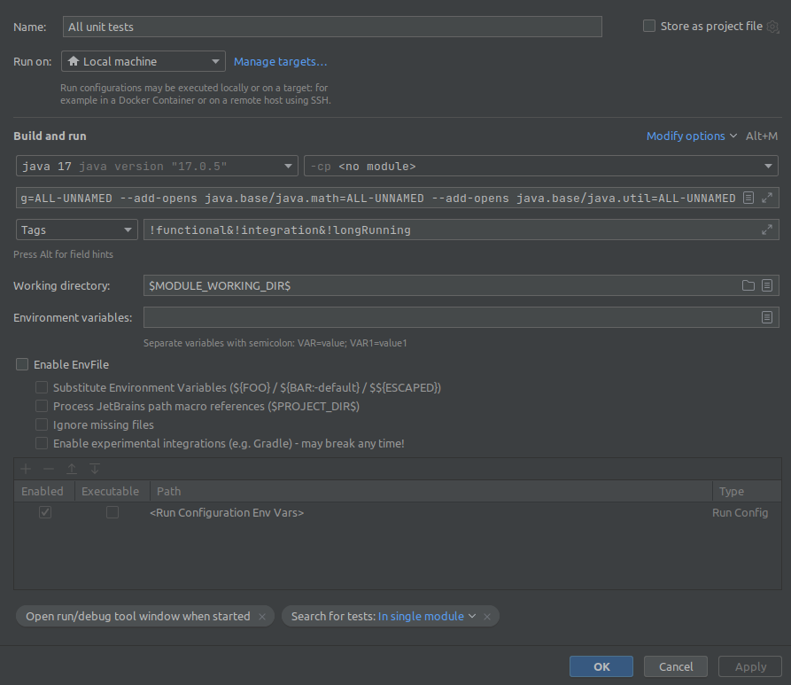
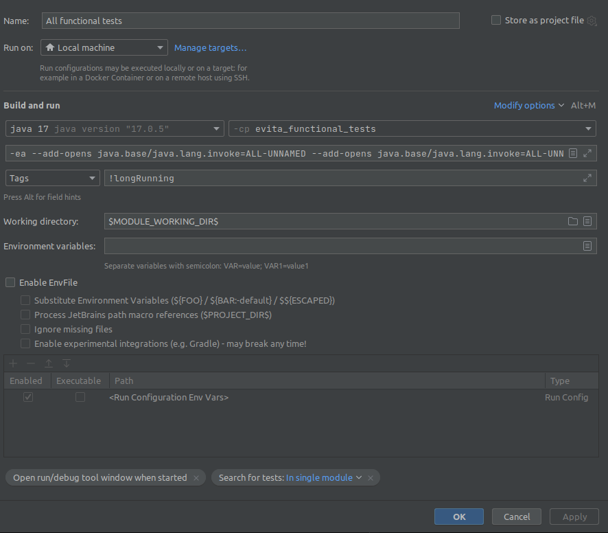
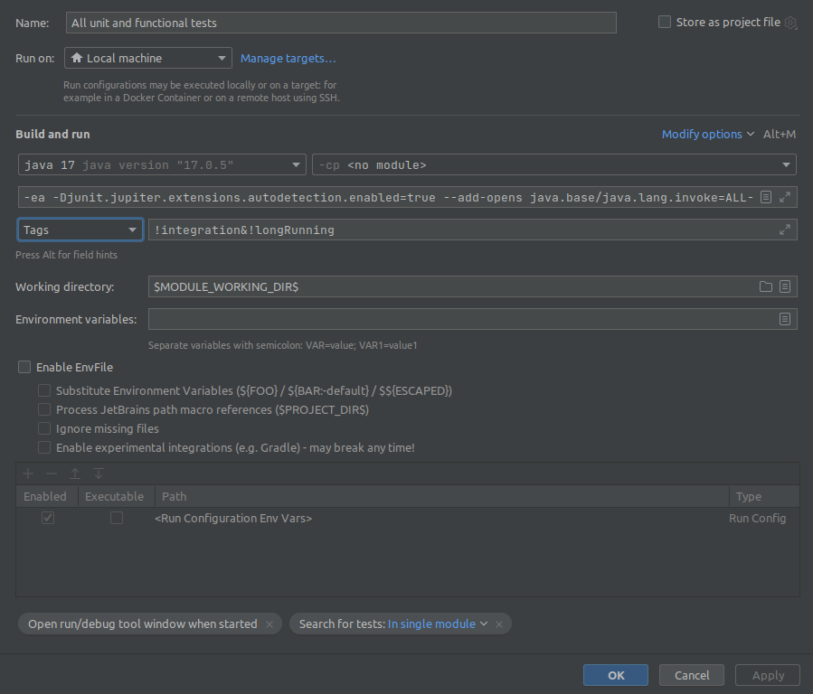

# Automatic testing

_Note: if you plan to use IntelliJ IDEA to run tests, checkout the [compiler configuration](intellij_idea_compiler.md) documentation._

_Note: the project includes pre-configured shared IntelliJ IDEA run configurations in `.idea/runConfigurations/` for
common test scenarios (All functional tests, Documentation tests, GraphQL tests, REST tests). These can be used directly
without manual setup._

## Unit testing

Unit tests are placed directly in the same JAR as production code that is being tested. Test classes should keep the
name of the tested class adding `Test` suffix. This pattern is automatically recognized by IDEs. Unit tests has no
tags or annotations. Unit tests are expected to be fast.

### Recommended usage

You can run tests in Maven by using:

```
mvn clean install -P unit
```

or you can run tests in IntelliJ Idea, but you need to add several Java arguments
to the JUnit configuration template:

```
--add-opens java.base/java.lang.invoke=ALL-UNNAMED
--add-opens java.base/java.lang.invoke=ALL-UNNAMED
--add-opens java.base/java.lang=ALL-UNNAMED
--add-opens java.base/java.math=ALL-UNNAMED
--add-opens java.base/java.util=ALL-UNNAMED
```

and exclude `functional`, `integration`, `longRunning` and `documentation` tags from the actual runner configuration
like so



## Functional and integration testing

Bodies of the **functional tests** are placed in `evita_functional_tests` module.
Functional tests use artificial data that are constructed and created specially for each test to verify certain behaviour.
The test data are relatively small.

### Recommended usage

You can run tests in Maven by using:

```
mvn clean install -P functional
```

Or you can run tests in IntelliJ Idea in the `evita_functional_tests` module, but you need to add several Java arguments
to the JUnit configuration template:

```
--add-opens java.base/java.lang.invoke=ALL-UNNAMED
--add-opens java.base/java.lang.invoke=ALL-UNNAMED
--add-opens java.base/java.lang=ALL-UNNAMED
--add-opens java.base/java.math=ALL-UNNAMED
--add-opens java.base/java.util=ALL-UNNAMED
```

and exclude tests with `documentation` and `longRunning` tags from the actual runner configuration:



## Unit and functional testing

You can also run both unit and functional tests (which is generally recommended) using Maven:

```
mvn clean install -P unitAndFunctional
```

or in IntelliJ IDEA, but you need to add several Java arguments to JUnit configuration template first:

```
--add-opens java.base/java.lang.invoke=ALL-UNNAMED
--add-opens java.base/java.lang.invoke=ALL-UNNAMED
--add-opens java.base/java.lang=ALL-UNNAMED
--add-opens java.base/java.math=ALL-UNNAMED
--add-opens java.base/java.util=ALL-UNNAMED
```

as well as following expression for tags field:

```
!integration&!longRunning&!documentation
```

like so



## Documentation testing

Documentation tests validate that code snippets embedded in the user documentation compile, execute correctly, and
produce the expected output. The mechanism ensures that the more than 600 code examples across five languages (EvitaQL,
Java, GraphQL, REST, C#) remain correct and do not become outdated as the codebase evolves. Tests are tagged with
`documentation`.

### Motivation

The user documentation in `documentation/user/en/` is written in MDX format (a combination of MarkDown and React).
It is published on the [evitadb.io documentation portal](https://evitadb.io/documentation), but the source files
are kept in the main repository alongside the code. This tight coupling is intentional — it allows documentation to be
reviewed in pull requests together with the code changes that affect it.

Code examples in the documentation come in multiple language variants. In most cases, only the EvitaQL variant is written
by hand. The Java, GraphQL, REST and C# variants, as well as the expected output (Markdown tables or JSON blocks), are
**auto-generated** by the test infrastructure. The generated files are committed to the repository so they can be
reviewed and rendered by the documentation portal.

### Running documentation tests

You can run documentation tests in Maven by using:

```
mvn clean install -P documentation
```

Documentation tests are also executed weekly on Monday mornings via the GitHub Actions workflow
`.github/workflows/documentation-tests.yml`. The workflow skips execution if no commits were made in the past week.

### How it works — high-level overview

The entry point is the `UserDocumentationTest` class in the `evita_functional_tests` module:

```
evita_test/evita_functional_tests/src/test/java/io/evitadb/documentation/UserDocumentationTest.java
```

It is a JUnit 5 `@TestFactory` that:

1. Walks all `.md` files under `documentation/user/en/`
2. Scans each file for code blocks using four regex patterns
3. Converts each discovered code block into a `DynamicTest`
4. Groups the tests by source file into `DynamicContainer` nodes
5. Prepends language-specific initialization tests and appends teardown tests

Each code block is compiled and executed against the [evitaDB demo server](https://demo.evitadb.io) (or a local
instance for `local`-tagged examples). The test verifies that the code compiles, executes without errors, and —
where golden output files exist — produces the expected output.

### Writing documentation with testable code examples

#### Documentation file structure

User documentation lives in `documentation/user/en/`. Code snippets are stored as external files in `examples/`
subdirectories adjacent to the MarkDown files that reference them:

```
documentation/user/en/
├── query/
│   └── filtering/
│       ├── comparable.md                          ← documentation page
│       └── examples/
│           └── comparable/
│               ├── attribute-equals.evitaql       ← primary EvitaQL snippet
│               ├── attribute-equals.java          ← Java variant
│               ├── attribute-equals.graphql       ← GraphQL variant
│               ├── attribute-equals.rest          ← REST variant
│               ├── attribute-equals.cs            ← C# variant
│               ├── attribute-equals.evitaql.md    ← expected EvitaQL output (Markdown table)
│               ├── attribute-equals.graphql.json.md  ← expected GraphQL output (JSON)
│               └── attribute-equals.rest.json.md     ← expected REST output (JSON)
```

The naming convention is critical: all variants of the same example share the **same base name** and differ only in
the file extension. The test runner uses this convention to automatically discover related files.

#### Custom MDX components for code examples

The documentation uses three custom MDX components to embed code examples. These components render as interactive
tabbed code blocks on the documentation portal, but are ignored by plain MarkDown renderers like GitHub.

##### `<SourceCodeTabs>` — multi-language code examples

This is the most commonly used component. It references a primary snippet file and the test runner automatically
discovers sibling files with the same base name in other languages.

```markdown
<SourceCodeTabs requires="evita_test/.../evitaql-init.java" langSpecificTabOnly>

[Description of the example](/documentation/user/en/query/filtering/examples/comparable/attribute-equals.evitaql)
</SourceCodeTabs>
```

The component accepts the following attributes:

| Attribute            | Example                                        | Description                                                                                                                                         |
|----------------------|------------------------------------------------|-----------------------------------------------------------------------------------------------------------------------------------------------------|
| `requires`           | `requires="/path/to/setup.java"`               | Comma-separated list of same-language prerequisite files that must be executed before this snippet. For Java, these are prepended into JShell.       |
| `setup`              | `setup="/path/to/a.java,/path/to/b.java"`      | Comma-separated list of Java setup scripts run before the snippet in all languages. Used via `JavaWrappingExecutable` for non-Java primary snippets. |
| `langSpecificTabOnly`| _(no value, just the attribute name)_          | UI hint for the documentation portal. Does not affect the test runner.                                                                              |
| `local`              | _(no value, just the attribute name)_          | Forces the example to run against a local evitaDB instance (`localhost:5555`) instead of the demo server. The test starts and stops a local server.  |
| `ignoreTest`         | _(no value, just the attribute name)_          | Temporarily disables testing of this snippet. **We aim for zero `ignoreTest` attributes in the codebase.**                                          |

##### `<SourceAlternativeTabs>` — alternative implementations

Used to show multiple variants of the same concept (e.g., interface vs. record vs. class in Java). Instead of
discovering siblings by file extension, it discovers them by matching variant keywords in the file name.

```markdown
<SourceAlternativeTabs requires="/path/to/prerequisite.java" variants="interface|record|class">

[Example interface](/documentation/user/en/use/api/example/primary-key-read-interface.java)
</SourceAlternativeTabs>
```

Given a primary file `primary-key-read-interface.java` and `variants="interface|record|class"`, the test runner
looks for `primary-key-read-record.java` and `primary-key-read-class.java` in the same directory.

The `variants` attribute is **required** for this component. The `requires`, `setup`, `local` and `ignoreTest`
attributes work identically to `<SourceCodeTabs>`.

##### `<MDInclude>` — expected output inclusion

Includes frozen output files (golden files) that the test runner verifies against live query results.

```markdown
<MDInclude>[Description](/documentation/user/en/query/.../attribute-equals.evitaql.md)</MDInclude>
```

The optional `sourceVariable` attribute specifies a dot-path into the result object to extract a specific value
before comparison:

```markdown
<MDInclude sourceVariable="extraResults.AttributeHistogram">
[Histogram result](/documentation/user/en/query/.../attribute-histogram.evitaql.string.md)
</MDInclude>
```

#### Snippet file formats

| Extension   | Language | Format                                                                                                  |
|-------------|----------|---------------------------------------------------------------------------------------------------------|
| `.evitaql`  | EvitaQL  | An EvitaQL `query(...)` expression                                                                      |
| `.java`     | Java     | Java statements compatible with JShell (no class wrapper needed)                                        |
| `.graphql`  | GraphQL  | A GraphQL query or mutation body                                                                        |
| `.rest`     | REST     | `METHOD /path` followed by a JSON body; multiple requests separated by `---`                            |
| `.cs`       | C#       | C# code executed by the CShell query validator binary                                                   |

**Output (golden) files:**

| Extension             | Content                                                       |
|-----------------------|---------------------------------------------------------------|
| `.evitaql.md`         | Markdown table with EvitaQL query results                     |
| `.evitaql.string.md`  | Markdown code block with `prettyPrint()` output               |
| `.evitaql.json.md`    | Markdown JSON code block with serialized EvitaQL result       |
| `.graphql.json.md`    | Markdown JSON code block with GraphQL response                |
| `.rest.json.md`       | Markdown JSON code block with REST response                   |

#### Inline code blocks

Besides external snippet files, the test runner also picks up inline fenced code blocks from MarkDown:

````markdown
``` java
final EvitaResponse<SealedEntity> response = evita.queryCatalog(
    "evita",
    session -> session.querySealedEntity(
        query(
            collection("Product"),
            filterBy(attributeEquals("code", "my-product"))
        )
    )
);
```
````

These are matched by the `SOURCE_CODE_PATTERN` regex. The language tag determines which executable is used. Code blocks
with the following language tags are **not tested**: `evitaql-syntax`, `md`, `bash`, `Maven`, `Gradle`, `shell`,
`json`, `yaml`, `plain`, `protobuf`.

#### A complete example

Here is a typical pattern in the documentation showing how all three components work together to display a code example
with its output:

```markdown
<SourceCodeTabs requires="evita_test/.../evitaql-init.java" langSpecificTabOnly>

[Products matching attribute filter](/documentation/user/en/query/filtering/examples/comparable/attribute-equals.evitaql)
</SourceCodeTabs>

Returns exactly one product with *code* equal to *apple-iphone-13-pro-3*.

<LS to="e,j,c">

<MDInclude>[Result table](/documentation/user/en/query/filtering/examples/comparable/attribute-equals.evitaql.md)</MDInclude>

</LS>

<LS to="g">

<MDInclude>[Result JSON](/documentation/user/en/query/filtering/examples/comparable/attribute-equals.graphql.json.md)</MDInclude>

</LS>

<LS to="r">

<MDInclude>[Result JSON](/documentation/user/en/query/filtering/examples/comparable/attribute-equals.rest.json.md)</MDInclude>

</LS>
```

The `<LS to="...">` component is a language selector rendered by the documentation portal. It controls which output
block is shown based on the selected language tab (`e` = EvitaQL, `j` = Java, `c` = C#, `g` = GraphQL, `r` = REST).

### Test infrastructure internals

#### MarkDown scanning patterns

`UserDocumentationTest` uses four compiled regex patterns to find code blocks:

| Pattern                          | Matches                             | Groups                                                                     |
|----------------------------------|-------------------------------------|----------------------------------------------------------------------------|
| `SOURCE_CODE_PATTERN`            | Inline `` ``` lang ... ``` `` blocks | (1) language tag, (2) content                                              |
| `SOURCE_CODE_TABS_PATTERN`       | `<SourceCodeTabs>` components       | (1) attribute string, (2) file path from the Markdown link                 |
| `SOURCE_ALTERNATIVE_TABS_PATTERN`| `<SourceAlternativeTabs>` components| (1) attribute string, (2) file path from the Markdown link                 |
| `MD_INCLUDE_PATTERN`             | `<MDInclude>` components            | (2) optional `sourceVariable` value, (3) file path from the Markdown link  |

The patterns are applied sequentially to each `.md` file. Every match produces one or more `CodeSnippet` records
that are later converted to JUnit 5 `DynamicTest` instances.

#### `CodeSnippet` and `OutputSnippet`

A `CodeSnippet` record represents a single testable code block:

```java
public record CodeSnippet(
    String name,                     // display name in the IDE test runner
    String format,                   // "evitaql" | "java" | "graphql" | "rest" | "cs"
    Path path,                       // external file path (null for inline blocks)
    Executable executableLambda      // the actual test logic
) {}
```

An `OutputSnippet` record represents a frozen output file linked via `<MDInclude>`:

```java
public record OutputSnippet(
    String forFormat,       // output format: "md" | "json" | "string"
    Path path,              // path to the golden file
    String sourceVariable   // optional dot-path to extract from the result before comparison
) {}
```

Output snippets are indexed by the source snippet path. When the test runner creates an executable for a source snippet,
it looks up matching output snippets from this index and passes them to the executable for verification.

#### Test context lifecycle

Each language has its own `TestContext` implementation and `TestContextFactory`:

| Language | Context class         | Factory class               | What it manages                                                  |
|----------|-----------------------|-----------------------------|------------------------------------------------------------------|
| EvitaQL  | `EvitaTestContext`    | `EvitaTestContextFactory`   | `EvitaClient` connection + query converters (GraphQL, REST, C#)  |
| Java     | `JavaTestContext`     | `JavaTestContextFactory`    | A persistent `JShell` instance with the full test classpath      |
| GraphQL  | `GraphQLTestContext`  | `GraphQLTestContextFactory` | A `GraphQLClient` connected to the demo (or local) server        |
| REST     | `RestTestContext`     | `RestTestContextFactory`    | A `RestClient` connected to the demo (or local) server           |
| C#       | `CsharpTestContext`   | `CsharpTestContextFactory`  | A `CShell` wrapper around the C# query validator binary          |

The `TestContextProvider` inner class in `UserDocumentationTest` caches factory instances per
`(Environment, FactoryClass)` pair. The first time a language is needed, it:

1. Instantiates the factory
2. Registers the factory's **init test** (creates client/JShell/connection)
3. Registers the factory's **teardown test** (closes and cleans up resources)
4. Returns a `Supplier<T>` that executables use to access the context lazily

All contexts within a single `.md` file are **shared** — the JShell instance, EvitaClient, etc. persist across
all snippets in the file. This enables incremental execution where later snippets build on the state established
by earlier ones.

#### Executable classes

Each language has a dedicated `Executable` implementation:

##### `EvitaQLExecutable`

1. Parses the EvitaQL source with `DefaultQueryParser`
2. Executes the query via `EvitaClient.queryCatalog()`
3. Generates output in the requested format (Markdown table, JSON, or string)
4. Compares generated output against golden files (via `assertEquals`)
5. Optionally generates companion snippets in Java, GraphQL, REST and C# using query converters

This is the most important executable — it is the **source of truth** for auto-generating companion language snippets
and expected output files.

##### `JavaExecutable`

1. Prepends any `requires` prerequisite files
2. Splits the combined source into JShell-compatible commands using `JShell.sourceCodeAnalysis().analyzeCompletion()`
3. Executes the commands in the shared `JShell` instance
4. Reports compilation or runtime errors as test failures

The `JavaTestContext` implements **incremental execution**: it tracks which commands were previously run and only
re-executes the commands that changed. This makes subsequent Java snippets in the same file faster, as shared
setup code is not re-run.

The JShell instance is preconfigured with:

- The full test classpath (all evitaDB modules)
- An extensive set of imports from `META-INF/documentation/imports.java`
- A `documentationProfile` variable set to `"LOCALHOST"` or `"DEMO_SERVER"`

##### `GraphQLExecutable`

1. Detects the target endpoint from the query content (`/gql/system`, `/gql/evita/schema`, or `/gql/evita`)
2. Sends the query via `GraphQLClient`
3. Compares the JSON response against golden files

##### `RestExecutable`

1. Splits the source on `---` delimiters (for multi-request snippets)
2. Parses each request line (`METHOD /path`) and body
3. Executes via `RestClient`
4. Compares the JSON response against golden files

##### `CsharpExecutable`

1. Sends C# source code to the CShell query validator binary (downloaded at test startup)
2. The binary compiles and runs the C# code against the demo server
3. Captures standard output (Markdown/JSON) and compares against golden files

##### `JavaWrappingExecutable`

When a non-Java snippet (GraphQL, REST, C#) has `setup` Java scripts, `JavaWrappingExecutable` wraps it:

1. Executes the Java `setup` scripts in JShell (e.g., start a local evitaDB server, create schema)
2. Delegates to the inner executable (GraphQL/REST/C# test)
3. Cleans up the JShell state after the inner executable completes

This pattern is used for `local` examples that need a running evitaDB instance provisioned by Java code before
the non-Java API call can be made.

#### Auto-generation of companion snippets

When the EvitaQL executable is run with `CreateSnippets` flags enabled, it auto-generates companion files:

| Flag                   | Generates                                                                |
|------------------------|--------------------------------------------------------------------------|
| `CreateSnippets.JAVA`  | Java snippet by substituting the EvitaQL query into a Java template      |
| `CreateSnippets.GRAPHQL`| GraphQL query via `GraphQLQueryConverter`                               |
| `CreateSnippets.REST`   | REST request via `RestQueryConverter`                                   |
| `CreateSnippets.CSHARP` | C# snippet by substituting the EvitaQL query into a C# template        |
| `CreateSnippets.MARKDOWN`| Markdown output files (tables, JSON blocks)                            |

The Java template is located at `META-INF/documentation/evitaql.java` and contains a `#QUERY#` placeholder
that is replaced with the EvitaQL query:

```java
final EvitaResponse<SealedEntity> entities = evita.queryCatalog(
    "evita",
    session -> {
        return session.querySealedEntity(
            #QUERY#
        );
    }
);
```

The `testSingleFileDocumentationAndCreateOtherLanguageSnippets()` method (disabled by default) can be used to
regenerate all companion files for a specific documentation page.

#### The `Environment` enum

```java
public enum Environment {
    LOCALHOST,    // connects to localhost:5555 with self-signed certificate
    DEMO_SERVER   // connects to demo.evitadb.io:5555 with Let's Encrypt certificate
}
```

The `testDocumentation()` factory always uses `DEMO_SERVER`. Examples tagged with `local` switch to `LOCALHOST`
and start their own evitaDB instance via the `setup` scripts.

#### EvitaQL init script

The `evitaql-init.java` script (at `META-INF/documentation/evitaql-init.java`) creates an `EvitaClient` connected
to the appropriate server based on `documentationProfile`. Most EvitaQL and Java examples specify this script in their
`requires` attribute, so that an `evita` variable is available in scope when the example code runs.

### Debugging documentation snippets

`UserDocumentationTest` provides two disabled `@TestFactory` methods for development use:

- **`testSingleFileDocumentation()`** — Tests snippets from a single `.md` file. Change the path in the method body
  to target the file you are working on. Useful for rapid iteration when writing a new documentation page.

- **`testSingleFileDocumentationAndCreateOtherLanguageSnippets()`** — Same as above, but also enables all
  `CreateSnippets` flags to regenerate companion language files and output files. Use this after writing a new
  EvitaQL example to generate the Java, GraphQL, REST, C# variants and the expected Markdown/JSON output.

To use them:

1. Remove the `@Disabled` annotation
2. Update the file path to point to your documentation page
3. Run the test from your IDE
4. Review the generated files and commit them alongside the documentation

### Adding a new code example — step by step

1. **Write the EvitaQL snippet** in an `examples/` subdirectory alongside your `.md` file. Use the `.evitaql`
   extension. The snippet should be a valid `query(...)` expression.

2. **Reference it in your `.md` file** using `<SourceCodeTabs>`:

   ```markdown
   <SourceCodeTabs requires="evita_test/.../evitaql-init.java" langSpecificTabOnly>

   [Description](/documentation/user/en/path/to/examples/my-example.evitaql)
   </SourceCodeTabs>
   ```

3. **Generate companion files** by temporarily enabling `testSingleFileDocumentationAndCreateOtherLanguageSnippets()`,
   pointing it to your `.md` file, and running it. This creates:
   - `my-example.java`
   - `my-example.graphql`
   - `my-example.rest`
   - `my-example.cs`
   - `my-example.evitaql.md` (expected output)
   - `my-example.graphql.json.md` (expected GraphQL output)
   - `my-example.rest.json.md` (expected REST output)

4. **Include the output** in your `.md` file using `<MDInclude>`:

   ```markdown
   <LS to="e,j,c">
   <MDInclude>[Result](/documentation/user/en/path/to/examples/my-example.evitaql.md)</MDInclude>
   </LS>

   <LS to="g">
   <MDInclude>[Result](/documentation/user/en/path/to/examples/my-example.graphql.json.md)</MDInclude>
   </LS>

   <LS to="r">
   <MDInclude>[Result](/documentation/user/en/path/to/examples/my-example.rest.json.md)</MDInclude>
   </LS>
   ```

5. **Run the full documentation test** (`testDocumentation()`) to verify everything passes.

6. **Commit all generated files** alongside your MarkDown changes. The generated files are part of the repository
   and should be reviewed in the pull request.

### Key source files

| File | Purpose |
|------|---------|
| `evita_test/.../documentation/UserDocumentationTest.java` | JUnit 5 `@TestFactory` entry point, MarkDown parsing, test orchestration |
| `evita_test/.../documentation/Environment.java` | `LOCALHOST` / `DEMO_SERVER` enum |
| `evita_test/.../documentation/TestContext.java` | Marker interface for per-language shared state |
| `evita_test/.../documentation/TestContextFactory.java` | Generic factory with init/teardown `DynamicTest` creation |
| `evita_test/.../documentation/JsonExecutable.java` | Base class with shared `ObjectMapper` and pretty printer |
| `evita_test/.../documentation/evitaql/EvitaQLExecutable.java` | Runs EvitaQL queries, generates output and companion snippets |
| `evita_test/.../documentation/java/JavaExecutable.java` | Compiles and runs Java snippets via JShell |
| `evita_test/.../documentation/java/JavaTestContext.java` | Manages shared JShell instance with incremental execution |
| `evita_test/.../documentation/java/JavaWrappingExecutable.java` | Wraps non-Java executables with Java setup/teardown |
| `evita_test/.../documentation/graphql/GraphQLExecutable.java` | Executes GraphQL queries via HTTP client |
| `evita_test/.../documentation/rest/RestExecutable.java` | Executes REST API calls via HTTP client |
| `evita_test/.../documentation/csharp/CsharpExecutable.java` | Orchestrates C# snippet execution via CShell |
| `evita_test/.../documentation/csharp/CShell.java` | Downloads and runs the C# query validator binary |
| `META-INF/documentation/imports.java` | JShell import statements pre-loaded for all Java snippets |
| `META-INF/documentation/evitaql-init.java` | Creates `EvitaClient` based on the test environment |
| `META-INF/documentation/evitaql.java` | Java template with `#QUERY#` placeholder for auto-generation |
| `META-INF/documentation/evitaql.cs` | C# template with placeholder for auto-generation |

## Long-running testing

Long-running tests execute the full test suite including integration, functional, and long-running tests. This profile
is intended for comprehensive validation and is not typically run during daily development.

### Recommended usage

You can run long-running tests in Maven by using:

```
mvn clean install -P longRunning
```

Long-running tests are executed weekly on Monday mornings via the GitHub Actions workflow
`.github/workflows/long-running-tests.yml` across multiple platforms (Ubuntu, Windows, macOS) and architectures
(x64, ARM64). The workflow skips execution if no commits were made to the `dev` branch in the past week.

## Test support infrastructure

evitaDB provides a custom test support infrastructure built on top of JUnit 5 in the `evita_test_support` module.
This section documents the key components and conventions.

### Test naming with `@DisplayName`

All test classes and methods should use the `@DisplayName` annotation to provide human-readable descriptions. Test
method names follow the `shouldDoSomethingWhenCondition` pattern. The display name text should not repeat the context
already provided by a parent class or nested class.

Example:

``` java
@DisplayName("ClientTlsOptions")
class ClientTlsOptionsTest {

	@Test
	@DisplayName("should initialize all defaults via builder")
	void shouldInitDefaults() {
		// ...
	}

	@Test
	@DisplayName("should disable TLS via builder")
	void shouldDisableTls() {
		// ...
	}
}
```

### Test organization with `@Nested`

Use the `@Nested` annotation combined with `@DisplayName` to group related tests within a single test class. Common
grouping patterns include grouping by functionality, behavior category, or operation type.

Example:

``` java
@DisplayName("ClientTlsOptions")
class ClientTlsOptionsTest {

	@Nested
	@DisplayName("Boolean defaults")
	class BooleanDefaultsTest {

		@Test
		@DisplayName("should enable TLS by default")
		void shouldEnableTlsByDefault() {
			// ...
		}

		@Test
		@DisplayName("should disable mTLS by default")
		void shouldDisableMtlsByDefault() {
			// ...
		}
	}

	@Nested
	@DisplayName("Builder setters")
	class BuilderSettersTest {

		@Test
		@DisplayName("should set certificate file names via builder")
		void shouldSetCertificateFileNames() {
			// ...
		}
	}
}
```

### `EvitaParameterResolver` — JUnit 5 extension

`EvitaParameterResolver` is the core JUnit 5 extension that manages evitaDB instance lifecycle, port allocation,
catalog state transitions, and dependency injection for test parameters. Annotate your test class with
`@ExtendWith(EvitaParameterResolver.class)` to activate it.

The resolver can inject the following parameter types into test methods:

| Parameter type          | Description                                          |
|-------------------------|------------------------------------------------------|
| `Evita`                 | evitaDB instance                                     |
| `EvitaContract`         | evitaDB contract interface                           |
| `EvitaSessionContract`  | Read-write session (auto-closed after each test)     |
| `EvitaServer`           | Running web API server instance                      |
| `EvitaClient`           | gRPC client                                          |
| `GraphQLTester`         | GraphQL endpoint tester                              |
| `RestTester`            | REST endpoint tester                                 |
| `LabApiTester`          | Lab API tester                                       |
| `String catalogName`    | Name of the catalog                                  |

Additional custom data from `DataCarrier` can be injected by matching parameter name or type.

### Working with datasets

#### `@DataSet` — declaring a shared dataset

The `@DataSet` annotation marks a method that initializes a shared dataset to be used across multiple test methods.
It accepts the following parameters:

| Parameter              | Default                    | Description                                                        |
|------------------------|----------------------------|--------------------------------------------------------------------|
| `value`                | _(required)_               | Name of the dataset                                                |
| `catalogName`          | `"testCatalog"`            | Name of the catalog to create                                      |
| `openWebApi`           | `{}`                       | Web APIs to start (e.g., `GrpcProvider.CODE`, `RestProvider.CODE`) |
| `readOnly`             | `true`                     | Safety lock — marks dataset as read-only after initialization      |
| `destroyAfterClass`    | `false`                    | Close Evita and delete storage after all test methods complete      |
| `expectedCatalogState` | `CatalogState.ALIVE`       | Catalog state after initialization                                 |

The initialization method can accept parameters: `Evita evita`, `String catalogName`,
`EvitaSessionContract evitaSession`, and `EvitaServer evitaServer`. It can optionally return a `DataCarrier`
to provide custom data for injection into test methods.

#### `@UseDataSet` — referencing datasets from test methods

The `@UseDataSet` annotation references a pre-initialized dataset. It can be placed on a test method (all parameters
injected from the same dataset) or on individual parameters. It accepts:

| Parameter          | Default | Description                                                         |
|--------------------|---------|---------------------------------------------------------------------|
| `value`            | _(required)_ | Name matching a `@DataSet` method                              |
| `destroyAfterTest` | `false` | Close Evita and clean storage after this specific test method       |

A dataset is **shared** across consecutive test methods that reference the same name — data is not cleared between
tests. If a test method has no `@UseDataSet` annotation, an anonymous ephemeral Evita instance is created and
destroyed after the method completes.

#### Example: basic dataset usage

``` java
@Tag(TestConstants.FUNCTIONAL_TEST)
@ExtendWith(EvitaParameterResolver.class)
public class SomeTest implements EvitaTestSupport {

	@DataSet("exampleDataSet")
	void setUp(Evita evita, String catalogName) {
		evita.updateCatalog(catalogName, session -> {
			// initialize contents of the Evita with test data set
		});
	}

	@Test
	@UseDataSet("exampleDataSet")
	void shouldPerformTest(Evita evita, String catalogName) {
		evita.queryCatalog(
			catalogName,
			session -> {
				// query the evitaDB data and expect contents of the example data set
			}
		);
	}
}
```

#### Example: returning custom data via `DataCarrier`

The `@DataSet` method can return a `DataCarrier` to pass custom data to test methods. Values are matched to test
method parameters by name first, then by type.

``` java
@DataSet(value = "complexData", openWebApi = {RestProvider.CODE})
DataCarrier setUp(Evita evita, String catalogName) {
	evita.updateCatalog(catalogName, session -> {
		// create entities ...
	});
	return new DataCarrier(
		DataCarrier.tuple("expectedCount", 42),
		DataCarrier.tuple("testSchema", evita.getCatalogSchema(catalogName))
	);
}

@Test
@UseDataSet("complexData")
void shouldVerifyCount(Evita evita, int expectedCount) {
	// expectedCount is injected from DataCarrier by name match
}
```

#### `@OnDataSetTearDown` — cleanup hooks

Marks a method to be called when a specific dataset is being destroyed (either after a test method with
`destroyAfterTest = true` or after the class with `destroyAfterClass = true`).

``` java
@OnDataSetTearDown("myDataSet")
void cleanup(Evita evita, String catalogName) {
	// perform cleanup or assertions on final state
}
```

#### `@IsolateDataSetBySuffix` — dataset isolation for class hierarchies

When a base test class defines both dataset creation and tests, and multiple subclasses alter the dataset differently,
use `@IsolateDataSetBySuffix` to give each subclass its own isolated dataset instance. The suffix is appended to all
dataset names used within that class.

``` java
abstract class AbstractFacetFilteringTest {
	@DataSet("facetFiltering")
	void setUp(Evita evita) { /* shared setup */ }
}

@IsolateDataSetBySuffix("filtering")
class EntityByFacetFilteringTest extends AbstractFacetFilteringTest {
	// uses dataset "facetFiltering_filtering"
	@Test
	@UseDataSet("facetFiltering")
	void shouldFilter(Evita evita) { }
}

@IsolateDataSetBySuffix("filteringAndPartitioning")
class EntityByFacetFilteringAndPartitioningTest extends AbstractFacetFilteringTest {
	// uses dataset "facetFiltering_filteringAndPartitioning"
	@Test
	@UseDataSet("facetFiltering")
	void shouldFilter(Evita evita) { }
}
```

### `EvitaTestSupport` interface

`EvitaTestSupport` is a mixin interface that provides utility methods for test classes. Implement it in your test class
to gain access to:

- **Test directory management** — `cleanTestDirectory()`, `cleanTestSubDirectory(String)`, `getTestDirectory()`,
  `getPathInTargetDirectory(String)`, `createFileInTargetDirectory(String)`
- **Project directory resolution** — `getRootDirectory()`, `getDataDirectory()`
- **Port management** — `getPortManager()` returns a shared `PortManager` that tracks allocated ports during test runs
- **Certificate generation** — `generateTestCertificate(String)` generates self-signed test certificates
- **Configuration bootstrap** — `bootstrapEvitaServerConfigurationFileFrom()` copies configuration files from classpath
  to a temporary directory
- **Random seed streams** — `returnRandomSeed()` provides a stream of 50 random seeds for parameterized tests

## Performance testing

Performance tests use [Java Microbenchmark Harness](https://openjdk.java.net/projects/code-tools/jmh/) as a vehicle for
execution of the test, collecting statistically correct results and producing report from the tests. For result visualization
we use [JMH Visualiser](http://jmh.morethan.io/) that uses report published publicly in GitHub Gist. Intro to write
JMH Microbenchmarks is located [at Baeldung](https://www.baeldung.com/java-microbenchmark-harness).

When you compile `evita_performance_tests` module, you get a `benchmarks.jar` in your `target` folder. To run all benchmarks
execute:

```
java -jar target/benchmarks.jar
```

You can use [a lot of options for JMH](https://github.com/guozheng/jmh-tutorial/blob/master/README.md). Particularly useful
are:

```
-e .*regularExpression.* -i 1 -wi 1 -f 0 -rf json -rff result.json
```

that speed up benchmark for running on locale in the way that it limits number of warmup iterations and recording iterations
to one and also disables forking which allows debugging the performance tests via JPDA protocol. You can also exclude
some benchmarks via regular expression to limit testing only to particular slice of the benchmarks.
