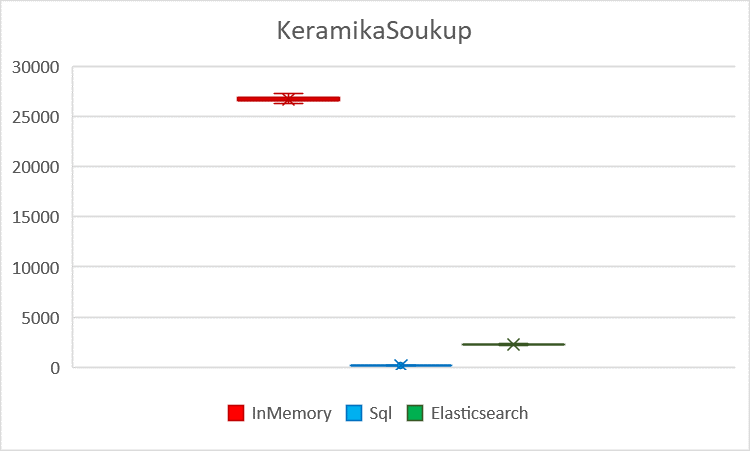
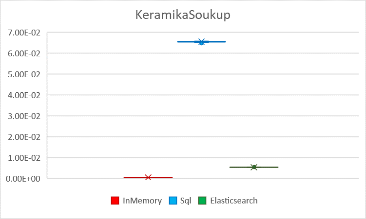
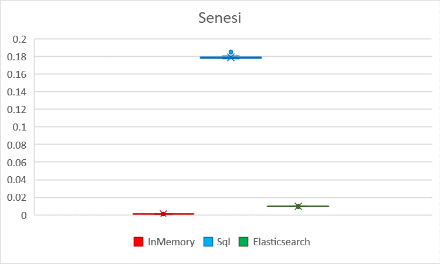
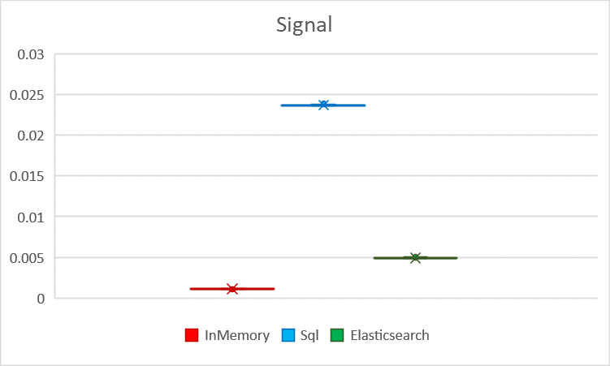
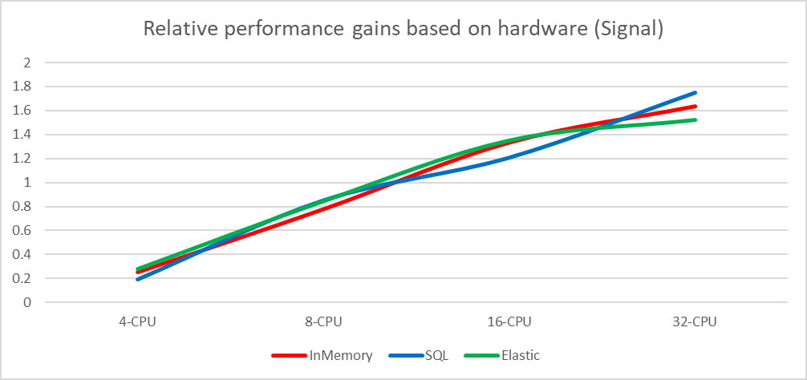

## Summary of performance tests

Several tests were performed to compare three implementations handling different datasets on different hardware. The
main performance tests focused on latency and throughput of the synthetic traffic with three different datasets on
hardware at the University of Hradec Králové. These tests simulate a database load as realistically as possible since
they combine various requests based on real recorded traffic. According to the aggregate synthetic tests, the InMemory
implementation is, on average, 62 times faster than the SQL one (with 99 times lower latency) and 8 times faster than
the Elastic one (with 7 times lower latency). The results also consistently show that even the worst single result of
the InMemory is significantly better than the best measured results of other implementations.

Besides the aggregate synthetic tests, the performance of specific tasks was measured as well. The results of these
tests reveal the strengths and weaknesses of the tested implementations. The bulk insert was revealed as the weakest
point of the InMemory implementation - both its throughput and latency are comparable with the SQL implementation and
"only" 5 times better than the Elastic one. This also means there was no particular task in which the InMemory would not
have worse performance than other implementations. The strongest disciplines for the InMemory were the computation of
hierarchy statistics (1479 times better than SQL), price filtering (752 times better than Elastic), and many others
where the InMemory scored more throughput by two orders of magnitude in comparison with other implementations.

The synthetic tests were run on varying hardware setups to evaluate the scaling of implementations on various hardware.
These tests used the cloud computing platform Digital Ocean with 4 hardware setups ranging from 4-core CPU up to 32-core
CPU. The results in absolute values confirm the clear dominance of the InMemory implementation regardless of hardware.
In the tests with a smaller set of data, relative values indicate that the SQL implementation converges toward a maximum
performance with the small advantage of using high-performance hardware, while other implementations can utilize
additional power better (almost linearly). However, for the larger sets of data, the situation was different. Therefore,
in the end, all implementations have, on average, a very similar scaling, highly dependent on the data it is supposed to
handle.

Apart from the performance tests, the implementations are evaluated on the basis of functional requirements. There were
several mandatory and a few bonus functionalities. In the end, all three implementations successfully met all these
requirements, including the bonus ones. Therefore, performance is the key factor for the final evaluation and selection
of the best implementation.

## Performance tests

### Hardware

#### Digital Ocean platform

**(General purpose)**

<Table>
    <Thead>
        <Tr>
            <Th>Title</Th>
            <Th>Full label</Th>
            <Th>Virtual CPU count</Th>
            <Th>RAM (GB)</Th>
            <Th>Disc space (GB)</Th>
        </Tr>
    </Thead>
    <Tbody>
        <Tr>
            <Td>CPU-4</Td>
            <Td>g-4vcpu-16gb</Td>
            <Td>4</Td>
            <Td>16</Td>
            <Td>50</Td>
        </Tr>
        <Tr>
            <Td>CPU-8</Td>
            <Td>g-8vcpu-32gb</Td>
            <Td>8</Td>
            <Td>32</Td>
            <Td>100</Td>
        </Tr>
        <Tr>
            <Td>CPU-16</Td>
            <Td>g-16vcpu-64gb</Td>
            <Td>16</Td>
            <Td>64</Td>
            <Td>200</Td>
        </Tr>
        <Tr>
            <Td>CPU-32</Td>
            <Td>g-32vcpu-128gb</Td>
            <Td>32</Td>
            <Td>128</Td>
            <Td>400</Td>
        </Tr>
    </Tbody>
</Table>

The tests of all implementations are done within a single run to ensure that the same machine is used. In this way, all
implementations have the same conditions.

#### The physical machine at the university

**CPU:** Intel (R) Core™ i7-87003.20 GHz (6xCORE)
**RAM:** 16 GB X4 (2666 Mhz) CL13
**OS:** Ubuntu18.04.5 LTS (GNU/Linux5.4.0-42-generic x86_64)

<Table>
    <Thead>
        <Tr>
            <Th>Title</Th>
            <Th>Virtual CPU count</Th>
            <Th>RAM (GB)</Th>
            <Th>Disc space (GB)</Th>
        </Tr>
    </Thead>
    <Tbody>
        <Tr>
            <Td>UHK-PC</Td>
            <Td>12</Td>
            <Td>64</Td>
            <Td>165*</Td>
        </Tr>
    </Tbody>
</Table>

*Available space limited to Docker (10 GB)

### Tests

When the text talks about "random" values, the uniform probability distribution is meant.

#### Test: syntheticTest

The test replays the queries recorded on real production systems. The production systems use different technology than
Evita, and therefore it was necessary to convert both the dataset and the queries to the Evita data structure. The data
set was exported on Monday and on the very same day we started to record the queries to that dataset. The queries were
recorded for several days until a sufficient amount of data was collected. In the end, we had a correlated dataset and
the queries. The queries later in time might have queried the data that had not been known on Monday but the error was
negligible. The queries were cleaned during the transformation to the Evita format from the queries that referred to the
data unknown to the dataset. There were a few million queries for each dataset.

**Artificial:** This test is not available with the artificial dataset.

**Real dataset:** The test spins an empty DB and in the setup phase it inserts all client data, including products. In
the measured iteration phase, it continuously emits a query from the collected dataset (one by one from start to end).
Should the list be exhausted, the test would start from the beginning again.

#### Test: attributeFiltering

This test measures filtering and ordering by various attributes (and their respective data types) in the dataset. Each
query is ordered by a single attribute either ascending or descending. The query requests one of the first 6 pages’
results with a page size of 20 records. Each query is filtered by a single randomized language and randomly by one of
the filterable attributes using one of the 50 randomly picked existing attribute values for it.

**Artificial:** The test spins an empty DB and in the setup phase it inserts a bunch of `brands` (5), `categories` (10),
`price lists` (4), `parameters` (200), `parameter groups` (20), and `stores` (12) that are created so that they could be
referenced in products. After that, the database is filled up with 100 thousand `products`. In the measured iteration
phase, it continuously emits randomized queries on the product collection (see the Introduction).

**Real dataset:** The test spins an empty DB and in the setup phase it inserts all client data, including products. In
the measured iteration phase, it continuously emits randomized queries on the product collection (see the Introduction).

#### Test: attributeAndHierarchyFiltering

The test is the same as the attributeFiltering test, but on top of the randomized query, it adds another hierarchy
filtering constraint. This test mimics the real-world scenario where the user accesses the products, usually through a
category tree. It randomly selects a hierarchical entity (category) to focus on and with a 20% probability adds a random
subtree exclusion order, with a 33% probability adds an option for excluding products directly related or with a 15%
probability adds an option to include only products directly related to a filtered hierarchical entity (category).

#### Test: attributeHistogramComputation

The test is the same as the attributeFiltering test, but on top of the randomized query it adds another attribute
histogram computation requirement constraint. It selects (randomly one or more) of the filterable attributes with
numeric type and issues histogram creation with a 10-30 bucket count.

#### Test: bulkInsertThroughput

The test measures the bulk write speed of the data.

Each iteration starts with an empty database.

**Artificial:** The test spins an empty DB and in the setup phase it inserts a bunch of `brands` (5), `categories` (10),
`price lists` (4), and `stores` (12) that are created so that they could be referenced in products. In the measured
iteration phase, it continuously inserts new randomized `products` into it.

**Real dataset:** The test spins an empty DB and in the setup phase it inserts all client data except products. In the
measured iteration phase, it continuously inserts existing products into it. When all products are exhausted, it starts
to insert them again but changes their primary key and unique attributes so that they do not conflict with the products
already inserted in the database.

#### Test: facetFiltering

Test measures filtering by facets. Each query contains from one up to five facets to be filtered. The query requests one
of the first 6 pages´ results with a page size of 20 records and is not ordered.

**Artificial:** The test spins an empty DB and in the setup phase it inserts a bunch of `brands` (5), `categories` (10),
`price lists` (4), `parameters` (200), `parameter groups` (20), and `stores` (12) that are created so that they could be
referenced in products. After that, the database is filled up with 100 thousand `products`. In the measured iteration
phase, it continuously emits randomized queries on the product collection (see the Introduction).

**Real dataset:** The test spins an empty DB and in the setup phase it inserts all client data including products. In
the measured iteration phase, it continuously emits randomized queries on the product collection (see the Introduction).

#### Test: facetFilteringAndSummarizingCount

The test is the same as the facetFiltering test, but on top of the randomized query, it adds a requirement constraint
that triggers the computation of the count of facets in the database. It also uses different boolean relations for facet
groups:

* with a 25% probability the facet will for some groups use a conjunction relation
* with a 25% probability the facet will for some groups use a disjunction relation
* with a 25% probability the facet will for some groups use a negated relation
* with a 25% probability the facet will use default relations

#### Test: facetAndHierarchyFiltering

The test is the same as the facetFiltering test, but on top of the randomized query, it adds another hierarchy filtering
constraint. This test mimics the real-world scenario where the user accesses the products usually through a category
tree. It randomly selects a hierarchical entity (`category`) to focus on and with a 20% probability adds a random subtree
exclusion order, with a 33% probability adds an option for excluding products directly related or with a 15% probability
adds an option to include only the product directly related to a filtered hierarchical entity (`category`).

#### Test: facetAndHierarchyFilteringAndSummarizingCount

The test is the same as the facetFilteringAndSummarizingCount test, but on top of the randomized query, it adds another
hierarchy filtering constraint. This test mimics the real-world scenario where the user accesses the products usually
through a category tree. It randomly selects a hierarchical entity (category) to focus on and with a 20% probability
adds a random subtree exclusion order, with a 33% probability adds an option for excluding products directly related or
with a 15% probability adds an option to include only product directly related to a filtered hierarchical entity (
category).

#### Test: facetAndHierarchyFilteringAndSummarizingImpact

The test is the same as facetAndHierarchyFilteringAndSummarizingCount, but it selects the IMPACT strategy for facet
summary computation. This strategy also computes the information about the "impact" for all returned facets. The impact
contains the number of entities that match the current query (with already requested facets) plus the facet the impact
is computed for (i.e., the result of such a hypothetical query).

#### Test: hierarchyStatisticsComputation

This test measures hierarchy statistics computation by computing the number of products related to a random category
tree. The query requests only the first page of 20 products and is not ordered.

**Artificial:** The test spins an empty DB and in the setup phase it inserts a bunch of `brands` (5), `categories` (10),
`price lists` (4), `parameters` (200), `parameter groups` (20), and `stores` (12) that are created so that they could be
referenced in products. After that, the database is filled up with 100 thousand `products`. In the measured iteration
phase, it continuously emits randomized queries on the product collection (see the Introduction).

**Real dataset:** The test spins an empty DB and in the setup phase it inserts all client data, including products. In
the measured iteration phase, it continuously emits randomized queries on the product collection (see the Introduction).

#### Test: parentsComputation

The test is the same as hierarchyStatisticsComputation but instead of the hierarchy statistics, it requests the
computation of parent chains for 50% of the entity hierarchical references (at least one).

#### Test: paginatedEntityRead

This test measures the reading contents of the page of entities. The query requests one of the first 6 pages´ results
with a page size of 20 records. The query always filters the entity by a set of random primary keys, selects one of the
available locales, with a 75% probability fetches all attributes, with a 75% probability fetches on average random 75%
associated data, with a 50% probability fetches the entity prices, applying a certain price filter (price list set,
currency, validity constraints) - when fetching prices with a 75% probability, only the filtered prices are fetched and
with a 25% probability all entity prices.

**Artificial:** The test spins an empty DB and in the setup phase it inserts a bunch of `brands` (5), `categories` (10),
`price lists` (4), `parameters` (200), `parameter groups` (20), and `stores` (12) that are created so that they could be
referenced in products. After that, the database is filled up with 100 thousand `products`. In the measured iteration
phase, it continuously emits randomized queries on the product collection (see the Introduction).

**Real dataset:** The test spins an empty DB and in the setup phase it inserts all client data including products. In
the measured iteration phase, it continuously emits randomized queries on the product collection (see the Introduction).

#### Test: singleEntityRead

The test is the same as paginatedEntityRead but it reads the contents of the single entity only and no paging is used at
all.

#### Test: priceFiltering

The test measures the reading contents of the page of entities. The query requests one of the first 6 pages´ results
with a page size of 20 records. The query is always filtered by one randomly selected locale, with 33%, the product is
not ordered, with 66%, it is ordered by price (in ascending or descending order equally). The products are always
filtered for one currency, always at least one, but at most 6 price lists with the biggest known price list as the
last (least prioritized). The random date and time observed in the dataset are always used, or the current date and time
are used when no validity is observed in the data. With a 40% probability, the price between the filter constraint is
added, also using the random price range derived from the observed price values in the dataset.

**Artificial:** The test spins an empty DB and in the setup phase it inserts a bunch of `brands` (5), `categories` (10),
`price lists` (4), `parameters` (200), `parameter groups` (20), and `stores` (12) that are created so that they could be
referenced in products. After that, the database is filled up with 100 thousand `products`. In the measured iteration
phase, it continuously emits randomized queries on the product collection (see the Introduction).

**Real dataset:** The test spins an empty DB and in the setup phase it inserts all client data including products. In
the measured iteration phase, it continuously emits randomized queries on the product collection (see the Introduction).

#### Test: priceAndHierarchyFiltering

The test is the same as the priceFiltering test, but on top of the randomized query, it adds another hierarchy filtering
constraint. This test mimics the real-world scenario where the user accesses the products usually through a category
tree. It randomly selects a hierarchical entity (category) to focus on and with a 20% probability adds a random subtree
exclusion order, with a 33% probability adds an option for excluding products directly related, or with a 15%
probability adds an option to include only the product directly related to a filtered hierarchical entity (category).

#### Test: priceHistogramComputation

The test is the same as the priceFiltering test, but on top of the randomized query, it adds a requirement that computes
the histogram from the prices of matching products.

#### Test: transactionalUpsertThroughput

The test measures the transactional write / overwrite speed of the data. Each iteration starts with a database that
already contains a few thousand of records and inserts new or overwrites the existing ones. The test does not execute
removals.

**Artificial:** The test spins an empty DB and in the setup phase it inserts a bunch of `brands` (5), `categories` (10),
`price lists` (4), and `stores` (12) that are created so that they could be referenced in products. The test also inserts
10 thousand `products` before the start. In the measured iteration phase, it continuously inserts new randomized products
into it or updates the existing products using a randomized modification function with 50%/50% distribution on
inserts/updates.

**Real dataset:** The test spins an empty DB and in the setup phase it inserts all client data and 10 thousand products.
In the measured iteration phase, it continuously inserts existing products into it or uses a randomized modification
function to alter the existing ones with 50%/50% distribution on inserts/updates. When all products are exhausted, it
starts to insert them again but changes their primary key and unique attributes so that they do not conflict with the
products already inserted in the database.

## Metrics

During the tests, the following metrics were measured and compared:

1. **Throughput (operations per second):** this shows how many operations, on average, the implementation is able to finish
per one second.
2. **Latency (seconds per operation):** this shows the average time difference between making a request and receiving a
response.

Secondarily, the resource usage on hardware was measured to monitor to what extent implementations use an available
computation power. Specifically, the memory consumption and CPU utilization were tracked during the scaling tests on
various hardware configurations on the DigitalOcean platform.

## Data

To test implementation in various situations, four different data sets were used, varying in size and structure of
relations.

<Table>
    <Thead>
        <Tr>
            <Th>Title</Th>
            <Th>Entity count</Th>
            <Th>Price count</Th>
            <Th>Attribute count</Th>
            <Th>Associated data count</Th>
            <Th>Reference count</Th>
        </Tr>
    </Thead>
    <Tbody>
        <Tr>
            <Td>**artificial**</Td>
            <Td>100251</Td>
            <Td>1388213</Td>
            <Td>835424</Td>
            <Td>199933</Td>
            <Td>683295</Td>
        </Tr>
        <Tr>
            <Td>**keramikaSoukup**</Td>
            <Td>13380</Td>
            <Td>10260</Td>
            <Td>268088</Td>
            <Td>43770</Td>
            <Td>56967</Td>
        </Tr>
        <Tr>
            <Td>**senesi**</Td>
            <Td>117475</Td>
            <Td>3361040</Td>
            <Td>3848705</Td>
            <Td>698095</Td>
            <Td>967553</Td>
        </Tr>
        <Tr>
            <Td>**signal**</Td>
            <Td>15723</Td>
            <Td>120358</Td>
            <Td>527280</Td>
            <Td>91821</Td>
            <Td>117270</Td>
        </Tr>
    </Tbody>
</Table>

### Artificial dataset

The dataset contains products (100.000), `brands` (5), `categories` (10), `price lists` (4), `parameters` (200), parameter
groups (20), `and stores` (12). The only hierarchical entity is the category, the hierarchy has at most 5 root nodes and
the category tree is at most 5 levels deep. The entities have at least one, at most 2 localizations. The products have
at least one currency, at most 4 currencies. Each product has at least 2 and at most 6 attributes. The products relate
to the brand, category, store, and parameter entity. The parameter entity is grouped using the parameter group entity.
The products hone at average 6 relations to those entities. Each product has 13 prices on average. The data is randomly
generated with uniform distribution.

### Keramika Soukup

This dataset with over 10 thousand products is the smallest of all used datasets. It represents a generic e-commerce
store catalog of ceramics manufacturers and bathroom equipment. You can see it live
at:[ https://www.keramikasoukup.cz/](https://www.keramikasoukup.cz/)

Each product has a single price and there is no or very small count of specialties like master/variant products or
product sets (that require special computation of selling price). It has 20 attributes and 4 relations to other entities
per entity on average.

### Senesi

This dataset is the largest one in the testing suite. It contains over 100 thousand products with over 3 million prices.
It represents the real dataset from the B2B e-commerce store focused on bathroom equipment and plumbing
supplies:[ https://www.senesi.cz/](https://www.senesi.cz/)

The entities have 32 attributes, 8 relations to other entities, and 28 prices per entity on average. The entities also
have a considerably large amount of associated data that carry information about images, technical datasheets, texts,
and other accompanying information in JSON format. The products have no variants, but the dataset includes a moderate
amount of product sets (where you can buy multiple interrelated products).

### Signál nábytek

The dataset is larger than the Keramika Soukup one, but has much more detailed data about the products and also contains
a large amount of master/variant combinations with specific selling price computation processes. It represents the real
dataset from the B2C manufacturer and reseller of furniture and home
furnishings:[ https://www.signal-nabytek.cz/](https://www.signal-nabytek.cz/)

The entities have 35 attributes, 7 relations to other entities, and 8 prices per entity on average. The dataset contains
around 1,500 master products having 8 variants on average. It means that with 8 prices per product, it needs to
calculate the master product price from 64 prices.

## Results

### Main test suite on the machine at the university

Two sets of tests were conducted on physical hardware at the university (see UHK-PC in the chapter on Hardware for more
details). The testing focused mainly on synthetic tests in set 1 with 100 measured values per test. The second set of
tests collected only 10 values per set due to the high number of different tests and limited exclusive time on the
machine. The total computing time of tests was over 90 hours.

#### Set 1 - Synthetic tests

Only syntheticTest, with the following settings:

* Warmup: 2 iterations, 10 s each
* Measurement: 100 iterations, 60 s each

The following box plots show the scores (depending on the type of benchmark) on the Y-axis while showing the average
value as the cross, the median as the line inside the box, the second and the third quartiles as the box, and outliers
as single points outside the standard range.

<Table caption="Throughput Benchmark (op&frasl;s, higher is better)">
    <Thead>
        <Tr>
            <Th>&nbsp;</Th>
            <Th colspan="3">InMemory</Th>
            <Th colspan="3">Sql</Th>
            <Th colspan="3">Elasticsearch</Th>
        </Tr>
    </Thead>
    <Tbody>
        <Tr>
            <Td>**Data**</Td>
            <Td>Ker.S.</Td>
            <Td>Senesi</Td>
            <Td>Signal</Td>
            <Td>Ker.S.</Td>
            <Td>Senesi</Td>
            <Td>Signal</Td>
            <Td>Ker.S.</Td>
            <Td>Senesi</Td>
            <Td>Signal</Td>
        </Tr>
        <Tr>
            <Td>**Average**</Td>
            <Td>26701.67</Td>
            <Td>9694.48</Td>
            <Td>10685.71</Td>
            <Td>184.50</Td>
            <Td>67.59</Td>
            <Td>506.71</Td>
            <Td>2272.22</Td>
            <Td>1251.11</Td>
            <Td>2434.87</Td>
        </Tr>
        <Tr>
            <Td>**Standard deviation**</Td>
            <Td>222.28</Td>
            <Td>1537.08</Td>
            <Td>317.92</Td>
            <Td>0.83</Td>
            <Td>0.61</Td>
            <Td>4.36</Td>
            <Td>44.30</Td>
            <Td>8.40</Td>
            <Td>18.87</Td>
        </Tr>
    </Tbody>
</Table>

<Table caption="Latency Benchmark (s/op, lower is better)">
    <Thead>
        <Tr>
            <Th>&nbsp;</Th>
            <Th colspan="3">InMemory</Th>
            <Th colspan="3">Sql</Th>
            <Th colspan="3">Elasticsearch</Th>
        </Tr>
    </Thead>
    <Tbody>
        <Tr>
            <Td>**DATA**</Td>
            <Td>Ker.S.</Td>
            <Td>Senesi</Td>
            <Td>Signal</Td>
            <Td>Ker.S.</Td>
            <Td>Senesi</Td>
            <Td>Signal</Td>
            <Td>Ker.S.</Td>
            <Td>Senesi</Td>
            <Td>Signal</Td>
        </Tr>
        <Tr>
            <Td>**Average**</Td>
            <Td>0.00045</Td>
            <Td>0.00115</Td>
            <Td>0.00111</Td>
            <Td>0.06543</Td>
            <Td>0.17903</Td>
            <Td>0.02368</Td>
            <Td>0.00528</Td>
            <Td>0.00963</Td>
            <Td>0.00492</Td>
        </Tr>
        <Tr>
            <Td>**Standard deviation**</Td>
            <Td>4.4E-06</Td>
            <Td>0.00012</Td>
            <Td>9.9E-06</Td>
            <Td>0.00022</Td>
            <Td>0.00165</Td>
            <Td>5.7E-05</Td>
            <Td>5.1E-05</Td>
            <Td>4.5E-05</Td>
            <Td>3.7E-05</Td>
        </Tr>
    </Tbody>
</Table>

#### Set 2 - All tests

The full set of tests, including the synthetic ones with the following settings:

* Warmup: 2 iterations, 10 s each
* Measurement: 10 iterations, 30 s each

##### Comparison of throughput

The numbers in the following table show how many times the InMemory implementation contains a higher throughput (
operations per second) than the ones in specific tasks.

<Table>
    <Thead>
        <Tr>
            <Th>Comparison (Average of all 4 datasets)</Th>
            <Th>InM./SQL</Th>
            <Th>InM./Elas.</Th>
        </Tr>
    </Thead>
    <Tbody>
        <Tr>
            <Td>attributeAndHierarchyFiltering</Td>
            <Td>168.54</Td>
            <Td>12.59</Td>
        </Tr>
        <Tr>
            <Td>attributeFiltering</Td>
            <Td>286.68</Td>
            <Td>17.27</Td>
        </Tr>
        <Tr>
            <Td>attributeHistogramComputation</Td>
            <Td>74.46</Td>
            <Td>385.35</Td>
        </Tr>
        <Tr>
            <Td>bulkInsertThroughput</Td>
            <Td>1.04</Td>
            <Td>5.53</Td>
        </Tr>
        <Tr>
            <Td>facetAndHierarchyFilteringAndSummarizingCount</Td>
            <Td>68.28</Td>
            <Td>9.24</Td>
        </Tr>
        <Tr>
            <Td>facetAndHierarchyFilteringAndSummarizingImpact</Td>
            <Td>40.31</Td>
            <Td>33.06</Td>
        </Tr>
        <Tr>
            <Td>facetAndHierarchyFiltering</Td>
            <Td>279.57</Td>
            <Td>25.15</Td>
        </Tr>
        <Tr>
            <Td>facetFilteringAndSummarizingCount</Td>
            <Td>879.34</Td>
            <Td>25.25</Td>
        </Tr>
        <Tr>
            <Td>facetFiltering</Td>
            <Td>558.11</Td>
            <Td>27.84</Td>
        </Tr>
        <Tr>
            <Td>hierarchyStatisticsComputation</Td>
            <Td>1479.68</Td>
            <Td>477.42</Td>
        </Tr>
        <Tr>
            <Td>paginatedEntityRead</Td>
            <Td>170.46</Td>
            <Td>19.05</Td>
        </Tr>
        <Tr>
            <Td>parentsComputation</Td>
            <Td>481.34</Td>
            <Td>30.47</Td>
        </Tr>
        <Tr>
            <Td>priceAndHierarchyFiltering</Td>
            <Td>548.71</Td>
            <Td>120.36</Td>
        </Tr>
        <Tr>
            <Td>priceFiltering</Td>
            <Td>70.29</Td>
            <Td>752.20</Td>
        </Tr>
        <Tr>
            <Td>priceHistogramComputation</Td>
            <Td>223.07</Td>
            <Td>294.61</Td>
        </Tr>
        <Tr>
            <Td>singleEntityRead</Td>
            <Td>192.50</Td>
            <Td>11.94</Td>
        </Tr>
        <Tr>
            <Td>syntheticTest</Td>
            <Td>91.94</Td>
            <Td>7.92</Td>
        </Tr>
        <Tr>
            <Td>transactionalUpsertThroughput</Td>
            <Td>12.41</Td>
            <Td>14.06</Td>
        </Tr>
    </Tbody>
</Table>

White color (value 1) means a comparable performance, green means that the InMemory is better than the compared
implementation, red is for tasks where the InMemory was worse, and finally, blue marks an exceptionally better
performance of the InMemory (at least a thousand times better).

##### Comparison of latency

The numbers in the following table show how many times lower latency (measured in seconds per operation) the InMemory
implementation has in comparison with the ones in specific tasks.

<Table>
    <Thead>
        <Tr>
            <Th>Comparison (Average of all 4 datasets)</Th>
            <Th>SQL/InM.</Th>
            <Th>Elas./InM.</Th>
        </Tr>
    </Thead>
    <Tbody>
        <Tr>
            <Td>attributeAndHierarchyFiltering</Td>
            <Td>156.92</Td>
            <Td>12.65</Td>
        </Tr>
        <Tr>
            <Td>attributeFiltering</Td>
            <Td>287.35</Td>
            <Td>17.89</Td>
        </Tr>
        <Tr>
            <Td>attributeHistogramComputation</Td>
            <Td>79.63</Td>
            <Td>458.27</Td>
        </Tr>
        <Tr>
            <Td>bulkInsertThroughput</Td>
            <Td>1.04</Td>
            <Td>5.43</Td>
        </Tr>
        <Tr>
            <Td>facetAndHierarchyFilteringAndSummarizingCount</Td>
            <Td>107.33</Td>
            <Td>9.45</Td>
        </Tr>
        <Tr>
            <Td>facetAndHierarchyFilteringAndSummarizingImpact</Td>
            <Td>62.02</Td>
            <Td>32.52</Td>
        </Tr>
        <Tr>
            <Td>facetAndHierarchyFiltering</Td>
            <Td>287.45</Td>
            <Td>25.33</Td>
        </Tr>
        <Tr>
            <Td>facetFilteringAndSummarizingCount</Td>
            <Td>1446.39</Td>
            <Td>25.87</Td>
        </Tr>
        <Tr>
            <Td>facetFiltering</Td>
            <Td>1628.45</Td>
            <Td>27.32</Td>
        </Tr>
        <Tr>
            <Td>hierarchyStatisticsComputation</Td>
            <Td>1490.07</Td>
            <Td>482.04</Td>
        </Tr>
        <Tr>
            <Td>paginatedEntityRead</Td>
            <Td>179.84</Td>
            <Td>19.25</Td>
        </Tr>
        <Tr>
            <Td>parentsComputation</Td>
            <Td>494.67</Td>
            <Td>31.20</Td>
        </Tr>
        <Tr>
            <Td>priceAndHierarchyFiltering</Td>
            <Td>535.07</Td>
            <Td>128.20</Td>
        </Tr>
        <Tr>
            <Td>priceFiltering</Td>
            <Td>70.39</Td>
            <Td>843.57</Td>
        </Tr>
        <Tr>
            <Td>priceHistogramComputation</Td>
            <Td>224.75</Td>
            <Td>458.88</Td>
        </Tr>
        <Tr>
            <Td>singleEntityRead</Td>
            <Td>196.59</Td>
            <Td>12.49</Td>
        </Tr>
        <Tr>
            <Td>syntheticTest</Td>
            <Td>91.65</Td>
            <Td>7.86</Td>
        </Tr>
        <Tr>
            <Td>transactionalUpsertThroughput</Td>
            <Td>13.40</Td>
            <Td>20.05</Td>
        </Tr>
    </Tbody>
</Table>

White color (value 1) means a comparable latency, green means the InMemory is faster than the compared implementation,
red is for tasks where the InMemory was slower, and finally, blue marks an exceptionally faster latency of the
InMemory (at least a thousand times faster).

### Scaling test

Executed on different hardware configurations on the Digital Ocean platform. This performance test ran only the
SyntheticTest 5 times per each combination of hardware and data. The following plots show the average scores (Y-axis) on
four hardware configurations (X-axis; ordered from the lowest specifications on the left side to the highest on the
right side; see the chapter on Hardware for more details).

Only the syntheticTest, with the following settings:

* Warmup: 2 iterations, 10 s each
* Measurement: 5 iterations, 60 s each

")

")

")

The following plots show the scalability in relation to the average of each implementation instead of the absolute
numbers for a better view of the scalability of lower-performing implementations.

")

It is obvious that the initial in-memory implementation runs at scaling problems with the Senesi dataset on the most
powerful configuration and there is probably a reserve for further optimizations. The in-memory implementation has one
advantage over the other implementations. Since it runs as an embedded database, it is not slowed down by
encoding/decoding and transferring the data over the virtual network adapter (all databases run locally along with the
test suite, therefore, the data does not go over the real network but only the loopback adapter is carried out as a
shared memory block for localhost transfers).

Despite this, the in-memory implementation wins over the other implementations by a large margin.

### CPU/memory utilization

The Digital Ocean machine running the performance test suite was probed and the data was exported to the Prometheus
database allowing us to visualize the basics of telemetry information in Grafana dashboards. This allows us to see
resource utilization.

Each run consists of 6 tests:

* Keramika Soukup - throughput benchmark synthetic test
* Senesi - throughput benchmark synthetic test
* Signál nábytek - throughput benchmark synthetic test
* Keramika Soukup - latency benchmark synthetic test
* Senesi - latency benchmark synthetic test
* Signál nábytek - latency benchmark synthetic test

Each test consists of:

* Warmup: 2 iterations, 10 s each
* Measurement: 5 iterations, 60 s each

This information allows us to estimate which part of the measured data is associated with each dataset.

#### Specification g-4vcpu-16gb

Due to the Kubernetes infrastructure, only 12GB of RAM could be allocated for the system under test and the test suite
together.

##### PostgreSQL

")

The first dashboard displays utilization solely of the PostgreSQL engine. As you can see, the database squeezed almost
all of the4 cores but used at most half of the available memory (9GB was allocated to the PostgreSQL engine).

")

The second dashboard displays utilization by the performance test suite, JMH engine, and the Java evitaDB engine
implementation layer. This part consumed only a little CPU capacity but used more than half of the memory used by the
database engine (3GB was dedicated to this pod).

In total, the testing suite used 3.60 + 0.18 = **3.78 of the available CPU power** on average and used 3.36 + 1.84 = 
**5.2GB of RAM**.

##### Elasticsearch

")

The first dashboard displays utilization solely of the Elasticsearch engine. As you can see, the database used only 2 of
the 4 available cores but used all the available memory (9GB was allocated to the Elasticsearch engine).

")

The second dashboard displays utilization by the performance test suite, JMH engine, and the Java evitaDB engine
implementation layer. This part consumed 70% of single CPU core capacity and used a similar amount of memory as the
PostgreSQL test (3GB was allocated to this pod).

In total, the testing suite used 2.00 + 0.67 = **3.67 of the available CPU** power on average and used 7.76 + 1.65 = 
**9.41GB of RAM**.

##### In-Memory

")

The in-memory implementation requires only a single dashboard to overview all telemetry data. Because the in-memory runs
as an embedded database, all components reside in a single pod. We can see here that the in-memory utilized all CPUs and
used most of the available memory.

In total, the testing suite used **3.68 of the available CPU power** on average and used **9.92GB of RAM**.

#### Scaling observations

When we scaled the system to `g-32vcpu-128gb`, we observed that the Elasticsearch underutilized the CPU capacity using
only 23 of 32 CPU available at the peak. The Elasticsearch consumed a little over 50GB of memory when the bar was raised
high enough (114GB). This fact suggests that the evitaDB implementation on this platform was not ideal and was not able
to vertically scale properly.

The PostgreSQL implementation on the other hand utilized all 32 CPU cores available and consumed at most 10GB of
available RAM.

The in-memory implementation utilized all 32 CPU cores and consumed 45GB of the RAM when the bar was raised high
enough (120GB). The test on the most performant hardware configuration revealed that there was a hidden problem in this
implementation preventing the throughput increase on a specific dataset even when the number of CPU cores doubled from 
16 to 32 (even though the engine utilized all 32 cores).

#### Hardware utilization conclusions

All three implementations used almost all CPU capacity with different distributions between the Java implementation and
the engine. When the system was vertically scaled the Elasticsearch implementation failed to utilize it fully, while the
in-memory implementation failed to bring a better throughput for one of the datasets on the top HW configuration.

The relational database required considerably less RAM capacity than the other two implementations. The Elasticsearch
and in-memory implementation was equally memory hungry. The Elasticsearch and in-memory implementation revealed their
sweet-spots at 64GB of available memory.

The peak size of data folder of the database was measured as follows:

<Table>
    <Thead>
        <Tr>
            <Th>Implementation</Th>
            <Th>Data folder size in GB</Th>
        </Tr>
    </Thead>
    <Tbody>
        <Tr>
            <Td>PostgreSQL</Td>
            <Td>3.28</Td>
        </Tr>
        <Tr>
            <Td>Elasticsearch</Td>
            <Td>1.55</Td>
        </Tr>
        <Tr>
            <Td>In-memory</Td>
            <Td>2.22</Td>
        </Tr>
    </Tbody>
</Table>

## Final evaluation of competing implementations

The last thing that needs to be done is to finally decide which implementation best suits our initial requirements and
which will be used as a basis for further development and testing in a production environment.

Let us repeat our evaluation priorities:

1. the prototype meets all necessary functions of the specification (100 pts.)
	* each non-passing test will discard 5 pts.
2. prototype maximizes performance for read operations (65 pts.)
	* measured as a sum of average queries per second (throughput) for all three production datasets: Senesi, Keramika Soukup, and Signal
	* maximum amount of points will be assigned to the winner in the category, other implementations receive the appropriate share
3. the prototype meets the optional features of the specification (40 pts.)
	* each non-passing test will discard 5 pts.
4. the prototype maximizes indexing speed (10 pts.)
	* measured as mutations per second (throughput) for a transactional upsert test
	* maximum amount of points will be assigned to the winner in the category, other implementations receive the appropriate share

**HW requirements:**

Along with the measured performance, the telemetry data from the system on which the tests are running is also taken
into account. We monitor:

* used RAM capacity - weighted average (20 pts.)
* used disk capacity (5 pts.)

The implementation with lower requirements receives a better rating than the others. A maximum amount of points will be
assigned to the winner in the category, other implementations receive the appropriate share.

The criteria for evaluating the best **implementation** are as follows:

1. cumulative response speed in test scenarios (weight 75%)
2. memory space consumption (weight 20%)
3. disk space consumption (weight 5%)

<Table>
    <Thead>
        <Tr>
            <Th>Criteria</Th>
            <Th>PostgreSQL</Th>
            <Th>Elasticsearch</Th>
            <Th>In-memory</Th>
        </Tr>
    </Thead>
    <Tbody>
        <Tr>
            <Td>All mandatory functional tests passing</Td>
            <Td>100</Td>
            <Td>100</Td>
            <Td>100</Td>
        </Tr>
        <Tr>
            <Td>All optional feature tests passing</Td>
            <Td>40</Td>
            <Td>40</Td>
            <Td>40</Td>
        </Tr>
        <Tr>
            <Td>Read throughput ops. / sec.</Td>
            <Td>1</Td>
            <Td>8</Td>
            <Td>65</Td>
        </Tr>
        <Tr>
            <Td>Write throughput mut. / sec.</Td>
            <Td>1</Td>
            <Td>0</Td>
            <Td>10</Td>
        </Tr>
        <Tr>
            <Td>Memory consumption</Td>
            <Td>20</Td>
            <Td>11</Td>
            <Td>10</Td>
        </Tr>
        <Tr>
            <Td>Disk space consumption</Td>
            <Td>2</Td>
            <Td>5</Td>
            <Td>3</Td>
        </Tr>
        <Tr>
            <Td>Results</Td>
            <Td>164</Td>
            <Td>164</Td>
            <Td>228</Td>
        </Tr>
    </Tbody>
</Table>

**The winning solution is the "in-memory" implementation.**
