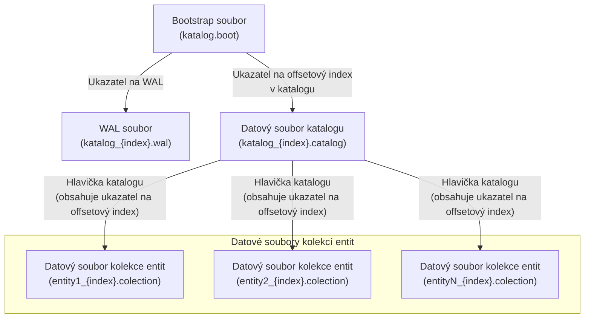

## Základní typy souborů a vazby mezi nimi

evitaDB ukládá data do souborů na disku do datového adresáře specifikovaného v konfiguraci. První úroveň datového adresáře obsahuje adresáře pro jednotlivé katalogy. Adresář katalogu obsahuje všechny soubory potřebné pro práci s katalogem (katalog nepotřebuje žádnou další informaci vně svého adresáře). Adresář vždy obsahuje:

1. **[Bootstrap soubor](#bootstrap-soubor)** - soubor odpovídající názvu katalogu a příponou `.boot` obsahující klíčové ukazatele na ostatní soubory
2. **[Write-ahead log (WAL)](#write-ahead-log-wal)** - soubor odpovídající názvu katalogu a příponou `_{index}.wal`, kde `index` je vzestupně rostoucí číslo začínající nulou; soubor obsahuje řetězec změn v katalogu v čase
3. **[Datový soubor katalogu](#datové-soubory)** - soubor odpovídající názvu katalogu a příponou `_{index}.catalog`, kde `index` je vzestupně rostoucí číslo začínající nulou; soubor obsahuje data vázaná na katalog jako je například schéma katalogu a globální indexy
4. **[Datové soubory kolekcí entit](#datové-soubory)** - soubory odpovídající názvu entity a příponou `_{index}.colection`, kde `index` je vzestupně rostoucí číslo začínající nulou; soubory obsahují všechna data vázaná k dané kolekci entit - její schéma, indexy a data entit

Mezi soubory existují vazby v podobě ukazatelů na klíčová místa v souboru. Bootstrap obsahuje ukazatel na WAL soubor a místo uložení [offset indexu](#offsetový-index) v souboru katalogu. Datový soubor katalogu obsahuje hlavičku katalogu, která následně obsahuje ukazatele na klíčová místa v jednotlivých datových souborech kolekcí entity. Mechanismus ukazatelů je znázorněn na diagramu níže:

Obsah jednotlivých typů souborů je do detailu popsán v následujících sekcích.

### Struktura záznamu v úložišti

Všechny záznamy v bootstap, WAL i všech datových souborech jsou ukládány v binárním formátu vycházejících z knihovny [Kryo](https://github.com/EsotericSoftware/kryo) a mají následující strukturu:

| Informace              | Datový typ | Délka v bajtech |
|------------------------|------------|-----------------|
| Record length in Bytes | int32      | 4B              |
| Control Byte           | int32      | 1B              |
| Generation Id          | int64      | 8B              |
| Payload                | byte[]     | *               |
| Checksum - CRC32C      | int64      | 8B              |

Níže si vysvětlíme význam jednotlivých položek:

<dl>
    <dt>Record length in Bytes</dt>
    <dd>Délka záznamu v bajtech. Tato informace je porovnávána s hodnotou *Record pointer: length* a musí být shodná, jinak došlo k poruše integrity dat.</dd>
    <dt>Control Byte</dt>
    <dd>Tento bajt obsahuje flagy obsahující klíčové informace o povaze daného záznamu. Flagy představují jednotlivé bity v tomto bajtu: 
        <ol>
            <li>poslední záznam řady záznamů</li>
            <li>průběžný záznam, payload pokračuje v bezprostředně následujícím záznamu</li>
            <li>pro záznam je dostupný vypočtený kontrolní součet</li>
            <li>záznam je komprimovaný</li>
        </ol>
    </dd>
    <dt>Generation Id</dt>
    <dd>Číslo generace, které je přiřazeno každému záznamu. Toto číslo se aktivně nepoužívá, ale je možné jej použít při případné rekonstrukci dat. Typicky je shodné s verzí [offset indexu](#offsetový-index), který na tento záznam ukazuje.</dd>
    <dt>Payload</dt>
    <dd>Skutečná data záznamu. Tato část může mít proměnlivou délku a obsahuje konkrétní informace odpovídající typu záznamu. Payload má omezenou maximální velikost danou velikostí výstupního bufferu (viz. `[outputBufferSize](/documentation/operate/configure?lang=evitaql#storage-configuration)`)</dd>
    <dt>Checksum - CRC32C</dt>
    <dd>Kontrolní součet pro ověření integrity dat v rámci záznamu. Tento údaj se používá k detekci chyb při čtení dat v payload sekci.</dd>
</dl>

#### Důvod omezení maximální velikosti záznamu

Omezení maximální velikosti záznamu je dáno faktem, že je zápis na disk je striktně přírůstkový. První informací záznamu je však jeho velikost, která není známa dříve, než je záznam jako takový kompletně vytvořen. Reálně tedy dojde k vytvoření záznamu v paměťovém bufferu, následně se na první pozici zapíše výsledná velikost záznamu a nakonec se záznam zapíše na disk.

#### Rozdělení payloadu na více záznamů

Existuje celá řada případů, kdy je množství dat v payloadu větší než je povolená maximální velikost payloadu. Při ukládání dokážeme ve většině případů rozdělit payload při serializaci na více záznamů, které se pak ukládají bezprostředně za sebou. Každý z takových záznamů je samostatně komprimován a má vlasní kontrolní součet. Vazbu mezi záznamy zajišťuje nastavení kontrolního bitu č. 2. Zároveň však platí, že vynucení načtení dalšího záznamu si musí vynutit deserializační mechanismus.

#### Náklady na kontrolní součet a kompresi

Pro výpočet kontrolního součtu se používá optimalizovaná varianta CRC32 (konkrétně [CRC32C](https://www.ietf.org/rfc/rfc3720.txt)), která je součástí JDK. Náklady na výpočet a ověřování kontrolního součtu jsou minimální, a proto doporučujeme jej mít vždy zapnutý (ve výchozí konfiguraci tomu tak je). Je možné jej však vypnout pomocí nastavení `computeCRC32C` v konfiguraci [úložiště](/documentation/operate/configure?lang=evitaql#storage-configuration). Pokud k tomu dojde, je vypočtený kontrolní součet u existujících záznamů při čtení ignorován a při zápisu se již neprovádí.

Při zapnutí komprese se zvýší paměťové nároky na výstupní buffer, protože je nutné jej alokovat 2x - jednou pro zápis nekomprimované verze a druhý pro vlastní komprimovaná data. Pokud by byl charakter dat špatně komprimovatelný, může dojít k situaci, že se po komprimaci zjistí, že komprimovaná data jsou stejně veliká nebo dokonce větší než data původní. V takovém případě se data uloží v původním formátu - nicméně náklady na pokus o jejich komprimaci zůstávají v platnosti. Při čtení se tento fakt ověřuje pomocí kontrolního bitu č. 4 - je tedy předem známo, jestli je třeba záznam před deserializací dekomprimovat či nikoliv. Při čtení kromě vlastních nákladů na CPU spojených s dekompresí další dodatečné náklady nevznikají. Ve zkratce se tedy dá říct, že náklady na kompresi jsou spojené především se zápisem dat. Komprimaci dat je možné zapnout pomocí nastavení `compress` v konfiguraci [úložiště](/documentation/operate/configure?lang=evitaql#storage-configuration). Ve výchozí konfiguraci je komprese vypnuta. Při pokusu o načtení komprimovaných dat bez zapnuté komprese v konfiguraci, dojde k chybě čtení dat.

### Bootstrap soubor

Bootstrap soubor je první soubor, který je vytvořen při inicializaci katalogu. Jako jediný soubor má pevnou velikost záznamu, kde záznamy (řádky) jsou ukládány za sebou. Záznamy v bootstrap souboru jsou striktně nekomprimované (jinak bychom nebyli schopni dodržet jejich pevnou délku), jsou zapsány pomocí [jednotného formátu](#struktura-záznamu-v-úložišti), obsahují kontrolní součet a jsou uloženy v pořadí, v jakém byly vytvořeny. Datová část záznamu obsahuje následující údaje:

| Informace                      | Datový typ | Délka v bajtech |
|--------------------------------|------------|-----------------|
| Storage protocol version       | int32      | 4B              |
| Catalog version                | int64      | 8B              |
| Catalog file index             | int32      | 4B              |
| Timestamp                      | int64      | 8B              |
| Record pointer: start position | int64      | 8B              |
| Record pointer: length         | int32      | 4B              |

Níže si vysvětlíme význam jednotlivých položek:

<dl>
    <dt>Storage protocol version</dt>
    <dd>Verze datového formátu, ve kterém jsou uložena data katalogu. Tato verze se mění pouze tehdy, pokud došlo k nějakým významným změnám v pojmenování nebo struktuře datových souborů, či v obecné struktuře záznamu v úložišti. Tato informace nám umožňuje detekovat situaci, kdy startující stroj evitaDB očekává data v novějším formátu, než v jakém jsou reálně na disku uložena. Pokud k takové situaci dojde, obsahuje evitaDB konverzní mechanismus, který převede data ze starého formátu do aktuálního. 
     V současné době je verze datového formátu `3`.
    </dd>
    <dt>Catalog version</dt>
    <dd>Verze katalogu, která se zvyšuje při dokončení zpracování každé z potvrzených (commit) transakcí, které posouvají katalog do další verze. V bootstrap souboru nemusí být pro každou transakci jeden záznam. Pokud stroj zvládne v časovém limitu zpracovat více transakcí najednou mohou být skoky mezi jednotlivými verzemi katalogu v bootstrap souboru větší než 1. 
     Pokud je katalog ve *warm-up* režimu má každý z bootstrap záznamů verzi katalogu rovnou číslu `0`.
    </dd>
    <dt>Catalog file index</dt>
    <dd>Obsahuje index datového souboru katalogu. Pomocí této informace je možné sestavit název odpovídajícího souboru obsahujícího data katalogu, který je ve formátu `nazev_katalogu_{index}.catalog`. V adresáři může být současně více datových souborů daného katalogu s různými indexy, tento fakt naznačuje dostupnost funkce pro [cestování v čase](#cestování-v-čase).
    </dd>
    <dt>Timestamp</dt>
    <dd>Časový údaj, který je nastaven na čas vytvoření bootstrap záznamu v milisekundách od `1.1.1970 00:00:00 UTC`. Tento údaj se používá pro nalezení správného bootstrap záznamu při [cestování v čase](#cestování-v-čase).</dd>
    <dt>Offset index pointer: start position</dt>
    <dd>Ukazatel na první bajt zavádějícího záznamu [offsetového indexu](#offsetový-index) v datovém souboru katalogu.</dd>
    <dt>Offset index pointer: length</dt>
    <dd>Délka zaváděcího záznamu offsetového indexu v bajtech. Tento údaj je důležitý pro správné načtení offsetového indexu z datového souboru katalogu.</dd>
</dl>

### Datové soubory

Všechny datové soubory mají proměnlivou délku záznamu a nejsou vnitřně nijak organizované. Do datového souboru se zapisují jednotlivé [datové záznamy](#datové-záznamy) v [definované struktuře](#struktura-záznamu-v-úložišti) jeden za druhým. Aby bylo možné k záznamům následně přistupovat, existuje tzv. [offsetový index](#offsetový-index), který obsahuje informace o poloze jednotlivých záznamů v datovém souboru. Tento index se ukládá průběžně přírůstkovým způsobem v předem určených okamžicích přímo za datové záznamy a na zaváděcí (poslední záznam offsetového indexu) je nutné udržovat ukazatel na nějakém externím místě - pro datové soubory kolekcí entit je takovým místem hlavička katalogu, pro datové soubory katalogu (tj. i zmíněnou hlavičku) je to bootstrap soubor.

#### Offsetový index

<SourceClass>evita_store/evita_store_key_value/src/main/java/io/evitadb/store/offsetIndex/OffsetIndex.java</SourceClass> je jednoduchá datová struktura ve [standardizovaném formátu](#struktura-záznamu-v-úložišti), jejíž payload je prostá kolekce informací:

| Informace                      | Datový typ | Délka v bajtech |
|--------------------------------|------------|-----------------|
| Primary key                    | int64      | 8B              |
| Record type                    | byte       | 1B              |
| Record pointer: start position | int64      | 8B              |
| Record pointer: length         | int32      | 4B              |

Která je vždy uvozena touto hlavičkou:

| Informace                      | Datový typ | Délka v bajtech |
|--------------------------------|------------|-----------------|
| Effective length               | int32      | 4B              |
| Record pointer: start position | int64      | 8B              |
| Record pointer: length         | int32      | 4B              |

Hodnota *Effective length* je klíčový pro odvození počtu záznamů v payloadu, protože v případě, že je záznam komprimován není velikost záznamu na disku pro výpočt použitelná. Tato hodnota velikosti se vydělí velikostí jednoho záznamu v kolekci a získá se informace o tom, kolik záznamů se má z payloadu načíst. Hodnota *Record pointer* ukazuje na předchozí fragment offsetového indexu zapsaného v datovém souboru dříve. Všechny fragmenty offsetového indexu se vždy nacházejí ve stejném souboru.

Konkrétní záznamy offsetového indexu mají následující význam:

<dl>
    <dt>Primary key</dt>
    <dd>Primární klíč záznamu. evitaDB typicky reprezentuje primární klíče ve formě `int32`, nicméně pro některé z nich jsou potřeba dva takové identifikátory. Pro tyto účely jsou dva `int32` spojeny do jednoho `int64`.</dd>
    <dt>Record type</dt>
    <dd>Typ záznamu. Slouží pro vnitřní odlišení druhu záznamu - konkrétně slouží k uložení typu <SourceClass>evita_store/evita_store_common/src/main/java/io/evitadb/store/model/StoragePart.java</SourceClass>. Jelikož číselník používá pouze pozitivní čísla začínající jedničkou, používá se negace těchto typů jako příznak pro "odstraněnou hodnotu". Princip načítání a práce s odstraněnými položkami je popsán dále.</dd>
    <dt>Record pointer: start position</dt>
    <dd>Ukazatel na první bajt předchozího fragmentu offsetového indexu v tomto datovém souboru.</dd>
    <dt>Record pointer: length</dt>
    <dd>Délka předchozího fragmentu offsetového indexu.</dd>
</dl>

Načítání informací o všech dostupných záznamech v datovém souboru probíhá následovně:

1. Načte se zaváděcí fragment offsetového indexu (typicky poslední takový záznam v souboru)
2. Načtou se informace o všech ukazatelích na záznamy v tomto fragmentu
    - pokud je typů záznamu negativní, jedná se o informaci o jeho odstranění - tato informace se zaznamená do hashovací tabulky
3. Načte se předchozí fragment offsetového indexu pomocí ukazatele na něj a zpracuje se obdobným způsobem
    - pokud je ve fragmentu informace o záznamu, který existuje v hashovací tabulce odstraněných záznamů, pak je informace o tomto záznamu při načítání ignorována
4. Tento proces se opakuje, dokud není načten první fragment offsetového indexu, který již neobsahuje žádný ukazatel na předchozí fragment

Fragment offsetového indexu se ukládá typicky na konci zpracování transakce (nebo sady navazujících transakcí, pokud tyto byly zpracovány ve vyhrazeném časovém úseku). Do fragmentu se ukládají pouze informace o nových/změněných/odstraněných záznamech v této transakci (sadě transakcí).

#### Datové záznamy

Datové záznamy obsahují konkrétní datový payload dle typu záznamu a používají se jak pro ukládání schémat, entit, tak i všech ostatních infrastrukturních datových struktur jako jsou vyhledávací indexy a mnoho dalšího. Na úrovni záznamu neexistuje informace o tom, jestli je záznam platný nebo ne - tato informace je dostupná pouze na úrovni offsetového indexu.

### Write-ahead log (WAL)

Write-ahead log je separátní datová struktura, do které se zapisují všechny transakční změny ve formě serializovaných "mutací" ve chvíli, kdy je akceptován commit transakce. Jednotlivé mutace jsou zapisovány ve [standardní struktuře](#struktura-záznamu-v-úložišti) za sebou tak, jak byly v dané transakci provedeny. Jednotlivé transakce jsou mezi sebou odděleny tzv. hlavičkou, která obsahuje celkovou délku transakce v bajtech (`int32`). Zároveň je na začátek každé transakce zapsána úvodní <SourceClass>evita_api/src/main/java/io/evitadb/api/requestResponse/transaction/TransactionMutation.java</SourceClass>, která obsahuje základní informace o provedené transakci pro lepší orientaci. Za ní následuje seznam jednotlivých mutací, které byly v rámci transakce provedeny. Hlavička s celkovou délkou transakce umožňuje rychlou navigaci mezi transakcemi v rámci WAL souboru, aniž by bylo nutné deserializovat jednotlivé mutace v něm.

Write-ahead log má omezenou maximální velikost danou nastavením `[walFileSizeBytes](https://evitadb.io/documentation/operate/configure#transaction-configuration)` a po jejím dosažení dochází k uzavření souboru a vytvoření nového s dalším číslem indexu v jeho názvu. Maximální počet WAL souborů je dán nastavením `[walFileCountKept](https://evitadb.io/documentation/operate/configure#transaction-configuration)`. Po dosažení maximálního počtu WAL souborů se nejstarší soubor odstraní. Tento mechanismus zajišťuje, že WAL soubory nebudou nikdy příliš velké a zároveň se nebudou hromadit na disku.

Na konci každého WAL souboru je zapsána dvojice `int32` čísel, které představují první a poslední verzi katalogu, která byla v rámci tohoto WAL souboru zapsána. Tato informace nám umožňuje rychlou navigaci mezi WAL soubory pokud se snažíme najít konkrétní transakci, která provádí změny v katalogu odpovídající konkrétní požadované verzi.

Pokud se na konci WAL souboru nalezne nedopsaný záznam - tj. jeho velikost neodpovídá velikosti v hlavičce transakce nebo transakční mutaci, je WAL soubor při startu databáze zkrácen na poslední validní WAL záznam.

## Mechanika dat

Zápis dat v evitaDB je striktně přírustkový, tj. jednou zapsaná data se nikdy nemění. Tento fakt má své pozitivní, ale i negativní stránky.

Mezi ty pozitivní patří fakt, že není nutné řešit zamykání souboru při souběžném čtení a zápisu, není třeba spravovat informace o volném místu a optimalizovat uložení dat z pohledu fragmentace souboru. Záznamy samy o sobě mohou mít variabilní délku, což nám dává volnost z pohledu uložených dat - např. si můžeme dovolit tato data komprimovat. Fakt, že v souboru existují i starší (přepsané) verze logických záznamů, nám dává možnost implementovat [cestování v čase](#cestování-v-čase) a point-in-time [zálohování a obnovu](#zálohování-a-obnova).

Mezi ty negativní zase postupné hromadění "neaktuálních" dat v souboru, které je třeba pravidelně uklízet. Tento úklid je zajišťován pomocí [úklidu nepořádku](#uklízení-nepořádku) a spočívá v kopírování aktuálních dat do nového souboru (i v tomto případě je zachováván striktně přírůstkový přístup k datům). Dále potřebujeme udržovat tzv. [offsetový index](#offsetový-index), který obsahuje informace o poloze jednotlivých záznamů v datovém souboru, protože díky jejich variabilní délce není možné jednoduše určit, kde se konkrétní záznam nachází.

Pro komprimaci dat v payload sekci se používá standardní deflate algoritmus, který je součástí JDK. Limitace velikosti payloadu daná velikostí výstupního bufferu zůstává v platnosti - komprese probíhá až ve chvíli, kdy je buffer zaplněn nebo dříve, pokud je payload plně zapsán. Pokud dojde k situaci, že je komprimovaná verze payloadu větší než ta nekomprimovaná (což se může v některých extrémních případech stát), pak se do záznamu zapíše nekomprimovaná verze.

### Uklízení nepořádku

Uklízení nepořádku je proces, který se stará o to, aby se v datových souborech nevyskytovalo nadměrné množství "neaktuální" záznamů, které zpomalují start databáze (zabírají místo v [offset indexu](#offsetový-index) a je nutné je procházet a následně ignorovat), taktéž zabírají místo ve file cache operačního systému, takže snižují pravděpodobnost toho, že v cache budou dostupná data, které je potřeba skutečně číst. Proto obsahuje evitaDB automatický proces zvaný *compaction*, který tato data pravidelně čistí, pokud je překročen [nakonfigurovaný](/documentation/operate/configure#storage-configuration) limit `minimalActiveRecordShare` a zároveň velikost souboru překročila limit `fileSizeCompactionThresholdBytes`.

Tento proces probíhá v rámci zpracování transakce, pokud se zjistí, že po jejím ukončení jsou výše uvedené podmínky splněny. To na jednu stranu zabraňuje tomu, že by díky tlaku na systém došlo k odložení úlohy a mezitím došlo k nadměrnému znečištění a zvětšení souboru na disku. Na druhou stranu to však znamená, že dokončení dané transakce může trvat déle než je tomu obvyklé, protože bude zahrnovat i čas potřebný na kompakci souboru.

Kompakce jako taková je poměrně rychlý proces. Dojde k založení nového datového souboru s indexem o jedna vyšším, do kterého se vykopírují všechny aktuální záznamy, jejichž ukazatele eviduje současná verze [offset indexu](#offsetový-index) v paměti a nakonec se zapíše v jednom souvislém fragmentu i stav tohoto indexu. Následně se přepíší informace a ukazatele na nový soubor v odpovídající hlavičce, která je uložená v jiném (nadřízeném) datovém souboru - buď v datovém souboru katalogu, nebo bootstrap souboru. Kopírování dat probíhá na blokové úrovni, obsahy záznamů není nutné deserializovat a znovu serializovat, což výrazně urychluje celý proces. Při kompakci se zaroveň provádí ověření kontrolního součtu, pokud je v konfiguraci tato funkce zapnuta.

Původní datový soubor se buď maže, nebo v případě zapnuté funkce [cestování v čase](#cestování-v-čase) na disku i nadále zůstává i když není aktivně používán.

### Cestování v čase

Díky přírůstkovému charakteru dat, je možné zpětně přistupovat i k datům, které mají v aktuální datové sadě odlišný obsah nebo už vůbec neexistují. Samozřejmě pouze do té doby, dokud máme přístup k původnímu datovému souboru, který obsahoval danou verzi dat. Celý princip cestování v čase spočívá v nalezení odpovídajícího záznamu v bootstrap souboru, načtení odpovídajícího offsetového indexu z patřičného datového souboru (ať už toho, který je ještě stále aktivně používán nebo toho, který zbyl na disku po [kompakci dat](#uklízení-nepořádku)), nalezení odpovídajícího záznamu v offsetovém indexu a nakonec načtení datového záznamu z datového souboru.

Tento proces není nijak extra optimalizován na rychlost přístupu k historickým datům - spíš pouze využíváme výhod přírůstkové práce s daty a považujeme ho za dobrého pomocníka pro dohledatelnost historie daného záznamu nebo sady záznamů (tato funkce nečiní evitaDB vhodným adeptem na temporální databáze, které se na tuto problematiku specializují). Zároveň nám umožňuje provést i zpětně zálohu databáze v konkrétním historickém okamžiku.

### Zálohování a obnova

Práce se soubory umožňuje i naivní způsob zálohování - pokud se zkopírují soubory v pořadí:

1. bootstrap soubor
2. datové soubory katalogu
3. datové soubory kolekcí entit
4. WAL soubory

Tak je možné provést zálohu dat v aktuálním stavu i za běhu databáze prostým vykopírováním dat na disku. Konzistence je zachována díky tomu, že pokud se vykopíruje soubor se zaváděcím záznamem jako první, musí nutně obsahovat správný ukazatel na kompletně zapsaná data v odkazovaném souboru na patřičném místě. Databáze totiž zaváděcí záznamy zapisuje až jako poslední - tj. až když jsou všechna data, na která zaváděcí záznam ukazuje úplně zapsána. Pokud jsou v souboru nějaká další data navíc, na která nic neukazuje, databázi to při startu nad takto odkopírovanými daty nevadí. Zároveň pokud WAL soubory vykopírujeme jako poslední, máme zachycen maximální počet změn, které byly provedeny v nedávné době a databáze si je po obnovení pokusí opěvně přehrát. Poslední nedopsaná transakce ve WAL souboru je automaticky odstraněna, takže ani částečně rozepsaná transakce by opětovnému startu nad těmito datovými soubory neměla bránit.

V případě zálohování existují dva způsoby zálohy:

1. úplná záloha - tj. záloha všech datových souborů a WAL souborů včetně historických
2. ativní záloha - tj. záloha pouze aktuálních datových souborů a WAL souborů, které jsou aktuálně používány

Úplná záloha provádí stejný postup, jak byl popsán v úvodu této kapitoly jako naivní způsob zálohování, nicméně může být poměrně datově náročná, protože množství historických dat může být značné. Na druhou stranu je možné ji provádět i za běhu databáze, protože se jedná o čistě souborovou operaci.

Aktivní záloha je proces, který se podobá [kompakci dat](#uklízení-nepořádku), kdy je pro každý datový soubor vytvořen nejprve soubor obsahující pouze záznamy z aktivní sady záznamů v dané (aktuální) verzi [offset indexu](#offsetový-index). Nejprve pro kolekce entit, pak pro datový soubor a nakonec se vytvoří i nový bootstrap soubor, který bude obsahovat pouze jediný historický záznam. Zálohování nezastavuje zpracování transakcí - systém běží normálně dál i když zálohovací proces pracuje. Tím, že jsou datové struktury immutabilní bude záloha probíhat na daty aktuálně platnými v okamžik, kdy zálohování začalo a dodatečné změny nad těmito daty nebude brát v potaz. Na konci zálohování se však k záloze vykopíruje i obsah WAL souborů a to právě od okamžiku, kdy zálohování začalo až do současného okamžiku. Po obnovení databáze z této zálohy tedy dojde k automatickému "přehrání" změn z tohoto WAL souboru a tím pádem bude obsah aktuální zálohy skutečně aktuální bez ohledu na dobu, po jakou zálohovací proces trval.
