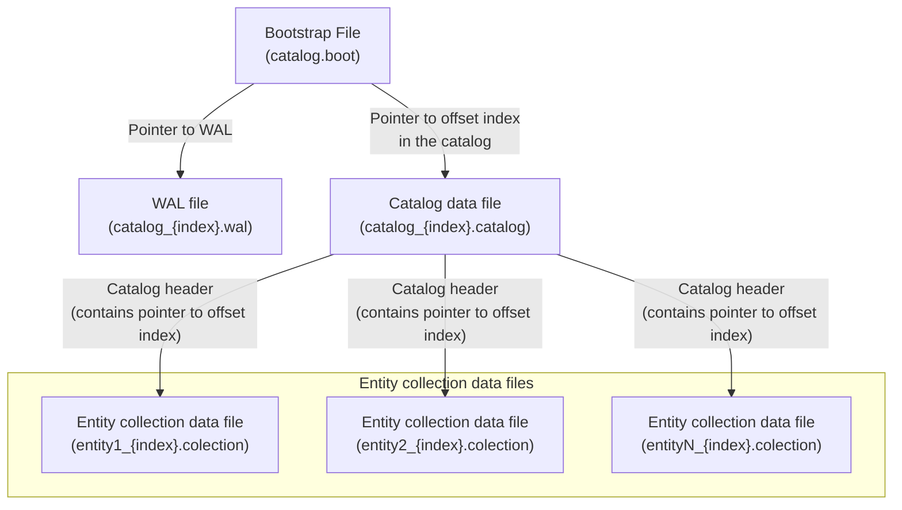

## Základní typy souborů a jejich vztahy

evitaDB ukládá data do souborů na disku ve složce s daty, která je určena v konfiguraci. Na nejvyšší úrovni této složky se nacházejí podsložky pro jednotlivé katalogy. Každá složka katalogu obsahuje všechny soubory potřebné pro práci s daným katalogem (není třeba žádných externích informací mimo tuto složku). Složka vždy obsahuje:

1. **[Bootstrap soubor](#bootstrap-soubor)** – soubor odpovídající názvu katalogu s příponou `.boot`, který obsahuje klíčové ukazatele na ostatní soubory
2. **[Write-ahead log (WAL)](#write-ahead-log-wal)** – soubor odpovídající názvu katalogu s příponou `{catalogName}_{index}.wal`, kde `index` je vzestupné číslo začínající od nuly; soubor obsahuje sekvenci změn katalogu v čase
3. **[Datový soubor katalogu](#datové-soubory)** – soubor odpovídající názvu katalogu s příponou `{catalogName}_{index}.catalog`, kde `index` je vzestupné číslo začínající od nuly; soubor obsahuje data spojená s katalogem, jako je schéma katalogu a globální indexy
4. **[Datové soubory kolekcí entit](#datové-soubory)** – soubory odpovídající názvu entity s příponou `{entityTypeName}_{index}.colection`, kde `index` je vzestupné číslo začínající od nuly; tyto soubory obsahují všechna data spojená s danou kolekcí entit—její schéma, indexy a data entit

Soubory obsahují vzájemné odkazy ve formě ukazatelů na klíčové pozice v rámci souboru. Bootstrap soubor obsahuje ukazatel na WAL soubor i na umístění [offset indexu](#offset-index) v katalogovém souboru. Datový soubor katalogu obsahuje hlavičku katalogu, která pak obsahuje ukazatele na klíčové pozice v jednotlivých datových souborech kolekcí entit. Mechanismus ukazatelů je znázorněn na diagramu níže:

```mermaid
flowchart TD
A["Bootstrap File\n(catalog.boot)"] -->|"Pointer to WAL"| B["WAL file\n(catalog_{index}.wal)"]
A -->|"Pointer to offset index\nin the catalog"| C["Catalog data file\n(catalog_{index}.catalog)"]

    subgraph S["Entity collection data files"]
        D1["Entity collection data file\n(entity1_{index}.colection)"]
        D2["Entity collection data file\n(entity2_{index}.colection)"]
        Dn["Entity collection data file\n(entityN_{index}.colection)"]
    end

    C -->|"Catalog header\n(contains pointer to offset index)"| D1
    C -->|"Catalog header\n(contains pointer to offset index)"| D2
    C -->|"Catalog header\n(contains pointer to offset index)"| Dn
```

Obsah jednotlivých typů souborů je podrobněji popsán v následujících sekcích.

### Struktura záznamu v úložišti

Všechny záznamy v bootstrap souboru, WAL a všech datových souborech jsou uloženy v binárním formátu založeném na knihovně [Kryo](https://github.com/EsotericSoftware/kryo) a mají následující strukturu:

| Informace                  | Datový typ | Délka v bajtech |
|----------------------------|------------|-----------------|
| Délka záznamu v bajtech    | int32      | 4B              |
| Řídicí bajt                | int32      | 1B              |
| ID generace                | int64      | 8B              |
| Payload                    | byte[]     | *               |
| Kontrolní součet – CRC32C  | int64      | 8B              |

Níže je vysvětlení jednotlivých položek:

<dl>
    <dt>Délka záznamu v bajtech</dt>
    <dd>Délka záznamu v bajtech. Tato hodnota se porovnává s hodnotou *Record pointer: length* a musí se shodovat; jinak byla narušena integrita dat.</dd>
    <dt>Řídicí bajt</dt>
    <dd>Tento bajt obsahuje příznaky s klíčovými informacemi o povaze záznamu. Příznaky představují jednotlivé bity v tomto bajtu: <Table><Thead><Tr><Th>Číslo bajtu</Th><Th>Význam</Th></Tr></Thead><Tbody><Tr><Td>#1</Td><Td>poslední záznam v sérii záznamů</Td></Tr><Tr><Td>#2</Td><Td>pokračující záznam, jehož payload pokračuje v bezprostředně následujícím záznamu</Td></Tr><Tr><Td>#3</Td><Td>pro záznam je k dispozici vypočtený kontrolní součet</Td></Tr><Tr><Td>#4</Td><Td>záznam je komprimovaný</Td></Tr></Tbody></Table></dd>
    <dt>ID generace</dt>
    <dd>Číslo generace přiřazené každému záznamu. Toto číslo se aktivně nepoužívá, ale může být využito pro případnou rekonstrukci dat. Typicky odpovídá verzi <a href="#offset-index">offset indexu</a>, který na tento záznam ukazuje.</dd>
    <dt>Payload</dt>
    <dd>Vlastní data záznamu. Tato část může mít proměnnou délku a obsahuje konkrétní informace odpovídající typu záznamu. Payload má maximální velikost omezenou velikostí výstupního bufferu (viz <a href="/documentation/operate/configure?lang=evitaql#storage-configuration" target="_blank">outputBufferSize</a>).</dd>
    <dt>Kontrolní součet - CRC32C</dt>
    <dd>Kontrolní součet používaný k ověření integrity dat v rámci záznamu. Slouží k detekci chyb při čtení dat v sekci payload.</dd>
</dl>

#### Důvod omezení maximální velikosti záznamu

Maximální velikost záznamu je omezena tím, že data jsou na disk zapisována striktně pouze přidáváním (append-only). První informace v záznamu je jeho velikost, která není známa, dokud není záznam kompletně vytvořen. Prakticky to znamená, že záznam je sestaven v paměťovém bufferu, výsledná velikost je pak zapsána na první pozici záznamu a teprve poté je záznam zapsán na disk.

#### Rozdělení payloadu do více záznamů

Existuje řada scénářů, kdy množství dat v payloadu překročí maximální povolenou velikost payloadu. Při ukládání lze payload často rozdělit do více záznamů již při serializaci, přičemž jsou umístěny za sebou. Každý z těchto záznamů je komprimován samostatně a má svůj vlastní kontrolní součet. Propojení mezi záznamy je zajištěno nastavením řídicího bitu č. 2. Je však zásadní, aby mechanismus deserializace rozpoznal potřebu načíst následující záznam.

#### Náklady na kontrolní součty a kompresi

Pro výpočet kontrolních součtů je použita optimalizovaná varianta CRC32 (konkrétně <a href="https://www.ietf.org/rfc/rfc3720.txt" target="_blank">CRC32C</a>) zahrnutá v JDK. Režie výpočtu a ověřování kontrolních součtů je minimální, proto doporučujeme je vždy ponechat zapnuté (což je výchozí nastavení). Přesto je lze vypnout pomocí nastavení `computeCRC32C` v <a href="/documentation/operate/configure?lang=evitaql#storage-configuration" target="_blank">konfiguraci úložiště</a>. Pokud jsou vypnuté, existující kontrolní součty ve záznamech jsou při čtení ignorovány a nové kontrolní součty se při zápisu nepočítají.

Zapnutí komprese zvyšuje paměťové nároky na výstupní buffer, protože musí být alokován dvakrát—jednou pro zápis nekomprimovaných dat a podruhé pro komprimovanou verzi. Pokud jsou data špatně komprimovatelná, může se stát, že komprimovaná data budou stejně velká nebo dokonce větší než původní. V takovém případě se uloží původní nekomprimovaná data, i když režie pokusu o kompresi zůstává. Při čtení se toto určuje kontrolou řídicího bitu č. 4—je tedy předem jasné, zda je třeba záznam před deserializací dekomprimovat. Kromě nákladů na CPU při dekompresi nevzniká při čtení žádná další režie. Stručně řečeno, většina nákladů spojených s kompresí vzniká při zápisu dat. Kompresi dat lze zapnout pomocí nastavení `compress` v <a href="/documentation/operate/configure?lang=evitaql#storage-configuration" target="_blank">konfiguraci úložiště</a>. Ve výchozím nastavení je komprese vypnutá. Pokud se pokusíte číst komprimovaná data, zatímco je komprese vypnutá, dojde k chybě čtení.

### Bootstrap soubor

Bootstrap soubor je první soubor vytvořený při inicializaci katalogu. Je to jediný soubor s pevnou velikostí záznamu, kde jsou jeho záznamy (řádky) uloženy za sebou. Tyto záznamy jsou vždy nekomprimované (jinak by nebylo možné udržet pevnou velikost), jsou zapsány pomocí <a href="#record-structure-in-the-storage">sjednoceného formátu</a>, obsahují kontrolní součet a jsou uloženy v pořadí, v jakém byly vytvořeny. Datová část každého záznamu obsahuje následující:

| Informace                        | Datový typ | Délka v bajtech |
|----------------------------------|------------|-----------------|
| Verze protokolu úložiště         | int32      | 4B              |
| Verze katalogu                   | int64      | 8B              |
| Index katalogového souboru       | int32      | 4B              |
| Časové razítko                   | int64      | 8B              |
| Ukazatel na záznam: počáteční pozice | int64  | 8B              |
| Ukazatel na záznam: délka        | int32      | 4B              |

Níže je vysvětlení jednotlivých položek:

<dl>
    <dt>Verze protokolu úložiště</dt>
    <dd>Verze datového formátu, ve kterém jsou data katalogu uložena. Tato verze se mění pouze v případě významných úprav v pojmenování nebo struktuře datových souborů, nebo změn obecné struktury záznamů v úložišti. Tato informace umožňuje detekovat, když běžící instance evitaDB očekává data v novějším formátu, než jaký je skutečně na disku. Pokud taková situace nastane, evitaDB obsahuje mechanismus pro migraci dat ze starého formátu do aktuálního. Aktuálně je verze datového formátu `3`.</dd>
    <dt>Verze katalogu</dt>
    <dd>Verze katalogu se zvyšuje po dokončení každé potvrzené transakce, která posune katalog na další verzi. Nemusí nutně existovat jeden bootstrap záznam na transakci. Pokud systém zvládne zpracovat více transakcí v určitém časovém rámci, může být skok mezi po sobě jdoucími verzemi katalogu v bootstrap souboru větší než 1. Pokud je katalog v režimu *warm-up*, může mít každý bootstrap záznam verzi katalogu nastavenou na `0`.</dd>
    <dt>Index katalogového souboru</dt>
    <dd>Obsahuje index datového souboru katalogu. Pomocí této informace lze sestavit název souboru odpovídající datovému souboru katalogu ve formátu *catalogName_&lbrace;index&rbrace;.catalog*. Ve složce může koexistovat více datových souborů pro stejný katalog s různými indexy, což značí dostupnost funkce <a href="#time-travel">time travel</a>.</dd>
    <dt>Časové razítko</dt>
    <dd>Časové razítko nastavené na čas vytvoření bootstrap záznamu, měřené v milisekundách od `1970-01-01 00:00:00 UTC`. Slouží k nalezení správného bootstrap záznamu při provádění <a href="#time-travel">time travel</a>.</dd>
    <dt>Ukazatel na offset index: počáteční pozice</dt>
    <dd>Ukazatel na první bajt zahajovacího záznamu <a href="#offset-index">offset indexu</a> v datovém souboru katalogu.</dd>
    <dt>Ukazatel na offset index: délka</dt>
    <dd>Délka v bajtech zahajovacího záznamu offset indexu v datovém souboru katalogu. To je zásadní pro správné načtení offset indexu z datového souboru katalogu.</dd>
</dl>

### Datové soubory

Všechny datové soubory mají záznamy proměnné délky a postrádají jakoukoli vnitřní organizaci. Data jsou zapisována sekvenčně jako jednotlivé <a href="#data-records">datové záznamy</a> ve <a href="#record-structure-in-the-storage">definované struktuře</a>. Pro pozdější přístup k těmto záznamům se udržuje tzv. <a href="#offset-index">offset index</a>, který obsahuje informace o pozici každého záznamu v datovém souboru. Tento index je zapisován inkrementálně v předem určených časech, přičemž je připojen za samotné datové záznamy. Ukazatel na zahajovací (poslední) záznam offset indexu musí být uložen na nějakém externím místě—pro datové soubory kolekcí entit je tímto místem hlavička katalogu; pro datový soubor katalogu (včetně zmíněné hlavičky) je to bootstrap soubor.

#### Offset index

<SourceClass>evita_store/evita_store_key_value/src/main/java/io/evitadb/store/offsetIndex/OffsetIndex.java</SourceClass> je jednoduchá datová struktura ve <a href="#record-structure-in-the-storage">standardizovaném formátu</a>, jejíž payload je prostá kolekce:

| Informace                        | Datový typ | Délka v bajtech |
|----------------------------------|------------|-----------------|
| Primární klíč                    | int64      | 8B              |
| Typ záznamu                      | byte       | 1B              |
| Ukazatel na záznam: počáteční pozice | int64  | 8B              |
| Ukazatel na záznam: délka        | int32      | 4B              |

Vždy předchází tato hlavička:

| Informace                        | Datový typ | Délka v bajtech |
|----------------------------------|------------|-----------------|
| Efektivní délka                  | int32      | 4B              |
| Ukazatel na záznam: počáteční pozice | int64  | 8B              |
| Ukazatel na záznam: délka        | int32      | 4B              |

Hodnota *Efektivní délka* je klíčová pro určení počtu záznamů v payloadu, protože pokud je záznam komprimovaný, velikost záznamu na disku nelze pro tento výpočet použít. Tato velikost se dělí velikostí jednoho záznamu v kolekci, aby bylo možné určit počet záznamů k načtení z payloadu. *Ukazatel na záznam* označuje pozici předchozího fragmentu offset indexu zapsaného v datovém souboru. Všechny fragmenty offset indexu jsou vždy umístěny ve stejném souboru.

Konkrétní položky offset indexu mají následující význam:

<dl>
    <dt>Primární klíč</dt>
    <dd>Primární klíč záznamu. evitaDB obvykle reprezentuje primární klíče jako `int32`, ale pro některé klíče jsou potřeba dvě taková identifikátory. V těchto případech jsou dvě hodnoty `int32` sloučeny do jednoho `int64`.</dd>
    <dt>Typ záznamu</dt>
    <dd>Typ záznamu. Používá se interně k rozlišení typu záznamu—konkrétně ukládá typ <SourceClass>evita_store/evita_store_common/src/main/java/io/evitadb/store/model/StoragePart.java</SourceClass>. Protože číselné mapování používá pouze kladná čísla začínající od 1, záporné hodnoty těchto typů označují „odstraněnou hodnotu“. Princip načítání a zpracování odstraněných položek je vysvětlen později.</dd>
    <dt>Ukazatel na záznam: počáteční pozice</dt>
    <dd>Ukazatel na první bajt předchozího fragmentu offset indexu v aktuálním datovém souboru.</dd>
    <dt>Ukazatel na záznam: délka</dt>
    <dd>Délka předchozího fragmentu offset indexu.</dd>
</dl>

Načtení všech dostupných informací o záznamech v datovém souboru probíhá následovně:

1. Načte se zahajovací fragment offset indexu (typicky ten nejnovější v souboru).
2. Přečtou se všechny ukazatele na záznamy v tomto fragmentu:
    - pokud je typ záznamu záporný, znamená to odstraněný záznam—tato informace se zaznamená do hash tabulky odstraněných záznamů.
3. Načte se předchozí fragment offset indexu pomocí jeho ukazatele a zpracuje se obdobně:
    - pokud položka fragmentu odkazuje na záznam, který se nachází v hash tabulce odstraněných záznamů, informace o tomto záznamu se při načítání ignoruje.
4. Tento postup se opakuje, dokud se nedojde k úplně prvnímu fragmentu offset indexu, který již neobsahuje ukazatel na předchozí fragment.

Fragmenty offset indexu se obvykle zapisují na konci zpracování transakce (nebo sady po sobě jdoucích transakcí, pokud jsou zpracovány v rámci vyhrazeného časového okna). Ve fragmentu jsou uloženy pouze nové/upravené/odstraněné záznamy z této sady transakcí.

#### Datové záznamy

Datové záznamy obsahují skutečný datový payload pro každý typ záznamu a slouží k ukládání schémat, entit a všech ostatních infrastrukturních datových struktur, jako jsou vyhledávací indexy atd. Samotný záznam neudává, zda je platný či nikoli—tato informace je dostupná pouze na úrovni offset indexu.

### Write-Ahead Log (WAL)

Write-ahead log je samostatná datová struktura, do které jsou při potvrzení transakce zapsány všechny transakční změny ve formě serializovaných „mutací“. Jednotlivé mutace jsou zapsány pomocí <a href="#record-structure-in-the-storage">standardní struktury</a>, jedna za druhou, v pořadí, v jakém byly v transakci provedeny. Transakce jsou odděleny hlavičkou, která obsahuje celkovou délku transakce v bajtech (`int32`). Na začátku každé transakce je také zapsán záznam <SourceClass>evita_api/src/main/java/io/evitadb/api/requestResponse/transaction/TransactionMutation.java</SourceClass>, který obsahuje základní informace o samotné transakci pro snadnější orientaci. Poté následuje seznam jednotlivých mutací. Hlavička s délkou transakce umožňuje rychlou navigaci mezi transakcemi v WAL souboru bez nutnosti deserializovat každou mutaci.

Za každou transakcí v WAL následuje kumulativní kontrolní součet CRC32C (8 bajtů jako `int64`). Tento kontrolní součet je vypočítán přes všechny bajty zapsané do WAL souboru od začátku až po (ale ne včetně) samotného kontrolního součtu. Zahrnuje hlavičky s délkou transakcí, záznamy TransactionMutation i všechny payloady mutací. Kumulativní povaha tohoto kontrolního součtu znamená, že jakékoli poškození v jakékoli části WAL souboru bude detekováno při čtení následujících transakcí. Pokud je při čtení WAL detekována nesrovnalost kontrolního součtu, databáze WAL zkrátí na místo poškození a obnoví pouze platné předchozí transakce.

Write-ahead log má maximální velikost souboru nastavenou pomocí parametru <a href="https://evitadb.io/documentation/operate/configure#transaction-configuration" target="_blank">walFileSizeBytes</a>. Jakmile je tento limit dosažen, soubor se uzavře a vytvoří se nový s dalším indexovým číslem v názvu. Maximální počet WAL souborů je určen parametrem <a href="https://evitadb.io/documentation/operate/configure#transaction-configuration" target="_blank">walFileCountKept</a>. Po dosažení tohoto maxima je nejstarší soubor odstraněn. Tento mechanismus zajišťuje, že WAL soubory nikdy nepřerostou do nadměrné velikosti a nehromadí se neomezeně na disku.

Každý WAL soubor začíná a končí kumulativním kontrolním součtem CRC32C. Počáteční kumulativní kontrolní součet odkazuje na koncový kumulativní kontrolní součet předchozího WAL souboru (nebo nulu, pokud jde o první soubor). To umožňuje průběžné ověřování celé sekvence WAL napříč více soubory.

Na konci každého WAL souboru kromě aktuálního, do kterého se stále zapisuje, je dvojice hodnot `int64` představujících první a poslední verzi katalogu zaznamenanou v tomto WAL souboru, následovaná třetí hodnotou `int64` obsahující finální kumulativní kontrolní součet CRC32C celého obsahu WAL souboru. To umožňuje rychlou navigaci mezi WAL soubory, pokud je potřeba najít konkrétní transakci, která provedla změny v katalogu odpovídající určité verzi, a také ověření, že obsah souboru je neporušený.

#### Formát WAL transakce

Celkově má WAL soubor následující strukturu:

| Informace                   | Datový typ | Délka v bajtech |
|-----------------------------|------------|-----------------|
| Počáteční kumulativní CRC32C| int64      | 8B              |
| Transakce 1                 | proměnná   | proměnná        |
| Transakce 2                 | proměnná   | proměnná        |
| ...                         | ...        | ...             |
| Transakce N                 | proměnná   | proměnná        |
| První verze katalogu        | int64      | 8B              |
| Poslední verze katalogu     | int64      | 8B              |
| Konečný kumulativní CRC32C  | int64      | 8B              |

Každá transakce v WAL souboru má následující strukturu:

| Informace            | Datový typ | Délka v bajtech |
|----------------------|------------|-----------------|
| Délka transakce      | int32      | 4B              |
| TransactionMutation  | záznam     | proměnná        |
| Payloady mutací      | záznam[]   | proměnná        |
| Kumulativní CRC32C   | int64      | 8B              |

Kumulativní CRC32C je počítán inkrementálně při zápisu bajtů do WAL souboru. Při čtení transakcí je tento kontrolní součet ověřován pro zajištění integrity dat. Pokud ověření selže, je vyhozena výjimka `WriteAheadLogCorruptedException` (pro katalogový WAL) nebo `EngineMutationLogCorruptedException` (pro engine WAL) a WAL je zkrácen na poslední platnou transakci.

Pokud se na konci WAL souboru nachází částečně zapsaný záznam nebo transakce (tj. její velikost neodpovídá velikosti uvedené v hlavičce transakce nebo v transaction mutation), je WAL soubor při startu databáze zkrácen na poslední platný WAL záznam.

## Mechanika dat

Zápisy dat v evitaDB jsou striktně append-only, což znamená, že jednou zapsaná data nejsou nikdy přepsána. To má jak pozitivní, tak negativní důsledky.

Na pozitivní straně není třeba řešit zamykání souborů při souběžném čtení a zápisu, ani spravovat informace o volném místě nebo optimalizovat rozložení dat kvůli defragmentaci. Samotné záznamy mohou mít proměnnou délku, což poskytuje flexibilitu v ukládaných datech (například lze povolit kompresi). Skutečnost, že starší (přepsané) verze logických záznamů zůstávají v souboru, také umožňuje <a href="#time-travel">time travel</a> a bodové <a href="#backup-and-restore">zálohování a obnovu</a>.

Na negativní straně dochází k postupnému hromadění „zastaralých“ dat v souborech. Tato data je třeba pravidelně čistit, aby nezpomalovala start databáze (nepoužívané záznamy se stále objevují v <a href="#offset-index">offset indexu</a>) a aby nezabírala místo ve file cache operačního systému, které by mohlo být využito pro relevantní data. Toto čištění zajišťuje proces <a href="#cleaning-up-the-clutter">úklidu nepořádku</a>, který spočívá v kopírování aktuálních záznamů do nového souboru (stále striktně append-only). Dále je třeba udržovat <a href="#offset-index">offset index</a> obsahující informace o pozici každého záznamu, protože proměnná délka záznamů znemožňuje jednoduše vypočítat pozice záznamů přímo.

Pro kompresi dat v sekci payload je použita deflate komprese (součást JDK). Limit velikosti payloadu vynucený výstupním bufferem zůstává v platnosti—komprese probíhá až po naplnění bufferu nebo po kompletním zapsání payloadu. Pokud je komprimovaný payload stejně velký nebo větší, použije se nekomprimovaná verze.

### Úklid nepořádku

Úklid nepořádku je proces, který zabraňuje nadměrnému hromadění „zastaralých“ dat v datových souborech. Velké množství zastaralých dat zpomaluje start databáze (protože je nutné je projít a následně ignorovat) a také zabírá místo ve file cache operačního systému, čímž snižuje pravděpodobnost, že budou v cache skutečně potřebná data. Proto evitaDB obsahuje automatický proces *kompaktace*, který pravidelně tato data čistí vždy, když jsou překročeny nakonfigurované <a href="/documentation/operate/configure#storage-configuration" target="_blank">prahové hodnoty</a> pro `minimalActiveRecordShare` a velikost souboru překročí `fileSizeCompactionThresholdBytes`.

Tento proces probíhá během zpracování transakce, pokud je po jejím dokončení zjištěno, že podmínky jsou splněny. Na jedné straně to brání vzniku nepořádku a přerůstání dat v souboru. Na druhé straně to znamená, že dokončení transakce může trvat déle než obvykle, protože zahrnuje i práci s kompakcí.

Samotná kompakce je poměrně rychlá. Vytvoří se nový datový soubor s indexem o jedna vyšším a všechny aktuální záznamy, na které odkazuje in-memory <a href="#offset-index">offset index</a> pro aktuální verzi, jsou do něj zkopírovány. Nakonec je připojen jediný souvislý fragment reprezentující stav tohoto offset indexu. Poté jsou příslušné ukazatele v odpovídající hlavičce (uložené v jiném, nadřazeném datovém souboru—buď v datovém souboru katalogu, nebo v bootstrap souboru) aktualizovány tak, aby ukazovaly na nový soubor. Protože kopírování probíhá na úrovni bloků, není třeba obsah záznamů deserializovat a znovu serializovat, což celý proces urychluje. Kontrolní součty jsou v této fázi také ověřovány, pokud jsou v konfiguraci povoleny.

Původní datový soubor je buď odstraněn, nebo—pokud je povolen <a href="#time-travel">time travel</a>—zůstává na disku, i když již není aktivně používán.

### Time Travel

Protože jsou data ukládána append-only, je možné přistupovat k datům, která byla v aktuální verzi změněna nebo dokonce odstraněna, pokud původní datový soubor stále existuje. Celý princip time travel je založen na nalezení odpovídajícího záznamu v bootstrap souboru, načtení příslušného offset indexu v relevantním datovém souboru (ať už aktivně používaném, nebo ponechaném na disku po <a href="#cleaning-up-the-clutter">kompaktaci</a>), nalezení příslušné položky v offset indexu a nakonec načtení datového záznamu z datového souboru.

Tento proces není výrazně optimalizován na rychlost—spíše jednoduše využívá append-only povahu dat pro zpětné vyhledávání historických záznamů (tato funkce sama o sobě z evitaDB nedělá plně temporální databázi specializovanou na časové dotazy). Umožňuje však zpětně sledovat historii záznamu (nebo sady záznamů) a také provádět bodové zálohy databáze.

### Zálohování a obnova

Práce se soubory umožňuje i naivní způsob zálohování—prostým kopírováním souborů v tomto pořadí:

1. Bootstrap soubor
2. Datové soubory katalogu
3. Datové soubory kolekcí entit
4. WAL soubory

I když je databáze spuštěná, kopírování dat na disku tímto způsobem zachytí aktuální stav konzistentně. Je to proto, že pokud je bootstrap soubor zkopírován jako první, vždy obsahuje správný ukazatel na plně zapsaná data na příslušné pozici, na kterou odkazuje. Databáze zapisuje bootstrap záznam jako poslední—tj. až poté, co byla všechna data, na která odkazuje, kompletně zapsána. Pokud existují další data, na která nic neukazuje, databázi to při dalším startu nebude vadit. Navíc pokud jsou WAL soubory kopírovány jako poslední, zachytíte i nejnovější změny. Při obnově se je evitaDB pokusí přehrát. Jakákoli částečně zapsaná transakce na konci WAL souboru je automaticky zahozena, takže i pokud byla transakce zapsána jen napůl, nemělo by to bránit spuštění databáze z těchto zkopírovaných datových souborů.

Existují dva způsoby, jak zálohy provádět:

1. **Plná záloha** – záloha všech datových souborů a WAL souborů, včetně historických.
2. **Aktivní záloha** – záloha pouze aktuálně používaných datových souborů a WAL souborů.

Plná záloha využívá výše popsaný naivní přístup, ale může být poměrně velká, pokud existuje značné množství historických dat. Na druhou stranu ji lze provádět za běhu databáze, protože jde čistě o kopírování souborů.

Aktivní záloha se více podobá <a href="#cleaning-up-the-clutter">úklidu nepořádku</a>. Pro každý datový soubor je nejprve vytvořen nový soubor, který obsahuje pouze aktuální sadu záznamů pro (nejnovější) verzi <a href="#offset-index">offset indexu</a>. Nejprve se to provede pro soubory kolekcí entit, poté pro datový soubor katalogu a nakonec je vytvořen nový bootstrap soubor obsahující pouze jeden historický záznam. Systém běží normálně (transakce se stále zpracovávají) i během zálohování. Díky neměnnosti bude záloha reprezentovat data tak, jak vypadala v okamžiku zahájení zálohy, bez ohledu na následné změny. Na konci procesu zálohování jsou však zahrnuty i WAL soubory vzniklé od začátku zálohy až do jejího dokončení. Při obnově jsou tyto WAL záznamy přehrány, což zajišťuje, že aktivní záloha je plně aktuální bez ohledu na to, jak dlouho proces zálohování trval.