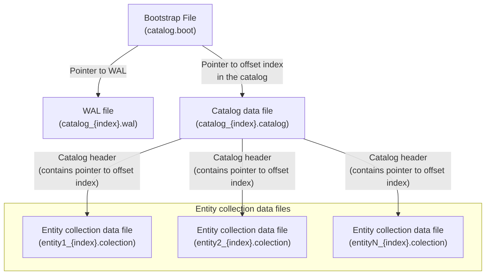

## Základní typy souborů a jejich vztahy

evitaDB ukládá data do souborů na disku ve složce s daty, která je určena v konfiguraci. Nejvyšší úroveň této složky obsahuje podsložky pro jednotlivé katalogy. Každá složka katalogu obsahuje všechny soubory potřebné pro práci s tímto katalogem (není potřeba žádná externí informace mimo tuto složku). Složka vždy obsahuje:

1. **[Bootstrap soubor](#bootstrap-soubor)** – soubor odpovídající názvu katalogu s příponou `.boot`, který obsahuje klíčové ukazatele na ostatní soubory
2. **[Write-ahead log (WAL)](#write-ahead-log-wal)** – soubor odpovídající názvu katalogu s příponou `{catalogName}_{index}.wal`, kde `index` je vzestupné číslo začínající od nuly; soubor obsahuje sekvenci změn katalogu v čase
3. **[Datový soubor katalogu](#datové-soubory)** – soubor odpovídající názvu katalogu s příponou `{catalogName}_{index}.catalog`, kde `index` je vzestupné číslo začínající od nuly; soubor obsahuje data spojená s katalogem, jako je schéma katalogu a globální indexy
4. **[Datové soubory kolekcí entit](#datové-soubory)** – soubory odpovídající názvu entity s příponou `{entityTypeName}_{index}.colection`, kde `index` je vzestupné číslo začínající od nuly; tyto soubory obsahují všechna data spojená s danou kolekcí entit—její schéma, indexy a data entit

Soubory obsahují vzájemné odkazy ve formě ukazatelů na klíčové pozice v rámci souboru. Bootstrap soubor obsahuje ukazatel na WAL soubor a také na umístění [offset indexu](#offset-index) v katalogovém souboru. Datový soubor katalogu obsahuje hlavičku katalogu, která pak obsahuje ukazatele na klíčové pozice v jednotlivých datových souborech kolekcí entit. Mechanismus ukazatelů je znázorněn na diagramu níže:

```mermaid
flowchart TD
A["Bootstrap File\n(catalog.boot)"] -->|"Pointer to WAL"| B["WAL file\n(catalog_{index}.wal)"]
A -->|"Pointer to offset index\nin the catalog"| C["Catalog data file\n(catalog_{index}.catalog)"]

    subgraph S["Entity collection data files"]
        D1["Entity collection data file\n(entity1_{index}.colection)"]
        D2["Entity collection data file\n(entity2_{index}.colection)"]
        Dn["Entity collection data file\n(entityN_{index}.colection)"]
    end

    C -->|"Catalog header\n(contains pointer to offset index)"| D1
    C -->|"Catalog header\n(contains pointer to offset index)"| D2
    C -->|"Catalog header\n(contains pointer to offset index)"| Dn
```

Obsah každého typu souboru je popsán podrobněji v následujících sekcích.

### Struktura záznamů v úložišti

Všechny záznamy v bootstrap souboru, WAL a všech datových souborech jsou ukládány v binárním formátu založeném na knihovně [Kryo](https://github.com/EsotericSoftware/kryo) a mají následující strukturu:

| Informace                  | Datový typ | Délka v bajtech |
|---------------------------|------------|-----------------|
| Délka záznamu v bajtech   | int32      | 4B              |
| Řídicí bajt               | int32      | 1B              |
| Generation Id             | int64      | 8B              |
| Payload                   | byte[]     | *               |
| Kontrolní součet – CRC32C | int64      | 8B              |

Níže je vysvětlení jednotlivých položek:

<dl>
    <dt>Délka záznamu v bajtech</dt>
    <dd>Délka záznamu v bajtech. Tato hodnota je porovnávána s hodnotou *Record pointer: length* a musí se shodovat; v opačném případě byla narušena integrita dat.</dd>
    <dt>Řídicí bajt</dt>
    <dd>Tento bajt obsahuje příznaky s klíčovými informacemi o povaze záznamu. Příznaky představují jednotlivé bity v tomto bajtu: <Table><Thead><Tr><Th>Číslo bajtu</Th><Th>Význam</Th></Tr></Thead><Tbody><Tr><Td>#1</Td><Td>poslední záznam v sérii záznamů</Td></Tr><Tr><Td>#2</Td><Td>navazující záznam, jehož payload pokračuje v bezprostředně následujícím záznamu</Td></Tr><Tr><Td>#3</Td><Td>pro záznam je dostupný vypočtený kontrolní součet</Td></Tr><Tr><Td>#4</Td><Td>záznam je komprimovaný</Td></Tr></Tbody></Table></dd>
    <dt>Generation Id</dt>
    <dd>Číslo generace přiřazené každému záznamu. Toto číslo se aktivně nepoužívá, ale může být využito pro případnou rekonstrukci dat. Typicky odpovídá verzi <a href="#offset-index">offset indexu</a>, který na tento záznam ukazuje.</dd>
    <dt>Payload</dt>
    <dd>Skutečná data záznamu. Tato sekce může mít proměnnou délku a obsahuje konkrétní informace odpovídající typu záznamu. Payload má maximální velikost omezenou velikostí výstupního bufferu (viz <a href="/documentation/operate/configure?lang=evitaql#storage-configuration" target="_blank">outputBufferSize</a>).</dd>
    <dt>Kontrolní součet - CRC32C</dt>
    <dd>Kontrolní součet používaný k ověření integrity dat v rámci záznamu. Slouží k detekci chyb při čtení dat v sekci payload.</dd>
</dl>

#### Důvod omezení maximální velikosti záznamu

Maximální velikost záznamu je omezena tím, že data jsou na disk zapisována výhradně přidáváním na konec souboru. První informací v záznamu je jeho velikost, která není známa, dokud není záznam kompletně vytvořen. Prakticky to znamená, že záznam je sestaven v paměťovém bufferu, výsledná velikost je poté zapsána na první pozici záznamu a teprve poté je záznam zapsán na disk.

#### Rozdělení payloadu do více záznamů

Existuje řada scénářů, kdy množství dat v payloadu překročí maximální povolenou velikost payloadu. Při ukládání můžeme payload často rozdělit do více záznamů již při serializaci, přičemž jsou umístěny za sebou. Každý z těchto záznamů je komprimován samostatně a má svůj vlastní kontrolní součet. Propojení mezi záznamy je zajištěno nastavením řídicího bitu č. 2. Je však zásadní, aby mechanismus deserializace rozpoznal potřebu načíst následující záznam.

#### Náklady na kontrolní součty a kompresi

Pro výpočet kontrolních součtů je použita optimalizovaná varianta CRC32 (konkrétně <a href="https://www.ietf.org/rfc/rfc3720.txt" target="_blank">CRC32C</a>) obsažená v JDK. Režie výpočtu a ověřování kontrolních součtů je minimální, proto doporučujeme mít je vždy zapnuté (což je výchozí nastavení). Přesto je lze vypnout pomocí nastavení `computeCRC32C` v <a href="/documentation/operate/configure?lang=evitaql#storage-configuration" target="_blank">konfiguraci úložiště</a>. Pokud jsou vypnuté, existující kontrolní součty v záznamech jsou při čtení ignorovány a nové kontrolní součty se při zápisu nepočítají.

Zapnutí komprese zvyšuje paměťové nároky na výstupní buffer, protože musí být alokován dvakrát—jednou pro zápis nekomprimovaných dat a podruhé pro komprimovanou verzi. Pokud jsou data špatně komprimovatelná, může se stát, že komprimovaná data budou stejně velká nebo dokonce větší než původní. V takovém případě se uloží původní nekomprimovaná data, i když režie pokusu o kompresi zůstává. Při čtení se toto určuje kontrolou řídicího bitu č. 4—je tedy předem jasné, zda je potřeba záznam před deserializací dekomprimovat. Kromě nákladů na dekompresi na CPU nevznikají při čtení žádné další režie. Stručně řečeno, většina nákladů spojených s kompresí vzniká při zápisu dat. Kompresi dat lze zapnout pomocí nastavení `compress` v <a href="/documentation/operate/configure?lang=evitaql#storage-configuration" target="_blank">konfiguraci úložiště</a>. Ve výchozím nastavení je komprese vypnutá. Pokud se pokusíte číst komprimovaná data, když je komprese vypnutá, dojde k chybě při čtení.

### Bootstrap soubor

Bootstrap soubor je prvním souborem vytvořeným při inicializaci katalogu. Je to jediný soubor s pevnou velikostí záznamu, kde jsou jeho záznamy (řádky) ukládány za sebou. Tyto záznamy jsou vždy nekomprimované (jinak by nebylo možné udržet pevnou velikost), jsou zapisovány pomocí <a href="#record-structure-in-the-storage">sjednoceného formátu</a>, obsahují kontrolní součet a jsou ukládány v pořadí, v jakém byly vytvořeny. Datová část každého záznamu obsahuje následující:

| Informace                        | Datový typ | Délka v bajtech |
|----------------------------------|------------|-----------------|
| Verze protokolu úložiště         | int32      | 4B              |
| Verze katalogu                   | int64      | 8B              |
| Index katalogového souboru       | int32      | 4B              |
| Časové razítko                   | int64      | 8B              |
| Ukazatel na záznam: začátek      | int64      | 8B              |
| Ukazatel na záznam: délka        | int32      | 4B              |

Níže je vysvětlení jednotlivých položek:

<dl>
    <dt>Verze protokolu úložiště</dt>
    <dd>Verze datového formátu, ve kterém jsou data katalogu uložena. Tato verze se mění pouze při zásadních úpravách pojmenování nebo struktury datových souborů, případně změnách obecné struktury záznamů v úložišti. Tato informace nám umožňuje detekovat, kdy běžící instance evitaDB očekává data v novějším formátu, než jaký je skutečně na disku. Pokud taková situace nastane, evitaDB obsahuje mechanismus pro migraci dat ze starého formátu na aktuální. Aktuálně je verze datového formátu `3`.</dd>
    <dt>Verze katalogu</dt>
    <dd>Verze katalogu se zvyšuje po dokončení každé potvrzené transakce, která posune katalog na další verzi. Neplatí nutně, že na každou transakci připadá jeden bootstrap záznam. Pokud se systému podaří zpracovat více transakcí v rámci časového okna, mohou být skoky mezi po sobě jdoucími verzemi katalogu v bootstrap souboru větší než 1. Pokud je katalog v režimu *warm-up*, může mít každý bootstrap záznam verzi katalogu nastavenou na `0`.</dd>
    <dt>Index katalogového souboru</dt>
    <dd>Obsahuje index datového souboru katalogu. Pomocí této informace lze sestavit název souboru odpovídající datovému souboru katalogu ve formátu *catalogName_&lbrace;index&rbrace;.catalog*. V adresáři může koexistovat více datových souborů pro stejný katalog s různými indexy, což značí dostupnost funkce <a href="#time-travel">cestování časem</a>.</dd>
    <dt>Časové razítko</dt>
    <dd>Časové razítko nastavené na čas vytvoření bootstrap záznamu, měřené v milisekundách od `1970-01-01 00:00:00 UTC`. Slouží k nalezení správného bootstrap záznamu při provádění <a href="#time-travel">cestování časem</a>.</dd>
    <dt>Ukazatel offset indexu: začátek</dt>
    <dd>Ukazatel na první bajt zahajovacího záznamu <a href="#offset-index">offset indexu</a> v datovém souboru katalogu.</dd>
    <dt>Ukazatel offset indexu: délka</dt>
    <dd>Délka v bajtech zahajovacího záznamu offset indexu v datovém souboru katalogu. Toto je zásadní pro správné načtení offset indexu z datového souboru katalogu.</dd>
</dl>

### Datové soubory

Všechny datové soubory mají záznamy proměnné délky a postrádají jakoukoli vnitřní organizaci. Data jsou zapisována sekvenčně jako jednotlivé <a href="#data-records">datové záznamy</a> ve <a href="#record-structure-in-the-storage">definované struktuře</a>. Pro pozdější přístup k těmto záznamům je udržován tzv. <a href="#offset-index">index posunu</a>, který obsahuje informace o pozici každého záznamu v datovém souboru. Tento index je zapisován inkrementálně v předem určených okamžicích, přičemž je připojen za samotné datové záznamy. Ukazatel na zahajovací (poslední) záznam offset indexu musí být uložen na nějakém externím místě—pro datové soubory kolekcí entit je tímto místem hlavička katalogu; pro datový soubor katalogu (včetně zmíněné hlavičky) je to bootstrap soubor.

#### Offset index

<SourceClass>evita_store/evita_store_key_value/src/main/java/io/evitadb/store/offsetIndex/OffsetIndex.java</SourceClass> je jednoduchá datová struktura ve <a href="#record-structure-in-the-storage">standardizovaném formátu</a>, jejíž payload je prostá kolekce:

| Informace                        | Datový typ | Délka v bajtech |
|----------------------------------|------------|-----------------|
| Primární klíč                    | int64      | 8B              |
| Typ záznamu                      | byte       | 1B              |
| Ukazatel na záznam: začátek      | int64      | 8B              |
| Ukazatel na záznam: délka        | int32      | 4B              |

Vždy předchází tato hlavička:

| Informace                        | Datový typ | Délka v bajtech |
|----------------------------------|------------|-----------------|
| Efektivní délka                  | int32      | 4B              |
| Ukazatel na záznam: začátek      | int64      | 8B              |
| Ukazatel na záznam: délka        | int32      | 4B              |

Hodnota *Efektivní délka* je klíčová pro určení, kolik záznamů je v payloadu, protože pokud je záznam komprimovaný, velikost záznamu na disku nelze pro tento výpočet použít. Tato velikost je vydělena velikostí jednoho záznamu v kolekci, čímž se získá počet záznamů, které je třeba z payloadu načíst. *Ukazatel na záznam* označuje pozici předchozího fragmentu offset indexu zaznamenaného v datovém souboru. Všechny fragmenty offset indexu jsou vždy umístěny ve stejném souboru.

Konkrétní položky offset indexu mají následující význam:

<dl>
    <dt>Primární klíč</dt>
    <dd>Primární klíč záznamu. evitaDB obvykle reprezentuje primární klíče jako `int32`, ale pro některé klíče jsou potřeba dva takové identifikátory. V těchto případech jsou dvě hodnoty `int32` sloučeny do jednoho `int64`.</dd>
    <dt>Typ záznamu</dt>
    <dd>Typ záznamu. Používá se interně k rozlišení typu záznamu—konkrétně ukládá typ <SourceClass>evita_store/evita_store_common/src/main/java/io/evitadb/store/model/StoragePart.java</SourceClass>. Protože číselné mapování používá pouze kladná čísla začínající od 1, záporné hodnoty těchto typů označují „odstraněnou hodnotu“. Princip načítání a zpracování odstraněných položek je vysvětlen později.</dd>
    <dt>Ukazatel na záznam: začátek</dt>
    <dd>Ukazatel na první bajt předchozího fragmentu offset indexu v aktuálním datovém souboru.</dd>
    <dt>Ukazatel na záznam: délka</dt>
    <dd>Délka předchozího fragmentu offset indexu.</dd>
</dl>

Čtení všech dostupných informací o záznamech v datovém souboru probíhá následovně:

1. Načte se zahajovací fragment offset indexu (typicky ten nejnovější v souboru).
2. Přečtou se všechny ukazatele na záznamy v tomto fragmentu:
    - pokud je typ záznamu záporný, znamená to odstraněný záznam—tato informace je zaznamenána v hash tabulce odstraněných záznamů.
3. Načte se předchozí fragment offset indexu pomocí jeho ukazatele a zpracuje se obdobně:
    - pokud záznam fragmentu odkazuje na záznam, který je v hash tabulce odstraněných záznamů, informace o tomto záznamu se při načítání ignoruje.
4. Tento postup se opakuje, dokud není dosaženo úplně prvního fragmentu offset indexu, který již neobsahuje ukazatel na předchozí fragment.

Fragmenty offset indexu jsou obvykle zapisovány na konci zpracování transakce (nebo sady po sobě jdoucích transakcí, pokud jsou zpracovány v rámci vyhrazeného časového okna). Ve fragmentu jsou uloženy pouze nové/upravené/odstraněné záznamy z této sady transakcí.

#### Datové záznamy

Datové záznamy obsahují skutečný datový payload pro každý typ záznamu a slouží k ukládání schémat, entit a všech ostatních infrastrukturních datových struktur, jako jsou vyhledávací indexy atd. Samotný záznam neobsahuje informaci o tom, zda je platný či nikoli—tato informace je dostupná pouze na úrovni offset indexu.

### Write-Ahead Log (WAL)

Write-ahead log je samostatná datová struktura, do které jsou všechny transakční změny zapisovány ve formě serializovaných „mutací“ ve chvíli, kdy je transakce potvrzena. Jednotlivé mutace jsou zapisovány pomocí <a href="#record-structure-in-the-storage">standardní struktury</a>, jedna za druhou, v pořadí, v jakém byly v transakci provedeny. Transakce jsou odděleny hlavičkou, která obsahuje celkovou délku transakce v bajtech (`int32`). Na začátku každé transakce je také zapsán záznam <SourceClass>evita_api/src/main/java/io/evitadb/api/requestResponse/transaction/TransactionMutation.java</SourceClass>, který obsahuje základní informace o samotné transakci pro snadnější orientaci. Poté následuje seznam jednotlivých mutací. Hlavička s délkou transakce umožňuje rychlou navigaci mezi transakcemi ve WAL souboru bez potřeby deserializovat každou mutaci.

Za každou transakcí ve WAL následuje kumulativní kontrolní součet CRC32C (8 bajtů jako `int64`). Tento kontrolní součet je vypočítán přes všechny bajty zapsané do WAL souboru od začátku až po (ale ne včetně) samotného kontrolního součtu. To zahrnuje hlavičky s délkou transakce, záznamy TransactionMutation a všechny payloady mutací. Pokud je při čtení WAL zjištěna neshoda kontrolního součtu, databáze WAL zkrátí na místo poškození a obnoví pouze platné předchozí transakce.

<Note type="info">

<NoteTitle toggles="true">

##### Co kumulativní kontrolní součet detekuje a co ne

</NoteTitle>

Název *kumulativní* může působit dojmem, že každý kontrolní součet ručí za celý soubor až do daného bodu. Ve skutečnosti každý ručí za svou vlastní transakci. Tento rozdíl je důležitý, pokud uvažujete o tom, před čím vás WAL chrání, proto mu věnujeme odstavec.

Kontrolní součet za transakcí je vypočten ze všech bajtů před ním, přičemž tyto bajty zahrnují i kontrolní součty předchozích transakcí. Právě to je ten háček. CRC kontrolní součty mají dobře známou vlastnost: pokud do výpočtu zadáte nějaká data a poté i jejich vlastní kontrolní součet, vždy skončíte na stejném pevném čísle, ať už byla data jakákoli. Právě tento trik využívají síťové protokoly pro kontrolu paketů v jednom průchodu. Zde to znamená, že výpočet se v podstatě na každém kontrolním součtu znovu „resetuje“, takže každý nakonec popisuje pouze transakci, která mu předchází.

Vaše data jsou tedy stále chráněna, jen dvěma mechanismy místo jednoho:

- **Napůl zapsaná nebo poškozená transakce je odhalena kontrolním součtem.** To je selhání, které skutečně nastává—server přijde o napájení uprostřed potvrzení, nebo disk vrátí špatné bajty. Poškozená transakce neprojde kontrolou a vše zapsané před ní zůstává platné. Proto také vypnutí `computeCRC32C` způsobuje pomalejší zápisy: bez kontrolního součtu pro odhalení poškození musí evitaDB místo toho zabránit jeho vzniku tím, že zapisuje každý zápis na zařízení v pořadí (viz <a href="/documentation/operate/configure?lang=evitaql#storage-configuration" target="_blank">konfigurace úložiště</a>).
- **Transakce, které jsou přeskládány, opakovány nebo chybí, jsou odhaleny verzí katalogu.** Každá transakce je označena verzí katalogu, kterou vytváří, a tato čísla rostou přesně o jedna. Když evitaDB přehrává log, trvá na tom, že je vidí v tomto pořadí bez vynechání, takže log, jehož transakce byly přeuspořádány, duplikovány nebo zkopírovány odjinud, je odmítnut dříve, než je cokoli z něj aplikováno.

Ani jeden z těchto mechanismů není určen k ochraně před úmyslnou úpravou WAL, a chytřejší kontrolní součet by na tom nic nezměnil—kdokoli, kdo může upravit data, může také přepočítat kontrolní součty. Kontrolní součty zachycují nehody, ne sabotáž.

</Note>

<Note type="info">

<NoteTitle toggles="true">

##### Co se stane, když se na disku převrátí bit

</NoteTitle>

Úložný hardware občas vrátí něco jiného, než co bylo zapsáno—bit převrácený vadnou buňkou, chyba firmwaru řadiče, chyba kabelu. Žádná databáze tomu nemůže zabránit. Co evitaDB zaručuje, je, že takový výsledek *nepřehraje potichu*: poškozené transakce jsou rozpoznány jako poškozené a nejsou aplikovány jako by šlo o skutečné změny vašich dat.

Převrácený bit kdekoli uvnitř transakce změní bajty, ze kterých byl kontrolní součet vypočten, takže hodnota na disku již neodpovídá tomu, co je znovu vypočteno při načítání. To platí bez ohledu na to, kam převrácení dopadne—do payloadu mutace, do hlaviček záznamů, do prefixu s délkou transakce nebo dokonce do samotného uloženého kontrolního součtu. Každý z těchto případů způsobí neshodu.

CRC32C je zvolen proto, že jeho detekční záruky jsou v nejdůležitějších případech přesné, nikoli pravděpodobnostní:

- jeden převrácený bit je **vždy** detekován;
- sekvence poškozených bitů až do délky 32 bitů—typický tvar hardwarové chyby čtení—je **vždy** detekována;
- u širšího nebo rozptýlenějšího poškození je šance, že by poškození prošlo, asi jedna ku čtyřem miliardám.

Transakce také prochází druhou, nezávislou kontrolou. Každý záznam v ní nese svůj vlastní CRC32C jako součást <a href="#record-structure-in-the-storage">standardní struktury záznamu</a>, který je ověřen při deserializaci záznamu během přehrávání. Poškození tedy musí překonat dva samostatné kontrolní součty, aby se dostalo k vašim datům.

Když je nalezena neshoda, evitaDB zkrátí WAL zpět na poslední transakci, která prošla ověřením, a původní soubor ponechá jako `_damaged_wal.bck`, takže nezkácené bajty zůstávají k dispozici k inspekci. Všimněte si, že tímto se odstraní poškozená transakce *a vše zaznamenané po ní*—log je sekvence a není možné bezpečně aplikovat pozdější změny přes vzniklou mezeru. Vše před poškozenou transakcí je zachováno a přehráno jako obvykle.

Jedna důležitá věc pro plánování: **vše toto závisí na tom, že je zapnutý `computeCRC32C`** (což je výchozí stav). Pokud jej vypnete, obě vrstvy kontroly se stanou operacemi, které vždy odpoví „souhlasí“, takže poškozená data budou přehrána, jako by byla skutečná. Režim pořadí zápisu, který jej nahrazuje, chrání pouze před pádem při napůl zapsané transakci; neřeší případ, kdy disk vrátí špatné bajty. Kontrolní součty ponechte zapnuté, pokud nechcete výslovně vyšší propustnost zápisu a jste ochotni přijít o detekci tiché korupce.

</Note>

Write-ahead log má maximální velikost souboru nastavenou pomocí parametru <a href="https://evitadb.io/documentation/operate/configure#transaction-configuration" target="_blank">walFileSizeBytes</a>. Jakmile je tohoto limitu dosaženo, soubor se uzavře a vytvoří se nový s dalším indexovým číslem v názvu. Maximální počet WAL souborů je určen parametrem <a href="https://evitadb.io/documentation/operate/configure#transaction-configuration" target="_blank">walFileCountKept</a>. Po dosažení tohoto maxima je nejstarší soubor odstraněn. Tento mechanismus zajišťuje, že WAL soubory nikdy nepřerostou do nadměrné velikosti a nehromadí se na disku do nekonečna.

Každý WAL soubor začíná a končí kumulativním kontrolním součtem CRC32C. Ten na začátku je kopií závěrečného kontrolního součtu předchozího WAL souboru (nebo nulou pro úplně první soubor), takže každý soubor zaznamenává, který mu předcházel. Jak je vysvětleno výše, pořadí při startu databáze ověřují ve skutečnosti katalogové verze, nikoli tato hodnota.

Na konci každého WAL souboru kromě aktuálního, do kterého se ještě zapisuje, je dvojice hodnot `int64` představujících první a poslední verzi katalogu zaznamenanou v tomto WAL souboru, následovaná třetí hodnotou `int64` obsahující závěrečný kumulativní kontrolní součet CRC32C, vypočtený přes vše před ním včetně těchto dvou verzí. Právě tato dvojice verzí umožňuje evitaDB rychle najít správný soubor, když potřebuje transakci, která posunula katalog na konkrétní verzi, místo aby musela otevírat všechny soubory.

#### Formát WAL transakce

Celkově má WAL soubor následující strukturu:

| Informace                   | Datový typ | Délka v bajtech |
|-----------------------------|------------|-----------------|
| Počáteční kumulativní CRC32C| int64      | 8B              |
| Transakce 1                 | proměnná   | proměnná        |
| Transakce 2                 | proměnná   | proměnná        |
| ...                         | ...        | ...             |
| Transakce N                 | proměnná   | proměnná        |
| První verze katalogu        | int64      | 8B              |
| Poslední verze katalogu     | int64      | 8B              |
| Závěrečný kumulativní CRC32C| int64      | 8B              |

Každá transakce ve WAL souboru má tuto strukturu:

| Informace            | Datový typ | Délka v bajtech |
|----------------------|------------|-----------------|
| Délka transakce      | int32      | 4B              |
| TransactionMutation  | záznam     | proměnná        |
| Payloady mutací      | záznam[]   | proměnná        |
| Kumulativní CRC32C   | int64      | 8B              |

Kumulativní CRC32C je vypočítáván při zápisu bajtů do WAL souboru a znovu kontrolován při čtení transakcí zpět. Transakce, která při startu neprojde kontrolou, nezastaví databázi. evitaDB zkrátí WAL zpět na poslední transakci, která prošla ověřením, ponechá nezkácený soubor vedle něj jako `_damaged_wal.bck`, takže nic nezmizí potichu, a zapíše varování do logu. Obnova do místa, kde jsou data v pořádku, je záměrná—alternativou by byla databáze, která odmítne startovat, protože její poslední commit byl přerušen. Výjimka `WriteAheadLogCorruptedException` (pro katalogový WAL) nebo `EngineMutationLogCorruptedException` (pro engine WAL) je vyvolána pouze v případě poškození, které tímto způsobem nelze řešit, například pokud WAL soubor zcela chybí nebo je příliš krátký na to, aby z něj šlo něco vyčíst.

Pokud je na konci WAL souboru částečně zapsaný záznam nebo transakce (tj. její velikost neodpovídá velikosti uvedené v hlavičce transakce nebo v mutaci transakce), je WAL soubor při startu databáze zkrácen na poslední platný WAL záznam.

## Mechanika dat

Zápisy dat v evitaDB jsou striktně pouze přidávací (append-only), což znamená, že jednou zapsaná data nejsou nikdy přepsána. To má jak pozitivní, tak negativní důsledky.

Na pozitivní straně nemusíte řešit zamykání souborů během souběžného čtení a zápisu, ani spravovat informace o volném místě nebo optimalizovat rozložení dat kvůli defragmentaci. Samotné záznamy mohou mít proměnlivou délku, což poskytuje flexibilitu v ukládaných datech (např. lze povolit kompresi). Skutečnost, že starší (přepsané) verze logických záznamů zůstávají v souboru, také umožňuje <a href="#time-travel">cestování v čase</a> a zálohování a obnovení <a href="#backup-and-restore">k určitému bodu v čase</a>.

Na negativní straně dochází k postupnému hromadění „zastaralých“ dat v souborech. Tato data je třeba pravidelně čistit, aby nezpomalovala start databáze (nepoužívané záznamy se stále objevují v <a href="#offset-index">offset indexu</a>) a nezabírala místo v cache souborů operačního systému, které by jinak mohlo být využito pro relevantní data. Toto čištění je řešeno procesem <a href="#cleaning-up-the-clutter">čištění nepořádku</a>, který spočívá v kopírování aktuálních záznamů do nového souboru (stále pouze přidávacího). Dále je nutné udržovat <a href="#offset-index">index posunu</a> obsahující pozicové informace pro každý záznam, protože proměnlivá délka záznamů znemožňuje jednoduše vypočítat jejich pozice přímo.

Ke kompresi dat v sekci payload je použita Deflate komprese (součást JDK). Limit velikosti payloadu vynucený výstupním bufferem zůstává v platnosti—komprese probíhá až po naplnění bufferu nebo po úplném zapsání payloadu. Pokud je komprimovaný payload stejně velký nebo větší, použije se místo něj nekomprimovaná verze.

### Čištění nepořádku

Čištění nepořádku je proces, jehož cílem je zabránit nadměrnému hromadění „zastaralých“ dat v datových souborech. Velké množství zastaralých dat zpomaluje start databáze (protože je musí projít a ignorovat) a také zabírá místo v cache souborů operačního systému, čímž snižuje pravděpodobnost, že budou v cache skutečně potřebná data. Proto evitaDB obsahuje automatický proces *kompaktace*, který pravidelně tato data čistí vždy, když jsou překročeny nakonfigurované <a href="/documentation/operate/configure#storage-configuration" target="_blank">práhy</a> pro `minimalActiveRecordShare` a velikost souboru překročí `fileSizeCompactionThresholdBytes`.

Tento proces probíhá během zpracování transakcí, pokud je po dokončení transakce zjištěno, že jsou tyto podmínky splněny. Na jednu stranu to zabraňuje hromadění a přerůstání dat v souboru. Na druhou stranu to znamená, že dokončení transakce může trvat déle než obvykle, protože zahrnuje i práci s kompakcí.

Samotná kompakce je poměrně rychlá. Vytvoří se nový datový soubor s indexem o jedna vyšším a všechny aktuální záznamy, na které odkazuje paměťový <a href="#offset-index">index posunu</a> pro aktuální verzi, jsou do něj zkopírovány. Nakonec je připojen jediný souvislý fragment reprezentující stav tohoto offset indexu. Poté jsou příslušné ukazatele v odpovídající hlavičce (uložené v jiném, nadřazeném datovém souboru—buď v katalogovém datovém souboru, nebo v bootstrap souboru) aktualizovány tak, aby ukazovaly na nový soubor. Protože kopírování probíhá na úrovni bloků, není nutné obsah záznamů deserializovat a znovu serializovat, což celý proces urychluje. Pokud jsou v konfiguraci povoleny kontrolní součty, ověřují se v této fázi i kontrolní součty.

Původní datový soubor je buď odstraněn, nebo—pokud je povoleno <a href="#time-travel">cestování v čase</a>—zůstává na disku, i když již není aktivně používán.

### Cestování v čase

Protože jsou data ukládána pouze přidávacím způsobem, je možné přistupovat k datům, která byla v aktuální verzi změněna nebo dokonce odstraněna, pokud původní datový soubor stále existuje. Celý princip cestování v čase je založen na nalezení odpovídajícího záznamu v bootstrap souboru, načtení příslušného offset indexu v relevantním datovém souboru (ať už aktivně používaném, nebo ponechaném na disku po <a href="#cleaning-up-the-clutter">kompaktaci</a>), nalezení příslušné položky v offset indexu a nakonec načtení datového záznamu z datového souboru.

Tento proces není výrazně optimalizován na rychlost—spíše jen využívá přidávací povahu dat pro zpětné vyhledávání záznamů (tato funkce sama o sobě z evitaDB nedělá plně temporální databázi specializovanou na časové dotazy). Umožňuje však zpětně sledovat historii záznamu (nebo sady záznamů) a také provádět zálohy databáze k určitému bodu v čase.

#### Jak daleko zpět lze cestovat

Bootstrap záznam lze přečíst pouze tehdy, když platí *všechny tři* podmínky: záznam je stále přítomen v bootstrap souboru, katalogový datový soubor, na který ukazuje, je stále na disku, a každá kolekce entit existující v této verzi má stále svůj kolekční datový soubor na disku. Tuto trojici nazýváme **generace**—právě generace, nikoli jednotlivý bootstrap záznam, je tím, co retention skutečně uchovává nebo uvolňuje, protože po sobě jdoucí záznamy běžně sdílejí jednu generaci.

Každý index souboru, který záznam uzamkne, se pouze zvyšuje, takže historie má přesně jeden *horizont*: smazání souboru s nejnižším indexem u jakékoli komponenty odstraní prefix záznamů a to, co zůstane dosažitelné, je vždy sufix. Kompaktace jednotlivých kolekcí v různých okamžicích tedy nikdy nezanechá roztřepenou hranici—jen znamená, že posunutí horizontu uvolní různě velkou část u jednotlivých komponent, někdy vůbec nic.

Dva nezávislé limity posouvají tento horizont a vítězí ten vyšší:

- **Retence write-ahead logu** (`transaction.walFileSizeBytes` × `transaction.walFileCountKept`) omezuje, jak daleko sahá historie mutací.
- **[`storage.timeTravelSizeLimitBytes`](../operate/configure.md#konfigurace-úložiště)** omezuje, kolik místa na disku mohou uchovávané generace zabírat nad rámec aktivní datové sady. Bez tohoto limitu byla retence omezena pouze write-ahead logem—ten omezuje bajty WAL, nikoli bajty na disku, a dovoloval historickým datovým souborům růst bez omezení.

Ani jeden z těchto limitů nemůže odstranit data, která stále čte nějaká otevřená session: oba limity jsou svázány nejstarší verzí katalogu, na kterou ještě odkazuje nějaká otevřená session nebo zapisovač.

### Zálohování a obnovení

Práce se soubory také umožňuje naivní způsob zálohování—prostým zkopírováním souborů v tomto pořadí:

1. Bootstrap soubor
2. Katalogové datové soubory
3. Datové soubory kolekcí entit
4. WAL soubory

I když databáze běží, kopírování dat na disku tímto způsobem zachytí aktuální stav konzistentně. Je to proto, že pokud je bootstrap soubor zkopírován jako první, nutně obsahuje správný ukazatel na plně zapsaná data na příslušném místě, na které odkazuje. Databáze zapisuje bootstrap záznam jako poslední—tj. až poté, co byla všechna data, na která odkazuje, kompletně zapsána. Pokud existují další data, na která nic neukazuje, databázi to při dalším startu nebude vadit. Navíc pokud jsou WAL soubory kopírovány jako poslední, zachytíte i nejnovější změny. Při obnově se je evitaDB pokusí přehrát. Jakákoli částečně zapsaná transakce na konci WAL souboru je automaticky zahozena, takže i když byla transakce zapsána jen zčásti, nemělo by to zabránit databázi ve startu z těchto zkopírovaných datových souborů.

Existují dva způsoby, jak zálohy řešit:

1. **Plná záloha** – záloha všech datových souborů a WAL souborů, včetně historických.
2. **Aktivní záloha** – záloha pouze aktuálně používaných datových souborů a WAL souborů.

Plná záloha využívá výše popsaný naivní přístup, ale může být velmi velká, pokud existuje značné množství historických dat. Na druhou stranu ji lze provádět za běhu databáze, protože jde čistě o kopírování souborů.

Aktivní záloha se více podobá procesu <a href="#cleaning-up-the-clutter">čištění nepořádku</a>. Pro každý datový soubor se nejprve vytvoří nový soubor, který obsahuje pouze aktuální sadu záznamů pro (nejnovější) verzi <a href="#offset-index">offset indexu</a>. Nejprve se to provede pro soubory kolekcí entit, poté pro katalogový datový soubor a nakonec se vytvoří nový bootstrap soubor obsahující pouze jediný historický záznam. Systém běží normálně (transakce se stále zpracovávají) i během zálohování. Díky neměnnosti bude záloha reprezentovat data tak, jak vypadala v okamžiku zahájení zálohy, a ignoruje jakékoli následné změny. Na konci procesu zálohování jsou však také zahrnuty WAL soubory vytvořené od začátku zálohování až do jejího dokončení. Po obnovení se tyto WAL záznamy přehrají, což zajistí, že aktivní záloha bude plně aktuální bez ohledu na to, jak dlouho proces zálohování trval.