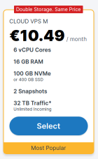

Ačkoli je mnohem lepší pracovat se schématem a daty, která odpovídají vašemu vlastnímu e-commerce případu použití, věříme, že mnoho z vás bude chtít otestovat Query API bez zbytečné práce. Proto jsme pro vás připravili ukázkové schéma virtuálního e-shopu s daty pro více než tisíc produktů, se kterými si můžete ihned pohrát.

Existují dva způsoby, jak si s touto datovou sadou můžete pohrát:

1. jednoduché, ale omezené: [použijte naši instanci serveru evitaDB.io](#použijte-naši-instanci-serveru-evitadbio)
2. složitější, ale bez omezení: [spusťte si vlastní server evitaDB s naší datovou sadou](#spusťte-si-vlastní-server-evitadb-s-naší-datovou-sadou)

## Použijte naši instanci serveru evitaDB.io

Demo dataset hostujeme přímo na stránkách [evitadb.io](https://evitadb.io), ale abychom zajistili spolehlivý provoz pro všechny, museli jsme jej nastavit pouze pro čtení. Nemůžete tedy provádět žádné změny. Stále jej však můžete využít k testování všech našich webových API a podporovaných ovladačů.

Dalším omezením je, že server běží na levné sdílené infrastruktuře
[Contabo hostingu](https://contabo.com/en/vps/) (který je známý tím, že nakupuje starší servery pro poskytování levného hostingu) s následujícími parametry:



Pokud zaznamenáte pomalé odezvy, dejte nám vědět a
[vyzkoušejte evitaDB na vlastním hardwaru](#spusťte-si-vlastní-server-evitadb-s-naší-datovou-sadou).

Naše API jsou dostupná na těchto adresách:

- `graphQL` API: [https://demo.evitadb.io:5555/gql/](https://demo.evitadb.io:5555/gql/evita)
   - můžete prozkoumat GraphQL API s naší datovou sadou pomocí [online GraphiQL editoru](https://cloud.hasura.io/public/graphiql?endpoint=https%3A%2F%2Fdemo.evitadb.io%3A5555%2Fgql%2Fevita) (více v dokumentaci [GraphQL](../use/connectors/graphql.md))
- `REST` API: [https://demo.evitadb.io:5555/rest/](https://demo.evitadb.io:5555/rest/evita)
   - OpenAPI schéma můžete získat odesláním GET požadavku na tuto URL (více v dokumentaci [REST](../use/connectors/rest.md))
- `gRPC` API: [https://demo.evitadb.io:5555/](https://demo.evitadb.io:5555/)

## Spusťte si vlastní server evitaDB s naší datovou sadou

Tato možnost vyžaduje více práce, ale získáte kontrolu nad výkonem a budete moci libovolně upravovat data v sadě. Pro přístup k datové sadě na vlastním hardwaru musíte:

1. [stáhnout archiv s datovou sadou](https://evitadb.io/download/evita-demo-dataset.zip)
   ```shell
   wget https://evitadb.io/download/evita-demo-dataset.zip
   ```

2. rozbalit obsah do složky `data`
   ```shell
   unzip -d data evita-demo-dataset.zip
   ```

3. stáhnout docker image evitaDB
   ```shell
   docker pull index.docker.io/evitadb/evitadb:latest
   ```
4. spustit server evitaDB
   ```shell
   docker run --name evitadb -i --net=host \          
          -v "./data:/evita/data" \
          index.docker.io/evitadb/evitadb:latest

   # je otevřený issue https://github.com/docker/roadmap/issues/238 pro Windows / Mac OS
   # a je potřeba ručně otevřít porty a předat IP adresu hostitele do kontejneru
   docker run --name evitadb -i -p 5555:5555 \        
          -v "./data:/evita/data" \
          index.docker.io/evitadb/evitadb:latest
   ```

Po dokončení tohoto postupu byste měli v konzoli vidět podobný výstup:

```plain

            _ _        ____  ____
  _____   _(_) |_ __ _|  _ \| __ )
 / _ \ \ / / | __/ _` | | | |  _ \
|  __/\ V /| | || (_| | |_| | |_) |
 \___| \_/ |_|\__\__,_|____/|____/

beta build 2026.1.0 (keep calm and report bugs 😉)
Visit us at: https://evitadb.io

19:45:37.088 INFO  i.e.s.c.DefaultCatalogPersistenceService - Catalog `evita` is being loaded and  it contains:
	- Group (10)
	- ShippingMethod (0)
	- ObsoleteProduct (0)
	- Category (36)
	- ParameterValue (3319)
	- ProductBundle (0)
	- Product (4223)
	- PickupPoint (9747)
	- Brand (57)
	- AdjustedPricePolicy (2)
	- ParameterGroup (5)
	- Parameter (113)
	- PaymentMethod (0)
	- Tag (18)
	- PriceList (20)
	- Stock (1)
19:45:37.091 INFO  i.e.s.c.DefaultCatalogPersistenceService - Catalog loaded in 0.054817170s
19:45:41.363 INFO  i.e.c.Evita - Catalog evita fully loaded.
Root CA Certificate fingerprint:        43:51:C6:A0:9C:21:9A:8A:BE:18:2B:53:93:CF:4E:1A:CE:7F:FF:B0:16:99:A5:4C:22:52:25:09:72:6F:5C:E3
API `graphQL` listening on              https://localhost:5555/gql/
API `rest` listening on                 https://localhost:5555/rest/
API `gRPC` listening on                 https://localhost:5555/
API `system` listening on               http://localhost:5555/system/
   - server certificate served at:      http://localhost:5555/system/evitaDB-CA-selfSigned.crt
   - client certificate served at:      http://localhost:5555/system/client.crt
   - client private key served at:      http://localhost:5555/system/client.key

************************* WARNING!!! *************************
You use mTLS with automatically generated client certificate.
This is not safe for production environments!
Supply the certificate for production manually and set `useGeneratedCertificate` to false.
************************* WARNING!!! *************************
```

To znamená, že váš server evitaDB je spuštěný a také že načetl katalogovou datovou sadu `evita` s několika tisíci produkty.

<LS to="e,j">

## Připojení Java klienta

Otevřete své Java IDE a přidejte do projektu následující závislost:

<CodeTabs>
<CodeTabsBlock>
```Maven
<dependency>
    <groupId>io.evitadb</groupId>
    <artifactId>evita_java_driver</artifactId>
    <version>2026.1.0</version>
</dependency>
```
</CodeTabsBlock>
<CodeTabsBlock>
```Gradle
implementation 'io.evitadb:evita_java_driver:2026.1.0'
```
</CodeTabsBlock>
</CodeTabs>

Poté vytvořte instanci <SourceClass>evita_external_api/evita_external_api_grpc/client/src/main/java/io/evitadb/driver/EvitaClient.java</SourceClass>:

<SourceCodeTabs langSpecificTabOnly local>
[Připojení k demo serveru](/documentation/user/en/get-started/example/connect-demo-server.java)
</SourceCodeTabs>

Následně můžete vytvořit novou session a vyzkoušet libovolné evitaQL dotazy popsané v
[referenční dokumentaci](../query/basics.md):

<SourceCodeTabs requires="evita_test/evita_functional_tests/src/test/resources/META-INF/documentation/evitaql-init.java" langSpecificTabOnly>

[Dotazování na demo server](/documentation/user/en/get-started/example/query-demo-server.java)

</SourceCodeTabs>

<Note type="info">

<NoteTitle toggles="true">

##### Potřebujete podrobnější návod?

</NoteTitle>

Kompletní návod k nastavení Java klienta najdete v [kapitole o Java ovladačích](../use/connectors/java.md).
Pokud potřebujete více tipů k dotazování na data, zkuste [kapitolu o Query API](../use/api/query-data.md).

</Note>

</LS>

<LS to="c">

## Připojení C# klienta

Otevřete své .NET IDE a vytvořte instanci <SourceClass>EvitaDB.Client/EvitaClient.cs</SourceClass>:

<SourceCodeTabs langSpecificTabOnly local>
[Připojení k demo serveru](/documentation/user/en/get-started/example/connect-demo-server.cs)
</SourceCodeTabs>

<Note type="info">

<NoteTitle toggles="true">

##### Proč je EvitaClient inicializován statickou asynchronní metodou místo konstruktoru?

</NoteTitle>

Při inicializaci klient potřebuje získat `server-name` z *system* endpointu evitaDB a v případě použití generovaných self-signed certifikátů potřebuje získat certifikát ze serveru. Protože obě tyto operace jsou v .NET asynchronní, rozhodli jsme se, že i inicializace bude asynchronní. Tyto asynchronní volání nelze provádět v konstruktoru (aniž by došlo k blokování hlavního vlákna aplikace, což by mohlo způsobit vážné problémy ve vaší aplikaci), proto jsme zvolili statickou asynchronní metodu.

</Note>

Následně můžete vytvořit novou session a vyzkoušet libovolné evitaQL dotazy popsané v
[referenční dokumentaci](../query/basics.md):

<SourceCodeTabs requires="/documentation/user/en/get-started/example/connect-demo-server.java" langSpecificTabOnly>

[Dotazování na demo server](/documentation/user/en/get-started/example/query-demo-server.cs)

</SourceCodeTabs>

<Note type="info">

<NoteTitle toggles="true">

##### Potřebujete podrobnější návod?

</NoteTitle>

Kompletní návod k nastavení C# klienta najdete v [kapitole o C# ovladačích](../use/connectors/c-sharp.md).
Pokud potřebujete více tipů k dotazování na data, zkuste [kapitolu o Query API](../use/api/query-data.md).

</Note>

</LS>

<LS to="g">

## Připojení k GraphQL API

Otevřete svého [GraphQL klienta](../use/connectors/graphql.md#doporučená-ide) dle výběru a zadejte
URL API katalogových dat našeho demo katalogu `https://demo.evitadb.io:5555/gql/evita`.

Poté můžete na tuto adresu posílat GraphQL požadavky a vyzkoušet libovolné GraphQL dotazy popsané v
[referenční dokumentaci](../query/basics.md):

<SourceCodeTabs langSpecificTabOnly>

[Dotazování na demo server](/documentation/user/en/get-started/example/query-demo-server.graphql)

</SourceCodeTabs>

<Note type="info">

<NoteTitle toggles="true">

##### Potřebujete podrobnější návod?

</NoteTitle>

Kompletní návod k nastavení GraphQL klienta najdete v [kapitole o GraphQL ovladačích](../use/connectors/graphql.md).
Pokud potřebujete více tipů k dotazování na data, zkuste [kapitolu o Query API](../use/api/query-data.md).

</Note>

</LS>

<LS to="r">

## Připojení k REST API

Otevřete svého [REST klienta](../use/connectors/rest.md#doporučená-vývojová-prostředí-ide) dle výběru a zadejte
základní URL API katalogových dat našeho demo katalogu `https://demo.evitadb.io:5555/rest/evita`.

Poté můžete na různé varianty této adresy posílat REST požadavky a vyzkoušet libovolné REST dotazy popsané v
[referenční dokumentaci](../query/basics.md):

<SourceCodeTabs langSpecificTabOnly>

[Dotazování na demo server](/documentation/user/en/get-started/example/query-demo-server.rest)

</SourceCodeTabs>

<Note type="info">

<NoteTitle toggles="true">

##### Potřebujete podrobnější návod?

</NoteTitle>

Kompletní návod k nastavení REST klienta najdete v [kapitole o REST ovladačích](../use/connectors/rest.md).
Pokud potřebujete více tipů k dotazování na data, zkuste [kapitolu o Query API](../use/api/query-data.md).

</Note>

</LS>