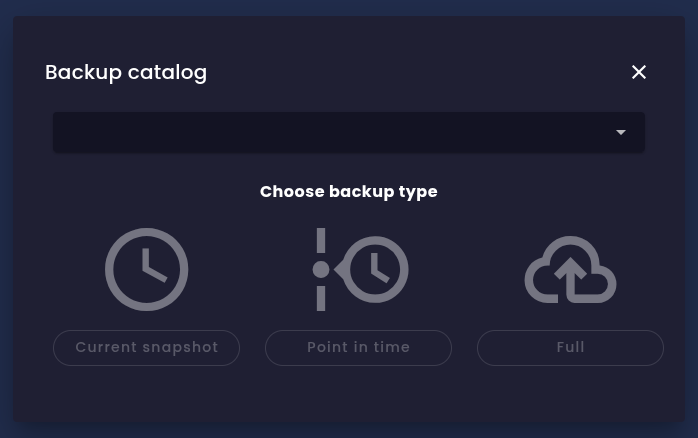

evitaDB nabízí několik způsobů, jak zálohovat vaše data. Nakonec budou všechny tyto administrativní operace dostupné prostřednictvím všech klientských API, ale v současnosti je podporuje pouze gRPC/Java API (viz [issue #627](https://github.com/FgForrest/evitaDB/issues/627)). Existují tři hlavní způsoby zálohování dat – PIT (point-in-time) záloha je dostupná pouze tehdy, když je v [konfiguraci](configure.md#konfigurace-úložiště) povolena možnost *time-travel*:

Žádná z těchto možností zálohování nezasahuje do běžného provozu databáze; během vytváření zálohy můžete nadále číst i zapisovat data. Díky architektuře úložiště pouze pro přidávání může proces zálohování bezpečně běžet bez blokování jakýchkoli operací. Mějte však na paměti, že vytváření zálohy může mít určitý dopad na výkon.

<Note type="info">

Pokud potřebujete vědět více o architektuře úložiště a principech, na kterých jsou tyto možnosti zálohování postaveny, podívejte se do [dokumentace k modelu úložiště](../deep-dive/storage-model.md#zálohování-a-obnova).

</Note>

## Aktuální snímek

Aktuální snímek obsahuje kopii aktuálních dat a volitelně také obsah transakčního logu (WAL), pokud tuto možnost při vytváření zálohy zvolíte. Obsah transakčního logu je zkopírován celý a může obsahovat operace, které jsou již ve snímku zohledněny, i operace, které ještě nebyly aplikovány. Při obnově dat z takové zálohy je nejprve obnoven snímek a poté jsou ve stejném pořadí, v jakém byly původně provedeny, aplikovány všechny nezpracované operace z transakčního logu. Tímto způsobem můžete obnovit databázi do přesného stavu, v jakém byla v okamžiku vytvoření zálohy. Pokud do zálohy nezahrnete transakční log, databáze bude obnovena do stavu v době vytvoření snímku, ale mohou chybět některé nezpracované aktualizace. Výhodou tohoto přístupu je, že záloha snímku bez WAL je nejmenší možná záloha, kterou lze vytvořit.

## Snímek v čase (point-in-time snapshot)

Snímek v čase (PIT) je speciální typ zálohy, kterou lze vytvořit pouze tehdy, když je v [konfiguraci](configure.md#konfigurace-úložiště) povolena možnost *time-travel*. Tento typ zálohy obsahuje kopii databáze ke konkrétnímu okamžiku v minulosti. Při vytváření takové zálohy zadáte přesné časové razítko, které chcete zálohovat. Systém pak vytvoří snímek databáze tak, jak v daný okamžik vypadala. To je užitečné zejména tehdy, když potřebujete obnovit databázi do konkrétního historického stavu, například po nechtěném smazání nebo poškození dat.

Existuje omezené časové okno v minulosti, pro které můžete vytvářet PIT snímky. Toto okno je určeno retenční dobou historických dat, která se nastavuje v [konfiguraci úložiště](configure.md#konfigurace-transakcí) pomocí parametrů *walFileSizeBytes* a *walFileCountKept*. Databáze uchovává všechna historická data všech potvrzených transakcí, které jsou stále přítomny v souborech transakčního logu (WAL). Jakmile je soubor WAL smazán, jsou smazány i všechny soubory s historickými daty, na které tento WAL odkazuje. Pokud se pokusíte vytvořit PIT snímek pro časové razítko starší, než je nejstarší uchovávané historické datum, operace selže. Úpravou těchto dvou konfiguračních parametrů můžete ovlivnit, jak daleko do minulosti lze PIT snímky vytvářet. Toto období silně závisí na aktivitě databáze – čím více aktualizací provádíte, tím více historických dat vzniká a tím rychleji se WAL soubory rotují.

<Note type="info">

Do zálohy PIT snímku můžete také zahrnout soubory transakčního logu (WAL), ale toto je určeno pouze pro ladicí účely. Při obnově z PIT snímku, který obsahuje WAL soubory, je databáze obnovena do zvoleného okamžiku v čase a poté jsou aplikovány všechny operace ze zahrnutých WAL souborů, které byly provedeny po tomto okamžiku. Výsledkem bude aktuální stav databáze, stejně jako při obnově z aktuálního snímku se zahrnutými WAL soubory.

</Note>

## Plná kopie souborového systému

Plná kopie souborového systému je nejjednodušší způsob zálohování databáze. Zkopíruje a zkomprimuje celý adresář úložiště katalogu, přičemž soubory jsou zpracovány ve správném pořadí. Může být poměrně velká, ale obsahuje všechna data včetně historických. Při obnově z takové zálohy je databáze obnovena do přesného stavu, v jakém byla v okamžiku vytvoření zálohy. I po obnově tímto způsobem můžete stále provádět PIT zálohy, protože všechna historická data zůstávají zachována.