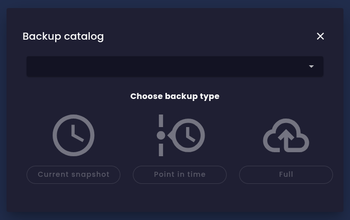

evitaDB nabízí několik způsobů, jak zálohovat vaše data. Nakonec budou všechny tyto administrativní operace přístupné prostřednictvím všech klientských API, ale v současné době je podporuje pouze gRPC/Java API (viz [issue #627](https://github.com/FgForrest/evitaDB/issues/627)). Existují tři hlavní způsoby zálohování dat – záloha PIT (point-in-time) je dostupná pouze tehdy, když je v [konfiguraci](configure.md#konfigurace-úložiště) povolena možnost *time-travel*:

Žádná z těchto možností zálohování nezasahuje do běžného provozu databáze; během vytváření zálohy můžete nadále číst i zapisovat data. Díky architektuře pouze pro přidávání může proces zálohování bezpečně běžet bez blokování jakýchkoli operací. Mějte však na paměti, že vytváření zálohy může mít určitý dopad na výkon.

<Note type="info">

Pokud potřebujete vědět více o architektuře úložiště a principech, na kterých jsou tyto možnosti zálohování založeny, podívejte se do [dokumentace k modelu úložiště](../deep-dive/storage-model.md#zálohování-a-obnovení).

</Note>

## Aktuální snímek

Aktuální snímek obsahuje kopii aktuálních dat a volitelně také obsah transakčního logu (WAL), pokud tuto možnost při vytváření zálohy zvolíte. Obsah transakčního logu je zkopírován celý a může obsahovat operace, které již byly do snímku promítnuty, i operace, které ještě nebyly aplikovány. Při obnově dat z takové zálohy je nejprve obnoven snímek a poté jsou všechny nezpracované operace z transakčního logu aplikovány v pořadí, v jakém byly původně provedeny. Tímto způsobem můžete obnovit databázi do přesného stavu, ve kterém byla v okamžiku vytvoření zálohy. Pokud do zálohy nezahrnete transakční log, databáze se obnoví do stavu v době vytvoření snímku, ale mohou chybět některé nezpracované aktualizace. Výhodou tohoto přístupu je, že záloha snímku bez WAL je nejmenší možnou zálohou, kterou můžete vytvořit.

## Snímek v čase (point-in-time snapshot)

Snímek v čase (PIT) je speciální typ zálohy, kterou lze vytvořit pouze tehdy, když je v [konfiguraci](configure.md#konfigurace-úložiště) povolena možnost *time-travel*. Tento typ zálohy obsahuje kopii databáze v konkrétním bodě v minulosti. Při vytváření takové zálohy zadáte přesný časový okamžik, který chcete zálohovat. Systém pak vytvoří snímek databáze tak, jak v daném okamžiku vypadala. To je užitečné zejména tehdy, když potřebujete obnovit databázi do konkrétního historického stavu, například po nechtěném smazání nebo poškození dat.

Existuje omezené časové okno v minulosti, pro které můžete vytvářet PIT snímky. Toto okno je omezeno dvěma nezávislými limity a ten, který je dosažen jako první, určuje, jak daleko do minulosti můžete jít.

Prvním limitem je doba uchovávání transakčního logu, která se nastavuje v [konfiguraci transakcí](configure.md#konfigurace-transakcí) pomocí parametrů *walFileSizeBytes* a *walFileCountKept*. Databáze uchovává všechna historická data pro všechny potvrzené transakce, které jsou stále přítomny v souborech transakčního logu (WAL). Když je soubor WAL smazán, jsou smazány i všechny soubory s historickými daty, na které tento WAL odkazuje.

Druhým limitem je *timeTravelSizeLimitBytes* v [konfiguraci úložiště](configure.md#konfigurace-úložiště), který omezuje, kolik místa na disku může uchovávaná historie zabírat nad rámec aktivní datové sady (výchozí hodnota je 1 GB). Pokud uchovávaná historie tento limit překročí, nejstarší historická data jsou odstraněna, dokud se opět nevejdou do limitu. Tyto dva limity počítají různé věci a neexistuje mezi nimi pevný vztah: rotace WAL je řízena počtem přidaných bajtů mutací, zatímco velikostní limit je řízen kopiemi datových souborů, které <a href="../deep-dive/storage-model.md#cleaning-up-the-clutter">kompaktace</a> zanechává. Katalog, který často provádí kompakci, tak může vyčerpat svůj velikostní rozpočet mnohem dříve, než dojde k rotaci WAL souborů.

Pokud se pokusíte vytvořit PIT snímek pro časové razítko starší než nejstarší uchovávaná historická data, operace selže. Úpravou těchto konfiguračních parametrů můžete ovlivnit, jak daleko do minulosti lze PIT snímky vytvářet. Toto období je silně závislé na aktivitě databáze – čím více aktualizací provádíte, tím více historických dat se generuje a tím rychleji dochází k rotaci WAL souborů i vyčerpání velikostního rozpočtu.

<Note type="info">

Do zálohy PIT snímku můžete také zahrnout soubory transakčního logu (WAL), ale toto je určeno pouze pro ladicí účely. Při obnově z PIT snímku, který obsahuje WAL soubory, je databáze obnovena do zadaného bodu v čase a poté jsou aplikovány všechny operace ze zahrnutých WAL souborů, které byly provedeny po tomto okamžiku. Výsledkem bude aktuální stav databáze, stejně jako při obnově z aktuálního snímku, který obsahuje WAL soubory.

</Note>

## Plná kopie souborového systému

Plná kopie souborového systému je nejjednodušší způsob zálohování databáze. Zkopíruje a zkomprimuje celý adresář úložiště katalogu, přičemž soubory jsou zpracovány ve správném pořadí. Může být poměrně velká, ale obsahuje všechna data včetně historických. Při obnově z takové zálohy je databáze obnovena do přesného stavu, ve kterém byla v okamžiku vytvoření zálohy. Z databáze obnovené tímto způsobem můžete stále provádět PIT zálohy, protože všechna historická data jsou stále přítomna.