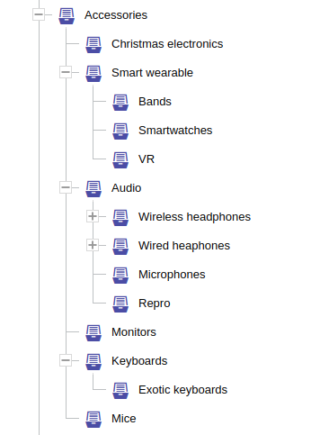
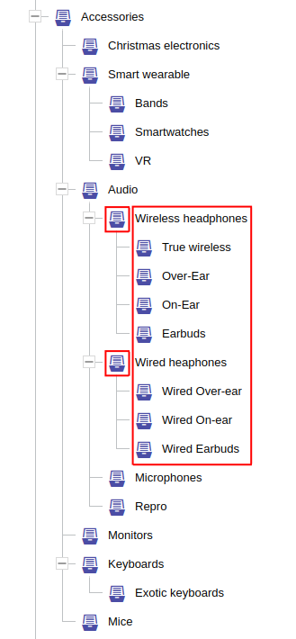
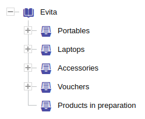
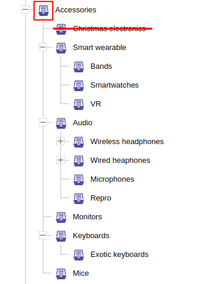
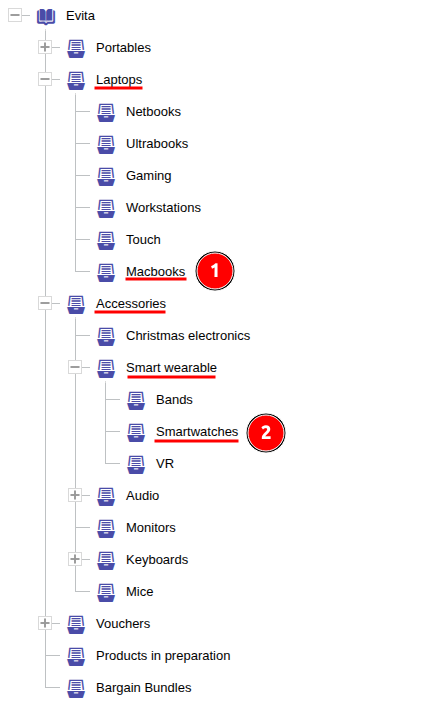
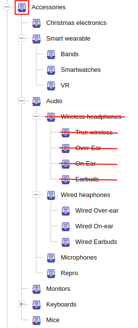

Hierarchické filtrování lze použít pouze na entity [označené jako hierarchické](../../use/data-model.md#hierarchické-umístění)
nebo na entity, které [odkazují](../../use/data-model.md#reference) na tyto hierarchické entity. Hierarchické filtrování
umožňuje filtrovat všechny přímé nebo tranzitivní potomky daného uzlu hierarchie, nebo entity, které jsou přímo nebo
tranzitivně spojené s požadovaným uzlem hierarchie nebo jeho potomky. Filtrování umožňuje vyloučit (skrýt) určité části
stromu z vyhodnocení, což může být užitečné v situaci, kdy by část obchodu měla být (dočasně) skryta
před (některými) klienty.

Kromě filtrování existují v dotazech [rozšíření požadavků](../requirements/hierarchy.md), která vám umožní
vypočítat data pro vykreslení (dynamických nebo statických) menu, která popisují kontext hierarchie požadovaný v dotazu.

**Typické případy použití související s hierarchickými omezeními:**

- [vypsání produktů v kategorii](../../solve/render-products-in-category.md)
- [vykreslení menu kategorií](../../solve/render-category-menu.md)
- [vypsání kategorií pro produkty konkrétní značky](../../solve/render-products-in-brand.md)

<Note type="warning">
V celém dotazu může být maximálně jedno jediné omezení filtru `hierarchyWithin` nebo `hierarchyRoot`.
</Note>

## Hierarchy within

Omezení <LS to="e,j,r,g"><SourceClass>evita_query/src/main/java/io/evitadb/api/query/filter/HierarchyWithin.java</SourceClass></LS><LS to="c"><SourceClass>EvitaDB.Client/Queries/Filter/HierarchyWithin.cs</SourceClass> </LS>
vám umožňuje omezit vyhledávání pouze na ty entity, které jsou součástí stromu hierarchie začínajícího kořenovým
uzlem identifikovaným prvním argumentem tohoto omezení. V e-commerce systémech je typickým zástupcem
hierarchické entity *kategorie*, která bude použita ve všech našich příkladech. Příklady v této kapitole se
zaměří na kategorii *Příslušenství* v našem [demo datasetu](../../get-started/query-our-dataset.md) s následujícím rozložením:



### Self

```evitaql-syntax
hierarchyWithin(
    filterConstraint:any!,
    filterConstraint:(directRelation|having|excluding|excludingRoot)*
)
```

<dl>
    <dt>filterConstraint:any!</dt>
    <dd>
        jedno povinné omezení filtru, které identifikuje **jeden nebo více** uzlů hierarchie, které fungují jako kořeny hierarchie;
        více omezení musí být uzavřeno v kontejnerech [AND](../logical.md#and) / [OR](../logical.md#or)
    </dd>
    <dt>filterConstraint:(directRelation|having|excluding|excludingRoot)*</dt>
    <dd>
        volitelná omezení umožňují zúžit rozsah hierarchie;
        žádné nebo všechna omezení mohou být přítomna:
        <ul>
            <li>[directRelation](#direct-relation)</li>
            <li>[having](#having)</li>
            <li>[excluding](#excluding)</li>
            <li>[excludingRoot](#excluding-root)</li>
        </ul>
    </dd>
</dl>

Nejpřímější použití je filtrování samotných hierarchických entit.

Chcete-li vypsat všechny vnořené kategorie kategorie *Příslušenství*, spusťte tento dotaz:

<SourceCodeTabs requires="evita_test/evita_functional_tests/src/test/resources/META-INF/documentation/evitaql-init.java" langSpecificTabOnly>

[Transitivní výpis kategorií](/documentation/user/en/query/filtering/examples/hierarchy/hierarchy-within-self-simple.evitaql)

</SourceCodeTabs>

... a v odpovědi byste měli dostat o něco více než jednu stránku kategorií.

<Note type="info">

<NoteTitle toggles="true">

##### Výpis všech podkategorií kategorie *Příslušenství*
</NoteTitle>

<LS to="e,j,c">

<MDInclude>[Jednoduchý příklad s jedním kořenem](/documentation/user/en/query/filtering/examples/hierarchy/hierarchy-within-self-simple.evitaql.md)</MDInclude>

</LS>

<LS to="g">

<MDInclude>[Jednoduchý příklad s jedním kořenem](/documentation/user/en/query/filtering/examples/hierarchy/hierarchy-within-self-simple.graphql.json.md)</MDInclude>

</LS>

<LS to="r">

<MDInclude>[Jednoduchý příklad s jedním kořenem](/documentation/user/en/query/filtering/examples/hierarchy/hierarchy-within-self-simple.rest.json.md)</MDInclude>

</LS>

</Note>

První argument určuje, že filtr cílí na atributy entity `Category`. V tomto příkladu jsme použili
[attributeEquals](comparable.md#atribut-rovná-se) pro unikátní atribut `code`, ale kategorii můžete vybrat
pomocí lokalizovaného atributu `url` (ale pak musíte také zadat omezení [entityLocaleEquals](locale.md#entity-locale-equals)
pro určení správného jazyka), nebo pomocí [entityPrimaryKeyInSet](constant.md#primární-klíč-entity-v-množině)
a předat primární klíč kategorie.

<Note type="info">

<NoteTitle toggles="true">

##### Může omezení filtru rodičovského uzlu odpovídat více uzlům?

</NoteTitle>

Ano, může. I když je to zjevně jeden z okrajových případů, je to možné. Tento dotaz:

<SourceCodeTabs requires="evita_test/evita_functional_tests/src/test/resources/META-INF/documentation/evitaql-init.java" langSpecificTabOnly>

[Výpis více kategorií](/documentation/user/en/query/filtering/examples/hierarchy/hierarchy-within-self-multi.evitaql)

</SourceCodeTabs>

... vrátí všechny podkategorie *Bezdrátová sluchátka* a *Drátová sluchátka* a jejich podkategorie:

<LS to="e,j,c">

<MDInclude>[Příklad s více kořeny](/documentation/user/en/query/filtering/examples/hierarchy/hierarchy-within-self-multi.evitaql.md)</MDInclude>

</LS>

<LS to="g">

<MDInclude>[Příklad s více kořeny](/documentation/user/en/query/filtering/examples/hierarchy/hierarchy-within-self-multi.graphql.json.md)</MDInclude>

</LS>

<LS to="r">

<MDInclude>[Příklad s více kořeny](/documentation/user/en/query/filtering/examples/hierarchy/hierarchy-within-self-multi.rest.json.md)</MDInclude>

</LS>



</Note>

### Referencovaná entita

```evitaql-syntax
hierarchyWithin(
    argument:string!,
    filterConstraint:any!,
    filterConstraint:(directRelation|having|excluding|excludingRoot)*
)
```

<dl>
    <dt>argument:string!</dt>
    <dd>
        povinný název dotazované [referenční schématu entity](../../use/schema.md#reference), které představuje
        vztah k hierarchickému typu entity; vaše entita může cílit na různé hierarchické entity v různých typech referencí,
        nebo může cílit na stejnou hierarchickou entitu prostřednictvím více sémanticky odlišných referencí, a proto se používá
        název reference místo typu cílové entity.
    </dd>
    <dt>filterConstraint:any!</dt>
    <dd>
        jedno povinné omezení filtru, které identifikuje **jeden nebo více** uzlů hierarchie, které fungují jako kořeny hierarchie;
        více omezení musí být uzavřeno v kontejnerech [AND](../logical.md#and) / [OR](../logical.md#or)
    </dd>
    <dt>filterConstraint:(directRelation|having|excluding|excludingRoot)*</dt>
    <dd>
        volitelná omezení umožňují zúžit rozsah hierarchie;
        žádné nebo všechna omezení mohou být přítomna:
        <ul>
            <li>[directRelation](#direct-relation)</li>
            <li>[having](#having)</li>
            <li>[excluding](#excluding)</li>
            <li>[excludingRoot](#excluding-root)</li>
        </ul>
    </dd>
</dl>

Omezení `hierarchyWithin` lze použít také pro entity, které přímo odkazují na hierarchický typ entity.
Nejčastějším případem z e-commerce světa je produkt, který je přiřazen k jedné nebo více kategoriím. Chcete-li vypsat všechny
produkty v kategorii *Příslušenství* v našem [demo datasetu](../../get-started/query-our-dataset.md), použijeme následující dotaz:

<SourceCodeTabs requires="evita_test/evita_functional_tests/src/test/resources/META-INF/documentation/evitaql-init.java" langSpecificTabOnly>

[Výpis produktů z kategorie *Příslušenství*](/documentation/user/en/query/filtering/examples/hierarchy/hierarchy-within-reference-simple.evitaql)

</SourceCodeTabs>

Produkty přiřazené do dvou nebo více podkategorií kategorie *Příslušenství* se v odpovědi objeví pouze jednou (na rozdíl
od toho, co byste mohli očekávat, pokud máte zkušenosti s SQL).

Dotaz vrací první stránku z celkem 26 stránek položek.

<Note type="info">

<NoteTitle toggles="true">

##### Výpis všech produktů v kategorii *Příslušenství* nebo jejích podkategoriích

</NoteTitle>

<LS to="e,j,c">

<MDInclude>[Výpis produktů z kategorie *Příslušenství*](/documentation/user/en/query/filtering/examples/hierarchy/hierarchy-within-reference-simple.evitaql.md)</MDInclude>

</LS>

<LS to="g">

<MDInclude>[Výpis produktů z kategorie *Příslušenství*](/documentation/user/en/query/filtering/examples/hierarchy/hierarchy-within-reference-simple.graphql.json.md)</MDInclude>

</LS>

<LS to="r">

<MDInclude>[Výpis produktů z kategorie *Příslušenství*](/documentation/user/en/query/filtering/examples/hierarchy/hierarchy-within-reference-simple.rest.json.md)</MDInclude>

</LS>

</Note>

Omezení filtru kategorie určuje podmínku, která cílí na referencovanou entitu (tj. atributy kategorie,
reference kategorie). V současné době není možné specifikovat omezení filtru, které by zohledňovalo produktovou
referenci vedoucí do její kategorie. [Problém #105](https://github.com/FgForrest/evitaDB/issues/105) je plánován
k vyřešení tohoto nedostatku.

## Hierarchy within root

Omezení <LS to="e,j,r,g"><SourceClass>evita_query/src/main/java/io/evitadb/api/query/filter/HierarchyWithinRoot.java</SourceClass></LS><LS to="c"><SourceClass>EvitaDB.Client/Queries/Filter/HierarchyWithinRoot.cs</SourceClass></LS>
vám umožňuje omezit vyhledávání pouze na ty entity, které jsou součástí celého stromu hierarchie. V e-commerce
systémech je typickým zástupcem hierarchické entity *kategorie*, která bude použita ve všech našich příkladech.

Jediný rozdíl oproti [omezení hierarchyWithin](#hierarchy-within) je, že nepřijímá specifikaci kořenového uzlu.
Protože evitaDB umožňuje více kořenových uzlů ve vaší hierarchii entit, může být užitečné si představit,
že nad všemi vrcholovými uzly (jejichž vlastnost `parent` zůstává `NULL`) existuje neviditelný "virtuální" nejvyšší kořen,
na který toto omezení cílí.



### Self

```evitaql-syntax
hierarchyWithinRoot(
    filterConstraint:(directRelation|having|excluding)*
)
```

<dl>
    <dt>filterConstraint:(directRelation|having|excluding)*</dt>
    <dd>
        volitelná omezení umožňují zúžit rozsah hierarchie;
        žádné nebo všechna omezení mohou být přítomna:
        <ul>
            <li>[directRelation](#direct-relation)</li>
            <li>[having](#having)</li>
            <li>[excluding](#excluding)</li>
        </ul>
    </dd>
</dl>

Omezení `hierarchyWithinRoot`, které cílí na kolekci `Category` samotnou, vrací všechny kategorie kromě těch,
které by ukazovaly na neexistující rodičovské uzly. Takové uzly hierarchie se nazývají [sirotci](../../use/schema.md#sirotčí-uzly-v-hierarchii)
a nevyhovují žádnému hierarchickému dotazu.

<SourceCodeTabs requires="evita_test/evita_functional_tests/src/test/resources/META-INF/documentation/evitaql-init.java" langSpecificTabOnly>

[Výpis kategorií](/documentation/user/en/query/filtering/examples/hierarchy/hierarchy-within-root-simple.evitaql)

</SourceCodeTabs>

Dotaz vrací první stránku z celkem 2 stránek položek.

<Note type="info">

<NoteTitle toggles="true">

##### Výpis všech kategorií ve stromu hierarchie

</NoteTitle>

<LS to="e,j,c">

<MDInclude>[Výpis kategorií](/documentation/user/en/query/filtering/examples/hierarchy/hierarchy-within-root-simple.evitaql.md)</MDInclude>

</LS>

<LS to="g">

<MDInclude>[Výpis kategorií](/documentation/user/en/query/filtering/examples/hierarchy/hierarchy-within-root-simple.graphql.json.md)</MDInclude>

</LS>

<LS to="r">

<MDInclude>[Výpis kategorií](/documentation/user/en/query/filtering/examples/hierarchy/hierarchy-within-root-simple.rest.json.md)</MDInclude>

</LS>

</Note>

### Referencovaná entita

```evitaql-syntax
hierarchyWithinRoot(
    argument:string!,
    filterConstraint:(having|excluding)*
)
```

<dl>
    <dt>argument:string!</dt>
    <dd>
        povinný název dotazované [referenční schématu entity](../../use/schema.md#reference), které představuje
        vztah k hierarchickému typu entity; vaše entita může cílit na různé hierarchické entity v různých typech referencí,
        nebo může cílit na stejnou hierarchickou entitu prostřednictvím více sémanticky odlišných referencí, a proto se používá
        název reference místo typu cílové entity.
    </dd>
    <dt>filterConstraint:(having|excluding)*</dt>
    <dd>
        volitelná omezení umožňují zúžit rozsah hierarchie;
        žádné nebo všechna omezení mohou být přítomna:
        <ul>
            <li>[directRelation](#direct-relation)</li>
            <li>[having](#having)</li>
            <li>[excluding](#excluding)</li>
        </ul>
    </dd>
</dl>

Omezení `hierarchyWithinRoot` lze použít také pro entity, které přímo odkazují na hierarchický typ entity.
Nejčastějším případem z e-commerce světa je produkt, který je přiřazen k jedné nebo více kategoriím. Chcete-li vypsat všechny
produkty přiřazené do jakékoli kategorie v našem [demo datasetu](../../get-started/query-our-dataset.md), použijeme následující dotaz:

<SourceCodeTabs requires="evita_test/evita_functional_tests/src/test/resources/META-INF/documentation/evitaql-init.java" langSpecificTabOnly>

[Výpis produktů přiřazených ke kategorii](/documentation/user/en/query/filtering/examples/hierarchy/hierarchy-within-root-reference-simple.evitaql)

</SourceCodeTabs>

Produkty přiřazené pouze k jedné [sirotčí kategorii](../../use/schema.md#sirotčí-uzly-v-hierarchii) budou v
výsledku chybět. Produkty přiřazené ke dvěma nebo více kategoriím se v odpovědi objeví pouze jednou (na rozdíl od toho,
co byste mohli očekávat, pokud máte zkušenosti s SQL).

Dotaz vrací první stránku z celkem 212 stránek položek:

<Note type="info">

<NoteTitle toggles="true">

##### Výpis všech produktů přiřazených ke kterékoliv kategorii ve stromu hierarchie

</NoteTitle>

<LS to="e,j,c">

<MDInclude>[Výpis produktů přiřazených ke kategorii](/documentation/user/en/query/filtering/examples/hierarchy/hierarchy-within-root-reference-simple.evitaql.md)</MDInclude>

</LS>

<LS to="g">

<MDInclude>[Výpis produktů přiřazených ke kategorii](/documentation/user/en/query/filtering/examples/hierarchy/hierarchy-within-root-reference-simple.graphql.json.md)</MDInclude>

</LS>

<LS to="r">

<MDInclude>[Výpis produktů přiřazených ke kategorii](/documentation/user/en/query/filtering/examples/hierarchy/hierarchy-within-root-reference-simple.rest.json.md)</MDInclude>

</LS>

</Note>

## Direct relation

Omezení <LS to="e,j,r,g"><SourceClass>evita_query/src/main/java/io/evitadb/api/query/filter/HierarchyDirectRelation.java</SourceClass></LS><LS to="c"><SourceClass>EvitaDB.Client/Queries/Filter/HierarchyDirectRelation.cs</SourceClass></LS>
je omezení, které lze použít pouze v rámci nadřazených omezení `hierarchyWithin` nebo `hierarchyWithinRoot`. Jinde
nedává smysl, protože mění výchozí chování těchto omezení. Hierarchická omezení vrací
všechny potomky hierarchie rodičovského uzlu nebo entity, které jsou s nimi přímo nebo tranzitivně spojené, a také samotný rodičovský uzel.
Pokud je `directRelation` použito jako podřízené omezení, toto chování se změní a jsou vráceni pouze přímí potomci nebo
přímo odkazující entity.

```evitaql-syntax
directRelation()
```

### Self

Pokud hierarchické omezení cílí na hierarchickou entitu, `directRelation` způsobí, že budou vráceny pouze děti
přímého rodičovského uzlu. V případě omezení `hierarchyWithinRoot` je rodičem neviditelný "virtuální"
nejvyšší kořen – takže jsou vráceny pouze nejvyšší kategorie.

<SourceCodeTabs requires="evita_test/evita_functional_tests/src/test/resources/META-INF/documentation/evitaql-init.java" langSpecificTabOnly>

[Výpis nejvyšších kategorií](/documentation/user/en/query/filtering/examples/hierarchy/hierarchy-within-self-top-categories.evitaql)

</SourceCodeTabs>

<Note type="info">

<NoteTitle toggles="true">

##### Výpis všech kořenových kategorií hierarchie

</NoteTitle>

<LS to="e,j,c">

<MDInclude>[Výpis nejvyšších kategorií](/documentation/user/en/query/filtering/examples/hierarchy/hierarchy-within-self-top-categories.evitaql.md)</MDInclude>

</LS>

<LS to="g">

<MDInclude>[Výpis nejvyšších kategorií](/documentation/user/en/query/filtering/examples/hierarchy/hierarchy-within-self-top-categories.graphql.json.md)</MDInclude>

</LS>

<LS to="r">

<MDInclude>[Výpis nejvyšších kategorií](/documentation/user/en/query/filtering/examples/hierarchy/hierarchy-within-self-top-categories.rest.json.md)</MDInclude>

</LS>

</Note>

V případě `hierarchyWithin` bude výsledek obsahovat přímé děti filtrované kategorie (nebo kategorií).

<SourceCodeTabs requires="evita_test/evita_functional_tests/src/test/resources/META-INF/documentation/evitaql-init.java" langSpecificTabOnly>

[Výpis podkategorií Příslušenství](/documentation/user/en/query/filtering/examples/hierarchy/hierarchy-within-self-direct-categories.evitaql)

</SourceCodeTabs>

<Note type="info">

<NoteTitle toggles="true">

##### Výpis všech přímých podkategorií kategorie *Příslušenství*
</NoteTitle>

<LS to="e,j,c">

<MDInclude>[Výpis podkategorií Příslušenství](/documentation/user/en/query/filtering/examples/hierarchy/hierarchy-within-self-direct-categories.evitaql.md)</MDInclude>

</LS>

<LS to="g">

<MDInclude>[Výpis podkategorií Příslušenství](/documentation/user/en/query/filtering/examples/hierarchy/hierarchy-within-self-direct-categories.graphql.json.md)</MDInclude>

</LS>

<LS to="r">

<MDInclude>[Výpis podkategorií Příslušenství](/documentation/user/en/query/filtering/examples/hierarchy/hierarchy-within-self-direct-categories.rest.json.md)</MDInclude>

</LS>

</Note>

### Referencovaná entita

Pokud hierarchické omezení cílí na nehierarchickou entitu, která odkazuje na hierarchickou (typickým příkladem je
produkt přiřazený ke kategorii), lze jej použít pouze v nadřazeném omezení `hierarchyWithin`.

V případě `hierarchyWithinRoot` omezení `directRelation` nedává smysl, protože žádná entita nemůže být přiřazena
k "virtuálnímu" nejvyššímu rodičovskému kořeni.

Můžeme tedy vypsat pouze produkty, které jsou přímo přiřazeny ke konkrétní kategorii – pokud se pokusíme vypsat produkty,
které mají přiřazenou kategorii *Příslušenství*:

<SourceCodeTabs requires="evita_test/evita_functional_tests/src/test/resources/META-INF/documentation/evitaql-init.java" langSpecificTabOnly>

[Produkty přímo přiřazené ke kategorii Příslušenství](/documentation/user/en/query/filtering/examples/hierarchy/hierarchy-within-reference-direct-categories.evitaql)

</SourceCodeTabs>

... dostaneme prázdný výsledek. Neexistují žádné produkty přímo přiřazené ke kategorii *Příslušenství*, všechny odkazují na
některou z jejích podkategorií. Zkusme podkategorii *Chytré hodinky*:

<SourceCodeTabs requires="evita_test/evita_functional_tests/src/test/resources/META-INF/documentation/evitaql-init.java" langSpecificTabOnly>

[Produkty přímo přiřazené ke kategorii Chytré hodinky](/documentation/user/en/query/filtering/examples/hierarchy/hierarchy-within-reference-direct-categories-smart.evitaql)

</SourceCodeTabs>

... a získáme seznam všech produktů přímo přiřazených ke kategorii *Chytré hodinky*.

<Note type="info">

<NoteTitle toggles="true">

##### Výpis všech produktů přímo přiřazených ke kategorii *Chytré hodinky*
</NoteTitle>

<LS to="e,j,c">

<MDInclude>[Produkt přímo přiřazený ke kategorii Chytré hodinky](/documentation/user/en/query/filtering/examples/hierarchy/hierarchy-within-reference-direct-categories-smart.evitaql.md)</MDInclude>

</LS>

<LS to="g">

<MDInclude>[Produkt přímo přiřazený ke kategorii Chytré hodinky](/documentation/user/en/query/filtering/examples/hierarchy/hierarchy-within-reference-direct-categories-smart.graphql.json.md)</MDInclude>

</LS>

<LS to="r">

<MDInclude>[Produkt přímo přiřazený ke kategorii Chytré hodinky](/documentation/user/en/query/filtering/examples/hierarchy/hierarchy-within-reference-direct-categories-smart.rest.json.md)</MDInclude>

</LS>

</Note>

## Excluding root

Omezení <LS to="e,j,r,g"><SourceClass>evita_query/src/main/java/io/evitadb/api/query/filter/HierarchyExcludingRoot.java</SourceClass></LS><LS to="c"><SourceClass>EvitaDB.Client/Queries/Filter/HierarchyExcludingRoot.cs</SourceClass></LS>
je omezení, které lze použít pouze v rámci nadřazených omezení `hierarchyWithin` nebo `hierarchyWithinRoot`. Jinde
nedává smysl, protože mění výchozí chování těchto omezení. Hierarchická omezení vrací
všechny potomky hierarchie rodičovského uzlu nebo entity, které jsou s nimi přímo nebo tranzitivně spojené, a také samotný rodičovský uzel.
Když je `excludingRoot` použito jako podřízené omezení, toto chování se změní a samotný rodičovský uzel nebo entity
přímo spojené s tímto rodičovským uzlem jsou z výsledku vyloučeny.

```evitaql-syntax
excludingRoot()
```

### Self

Pokud hierarchické omezení cílí na hierarchickou entitu, `excludingRoot` vynechá požadovaný rodičovský uzel z výsledku.
V případě omezení `hierarchyWithinRoot` je rodičem neviditelný "virtuální" nejvyšší kořen, a toto omezení
nedává smysl.

<SourceCodeTabs requires="evita_test/evita_functional_tests/src/test/resources/META-INF/documentation/evitaql-init.java" langSpecificTabOnly>

[Výpis kategorií bez rodiče](/documentation/user/en/query/filtering/examples/hierarchy/hierarchy-within-self-excluding-root.evitaql)

</SourceCodeTabs>

Jak vidíme, požadovaná rodičovská kategorie *Příslušenství* je z výsledku vyloučena.

<Note type="info">

<NoteTitle toggles="true">

##### Výpis všech podkategorií kategorie *Příslušenství* kromě samotné kategorie *Příslušenství*

</NoteTitle>

<LS to="e,j,c">

<MDInclude>[Výpis kategorií bez rodiče](/documentation/user/en/query/filtering/examples/hierarchy/hierarchy-within-self-excluding-root.evitaql.md)</MDInclude>

</LS>

<LS to="g">

<MDInclude>[Výpis kategorií bez rodiče](/documentation/user/en/query/filtering/examples/hierarchy/hierarchy-within-self-excluding-root.graphql.json.md)</MDInclude>

</LS>

<LS to="r">

<MDInclude>[Výpis kategorií bez rodiče](/documentation/user/en/query/filtering/examples/hierarchy/hierarchy-within-self-excluding-root.rest.json.md)</MDInclude>

</LS>

</Note>

### Referencovaná entita

Pokud hierarchické omezení cílí na nehierarchickou entitu, která odkazuje na hierarchickou (typickým příkladem je
produkt přiřazený ke kategorii), lze omezení `excludingRoot` použít pouze v nadřazeném omezení `hierarchyWithin`.

V případě `hierarchyWithinRoot` omezení `excludingRoot` nedává smysl, protože žádná entita nemůže být přiřazena
k "virtuálnímu" nejvyššímu rodičovskému kořeni.

Protože jsme zjistili, že kategorie *Příslušenství* nemá přímo přiřazené produkty, přítomnost omezení `excludingRoot`
by výsledek dotazu neovlivnila. Proto zvolíme kategorii *Klávesnice* pro náš příklad. Když vypíšeme všechny produkty
v kategorii *Klávesnice* pomocí omezení `hierarchyWithin`, získáme **20 položek**. Když použijeme omezení `excludingRoot`:

<SourceCodeTabs requires="evita_test/evita_functional_tests/src/test/resources/META-INF/documentation/evitaql-init.java" langSpecificTabOnly>

[Produkty v podkategoriích kategorie Klávesnice](/documentation/user/en/query/filtering/examples/hierarchy/hierarchy-within-reference-excluding-root.evitaql)

</SourceCodeTabs>

... dostaneme pouze **4 položky**, což znamená, že 16 bylo přiřazeno přímo ke kategorii *Klávesnice* a pouze 4 z nich byly
přiřazeny ke kategorii *Exotické klávesnice*:

<Note type="info">

<NoteTitle toggles="true">

##### Výpis všech produktů přiřazených k podkategoriím kategorie *Klávesnice* kromě samotné kategorie *Klávesnice*
</NoteTitle>

<LS to="e,j,c">

<MDInclude>[Produkty v podkategoriích kategorie Klávesnice](/documentation/user/en/query/filtering/examples/hierarchy/hierarchy-within-reference-excluding-root.evitaql.md)</MDInclude>

</LS>

<LS to="g">

<MDInclude>[Produkty v podkategoriích kategorie Klávesnice](/documentation/user/en/query/filtering/examples/hierarchy/hierarchy-within-reference-excluding-root.graphql.json.md)</MDInclude>

</LS>

<LS to="r">

<MDInclude>[Produkty v podkategoriích kategorie Klávesnice](/documentation/user/en/query/filtering/examples/hierarchy/hierarchy-within-reference-excluding-root.rest.json.md)</MDInclude>

</LS>

</Note>

## Having

Omezení <LS to="e,j,r,g"><SourceClass>evita_query/src/main/java/io/evitadb/api/query/filter/HierarchyHaving.java</SourceClass></LS><LS to="c"><SourceClass>EvitaDB.Client/Queries/Filter/HierarchyHaving.cs</SourceClass></LS>
je omezení, které lze použít pouze v rámci nadřazených omezení `hierarchyWithin` nebo `hierarchyWithinRoot`. Jinde
nedává smysl, protože mění výchozí chování těchto omezení. Hierarchická omezení vrací
všechny potomky hierarchie rodičovského uzlu nebo entity, které jsou s nimi přímo nebo tranzitivně spojené, a také samotný rodičovský uzel.

Omezení `having` vám umožňuje nastavit omezení, které musí být splněno všemi kategoriemi v rozsahu kategorie,
aby bylo přijato filtrem hierarchy within. Toto omezení je užitečné zejména tehdy, pokud chcete podmíněně
zobrazit určité části stromu. Představte si, že máte kategorii *Vánoční akce*, která by měla být dostupná pouze během
určitého období roku, nebo kategorii *B2B partneři*, která by měla být přístupná pouze určité roli uživatelů.
Všechny tyto scénáře mohou využít omezení `having` (ale existují i jiné přístupy k řešení výše uvedených případů).

<Note type="warning">

<NoteTitle toggles="false">

##### Prohledávání se zastaví u prvního uzlu, který nesplňuje omezení!

</NoteTitle>

Hierarchický dotaz prochází od kořenových uzlů ke koncovým uzlům. U každého uzlu engine ověří, zda je omezení
`having` stále platné, a pokud ne, vyloučí tento uzel hierarchie a všechny jeho potomky (celou podvětev).

</Note>

```evitaql-syntax
having(
    filterConstraint:+
)
```

<dl>
    <dt>filterConstraint:+</dt>
    <dd>
        jedno nebo více povinných omezení, která musí být splněna všemi vrácenými uzly hierarchie a která označují
        viditelnou část stromu, implicitní vztah mezi omezeními je logická konjunkce (boolean AND)
    </dd>
</dl>

### Self

Když hierarchické omezení cílí na hierarchickou entitu, děti, které nesplňují vnitřní omezení (a jejich děti,
ať už je splňují nebo ne), jsou z výsledku vyloučeny.

Pro demonstrační účely vypíšeme všechny kategorie v rámci kategorie *Příslušenství*, ale pouze ty, které jsou platné
k 1. říjnu 2023 v 01:00.



<SourceCodeTabs requires="evita_test/evita_functional_tests/src/test/resources/META-INF/documentation/evitaql-init.java" langSpecificTabOnly>

[Výpis kategorií bez rodiče](/documentation/user/en/query/filtering/examples/hierarchy/hierarchy-within-self-having.evitaql)

</SourceCodeTabs>

Protože kategorie *Vánoční elektronika* má platnost nastavenu pouze mezi 1. prosincem a 24. prosincem,
bude z výsledku vynechána. Pokud by měla podkategorie, byly by také vynechány (i kdyby neměly žádná omezení platnosti).

<Note type="info">

<NoteTitle toggles="true">

##### Výpis všech platných podkategorií kategorie *Příslušenství*
</NoteTitle>

<LS to="e,j,c">

<MDInclude>[Výpis kategorií Příslušenství s omezením platnosti](/documentation/user/en/query/filtering/examples/hierarchy/hierarchy-within-self-having.evitaql.md)</MDInclude>

</LS>

<LS to="g">

<MDInclude>[Výpis kategorií Příslušenství s omezením platnosti](/documentation/user/en/query/filtering/examples/hierarchy/hierarchy-within-self-having.graphql.json.md)</MDInclude>

</LS>

<LS to="r">

<MDInclude>[Výpis kategorií Příslušenství s omezením platnosti](/documentation/user/en/query/filtering/examples/hierarchy/hierarchy-within-self-having.rest.json.md)</MDInclude>

</LS>

</Note>

### Referencovaná entita

Pokud hierarchické omezení cílí na nehierarchickou entitu, která odkazuje na hierarchickou (typickým příkladem je
produkt přiřazený ke kategorii), je omezení `having` vyhodnocováno vůči hierarchické entitě (kategorii), ale
ovlivňuje dotazované nehierarchické entity (produkty). Vyloučí všechny produkty odkazující na kategorie, které
nesplňují vnitřní omezení `having`.

Opět použijme náš příklad s *Vánoční elektronikou*, která je platná pouze mezi 1. a 24. prosincem. Chcete-li vypsat všechny
produkty dostupné 1. října 2023 v 01:00, spusťte následující dotaz:

<SourceCodeTabs requires="evita_test/evita_functional_tests/src/test/resources/META-INF/documentation/evitaql-init.java" langSpecificTabOnly>

[Výpis kategorií bez rodiče](/documentation/user/en/query/filtering/examples/hierarchy/hierarchy-within-reference-having.evitaql)

</SourceCodeTabs>

Můžete vidět, že vánoční produkty jako *Retlux Blue christmas lightning*, *Retlux Warm white christmas lightning* nebo
*Emos Candlestick* nejsou ve výpisu přítomné.

<Note type="info">

<NoteTitle toggles="true">

##### Výpis všech produktů *Příslušenství* platných v říjnu 2023

</NoteTitle>

<LS to="e,j,c">

<MDInclude>[Výpis produktů kategorie Příslušenství s omezením platnosti](/documentation/user/en/query/filtering/examples/hierarchy/hierarchy-within-reference-having.evitaql.md)</MDInclude>

</LS>

<LS to="g">

<MDInclude>[Výpis produktů kategorie Příslušenství s omezením platnosti](/documentation/user/en/query/filtering/examples/hierarchy/hierarchy-within-reference-having.graphql.json.md)</MDInclude>

</LS>

<LS to="r">

<MDInclude>[Výpis produktů kategorie Příslušenství s omezením platnosti](/documentation/user/en/query/filtering/examples/hierarchy/hierarchy-within-reference-having.rest.json.md)</MDInclude>

</LS>

</Note>

Když změníte datum a čas v rozsahu omezení pro atribut *validity* na 2. prosince:

<SourceCodeTabs requires="evita_test/evita_functional_tests/src/test/resources/META-INF/documentation/evitaql-init.java" langSpecificTabOnly>

[Výpis kategorií bez rodiče](/documentation/user/en/query/filtering/examples/hierarchy/hierarchy-within-reference-having-december.evitaql)

</SourceCodeTabs>

... uvidíte všechny tyto produkty v kategorii *Vánoční elektronika*.

<Note type="info">

<NoteTitle toggles="true">

##### Výpis všech produktů *Příslušenství* platných v prosinci 2023
</NoteTitle>

<LS to="e,j,c">

<MDInclude>[Výpis produktů kategorie Příslušenství s omezením platnosti](/documentation/user/en/query/filtering/examples/hierarchy/hierarchy-within-reference-having-december.evitaql.md)</MDInclude>

</LS>

<LS to="g">

<MDInclude>[Výpis produktů kategorie Příslušenství s omezením platnosti](/documentation/user/en/query/filtering/examples/hierarchy/hierarchy-within-reference-having-december.graphql.json.md)</MDInclude>

</LS>

<LS to="r">

<MDInclude>[Výpis produktů kategorie Příslušenství s omezením platnosti](/documentation/user/en/query/filtering/examples/hierarchy/hierarchy-within-reference-having-december.rest.json.md)</MDInclude>

</LS>

</Note>

<Note type="warning">

<NoteTitle toggles="true">

##### Co když je produkt přiřazen ke dvěma kategoriím – jedné, která splňuje omezení, a jedné, která ne?

</NoteTitle>

V situaci, kdy je jeden produkt, například *Garmin Vivosmart 5*, jak v vyloučené kategorii *Vánoční elektronika*,
tak v zahrnuté kategorii *Chytré hodinky*, jak je znázorněno na následujícím schématu:


... zůstane ve výsledku dotazu, protože existuje alespoň jedna produktová reference, která je součástí viditelné části
stromu.

</Note>

## Any Having

Omezení <LS to="e,j,r,g"><SourceClass>evita_query/src/main/java/io/evitadb/api/query/filter/HierarchyAnyHaving.java</SourceClass></LS><LS to="c"><SourceClass>EvitaDB.Client/Queries/Filter/HierarchyAnyHaving.cs</SourceClass></LS>
je omezení, které lze použít pouze v rámci nadřazených omezení `hierarchyWithin` nebo `hierarchyWithinRoot`. Jinde
nedává smysl, protože mění výchozí chování těchto omezení. Hierarchická omezení vrací
všechny potomky hierarchie rodičovského uzlu, stejně jako entity, které jsou s nimi přímo nebo tranzitivně spojené, a také samotný rodičovský uzel.

Omezení `anyHaving` vám umožňuje nastavit podmínku, kterou musí splnit alespoň jedna vnořená hierarchická entita,
aby byl filtr akceptován.

```evitaql-syntax
anyHaving(
    filterConstraint:+
)
```

<dl>
    <dt>filterConstraint:+</dt>
    <dd>
        jedno nebo více povinných omezení, která musí být splněna alespoň jedním podřízeným uzlem zkoumaného uzlu hierarchie
        nebo přímo tímto zkoumaným uzlem hierarchie, implicitní vztah mezi omezeními je logická konjunkce (boolean AND)
    </dd>
</dl>

### Self

Představte si, že chcete strom kategorií a chcete ověřit, zda určité kategorie, buď přímo nebo nepřímo prostřednictvím
jejich podkategorií, obsahují alespoň jeden platný produkt. Toho lze dosáhnout pomocí omezení `anyHaving` ve vašem dotazu.

Když hierarchické omezení cílí na hierarchickou entitu, děti, které nemají žádné dítě splňující vnitřní omezení,
jsou z výsledku vyloučeny.

Například napišme dotaz pro následující situaci. V našem stromě hierarchie máme dvě kategorie označené tagem *HP*:



Chceme vypsat všechny kategorie obsahující označenou kategorii s alespoň jedním aktivním produktem přiřazeným k ní. Zvažujeme pouze
cesty stromu složené z aktivních kategorií. Dotaz bude vypadat takto:

<SourceCodeTabs requires="evita_test/evita_functional_tests/src/test/resources/META-INF/documentation/evitaql-init.java" langSpecificTabOnly>

[Filtrování kategorií, které mají alespoň jeden produkt, tranzitivně](/documentation/user/en/query/filtering/examples/hierarchy/hierarchy-within-self-any-having.evitaql)

</SourceCodeTabs>

Naštěstí obě kategorie označené tagem *HP* mají přiřazen alespoň jeden aktivní produkt, stejně jako všechny jejich
rodičovské kategorie. Proto dotaz vrací pět kategorií, jak bylo očekáváno.

<Note type="info">

<NoteTitle toggles="true">

##### Výpis všech podkategorií s tagem HP a jejich rodičovských kategorií
</NoteTitle>

<LS to="e,j,c">

<MDInclude>[Výpis všech podkategorií s tagem HP a jejich rodičovských kategorií](/documentation/user/en/query/filtering/examples/hierarchy/hierarchy-within-self-any-having.evitaql.md)</MDInclude>

</LS>

<LS to="g">

<MDInclude>[Výpis všech podkategorií s tagem HP a jejich rodičovských kategorií](/documentation/user/en/query/filtering/examples/hierarchy/hierarchy-within-self-any-having.graphql.json.md)</MDInclude>

</LS>

<LS to="r">

<MDInclude>[Výpis všech podkategorií s tagem HP a jejich rodičovských kategorií](/documentation/user/en/query/filtering/examples/hierarchy/hierarchy-within-self-any-having.rest.json.md)</MDInclude>

</LS>

</Note>

### Referencovaná entita

Pokud hierarchické omezení cílí na nehierarchickou entitu, která odkazuje na hierarchickou (typickým příkladem je
produkt přiřazený ke kategorii), je omezení `anyHaving` vyhodnocováno vůči hierarchické entitě (kategorii), ale
ovlivňuje dotazované nehierarchické entity (produkty). Vyloučí všechny produkty odkazující na kategorie, které
nesplňují vnitřní omezení `anyHaving`.

Opět použijme náš příklad kategorií označených tagem *HP*. Spusťte následující dotaz:

<SourceCodeTabs requires="evita_test/evita_functional_tests/src/test/resources/META-INF/documentation/evitaql-init.java" langSpecificTabOnly>

[Výpis kategorií bez rodiče](/documentation/user/en/query/filtering/examples/hierarchy/hierarchy-within-reference-any-having.evitaql)

</SourceCodeTabs>

V tomto případě bude výsledkem seznam všech aktivních produktů s typem produktu *BASIC* nebo *MASTER* v kategoriích
označených tagem *HP*, stejně jako všechny produkty v jejich rodičovských kategoriích. Jak vidíte, produktů je poměrně hodně,
protože je vrácen i produkt z celé kategorie *Laptop* (která je rodičem kategorie *Macbooks*).

<Note type="info">

<NoteTitle toggles="true">

##### Výpis všech produktů v kategoriích s tagem HP a jejich rodičovských kategoriích
</NoteTitle>

<LS to="e,j,c">

<MDInclude>[Výpis všech produktů v kategoriích s tagem HP a jejich rodičovských kategoriích](/documentation/user/en/query/filtering/examples/hierarchy/hierarchy-within-reference-any-having.evitaql.md)</MDInclude>

</LS>

<LS to="g">

<MDInclude>[Výpis všech produktů v kategoriích s tagem HP a jejich rodičovských kategoriích](/documentation/user/en/query/filtering/examples/hierarchy/hierarchy-within-reference-any-having.graphql.json.md)</MDInclude>

</LS>

<LS to="r">

<MDInclude>[Výpis všech produktů v kategoriích s tagem HP a jejich rodičovských kategoriích](/documentation/user/en/query/filtering/examples/hierarchy/hierarchy-within-reference-any-having.rest.json.md)</MDInclude>

</LS>

</Note>

## Excluding

Omezení <LS to="e,j,r,g"><SourceClass>evita_query/src/main/java/io/evitadb/api/query/filter/HierarchyExcluding.java</SourceClass></LS><LS to="c"><SourceClass>EvitaDB.Client/Queries/Filter/HierarchyExcluding.cs</SourceClass></LS>
je omezení, které lze použít pouze v rámci nadřazených omezení `hierarchyWithin` nebo `hierarchyWithinRoot`. Jinde
nedává smysl, protože mění výchozí chování těchto omezení. Hierarchická omezení vrací
všechny potomky hierarchie rodičovského uzlu nebo entity, které jsou s nimi přímo nebo tranzitivně spojené, a také samotný rodičovský uzel.

Omezení `excluding` vám umožňuje vyloučit jednu nebo více podvětví ze záběru filtru. Toto omezení je
přesným opakem omezení [`having`](#having). Pokud je omezení pravdivé pro hierarchickou entitu, ona i všechny
její děti jsou z dotazu vyloučeny. Omezení `excluding` je stejné jako deklarace
`having(not(expression))`, ale kvůli čitelnosti má vlastní omezení.

<Note type="warning">

<NoteTitle toggles="false">

##### Prohledávání se zastaví u prvního uzlu, který splní omezení!
</NoteTitle>

Hierarchický dotaz prochází od kořenových uzlů ke koncovým uzlům. U každého uzlu engine ověří, zda je omezení
`excluding` splněno, a pokud ano, vyloučí tento uzel hierarchie a všechny jeho potomky (celou podvětev).

</Note>

```evitaql-syntax
excluding(
    filterConstraint:+
)
```

<dl>
    <dt>filterConstraint:+</dt>
    <dd>
        jedno nebo více povinných omezení, která musí být splněna všemi vrácenými uzly hierarchie a která označují
        viditelnou část stromu, implicitní vztah mezi omezeními je logická konjunkce (boolean AND)
    </dd>
</dl>

### Self

Když hierarchické omezení cílí na hierarchickou entitu, děti, které splňují vnitřní omezení (a jejich děti,
ať už je splňují nebo ne), jsou z výsledku vyloučeny.

Pro demonstrační účely vypíšeme všechny kategorie v rámci kategorie *Příslušenství*, ale vyloučíme přesně
podkategorii *Bezdrátová sluchátka*.



<SourceCodeTabs requires="evita_test/evita_functional_tests/src/test/resources/META-INF/documentation/evitaql-init.java" langSpecificTabOnly>

[Výpis kategorií bez rodiče](/documentation/user/en/query/filtering/examples/hierarchy/hierarchy-within-self-excluding.evitaql)

</SourceCodeTabs>

Kategorie *Bezdrátová sluchátka* a všechny její podkategorie nebudou ve výsledcích zobrazeny.

<Note type="info">

<NoteTitle toggles="true">

##### Výpis všech podkategorií kategorie *Příslušenství* kromě *Bezdrátová sluchátka*
</NoteTitle>

<LS to="e,j,c">

<MDInclude>[Výpis kategorií Příslušenství bez *Bezdrátová sluchátka*](/documentation/user/en/query/filtering/examples/hierarchy/hierarchy-within-self-excluding.evitaql.md)</MDInclude>

</LS>

<LS to="g">

<MDInclude>[Výpis kategorií Příslušenství bez *Bezdrátová sluchátka*](/documentation/user/en/query/filtering/examples/hierarchy/hierarchy-within-self-excluding.graphql.json.md)</MDInclude>

</LS>

<LS to="r">

<MDInclude>[Výpis kategorií Příslušenství bez *Bezdrátová sluchátka*](/documentation/user/en/query/filtering/examples/hierarchy/hierarchy-within-self-excluding.rest.json.md)</MDInclude>

</LS>

</Note>

### Referencovaná entita

Pokud hierarchické omezení cílí na nehierarchickou entitu, která odkazuje na hierarchickou (typickým příkladem je
produkt přiřazený ke kategorii), je omezení `excluding` vyhodnocováno vůči hierarchické entitě (kategorii),
ale ovlivňuje dotazované nehierarchické entity (produkty). Vyloučí všechny produkty odkazující na kategorie, které
splňují vnitřní omezení `excluding`.

Vraťme se k našemu příkladu dotazu, který vylučuje podstrom kategorie *Bezdrátová sluchátka*. Chcete-li vypsat všechny
produkty dostupné v kategorii *Příslušenství* kromě těch, které se vztahují ke kategorii *Bezdrátová sluchátka* nebo jejím podkategoriím,
spusťte následující dotaz:

<SourceCodeTabs requires="evita_test/evita_functional_tests/src/test/resources/META-INF/documentation/evitaql-init.java" langSpecificTabOnly>

[Výpis kategorií bez rodiče](/documentation/user/en/query/filtering/examples/hierarchy/hierarchy-within-reference-except.evitaql)

</SourceCodeTabs>

Můžete vidět, že produkty bezdrátových sluchátek jako *Huawei FreeBuds 4*, *Jabra Elite 3* nebo *Adidas FWD-02 Sport* nejsou
ve výpisu přítomné.

<Note type="info">

<NoteTitle toggles="true">

##### Výpis všech produktů *Příslušenství* kromě *Bezdrátová sluchátka*
</NoteTitle>

<LS to="e,j,c">

<MDInclude>[Výpis produktů kategorie Příslušenství bez *Bezdrátová sluchátka*](/documentation/user/en/query/filtering/examples/hierarchy/hierarchy-within-reference-except.evitaql.md)</MDInclude>

</LS>

<LS to="g">

<MDInclude>[Výpis produktů kategorie Příslušenství bez *Bezdrátová sluchátka*](/documentation/user/en/query/filtering/examples/hierarchy/hierarchy-within-reference-except.graphql.json.md)</MDInclude>

</LS>

<LS to="r">

<MDInclude>[Výpis produktů kategorie Příslušenství bez *Bezdrátová sluchátka*](/documentation/user/en/query/filtering/examples/hierarchy/hierarchy-within-reference-except.rest.json.md)</MDInclude>

</LS>

</Note>

Pokud je produkt přiřazen ke dvěma kategoriím – jedné vyloučené a jedné v rámci viditelného stromu kategorií, produkt
zůstává ve výsledku. Viz [příklad](#co-když-je-produkt-přiřazen-ke-dvěma-kategoriím--jedné-která-splňuje-omezení-a-jedné-která-ne).