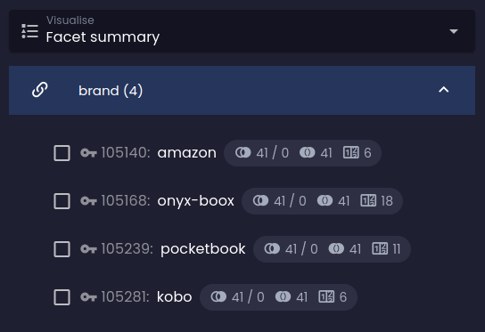
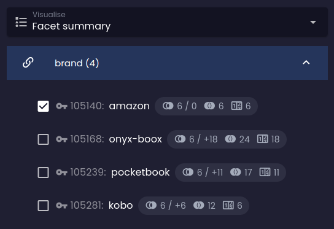
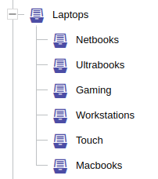
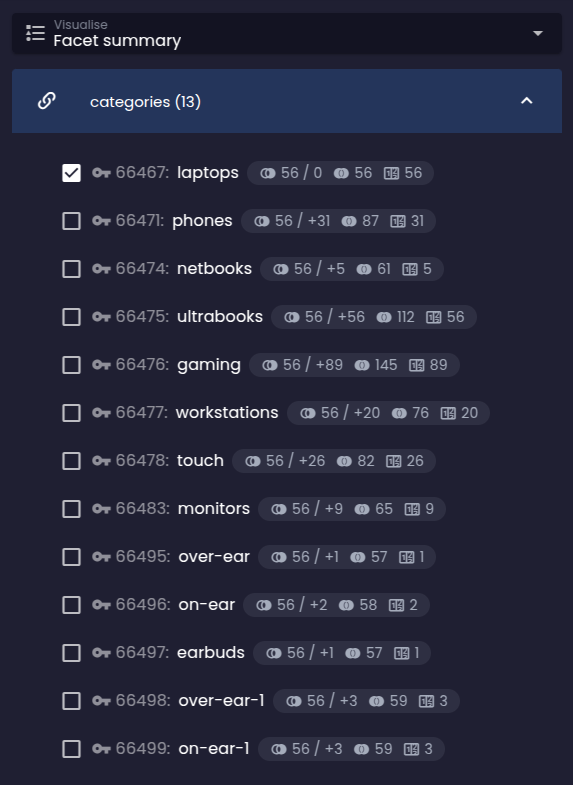
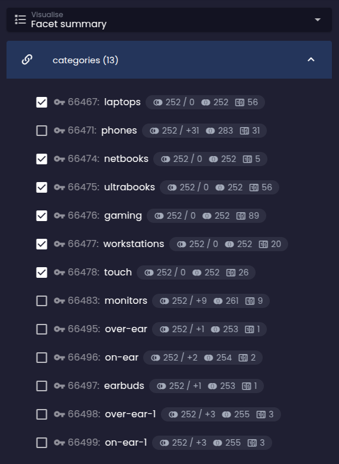
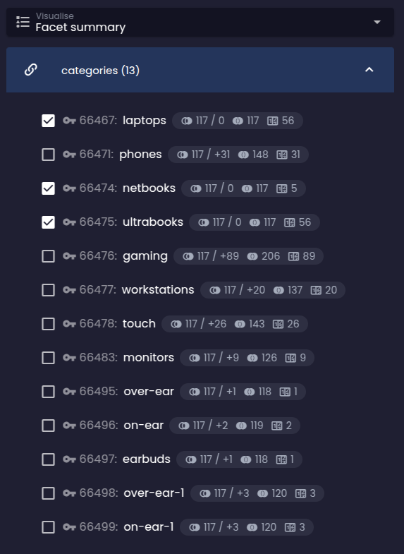
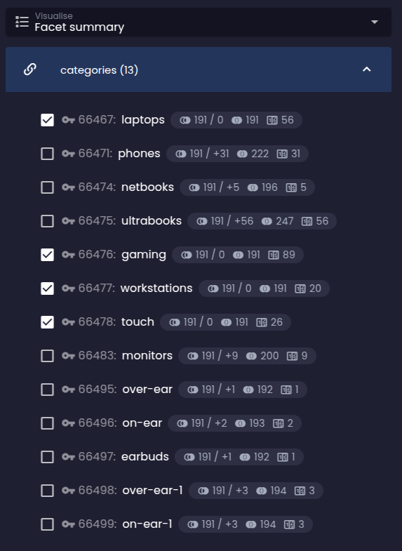

## Reference having

referenceHaving(
    argument:string!,
    filterConstraint:any+
)

<dl>
    <dt>argument:string!</dt>
    <dd>
        název [entity reference](../../use/schema.md#reference), na kterou budou aplikována filtrační omezení ve druhém a následujících argumentech
    </dd>
    <dt>filterConstraint:any+</dt>
    <dd>
        jedno nebo více filtračních omezení, která musí být splněna jednou z entitních referencí se jménem uvedeným v prvním argumentu
    </dd>
</dl>

Omezení <LS to="e,j,r,g"><SourceClass>evita_query/src/main/java/io/evitadb/api/query/filter/ReferenceHaving.java</SourceClass></LS><LS to="c"><SourceClass>EvitaDB.Client/Queries/Filter/ReferenceHaving.cs</SourceClass></LS>
vylučuje entity, které nemají žádnou referenci daného jména, která by splňovala zadané filtrační podmínky. Můžete zkoumat buď atributy definované přímo na relaci, nebo zabalit filtrační omezení do omezení
[`entityHaving`](#entity-having)
a zkoumat atributy referencované entity. Toto omezení je podobné SQL operátoru [`EXISTS`](https://www.w3schools.com/sql/sql_exists.asp).

Abychom ukázali, jak omezení `referenceHaving` funguje, pojďme vyhledat produkty, které mají alespoň jeden alternativní produkt. Alternativní produkty jsou uloženy v referenci `relatedProducts` na entitě `Product` a mají atribut `category` nastavený na `alternativeProduct`. Mohou existovat i jiné typy souvisejících produktů než alternativní produkty, například náhradní díly atd. – proto musíme ve filtračním omezení specifikovat atribut `category`.

[Product with at least one `relatedProducts` reference of `alternativeProduct` category](/documentation/user/en/query/filtering/examples/references/reference-having.evitaql)

Vrací následující výsledek:

<Note type="info">

<NoteTitle toggles="true">

##### Produkty s alespoň jednou referencí `relatedProducts` kategorie `alternativeProduct`

</NoteTitle>

<LS to="e,j,c">

<MDInclude>[Products with at least one `relatedProducts` reference of `alternativeProduct` category](/documentation/user/en/query/filtering/examples/references/reference-having.evitaql.md)</MDInclude>

</LS>

<LS to="g">

<MDInclude>[Products with at least one `relatedProducts` reference of `alternativeProduct` category](/documentation/user/en/query/filtering/examples/references/reference-having.graphql.json.md)</MDInclude>

</LS>

<LS to="r">

<MDInclude>[Products with at least one `relatedProducts` reference of `alternativeProduct` category](/documentation/user/en/query/filtering/examples/references/reference-having.rest.json.md)</MDInclude>

</LS>

</Note>

Pokud bychom chtěli vyhledat produkty, které mají alespoň jednu referenci na související produkt jakéhokoliv typu `category`, můžeme použít následující zjednodušený dotaz:

[Product with at least one `relatedProducts` reference of any category](/documentation/user/en/query/filtering/examples/references/reference-having-any.evitaql)

Který vrací následující výsledek:

<Note type="info">

<NoteTitle toggles="true">

##### Produkty s alespoň jednou referencí `relatedProducts` jakékoliv kategorie

</NoteTitle>

<LS to="e,j,c">

<MDInclude>[Products with at least one `relatedProducts` reference of any category](/documentation/user/en/query/filtering/examples/references/reference-having-any.evitaql.md)</MDInclude>

</LS>

<LS to="g">

<MDInclude>[Products with at least one `relatedProducts` reference of any category](/documentation/user/en/query/filtering/examples/references/reference-having-any.graphql.json.md)</MDInclude>

</LS>

<LS to="r">

<MDInclude>[Products with at least one `relatedProducts` reference of any category](/documentation/user/en/query/filtering/examples/references/reference-having-any.rest.json.md)</MDInclude>

</LS>

</Note>

Dalším často používaným případem je dotaz na entity, které mají alespoň jednu referenci na jinou entitu s určitým primárním klíčem. Například chceme vyhledat produkty, které jsou spojeny se značkou `brand` s primárním klíčem `66465`. To lze dosáhnout následujícím dotazem:

[Products referencing `brand` of particular primary key](/documentation/user/en/query/filtering/examples/references/reference-having-exact-id.evitaql)

Který vrací následující výsledek:

<Note type="info">

<NoteTitle toggles="true">

##### Produkty s alespoň jednou referencí `relatedProducts` jakékoliv kategorie

</NoteTitle>

<LS to="e,j,c">

<MDInclude>[Products referencing `brand` of particular primary key](/documentation/user/en/query/filtering/examples/references/reference-having-exact-id.evitaql.md)</MDInclude>

</LS>

<LS to="g">

<MDInclude>[Products referencing `brand` of particular primary key](/documentation/user/en/query/filtering/examples/references/reference-having-exact-id.graphql.json.md)</MDInclude>

</LS>

<LS to="r">

<MDInclude>[Products referencing `brand` of particular primary key](/documentation/user/en/query/filtering/examples/references/reference-having-exact-id.rest.json.md)</MDInclude>

</LS>

</Note>

## Entity having

entityHaving(
    filterConstraint:any+
)

<dl>
    <dt>filterConstraint:any+</dt>
    <dd>
        jedno nebo více filtračních omezení, která musí být splněna cílovou referencovanou entitou jakékoliv zdrojové entity, identifikované nadřazeným omezením `referenceHaving`
    </dd>
</dl>

Omezení `entityHaving` slouží ke zkoumání atributů nebo jiných filtrovatelných vlastností referencované entity. Lze jej použít pouze uvnitř omezení [`referenceHaving`](#reference-having), které definuje název entity reference, jež identifikuje cílovou entitu, na kterou budou aplikována filtrační omezení v omezení `entityHaving`. Filtrační omezení pro entitu mohou používat celou škálu [filtračních operátorů](../basics.md#filtrování).

Použijme náš předchozí příklad pro dotaz na produkty, které souvisejí se značkou `brand` s konkrétním atributem `code`:

[Products referencing `brand` of with code `apple`](/documentation/user/en/query/filtering/examples/references/entity-having.evitaql)

Který vrací následující výsledek:

<Note type="info">

<NoteTitle toggles="true">

##### Produkty s alespoň jednou referencí `relatedProducts` jakékoliv kategorie

</NoteTitle>

<LS to="e,j,c">

<MDInclude>[Products referencing `brand` of with code `apple`](/documentation/user/en/query/filtering/examples/references/entity-having.evitaql.md)</MDInclude>

</LS>

<LS to="g">

<MDInclude>[Products referencing `brand` of with code `apple`](/documentation/user/en/query/filtering/examples/references/entity-having.graphql.json.md)</MDInclude>

</LS>

<LS to="r">

<MDInclude>[Products referencing `brand` of with code `apple`](/documentation/user/en/query/filtering/examples/references/entity-having.rest.json.md)</MDInclude>

</LS>

</Note>

## Facet having

facetHaving(
    argument:string!,
    filterConstraint:any+
)

<dl>
    <dt>argument:string!</dt>
    <dd>
        název [entity reference](../../use/schema.md#reference), na kterou budou aplikována filtrační omezení ve druhém a následujících argumentech
    </dd>
    <dt>filterConstraint:any*</dt>
    <dd>
        žádné nebo více filtračních omezení, která identifikují facet (referenci), jenž musí být přítomen na entitách ve výsledné množině
    </dd>
</dl>

Filtrační omezení <LS to="e,j,r,g"><SourceClass>evita_query/src/main/java/io/evitadb/api/query/filter/FacetHaving.java</SourceClass></LS><LS to="c"><SourceClass>EvitaDB.Client/Queries/Filter/FacetHaving.cs</SourceClass></LS>
se obvykle umisťuje do kontejneru omezení [`userFilter`](behavioral.md#uživatelský-filtr) a reprezentuje požadavek uživatele na zúžení výsledné množiny podle konkrétního facetu. Omezení `facetHaving` funguje stejně jako omezení [`referenceHaving`](#reference-having), ale spolupracuje s požadavkem [`facetSummary`](../requirements/facet.md#fasetový-souhrn) pro správný výpočet statistik facetu a predikcí dopadu. Pokud je použito mimo kontejner [`userFilter`](behavioral.md#uživatelský-filtr), chová se omezení `facetHaving` stejně jako [`referenceHaving`](#reference-having).

Pro ukázku spolupráce mezi omezením `facetHaving` uvnitř `userFilter` a požadavkem `facetSummary` si vyžádáme produkty v kategorii *e-readery* a požádáme o souhrn facetů pro referenci `brand`. Zároveň předstíráme, že uživatel již zaškrtl facet *amazon*:

[Facet having example](/documentation/user/en/query/filtering/examples/references/facet-having.evitaql)

Jak můžete vidět, pokud je v dotazu detekováno omezení `facetHaving` a odpovídající výsledek statistik facetů je označen jako `requested`, náš vizualizér zobrazí facet jako zaškrtnutý. Statistiky ostatních možností facetu reflektují skutečnost, že uživatel již zaškrtl možnost *amazon* a predikované počty se podle toho změnily:

| Souhrn facetů bez požadavku na facet              | Souhrn facetů po zaškrtnutí facetu             |
|----------------------------------------------------|-------------------------------------------------|
|  |  |

<Note type="info">

<NoteTitle toggles="true">

##### Výsledek filtračního omezení facet having

</NoteTitle>

Protože JSON souhrnu facetů je poměrně dlouhý a nepřehledný, v této dokumentaci ukazujeme pouze zjednodušenou verzi výsledku souhrnu facetů. Jak vidíte, vybraný facet je zaškrtnutý a predikované počty se podle toho změnily:

<LS to="e,j,c">

<MDInclude sourceVariable="extraResults.FacetSummary">[The result of facet having filtering constraint](/documentation/user/en/query/filtering/examples/references/facet-having.evitaql.string.md)</MDInclude>

</LS>

<LS to="g">

<MDInclude sourceVariable="data.queryProduct.extraResults.facetSummary">[The result of facet having filtering constraint](/documentation/user/en/query/filtering/examples/references/facet-having.graphql.json.md)</MDInclude>

</LS>

<LS to="r">

<MDInclude sourceVariable="extraResults.facetSummary">[The result of facet having filtering constraint](/documentation/user/en/query/filtering/examples/references/facet-having.rest.json.md)</MDInclude>

</LS>

</Note>

### Including children

includingChildren()

Filtrační omezení <LS to="e,j,r,g"><SourceClass>evita_query/src/main/java/io/evitadb/api/query/filter/FacetIncludingChildren.java</SourceClass></LS> 
lze použít pouze uvnitř nadřazeného omezení `facetHaving` a pouze pokud se nadřazené omezení vztahuje na hierarchickou entitu. Toto omezení automaticky propaguje všechny podřízené entity jakékoliv entity, která splňuje omezení `facetHaving`, do tohoto nadřazeného omezení, jako by `facetHaving` obsahoval děti přímo.

Ukažme si tuto situaci na reálných datech. Představte si, že máte kategorii `Laptops` s podkategoriemi `Netbooks`, `Ultrabooks` atd.:

Produkty mohou být přiřazeny k některé z těchto podkategorií, nebo přímo ke kategorii `Laptops` (pokud neodpovídají žádné podkategorii). Pokud vygenerujete souhrn facetů pro referenci `category`, získáte všechny kategorie s odpovídajícími produkty na stejné úrovni. Můžete ale chtít vizualizovat část souhrnu facetů pro kategorii jako strom pomocí požadavku [`hierarchy`](../requirements/hierarchy.md#hierarchie-reference). Když uživatel vybere jednu z možností kategorie, měly by se automaticky vybrat i všechny podkategorie a zároveň se změní predikované [statistiky facetů](../requirements/facet.md#fasetový-souhrn-reference).

K tomu můžete použít omezení `includingChildren` uvnitř omezení `facetHaving`. Dotaz je zároveň omezen na produkty výrobce `ASUS`, aby souhrn facetů nebyl příliš dlouhý:

[Facet including children example](/documentation/user/en/query/filtering/examples/references/facet-including-children.evitaql)

| Souhrn facetů bez požadavku na zahrnutí dětí             | Souhrn facetů po požadavku na zahrnutí dětí      |
|----------------------------------------------------------------|-------------------------------------------------------------|
|  |  |

<Note type="info">

<NoteTitle toggles="true">

##### Výsledek filtračního omezení facet having including children

</NoteTitle>

Protože JSON souhrnu facetů je poměrně dlouhý a nepřehledný, v této dokumentaci ukazujeme pouze zjednodušenou verzi výsledku souhrnu facetů. Jak vidíte, nejen facet `laptops` odpovídající funkci equals je zaškrtnutý, ale také všechny jeho děti. Predikované počty se podle toho změnily:

<LS to="e,j,c">

<MDInclude sourceVariable="extraResults.FacetSummary">[The result of facet having including children](/documentation/user/en/query/filtering/examples/references/facet-including-children.evitaql.string.md)</MDInclude>

</LS>

<LS to="g">

<MDInclude sourceVariable="data.queryProduct.extraResults.facetSummary">[The result of facet having including children](/documentation/user/en/query/filtering/examples/references/facet-including-children.graphql.json.md)</MDInclude>

</LS>

<LS to="r">

<MDInclude sourceVariable="extraResults.facetSummary">[The result of facet having including children](/documentation/user/en/query/filtering/examples/references/facet-including-children.rest.json.md)</MDInclude>

</LS>

</Note>

### Including children having

includingChildrenHaving(
    filterConstraint:any+
)

<dl>
    <dt>filterConstraint:any+</dt>
    <dd>
        jedno nebo více filtračních omezení, která dále zužují podřízené entity, jež budou zahrnuty do nadřazeného omezení `facetHaving`
    </dd>
</dl>

Filtrační omezení <LS to="e,j,r,g"><SourceClass>evita_query/src/main/java/io/evitadb/api/query/filter/ReferenceIncludingChildren.java</SourceClass></LS>
je specializací omezení [`includingChildren`](#including-children), která umožňuje omezit podřízené entity zahrnuté do nadřazeného omezení `facetHaving`. To může být užitečné, pokud používáte filtry v požadavku [`facetSummary`](../requirements/facet.md#fasetový-souhrn-reference) a vaše logika výběru je s tímto filtrem svázaná.

Abychom lépe pochopili, jak omezení `includingChildrenHaving` funguje, podívejme se na příklad (dotaz je také omezen na produkty výrobce `ASUS`, aby souhrn facetů nebyl příliš dlouhý):

[Facet including children having example](/documentation/user/en/query/filtering/examples/references/facet-including-children-having.evitaql)

| Souhrn facetů se standardním zahrnutím dětí              | Souhrn facetů s omezeným zahrnutím dětí pomocí including children having |
|-----------------------------------------------------------------------|----------------------------------------------------------------------|
|  |    |

<Note type="info">

<NoteTitle toggles="true">

##### Výsledek filtračního omezení facet having including children having

</NoteTitle>

Protože JSON souhrnu facetů je poměrně dlouhý a nepřehledný, v této dokumentaci ukazujeme pouze zjednodušenou verzi výsledku souhrnu facetů. Jak vidíte, nejen facet `laptops` odpovídající funkci equals je zaškrtnutý, ale také všechny jeho děti, jejichž atribut `code` obsahuje řetězec `books`. Predikované počty se podle toho změnily:

<LS to="e,j,c">

<MDInclude sourceVariable="extraResults.FacetSummary">[The result of facet having including children having](/documentation/user/en/query/filtering/examples/references/facet-including-children-having.evitaql.string.md)</MDInclude>

</LS>

<LS to="g">

<MDInclude sourceVariable="data.queryProduct.extraResults.facetSummary">[The result of facet having including children having](/documentation/user/en/query/filtering/examples/references/facet-including-children-having.graphql.json.md)</MDInclude>

</LS>

<LS to="r">

<MDInclude sourceVariable="extraResults.facetSummary">[The result of facet having including children having](/documentation/user/en/query/filtering/examples/references/facet-including-children-having.rest.json.md)</MDInclude>

</LS>

</Note>

### Including children except

includingChildrenExcept(
    filterConstraint:any+
)

<dl>
    <dt>filterConstraint:any+</dt>
    <dd>
        jedno nebo více filtračních omezení, která vylučují konkrétní podřízené entity ze zahrnutí do nadřazeného omezení `facetHaving`
    </dd>
</dl>

Filtrační omezení <LS to="e,j,r,g"><SourceClass>evita_query/src/main/java/io/evitadb/api/query/filter/ReferenceIncludingChildren.java</SourceClass></LS>
je specializací omezení [`includingChildren`](#including-children) a přesným opakem [`includingChildrenHaving`], která umožňuje vyloučit odpovídající podřízené entity ze zahrnutí do nadřazeného omezení `facetHaving`. To může být užitečné, pokud používáte filtry v požadavku [`facetSummary`](../requirements/facet.md#fasetový-souhrn-reference) a vaše logika výběru je s tímto filtrem svázaná.

Omezení `includingChildrenExcept` lze také kombinovat s omezením `includingChildrenHaving`. V tomto případě je nejprve vyhodnoceno omezení `includingChildrenHaving` a poté je na výsledek aplikováno omezení `includingChildrenExcept`.

Abychom lépe pochopili, jak omezení `includingChildrenExcept` funguje, podívejme se na příklad (dotaz je také omezen na produkty výrobce `ASUS`, aby souhrn facetů nebyl příliš dlouhý):

[Facet including children except example](/documentation/user/en/query/filtering/examples/references/facet-including-children-except.evitaql)

| Souhrn facetů se standardním zahrnutím dětí              | Souhrn facetů s omezeným zahrnutím dětí pomocí including children except |
|-----------------------------------------------------------------------|----------------------------------------------------------------------|
|  |    |

<Note type="info">

<NoteTitle toggles="true">

##### Výsledek filtračního omezení facet except including children except

</NoteTitle>

Protože JSON souhrnu facetů je poměrně dlouhý a nepřehledný, v této dokumentaci ukazujeme pouze zjednodušenou verzi výsledku souhrnu facetů. Jak vidíte, nejen facet `laptops` odpovídající funkci equals je zaškrtnutý, ale také všechny jeho děti, jejichž atribut `code` neobsahuje řetězec `books`. Predikované počty se podle toho změnily:

<LS to="e,j,c">

<MDInclude sourceVariable="extraResults.FacetSummary">[The result of facet except including children except](/documentation/user/en/query/filtering/examples/references/facet-including-children-except.evitaql.string.md)</MDInclude>

</LS>

<LS to="g">

<MDInclude sourceVariable="data.queryProduct.extraResults.facetSummary">[The result of facet except including children except](/documentation/user/en/query/filtering/examples/references/facet-including-children-except.graphql.json.md)</MDInclude>

</LS>

<LS to="r">

<MDInclude sourceVariable="extraResults.facetSummary">[The result of facet except including children except](/documentation/user/en/query/filtering/examples/references/facet-including-children-except.rest.json.md)</MDInclude>

</LS>

</Note>