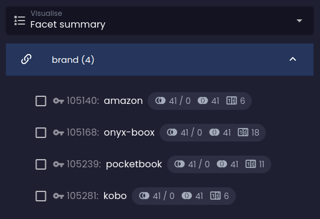
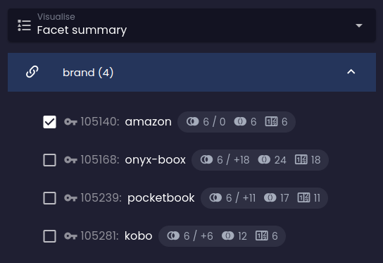
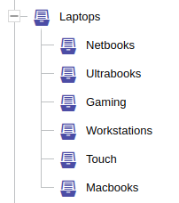
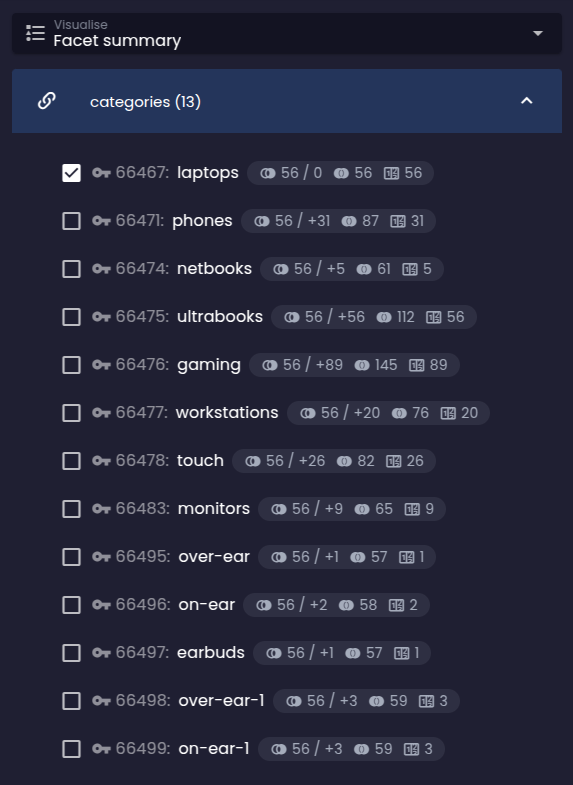
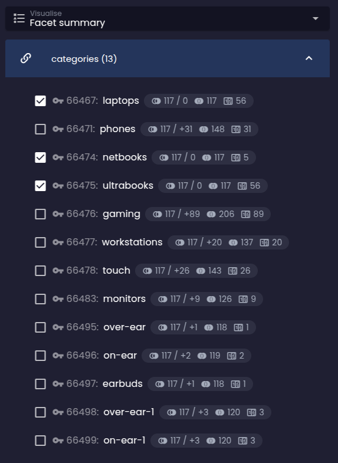
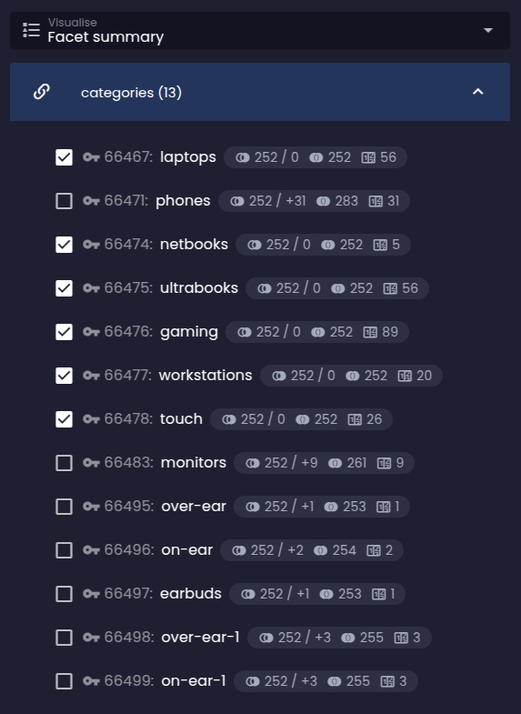
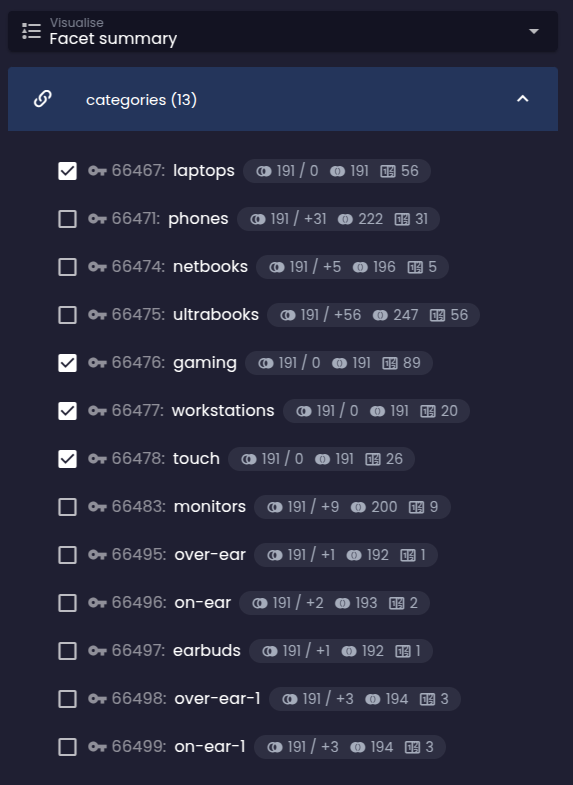

## Reference having

```evitaql-syntax
referenceHaving(
    argument:string!,
    filterConstraint:any+
)
```

<dl>
    <dt>argument:string!</dt>
    <dd>
        název [entity reference](../../use/schema.md#reference), na kterou budou aplikována filtrační omezení
        uvedená ve druhém a následujících argumentech
    </dd>
    <dt>filterConstraint:any+</dt>
    <dd>
        jedno nebo více filtračních omezení, která musí být splněna alespoň jednou entitní referencí se jménem
        uvedeným v prvním argumentu
    </dd>
</dl>

Omezení <LS to="e,j,r,g"><SourceClass>evita_query/src/main/java/io/evitadb/api/query/filter/ReferenceHaving.java</SourceClass></LS><LS to="c"><SourceClass>EvitaDB.Client/Queries/Filter/ReferenceHaving.cs</SourceClass></LS>
vylučuje entity, které nemají žádnou referenci daného jména splňující sadu filtračních omezení. Můžete zkoumat
buď atributy uvedené přímo na relaci, zabalit filtrační omezení do omezení
[`entityHaving`](#entity-having) pro zkoumání atributů referencované entity,
nebo do omezení [`groupHaving`](#group-having) pro zkoumání atributů skupinové entity spojené
s referencí. Toto omezení je podobné
SQL operátoru [`EXISTS`](https://www.w3schools.com/sql/sql_exists.asp).

Pro ukázku, jak omezení `referenceHaving` funguje, si vyzkoušíme dotaz na produkty, které mají alespoň jeden alternativní
produkt uvedený. Alternativní produkty jsou uloženy v referenci `relatedProducts` na entitě `Product` a
mají atribut `category` nastavený na `alternativeProduct`. Může existovat více typů souvisejících produktů než jen
alternativní produkty, například náhradní díly a podobně – proto je potřeba v
filtračním omezení specifikovat atribut `category`.

<SourceCodeTabs requires="evita_test/evita_documentation_tests/src/test/resources/META-INF/documentation/evitaql-init.java" langSpecificTabOnly>

[Produkt s alespoň jednou referencí `relatedProducts` kategorie `alternativeProduct`](/documentation/user/en/query/filtering/examples/references/reference-having.evitaql)

</SourceCodeTabs>

Vrací následující výsledek:

<Note type="info">

<NoteTitle toggles="true">

##### Produkty s alespoň jednou referencí `relatedProducts` kategorie `alternativeProduct`

</NoteTitle>

<LS to="e,j,c">

<MDInclude>[Products with at least one `relatedProducts` reference of `alternativeProduct` category](/documentation/user/en/query/filtering/examples/references/reference-having.evitaql.md)</MDInclude>

</LS>

<LS to="g">

<MDInclude>[Products with at least one `relatedProducts` reference of `alternativeProduct` category](/documentation/user/en/query/filtering/examples/references/reference-having.graphql.json.md)</MDInclude>

</LS>

<LS to="r">

<MDInclude>[Products with at least one `relatedProducts` reference of `alternativeProduct` category](/documentation/user/en/query/filtering/examples/references/reference-having.rest.json.md)</MDInclude>

</LS>

</Note>

Pokud bychom chtěli dotazovat produkty, které mají alespoň jednu referenci na související produkt jakéhokoliv typu `category`, mohli bychom použít následující zjednodušený dotaz:

<SourceCodeTabs requires="evita_test/evita_documentation_tests/src/test/resources/META-INF/documentation/evitaql-init.java" langSpecificTabOnly>

[Produkt s alespoň jednou referencí `relatedProducts` jakékoliv kategorie](/documentation/user/en/query/filtering/examples/references/reference-having-any.evitaql)

</SourceCodeTabs>

Který vrací následující výsledek:

<Note type="info">

<NoteTitle toggles="true">

##### Produkty s alespoň jednou referencí `relatedProducts` jakékoliv kategorie

</NoteTitle>

<LS to="e,j,c">

<MDInclude>[Produkty s alespoň jednou referencí `relatedProducts` jakékoliv kategorie](/documentation/user/en/query/filtering/examples/references/reference-having-any.evitaql.md)</MDInclude>

</LS>

<LS to="g">

<MDInclude>[Produkty s alespoň jednou referencí `relatedProducts` jakékoliv kategorie](/documentation/user/en/query/filtering/examples/references/reference-having-any.graphql.json.md)</MDInclude>

</LS>

<LS to="r">

<MDInclude>[Produkty s alespoň jednou referencí `relatedProducts` jakékoliv kategorie](/documentation/user/en/query/filtering/examples/references/reference-having-any.rest.json.md)</MDInclude>

</LS>

</Note>

Dalším často používaným případem je dotazování na entity, které mají alespoň jednu referenci na jinou entitu s určitým primárním klíčem. Například chceme dotazovat produkty, které jsou spojeny s `brand` s primárním klíčem `66465`. Toho lze dosáhnout následujícím dotazem:

<SourceCodeTabs requires="evita_test/evita_documentation_tests/src/test/resources/META-INF/documentation/evitaql-init.java" langSpecificTabOnly>

[Produkty odkazující na `brand` s konkrétním primárním klíčem](/documentation/user/en/query/filtering/examples/references/reference-having-exact-id.evitaql)

</SourceCodeTabs>

Který vrací následující výsledek:

<Note type="info">

<NoteTitle toggles="true">

##### Produkty s alespoň jednou referencí `relatedProducts` jakékoliv kategorie

</NoteTitle>

<LS to="e,j,c">

<MDInclude>[Products referencing `brand` of particular primary key](/documentation/user/en/query/filtering/examples/references/reference-having-exact-id.evitaql.md)</MDInclude>

</LS>

<LS to="g">

<MDInclude>[Products referencing `brand` of particular primary key](/documentation/user/en/query/filtering/examples/references/reference-having-exact-id.graphql.json.md)</MDInclude>

</LS>

<LS to="r">

<MDInclude>[Products referencing `brand` of particular primary key](/documentation/user/en/query/filtering/examples/references/reference-having-exact-id.rest.json.md)</MDInclude>

</LS>

</Note>

## Entity having

```evitaql-syntax
entityHaving(
    filterConstraint:any+
)
```

<dl>
    <dt>filterConstraint:any+</dt>
    <dd>
        jeden nebo více filtračních omezení, která musí být splněna cílovou referencovanou entitou jakékoli z referencí
        zdrojové entity identifikovaných nadřazeným omezením `referenceHaving`
    </dd>
</dl>

Omezení `entityHaving` se používá ke kontrole atributů nebo jiných filtrovatelných vlastností referencované entity.
Lze jej použít pouze v rámci omezení [`referenceHaving`](#reference-having), které určuje název entity
reference identifikující cílovou entitu, na kterou mají být uplatněna filtrační omezení v rámci omezení `entityHaving`.
Filtrační omezení pro entitu mohou využívat celou škálu
[filtračních operátorů](../basics.md#filtrování).

Použijme náš předchozí příklad k dotazu na produkty, které odkazují na `brand` s konkrétním atributem `code`:

<SourceCodeTabs requires="evita_test/evita_documentation_tests/src/test/resources/META-INF/documentation/evitaql-init.java" langSpecificTabOnly>

[Produkty odkazující na `brand` s kódem `apple`](/documentation/user/en/query/filtering/examples/references/entity-having.evitaql)

</SourceCodeTabs>

Což vrátí následující výsledek:

<Note type="info">

<NoteTitle toggles="true">

##### Produkty s alespoň jednou referencí `relatedProducts` jakékoliv kategorie

</NoteTitle>

<LS to="e,j,c">

<MDInclude>[Products referencing `brand` of with code `apple`](/documentation/user/en/query/filtering/examples/references/entity-having.evitaql.md)</MDInclude>

</LS>

<LS to="g">

<MDInclude>[Products referencing `brand` of with code `apple`](/documentation/user/en/query/filtering/examples/references/entity-having.graphql.json.md)</MDInclude>

</LS>

<LS to="r">

<MDInclude>[Products referencing `brand` of with code `apple`](/documentation/user/en/query/filtering/examples/references/entity-having.rest.json.md)</MDInclude>

</LS>

</Note>

## Group having

```evitaql-syntax
groupHaving(
    filterConstraint:any+
)
```

<dl>
    <dt>filterConstraint:any+</dt>
    <dd>
        jeden nebo více filtračních omezení, která musí být splněna skupinovou entitou libovolné ze zdrojových
        entitních referencí identifikovaných nadřazeným omezením `referenceHaving`
    </dd>
</dl>

Omezení <LS to="e,j,r,g"><SourceClass>evita_query/src/main/java/io/evitadb/api/query/filter/GroupHaving.java</SourceClass></LS><LS to="c"><SourceClass>EvitaDB.Client/Queries/Filter/GroupHaving.cs</SourceClass></LS>
se používá ke kontrole atributů nebo jiných filtrovatelných vlastností **skupinové entity** spojené s referencí.
Lze jej použít pouze v rámci omezení [`referenceHaving`](#reference-having), které definuje název entitní
reference, jejíž skupinová entita podléhá filtračním omezením v omezení `groupHaving`. Filtrační
omezení pro skupinovou entitu mohou využívat celou škálu [filtrovacích operátorů](../basics.md#filtrování).

Toto omezení vyžaduje, aby reference byla nakonfigurována se skupinovým typem a měla povolenou komponentu
`REFERENCED_GROUP_ENTITY` [indexovanou komponentu](../../use/schema.md#reference). Tři sourozenecká omezení se
zaměřují na různé „vrstvy“ jedné reference a lze je libovolně kombinovat uvnitř `referenceHaving`:

| Filtrační omezení                 | Zaměřeno na                                 |
|-----------------------------------|---------------------------------------------|
| (bez wrapperu, prostý atribut…)   | atributy na **referenční relaci**           |
| [`entityHaving`](#entity-having)  | atributy na **referencované entitě**        |
| `groupHaving`                     | atributy na **skupinové entitě**            |

V demo datasetu reference `parameterValues` ukazuje na entitu `ParameterValue` (např. *RAM 16 GB*) a je
**seskupena** podle entity `Parameter` (např. *RAM paměť*). Pokud chcete najít MacBooky, které vůbec vystavují
parametr *RAM paměť* — bez ohledu na to, kolik paměti mají — vybíráte referenci podle její **skupiny**, nikoli
podle jednotlivých hodnot parametrů:

<SourceCodeTabs requires="evita_test/evita_documentation_tests/src/test/resources/META-INF/documentation/evitaql-init.java" langSpecificTabOnly>

[MacBooky, jejichž reference `parameterValues` je seskupena parametrem *RAM paměť*](/documentation/user/en/query/filtering/examples/references/group-having.evitaql)

</SourceCodeTabs>

Všimněte si, jak `groupHaving` filtruje na **úrovni skupiny**, zatímco sourozenecký filtr `referenceContentWithAttributes` na úrovni načítání používá `entityHaving` k promítnutí odpovídajících jednotlivých hodnot zpět do výsledku. Tato dvojice —
*„vyber podle skupiny, promítni podle entity“* — je typickým tvarem dotazu `groupHaving`: příklad zužuje
výsledek na MacBooky, které mají alespoň jednu referenci `parameterValues`, jejíž skupinová entita je parametr
`ram-memory`, a poté pro každý přeživší MacBook načítá pouze ty hodnoty parametrů, jejichž vlastní kód začíná
na `ram-memory` (takže odpověď ukáže skutečnou velikost paměti bez výpisu všech ostatních parametrů, které produkt nabízí).

<Note type="info">

<NoteTitle toggles="true">

##### MacBooky vystavující skupinu parametrů *RAM paměť*

</NoteTitle>

<LS to="e,j,c">

<MDInclude>[MacBooky, jejichž reference `parameterValues` je seskupena parametrem *RAM paměť*](/documentation/user/en/query/filtering/examples/references/group-having.evitaql.md)</MDInclude>

</LS>

</Note>

## Facet having

```evitaql-syntax
facetHaving(
    argument:string!,
    filterConstraint:any+
)
```

<dl>
    <dt>argument:string!</dt>
    <dd>
        název [entity reference](../../use/schema.md#reference), na kterou budou aplikována filtrační omezení uvedená v druhém a dalších argumentech
    </dd>
    <dt>filterConstraint:any*</dt>
    <dd>
        žádné nebo více filtračních omezení, která určují facet (referenci), která musí být přítomna na entitách ve výsledné množině
    </dd>
</dl>

Filtrační omezení <LS to="e,j,r,g"><SourceClass>evita_query/src/main/java/io/evitadb/api/query/filter/FacetHaving.java</SourceClass></LS><LS to="c"><SourceClass>EvitaDB.Client/Queries/Filter/FacetHaving.cs</SourceClass></LS> je obvykle umístěno uvnitř kontejneru omezení [`userFilter`](behavioral.md#uživatelský-filtr) a představuje požadavek uživatele na zúžení výsledné množiny podle konkrétního facetu. Omezení `facetHaving` funguje přesně stejně jako omezení [`referenceHaving`](#reference-having), ale ve spolupráci s požadavkem [`referenceSummary`](../requirements/reference.md#referenční-souhrn) správně vypočítává statistiky facetů a predikce dopadů. Pokud je použito mimo kontejner omezení [`userFilter`](behavioral.md#uživatelský-filtr), chová se omezení `facetHaving` stejně jako omezení [`referenceHaving`](#reference-having).

Pro demonstraci spolupráce mezi omezením `facetHaving` uvnitř `userFilter` a požadavkem `referenceSummary` si ukážeme dotaz na produkty v kategorii *e-readery* a požádáme o souhrn facetů pro referenci `brand`. Zároveň předpokládejme, že uživatel již zaškrtl facet *amazon*:

<SourceCodeTabs requires="evita_test/evita_documentation_tests/src/test/resources/META-INF/documentation/evitaql-init.java" langSpecificTabOnly>

[Příklad použití facetHaving](/documentation/user/en/query/filtering/examples/references/facet-having.evitaql)

</SourceCodeTabs>

Jak můžete vidět, když je v dotazu detekováno omezení `facetHaving` a odpovídající výsledek statistiky facetu je označen jako `requested`, náš vizualizátor zvolí zobrazení facetu jako zaškrtnutého. Ostatní statistiky možností facetu odrážejí skutečnost, že uživatel již možnost facetu *amazon* zaškrtl, a predikované hodnoty se podle toho změní:

| Souhrn facetů bez požadavku na facet              | Souhrn facetů po požadavku na facet             |
|----------------------------------------------------|-------------------------------------------------|
|  |  |

<Note type="info">

<NoteTitle toggles="true">

##### Výsledek filtračního omezení facet having

</NoteTitle>

Protože výstup facet summary ve formátu JSON je poměrně dlouhý a není příliš přehledný, v této dokumentaci ukazujeme pouze zjednodušenou verzi výsledku souhrnu facetů. Jak můžete vidět, vybraný facet je zaškrtnutý a predikované hodnoty se podle toho změnily:

<LS to="e,j,c">

<MDInclude sourceVariable="extraResults.ReferenceSummary">[Výsledek filtračního omezení facet having](/documentation/user/en/query/filtering/examples/references/facet-having.evitaql.string.md)</MDInclude>

</LS>

<LS to="g">

<MDInclude sourceVariable="data.queryProduct.extraResults.referenceSummary">[Výsledek filtračního omezení facet having](/documentation/user/en/query/filtering/examples/references/facet-having.graphql.json.md)</MDInclude>

</LS>

<LS to="r">

<MDInclude sourceVariable="extraResults.referenceSummary">[Výsledek filtračního omezení facet having](/documentation/user/en/query/filtering/examples/references/facet-having.rest.json.md)</MDInclude>

</LS>

</Note>

### Zahrnutí potomků

```evitaql-syntax
includingChildren()
```

Filtrační omezení <LS to="e,j,r,g"><SourceClass>evita_query/src/main/java/io/evitadb/api/query/filter/FacetIncludingChildren.java</SourceClass></LS> 
lze použít pouze uvnitř nadřazeného omezení `facetHaving` a pouze tehdy, pokud toto nadřazené omezení odkazuje 
na hierarchickou entitu. Toto omezení automaticky zahrne všechny podřízené entity jakékoli entity, která odpovídá
omezení `facetHaving`, do tohoto nadřazeného omezení, jako by `facetHaving` obsahovalo tyto potomky přímo.

Pojďme si tuto situaci ukázat na reálných datech. Představte si, že máte kategorii `Laptops` s podkategoriemi `Netbooks`,
`Ultrabooks` a dalšími:



Produkty mohou být přiřazeny k některé z těchto podkategorií, nebo přímo ke kategorii `Laptops` (pokud nespadají do žádné
z podkategorií). Pokud byste vygenerovali souhrn facetů pro referenci `category`, získali byste všechny kategorie s
odpovídajícími produkty na stejné úrovni. Můžete však chtít zobrazit kategorii v části souhrnu facetů jako strom
pomocí požadavku [`hierarchy](../requirements/hierarchy.md#hierarchie-reference). Když uživatel vybere jednu z 
možností kategorie, měly by se automaticky vybrat i všechny podkategorie a také by se měly změnit predikované
[statistiky referencí](../requirements/reference.md#souhrn-referenčního-souhrnu).

K tomu můžete použít omezení `includingChildren` uvnitř omezení `facetHaving`. Dotaz je navíc omezen na produkty výrobce `ASUS`, 
aby souhrn facetů nebyl příliš dlouhý:

<SourceCodeTabs requires="evita_test/evita_documentation_tests/src/test/resources/META-INF/documentation/evitaql-init.java" langSpecificTabOnly>

[Příklad facet including children](/documentation/user/en/query/filtering/examples/references/facet-including-children.evitaql)

</SourceCodeTabs>

| Souhrn facetů bez zahrnutí potomků | Souhrn facetů po zahrnutí potomků |
|------------------------------------|-----------------------------------|
|  |  |

<Note type="info">

<NoteTitle toggles="true">

##### Výsledek filtrování facetů s omezením zahrnujícím potomky

</NoteTitle>

Protože JSON souhrnu facetů je poměrně dlouhý a nepřehledný, v této dokumentaci ukážeme pouze zjednodušenou verzi výsledku
souhrnu facetů. Jak můžete vidět, není zaškrtnut pouze facet `laptops`, který odpovídá funkci equals, ale také všichni jeho potomci.
Predikované počty se podle toho změnily:

<LS to="e,j,c">

<MDInclude sourceVariable="extraResults.ReferenceSummary">[Výsledek facet having včetně potomků](/documentation/user/en/query/filtering/examples/references/facet-including-children.evitaql.string.md)</MDInclude>

</LS>

<LS to="g">

<MDInclude sourceVariable="data.queryProduct.extraResults.referenceSummary">[Výsledek facet having včetně potomků](/documentation/user/en/query/filtering/examples/references/facet-including-children.graphql.json.md)</MDInclude>

</LS>

<LS to="r">

<MDInclude sourceVariable="extraResults.referenceSummary">[Výsledek facet having včetně potomků](/documentation/user/en/query/filtering/examples/references/facet-including-children.rest.json.md)</MDInclude>

</LS>

</Note>

### Including children having

```evitaql-syntax
includingChildrenHaving(
    filterConstraint:any+
)
```

<dl>
    <dt>filterConstraint:any+</dt>
    <dd>
        jeden nebo více filtračních omezení, která dále zužují množinu potomků, kteří budou zahrnuti v 
        nadřazeném omezení `facetHaving`
    </dd>
</dl>

Filtrační omezení <LS to="e,j,r,g"><SourceClass>evita_query/src/main/java/io/evitadb/api/query/filter/ReferenceIncludingChildren.java</SourceClass></LS>
je specializací [`includingChildren`](#zahrnutí-potomků), která vám umožňuje omezit potomky, kteří budou zahrnuti v nadřazeném omezení `facetHaving`. To může být užitečné, pokud používáte filtry v [`referenceSummary`](../requirements/reference.md#souhrn-referenčního-souhrnu) a vaše logika výběru je potřebuje zohlednit.

Abychom lépe pochopili, jak omezení `includingChildrenHaving` funguje, podívejme se na příklad (dotaz je také omezen na produkty výrobce `ASUS`, aby souhrn facetů nebyl příliš dlouhý):

<SourceCodeTabs requires="evita_test/evita_documentation_tests/src/test/resources/META-INF/documentation/evitaql-init.java" langSpecificTabOnly>

[Příklad facet including children having](/documentation/user/en/query/filtering/examples/references/facet-including-children-having.evitaql)

</SourceCodeTabs>

| Souhrn facetů se standardním požadavkem na zahrnutí potomků           | Souhrn facetů s omezeným facet including children having              |
|-----------------------------------------------------------------------|----------------------------------------------------------------------|
|      |          |

<Note type="info">

<NoteTitle toggles="true">

##### Výsledek filtračního omezení facet having including children having

</NoteTitle>

Protože JSON souhrnu facetů je poměrně dlouhý a není příliš čitelný, v této dokumentaci ukážeme pouze zjednodušenou verzi výsledku souhrnu facetů. Jak můžete vidět, není zaškrtnut pouze facet `laptops`, který odpovídá funkci equals, ale také všichni jeho potomci, jejichž atribut `code` obsahuje řetězec `books`. Odpovídajícím způsobem se změnily i predikované počty:

<LS to="e,j,c">

<MDInclude sourceVariable="extraResults.ReferenceSummary">[Výsledek facet having including children having](/documentation/user/en/query/filtering/examples/references/facet-including-children-having.evitaql.string.md)</MDInclude>

</LS>

<LS to="g">

<MDInclude sourceVariable="data.queryProduct.extraResults.referenceSummary">[Výsledek facet having including children having](/documentation/user/en/query/filtering/examples/references/facet-including-children-having.graphql.json.md)</MDInclude>

</LS>

<LS to="r">

<MDInclude sourceVariable="extraResults.referenceSummary">[Výsledek facet having including children having](/documentation/user/en/query/filtering/examples/references/facet-including-children-having.rest.json.md)</MDInclude>

</LS>

</Note>

### Včetně potomků kromě

```evitaql-syntax
includingChildrenExcept(
    filterConstraint:any+
)
```

<dl>
    <dt>filterConstraint:any+</dt>
    <dd>
        jeden nebo více filtračních omezení, které vylučují konkrétní podřízené entity z toho, aby byly zahrnuty do 
        nadřazeného omezení `facetHaving`
    </dd>
</dl>

<LS to="e,j,r,g"><SourceClass>evita_query/src/main/java/io/evitadb/api/query/filter/ReferenceIncludingChildren.java</SourceClass></LS>
Filtrační omezení je specializací [`includingChildren`](#zahrnutí-potomků) a přesným opakem [`includingChildrenHaving`],
které umožňuje vyloučit nalezené podřízené entity z toho, aby byly zahrnuty do nadřazeného omezení `facetHaving`.
To může být užitečné, pokud používáte filtry v
[`referenceSummary`](../requirements/reference.md#souhrn-referenčního-souhrnu) a vaše logika výběru to vyžaduje.

Omezení `includingChildrenExcept` můžete také kombinovat s omezením `includingChildrenHaving`. 
V tomto případě je nejprve vyhodnoceno omezení `includingChildrenHaving` a poté je na jeho výsledek aplikováno omezení 
`includingChildrenExcept`.

Abychom lépe pochopili, jak omezení `includingChildrenExcept` funguje, podívejme se na příklad (dotaz je také
omezen pouze na produkty výrobce `ASUS`, aby souhrn facetů nebyl příliš dlouhý):

<SourceCodeTabs requires="evita_test/evita_documentation_tests/src/test/resources/META-INF/documentation/evitaql-init.java" langSpecificTabOnly>

[Příklad facet including children except](/documentation/user/en/query/filtering/examples/references/facet-including-children-except.evitaql)

</SourceCodeTabs>

| Souhrn facetů se standardním požadavkem na zahrnutí potomků              | Souhrn facetů s omezeným facet including children except požadavkem |
|-------------------------------------------------------------------------|---------------------------------------------------------------------|
|        |         |

<Note type="info">

<NoteTitle toggles="true">

##### Výsledek filtračního omezení facet except including children except

</NoteTitle>

Protože JSON souhrnu facetů je poměrně dlouhý a ne příliš přehledný, ukážeme v této dokumentaci pouze zjednodušenou verzi výsledku souhrnu facetů. Jak můžete vidět, není označen pouze facet `laptops` nalezený pomocí equals funkce, ale také všichni jeho potomci, jejichž atribut `code` neobsahuje řetězec `books`. Předpokládaná čísla se podle toho změnila:

<LS to="e,j,c">

<MDInclude sourceVariable="extraResults.ReferenceSummary">[Výsledek facet except including children except](/documentation/user/en/query/filtering/examples/references/facet-including-children-except.evitaql.string.md)</MDInclude>

</LS>

<LS to="g">

<MDInclude sourceVariable="data.queryProduct.extraResults.referenceSummary">[Výsledek facet except including children except](/documentation/user/en/query/filtering/examples/references/facet-including-children-except.graphql.json.md)</MDInclude>

</LS>

<LS to="r">

<MDInclude sourceVariable="extraResults.referenceSummary">[Výsledek facet except including children except](/documentation/user/en/query/filtering/examples/references/facet-including-children-except.rest.json.md)</MDInclude>

</LS>

</Note>

## Histogram having

```evitaql-syntax
histogramHaving(
    argument:string!,
    argument:string?,
    argument:any?,
    argument:any?,
    filterConstraint:groupHaving?
)
```

<dl>
    <dt>argument:string!</dt>
    <dd>
        název [referenční entity](../../use/schema.md#reference), která obsahuje histogram, jenž má být zúžen
    </dd>
    <dt>argument:string?</dt>
    <dd>
        volitelný název histogramu v rámci reference; může být vynechán (nebo předán jako `null` / prázdný řetězec), pokud reference obsahuje právě jeden histogram
    </dd>
    <dt>argument:any?</dt>
    <dd>
        volitelná inkluzivní dolní mez (`from`) rozsahu; `null` ponechává rozsah na dolní straně otevřený
    </dd>
    <dt>argument:any?</dt>
    <dd>
        volitelná inkluzivní horní mez (`to`) rozsahu; `null` ponechává rozsah na horní straně otevřený; alespoň jedna z hodnot `from` / `to` musí být nenulová
    </dd>
    <dt>filterConstraint:groupHaving?</dt>
    <dd>
        volitelná jediná [`groupHaving`](#group-having) podmínka vybírající **skupinovou** entitu pro slot seskupeného histogramu (například „parametr `height`“ v rámci reference `parameterValues`); vynechává se pro neseskupené sloty
    </dd>
</dl>

<Note type="warning">

**Primární klíč skupiny `0` je rezervován.** Referenční histogramy používají hodnotu `0` jako rezervovanou sentinelovou hodnotu pro neseskupené položky v celém subsystému (v mapách rozsahů `histogramHaving`, v klíči slotu rozlišujícího seskupené a neseskupené položky a v nosiči `ResolvedHistogramHaving`). Protože evitaDB přijímá klientem zadané primární klíče libovolné hodnoty typu `int` (včetně záporných), **nesmíte** použít hodnotu `0` jako primární klíč pro žádnou entitu, která se může objevit jako **skupina** reference obsahující histogram. Skutečná skupinová entita s PK `0` bude při dotazu odmítnuta s interní chybou. Pro takové entity použijte libovolné nenulové celé číslo (kladné nebo záporné).

</Note>

Tato <LS to="e,j,r,g"><SourceClass>evita_query/src/main/java/io/evitadb/api/query/filter/HistogramHaving.java</SourceClass></LS> podmínka zužuje referenční histogram na konkrétní rozsah `[from, to]`. Je to prvotřídní nosič pro výběr rozsahu pomocí posuvníku na **referencích** — například reference produktu `parameterValues`, která obsahuje jeden histogram pro každý parametr (`height`, `weight`, `depth`, …). Jediný `histogramHaving` identifikuje jednu n-tici `(referenceName, histogramName, groupSelector, [from, to])`.

Uvnitř kontejneru [`userFilter`](behavioral.md#uživatelský-filtr) má `histogramHaving` dvojí roli:

1. aplikuje se na filtrační formuli stejně jako jakékoli jiné dítě `userFilter` — výsledná množina je zúžena podle rozsahu;
2. je zaregistrován jako **nosič rozsahu**, takže vlastní klonovač základní linie histogramu `[min, max]` jej při výpočtu histogramu odfiltruje — posunutí jednoho posuvníku nezúží rozsah `[min, max]` sourozeneckých posuvníků (viz [pravidlo peel-by-family v behaviorálním filtrování](behavioral.md#jak-userfilter-ovlivňuje-predikce)).

Mimo `userFilter` se `histogramHaving` chová jako ekvivalentní přepis [`referenceHaving`](#reference-having) — zužuje výslednou množinu a neúčastní se relaxace základní linie histogramu.

### Vyjádření nezávislých rozsahů na stejné referenci

Dva sourozenecké `histogramHaving` uvnitř jednoho `userFilter` vyjadřují nezávislé rozsahy pro jednotlivé histogramy, které jsou spojeny logickým operátorem AND — každý posuvník má svou vlastní n-tici `(histogramName, groupSelector, from, to)`. Následující příklad zužuje kategorii *e-čteček* na produkty, které současně spadají do váhového intervalu *200–400 g* **a** do tloušťkového intervalu *6–10 mm*. Oba posuvníky míří na stejnou referenci `parameterValues` a stejný fyzický index histogramu (`intervalParameterValues`); **selektor skupiny** — tedy `groupHaving` vůči entitě skupiny parametrů — určuje, ke kterému slotu (`weight` vs `thickness`) se daný `histogramHaving` vztahuje. Sourozenecký `referenceSummaryOfReferenceWithHistograms` v `require()` pak požádá server o výpočet jednoho úplného histogramu pro každou skupinu parametrů a protože je `histogramHaving` uvnitř `userFilter` zaregistrován jako *nosič rozsahu*, rozsah `[min, max]` každého posuvníku zůstává na katalogové základní linii a nezmenšuje se na aktuální uživatelský rozsah:

<SourceCodeTabs requires="evita_test/evita_documentation_tests/src/test/resources/META-INF/documentation/evitaql-init.java" langSpecificTabOnly>

[Dva sourozenecké `histogramHaving` na stejné referenci](/documentation/user/en/query/filtering/examples/references/histogram-having.evitaql)

</SourceCodeTabs>

<Note type="info">

<NoteTitle toggles="true">

##### E-čtečky zúžené nezávislými posuvníky hmotnosti a tloušťky

</NoteTitle>

<LS to="e,j,c">

<MDInclude>[Dva sourozenecké `histogramHaving` na stejné referenci](/documentation/user/en/query/filtering/examples/references/histogram-having.evitaql.md)</MDInclude>

</LS>

</Note>