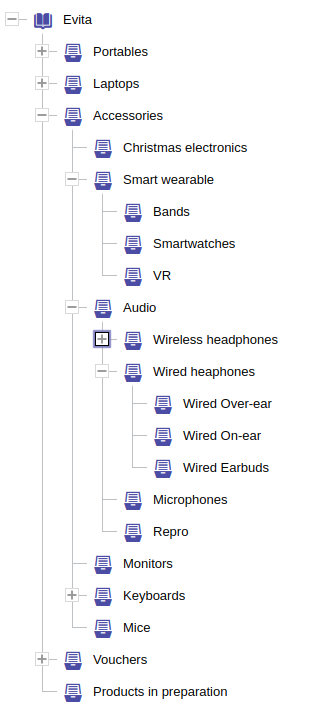

## Vlastnost reference

```evitaql-syntax
referenceProperty(
    argument:string!
    constraint:(traverseByEntityProperty|pickFirstByEntityProperty)?,
    constraint:orderingConstraint+
)
```

<dl>
    <dt>argument:string!</dt>
    <dd>
        povinný název reference, jejíž atribut má být použit pro řazení
    </dd>
    <dt>constraint:(traverseByEntityProperty|pickFirstByEntityProperty)?</dt>
    <dd>
        volitelný omezení, které určuje způsob řazení entit, viz dokumentace omezení [`pickFirstByEntityProperty`](#vyber-první-podle-vlastnosti-entity)
        a [`traverseByEntityProperty`](#procházej-podle-vlastnosti-entity) pro více detailů
    </dd>
    <dt>constraint:orderingConstraint+</dt>
    <dd>
        jedno nebo více [řadicích omezení](natural.md), která určují řazení podle atributu reference
    </dd>
</dl>

<Note type="info">

<NoteTitle toggles="false">

##### `referenceProperty` je implicitní v požadavku `referenceContent`

</NoteTitle>

V klauzuli `orderBy` v rámci požadavku [`referenceContent`](../requirements/fetching.md#referenční-obsah)
je omezení `referenceProperty` implicitní a nesmí být opakováno. Všechna omezení řazení atributů
v `referenceContent` automaticky odkazují na atributy reference, pokud zde není použit kontejner [`entityProperty`](#vlastnost-entity).

</Note>

Řazení podle atributu reference není tak běžné jako řazení podle atributů entity, ale umožňuje řadit entity,
které jsou v určité kategorii nebo mají určitou skupinu, specificky podle priority/pořadí pro daný vztah.

Chcete-li seřadit produkty související se skupinou "sale" podle atributu `orderInGroup` nastaveného na referenci, je třeba použít
následující dotaz:

<SourceCodeTabs requires="evita_test/evita_functional_tests/src/test/resources/META-INF/documentation/evitaql-init.java" langSpecificTabOnly>

[Dotaz na produkty ve "sale" seřazené podle řetězce předchůdců](/documentation/user/en/query/ordering/examples/reference/reference-attribute-natural.evitaql)
</SourceCodeTabs>

<Note type="info">

<NoteTitle toggles="true">

##### Seznam produktů ve "sale" seřazených podle řetězce předchůdců
</NoteTitle>

Příklad je založen na jednoduché referenci typu jedna-na-nula-nebo-jedna (produkt může mít maximálně jednu referenci na entitu skupiny). Odpověď vrátí pouze produkty, které mají referenci na skupinu "sale", přičemž všechny obsahují atribut
`orderInGroup` (protože je označen jako nepovinný atribut). Jelikož je příklad velmi jednoduchý, lze očekávat následující výsledek:

<LS to="e,j,c">

<MDInclude>[Seznam produktů ve "sale" seřazených podle řetězce předchůdců](/documentation/user/en/query/ordering/examples/reference/reference-attribute-natural.evitaql.md)</MDInclude>

</LS>

<LS to="g">

<MDInclude>[Seznam produktů ve "sale" seřazených podle řetězce předchůdců](/documentation/user/en/query/ordering/examples/reference/reference-attribute-natural.graphql.json.md)</MDInclude>

</LS>

<LS to="r">

<MDInclude>[Seznam produktů ve "sale" seřazených podle řetězce předchůdců](/documentation/user/en/query/ordering/examples/reference/reference-attribute-natural.rest.json.md)</MDInclude>

</LS>

</Note>

<Note type="warning">

<NoteTitle toggles="false">

##### Řazení 1:N referencí

</NoteTitle>

Situace se může zkomplikovat, pokud je reference typu jedna-na-mnoho. Co byste měli očekávat, když spustíte dotaz, který
zahrnuje řazení podle vlastnosti na atributu reference? Relační databáze to umožňují, ale musíte řešit problém násobení řádků. S evitaDB pracujete s entitním modelem, takže se tímto problémem nemusíte zabývat.
Je to možné, ale existují určité specifika, protože evitaDB podporuje hierarchické entity.

Rozdělme si to na dva případy:

**Nehirarchická entita**

Pokud je referencovaná entita nehirarchická a vracená entita odkazuje na více entit, pro řazení bude použita pouze reference
s nejnižším primárním klíčem referencované entity, která má zároveň nastavenou vlastnost řazení.
To je stejné, jako kdybyste použili omezení [`pickFirstByEntityProperty`](#vyber-první-podle-vlastnosti-entity)
ve vašem kontejneru `referenceProperty`:

```evitaql
pickFirstByEntityProperty(   
    primaryKeyNatural(ASC),   
)
```

**Hierarchická entita**

Pokud je referencovaná entita **hierarchická** a vracená entita odkazuje na více entit, pro řazení bude použita ta reference,
která obsahuje vlastnost řazení a je nejblíže kořenovému uzlu filtrované hierarchie.

Zní to složitě, ale ve skutečnosti je to poměrně jednoduché. Představte si, že vypisujete produkty z kategorie a zároveň je řadíte podle vlastnosti `orderInCategory` na referenci kategorie. Nejprve dostanete produkty přímo související s kategorií, v pořadí podle `orderInCategory`. Pak produkty z první podkategorie a tak dále, přičemž je zachováno pořadí stromu kategorií. To je stejné, jako kdybyste použili omezení [`traverseByEntityProperty`](#procházej-podle-vlastnosti-entity)
ve vašem kontejneru `referenceProperty`:

```evitaql
traverseByEntityProperty(  
    DEPTH_FIRST,  
    primaryKeyNatural(ASC),    
)
```

**Poznámka:**

Chování můžete ovlivnit pomocí omezení `pickFirstByEntityProperty` nebo `traverseByEntityProperty` ve vašem
kontejneru `referenceProperty`. Omezení `traverseByEntityProperty` lze použít i pro nehirarchické entity a pro 1:1
reference. Změní pořadí tak, že entity jsou nejprve řazeny podle vlastnosti entity, na kterou odkazují, a poté podle vlastnosti reference samotné. Pro více informací si projděte příklady a detailní dokumentaci
omezení [`traverseByEntityProperty`](#procházej-podle-vlastnosti-entity).

</Note>

## Vyber první podle vlastnosti entity

```evitaql-syntax
pickFirstByEntityProperty(
    constraint:orderingConstraint+
)
```

<dl>
    <dt>constraint:orderingConstraint+</dt>
    <dd>
        jedno nebo více [řadicích omezení](natural.md), která určují pořadí referencí, ze kterých se vybírá první
        z referencí na stejnou entitu, která bude použita pro řazení pomocí `referenceProperty`
    </dd>
</dl>

Řadicí omezení `pickFirstByEntityProperty` lze použít pouze v rámci řadicího omezení [`referenceProperty`](#vlastnost-reference).
Má smysl pouze v případě, že kardinalita reference je 1:N (i když to není aktivně kontrolováno dotazovacím enginem).
Toto omezení vám umožňuje určit pořadí referencí, ze kterých se vybírá první z referencí na stejnou entitu, která bude použita pro řazení pomocí `referenceProperty`.

Rozšiřme si předchozí příklad o produkty, které odkazují jak na skupinu "sale", tak na "new":

<SourceCodeTabs requires="evita_test/evita_functional_tests/src/test/resources/META-INF/documentation/evitaql-init.java" langSpecificTabOnly>

[Dotaz na produkty ve skupinách "sale" nebo "new" seřazené podle řetězce předchůdců](/documentation/user/en/query/ordering/examples/reference/reference-attribute-natural-multiple.evitaql)
</SourceCodeTabs>

<Note type="info">

<NoteTitle toggles="true">

##### Seznam produktů ve skupinách "sale" nebo "new" seřazených podle řetězce předchůdců
</NoteTitle>

<LS to="e,j,c">

<MDInclude>[Seznam produktů ve skupinách "sale" nebo "new" seřazených podle řetězce předchůdců](/documentation/user/en/query/ordering/examples/reference/reference-attribute-natural-multiple.evitaql.md)</MDInclude>

</LS>

<LS to="g">

<MDInclude>[Seznam produktů ve skupinách "sale" nebo "new" seřazených podle řetězce předchůdců](/documentation/user/en/query/ordering/examples/reference/reference-attribute-natural-multiple.graphql.json.md)</MDInclude>

</LS>

<LS to="r">

<MDInclude>[Seznam produktů ve skupinách "sale" nebo "new" seřazených podle řetězce předchůdců](/documentation/user/en/query/ordering/examples/reference/reference-attribute-natural-multiple.rest.json.md)</MDInclude>

</LS>

</Note>

Výsledek bude obsahovat nejprve produkty ze skupiny "new", která má nejnižší primární klíč. Poté budou následovat produkty ze skupiny "sale". Pořadí produktů v rámci každé skupiny bude určeno atributem `orderInGroup`. Takto se běžně postupuje u referencí, které cílí na nehirarchické entity.

Pokud chceme změnit pořadí skupin, můžeme použít řadicí omezení `pickFirstByEntityProperty` a explicitně určit pořadí skupin. Například pokud chceme nejprve vypsat produkty ve skupině "sale", můžeme použít následující dotaz:

<SourceCodeTabs requires="evita_test/evita_functional_tests/src/test/resources/META-INF/documentation/evitaql-init.java" langSpecificTabOnly>

[Dotaz na produkty ve skupinách "sale" nebo "new" seřazené podle řetězce předchůdců s explicitním řazením](/documentation/user/en/query/ordering/examples/reference/reference-attribute-natural-multiple-explicit.evitaql)
</SourceCodeTabs>

<Note type="info">

<NoteTitle toggles="true">

##### Seznam produktů ve skupinách "sale" nebo "new" seřazených podle řetězce předchůdců s explicitním řazením skupin
</NoteTitle>

<LS to="e,j,c">

<MDInclude>[Seznam produktů ve skupinách "sale" nebo "new" seřazených podle řetězce předchůdců s explicitním řazením skupin](/documentation/user/en/query/ordering/examples/reference/reference-attribute-natural-multiple-explicit.evitaql.md)</MDInclude>

</LS>

<LS to="g">

<MDInclude>[Seznam produktů ve skupinách "sale" nebo "new" seřazených podle řetězce předchůdců s explicitním řazením skupin](/documentation/user/en/query/ordering/examples/reference/reference-attribute-natural-multiple-explicit.graphql.json.md)</MDInclude>

</LS>

<LS to="r">

<MDInclude>[Seznam produktů ve skupinách "sale" nebo "new" seřazených podle řetězce předchůdců s explicitním řazením skupin](/documentation/user/en/query/ordering/examples/reference/reference-attribute-natural-multiple-explicit.rest.json.md)</MDInclude>

</LS>

Pokud je produkt v obou skupinách, prioritu má skupina "sale" a ta je použita pro řazení. Můžete použít různé řadicí omezení a přizpůsobit řazení svým potřebám.

</Note>

## Procházej podle vlastnosti entity

```evitaql-syntax
traverseByEntityProperty(
    argument:enum(DEPTH_FIRST|BREADTH_FIRST)?,
    constraint:orderingConstraint+
)
```

<dl>
    <dt>argument:enum(DEPTH_FIRST|BREADTH_FIRST)?</dt>
    <dd>
        volitelný argument, který určuje režim procházení referencí, výchozí hodnota je `DEPTH_FIRST`
    </dd>
    <dt>constraint:orderingConstraint+</dt>
    <dd>
        jedno nebo více [řadicích omezení](natural.md), která mění pořadí procházení referencí
        řazené entity před aplikací řadicího omezení `referenceProperty`
    </dd>
</dl>

Řadicí omezení `traverseByEntityProperty` lze použít pouze s řadicím omezením [`referenceProperty`](#vlastnost-reference).
To znamená, že entity by měly být nejprve seřazeny podle vlastnosti referencované entity. Pokud je entita
hierarchická, můžete určit, zda má být hierarchie procházená
[do hloubky (depth-first)](https://en.wikipedia.org/wiki/Depth-first_search) nebo [do šířky (breadth-first)](https://en.wikipedia.org/wiki/Breadth-first_search).

Jakmile jsou referencované entity seřazeny, pořadí referencovaných entit se aplikuje na reference na tyto entity.
Pokud existuje více referencí, pro řazení je použita pouze ta první, kterou lze vyhodnotit.

Toto chování je nejlépe ilustrováno následujícím příkladem. Vypišme produkty v kategorii 'Accessories' v pořadí
dle atributu `orderInCategory` na referenci kategorie:

<SourceCodeTabs requires="evita_test/evita_functional_tests/src/test/resources/META-INF/documentation/evitaql-init.java" langSpecificTabOnly>

[Dotaz na produkty v kategorii "Accessories" seřazené podle řetězce předchůdců](/documentation/user/en/query/ordering/examples/reference/reference-attribute-natural-hierarchy.evitaql)

</SourceCodeTabs>

<Note type="info">

<NoteTitle toggles="true">

##### Výpis produktů v kategorii "Accessories" seřazených podle řetězce předchůdců

</NoteTitle>

<LS to="e,j,c">

<MDInclude>[Výpis produktů v kategorii "Accessories" seřazených podle řetězce předchůdců](/documentation/user/en/query/ordering/examples/reference/reference-attribute-natural-hierarchy.evitaql.md)</MDInclude>

</LS>

<LS to="g">

<MDInclude>[Výpis produktů v kategorii "Accessories" seřazených podle řetězce předchůdců](/documentation/user/en/query/ordering/examples/reference/reference-attribute-natural-hierarchy.graphql.json.md)</MDInclude>

</LS>

<LS to="r">

<MDInclude>[Výpis produktů v kategorii "Accessories" seřazených podle řetězce předchůdců](/documentation/user/en/query/ordering/examples/reference/reference-attribute-natural-hierarchy.rest.json.md)</MDInclude>

</LS>

Výsledek bude nejprve obsahovat produkty v kategorii *Accessories*, seřazené podle `orderInCategory` od nejvyššího po nejnižší,
poté produkty v kategorii *Christmas electronics* (což je první potomek kategorie *Accessories* s nejnižším primárním klíčem),
poté produkty v kategorii *Smart wearable* (která nemá přímo přiřazené produkty),
poté produkty v kategorii *Bands* (první potomek kategorie *Smart wearable*) a tak dále.
Pořadí odpovídá pořadí kategorií na následujícím obrázku:



Pokud produkt spadá do kategorií **Christmas electronics** i **Smart wearable**, bude uveden pouze jednou.
Je to proto, že v tomto dotazu je pro procházení hierarchie použit primární klíč kategorie.

</Note>

Zde je další příklad: chceme vypsat produkty v kategorii *Accessories* v určitém pořadí. Toto pořadí je založeno
na atributu `orderInCategory` na referenci ke kategorii. Ale hierarchii chceme procházet
[šířkově (breadth first)](https://en.wikipedia.org/wiki/Breadth-first_search), přičemž každá úroveň hierarchie má být seřazena
nejprve podle atributu `order` kategorie:

<SourceCodeTabs requires="evita_test/evita_functional_tests/src/test/resources/META-INF/documentation/evitaql-init.java" langSpecificTabOnly>

[Výpis produktů šířkově podle pořadí v kategorii v pořadí kategorií](/documentation/user/en/query/ordering/examples/reference/reference-traverse-by.evitaql)

</SourceCodeTabs>

<Note type="info">

<NoteTitle toggles="true">

##### Výsledek výpisu produktů podle pořadí v kategorii v šířkovém pořadí kategorií
</NoteTitle>

<LS to="e,j">

<MDInclude sourceVariable="recordData">[Výsledek výpisu produktů podle pořadí v kategorii v šířkovém pořadí kategorií](/documentation/user/en/query/ordering/examples/reference/reference-traverse-by.evitaql.json.md)</MDInclude>

</LS>

<LS to="g">

<MDInclude>[Výsledek výpisu produktů podle pořadí v kategorii v šířkovém pořadí kategorií](/documentation/user/en/query/ordering/examples/reference/reference-traverse-by.graphql.json.md)</MDInclude>

</LS>

<LS to="r">

<MDInclude>[Výsledek výpisu produktů podle pořadí v kategorii v šířkovém pořadí kategorií](/documentation/user/en/query/ordering/examples/reference/reference-traverse-by.rest.json.md)</MDInclude>

</LS>

Jak vidíte, pořadí entit i referencí v rámci hierarchie si můžete uspořádat dle libosti.

</Note>

## Vlastnost entity

```evitaql-syntax
entityProperty(
    constraint:orderingConstraint+
)
```

<dl>
    <dt>constraint:orderingConstraint+</dt>
    <dd>
        jedno nebo více [řadicích omezení](natural.md), která určují řazení podle atributů referencované entity
    </dd>
</dl>

Řadicí omezení `entityProperty` lze použít pouze v rámci požadavku [`referenceContent`](../requirements/fetching.md#referenční-obsah).
Umožňuje změnit kontext řazení reference z atributů samotné reference na atributy entity, na kterou reference ukazuje.

Jinými slovy, pokud má entita `Product` více referencí na entity `ParameterValue`, můžete tyto
reference řadit například podle atributu `order` nebo `name` entity `ParameterValue`. Podívejme se na příklad:

<SourceCodeTabs requires="evita_test/evita_functional_tests/src/test/resources/META-INF/documentation/evitaql-init.java" langSpecificTabOnly>

[Získání produktu s parametry seřazenými podle jejich priority](/documentation/user/en/query/ordering/examples/reference/entity-property.evitaql)
</SourceCodeTabs>

<Note type="info">

<NoteTitle toggles="true">

##### Získání produktu s hodnotami parametrů seřazenými podle jejich názvu
</NoteTitle>

<LS to="e,j">

<MDInclude sourceVariable="recordData.0">[Získání produktu s parametry seřazenými podle jejich názvu](/documentation/user/en/query/ordering/examples/reference/entity-property.evitaql.json.md)</MDInclude>

</LS>

<LS to="g">

<MDInclude>[Získání produktu s parametry seřazenými podle jejich názvu](/documentation/user/en/query/ordering/examples/reference/entity-property.graphql.json.md)</MDInclude>

</LS>

<LS to="r">

<MDInclude>[Získání produktu s parametry seřazenými podle jejich názvu](/documentation/user/en/query/ordering/examples/reference/entity-property.rest.json.md)</MDInclude>

</LS>

</Note>

## Vlastnost skupiny entity

```evitaql-syntax
entityGroupProperty(
    constraint:orderingConstraint+
)
```

<dl>
    <dt>constraint:orderingConstraint+</dt>
    <dd>
        jedno nebo více [řadicích omezení](natural.md), která určují řazení podle atributů skupiny referencované entity
    </dd>
</dl>

Řadicí omezení `entityGroupProperty` lze použít pouze v rámci požadavku [`referenceContent`](../requirements/fetching.md#referenční-obsah).
Umožňuje změnit kontext řazení reference z atributů samotné reference na atributy skupinové entity, v rámci které je reference agregována.

Jinými slovy, pokud má entita `Product` více referencí na entity `ParameterValue`, které jsou seskupeny podle jejich
přiřazení k entitě `Parameter`, můžete tyto reference řadit primárně podle atributu `name` seskupující entity a sekundárně podle atributu `name` referencované entity. Podívejme se na příklad:

<SourceCodeTabs requires="evita_test/evita_functional_tests/src/test/resources/META-INF/documentation/evitaql-init.java" langSpecificTabOnly>

[Získání produktu s parametry seřazenými podle názvu skupiny a názvu](/documentation/user/en/query/ordering/examples/reference/entity-group-property.evitaql)

</SourceCodeTabs>

<Note type="info">

<NoteTitle toggles="true">

##### Získání produktu s parametry seřazenými podle priority
</NoteTitle>

<LS to="e,j,c">

<MDInclude sourceVariable="recordData.0">[Získání produktu s parametry seřazenými podle názvu skupiny a názvu](/documentation/user/en/query/ordering/examples/reference/entity-group-property.evitaql.json.md)</MDInclude>

</LS>

<LS to="g">

<MDInclude>[Získání produktu s parametry seřazenými podle názvu skupiny a názvu](/documentation/user/en/query/ordering/examples/reference/entity-group-property.graphql.json.md)</MDInclude>

</LS>

<LS to="r">

<MDInclude>[Získání produktu s parametry seřazenými podle názvu skupiny a názvu](/documentation/user/en/query/ordering/examples/reference/entity-group-property.rest.json.md)</MDInclude>

</LS>

</Note>