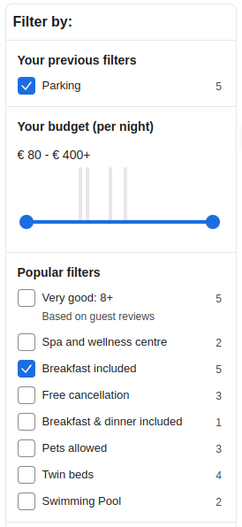
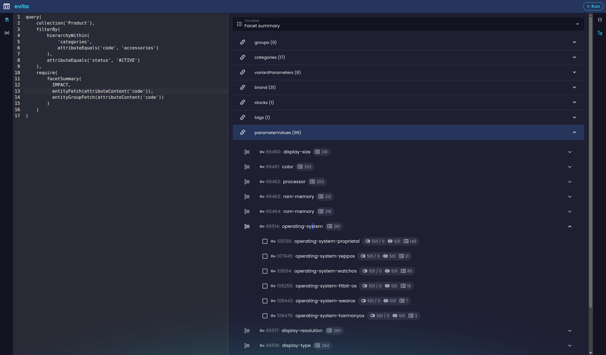
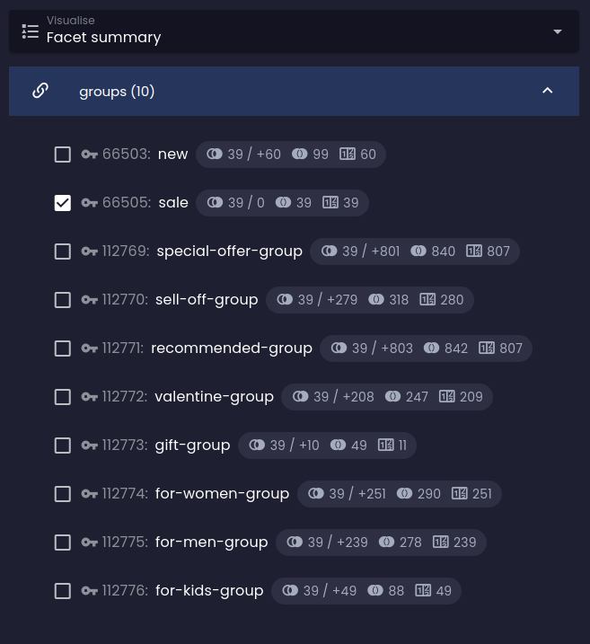
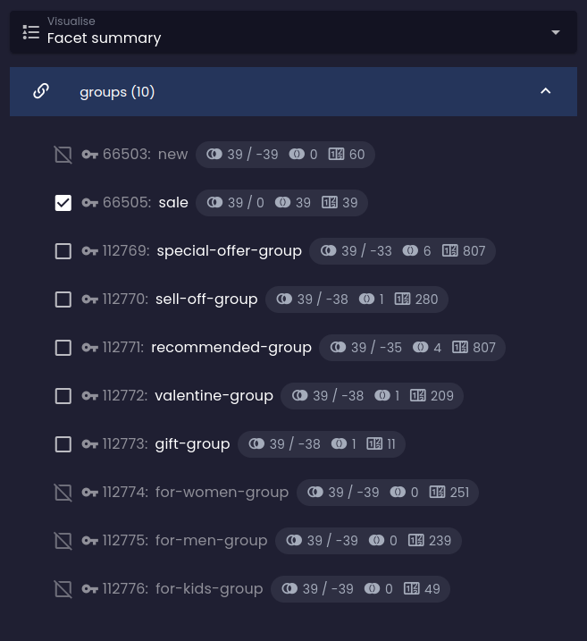
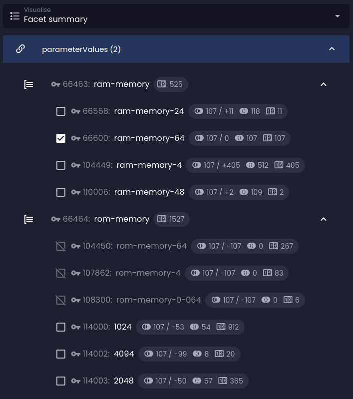
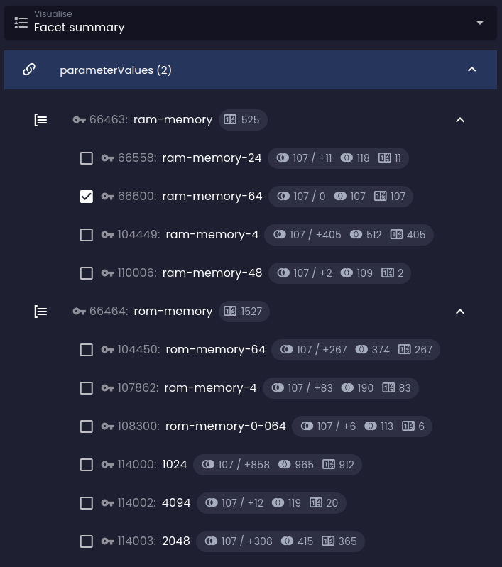
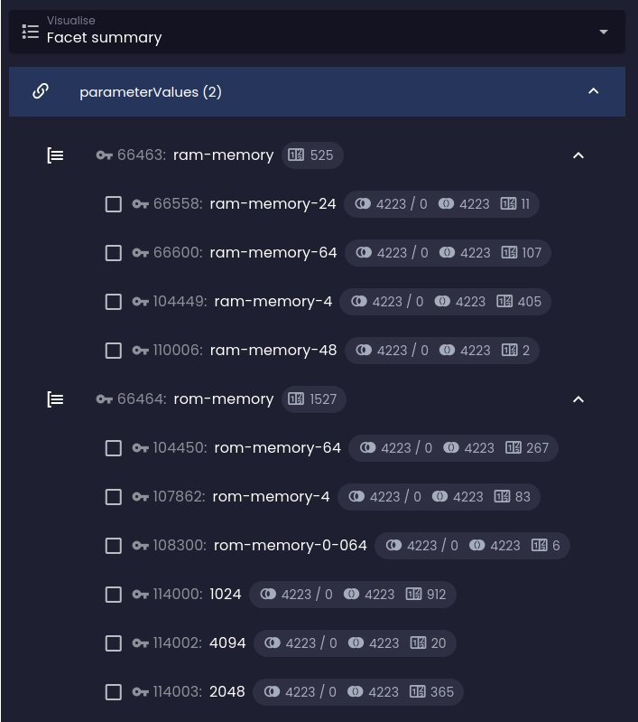
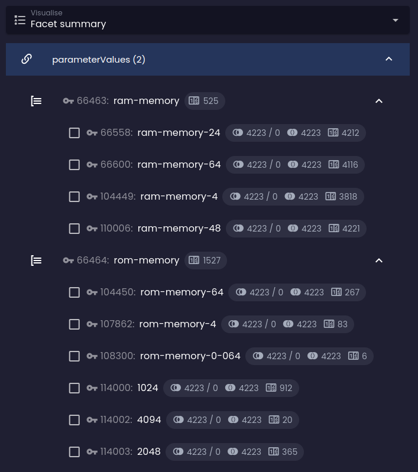
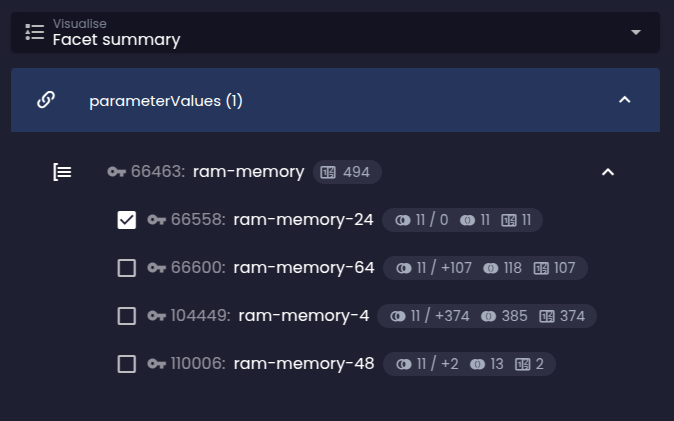

Klíčovým faktorem úspěchu fasetového vyhledávání je pomoci uživatelům vyhnout se situacím, kdy jejich kombinace filtrů nevrátí žádné výsledky. Nejlépe funguje, když postupně omezujeme možnosti faset, které nedávají smysl vzhledem k již vybraným, a zároveň poskytujeme přesnou, okamžitou a v reálném čase zpětnou vazbu o počtu výsledků, které by rozšířily nebo omezily aktuální výběr při výběru další fasety.

Fasety jsou obvykle zobrazeny jako seznam zaškrtávacích políček, přepínačů, rozbalovacích nabídek nebo posuvníků a jsou organizovány do skupin. Možnosti v rámci skupiny obvykle rozšiřují aktuální výběr (logická disjunkce) a skupiny jsou obvykle kombinovány logickou konjunkcí. Některé fasety lze negovat (logická negace) pro vyloučení výsledků, které odpovídají dané možnosti fasety.

Fasety s vysokou kardinalitou jsou někdy prezentovány ve formě vyhledávacího pole nebo intervalového posuvníku (někdy s [histogramem](histogram.md) rozložení hodnot), aby uživatelé mohli zadat přesnou hodnotu nebo rozsah hodnot, které hledají.

evitaDB podporuje všechny výše uvedené formy fasetového vyhledávání pomocí operátorů popsaných v této kapitole a v [histogramu](histogram.md).

## Vizualizace v evitaLab

Pokud se chcete blíže seznámit s výpočtem fasetového souhrnu, můžete si pohrát s dotazem a sledovat, jak ovlivňuje záložku vizualizace, kterou najdete v naší konzoli [evitaLab](https://demo.evitadb.io):



Vizualizace je organizována stejným způsobem jako samotný fasetový souhrn:

| Ikona                                                                                         | Význam                                                                                                                                                                                                                 |
|-----------------------------------------------------------------------------------------------|------------------------------------------------------------------------------------------------------------------------------------------------------------------------------------------------------------------------|
|                                                   | Na nejvyšší úrovni vidíte odkazy označené ikonou řetězu.                                                                                                                        |
|                                          | Pod nimi jsou skupiny nalezené v rámci těchto typů referencí, označené ikonou skupiny, a nakonec pod skupinami jsou samotné možnosti faset.                                      |
|                                     | Představuje počet entit, které odpovídají této možnosti fasety, když uživatel nemá vybrány žádné jiné fasety (tj. má prázdné omezení [`userFilter`](../filtering/behavioral.md#uživatelský-filtr)). |
|             | Představuje aktuální počet entit odpovídajících filtračním omezením, za lomítkem je rozdíl v počtu výsledků při přidání této možnosti fasety do uživatelského filtru.                  |
|                           | Představuje celkový počet entit, které budou zobrazeny ve výsledku při výběru této možnosti fasety (tj. počet entit odpovídajících fasetě v celé datové sadě).                        |

### Výchozí pravidla výpočtu faset

1. Fasetový souhrn se počítá pouze pro entity, které jsou vráceny v aktuálním výsledku dotazu (bez vlivu části `userFilter`, pokud je přítomna)
2. Výpočet respektuje všechna filtrační omezení umístěná mimo kontejner [`userFilter`](../filtering/behavioral.md#uživatelský-filtr).
3. Výchozí vztah mezi fasetami ve skupině je logická disjunkce (logické NEBO), pokud neuvedete jinak.
4. Výchozí vztah mezi fasetami v různých skupinách/referencích je logická konjunkce (logické A), pokud neuvedete jinak.

<Note type="info">

Výchozí vztahy výpočtu faset můžete změnit pomocí [`facetCalculationRules`](#pravidla-výpočtu-faset) v požadavkové části dotazu.

</Note>

## Fasetový souhrn

<LS to="e,j,c">

```evitaql-syntax
facetSummary(
    argument:enum(COUNTS|IMPACT)?,
    filterConstraint:filterBy,
    filterConstraint:filterGroupBy,
    orderConstraint:orderBy,
    orderConstraint:orderGroupBy,
    requireConstraint:entityFetch,
    requireConstraint:entityGroupFetch
)
```

<dl>
    <dt>argument:enum(COUNTS|IMPACT)?</dt>
    <dd>
        <p>**Výchozí:** `COUNTS`</p>

        <p>volitelný argument typu <LS to="j,e,r,g"><SourceClass>evita_query/src/main/java/io/evitadb/api/query/require/FacetStatisticsDepth.java</SourceClass></LS><LS to="c"><SourceClass>EvitaDB.Client/Queries/Requires/FacetStatisticsDepth.cs</SourceClass></LS>,
            který umožňuje určit hloubku výpočtu fasetového souhrnu:</p>

        <p>
        - **COUNTS**: každá faseta obsahuje pouze počet výsledků odpovídajících dané možnosti fasety
        - **IMPACT**: každá nevybraná faseta obsahuje predikci počtu výsledků, které by byly vráceny, pokud by byla tato možnost fasety vybrána (analýza dopadu); tento výpočet je ovlivněn požadovanými omezeními, která mění výchozí chování výpočtu faset: [konjunkce](#konjunkce-skupin-faset), [disjunkce](#disjunkce-skupin-faset), [negace](#negace-skupin-faset).
        </p>

    </dd>
    <dt>filterConstraint:filterBy</dt>
    <dd>
        volitelné filtrační omezení, které omezuje fasety zobrazené a počítané v souhrnu na ty, které odpovídají zadanému filtru.
    </dd>
    <dt>filterConstraint:filterGroupBy</dt>
    <dd>
        volitelné filtrační omezení, které omezuje celou skupinu faset, jejíž fasety jsou zobrazeny a počítány v souhrnu, na ty, které patří do skupiny faset odpovídající filtru.
    </dd>
    <dt>orderConstraint:orderBy</dt>
    <dd>
        volitelné pořadí, které určuje pořadí možností faset v rámci každé skupiny faset
    </dd>
    <dt>orderConstraint:orderGroupBy</dt>
    <dd>
        volitelné pořadí, které určuje pořadí skupin faset
    </dd>
	<dt>requireConstraint:entityFetch</dt>
    <dd>
        volitelné požadavkové omezení, které umožňuje načíst tělo referencované entity; omezení `entityFetch` může obsahovat vnořený `referenceContent` s dalším omezením `entityFetch` / `entityGroupFetch`, což umožňuje načítat entity grafově do "nekonečné" hloubky
    </dd>
    <dt>requireConstraint:entityGroupFetch</dt>
    <dd>
        volitelné požadavkové omezení, které umožňuje načíst tělo skupiny referencovaných entit; omezení `entityGroupFetch` může obsahovat vnořený `referenceContent` s dalším omezením `entityFetch` / `entityGroupFetch`, což umožňuje načítat entity grafově do "nekonečné" hloubky
    </dd>
</dl>

</LS>
<LS to="r">

```evitaql-syntax
facetSummary(
    argument:enum(COUNTS|IMPACT),
    requireConstraint:entityFetch,
    requireConstraint:entityGroupFetch
)
```

<dl>
    <dt>argument:enum(COUNTS|IMPACT)</dt>
    <dd>
        <p>**Výchozí:** `COUNTS`</p>

        <p>volitelný argument typu <SourceClass>evita_query/src/main/java/io/evitadb/api/query/require/FacetStatisticsDepth.java</SourceClass>,
            který umožňuje určit hloubku výpočtu fasetového souhrnu:</p>

        <p>
        - **COUNTS**: každá faseta obsahuje pouze počet výsledků odpovídajících dané možnosti fasety
        - **IMPACT**: každá nevybraná faseta obsahuje predikci počtu výsledků, které by byly vráceny, pokud by byla tato možnost fasety vybrána (analýza dopadu); tento výpočet je ovlivněn požadovanými omezeními, která mění výchozí chování výpočtu faset: [konjunkce](#konjunkce-skupin-faset), [disjunkce](#disjunkce-skupin-faset), [negace](#negace-skupin-faset).
        </p>

    </dd>
	<dt>requireConstraint:entityFetch</dt>
    <dd>
        volitelné požadavkové omezení, které umožňuje načíst tělo referencované entity; omezení `entityFetch` může obsahovat vnořený `referenceContent` s dalším omezením `entityFetch` / `entityGroupFetch`, což umožňuje načítat entity grafově do "nekonečné" hloubky
    </dd>
    <dt>requireConstraint:entityGroupFetch</dt>
    <dd>
        volitelné požadavkové omezení, které umožňuje načíst tělo skupiny referencovaných entit; omezení `entityGroupFetch` může obsahovat vnořený `referenceContent` s dalším omezením `entityFetch` / `entityGroupFetch`, což umožňuje načítat entity grafově do "nekonečné" hloubky
    </dd>
</dl>

</LS>

<LS to="e,j,c,r">

Požadavek spustí výpočet <LS to="j,e,r"><SourceClass>evita_api/src/main/java/io/evitadb/api/requestResponse/extraResult/FacetSummary.java</SourceClass></LS><LS to="c"><SourceClass>EvitaDB.Client/Models/ExtraResults/FacetSummary.cs</SourceClass></LS>
obsahující fasetový souhrn. Vypočtený fasetový souhrn bude obsahovat všechny entity označené jako `faceted` ve [schématu entity](../../use/schema.md). Fasetový souhrn lze dále upravit omezením [fasetového souhrnu reference](#fasetový-souhrn-reference), které umožňuje přepsat obecné chování fasetového souhrnu určené v obecné požadavkové podmínce.

</LS>

<LS to="g">

Fasetový souhrn lze vyžádat pomocí pole `facetSummary` v rámci extra výsledků. Tento požadavek spustí výpočet objektu fasetového souhrnu, který obsahuje výpočet fasetového souhrnu.
Vypočtený fasetový souhrn může obsahovat všechny entity označené jako `faceted` ve [schématu entity](../../use/schema.md). Výpočet fasetového souhrnu je požadován samostatně pro každou referenci, takže každá reference může mít své vlastní chování.

</LS>

<Note type="warning">

Vlastnost `faceted` ovlivňuje velikost indexů uchovávaných v paměti a rozsah/komplexitu obecného fasetového souhrnu (tj. souhrnu generovaného požadavkem `facetSummary`). Doporučujeme označit jako `faceted` pouze reference používané pro fasetové filtrování, abyste udrželi indexy malé a výpočet fasetového souhrnu v uživatelském rozhraní rychlý a jednoduchý. Kombinatorická složitost fasetového souhrnu je u velkých datových sad poměrně vysoká a můžete být nuceni jej optimalizovat zúžením souhrnu pomocí [filtrování](#filtrování-fasetového-souhrnu) nebo výběrem pouze [několika referencí](#fasetový-souhrn-reference) pro souhrn.

</Note>

### Struktura fasetového souhrnu

Fasetový souhrn obsahuje pouze entity referencované entitami vrácenými v aktuální odpovědi na dotaz (bez vlivu části userFilter, pokud je přítomna) a je organizován ve tříúrovňové struktuře:

- **[reference](#1-úroveň-reference)**: nejvyšší úroveň obsahuje názvy referencí označených jako `faceted` ve [schématu entity](../../use/schema.md)
- **[skupina faset](#2-úroveň-skupina-faset)**: druhá úroveň obsahuje skupiny, které jsou specifikovány v [referencích vrácené entity](../../use/data-model.md#reference)
- **[faseta](#3-úroveň-faseta)**: třetí úroveň obsahuje možnosti faset, které reprezentují entity referencí vrácené entity

#### 1. úroveň: reference

Pro každou entitní referenci označenou jako `faceted` ve fasetovém souhrnu existuje samostatný datový kontejner pro kolekci [2. úrovně skupin faset](#2-úroveň-skupina-faset). Pokud fasety pro tuto referenci nejsou organizovány do skupin (reference postrádá informaci o skupině), fasetový souhrn bude obsahovat pouze jednu skupinu faset s názvem "neskupinové fasety".

#### 2. úroveň: skupina faset

Skupina faset uvádí všechny [možnosti faset](#3-úroveň-faseta) dostupné pro danou kombinaci skupiny a reference. Obsahuje také `count` všech entit v aktuálním výsledku dotazu, které odpovídají alespoň jedné fasetě ve skupině/reference.
<LS to="e,j,c,r">
Volitelně může obsahovat tělo skupinové entity, pokud je zadán požadavek [`entityGroupFetch`](#načítání-skupin-entit).
</LS>
<LS to="g">
Volitelně může obsahovat tělo skupinové entity, pokud je zadáno pole `groupEntity`.
</LS>

Může také existovat speciální "skupina" pro fasety, které nejsou přiřazeny ke skupině.
<LS to="e,j,c">
Tato skupina bude ve fasetovém souhrnu jako vlastnost `nonGroupedStatistics`.
</LS>
<LS to="g,r">
Tato skupina bude vrácena jako jediná skupina pro referenci.
</LS>

#### 3. úroveň: faseta

Faseta obsahuje statistiky pro danou možnost fasety:

<dl>
  <dt>count</dt>
  <dd>
    Udává počet všech entit v aktuálním výsledku dotazu (včetně omezení uživatelského filtru), které mají tuto fasetu (mají referenci na entitu s tímto primárním klíčem).
  </dd>
  <dt>requested</dt>
  <dd>
    `TRUE`, pokud je tato faseta požadována v kontejneru [`user filter`](../filtering/behavioral.md#uživatelský-filtr) tohoto dotazu, jinak `FALSE` (tato vlastnost umožňuje snadno označit zaškrtávací políčko fasety jako zaškrtnuté v uživatelském rozhraní).
  </dd>
</dl>

<LS to="e,j,c,r">
A volitelně tělo fasetové (referencované) entity, pokud je zadán požadavek [`entityFetch`](#načítání-entit).
Pokud je ve fasetovém souhrnu požadována hloubka statistik `IMPACT`, statistiky budou obsahovat také výpočet analýzy dopadu, který obsahuje následující data:
</LS>
<LS to="g">
A volitelně tělo fasetové (referencované) entity, pokud je zadáno pole `facetEntity`.
Pokud je ve fasetovém souhrnu požadován objekt `impact`, statistiky budou obsahovat také výpočet analýzy dopadu, který může obsahovat následující data:
</LS>

<dl>
  <dt>matchCount</dt>
  <dd>
    Udává počet všech entit, které by odpovídaly novému dotazu odvozenému z aktuálního dotazu, pokud by byla tato konkrétní možnost fasety vybrána (má referenci na entitu s tímto primárním klíčem). Aktuální dotaz zůstává nezměněn, včetně části [`user filter`](../filtering/behavioral.md#uživatelský-filtr), ale do uživatelského filtru je virtuálně přidán nový fasetový dotaz pro výpočet hypotetického dopadu výběru možnosti fasety.
  </dd>
  <dt>difference</dt>
  <dd>
    Udává rozdíl mezi `matchCount` (hypotetický výsledek při výběru fasety) a aktuálním počtem vrácených entit. Udává velikost dopadu na aktuální výsledek. Může být kladný (faseta by rozšířila aktuální výsledek) nebo záporný (faseta by omezila aktuální výsledek). Rozdíl může být `0`, pokud faseta nemění aktuální výsledek.
  </dd>
  <dt>hasSense</dt>
  <dd>
    `TRUE`, pokud kombinace možnosti fasety s aktuálním dotazem stále vrací nějaké výsledky (matchCount > 0), jinak `FALSE`. Tato vlastnost umožňuje snadno označit zaškrtávací políčko fasety jako "neaktivní" v uživatelském rozhraní.
  </dd>
</dl>

<LS to="e,j,r,c">

Požadavek <LS to="j,e,r,g"><SourceClass>evita_query/src/main/java/io/evitadb/api/query/require/FacetSummary.java</SourceClass></LS><LS to="c"><SourceClass>EvitaDB.Client/Queries/Requires/FacetSummary.cs</SourceClass></LS>
spouští výpočet <LS to="j,e,r,g"><SourceClass>evita_api/src/main/java/io/evitadb/api/requestResponse/extraResult/FacetSummary.java</SourceClass></LS><LS to="c"><SourceClass>EvitaDB.Client/Models/ExtraResults/FacetSummary.cs</SourceClass></LS>
jako vedlejší výsledek hlavního dotazu na entity a respektuje všechna filtrační omezení na dotazované entity. Pro demonstraci výpočtu fasetového souhrnu použijeme následující příklad:

<SourceCodeTabs requires="evita_test/evita_functional_tests/src/test/resources/META-INF/documentation/evitaql-init.java" langSpecificTabOnly>

[Výpočet fasetového souhrnu pro produkty v kategorii "e-čtečky"](/documentation/user/en/query/requirements/examples/facet/facet-summary.evitaql)

</SourceCodeTabs>

</LS>

<LS to="g">

Pokud je pole `facetSummary` zadáno s konkrétními referencemi v rámci pole `extraResults`, spustí se výpočet fasetového souhrnu jako extra výsledek.
Fasetový souhrn je vždy vypočítán jako vedlejší výsledek hlavního dotazu na entity a respektuje všechna filtrační omezení na dotazované entity. Pro demonstraci výpočtu fasetového souhrnu použijeme následující příklad:

<SourceCodeTabs requires="evita_test/evita_functional_tests/src/test/resources/META-INF/documentation/evitaql-init.java" langSpecificTabOnly>

[Výpočet fasetového souhrnu pro produkty v kategorii "e-čtečky"](/documentation/user/en/query/requirements/examples/facet/facet-summary-of-reference-simple.evitaql)

</SourceCodeTabs>

</LS>

<Note type="info">

<NoteTitle toggles="true">

##### Výsledek fasetového souhrnu v kategorii "e-čtečky"

</NoteTitle>

Dotaz vrací seznam "aktivních" produktů v kategorii "e-čtečky" a v indexu extra výsledků obsahuje také výpočet fasetového souhrnu:

<LS to="e,j,c">

<MDInclude sourceVariable="extraResults.FacetSummary">[Výsledek fasetového souhrnu v kategorii "e-čtečky"](/documentation/user/en/query/requirements/examples/facet/facet-summary.evitaql.string.md)</MDInclude>

</LS>
<LS to="g">

<MDInclude sourceVariable="data.queryProduct.extraResults.facetSummary">[Výsledek fasetového souhrnu v kategorii "e-čtečky"](/documentation/user/en/query/requirements/examples/facet/facet-summary-of-reference-simple.graphql.json.md)</MDInclude>

</LS>
<LS to="r">

<MDInclude sourceVariable="extraResults.facetSummary">[Výsledek fasetového souhrnu v kategorii "e-čtečky"](/documentation/user/en/query/requirements/examples/facet/facet-summary.rest.json.md)</MDInclude>

</LS>

<LS to="e,j,c">

Formát byl zjednodušen, protože surový výsledek v JSON by byl příliš dlouhý a obtížně čitelný. Toto je výstupní formát metody `prettyPrint` třídy <SourceClass>evita_api/src/main/java/io/evitadb/api/requestResponse/extraResult/FacetSummary.java</SourceClass>
a můžete vidět souhrn organizovaný ve tříúrovňové struktuře spolu s informacemi o počtu výsledkových entit pro každou fasetu a skupinu faset. Žádná faseta není aktuálně vybrána, a proto není nikde zaškrtnuté `[ ]`. Výpis neobsahuje žádné lidsky čitelné informace kromě primárních klíčů referencí, skupin faset a faset – pro jejich získání bychom museli přidat [jejich těla](#načítání-těl-faset-skupin).

</LS>
<LS to="g,r">

Můžete vidět souhrn organizovaný ve tříúrovňové struktuře spolu s informacemi o počtu výsledkových entit pro každou fasetu a skupinu faset. Žádná faseta není aktuálně vybrána, a proto je vlastnost `requested` všude `false`. Výpis neobsahuje žádné lidsky čitelné informace kromě primárních klíčů referencí, skupin faset a faset – pro jejich získání bychom museli přidat [jejich těla](#načítání-těl-faset-skupin).

</LS>

</Note>

### Načítání těl faset (skupin)

<LS to="e,j,c,r">

Fasetový souhrn má malý smysl bez těl skupin faset a faset. Pro jejich získání je třeba do dotazu přidat požadavek [`entityFetch`](#načítání-entit) nebo [`entityGroupFetch`](#načítání-skupin-entit). Upravme příklad tak, abychom načetli fasetový souhrn spolu s kódy faset a jejich skupin:

</LS>
<LS to="g">

Fasetový souhrn má malý smysl bez těl skupin faset a faset. Pro jejich získání je třeba požadovat pole [`facetEntity`](#načítání-entit) nebo [`groupEntity`](#načítání-skupin-entit). Upravme příklad tak, abychom načetli fasetový souhrn spolu s kódy faset a jejich skupin:

</LS>

<LS to="e,j,r,c">

<SourceCodeTabs requires="evita_test/evita_functional_tests/src/test/resources/META-INF/documentation/evitaql-init.java" langSpecificTabOnly>

[Výpočet fasetového souhrnu s těly pro produkty v kategorii "e-čtečky"](/documentation/user/en/query/requirements/examples/facet/facet-summary-bodies.evitaql)

</SourceCodeTabs>

</LS>

<LS to="g">

<SourceCodeTabs requires="evita_test/evita_functional_tests/src/test/resources/META-INF/documentation/evitaql-init.java" langSpecificTabOnly>

[Výpočet fasetového souhrnu s těly pro produkty v kategorii "e-čtečky"](/documentation/user/en/query/requirements/examples/facet/facet-summary-of-reference-bodies.evitaql)

</SourceCodeTabs>

</LS>

<Note type="info">

<NoteTitle toggles="true">

##### Výsledek fasetového souhrnu v kategorii "e-čtečky" včetně těl referencovaných entit

</NoteTitle>

Nyní můžete vidět, že fasetový souhrn obsahuje nejen primární klíče, ale také srozumitelné kódy faset a jejich příslušných skupin:

<LS to="e,j,c">

<MDInclude sourceVariable="extraResults.FacetSummary">[Výsledek fasetového souhrnu v kategorii "e-čtečky" včetně těl referencovaných entit](/documentation/user/en/query/requirements/examples/facet/facet-summary-bodies.evitaql.string.md)</MDInclude>

</LS>
<LS to="g">

<MDInclude sourceVariable="data.queryProduct.extraResults.facetSummary">[Výsledek fasetového souhrnu v kategorii "e-čtečky" včetně těl referencovaných entit](/documentation/user/en/query/requirements/examples/facet/facet-summary-of-reference-bodies.graphql.json.md)</MDInclude>

</LS>
<LS to="r">

<MDInclude sourceVariable="extraResults.facetSummary">[Výsledek fasetového souhrnu v kategorii "e-čtečky" včetně těl referencovaných entit](/documentation/user/en/query/requirements/examples/facet/facet-summary-bodies.rest.json.md)</MDInclude>

</LS>

Pokud do dotazu přidáte požadovaný jazyk a také vypíšete lokalizované názvy, získáte výsledek, který se velmi blíží verzi, kterou chcete vidět v uživatelském rozhraní:

<LS to="e,j,r,c">

<SourceCodeTabs requires="evita_test/evita_functional_tests/src/test/resources/META-INF/documentation/evitaql-init.java" langSpecificTabOnly>

[Výpočet fasetového souhrnu s lokalizovanými názvy pro produkty v kategorii "e-čtečky"](/documentation/user/en/query/requirements/examples/facet/facet-summary-localized-bodies.evitaql)

</SourceCodeTabs>

</LS>
<LS to="g">

<SourceCodeTabs requires="evita_test/evita_functional_tests/src/test/resources/META-INF/documentation/evitaql-init.java" langSpecificTabOnly>

[Výpočet fasetového souhrnu s lokalizovanými názvy pro produkty v kategorii "e-čtečky"](/documentation/user/en/query/requirements/examples/facet/facet-summary-of-reference-localized-bodies.evitaql)

</SourceCodeTabs>

</LS>

<LS to="e,j,c">

<MDInclude sourceVariable="extraResults.FacetSummary">[Výsledek fasetového souhrnu s lokalizovanými názvy pro produkty v kategorii "e-čtečky"](/documentation/user/en/query/requirements/examples/facet/facet-summary-localized-bodies.evitaql.string.md)</MDInclude>

</LS>
<LS to="g">

<MDInclude sourceVariable="data.queryProduct.extraResults.facetSummary">[Výsledek fasetového souhrnu s lokalizovanými názvy pro produkty v kategorii "e-čtečky"](/documentation/user/en/query/requirements/examples/facet/facet-summary-of-reference-localized-bodies.graphql.json.md)</MDInclude>

</LS>
<LS to="r">

<MDInclude sourceVariable="extraResults.facetSummary">[Výsledek fasetového souhrnu s lokalizovanými názvy pro produkty v kategorii "e-čtečky"](/documentation/user/en/query/requirements/examples/facet/facet-summary-localized-bodies.rest.json.md)</MDInclude>

</LS>

</Note>

<LS to="e,j,g,c">

### Filtrování fasetového souhrnu

Fasetový souhrn může být někdy velmi rozsáhlý a kromě toho, že není příliš užitečné zobrazovat všechny možnosti faset v uživatelském rozhraní, také jeho výpočet zabere hodně času.
Pro omezení fasetového souhrnu můžete použít omezení [`filterBy`](../basics.md#filtrování) a `filterGroupBy` (což je totéž jako `filterBy`, ale filtruje celou skupinu faset místo jednotlivých faset).

<LS to="g">

`filterGroupBy` lze zadat na každém referenčním poli vracejícím skupiny faset. `filterBy` lze zadat hlouběji ve struktuře fasetového souhrnu, konkrétně v rámci definice skupiny na poli `facetStatistics`, které vrací skutečné možnosti faset.

</LS>

<Note type="warning">

<LS to="e,j,c">

Pokud přidáte filtrační omezení do požadavku `facetSummary`, můžete odkazovat pouze na filtrovatelné vlastnosti, které jsou sdílené všemi referencovanými entitami. To nemusí být v některých případech možné a budete muset rozdělit obecný požadavek `facetSummary` na více jednotlivých požadavků [`facetSummaryOfReference`](#fasetový-souhrn-reference) se specifickými filtry pro každý typ reference.

</LS>

<MDInclude>[Chování filtrování na referencovaných entitách v omezení fasetového souhrnu](/documentation/user/en/query/requirements/assets/referenced-filter-note.md)</MDInclude>

</Note>

Je těžké najít dobrý příklad pro filtrování obecného fasetového souhrnu i pro naši demo datovou sadu, takže příklad bude trochu umělý. Řekněme, že chceme zobrazit pouze možnosti faset, jejichž atribut *code* obsahuje podřetězec *ar*, a pouze ty, které jsou ve skupinách s *code* začínajícím písmenem *o*:

<LS to="e,j,c">

<SourceCodeTabs requires="evita_test/evita_functional_tests/src/test/resources/META-INF/documentation/evitaql-init.java" langSpecificTabOnly>

[Filtrování možností fasetového souhrnu](/documentation/user/en/query/requirements/examples/facet/facet-summary-filtering.evitaql)

</SourceCodeTabs>

</LS>
<LS to="g">

<SourceCodeTabs requires="evita_test/evita_functional_tests/src/test/resources/META-INF/documentation/evitaql-init.java" langSpecificTabOnly>

[Filtrování možností fasetového souhrnu](/documentation/user/en/query/requirements/examples/facet/facet-summary-of-reference-filtering.evitaql)

</SourceCodeTabs>

</LS>

<Note type="info">

<NoteTitle toggles="true">

##### Výsledek filtrování fasetového souhrnu

</NoteTitle>

Neomezujeme vyhledávání na konkrétní hierarchii, protože filtr je poměrně selektivní, jak můžete vidět ve výsledku:

<LS to="e,j,c">

<MDInclude sourceVariable="extraResults.FacetSummary">[Výsledek filtrování fasetového souhrnu](/documentation/user/en/query/requirements/examples/facet/facet-summary-filtering.evitaql.string.md)</MDInclude>

</LS>
<LS to="g">

<MDInclude sourceVariable="data.queryProduct.extraResults.facetSummary">[Výsledek filtrování fasetového souhrnu](/documentation/user/en/query/requirements/examples/facet/facet-summary-of-reference-filtering.graphql.json.md)</MDInclude>

</LS>

</Note>

</LS>

<LS to="e,j,g,c">

### Řazení fasetového souhrnu

<MDInclude>[Řazení fasetového souhrnu](/documentation/user/en/query/requirements/assets/ordering-facet-summary.md)</MDInclude>

<LS to="g">
`orderGroupBy` lze zadat na každém referenčním poli vracejícím skupiny faset. `orderBy` lze zadat hlouběji ve struktuře fasetového souhrnu, konkrétně uvnitř definice skupiny na poli `facetStatistics` vracejícím skutečné možnosti faset.
</LS>

<Note type="warning">

<LS to="e,j,c">

Pokud přidáte pořadí do požadavku `facetSummary`, můžete odkazovat pouze na řaditelné vlastnosti, které jsou sdílené všemi referencovanými entitami. To nemusí být v některých případech možné a budete muset rozdělit obecný požadavek `facetSummary` na více jednotlivých požadavků [`facetSummaryOfReference`](#fasetový-souhrn-reference) se specifickými řadicími omezeními pro každý typ reference.

</LS>

<MDInclude>[Chování řazení na referencovaných entitách v omezení fasetového souhrnu](/documentation/user/en/query/requirements/assets/referenced-order-note.md)</MDInclude>

</Note>

Seřaďme skupiny faset i fasety abecedně podle jejich anglických názvů:

<LS to="e,j,c">

<SourceCodeTabs requires="evita_test/evita_functional_tests/src/test/resources/META-INF/documentation/evitaql-init.java" langSpecificTabOnly>

[Řazení možností fasetového souhrnu](/documentation/user/en/query/requirements/examples/facet/facet-summary-ordering.evitaql)

</SourceCodeTabs>

</LS>
<LS to="g,r">

<SourceCodeTabs requires="evita_test/evita_functional_tests/src/test/resources/META-INF/documentation/evitaql-init.java" langSpecificTabOnly>

[Řazení možností fasetového souhrnu](/documentation/user/en/query/requirements/examples/facet/facet-summary-of-reference-ordering.evitaql)

</SourceCodeTabs>

</LS>

<Note type="info">

<NoteTitle toggles="true">

##### Výsledek řazení fasetového souhrnu

</NoteTitle>

Můžete vidět, že fasetový souhrn je nyní vhodně seřazen:

<LS to="e,j,c">

<MDInclude sourceVariable="extraResults.FacetSummary">[Výsledek řazení fasetového souhrnu](/documentation/user/en/query/requirements/examples/facet/facet-summary-ordering.evitaql.string.md)</MDInclude>

</LS>
<LS to="g">

<MDInclude sourceVariable="data.queryProduct.extraResults.facetSummary">[Výsledek řazení fasetového souhrnu](/documentation/user/en/query/requirements/examples/facet/facet-summary-of-reference-ordering.graphql.json.md)</MDInclude>

</LS>
<LS to="r">

<MDInclude sourceVariable="extraResults.facetSummary">[Výsledek řazení fasetového souhrnu](/documentation/user/en/query/requirements/examples/facet/facet-summary-of-reference-ordering.rest.json.md)</MDInclude>

</LS>

</Note>

</LS>

<LS to="e,j,r,c">

## Fasetový souhrn reference

```evitaql-syntax
facetSummaryOfReference(
    argument:string!,
    argument:enum(COUNTS|IMPACT),
    filterConstraint:filterBy,
    filterConstraint:filterGroupBy,
    orderConstraint:orderBy,
    orderConstraint:orderGroupBy,
    requireConstraint:entityFetch,
    requireConstraint:entityGroupFetch
)
```

<dl>
    <dt>argument:string!</dt>
    <dd>
      povinný argument určující název [reference](../../use/schema.md#reference), která je požadována tímto omezením; reference musí být označena jako `faceted` ve [schématu entity](../../use/schema.md)
    </dd>
    <dt>argument:enum(COUNTS|IMPACT)</dt>
    <dd>
        <p>**Výchozí:** `COUNTS`</p>

        <p>volitelný argument typu <LS to="e,j,r"><SourceClass>evita_query/src/main/java/io/evitadb/api/query/require/FacetStatisticsDepth.java</SourceClass></LS><LS to="c"><SourceClass>EvitaDB.Client/Queries/Requires/FacetStatisticsDepth.cs</SourceClass></LS>,
            který umožňuje určit hloubku výpočtu fasetového souhrnu:</p>

        <p>
        - **COUNTS**: každá faseta obsahuje pouze počet výsledků odpovídajících dané možnosti fasety
        - **IMPACT**: každá nevybraná faseta obsahuje predikci počtu výsledků, které by byly vráceny, pokud by byla tato možnost fasety vybrána (analýza dopadu); tento výpočet je ovlivněn požadovanými omezeními, která mění výchozí chování výpočtu faset: [konjunkce](#konjunkce-skupin-faset), [disjunkce](#disjunkce-skupin-faset), [negace](#negace-skupin-faset).
        </p>
    </dd>
    <dt>filterConstraint:filterBy</dt>
    <dd>
        volitelné filtrační omezení, které omezuje fasety zobrazené a počítané v souhrnu na ty, které odpovídají zadanému filtru.
    </dd>
    <dt>filterConstraint:filterGroupBy</dt>
    <dd>
        volitelné filtrační omezení, které omezuje celou skupinu faset, jejíž fasety jsou zobrazeny a počítány v souhrnu, na ty, které patří do skupiny faset odpovídající filtru.
    </dd>
    <dt>orderConstraint:orderBy</dt>
    <dd>
        volitelné pořadí, které určuje pořadí možností faset v rámci každé skupiny faset
    </dd>
    <dt>orderConstraint:orderGroupBy</dt>
    <dd>
        volitelné pořadí, které určuje pořadí skupin faset
    </dd>
    <dd>
        volitelné požadavkové omezení, které umožňuje načíst tělo referencované entity; omezení `entityFetch` může obsahovat vnořený `referenceContent` s dalším omezením `entityFetch` / `entityGroupFetch`, což umožňuje načítat entity grafově do "nekonečné" hloubky
    </dd>
    <dt>requireConstraint:entityGroupFetch</dt>
    <dd>
        volitelné požadavkové omezení, které umožňuje načíst tělo skupiny referencovaných entit; omezení `entityGroupFetch` může obsahovat vnořený `referenceContent` s dalším omezením `entityFetch` / `entityGroupFetch`, což umožňuje načítat entity grafově do "nekonečné" hloubky
    </dd>
</dl>

Požadavek <LS to="e,j,r"><SourceClass>evita_query/src/main/java/io/evitadb/api/query/require/FacetSummaryOfReference.java</SourceClass></LS><LS to="c"><SourceClass>EvitaDB.Client/Queries/Requires/FacetSummaryOfReference.cs</SourceClass></LS>
spouští výpočet <LS to="j,e,r"><SourceClass>evita_api/src/main/java/io/evitadb/api/requestResponse/extraResult/FacetSummary.java</SourceClass></LS><LS to="c"><SourceClass>EvitaDB.Client/Models/ExtraResults/FacetSummary.cs</SourceClass></LS>
pro konkrétní referenci. Pokud je zadán obecný požadavek [`facetSummary`](#fasetový-souhrn), toto omezení přepisuje výchozí omezení z obecného požadavku na omezení specifická pro tuto konkrétní referenci.
Kombinací obecného požadavku [`facetSummary`](#fasetový-souhrn) a `facetSummaryOfReference` definujete společné požadavky pro výpočet fasetového souhrnu a předefinujete je pouze pro reference, kde jsou nedostatečné.
Požadavky `facetSummaryOfReference` přepisují všechna omezení z obecného požadavku `facetSummary`.

Řekněme, že chceme zobrazit fasetový souhrn pro produkty v kategorii _e-čtečky_, ale chceme, aby byl souhrn vypočítán pouze pro reference `brand` a `parameterValues`. Fasety v rámci reference `brand` by měly být seřazeny podle názvu abecedně a fasety v rámci reference `parameterValues` by měly být seřazeny podle atributu `order`, a to jak na úrovni skupin, tak na úrovni faset. Pro souhrn by měly být počítány pouze fasety uvnitř skupin faset (`parameter`) s atributem `isVisible` roven `TRUE`:

<SourceCodeTabs requires="evita_test/evita_functional_tests/src/test/resources/META-INF/documentation/evitaql-init.java" langSpecificTabOnly>

[Výpočet fasetového souhrnu pro vybrané reference](/documentation/user/en/query/requirements/examples/facet/facet-summary-of-reference.evitaql)

</SourceCodeTabs>

<Note type="info">

<NoteTitle toggles="true">

##### Výsledek fasetového souhrnu pojmenovaných referencí

</NoteTitle>

Jak vidíte, jedná se o poměrně složitý scénář, který využívá všechny klíčové vlastnosti výpočtu fasetového souhrnu:

<LS to="e,j,c">

<MDInclude sourceVariable="extraResults.FacetSummary">[Výsledek fasetového souhrnu pojmenovaných referencí](/documentation/user/en/query/requirements/examples/facet/facet-summary-of-reference.evitaql.string.md)</MDInclude>

</LS>
<LS to="r">

<MDInclude sourceVariable="extraResults.facetSummary">[Výsledek fasetového souhrnu pojmenovaných referencí](/documentation/user/en/query/requirements/examples/facet/facet-summary-of-reference.rest.json.md)</MDInclude>

</LS>
</Note>

<LS to="r">

### Filtrování fasetového souhrnu

Fasetový souhrn může být někdy velmi rozsáhlý a kromě toho, že není příliš užitečné zobrazovat všechny možnosti faset v uživatelském rozhraní, také jeho výpočet zabere hodně času.
Pro omezení fasetového souhrnu můžete použít omezení [`filterBy`](../basics.md#filtrování) a `filterGroupBy` (což je totéž jako `filterBy`, ale filtruje celou skupinu faset místo jednotlivých faset).

<Note type="warning">

Fasetové a skupinové filtry lze použít pouze s `facetSummaryOfReference`, protože filtrační kontejner je specifický pro konkrétní kolekci entit, která není předem známa v obecném `facetSummary`.

<MDInclude>[Chování filtrování na referencovaných entitách v omezení fasetového souhrnu](/documentation/user/en/query/requirements/assets/referenced-filter-note.md)</MDInclude>

</Note>

Je těžké najít dobrý příklad pro filtrování obecného fasetového souhrnu i pro naši demo datovou sadu, takže příklad bude trochu umělý. Řekněme, že chceme zobrazit pouze možnosti faset, jejichž atribut *code* obsahuje podřetězec *ar*, a pouze ty, které jsou ve skupinách s *code* začínajícím písmenem *o*:

<SourceCodeTabs requires="evita_test/evita_functional_tests/src/test/resources/META-INF/documentation/evitaql-init.java" langSpecificTabOnly>

[Filtrování možností fasetového souhrnu](/documentation/user/en/query/requirements/examples/facet/facet-summary-of-reference-filtering.evitaql)

</SourceCodeTabs>

<Note type="info">

<NoteTitle toggles="true">

##### Výsledek filtrování fasetového souhrnu

</NoteTitle>

Neomezujeme vyhledávání na konkrétní hierarchii, protože filtr je poměrně selektivní, jak můžete vidět ve výsledku:

<MDInclude sourceVariable="extraResults.facetSummary">[Výsledek filtrování fasetového souhrnu](/documentation/user/en/query/requirements/examples/facet/facet-summary-of-reference-filtering.rest.json.md)</MDInclude>

</Note>

</LS>

<LS to="r">

### Řazení fasetového souhrnu

<MDInclude>[Řazení fasetového souhrnu](/documentation/user/en/query/requirements/assets/ordering-facet-summary.md)</MDInclude>

<Note type="warning">

Fasetové a skupinové řazení lze použít pouze s `facetSummaryOfReference`, protože řadicí kontejner je specifický pro konkrétní kolekci entit, která není předem známa v obecném `facetSummary`.

<MDInclude>[Chování řazení na referencovaných entitách v omezení fasetového souhrnu](/documentation/user/en/query/requirements/assets/referenced-order-note.md)</MDInclude>

</Note>

Seřaďme skupiny faset i fasety abecedně podle jejich anglických názvů:

<SourceCodeTabs requires="evita_test/evita_functional_tests/src/test/resources/META-INF/documentation/evitaql-init.java" langSpecificTabOnly>

[Řazení možností fasetového souhrnu](/documentation/user/en/query/requirements/examples/facet/facet-summary-of-reference-ordering.evitaql)

</SourceCodeTabs>

<Note type="info">

<NoteTitle toggles="true">

##### Výsledek řazení fasetového souhrnu

</NoteTitle>

Můžete vidět, že fasetový souhrn je nyní vhodně seřazen:

<MDInclude sourceVariable="extraResults.facetSummary">[Výsledek řazení fasetového souhrnu](/documentation/user/en/query/requirements/examples/facet/facet-summary-of-reference-ordering.rest.json.md)</MDInclude>

</Note>

</LS>

</LS>

## Načítání skupin entit

<LS to="e,j,c,r">

Omezení `entityGroupFetch` použité v rámci požadavku [`facetSummary`](#fasetový-souhrn) nebo [`facetSummaryOfReference`](#fasetový-souhrn-reference) je totožné s požadavkem [`entityFetch`](fetching.md#načtení-entity) popsaným v příslušné kapitole. Jediný rozdíl je v tom, že `entityGroupFetch` odkazuje na schéma související skupiny entit určené ve fasetované [referenčním schématu](../../use/schema.md#reference) a je pojmenováno `entityGroupFetch` místo `entityFetch`, aby bylo možné rozlišit požadavky na referencovanou (fasetovou) entitu a referencovanou (fasetovou) skupinu entit.

</LS>
<LS to="g">

Pole `groupEntity` použité v objektu skupiny faset v rámci [`facetSummary`](#fasetový-souhrn) má stejný význam jako [standardní načítání entit](fetching.md#načtení-entity). Jediný rozdíl je v tom, že `groupEntity` odkazuje na schéma související skupiny entit určené ve fasetované [referenčním schématu](../../use/schema.md#reference).

</LS>

## Načítání entit

<LS to="e,j,c,r">

Omezení `entityFetch` použité v rámci požadavku [`facetSummary`](#fasetový-souhrn) nebo [`facetSummaryOfReference`](#fasetový-souhrn-reference) je totožné s požadavkem [`entityFetch`](fetching.md#načtení-entity) popsaným v příslušné kapitole. Jediný rozdíl je v tom, že `entityFetch` odkazuje na související schéma entity určené ve fasetované [referenčním schématu](../../use/schema.md#reference).

</LS>

<LS to="g">

Pole `facetEntity` použité v objektu fasety v rámci [`facetSummary`](#fasetový-souhrn) má stejný význam jako [standardní načítání entit](fetching.md#načtení-entity). Jediný rozdíl je v tom, že `facetEntity` odkazuje na související schéma entity určené ve fasetované [referenčním schématu](../../use/schema.md#reference).

</LS>

## Konjunkce skupin faset

```evitaql-syntax
facetGroupsConjunction(
    argument:string!,
    argument:enum(WITH_DIFFERENT_FACETS_IN_GROUP|WITH_DIFFERENT_GROUPS),
    filterConstraint:filterBy
)
```

<dl>
    <dt>argument:string!</dt>
    <dd>
        Povinný argument určující název [reference](../../use/schema.md#reference), ke které se toto omezení vztahuje.
    </dd>
    <dt>argument:enum(WITH_DIFFERENT_FACETS_IN_GROUP|WITH_DIFFERENT_GROUPS)</dt>
    <dd>
        <p>**Výchozí: `WITH_DIFFERENT_FACETS_IN_GROUP`**</p>
        <p>Volitelný výčtový argument určující, zda má být typ vztahu aplikován na fasety na konkrétní úrovni (v rámci stejné skupiny faset nebo na fasety v různých skupinách/referencích).</p> 
    </dd>
    <dt>filterConstraint:filterBy</dt>
    <dd>
        Volitelné filtrační omezení, které vybírá jednu nebo více skupin faset, jejichž fasety budou kombinovány logickým AND místo výchozího logického OR.

        Pokud není filtr definován, chování platí pro všechny skupiny dané reference ve fasetovém souhrnu.
    </dd>
</dl>

Požadavek <LS to="j,e,r,g"><SourceClass>evita_query/src/main/java/io/evitadb/api/query/require/FacetGroupsConjunction.java</SourceClass></LS><LS to="c"><SourceClass>EvitaDB.Client/Queries/Requires/FacetGroupsConjunction.cs</SourceClass></LS>
mění výchozí chování výpočtu fasetového souhrnu pro skupiny faset určené v omezení `filterBy`.
Namísto výchozího vztahu ([buď systémové výchozí hodnoty](#výchozí-pravidla-výpočtu-faset) nebo [přepsané výchozí hodnoty](#pravidla-výpočtu-faset)) jsou možnosti faset ve skupinách faset na dané úrovni kombinovány logickým AND.

<Note type="warning">

<MDInclude>[Chování filtrování na referencovaných entitách v omezení konjunkce skupin faset](/documentation/user/en/query/requirements/assets/referenced-filter-note.md)</MDInclude>

</Note>

Pro pochopení rozdílu mezi výchozím chováním a chováním tohoto požadavku porovnejme výpočet fasetového souhrnu pro stejný dotaz s a bez tohoto požadavku. Potřebujeme dotaz, který cílí na nějakou referenci (například `groups`) a předstírá, že uživatel již některé fasety vybral (zaškrtl). Pokud nyní chceme vypočítat analýzu `IMPACT` pro zbytek faset ve skupině, uvidíme, že změna výchozího chování mění produkovaná čísla:

<SourceCodeTabs requires="evita_test/evita_functional_tests/src/test/resources/META-INF/documentation/evitaql-init.java" langSpecificTabOnly>

[Příklad konjunkce skupin faset](/documentation/user/en/query/requirements/examples/facet/facet-groups-conjunction.evitaql)

</SourceCodeTabs>

<Note type="info">

Všimněte si, že `facetGroupsConjunction` v příkladu neobsahuje omezení `filterBy`, takže platí pro všechny skupiny faset ve fasetovém souhrnu, nebo v tomto konkrétním případě pro fasety v referenci `groups`, které nejsou součástí žádné skupiny. Také neuvádíme úroveň, takže výchozí je `WITH_DIFFERENT_FACETS_IN_GROUP`.

</Note>

| Výchozí chování                                      | Změněné chování                                    |
|------------------------------------------------------|----------------------------------------------------|
|  |   |

<Note type="info">

<NoteTitle toggles="true">

##### Výsledek fasetového souhrnu s invertovaným chováním vztahu faset

</NoteTitle>

Můžete vidět, že místo zvýšení počtu výsledků ve finální množině analýza dopadu předpovídá jejich snížení:

<LS to="e,j,c">

<MDInclude sourceVariable="extraResults.FacetSummary">[Výsledek fasetového souhrnu s invertovaným chováním vztahu faset](/documentation/user/en/query/requirements/examples/facet/facet-groups-conjunction.evitaql.string.md)</MDInclude>

</LS>
<LS to="g">

<MDInclude sourceVariable="data.queryProduct.extraResults.facetSummary">[Výsledek fasetového souhrnu s invertovaným chováním vztahu faset](/documentation/user/en/query/requirements/examples/facet/facet-groups-conjunction.graphql.json.md)</MDInclude>

</LS>
<LS to="r">

<MDInclude sourceVariable="extraResults.facetSummary">[Výsledek fasetového souhrnu s invertovaným chováním vztahu faset](/documentation/user/en/query/requirements/examples/facet/facet-groups-conjunction.rest.json.md)</MDInclude>

</LS>

</Note>

## Disjunkce skupin faset

```evitaql-syntax
facetGroupsDisjunction(
    argument:string!,
    argument:enum(WITH_DIFFERENT_FACETS_IN_GROUP|WITH_DIFFERENT_GROUPS),
    filterConstraint:filterBy
)
```

<dl>
    <dt>argument:string!</dt>
    <dd>
        Povinný argument určující název [reference](../../use/schema.md#reference), ke které se toto omezení vztahuje.
    </dd>
    <dt>argument:enum(WITH_DIFFERENT_FACETS_IN_GROUP|WITH_DIFFERENT_GROUPS)</dt>
    <dd>
        <p>**Výchozí: `WITH_DIFFERENT_FACETS_IN_GROUP`**</p>
        <p>Volitelný výčtový argument určující, zda má být typ vztahu aplikován na fasety na konkrétní úrovni (v rámci stejné skupiny faset nebo na fasety v různých skupinách/referencích).</p> 
    </dd>
    <dt>filterConstraint:filterBy</dt>
    <dd>
        Volitelné filtrační omezení, které vybírá jednu nebo více skupin faset, jejichž možnosti faset budou kombinovány logickou disjunkcí (logické OR) s fasetami jiných skupin místo výchozí logické konjunkce (logické AND).

        Pokud není filtr definován, chování platí pro všechny skupiny dané reference ve fasetovém souhrnu.
    </dd>
</dl>

Požadavek <LS to="j,e,r,g"><SourceClass>evita_query/src/main/java/io/evitadb/api/query/require/FacetGroupsDisjunction.java</SourceClass></LS><LS to="c"><SourceClass>EvitaDB.Client/Queries/Requires/FacetGroupsDisjunction.cs</SourceClass></LS>
mění výchozí chování výpočtu fasetového souhrnu pro skupiny faset určené v omezení `filterBy`.
Namísto výchozího vztahu ([buď systémové výchozí hodnoty](#výchozí-pravidla-výpočtu-faset) nebo [přepsané výchozí hodnoty](#pravidla-výpočtu-faset)) jsou možnosti faset ve skupinách faset na dané úrovni kombinovány logickým OR.

<Note type="warning">

<MDInclude>[Chování filtrování na referencovaných entitách v omezení disjunkce skupin faset](/documentation/user/en/query/requirements/assets/referenced-filter-note.md)</MDInclude>

</Note>

Pro pochopení rozdílu mezi výchozím chováním a chováním tohoto omezení porovnejme výpočet fasetového souhrnu pro stejný dotaz s a bez tohoto omezení. Potřebujeme dotaz, který cílí na nějakou referenci (například `parameterValues`) a předstírá, že uživatel již některé fasety vybral (zaškrtl). Pokud nyní chceme vypočítat analýzu `IMPACT` pro druhou skupinu ve fasetovém souhrnu, uvidíme, že místo snižování čísel analýza dopadu předpovídá jejich rozšíření:

<SourceCodeTabs requires="evita_test/evita_functional_tests/src/test/resources/META-INF/documentation/evitaql-init.java" langSpecificTabOnly>

[Příklad disjunkce skupin faset](/documentation/user/en/query/requirements/examples/facet/facet-groups-disjunction.evitaql)

</SourceCodeTabs>

| Výchozí chování                                       | Změněné chování                                    |
|-------------------------------------------------------|----------------------------------------------------|
|  |   |

<Note type="info">

<NoteTitle toggles="true">

##### Výsledek fasetového souhrnu s invertovaným chováním vztahu skupin faset

</NoteTitle>

Můžete vidět, že místo snižování počtu výsledků ve finální množině analýza dopadu předpovídá jejich rozšíření:

<LS to="e,j,c">

<MDInclude sourceVariable="extraResults.FacetSummary">[Výsledek fasetového souhrnu s invertovaným chováním vztahu skupin faset](/documentation/user/en/query/requirements/examples/facet/facet-groups-disjunction.evitaql.string.md)</MDInclude>

</LS>
<LS to="g">

<MDInclude sourceVariable="data.queryProduct.extraResults.facetSummary">[Výsledek fasetového souhrnu s invertovaným chováním vztahu skupin faset](/documentation/user/en/query/requirements/examples/facet/facet-groups-disjunction.graphql.json.md)</MDInclude>

</LS>
<LS to="r">

<MDInclude sourceVariable="extraResults.facetSummary">[Výsledek fasetového souhrnu s invertovaným chováním vztahu skupin faset](/documentation/user/en/query/requirements/examples/facet/facet-groups-disjunction.rest.json.md)</MDInclude>

</LS>

</Note>

## Negace skupin faset

```evitaql-syntax
facetGroupsNegation(
    argument:string!,
    argument:enum(WITH_DIFFERENT_FACETS_IN_GROUP|WITH_DIFFERENT_GROUPS),
    filterConstraint:filterBy
)
```

<dl>
    <dt>argument:string!</dt>
    <dd>
        Povinný argument určující název [reference](../../use/schema.md#reference), ke které se toto omezení vztahuje.
    </dd>
    <dt>argument:enum(WITH_DIFFERENT_FACETS_IN_GROUP|WITH_DIFFERENT_GROUPS)</dt>
    <dd>
        <p>**Výchozí: `WITH_DIFFERENT_FACETS_IN_GROUP`**</p>
        <p>Volitelný výčtový argument určující, zda má být typ vztahu aplikován na fasety na konkrétní úrovni (v rámci stejné skupiny faset nebo na fasety v různých skupinách/referencích).</p>  
    </dd>
    <dt>filterConstraint:filterBy</dt>
    <dd>
        Volitelné filtrační omezení, které vybírá jednu nebo více skupin faset, jejichž možnosti faset jsou negovány. Místo vrácení pouze těch položek, které odkazují na konkrétní fasetovanou entitu, výsledek dotazu vrátí pouze položky, které na ni neodkazují.

        Pokud není filtr definován, chování platí pro všechny skupiny dané reference ve fasetovém souhrnu.
    </dd>
</dl>

Požadavek <LS to="j,e,r,g"><SourceClass>evita_query/src/main/java/io/evitadb/api/query/require/FacetGroupsNegation.java</SourceClass></LS><LS to="c"><SourceClass>EvitaDB.Client/Queries/Requires/FacetGroupsNegation.cs</SourceClass></LS>
mění chování možnosti faset ve všech skupinách faset určených v omezení `filterBy`. Místo vrácení pouze těch položek, které mají referenci na konkrétní fasetovanou entitu, výsledek dotazu vrátí pouze položky, které na ni nemají referenci.

<Note type="info">

Pokud ponecháte druhý argument na systémové výchozí hodnotě, nezáleží na tom, zda nastavíte NEGATION pro úroveň ve stejné skupině faset nebo mezi různými skupinami, protože podle [De Morganových zákonů](https://en.wikipedia.org/wiki/De_Morgan%27s_laws) bude výsledek stejný (`!a && !b` je ekvivalentní `!(a || b)`).

</Note>

<Note type="warning">

<MDInclude>[Chování filtrování na referencovaných entitách v omezení negace skupin faset](/documentation/user/en/query/requirements/assets/referenced-filter-note.md)</MDInclude>

</Note>

Pro demonstraci tohoto efektu potřebujeme dotaz, který cílí na nějakou referenci (například `parameterValues`) a některé ze skupin označí jako negované.

<SourceCodeTabs requires="evita_test/evita_functional_tests/src/test/resources/META-INF/documentation/evitaql-init.java" langSpecificTabOnly>

[Příklad disjunkce skupin faset](/documentation/user/en/query/requirements/examples/facet/facet-groups-negation.evitaql)

</SourceCodeTabs>

| Výchozí chování                                    | Změněné chování                                    |
|----------------------------------------------------|----------------------------------------------------|
|  |      |

<Note type="info">

<NoteTitle toggles="true">

##### Výsledek fasetového souhrnu s negovaným chováním vztahu faset ve skupině

</NoteTitle>

Předpovídané výsledky v negovaných skupinách jsou mnohem vyšší než čísla produkovaná výchozím chováním. Jak vidíte, výběr jakékoli možnosti ve skupině RAM předpovídá vrácení tisíců výsledků, zatímco skupina ROM s výchozím chováním předpovídá pouze několik desítek:

<LS to="e,j,c">

<MDInclude sourceVariable="extraResults.FacetSummary">[Výsledek fasetového souhrnu s negovaným chováním vztahu faset ve skupině](/documentation/user/en/query/requirements/examples/facet/facet-groups-negation.evitaql.string.md)</MDInclude>

</LS>
<LS to="g">

<MDInclude sourceVariable="data.queryProduct.extraResults.facetSummary">[Výsledek fasetového souhrnu s negovaným chováním vztahu faset ve skupině](/documentation/user/en/query/requirements/examples/facet/facet-groups-negation.graphql.json.md)</MDInclude>

</LS>
<LS to="r">

<MDInclude sourceVariable="extraResults.facetSummary">[Výsledek fasetového souhrnu s negovaným chováním vztahu faset ve skupině](/documentation/user/en/query/requirements/examples/facet/facet-groups-negation.rest.json.md)</MDInclude>

</LS>

</Note>

## Exkluzivita skupin faset

```evitaql-syntax
facetGroupsExclusivity(
    argument:string!,
    argument:enum(WITH_DIFFERENT_FACETS_IN_GROUP|WITH_DIFFERENT_GROUPS),
    filterConstraint:filterBy
)
```

<dl>
    <dt>argument:string!</dt>
    <dd>
        Povinný argument určující název [reference](../../use/schema.md#reference), ke které se toto omezení vztahuje.
    </dd>
    <dt>argument:enum(WITH_DIFFERENT_FACETS_IN_GROUP|WITH_DIFFERENT_GROUPS)</dt>
    <dd>
        <p>**Výchozí: `WITH_DIFFERENT_FACETS_IN_GROUP`**</p>
        <p>Volitelný výčtový argument určující, zda má být typ vztahu aplikován na fasety na konkrétní úrovni (v rámci stejné skupiny faset nebo na fasety v různých skupinách/referencích).</p>  
    </dd>
    <dt>filterConstraint:filterBy</dt>
    <dd>
        Volitelné filtrační omezení, které vybírá jednu nebo více skupin faset, jejichž možnosti faset jsou vzájemně exkluzivní.

        Pokud není filtr definován, chování platí pro všechny skupiny dané reference ve fasetovém souhrnu.
    </dd>
</dl>

Požadavek <LS to="j,e,r,g"><SourceClass>evita_query/src/main/java/io/evitadb/api/query/require/FacetGroupsExclusivity.java</SourceClass></LS><LS to="c"><SourceClass>EvitaDB.Client/Queries/Requires/FacetGroupsExclusivity.cs</SourceClass></LS>
mění chování možnosti faset ve všech skupinách faset určených v omezení `filterBy`. Tento vztah neovlivňuje výstup dotazu. Je na klientovi, aby zajistil, že na dané úrovni bude vybrána pouze jedna faseta.
Pokud klient zadá více než jednu fasetu na dané úrovni, systém použije [systémové výchozí hodnoty](#výchozí-pravidla-výpočtu-faset) pro výpočet (tj. logické OR pro fasety ve stejné skupině faset a logické AND pro fasety mezi různými skupinami).

[Statistiky dopadu](#3-úroveň-faseta) budou vypočteny pro situaci, kdy je vybrána pouze tato konkrétní faseta a žádná jiná ve stejné skupině/v různých skupinách není vybrána.

<Note type="info">

Protože tento operátor neovlivňuje skutečný výstup výsledkové množiny, lze jej použít pouze pro konkrétní výpočet dopadu, pokud chcete vidět dopad výběru pouze jedné fasety na dané úrovni.

</Note>

Pro demonstraci tohoto efektu potřebujeme dotaz, který cílí na nějakou referenci (například `parameterValues`) a některé ze skupin označí jako exkluzivní.

<SourceCodeTabs requires="evita_test/evita_functional_tests/src/test/resources/META-INF/documentation/evitaql-init.java" langSpecificTabOnly>

[Příklad exkluzivity skupin faset](/documentation/user/en/query/requirements/examples/facet/facet-groups-exclusivity.evitaql)

</SourceCodeTabs>

| Výchozí chování                                     | Změněné chování                                  |
|-----------------------------------------------------|--------------------------------------------------|
|  |   |

<Note type="info">

<NoteTitle toggles="true">

##### Výsledek fasetového souhrnu s exkluzivním chováním vztahu faset ve skupině

</NoteTitle>

Předpovídané výsledky v exkluzivních skupinách se liší od čísel produkovaných výchozím chováním, pokud je pro aktuální dotaz použita existující volba fasety. Jak vidíte, aktuální výběr možnosti ve skupině RAM neovlivňuje předpovídané počty (zůstávají stejné, jako by nebyl proveden žádný výběr):

<LS to="e,j,c">

<MDInclude sourceVariable="extraResults.FacetSummary">[Výsledek fasetového souhrnu s exkluzivním chováním vztahu faset ve skupině](/documentation/user/en/query/requirements/examples/facet/facet-groups-exclusivity.evitaql.string.md)</MDInclude>

</LS>
<LS to="g">

<MDInclude sourceVariable="data.queryProduct.extraResults.facetSummary">[Výsledek fasetového souhrnu s exkluzivním chováním vztahu faset ve skupině](/documentation/user/en/query/requirements/examples/facet/facet-groups-exclusivity.graphql.json.md)</MDInclude>

</LS>
<LS to="r">

<MDInclude sourceVariable="extraResults.facetSummary">[Výsledek fasetového souhrnu s exkluzivním chováním vztahu faset ve skupině](/documentation/user/en/query/requirements/examples/facet/facet-groups-exclusivity.rest.json.md)</MDInclude>

</LS>

</Note>

## Pravidla výpočtu faset

```evitaql-syntax
facetCalculationRules(
    argument:enum(DISJUNCTION|CONJUNCTION|NEGATION|EXCLUSIVITY)!,
    argument:enum(DISJUNCTION|CONJUNCTION|NEGATION|EXCLUSIVITY)!
)
```

<dl>
    <dt>argument:enum(DISJUNCTION|CONJUNCTION|NEGATION|EXCLUSIVITY)!</dt>
    <dd>
        Povinný argument určující výchozí chování vztahu pro fasety ve stejné skupině faset. Můžete změnit výchozí logickou disjunkci (logické OR) na jinou hodnotu.
    </dd>
    <dt>argument:enum(DISJUNCTION|CONJUNCTION|NEGATION|EXCLUSIVITY)!</dt>
    <dd>
        Povinný argument určující výchozí chování vztahu pro fasety mezi různými skupinami faset nebo referencemi. Můžete změnit výchozí logický operátor (logické AND) na jinou hodnotu.
    </dd>
</dl>

Požadavek <LS to="j,e,r,g"><SourceClass>evita_query/src/main/java/io/evitadb/api/query/require/FacetCalculationRules.java</SourceClass></LS><LS to="c"><SourceClass>EvitaDB.Client/Queries/Requires/FacetCalculationRules.cs</SourceClass></LS> mění [výchozí chování](#výchozí-pravidla-výpočtu-faset) výpočtu fasetového souhrnu na zadané logické operátory. První argument určuje výchozí chování vztahu pro fasety ve stejné skupině faset a druhý argument určuje výchozí chování vztahu pro fasety mezi různými skupinami faset nebo referencemi.

**Podporované logické operátory:**

<dl>
    <dt>DISJUNCTION</dt>
    <dd>
        Logický operátor OR.

        Dopad na [chování faset](../filtering/references.md#facet-having): entita bude ve výsledku, pokud má alespoň jednu z vybraných faset na dané úrovni (ve stejné skupině faset / mezi různými skupinami).

        Dopad na [statistiky dopadu](#3-úroveň-faseta): logické OR pravděpodobně rozšíří počet výsledků ve finální množině.
    </dd>
    <dt>CONJUNCTION</dt>
    <dd>
        Logický operátor AND.

        Dopad na [chování faset](../filtering/references.md#facet-having): entita bude ve výsledku, pokud má všechny vybrané fasety na dané úrovni (ve stejné skupině faset / mezi různými skupinami).

        Dopad na [statistiky dopadu](#3-úroveň-faseta): logické AND pravděpodobně sníží počet výsledků ve finální množině.
    </dd>
    <dt>NEGATION</dt>
    <dd>
        Logický operátor AND NOT.

        Dopad na [chování faset](../filtering/references.md#facet-having): entita bude ve výsledku, pokud nemá žádnou z vybraných faset na dané úrovni. Pokud ponecháte druhý argument na systémové výchozí hodnotě, nezáleží na tom, zda nastavíte NEGATION pro úroveň ve stejné skupině faset nebo mezi různými skupinami, protože podle [De Morganových zákonů](https://en.wikipedia.org/wiki/De_Morgan%27s_laws) bude výsledek stejný (`!a && !b` je ekvivalentní `!(a || b)`).

        Dopad na [statistiky dopadu](#3-úroveň-faseta): logické AND NOT pravděpodobně rozšíří počet výsledků ve finální množině, pokud mají entity v průměru pouze několik faset ze všech možných.
    </dd>
    <dt>EXCLUSIVITY</dt>
    <dd>
        Speciální logický operátor, který říká, že na dané úrovni (ve stejné skupině faset / mezi různými skupinami) může být vybrána pouze jedna faseta. To je užitečné pro vzájemně exkluzivní fasety.

        Dopad na [chování faset](../filtering/references.md#facet-having): žádný – je na klientovi, aby zajistil, že na dané úrovni bude vybrána pouze jedna faseta. Pokud klient zadá více než jednu fasetu na dané úrovni, systém použije systémové výchozí hodnoty pro výpočet (tj. logické OR pro fasety ve stejné skupině faset a logické AND pro fasety mezi různými skupinami).

        Dopad na [statistiky dopadu](#3-úroveň-faseta): vypočtený počet shod a dopad budou vypočteny pro situaci, kdy je vybrána pouze tato konkrétní faseta a žádná jiná ve stejné skupině/v různých skupinách není vybrána.

        **Poznámka**: protože tento operátor neovlivňuje skutečný výstup výsledkové množiny, lze jej použít pouze pro konkrétní výpočet dopadu, pokud chcete vidět dopad výběru pouze jedné fasety na dané úrovni.
    </dd>
</dl>

<Note type="info">

Změna výchozích pravidel výpočtu faset je podobná konfiguraci vztahu každé jednotlivé skupiny faset pomocí požadavkových omezení:

- [Konjunkce skupin faset](#konjunkce-skupin-faset)
- [Disjunkce skupin faset](#disjunkce-skupin-faset)
- [Negace skupin faset](#negace-skupin-faset)
- [Exkluzivita skupin faset](#exkluzivita-skupin-faset)

</Note>

Ukázkový dotaz, který mění výchozí pravidla výpočtu, je následující

<SourceCodeTabs requires="evita_test/evita_functional_tests/src/test/resources/META-INF/documentation/evitaql-init.java" langSpecificTabOnly>

[Příklad změny výchozích pravidel výpočtu](/documentation/user/en/query/requirements/examples/facet/change-default-calculation-rules.evitaql)

</SourceCodeTabs>