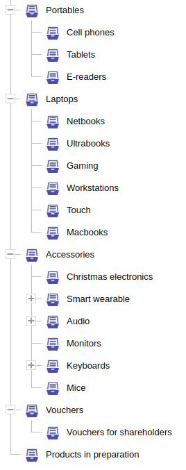
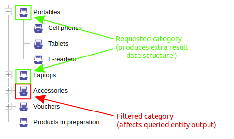
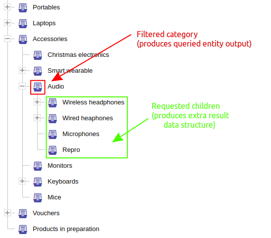
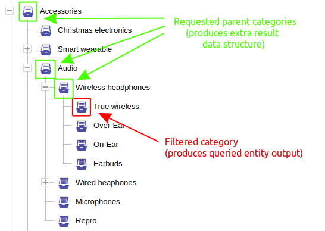
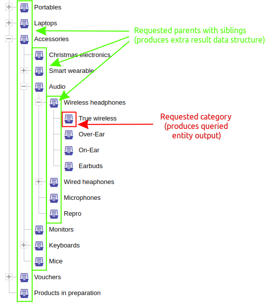
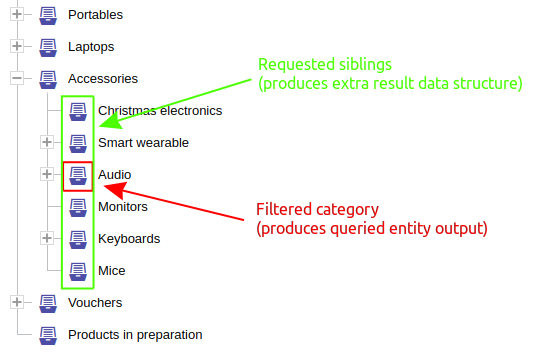
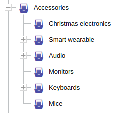

Na e-commerce stránkách lze najít mnoho typů menu. Počínaje různými typy mega menu...


... přes menu s přímými podkategoriemi...


... až po vysoce dynamické menu, které lze rozbalovat postupně pomocí plus/mínus symbolů, aniž by to ovlivnilo skutečný seznam položek vpravo na obrazovce (ten se aktualizuje podle zvolené kategorie)...


... až po hybridní menu, které se částečně otevírá do aktuálně vybrané kategorie a zobrazuje pouze přímé sourozenecké kategorie na rodičovské ose:


Existuje obrovské množství možných variant a je obtížné podpořit všechny jedním omezením.
Proto existuje rozšiřitelný mechanismus, pomocí kterého můžete požádat o výpočet více různých částí stromu hierarchie, přesně podle toho, jak je potřebujete pro konkrétní uživatelské rozhraní.

<LS to="e,j,c,r">

Existují dva typy požadavků na vrchní úroveň hierarchie:

<LS to="e,j,c,r">
<dl>
    <dt>[`hierarchyOfSelf`](#hierarchie-sebe-sama)</dt>
    <dd>
        realizováno pomocí <LS to="e,j,r"><SourceClass>evita_query/src/main/java/io/evitadb/api/query/require/HierarchyOfSelf.java</SourceClass></LS><LS to="c"><SourceClass>EvitaDB.Client/Queries/Requires/HierarchyOfSelf.cs</SourceClass></LS>
        a používá se pro výpočet datových struktur z dat přímo dotazované hierarchické entity
    </dd>
    <dt>[`hierarchyOfReference`](#hierarchie-reference)</dt>
    <dd>
        realizováno pomocí <LS to="e,j,r"><SourceClass>evita_query/src/main/java/io/evitadb/api/query/require/HierarchyOfReference.java</SourceClass></LS><LS to="c"><SourceClass>EvitaDB.Client/Queries/Requires/HierarchyOfReference.cs</SourceClass></LS>
        a používá se pro výpočet datových struktur z dat entit odkazujících na hierarchickou entitu
    </dd>
</dl>
</LS>

Tyto požadavky na vrchní úroveň hierarchie musí obsahovat alespoň jedno z následujících podomezení hierarchie:
</LS>
<LS to="g">

Datové struktury hierarchie lze vyžádat specifikováním pole `hierarchy` v extra výsledcích dotazu.
Konkrétní datové struktury lze vyžádat buď z dat přímo dotazované hierarchické entity, nebo
z dat entit odkazujících na hierarchickou entitu.
V obou případech pak můžete požadovat jednu nebo více z následujících datových struktur hierarchie:

</LS>

- [`fromRoot`](#from-root)
- [`fromNode`](#from-node)
- [`siblings`](#siblings)
- [`children`](#children)
- [`parents`](#parents)

#### Asociace omezení a výsledku

<LS to="e,j,r,c">

Může existovat více podomezení a každé omezení může být duplikováno (obvykle s různým nastavením).
Každé podomezení hierarchie definuje argument <LS to="e,j,r">[String](https://docs.oracle.com/en/java/javase/17/docs/api/java.base/java/lang/String.html)</LS><LS to="c">[string](https://learn.microsoft.com/en-us/dotnet/api/system.string)</LS>
s pojmenovanou hodnotou, která umožňuje přiřadit požadavek k vypočtené datové struktuře výsledku
v <LS to="e,j,r"><SourceClass>evita_api/src/main/java/io/evitadb/api/requestResponse/extraResult/Hierarchy.java</SourceClass></LS><LS to="c"><SourceClass>EvitaDB.Client/Models/ExtraResults/Hierarchy.cs</SourceClass></LS>
extra výsledku.
</LS>
<LS to="g">
Lze požadovat více datových struktur a každá datová struktura může být duplikována (obvykle s různým nastavením), ale v takovém případě musí být každá datová struktura označena unikátním názvem (viz příklady níže). Každá taková datová struktura pak vrací seznam uzlů stromu hierarchie.

<Note type="warning">

V GraphQL je vracení stromových datových struktur neznámé hloubky problematické a nelze jej řešit vývojářsky přívětivým způsobem.
Proto jsme zvolili řešení, kdy je strom vrácen jako plochý seznam uzlů. Každý uzel obsahuje informaci
o své úrovni v původním stromu, takže strom lze na straně klienta rekonstruovat.

Všimněte si, že seznam uzlů je seřazen v [depth-first](https://en.wikipedia.org/wiki/Depth-first_search) pořadí, což
lze využít ke zjednodušení rekonstrukce stromu na straně klienta.

</Note>
</LS>

<Note type="info">

<NoteTitle toggles="true">

##### Příklad asociace požadavku a odpovědi
</NoteTitle>

Následující ukázka obsahuje dotaz, který vypíše všechny (tranzitivní) kategorie v kategorii *Audio* a zároveň
vrací položky menu, které obsahují přímé potomky kategorie *Audio* a její přímou rodičovskou kategorii (kterou je
*Accessories*):

<SourceCodeTabs requires="evita_test/evita_functional_tests/src/test/resources/META-INF/documentation/evitaql-init.java" langSpecificTabOnly>

[Asociace požadavku na hierarchii s výsledkem](/documentation/user/en/query/requirements/examples/hierarchy/hierarchy-data-structure-association.java)
</SourceCodeTabs>

<LS to="e,j,r,c">

Obě komponenty menu jsou uloženy v datové struktuře <LS to="e,j,r"><SourceClass>evita_api/src/main/java/io/evitadb/api/requestResponse/extraResult/Hierarchy.java</SourceClass></LS><LS to="c"><SourceClass>EvitaDB.Client/Models/ExtraResults/Hierarchy.cs</SourceClass></LS>
extra výsledku a jsou dostupné pod štítky odpovídajícími těm, které byly použity v požadavcích.
</LS>
<LS to="g">
Pomocí vlastních aliasů pro hierarchie můžete snadno vytvářet vlastní datové struktury menu.
</LS>

<LS to="e,j,c">

<MDInclude sourceVariable="extraResults.Hierarchy.selfHierarchy">[Výstup s více částmi menu](/documentation/user/en/query/requirements/examples/hierarchy/hierarchy-data-structure-association.evitaql.json.md)</MDInclude>

</LS>

<LS to="g">

<MDInclude sourceVariable="data.queryCategory.extraResults.hierarchy.self">[Výstup s více částmi menu](/documentation/user/en/query/requirements/examples/hierarchy/hierarchy-data-structure-association.graphql.json.md)</MDInclude>

</LS>

<LS to="r">

<MDInclude sourceVariable="extraResults.hierarchy.self">[Výstup s více částmi menu](/documentation/user/en/query/requirements/examples/hierarchy/hierarchy-data-structure-association.rest.json.md)</MDInclude>

</LS>

</Note>

## Hierarchie sebe sama

<LS to="e,j,c,r">

```evitaql-syntax
hierarchyOfSelf(
    orderConstraint:any,
    requireConstraint:(fromRoot|fromNode|siblings|children|parents)+
)
```

<dl>
    <dt>orderConstraint:any</dt>
    <dd>
        volitelné omezení řazení, které umožňuje určit pořadí
        <LS to="e,j,r,g"><SourceClass>evita_api/src/main/java/io/evitadb/api/requestResponse/extraResult/Hierarchy.java</SourceClass></LS>
        <LS to="c"><SourceClass>EvitaDB.Client/Models/ExtraResults/Hierarchy.cs</SourceClass></LS>
        prvků `LevelInfo` ve výsledné datové struktuře hierarchie
    </dd>
    <dt>requireConstraint:(fromRoot|fromNode|siblings|children|parents)+</dt>
    <dd>
        povinné jedno nebo více omezení, která umožňují instruovat evitaDB k výpočtu komponent menu;
        může být přítomno jedno nebo všechna omezení:
        <ul>
            <li>[fromRoot](#from-root)</li>
            <li>[fromNode](#from-node)</li>
            <li>[siblings](#siblings)</li>
            <li>[children](#children)</li>
            <li>[parents](#parents)</li>
        </ul>
    </dd>
</dl>

Požadavek spouští výpočet datové struktury
<LS to="e,j,r,g"><SourceClass>evita_api/src/main/java/io/evitadb/api/requestResponse/extraResult/Hierarchy.java</SourceClass></LS>
<LS to="c"><SourceClass>EvitaDB.Client/Models/ExtraResults/Hierarchy.cs</SourceClass></LS> pro hierarchii, jejíž je součástí.

Hierarchie sebe sama může být stále kombinována s [`hierarchyOfReference`](#hierarchie-reference), pokud je dotazovaná entita
hierarchickou entitou, která je zároveň propojena s jinou hierarchickou entitou. Takové situace jsou však v praxi spíše výjimečné.

</LS>
<LS to="g">

Datové struktury "self" hierarchie lze vyžádat v rámci `extraResult` → `hierarchy` pomocí rezervovaného pole `self`, podobně jako
[u odkazovaných hierarchií](#hierarchie-reference).
To spouští výpočet datových struktur pro hierarchii přímo dotazované hierarchické entity.

Rezervované pole `self` v `extraResult` → `hierarchy` má vnitřní strukturu specifickou pro přímo dotazovanou hierarchickou entitu.
To znamená, že pokud požadujete entity pro uzly hierarchie, můžete použít stejná [pole pro načítání](fetching.md) jako
byste použili pro hlavní dotaz.

### Datové struktury

V rámci pole `self` pak můžete požadovat jednu nebo více z následujících datových struktur hierarchie:

- [`fromRoot`](#from-root)
- [`fromNode`](#from-node)
- [`siblings`](#siblings)
- [`children`](#children)
- [`parents`](#parents)

### Řazení

Na poli `self` můžete zadat volitelné omezení řazení jako argument, který umožňuje určit pořadí vrácených
uzlů ve výsledné datové struktuře hierarchie.

</LS>

## Hierarchie reference

<LS to="e,j,c,r">

```evitaql-syntax
hierarchyOfReference(
    argument:string+,
    argument:enum(LEAVE_EMPTY|REMOVE_EMPTY),
    orderConstraint:any,
    requireConstraint:(fromRoot|fromNode|siblings|children|parents)+
)
```

<dl>
    <dt>argument:string+</dt>
    <dd>
        specifikace jednoho nebo více [názvů referencí](../../use/schema.md#reference), které identifikují referenci
        na cílovou hierarchickou entitu, pro kterou má být výpočet menu proveden;
        obvykle má smysl pouze jeden název reference, ale aby bylo omezení přizpůsobeno chování jiných podobných
        omezení, evitaQL přijímá více názvů referencí pro případ, že stejný požadavek platí pro různé
        reference dotazované entity.
    </dd>
    <dt>argument:enum(LEAVE_EMPTY|REMOVE_EMPTY)</dt>
    <dd>
        volitelný argument typu <LS to="e,j,r,g"><SourceClass>evita_query/src/main/java/io/evitadb/api/query/require/EmptyHierarchicalEntityBehaviour.java</SourceClass></LS><LS to="c"><SourceClass>EvitaDB.Client/Queries/Requires/EmptyHierarchicalEntityBehaviour.cs</SourceClass></LS>
        enum umožňující určit, zda vracet prázdné hierarchické entity (např. ty, které nemají
        žádné dotazované entity, které by splňovaly aktuální filtr dotazu - přímo nebo
        tranzitivně):

        - **LEAVE_EMPTY**: prázdné hierarchické uzly zůstanou ve vypočtených datových strukturách
        - **REMOVE_EMPTY**: prázdné hierarchické uzly jsou z vypočtených datových struktur vynechány (výchozí chování)
    </dd>
    <dt>orderConstraint:any</dt>
    <dd>
        volitelné omezení řazení, které umožňuje určit pořadí
                <LS to="e,j,r,g"><SourceClass>evita_api/src/main/java/io/evitadb/api/requestResponse/extraResult/Hierarchy.java</SourceClass></LS>
                <LS to="c"><SourceClass>EvitaDB.Client/Models/ExtraResults/Hierarchy.cs</SourceClass></LS>
                prvků `LevelInfo` ve výsledné datové struktuře hierarchie

    </dd>
    <dt>requireConstraint:(fromRoot|fromNode|siblings|children|parents)+</dt>
    <dd>
        povinné jedno nebo více omezení, která umožňují instruovat evitaDB k výpočtu komponent menu;
        může být přítomno jedno nebo všechna omezení:
        <ul>
            <li>[fromRoot](#from-root)</li>
            <li>[fromNode](#from-node)</li>
            <li>[siblings](#siblings)</li>
            <li>[children](#children)</li>
            <li>[parents](#parents)</li>
        </ul>
    </dd>
</dl>

Požadavek spouští výpočet datové struktury
<LS to="e,j,r,g"><SourceClass>evita_api/src/main/java/io/evitadb/api/requestResponse/extraResult/Hierarchy.java</SourceClass></LS>
<LS to="c"><SourceClass>EvitaDB.Client/Models/ExtraResults/Hierarchy.cs</SourceClass></LS>
pro hierarchie [referencovaného typu entity](../../use/schema.md#reference).

Hierarchie reference může být stále kombinována s [`hierarchyOfSelf`](#hierarchie-sebe-sama), pokud je dotazovaná entita
hierarchickou entitou, která je zároveň propojena s jinou hierarchickou entitou. Takové situace jsou však v praxi spíše výjimečné.

`hierarchyOfReference` lze v jednom dotazu použít vícekrát, pokud potřebujete různá nastavení výpočtu
pro různé typy referencí.

</LS>
<LS to="g">

Datové struktury hierarchie pro [referencované hierarchické entity](../../use/schema.md#reference) lze vyžádat
uvnitř polí `extraResult` → `hierarchy` → `{reference name}`.
To spouští výpočet datových struktur pro hierarchii entit odkazujících na hierarchickou entitu.

Pro každou takovou hierarchickou referenci existuje samostatné pole v `extraResult` → `hierarchy` a každé takové pole
má vnitřní strukturu specifickou pro data referencované entity.
To znamená, že pokud požadujete entity pro uzly hierarchie, můžete použít stejná [pole pro načítání](fetching.md) jako
byste použili pro hlavní dotaz pro danou referencovanou entitu.

### Datové struktury

V rámci pole `{reference name}` pak můžete požadovat jednu nebo více z následujících datových struktur hierarchie:

- [`fromRoot`](#from-root)
- [`fromNode`](#from-node)
- [`siblings`](#siblings)
- [`children`](#children)
- [`parents`](#parents)

### Řazení

Na poli `{reference name}` můžete zadat volitelné omezení řazení jako argument, který umožňuje určit
pořadí vrácených uzlů ve výsledné datové struktuře hierarchie.

### Chování prázdných hierarchických entit

Volitelný argument pole `{reference name}` umožňuje určit, zda vracet prázdné hierarchické entity
(např. ty, které nemají žádné dotazované entity, které by splňovaly aktuální filtr dotazu - přímo nebo tranzitivně):

- **LEAVE_EMPTY**: prázdné hierarchické uzly zůstanou ve vypočtených datových strukturách
- **REMOVE_EMPTY**: prázdné hierarchické uzly jsou z vypočtených datových struktur vynechány (výchozí chování)

</LS>

## From root

<LS to="e,j,c,r">

```evitaql-syntax
fromRoot(
    argument:string!,
    requireConstraint:(entityFetch|stopAt|statistics)*
)
```

<dl>
    <dt>argument:string!</dt>
    <dd>
        povinný argument <LS to="e,j,r,g">[String](https://docs.oracle.com/en/java/javase/17/docs/api/java.base/java/lang/String.html)</LS>
        <LS to="c">[string](https://learn.microsoft.com/en-us/dotnet/api/system.string)</LS>
        určující název výstupu pro vypočtenou datovou strukturu
        (viz [asociace omezení a výsledku](#asociace-omezení-a-výsledku))
    </dd>
    <dt>requireConstraint:(entityFetch|stopAt|statistics)*</dt>
    <dd>
        volitelné jedno nebo více omezení, která umožňují definovat úplnost hierarchických entit, rozsah
        procházeného stromu hierarchie a statistiky vypočtené během procesu;
        může být přítomno jedno nebo všechna omezení:
        <ul>
            <li>[entityFetch](fetching.md#načtení-entity)</li>
            <li>[stopAt](#stop-at)</li>
            <li>[statistics](#statistics)</li>
        </ul>
    </dd>
</dl>

</LS>

Omezení `fromRoot` <LS to="e,j,r,c">požadavek</LS><LS to="g">datová struktura</LS>
vypočítá strom hierarchie od "virtuálního" neviditelného vrcholu hierarchie,
bez ohledu na případné použití omezení `hierarchyWithin` ve filtrační části dotazu. Rozsah
vypočtených informací lze řídit pomocí omezení [`stopAt`](#stop-at) <LS to="e,j,r,c">omezení</LS><LS to="g">argument</LS>.
Ve výchozím nastavení probíhá procházení
až na dno stromu hierarchie, pokud neurčíte, kde má skončit. Pokud potřebujete přistupovat ke statistickým údajům,
použijte <LS to="e,j,r,c">omezení [`statistics`](#statistics)</LS><LS to="g">pole [`childrenCount` a `queriedEntityCount`](#statistics) na objektu uzlu</LS>.
Vypočtená data nejsou ovlivněna filtrem `hierarchyWithin` -
dotaz může filtrovat entity pomocí `hierarchyWithin` z kategorie *Accessories*, přičemž stále umožňuje správně
vypočítat menu na úrovni kořene.

Mějte na paměti, že úplný výpočet statistik může být v případě požadavku `fromRoot` obzvláště náročný - obvykle vyžaduje agregaci nad celou dotazovanou množinou dat
(viz [více informací o výpočtu](#výpočetní-náročnost-výpočtu-statistických-dat)).

<Note type="info">

<NoteTitle toggles="true">

##### Jak vypadá výsledek při použití `hierarchyWithin` a `fromRoot` v jednom dotazu?
</NoteTitle>

Následující dotaz vypíše produkty v kategorii *Audio* a jejích podkategoriích. Spolu s vrácenými produkty také
vyžaduje vypočtenou datovou strukturu *megaMenu*, která uvádí horní 2 úrovně stromu hierarchie *Category* s
vypočteným počtem podkategorií pro každou položku menu a agregovaným počtem všech filtrovaných produktů, které by
spadaly do dané kategorie.

<SourceCodeTabs  requires="evita_test/evita_functional_tests/src/test/resources/META-INF/documentation/evitaql-init.java" langSpecificTabOnly>

[Příklad použití `hierarchyWithin` a `fromRoot` v jednom dotazu](/documentation/user/en/query/requirements/examples/hierarchy/hierarchy-from-root.java)
</SourceCodeTabs>

Vypočtený výsledek *megaMenu* vypadá takto:



... a zde je výstup datové struktury ve formátu JSON:

<LS to="e,j,c">

<MDInclude sourceVariable="extraResults.Hierarchy.referenceHierarchies.categories.megaMenu">[Příklad použití `hierarchyWithin` a `fromRoot` v jednom dotazu](/documentation/user/en/query/requirements/examples/hierarchy/hierarchy-from-root.evitaql.json.md)</MDInclude>

</LS>

<LS to="g">

<MDInclude sourceVariable="data.queryProduct.extraResults.hierarchy.categories.megaMenu">[Příklad použití `hierarchyWithin` a `fromRoot` v jednom dotazu](/documentation/user/en/query/requirements/examples/hierarchy/hierarchy-from-root.graphql.json.md)</MDInclude>

</LS>

<LS to="r">

<MDInclude sourceVariable="extraResults.hierarchy.categories.megaMenu">[Příklad použití `hierarchyWithin` a `fromRoot` v jednom dotazu](/documentation/user/en/query/requirements/examples/hierarchy/hierarchy-from-root.rest.json.md)</MDInclude>

</LS>

</Note>

Vypočtený výsledek pro `fromRoot` není ovlivněn [`hierarchyWithin`](../filtering/hierarchy.md#hierarchy-within)
pivotním uzlem hierarchie. Pokud [`hierarchyWithin`](../filtering/hierarchy.md#hierarchy-within) obsahuje vnitřní omezení
[`having`](../filtering/hierarchy.md#having) nebo [`excluding`](../filtering/hierarchy.md#excluding), `fromRoot` je respektuje.
Důvod je jednoduchý: když vykreslujete menu pro výsledek dotazu, chcete, aby vypočtené [statistiky](#statistics)
respektovaly pravidla platná pro [`hierarchyWithin`](../filtering/hierarchy.md#hierarchy-within), aby
vypočtené číslo zůstalo pro koncového uživatele konzistentní.

## From node

<LS to="e,j,c,r">

```evitaql-syntax
fromNode(
    argument:string!,
    requireConstraint:node!,
    requireConstraint:(entityFetch|stopAt|statistics)*
)
```

<dl>
    <dt>argument:string!</dt>
    <dd>
        povinný argument <LS to="e,j,r,g">[String](https://docs.oracle.com/en/java/javase/17/docs/api/java.base/java/lang/String.html)</LS>
        <LS to="c">[string](https://learn.microsoft.com/en-us/dotnet/api/system.string)</LS>
        určující název výstupu pro vypočtenou datovou strukturu
        (viz [asociace omezení a výsledku](#asociace-omezení-a-výsledku))
    </dd>
    <dt>requireConstraint:node!</dt>
    <dd>
        povinné omezení [`node`](#node), které musí odpovídat přesně jedné pivotní hierarchické entitě, která
        představuje kořenový uzel procházeného podstromu hierarchie.
    </dd>
    <dt>requireConstraint:(entityFetch|stopAt|statistics)*</dt>
    <dd>
        volitelné jedno nebo více omezení, která umožňují definovat úplnost hierarchických entit, rozsah
        procházeného stromu hierarchie a statistiky vypočtené během procesu;
        může být přítomno jedno nebo všechna omezení:
        <ul>
            <li>[entityFetch](fetching.md#načtení-entity)</li>
            <li>[stopAt](#stop-at)</li>
            <li>[statistics](#statistics)</li>
        </ul>
    </dd>
</dl>

</LS>

Omezení `fromNode` <LS to="e,j,r,c">požadavek</LS><LS to="g">datová struktura</LS>
vypočítá strom hierarchie od pivotního uzlu hierarchie, který je identifikován
pomocí vnitřního omezení [`node`](#node) <LS to="e,j,c,r">omezení</LS><LS to="g">argument</LS>.
`fromNode` vypočítá výsledek bez ohledu na případné použití
omezení `hierarchyWithin` ve filtrační části dotazu. Rozsah vypočtených
informací lze řídit pomocí omezení [`stopAt`](#stop-at) <LS to="e,j,c,r">omezení</LS><LS to="g">argument</LS>.
Ve výchozím nastavení probíhá procházení až na dno stromu hierarchie, pokud neurčíte, kde má skončit. Vypočtená data nejsou ovlivněna
filtrem `hierarchyWithin` - dotaz může filtrovat entity pomocí `hierarchyWithin` z kategorie
*Accessories*, přičemž stále umožňuje správně vypočítat menu na jiném uzlu definovaném v požadavku `fromNode`.
Pokud potřebujete přistupovat ke statistickým údajům, použijte <LS to="e,j,r,c">omezení [`statistics`](#statistics)</LS><LS to="g">pole [`childrenCount` a `queriedEntityCount`](#statistics) na objektu uzlu</LS>.

<Note type="info">

<NoteTitle toggles="true">

##### Jak vypočítat různé podmenu pomocí `hierarchyWithin` a `fromNode` v jednom dotazu?
</NoteTitle>

Následující dotaz vypíše produkty v kategorii *Audio* a jejích podkategoriích. Spolu s vrácenými produkty také
vrací vypočtené datové struktury *sideMenu1* a *sideMenu2*, které uvádějí plochý seznam kategorií pro kategorie
*Portables* a *Laptops* s vypočteným počtem podkategorií pro každou položku menu a agregovaným počtem všech
produktů, které by spadaly do dané kategorie.

<SourceCodeTabs  requires="evita_test/evita_functional_tests/src/test/resources/META-INF/documentation/evitaql-init.java" langSpecificTabOnly>

[Příklad použití `hierarchyWithin` a `fromNode` v jednom dotazu](/documentation/user/en/query/requirements/examples/hierarchy/hierarchy-from-node.java)
</SourceCodeTabs>

Vypočtený výsledek *sideMenu1* i *sideMenu2* vypadá takto:



... a zde je výstup datové struktury ve formátu JSON:

<LS to="e,j,c">

<MDInclude sourceVariable="extraResults.Hierarchy.referenceHierarchies.categories">[Příklad použití `hierarchyWithin` a `fromNode` v jednom dotazu](/documentation/user/en/query/requirements/examples/hierarchy/hierarchy-from-node.evitaql.json.md)</MDInclude>

</LS>

<LS to="g">

<MDInclude sourceVariable="data.queryProduct.extraResults.hierarchy.categories">[Příklad použití `hierarchyWithin` a `fromNode` v jednom dotazu](/documentation/user/en/query/requirements/examples/hierarchy/hierarchy-from-node.graphql.json.md)</MDInclude>

</LS>

<LS to="r">

<MDInclude sourceVariable="extraResults.hierarchy.categories">[Příklad použití `hierarchyWithin` a `fromNode` v jednom dotazu](/documentation/user/en/query/requirements/examples/hierarchy/hierarchy-from-node.rest.json.md)</MDInclude>

</LS>

</Note>

Vypočtený výsledek pro `fromNode` není ovlivněn [`hierarchyWithin`](../filtering/hierarchy.md#hierarchy-within)
pivotním uzlem hierarchie. Pokud [`hierarchyWithin`](../filtering/hierarchy.md#hierarchy-within) obsahuje vnitřní omezení
[`having`](../filtering/hierarchy.md#having) nebo [`excluding`](../filtering/hierarchy.md#excluding), `fromNode` je respektuje.
Důvod je jednoduchý: když vykreslujete menu pro výsledek dotazu, chcete, aby vypočtené [statistiky](#statistics)
respektovaly pravidla platná pro [`hierarchyWithin`](../filtering/hierarchy.md#hierarchy-within), aby
vypočtené číslo zůstalo pro koncového uživatele konzistentní.

## Children

<LS to="e,j,c,r">

```evitaql-syntax
children
    argument:string!,
    requireConstraint:(entityFetch|stopAt|statistics)*
)
```

<dl>
    <dt>argument:string!</dt>
    <dd>
        povinný argument <LS to="e,j,r,g">[String](https://docs.oracle.com/en/java/javase/17/docs/api/java.base/java/lang/String.html)</LS>
        <LS to="c">[string](https://learn.microsoft.com/en-us/dotnet/api/system.string)</LS>
        určující název výstupu pro vypočtenou datovou strukturu
        (viz [asociace omezení a výsledku](#asociace-omezení-a-výsledku))
    </dd>
    <dt>requireConstraint:(entityFetch|stopAt|statistics)*</dt>
    <dd>
        volitelné jedno nebo více omezení, která umožňují definovat úplnost hierarchických entit, rozsah
        procházeného stromu hierarchie a statistiky vypočtené během procesu;
        může být přítomno jedno nebo všechna omezení:
        <ul>
            <li>[entityFetch](fetching.md#načtení-entity)</li>
            <li>[stopAt](#stop-at)</li>
            <li>[statistics](#statistics)</li>
        </ul>
    </dd>
</dl>

</LS>

Omezení `children` <LS to="e,j,r,c">požadavek</LS><LS to="g">datová struktura</LS>
vypočítá strom hierarchie od stejného uzlu hierarchie, na který cílí
filtrační část stejného dotazu pomocí omezení [`hierarchyWithin`](../filtering/hierarchy.md#hierarchy-within) nebo
[`hierarchyWithinRoot`](../filtering/hierarchy.md#hierarchy-within-root). Rozsah vypočtených
informací lze řídit pomocí omezení [`stopAt`](#stop-at) <LS to="e,j,c,r">omezení</LS><LS to="g">argument</LS>.
Ve výchozím nastavení probíhá procházení až na dno stromu hierarchie, pokud neurčíte, kde má skončit. Pokud potřebujete přistupovat ke statistickým údajům, použijte
<LS to="e,j,r,c">omezení [`statistics`](#statistics)</LS><LS to="g">pole [`childrenCount` a `queriedEntityCount`](#statistics) na objektu uzlu</LS>.

<Note type="info">

<NoteTitle toggles="true">

##### Jak získat přímé podkategorie aktuální kategorie pomocí požadavku `children`?
</NoteTitle>

Následující dotaz vypíše produkty v kategorii *Audio* a jejích podkategoriích. Spolu s vrácenými produkty také
vrací vypočtenou datovou strukturu *subcategories*, která uvádí plochý seznam kategorií aktuálně zaměřené kategorie
*Audio* s vypočteným počtem podkategorií pro každou položku menu a agregovaným počtem všech produktů, které
by spadaly do dané kategorie.

<SourceCodeTabs  requires="evita_test/evita_functional_tests/src/test/resources/META-INF/documentation/evitaql-init.java" langSpecificTabOnly>

[Příklad použití požadavku `children`](/documentation/user/en/query/requirements/examples/hierarchy/hierarchy-children.java)
</SourceCodeTabs>

Vypočtený výsledek *subcategories* vypadá takto:



... a zde je výstup datové struktury ve formátu JSON:

<LS to="e,j,c">

<MDInclude sourceVariable="extraResults.Hierarchy.referenceHierarchies.categories.subcategories">[Příklad použití požadavku `children`](/documentation/user/en/query/requirements/examples/hierarchy/hierarchy-children.evitaql.json.md)</MDInclude>

</LS>

<LS to="g">

<MDInclude sourceVariable="data.queryProduct.extraResults.hierarchy.categories.subcategories">[Příklad použití požadavku `children`](/documentation/user/en/query/requirements/examples/hierarchy/hierarchy-children.graphql.json.md)</MDInclude>

</LS>

<LS to="r">

<MDInclude sourceVariable="extraResults.hierarchy.categories.subcategories">[Příklad použití požadavku `children`](/documentation/user/en/query/requirements/examples/hierarchy/hierarchy-children.rest.json.md)</MDInclude>

</LS>

</Note>

Vypočtený výsledek pro `children` je spojen s [`hierarchyWithin`](../filtering/hierarchy.md#hierarchy-within)
pivotním uzlem hierarchie (nebo "virtuálním" neviditelným vrcholem, na který odkazuje
omezení [`hierarchyWithinRoot`](../filtering/hierarchy.md#hierarchy-within-root)).
Pokud [`hierarchyWithin`](../filtering/hierarchy.md#hierarchy-within) obsahuje vnitřní omezení
[`having`](../filtering/hierarchy.md#having) nebo [`excluding`](../filtering/hierarchy.md#excluding), `children`
je také respektuje. Důvod je jednoduchý: když vykreslujete menu pro výsledek dotazu, chcete, aby vypočtené
[statistiky](#statistics) respektovaly pravidla platná pro [`hierarchyWithin`](../filtering/hierarchy.md#hierarchy-within),
aby vypočtené číslo zůstalo pro koncového uživatele konzistentní.

## Parents

<LS to="e,j,c,r">

```evitaql-syntax
parents
    argument:string!,
    requireConstraint:(siblings|entityFetch|stopAt|statistics)*
)
```

<dl>
    <dt>argument:string!</dt>
    <dd>
        povinný argument <LS to="e,j,r,g">[String](https://docs.oracle.com/en/java/javase/17/docs/api/java.base/java/lang/String.html)</LS>
        <LS to="c">[string](https://learn.microsoft.com/en-us/dotnet/api/system.string)</LS>
        určující název výstupu pro vypočtenou datovou strukturu
        (viz [asociace omezení a výsledku](#asociace-omezení-a-výsledku))
    </dd>
    <dt>requireConstraint:(siblings|entityFetch|stopAt|statistics)*</dt>
    <dd>
        volitelné jedno nebo více omezení, která umožňují definovat úplnost hierarchických entit, rozsah
        procházeného stromu hierarchie a statistiky vypočtené během procesu;
        může být přítomno jedno nebo všechna omezení:
        <ul>
            <li>[siblings](#siblings)</li>
            <li>[entityFetch](fetching.md#načtení-entity)</li>
            <li>[stopAt](#stop-at)</li>
            <li>[statistics](#statistics)</li>
        </ul>
    </dd>
</dl>

</LS>

Omezení `parents` <LS to="e,j,r,c">požadavek</LS><LS to="g">datová struktura</LS>
vypočítá strom hierarchie od stejného uzlu hierarchie, na který cílí
filtrační část stejného dotazu pomocí omezení [`hierarchyWithin`](../filtering/hierarchy.md#hierarchy-within)
směrem ke kořeni hierarchie. Rozsah vypočtených informací lze řídit pomocí omezení [`stopAt`](#stop-at)
<LS to="e,j,c,r">omezení</LS><LS to="g">argument</LS>.
Ve výchozím nastavení probíhá procházení až na vrchol stromu hierarchie, pokud neurčíte, kde má skončit.
Pokud potřebujete přistupovat ke statistickým údajům, použijte
<LS to="e,j,r,c">omezení [`statistics`](#statistics)</LS><LS to="g">pole [`childrenCount` a `queriedEntityCount`](#statistics) na objektu uzlu</LS>.

<Note type="info">

<NoteTitle toggles="true">

##### Jak získat přímé rodiče aktuální kategorie pomocí požadavku `parents`?
</NoteTitle>

Následující dotaz vypíše produkty v kategorii *Audio* a jejích podkategoriích. Spolu s vrácenými produkty také
vrací vypočtenou datovou strukturu *parentAxis*, která uvádí všechny rodičovské uzly aktuálně zaměřené kategorie
*True wireless* s vypočteným počtem podkategorií pro každou položku menu a agregovaným počtem všech produktů, které
by spadaly do dané kategorie.

<SourceCodeTabs  requires="evita_test/evita_functional_tests/src/test/resources/META-INF/documentation/evitaql-init.java" langSpecificTabOnly>

[Příklad použití požadavku `children`](/documentation/user/en/query/requirements/examples/hierarchy/hierarchy-parents.java)
</SourceCodeTabs>

Vypočtený výsledek *parentAxis* vypadá takto:



... a zde je výstup datové struktury ve formátu JSON:

<LS to="e,j,c">

<MDInclude sourceVariable="extraResults.Hierarchy.referenceHierarchies.categories.parentAxis">[Příklad použití požadavku `parents`](/documentation/user/en/query/requirements/examples/hierarchy/hierarchy-parents.evitaql.json.md)</MDInclude>

</LS>

<LS to="g">

<MDInclude sourceVariable="data.queryProduct.extraResults.hierarchy.categories.parentAxis">[Příklad použití požadavku `parents`](/documentation/user/en/query/requirements/examples/hierarchy/hierarchy-parents.graphql.json.md)</MDInclude>

</LS>

<LS to="r">

<MDInclude sourceVariable="extraResults.hierarchy.categories.parentAxis">[Příklad použití požadavku `parents`](/documentation/user/en/query/requirements/examples/hierarchy/hierarchy-parents.rest.json.md)</MDInclude>

</LS>

Můžete také vypsat všechny sourozence rodičovského uzlu při pohybu vzhůru stromem:

<SourceCodeTabs requires="evita_test/evita_functional_tests/src/test/resources/META-INF/documentation/evitaql-init.java" langSpecificTabOnly>

[Příklad použití požadavku `children`](/documentation/user/en/query/requirements/examples/hierarchy/hierarchy-parents-siblings.java)
</SourceCodeTabs>

Vypočtený výsledek *parentAxis* se sourozenci nyní vypadá takto:



... a zde je výstup datové struktury ve formátu JSON:

<LS to="e,j,c">

<MDInclude sourceVariable="extraResults.Hierarchy.referenceHierarchies.categories.parentAxis">[Příklad použití požadavku `parents`](/documentation/user/en/query/requirements/examples/hierarchy/hierarchy-parents-siblings.evitaql.json.md)</MDInclude>

</LS>

<LS to="g">

<MDInclude sourceVariable="data.queryProduct.extraResults.hierarchy.categories.parentAxis">[Příklad použití požadavku `parents`](/documentation/user/en/query/requirements/examples/hierarchy/hierarchy-parents-siblings.graphql.json.md)</MDInclude>

</LS>

<LS to="r">

<MDInclude sourceVariable="extraResults.hierarchy.categories.parentAxis">[Příklad použití požadavku `parents`](/documentation/user/en/query/requirements/examples/hierarchy/hierarchy-parents-siblings.rest.json.md)</MDInclude>

</LS>

Pokud potřebujete, aby každý z těchto sourozenců načítal také své poduzly (bez ohledu na to, zda jsou pouze o jednu úroveň níže nebo více), můžete to provést přidáním omezení `stopAt` <LS to="e,j,c,r">omezení</LS>
<LS to="g">argument</LS> do kontejneru `siblings` <LS to="e,j,c,r">omezení</LS><LS to="g">datové struktury</LS>.
Tento scénář je však příliš složitý na to, aby byl pokryt v této dokumentaci.

</Note>

Vypočtený výsledek pro `parents` je spojen s [`hierarchyWithin`](../filtering/hierarchy.md#hierarchy-within)
pivotním uzlem hierarchie. Pokud [`hierarchyWithin`](../filtering/hierarchy.md#hierarchy-within) obsahuje vnitřní omezení
[`having`](../filtering/hierarchy.md#having) nebo [`excluding`](../filtering/hierarchy.md#excluding), `parents`
je také respektuje při výpočtu statistik poduzlů / dotazovaných entit. Důvod je jednoduchý: když
vykreslujete menu pro výsledek dotazu, chcete, aby vypočtené [statistiky](#statistics) respektovaly pravidla platná
pro [`hierarchyWithin`](../filtering/hierarchy.md#hierarchy-within), aby vypočtené číslo zůstalo pro koncového uživatele konzistentní.

## Siblings

<LS to="e,j,c,r">

```evitaql-syntax
siblings(
    argument:string!,
    requireConstraint:(entityFetch|stopAt|statistics)*
)
```

</LS>

<Note type="warning">

<NoteTitle toggles="false">

##### Odlišná syntaxe `siblings` při použití v rámci rodičovského omezení `parents`
</NoteTitle>

<LS to="e,j,c,r">

```evitaql-syntax
siblings(
    requireConstraint:(entityFetch|stopAt|statistics)*
)
```

</LS>

Omezení `siblings` <LS to="e,j,c,r">omezení</LS><LS to="g">datová struktura</LS>
lze použít samostatně <LS to="e,j,c,r">jako potomek `hierarchyOfSelf` nebo `hierarchyOfReference`</LS><LS to="g">pole `hierarchy`</LS>, nebo jej lze
použít jako <LS to="e,j,c,r">potomek omezení</LS><LS to="g">argument</LS>
omezení [`parents`](#parents) <LS to="e,j,c,r">omezení</LS><LS to="g">datové struktury</LS>.
<LS to="e,j,c,r">
V takovém případě omezení `siblings` postrádá první řetězcový
argument, který definuje název pro výstupní datovou strukturu. Důvodem je, že tento název je již definován na
obalujícím omezení `parents` a omezení `siblings` pouze rozšiřuje dostupná data v jeho datové struktuře.
</LS>
<LS to="g">
V takovém případě argument `siblings` jednoduše požaduje více dat ve struktuře `parent`, pokud je přítomna. Stále však můžete definovat vlastní argument [`stopAt`](#stop-at) specifický pro sourozence v rámci argumentu `siblings`.
</LS>

</Note>

<LS to="e,j,c,r">

<dl>
    <dt>argument:string!</dt>
    <dd>
        povinný argument <LS to="e,j,r,g">[String](https://docs.oracle.com/en/java/javase/17/docs/api/java.base/java/lang/String.html)</LS>
        <LS to="c">[string](https://learn.microsoft.com/en-us/dotnet/api/system.string)</LS>
        určující název výstupu pro vypočtenou datovou strukturu
        (viz [asociace omezení a výsledku](#asociace-omezení-a-výsledku))
    </dd>
    <dt>requireConstraint:(entityFetch|stopAt|statistics)*</dt>
    <dd>
        volitelné jedno nebo více omezení, která umožňují definovat úplnost hierarchických entit, rozsah
        procházeného stromu hierarchie a statistiky vypočtené během procesu;
        může být přítomno jedno nebo všechna omezení:
        <ul>
            <li>[entityFetch](fetching.md#načtení-entity)</li>
            <li>[stopAt](#stop-at)</li>
            <li>[statistics](#statistics)</li>
        </ul>
    </dd>
</dl>

</LS>

Omezení `siblings` <LS to="e,j,r,c">požadavek</LS><LS to="g">datová struktura</LS>
vypočítá strom hierarchie od stejného uzlu hierarchie, na který cílí
filtrační část stejného dotazu pomocí omezení [`hierarchyWithin`](../filtering/hierarchy.md#hierarchy-within).
Vypíše všechny sourozenecké uzly k uzlu, který je požadován omezením `hierarchyWithin` (proto nemá `siblings`
smysl s omezením `hierarchyWithinRoot` - "virtuální" uzel nejvyšší úrovně nemůže mít žádné sourozence). Siblings
vytvoří plochý seznam sourozenců, pokud není použito omezení [`stopAt`](#stop-at)
<LS to="e,j,c,r">omezení</LS><LS to="g">argument</LS>
<LS to="e,j,c,r">jako vnitřní omezení</LS><LS to="g">na poli `siblings`</LS>.
Omezení [`stopAt`](#stop-at) <LS to="e,j,c,r">omezení</LS><LS to="g">argument</LS>
spustí procházení hierarchie shora dolů od každého ze sourozeneckých uzlů, dokud není splněno omezení
[`stopAt`](#stop-at). Pokud potřebujete přistupovat ke statistickým údajům, použijte
<LS to="e,j,r,c">omezení [`statistics`](#statistics)</LS><LS to="g">pole [`childrenCount` a `queriedEntityCount`](#statistics) na objektu uzlu</LS>.

<Note type="info">

<NoteTitle toggles="true">

##### Jak získat sourozenecké uzly aktuální kategorie pomocí požadavku `siblings`?
</NoteTitle>

Následující dotaz vypíše produkty v kategorii *Audio* a jejích podkategoriích. Spolu s vrácenými produkty také
vrací vypočtenou datovou strukturu *audioSiblings*, která uvádí plochý seznam kategorií aktuálně zaměřené kategorie
*Audio* s vypočteným počtem podkategorií pro každou položku menu a agregovaným počtem všech produktů, které
by spadaly do dané kategorie.

<SourceCodeTabs  requires="evita_test/evita_functional_tests/src/test/resources/META-INF/documentation/evitaql-init.java" langSpecificTabOnly>

[Příklad použití požadavku `siblings`](/documentation/user/en/query/requirements/examples/hierarchy/hierarchy-siblings.java)
</SourceCodeTabs>

Vypočtený výsledek *audioSiblings* vypadá takto:



... a zde je výstup datové struktury ve formátu JSON:

<LS to="e,j,c">

<MDInclude sourceVariable="extraResults.Hierarchy.referenceHierarchies.categories.audioSiblings">[Příklad použití požadavku `siblings`](/documentation/user/en/query/requirements/examples/hierarchy/hierarchy-siblings.evitaql.json.md)</MDInclude>

</LS>

<LS to="g">

<MDInclude sourceVariable="data.queryProduct.extraResults.hierarchy.categories.audioSiblings">[Příklad použití požadavku `siblings`](/documentation/user/en/query/requirements/examples/hierarchy/hierarchy-siblings.graphql.json.md)</MDInclude>

</LS>

<LS to="r">

<MDInclude sourceVariable="extraResults.hierarchy.categories.audioSiblings">[Příklad použití požadavku `siblings`](/documentation/user/en/query/requirements/examples/hierarchy/hierarchy-siblings.rest.json.md)</MDInclude>

</LS>

Pokud potřebujete vrátit všechny sourozence a také úroveň pod nimi (jejich děti), stačí použít
omezení `stopAt` <LS to="e,j,c,r">omezení</LS><LS to="g">argument</LS> a
rozšířit výchozí rozsah omezení `siblings` <LS to="e,j,c,r">omezení</LS><LS to="g">datové struktury</LS>.

<SourceCodeTabs  requires="evita_test/evita_functional_tests/src/test/resources/META-INF/documentation/evitaql-init.java" langSpecificTabOnly>

[Příklad použití požadavku `siblings` s podstromem](/documentation/user/en/query/requirements/examples/hierarchy/hierarchy-siblings-with-subtree.java)
</SourceCodeTabs>

Vypočtený výsledek *audioSiblings* s jejich přímými potomky vypadá takto (ve formátu JSON):

<LS to="e,j,c">

<MDInclude sourceVariable="extraResults.Hierarchy.referenceHierarchies.categories.audioSiblings">[Příklad použití požadavku `siblings` s podstromem](/documentation/user/en/query/requirements/examples/hierarchy/hierarchy-siblings-with-subtree.evitaql.json.md)</MDInclude>

</LS>

<LS to="g">

<MDInclude sourceVariable="data.queryProduct.extraResults.hierarchy.categories.audioSiblings">[Příklad použití požadavku `siblings` s podstromem](/documentation/user/en/query/requirements/examples/hierarchy/hierarchy-siblings-with-subtree.graphql.json.md)</MDInclude>

</LS>

<LS to="r">

<MDInclude sourceVariable="extraResults.hierarchy.categories.audioSiblings">[Příklad použití požadavku `siblings` s podstromem](/documentation/user/en/query/requirements/examples/hierarchy/hierarchy-siblings-with-subtree.rest.json.md)</MDInclude>

</LS>

</Note>

Vypočtený výsledek pro `siblings` je spojen s [`hierarchyWithin`](../filtering/hierarchy.md#hierarchy-within)
pivotním uzlem hierarchie. Pokud [`hierarchyWithin`](../filtering/hierarchy.md#hierarchy-within) obsahuje vnitřní omezení
[`having`](../filtering/hierarchy.md#having) nebo [`excluding`](../filtering/hierarchy.md#excluding), `children`
je také respektuje. Důvod je jednoduchý: když vykreslujete menu pro výsledek dotazu, chcete, aby vypočtené
[statistiky](#statistics) respektovaly pravidla platná pro [`hierarchyWithin`](../filtering/hierarchy.md#hierarchy-within),
aby vypočtené číslo zůstalo pro koncového uživatele konzistentní.

## Stop at

```evitaql-syntax
stopAt(
    requireConstraint:(distance|level|node)!
)
```

<dl>
    <dt>requireConstraint:(distance|level|node)!</dt>
    <dd>
        povinné omezení, které definuje omezení, které zastaví procházení stromu hierarchie, když je splněno aktuálně procházeným uzlem; musí být přítomno jedno z následujících omezení
        <ul>
            <li>[distance](#distance)</li>
            <li>[level](#level)</li>
            <li>[node](#node)</li>
        </ul>
    </dd>
</dl>

Omezení `stopAt` <LS to="e,j,c,r">kontejnerové omezení</LS><LS to="g">argument</LS>
je obalující kontejnerové omezení, které má smysl pouze
<LS to="e,j,c,r">v kombinaci s jedním z povolených vnořených omezení</LS><LS to="g">jako argument jedné z datových struktur</LS>.
Viz příklady použití pro konkrétní <LS to="e,j,c,r">vnořená omezení</LS><LS to="g">datové struktury</LS>.

## Distance

```evitaql-syntax
distance(
    argument:int!
)
```

<dl>
    <dt>argument:int!</dt>
    <dd>
        definuje maximální relativní vzdálenost od pivotního uzlu, kterou lze projít;
        pivotní uzel sám je ve vzdálenosti nula, jeho přímý potomek nebo rodič je ve vzdálenosti jedna, každý další
        krok přidává jedničku ke vzdálenosti
    </dd>
</dl>

Omezení `distance` lze použít pouze v rámci kontejneru `stopAt`
<LS to="e,j,c,r">kontejneru</LS><LS to="g">argumentu</LS>
a omezuje procházení hierarchie tak, že zastaví, když
počet projitých úrovní dosáhne zadané konstanty. Vzdálenost je vždy relativní k pivotnímu uzlu
(uzel, kde procházení hierarchie začíná) a je stejná, ať už procházíme hierarchii shora dolů nebo zdola nahoru. Vzdálenost mezi dvěma uzly v hierarchii lze vypočítat jako `abs(level(nodeA) - level(nodeB))`.
Viz následující obrázek, kde je pivotní uzel *Audio*:

<Note type="info">

<NoteTitle toggles="true">

##### Jaké jsou významné příklady použití omezení `distance`?
</NoteTitle>

Následující dotaz vypíše produkty v kategorii *Audio* a jejích podkategoriích. Spolu s vrácenými produkty také
vrací vypočtenou datovou strukturu *subcategories*, která uvádí plochý seznam kategorií aktuálně zaměřené kategorie
*Audio*.

<SourceCodeTabs  requires="evita_test/evita_functional_tests/src/test/resources/META-INF/documentation/evitaql-init.java" langSpecificTabOnly>

[Příklad použití `distance` s požadavkem `children`](/documentation/user/en/query/requirements/examples/hierarchy/hierarchy-direct-children.java)
</SourceCodeTabs>

Který vrací následující výstup:

<LS to="e,j,c">

<MDInclude sourceVariable="extraResults.Hierarchy.referenceHierarchies.categories.subcategories">[Přímé děti](/documentation/user/en/query/requirements/examples/hierarchy/hierarchy-direct-children.evitaql.json.md)</MDInclude>

</LS>

<LS to="g">

<MDInclude sourceVariable="data.queryProduct.extraResults.hierarchy.categories.subcategories">[Přímé děti](/documentation/user/en/query/requirements/examples/hierarchy/hierarchy-direct-children.graphql.json.md)</MDInclude>

</LS>

<LS to="r">

<MDInclude sourceVariable="extraResults.hierarchy.categories.subcategories">[Přímé děti](/documentation/user/en/query/requirements/examples/hierarchy/hierarchy-direct-children.rest.json.md)</MDInclude>

</LS>

Následující dotaz vypíše produkty v kategorii *Audio* a jejích podkategoriích. Spolu s vrácenými produkty také
vrací vypočtenou datovou strukturu *parent*, která uvádí jedinou přímou rodičovskou kategorii aktuálně zaměřené
kategorie *Audio*.

<SourceCodeTabs requires="evita_test/evita_functional_tests/src/test/resources/META-INF/documentation/evitaql-init.java" langSpecificTabOnly>

[Příklad použití `distance` s požadavkem `parents`](/documentation/user/en/query/requirements/examples/hierarchy/hierarchy-parent.java)
</SourceCodeTabs>

Který jednoduše vrací:

<LS to="e,j,c">

<MDInclude sourceVariable="extraResults.Hierarchy.referenceHierarchies.categories.parent">[Přímý rodič](/documentation/user/en/query/requirements/examples/hierarchy/hierarchy-parent.evitaql.json.md)</MDInclude>

</LS>

<LS to="g">

<MDInclude sourceVariable="data.queryProduct.extraResults.hierarchy.categories.parent">[Přímý rodič](/documentation/user/en/query/requirements/examples/hierarchy/hierarchy-parent.graphql.json.md)</MDInclude>

</LS>

<LS to="r">

<MDInclude sourceVariable="extraResults.hierarchy.categories.parent">[Přímý rodič](/documentation/user/en/query/requirements/examples/hierarchy/hierarchy-parent.rest.json.md)</MDInclude>

</LS>

</Note>

## Level

```evitaql-syntax
level(
    argument:int!
)
```

<dl>
    <dt>argument:int!</dt>
    <dd>
        definuje absolutní číslo úrovně, kde má procházení skončit;
        pokud je úroveň rovna nebo menší (pro procházení shora dolů) / rovna nebo větší (pro procházení zdola nahoru)
        než úroveň počátečního (pivotního) uzlu, procházení skončí okamžitě.
    </dd>
</dl>

Omezení `level` lze použít pouze v rámci kontejneru `stopAt`
<LS to="e,j,c,r">kontejneru</LS><LS to="g">argumentu</LS>
a omezuje procházení hierarchie tak, že zastaví, když
aktuální úroveň procházeného uzlu je rovna zadané konstantě. "Virtuální" neviditelný vrchol má úroveň
nula, vrcholové uzly (uzly s rodičem `NULL`) mají úroveň jedna, jejich děti mají úroveň dvě atd. Viz
následující obrázek:

<Note type="info">

<NoteTitle toggles="true">

##### Jaké jsou významné příklady použití omezení `level`?
</NoteTitle>

Následující dotaz vypíše produkty v kategorii *Audio* a jejích podkategoriích. Spolu s vrácenými produkty také
vrací vypočtenou datovou strukturu *megaMenu*, která uvádí horní dvě úrovně celé hierarchie.

<SourceCodeTabs  requires="evita_test/evita_functional_tests/src/test/resources/META-INF/documentation/evitaql-init.java" langSpecificTabOnly>

[Příklad použití `level` s požadavkem `fromRoot`](/documentation/user/en/query/requirements/examples/hierarchy/hierarchy-level.java)
</SourceCodeTabs>

Který vrací:

<LS to="e,j,c">

<MDInclude sourceVariable="extraResults.Hierarchy.referenceHierarchies.categories.megaMenu">[Horní 2 úrovně kategorií](/documentation/user/en/query/requirements/examples/hierarchy/hierarchy-level.evitaql.json.md)</MDInclude>

</LS>

<LS to="g">

<MDInclude sourceVariable="data.queryProduct.extraResults.hierarchy.categories.megaMenu">[Horní 2 úrovně kategorií](/documentation/user/en/query/requirements/examples/hierarchy/hierarchy-level.graphql.json.md)</MDInclude>

</LS>

<LS to="r">

<MDInclude sourceVariable="extraResults.hierarchy.categories.megaMenu">[Horní 2 úrovně kategorií](/documentation/user/en/query/requirements/examples/hierarchy/hierarchy-level.rest.json.md)</MDInclude>

</LS>

Následující dotaz vypíše produkty v kategorii *Audio* a jejích podkategoriích. Spolu s vrácenými produkty také
vrací vypočtenou datovou strukturu *parent*, která uvádí všechny rodiče aktuálně zaměřené kategorie *True wireless*
až do úrovně dvě.

<SourceCodeTabs  requires="evita_test/evita_functional_tests/src/test/resources/META-INF/documentation/evitaql-init.java" langSpecificTabOnly>

[Příklad použití `level` s požadavkem `parents`](/documentation/user/en/query/requirements/examples/hierarchy/hierarchy-level-parent.java)
</SourceCodeTabs>

... vrací výstup:

<LS to="e,j,c">

<MDInclude sourceVariable="extraResults.Hierarchy.referenceHierarchies.categories.parents">[Rodiče až do úrovně 2](/documentation/user/en/query/requirements/examples/hierarchy/hierarchy-level-parent.evitaql.json.md)</MDInclude>

</LS>

<LS to="g">

<MDInclude sourceVariable="data.queryProduct.extraResults.hierarchy.categories.parents">[Rodiče až do úrovně 2](/documentation/user/en/query/requirements/examples/hierarchy/hierarchy-level-parent.graphql.json.md)</MDInclude>

</LS>

<LS to="r">

<MDInclude sourceVariable="extraResults.hierarchy.categories.parents">[Rodiče až do úrovně 2](/documentation/user/en/query/requirements/examples/hierarchy/hierarchy-level-parent.rest.json.md)</MDInclude>

</LS>

</Note>

## Node

```evitaql-syntax
node(
    filterConstraint:any+
)
```

<dl>
    <dt>filterConstraint:any+</dt>
    <dd>
        definuje kritérium, které určuje bod v hierarchické struktuře, kde má procházení skončit;
        procházení skončí u prvního uzlu, který splní podmínku filtru zadanou v tomto kontejneru
    </dd>
</dl>

Filtrační kontejner `node` je alternativou k ukončovacím omezením [`distance`](#distance) a [`level`](#level), která je mnohem dynamičtější a může produkovat hierarchické stromy nerovnoměrné hloubky. Protože filtrační omezení může být splněno uzly různých hloubek, procházení může být velmi dynamické.

<Note type="info">

<NoteTitle toggles="true">

##### Jak dynamicky omezit procházení hierarchie pomocí filtračního omezení `node`?
</NoteTitle>

Situace, kdy potřebujete toto dynamické chování, jsou spíše výjimečné. Bohužel nemáme
smysluplný příklad v demo datasetu, takže náš ukázkový dotaz bude trochu "mimo". Ale pro demonstraci si vypíšeme celou hierarchii *Accessories*, ale procházení zastavíme u uzlů, jejichž kód začíná písmenem *w*.

<SourceCodeTabs  requires="evita_test/evita_functional_tests/src/test/resources/META-INF/documentation/evitaql-init.java" langSpecificTabOnly>

[Příklad použití `node` s požadavkem `children`](/documentation/user/en/query/requirements/examples/hierarchy/hierarchy-node.java)
</SourceCodeTabs>

Vypočtený výsledek *subMenu* vypadá takto (ve formátu JSON):

<LS to="e,j,c">

<MDInclude sourceVariable="extraResults.Hierarchy.referenceHierarchies.categories.subMenu">[Příklad použití požadavku `node`](/documentation/user/en/query/requirements/examples/hierarchy/hierarchy-node.evitaql.json.md)</MDInclude>

</LS>

<LS to="g">

<MDInclude sourceVariable="data.queryProduct.extraResults.hierarchy.categories.subMenu">[Příklad použití požadavku `node`](/documentation/user/en/query/requirements/examples/hierarchy/hierarchy-node.graphql.json.md)</MDInclude>

</LS>

<LS to="r">

<MDInclude sourceVariable="extraResults.hierarchy.categories.subMenu">[Příklad použití požadavku `node`](/documentation/user/en/query/requirements/examples/hierarchy/hierarchy-node.rest.json.md)</MDInclude>

</LS>

</Note>

## Statistics

<LS to="e,j,c,r">

```evitaql-syntax
statistics(
    argument:enum(COMPLETE_FILTER|WITHOUT_USER_FILTER|COMPLETE_FILTER_EXCLUDING_SELF_IN_USER_FILTER)),
    argument:enum(CHILDREN_COUNT|QUERIED_ENTITY_COUNT)+,
)
```

<dl>
    <dt>argument:enum(COMPLETE_FILTER|WITHOUT_USER_FILTER|COMPLETE_FILTER_EXCLUDING_SELF_IN_USER_FILTER)</dt>
    <dd>
        volitelný argument typu <LS to="e,j,r,g"><SourceClass>evita_query/src/main/java/io/evitadb/api/query/require/StatisticsBase.java</SourceClass></LS><LS to="c"><SourceClass>EvitaDB.Client/Queries/Requires/StatisticsBase.cs</SourceClass></LS>
        enum umožňující určit základní množinu dotazovaných entit, která je zdrojem pro výpočet statistik:
        - **COMPLETE_FILTER**: kompletní filtrační omezení dotazu
        - **WITHOUT_USER_FILTER**: filtrační omezení dotazu, kde je obsah volitelného
            [`userFilter`](../filtering/behavioral.md#uživatelský-filtr) ignorován
        - **COMPLETE_FILTER_EXCLUDING_SELF_IN_USER_FILTER**: Plné filtrační omezení dotazu, které bere v úvahu obsah volitelného [`userFilter`](../filtering/behavioral.md#uživatelský-filtr), kromě filtru týkajícího se reference na entitu, pro kterou jsou statistiky počítány

        Výpočet vždy ignoruje `hierarchyWithin`, protože zaměřená část stromu hierarchie je
        definována na úrovni požadavku, ale zahrnuje having/excluding omezení. Having/excluding
        omezení jsou klíčová pro výpočet `queriedEntityCount` (a tedy i ovlivňují hodnotu
        `childrenCount` tranzitivně)
    </dd>
    <dt>argument:enum(CHILDREN_COUNT|QUERIED_ENTITY_COUNT)+</dt>
    <dd>
        povinný argument typu <LS to="e,j,r,g"><SourceClass>evita_query/src/main/java/io/evitadb/api/query/require/StatisticsType.java</SourceClass></LS><LS to="c"><SourceClass>EvitaDB.Client/Queries/Requires/StatisticsType.cs</SourceClass></LS>
        enum, který určuje, které statistiky mají být pro každý uzel ve vrácené hierarchii vypočteny:

        - **CHILDREN_COUNT**: spouští výpočet počtu podřízených uzlů hierarchie, které existují ve stromu hierarchie pod daným uzlem; počet je správný bez ohledu na to, zda jsou děti samy požadovány/procházeny definicí omezení, a respektuje nastavení [`hierarchyOfReference`](#hierarchie-reference) pro automatické odstranění uzlů hierarchie, které by obsahovaly prázdnou množinu dotazovaných entit (`REMOVE_EMPTY`)
        - **QUERIED_ENTITY_COUNT**: spouští výpočet celkového počtu dotazovaných entit, které budou vráceny, pokud je aktuální dotaz zaměřen na tento konkrétní uzel hierarchie pomocí filtračního omezení `hierarchyWithin` (případné zpřesňující omezení ve formě [`directRelation`](../filtering/hierarchy.md#direct-relation) a [`excluding-root`](../filtering/hierarchy.md#excluding-root) nejsou brány v úvahu).

        lze použít jednu nebo všechny možné hodnoty enumu
    </dd>
</dl>

</LS>

<LS to="g">

### Základ statistik

Volitelný argument na polích datové struktury umožňující určit základní množinu dotazovaných entit, která je zdrojem pro výpočet statistik:

- **COMPLETE_FILTER**: kompletní filtrační omezení dotazu
- **WITHOUT_USER_FILTER**: filtrační omezení dotazu, kde je obsah volitelného [`userFilter`](../filtering/behavioral.md#uživatelský-filtr) ignorován

Výpočet vždy ignoruje `hierarchyWithin`, protože zaměřená část stromu hierarchie je
definována na úrovni požadavku, ale zahrnuje having/excluding omezení. Having/excluding
omezení jsou klíčová pro výpočet `queriedEntityCount` (a tedy i ovlivňují hodnotu
`childrenCount` tranzitivně)

### Typy statistik

- `childrenCount`: spouští výpočet počtu podřízených uzlů hierarchie, které existují ve stromu hierarchie pod daným uzlem; počet je správný bez ohledu na to, zda jsou děti samy požadovány/procházeny definicí omezení, a respektuje nastavení [`hierarchyOfReference`](#hierarchie-reference) pro automatické odstranění uzlů hierarchie, které by obsahovaly prázdnou množinu dotazovaných entit (`REMOVE_EMPTY`)
- `queriedEntityCount`: spouští výpočet celkového počtu dotazovaných entit, které budou vráceny, pokud je aktuální dotaz zaměřen na tento konkrétní uzel hierarchie pomocí filtračního omezení `hierarchyWithin` (případné zpřesňující omezení ve formě [`directRelation`](../filtering/hierarchy.md#direct-relation) a [`excluding-root`](../filtering/hierarchy.md#excluding-root) nejsou brány v úvahu).

</LS>

<LS to="e,j,c,r">Omezení `statistics` s `CHILDREN_COUNT`</LS>
<LS to="g">Pole `childrenCount` na uzlu hierarchie</LS> vám umožňuje snadno
vykreslit sbalené menu zobrazující uzly dostupné k otevření, aniž byste skutečně požadovali poduzly z databáze:



Jak vidíte, uzly *Smart wearable*, *Audio* a *Keyboards* mají vedle sebe symbol plus, což znamená, že
uživatel může tuto kategorii rozbalit.

<LS to="e,j,c,r">Omezení `statistics` s `QUERIED_ENTITY_COUNT`</LS>
<LS to="g">Pole `queriedEntityCount` na hierarchii</LS> vám umožňuje zobrazit
počet položek skrytých za daným uzlem hierarchie (kategorií):


Z výpisu sérií uživatel jasně vidí, kolik produktů tvoří kategorii série, bez ohledu na to, jak
rozvětvená kategorie série může být.

<Note type="warning">

<NoteTitle toggles="false">

##### Výpočetní náročnost výpočtu statistických dat
</NoteTitle>

Výkonová cena za výpočet statistik není zanedbatelná. Výpočet
<LS to="e,j,c,r">`CHILDREN_COUNT`</LS><LS to="g">`childrenCount`</LS>
je levnější, protože umožňuje eliminovat "mrtvé větve" brzy a tím šetřit výpočetní cykly. Výpočet
<LS to="e,j,c,r">`QUERIED_ENTITY_COUNT`</LS><LS to="g">`queriedEntityCount`</LS>
je náročnější, protože vyžaduje přesné spočítání všech položek až do poslední.

**Důrazně doporučujeme vyhnout se použití <LS to="e,j,c,r">`QUERIED_ENTITY_COUNT`</LS><LS to="g">`queriedEntityCount`</LS>
pro kořenové uzly hierarchie u velkých datových sad.**

Tento dotaz totiž musí skutečně filtrovat a agregovat všechny záznamy v databázi, což je samozřejmě poměrně náročné,
i když jsou všechny indexy v paměti. Caching je pravděpodobně jedinou cestou, pokud opravdu potřebujete tato čísla zpracovávat.

</Note>